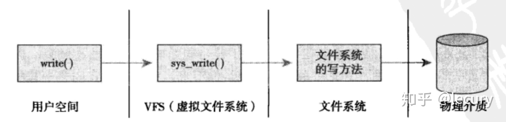

# 基础知识
## Linux 命名空间 namespace 
> 参考资料  
> https://www.missshi.cn/api/view/blog/5d08561a3b4ab21b71000002  
> https://www.cnblogs.com/sparkdev/p/9365405.html  
> https://zhuanlan.zhihu.com/p/73248894

传统上，在Linux以及其他衍生的UNIX变体中，许多资源是全局管理的。例如，系统中的所有进程按照惯例是通过PID标识的，这意味着内核必须管理一个全局的PID列表。用户ID的管理方式类似，即各个用户是通过一个全局唯一的UID号标识。  

全局ID使得内核可以有选择地允许或拒绝某些特权。虽然UID为0的root用户基本上允许做任何事，但其他用户ID则会受到限制。例如UID为n 的用户，不允许杀死属于用户m的进程（m≠ n）。但这不能防止用户看到彼此，即用户n可以看到另一个用户m也在计算机上活动。如果提供Web主机的供应商打算向用户提供Linux计算机的全部访问权限，包括root权限在内。使用KVM或VMWare提供的虚拟化环境是一种解决问题的方法，但是在虚拟化的系统中，一台物理计算机可以运行多个内核，可能是并行的多个不同的操作系统。  

命名空间提供了一种不同的解决方案，所需资源较少。一些进程只能看到与自己相关的一部分资源，而另外一些进程也只能看到与它们自己相关的资源，这两拨进程根本就感觉不到对方的存在。命名空间则只使用一个内核在一台物理计算机上运作，前述的所有全局资源都通过命名空间抽象起来。这使得可以将一组进程放置到容器中，各个容器彼此隔离。隔离可以使容器的成员与其他容器毫无关系。但也可以通过允许容器进行一定的共享，来降低容器之间的分隔。例如，容器可以设置为使用自身的PID集合，但仍然与其他容器共享部分文件系统。  

假设有三个命名空间。一个命名空间是父命名空间，衍生了两个子命名空间。假定容器用于虚拟主机配置中，其中的每个容器必须看起来像是单独的一台Linux计算机。因此其中每一个都有自身的init进程，PID为0，其他进程的PID以递增次序分配。两个子命名空间都有PID为0的init进程，以及PID分别为2和3的两个进程。由于相同的PID在系统中出现多次，PID号不是全局唯一的。虽然子容器不了解系统中的其他容器，但父容器知道子命名空间的存在，也可以看到其中执行的所有进程。而且子容器的进程映射到父容器中，例如PID映射为4到9。

如果命名空间包含的是比较简单的量，也可以是非层次的。  

所以，每个进程的 task_struct 里面都会有一个指针，指向 namespace 结构体的指针 nsproxy。该结构体中定义了5个指向各个类型namespace的指针，由于多个进程可以使用同一个namespace，所以nsproxy可以共享使用
```c
/* 'count' is the number of tasks holding a reference.
 * The count for each namespace, then, will be the number
 * of nsproxies pointing to it, not the number of tasks.
 * The nsproxy is shared by tasks which share all namespaces.
 * As soon as a single namespace is cloned or unshared, the
 * nsproxy is copied
*/
struct nsproxy
{
         atomic_t count;
         struct uts_namespace *uts_ns;
         struct ipc_namespace *ipc_ns;
         struct mnt_namespace *mnt_ns;
         struct pid_namespace *pid_ns_for_children;
         struct net             *net_ns;
};
```
Linux在不断的添加命名空间，目前有：
>mount：挂载命名空间，使进程有一个独立的挂载文件系统，始于Linux 2.4.19  
ipc：ipc命名空间，使进程有一个独立的ipc，包括消息队列，共享内存和信号量，始于Linux 2.6.19  
uts：uts命名空间，使进程有一个独立的hostname和domainname，始于Linux 2.6.19  
net：network命令空间，使进程有一个独立的网络栈，始于Linux 2.6.24  
pid：pid命名空间，使进程有一个独立的pid空间，始于Linux 2.6.24  
user：user命名空间，是进程有一个独立的user空间，始于Linux 2.6.23，结束于Linux 3.8  
cgroup：cgroup命名空间，使进程有一个独立的cgroup控制组，始于Linux 4.6  
Linux的每个进程都具有命名空间，可以在/proc/PID/ns目录中看到命名空间的文件描述符。  

`/proc/[pid]/ns` 目录下会包含进程所属的 namespace 信息  

和 namespace 相关的 API 只有三个：  
1. clone()  
    ```c
    int clone(int (*child_func)(void *), void *child_stack, int flags, void *arg);
    ```
    创建一个**新的进程**并把他放到**新的namespace**中。  
    clone() 其实是 linux 系统调用 fork() 的一种更通用的实现方式，它可以通过 flags 来控制使用多少功能。  
    + fn：指定一个由新进程执行的函数。当这个函数返回时，子进程终止。该函数返回一个整数，表示子进程的退出代码。  
    + child_stack：传入子进程使用的栈空间，也就是把用户态堆栈指针赋给子进程的 esp 寄存器。调用进程(指调用 clone() 的进程)应该总是为子进程分配新的堆栈。  
    + flags：表示使用哪些 CLONE_ 开头的标志位，与 namespace 相关的有CLONE_NEWIPC、CLONE_NEWNET、CLONE_NEWNS、  LONE_NEWPID、CLONE_NEWUSER、CLONE_NEWUTS 和 CLONE_NEWCGROUP。  
    + arg：指向传递给 fn() 函数的参数。  
2. setns()
    ```c
    int setns(int fd, int nstype);
    ```  
    将当前进程加入到已有的 namespace 中。  
    + fd：表示要加入 namespace 的文件描述符。它是一个指向 /proc/[pid]/ns 目录中文件的文件描述符，可以通过直接打开该目录下的链接文件或者打开一个挂载了该目录下链接文件的文件得到。
3. unshare()
    ```c
    int unshare(int flags);
    ```  
    使当前进程退出指定类型的namespace，并加入到新创建的namespace（相当于创建并加入新的namespace）  
    + flags用于指定一个或者多个上面的CLONE_NEW*宏定义

> Tip: PID Namespace 很特殊。unshare() 和 setns() 不会改变当前调用进程的 PID，而是接下来创建的第一个子进程开始改变 PID。因为对用户态的程序和库函数来说，他们都认为进程的 PID 是一个常量，PID 的变化会引起这些进程奔溃。
> Tip：namespace 是 linux 内核提供的特性，为虚拟化而生。namespace 技术是 docker 技术背后的支柱。

## Linux 文件系统
### 虚拟文件系统 VFS 与 挂载
虚拟文件系统（Virtual File System，简称VFS）是 Linux 内核的子系统之一，它为用户程序提供文件和文件系统操作的统一接口，屏蔽不同文件系统的差异和操作细节。借助 VFS 可以直接使用 open()、read()、write() 这样的系统调用操作文件，而无须考虑具体的文件系统和实际的存储介质。通过VFS系统，Linux提供了通用的系统调用，可以跨越不同文件系统和介质之间执行，极大简化了用户访问不同文件系统的过程。

VFS 之所以能够衔接各种各样的文件系统，是因为它抽象了一个通用的文件系统模型，定义了通用文件系统都支持的、概念上的接口。新的文件系统只要支持并实现这些接口，并注册到 Linux 内核中，即可安装和使用。

VFS 有四种对象类型：超级块对象、索引节点对象、目录项对象、文件对象。其中，超级块用于存储文件系统的元信息，如文件系统类型、大小、区块数、操作方法 s_op 等。



挂载是利用一个目录当成进入点（类似选一个现成的目录作为代理），将文件系统放置在该目录下，也就是说，进入该目录就可以读取该文件系统的内容，类似整个文件系统只是目录树的一个文件夹（目录）。这个进入点的目录我们称为「挂载点」。**根目录一定需要挂载到某个分区，称为 rootfs**。 而其他的目录则可依用户自己的需求来给予挂载到不同的分去。

总结：硬盘经过分区和格式化，每个区都成为了一个文件系统（ext4、xfs 等），挂载这个文件系统后就可以让 Linux 操作系统通过 VFS 访问硬盘时跟访问一个普通文件夹一样。