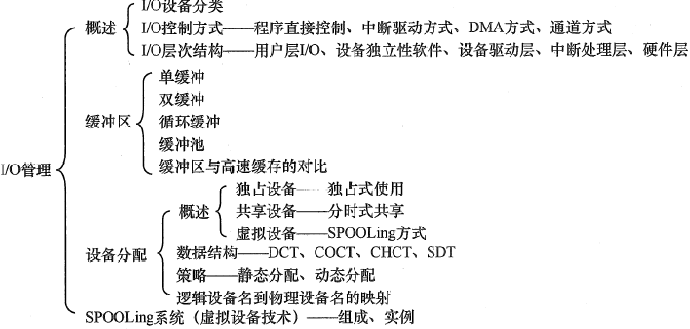

# IO

## 基本知识

### 缓冲区和高速缓存

缓冲区指的是 Buffer，缓和 CPU 与 I/O 设备间速度不匹配的矛盾。设备和处理机交换数据时，先把被交换数据写入缓冲区。

高速缓存指低速设备上的某些数据的镜像，高速缓存上有的数据低速设备上面必然有。通过存放经常访问的数据，减少 IO 操作，直接从磁盘读。

### Spooling技术

通过 Spooling 技术便可将一台物理 I/O 设备虚拟为多台逻辑 I/O 设备，同样允许多个用户共享一台物理 I/O 设备。（比如速度很慢的打印机）

Spooling 系统主要有以下三部分：

（1）输入井和输出井。这是在磁盘上开辟的两个大存储空间。**输入井是模拟脱机输入时的磁盘设备**，用于**暂存 I/O 设备输入**的数据；**输出井是模拟脱机输出时的磁盘设备**，用于**暂存用户程序的输出**数据。

（2）输入缓冲区和输出缓冲区。缓和 CPU 和 磁盘之间速度不匹配的矛盾，在内存中开辟的两个缓冲区。输入缓冲区用于暂存由输入设备送来的数据，以后再传 送到输入井。输出缓冲区用与暂存从输出井送来的数据，以后在传送给输出设备。

（3）输入进程 SPi 和输入进程 SPo，模拟脱机 I/O 时的外围控制机。

+ 进程 SPi 模拟脱机输入时的外围控制机，**将用户要求的数据从输入机通过输入缓冲区再送到输入井， 当CPU需要输入数据时，直接从输入井读入内存**
+ 进程 SPo 模拟脱机输出时的外围控制机，**把用户要求输出的数据先从内存送到输出井，待输出设备空闲时，在将输出井中的数据经过输出缓冲区送到输出设备上**

Spooling 技术提高了 I/O 速度，缓和了 CPU 速度和低速外设不匹配的问题；将独占设备改造成了共享设备；实现了**独占的虚拟设备**

## Linux