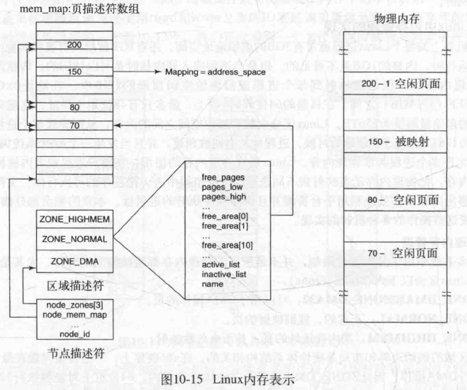

# 内存管理

## 程序的链接&装入

+ 编译：由编译程序将用户源代码编译成若干目标模块

+ 链接：由链接程序将编译后形成的一组目标模块及所需的库函数链接在一起，形成一个完整的装入模块

  > 对相对地址进行修改：通常由编译程序产生的所有目标模块，其起始地址都为 0，要进行变换以拼在一起
  >
  > 变换外部调用符号：模块调用其他模块一开始是使用外部调用符号，此时要改成相对地址

  + 静态链接：在程序运行之前，先把各个目标模块及所需库链接为一个完整的可执行程序，以后不再拆开
  + 装入时动态链接：将应用程序编译后所得到的一组目标模块在**装入内存时**采用边装入边链接的链接方式
  + 运行时动态链接：**直到程序运行过程中**需要一些模块时，才对这些模块进行链接。

+ 装入：由装入程序将装入模块装入内存中运行
  + 绝对装入：在编译时就知道程序将要驻留在内存的物理地址，编译程序产生含有物理地址的目标代码，不适合多道程序设计。
  + 可重定位装入：根据内存当前情况，将装入模块装入到内存的适当位置，地址变换通常在装入时一次 完成，之后不再改变。
  + 动态运行装入：允许程序运行时在内存中移动位置，把装入模块装入到内存后的所有地址都是相对地址，在程序执行过程中每当访问到相应指令或数据时，才将要访问的程序或数据的相对地址转换为物 理地址。动态重定位的实现要依靠硬件地址变换机构。（比如页表就是干这个的？）
+ 覆盖技术：把程序按照其自身逻辑结构，划分为若干个功能上相对独立的程序模块，那些不会同时执行的模块共享一块内存区域，可以用一个段覆盖另一个段。由于覆盖技术要求给出程序段之间的覆盖结构，使得其对用户和程序员不透明。
+ 交换技术：把暂时不用的某个程序及数据部分从内存移到外存中去，以便腾出必要的内存空间；或者把指定的程序或数据从外存读到相应的内存中，并将控制权交给他，让其在系统上运行的一种内存扩充技术。由 OS 自动实现。

## 内存分派方式

+ 连续分配管理方式（略）

  + 单一连续分配
  + 固定分区分配
  + 动态分区分配【分配算法包括，首次适应，最佳适应，最坏适应，循环首次适应等等】

+ 非连续分配方式（略）

  + 基本（请求）分页存储管理方式
  + 基本（请求）分段存储管理方式
  + 段页式管理方式

  > 请求分页通常和虚拟内存结合，在下面介绍

## 虚拟内存（页式）

虚拟内存的目的是为了让物理内存扩充成更大的逻辑内存，从而让程序获得更多的可用内存。

### 分页

操作系统将内存抽象成地址空间。每个程序拥有自己的地址空间，这个地址空间按照固定大小划分成被称为**页面 (page) **的若干单元。这些页被映射到物理内存的**页框  (page frame) **中，页面和页框的**大小通常是一样的**。不需要映射到连续的物理内存，也不需要所有页都必须在物理内存中。当程序引用到不在物理内存中的页时，由硬件执行必要的映射，将缺失的部分装入物理内存并重新执行失败的指令。一个虚拟地址分成两个部分，一部分存储页面号，一部分存储偏移量。

地址转换过程过去由硬件实现（CPU中的 MMU），现在也有基于软件的实现。

> 页表项中含有 P 存在位、 Dirty 位指示此表项所指向的页是否写过数据、PWT 选择写回法还是写直达法 等等位

#### 加速地址变换的查页表过程

上面提到的解决方案是为计算机设置一个小型的硬件设备
将虚拟地址直接映射到物理地址,而不
必再访向页表。

使用转换检测缓冲区 (Translation Lookaside Buffer,**TLB**)或**快表**。通常使用**相联存储器**（可多路查询）保存。类似于 cache，它其实是页表的 cache。

通常是一遍查询 TLB，一遍访问内存中的页表，如果 TLB 没查到就不会浪费 TLB 的等待时间。页表中找到之后会及时的更新 TLB。

#### 访存流程

### 多级页表

引入多级页表的原因是避免把全部页表一直保存在内存中，特别是那些从不需要的页表就不应该保留。比如 32 位地址空间，每个页面大小是 4KB，那一共有 $2^{20}$ 页。如果按照一般进程地址空间划分策略，程序正文段、数据段在最下面，顶端是 4MB 的堆栈段，中间那么大其实啥都没有，但你页表要有。这很蠢啊我不需要这么多页面，那么多页表项也是多余的。所以我拆成二级页表，顶级页表中间那么多指向的二级页表的指针为空，节省了大量页表所占的空间。

### 页面置换算法

> 抖动（颠簸）是指页面在内存与外存储器之间频繁地调度，以致系统用于调度页面的时间比进程实际运行所占用的时间还要长。(FIFO 比较容易出现)

1. 最优页面置换算法 OPT, Optimal replacement algorithm

   所选择的被换出的页面将是最长时间内不再被访问，通常可以保证获得最低的缺页率。

   是一种理论上的算法，因为无法知道一个页面多长时间不再被访问。

2. 最近最久未使用 LRU, Least Recently Used

   LRU 将最近最久未使用的页面换出。

   为了实现 LRU，需要在内存中维护一个所有页面的链表。当一个页面被访问时，将这个页面移到链表表头。这样就能保证链表表尾的页面是最近最久未访问的。因为每次访问都需要更新链表，因此这种方式实现的 LRU 代价很高。

   > Tip：如果面试要让你模拟的话，可以写一个哈希表+双向链表的组合，保证插入删除查询都快。都是 O(1) 诶
   >
   > 

   或者为每个页维护一个计数器

3. 最近未使用 NRU, Not Recently Used

   每个页面都有两个状态位：R 与 M，当页面被访问时设置页面的 R=1，当页面被修改时设置 M=1。其中 R 位会定时被清零。可以将页面分成以下四类：

   - R=0，M=0
   - R=0，M=1
   - R=1，M=0
   - R=1，M=1

   当发生缺页中断时，NRU 算法**随机地**从**类编号最小的非空类中**挑选一个页面将它换出。

   这个算法隐含的意思是，NRU 优先换出最近没用的页面，优先换出已经被修改的脏页面（而不是被频繁使用的干净页面）。

4. 先进先出 FIFO, First In First Out

   选择换出的页面是最先进入的页面。该算法可能会将那些经常被访问的页面换出，导致缺页率升高。

   Belady 奇异现象，是指采用页面置换FIFO算法时，如果对一个进程未分配它所要求的全部页面，有时就会出现分配的页面数增多，但缺页率反而提高的异常现象。

5. 二次机会法。FIFO 算法可能会把经常使用的页面置换出去，对该算法做一个简单的修改：

   当页面被访问 (读或写) 时设置该页面的 R 位为 1。需要替换的时候，检查最老页面的 R 位。如果 R 位是 0，那么这个页面既老又没有被使用，可以置换掉；如果是 1，就将 R 位清 0，并把该页面放到链表的尾端，修改它的装入时间使它就像刚装入的一样。

6.  时钟

   第二次机会算法需要在链表中移动页面，降低了效率。时钟算法使用环形链表将页面连接起来，再使用一个指针指向最老的页面。

   

7. 工作集和工作及页面置换算法

   **工作集**

   一个进程当前正在使用的页面集合称为工作集。如果整个工作集都在内存中，在进入下一个运行阶段之前进程的运行不会引起很多页面故障。如果内存太小无法容纳整个工作集，进程运行将引起大量的页面置换。当然这不是无限增大的，工作集有一个最大的大小（称为工作集窗口大小）。

   通常工作集随时间变化很慢，那么当程序重新开始时，就有可能根据它上次结束时的工作集对要用到的页面做一个合理的推测，预先调页（在程序继续运行之前预先装入推测出的工作集的页面）。

   **工作集页面置换算法**

   相对的，一种合理的页面置换算法就是，淘汰一个不在工作集中的页面。演化为，淘汰一个最近 t ms 内未访问的页面。

   每隔一段时间会有定时任务清空 R 位（这个时间间隔小于 t）

   

   **工作集页面时钟置换算法**

   当缺页中断发生后，基本工作集算法需要扫描整个页表才能确定被淘汰的页面，是比较费时的。可以基于时钟算法改进。由于它实现简单，性能较好，所以在实际工作中得到了广泛应用。

   有一种改进的算法，它基于时钟算法，并且使用了工作集信息，称为WSClock(工作集时钟)算法(Carr和Hennessey，1981)。由于它实现简单，性能较好，所以在实际工作中得到了广泛应用。

   【具体略，下面的可以不用管，waste of time】像时钟一样扫一圈

   + 如果 R==1 说明最近用过，不换，将 R 置为 0。
   + R==0 的时候：
     + 如果页面的生存时间大于并且该页面是干净的，它大概就不在工作集中，换掉。 
     + 如果是脏页面就不换，避免主动调度一个写磁盘操作。（但是应该会有后台进程来不断执行写回操作）
     + 如果转了一圈还没找到。如果转了一圈有调度过写操作，那写回的这个页面当前是干净的页面，把它换了。如果还是没有，说明所有页面都在工作集里，那就随便换一个页面（优选干净的）。

### 一些设计上的问题

#### 全局置换 or 局部置换

局部算法可以有效地为每个进程分配固定的内存片段。全局算法在可运行进程之间动态地分配页框，因此分配给各个进程的页框数是随时间变化的。通常对每个进程都规定一个最小页框数，防止太小造成颠簸。

#### 页面大小

过大的页面大小会造成内部碎片，过小则会需要更多的页表。综合来说，现在常见的页面大小是 4KB or 8KB。

#### 共享库

共享库最好使用相对地址（往前/后跳 n 个字节），而不是绝对地址（0xf1010之类的）。因为如果用绝对地址，在动态链接的时候要修改它的地址。如果有两个程序共用，很难保证修改之后的逻辑地址是相同的。【内存映像文件的特例，值把一个文件映射到进程空间的一部分，易于共享】

#### 清除策略

如果发生缺页中断时系统中有大量的空闲页框，此时分页系统工作在最佳状态（不然急着要页面置换的时候，还要先把旧页面写回磁盘）。

为保证有足够的空闲页框,很多分页系统有一个称为分页守护进程的后台进程，定期被唤醒以检查内存的状态，如果空闲页框过少，通过预定的页面置换算法选择页面换出内存。如果这些页面装入内存后被修改过，则将它们写回磁盘。当需要使用一个已被淘汰的页面时，如果该页框还没有被覆盖，可以直接恢复该页面。

#### 虚拟内存的后备存储

与每个进程对应的是其交换区的磁盘地址，即进程映像所保存的地方。这一信息是记录在进程表里的。在进程启动前必须初始化交换区，一种方法是将整个进程映像复制到交换区，以便随时可将所需内容装入，另一种方法是将整个进程装入内存，并在需要时换出。

写回一个页面时，计算写回地址的过程很简单：将虚拟地址空间中页面的偏移量加到交换区的开始地址。

但这种简单模式有一个问题:进程在启动后可能增大，尽管程序正文通常是固定的，但数据有时会增长，堆栈也总是在随时增长。最好为正文、数据和堆栈分别保留交换区，并且允许这些交换区在磁盘上多于一个块。

## Linux 内存管理

### Linux 进程的空间

对于 32 位 OS 来说，每个进程都被分配了 4GB 的虚拟内存，下文将默认用这个数值讨论。（实际上 32 位 OS 也只能寻址 4GB 空间）

> 对于 64 位 OS 来说，没必要 $ 2^{64} $这么大的寻址空间，一般是 $2^{48}$位空间。

进程空间分为用户空间和内核空间。用户进程通常只能访问用户空间的虚拟地址，只有在执行内陷操作或系统调用时才能访问内核空间。内核空间是所有进程共享的，即不同进程地址空间中， 内核空间总是映射到相同的物理内存上。当你的进程发生中断或使用各种系统调用时，会陷入到内核空间中，从而执行某些高权限指令。内核空间中是 OS 的内核，比如包括了中断处理程序等等（所以每个程序都要能够关联到内核空间，不然咋系统调用）。内核空间具体暂且不表，我们来看用户空间：

#### 用户空间

| 名称           | 存储内容                                                |
| -------------- | ------------------------------------------------------- |
| 栈             | **局部变量、函数参数、返回地址**等                      |
| 堆             | 动态分配的内存                                          |
| （内存映像段） | 内存映像文件                                            |
| BSS段          | **未初始化或初值为0**的全局变量和静态局部变量           |
| 数据段         | **已初始化且初值非0**的全局变量和静态局部变量、常量数据 |
| 代码段         | 可执行程序的机器码                                      |

BSS段、数据段和代码段是可执行程序**编译时确定大小的分段**，在将应用程序加载到内存空间执行时，**操作系统负责代码段、数据段和 BSS 段**的加载，并在内存中为这些段分配空间。**栈也由操作系统**分配和管理；**堆由程序员**自己管理，即显式地申请和释放空间。

BSS 段的存在是一个优化，如果未初始化或初始化位 0，可能需要分配很多全是 0 的物理页框，没必要，所以编译器只需要在执行文件头部加入一个字段，表明 BSS 空间有多大。系统初始化时，Linux 就分配了一个静态零页面，即一个全 0 的写保护页面。当加载程序的时候，未初始化数据区域被设置为指向该零页面。当一个进程真正要写这个区域的时候，写时复制的机制就开始起作用，一个实际的页框被分配给该进程。

当运行相同的程序，代码段是可以共享的。数据段和栈段一般不共享（除非是父子进程且没有修改）。

内存映像文件是指把一个文件映射到进程空间的一部分，该文件可以像位于内存中的字节数组一样被读写。把一个文件映射进来使得**随机读写**比使用 read 和 write 之类的 IO 系统调用要容易得多。共享库的访问就是用这种机制映射进来后进行的。一个文件可以被同时映射到两个进程中，且可以在不同的虚拟地址上。可以通过 mmap 函数和 munmap 函数来映射文件或取消映射文件。

#### 内核空间

> **所有的页表都在内核空间中**。如果页表在用户空间，那么用户就可能自己修改页表，映射任意的内存地址，访问任何内存，甚至是直接操作硬件，进程间、内核的隔离保护就失去了意义。
>
> 内核页表一般指的是内核地址空间的页表，用户页表表示用户地址空间的。
>
> 直接映射：逻辑页和页框一对一固定映射，不会映射到别的页框，但并不意味一直在页框里。

内核空间包括了内核镜像、物理页面表、驱动程序等运行在内核空间 。

内核空间划分：

+ 直接映射区：从内核空间起始地址开始，最大的一段内核空间地址区间，为直接内存映射区。（大概就是896M）即 （和 ZONE_DMA + ZONE_NORMAL 没有任何关系）

  > 内核作为整个系统的管理者，它的性能必须高，不能成为系统的瓶颈；用户在运行过程中，内核态必须创建很多管理对象，才能将用户态业务管理好。比如 task_struct, file, inode 等关键数据结构。内核如果在创建这些对象时，从伙伴系统里面（再通过 slab）分配内存，然后才通过内核页表建立映射关系，那么性能必然会比较差。所以内核在运行过程中，动态创建的管理对象所在的内存空间，提前映射好，就是一个简单的偏移量。

  直接映射区的的「线性地址」直接与「物理地址」（的前`896MB`）进行映射，说线性地址和分配的物理地址都是连续的。内核地址空间的线性地址`0xC0000001`所对应的物理地址为`0x00000001`，它们之间相差一个偏移量`PAGE_OFFSET = 0xC0000000`

  【**内核**和**内存映射**固定在内存中，页面从不换出】【其他空间虽然是直接映射，但不一定不换出，会和用户争用噢】

  > 这里的内存映射指：所有**系统物理**内存使用情况的信息，比如区域、空闲页框等。【在内核空间中描述物理内存，体现了 OS 对硬件的管理】
  >
  > 首先维护一个页描述符数组 mem_map，**每一个页框**都有一个页描述符。每个页描述符中都有一个指针，页框非空时指向其所属地址空间，还有一对指针和其他的页描述符组成双向链表。
  >
  > 物理内存被划分为 3 个区（下面会讲），每个区都有一个区域描述符，包含本区域中内存的使用情况，包括活动、非活动页数等。还包括一个空闲区数组，该数组中的第 i 个元素标记了 $2^i$ 个**连续空闲页**组成的块的第一个页描述符。【用于伙伴系统】既然可能有多块2个空闲页，Linux使用页描述符的指针对把这些页面链接起来：
  >
  > 最后还有一个所谓的节点描述符。非一致性内存访问 NUMA（Non-Uniform Memory Access）意思是内存被划分为各个node，访问一个 node 花费的时间取决于 CPU 离这个 node 的距离。每一个 cpu 内部有一个本地的 node，访问本地node时间比访问其他node的速度快。我们下面全部假设为一致性内存访问 UMA（Uniform Memory Access）也可以称为SMP（Symmetric Multi-Process）对称多处理器。意思是所有的处理器访问内存花费的时间是一样的。也可以理解整个内存只有一个node。
  >
  > 
  >
  > 
  >
  > 

+ 高端内存线性地址空间：【我觉得可以不管】

  + 动态内存映射区：该区域由内核函数 `vmalloc` 来分配，特点是：**线性空间连续**，但是对应的**物理地址空间不一定连续**。
  + 永久内存映射区：XXX
  + 固定映射区：特定的用途

### Linux 内存管理机制

#### 物理空间划分

Linux 将物理内存分为3个管理区，分别是：

+ ZONE_DMA：DMA内存区域。**直接映射**到内核的地址空间。（例如 0MB~16MB之间的内存页框）
+ ZONE_NORMAL：普通内存区域。常规**页框**，**直接映射**到内核的地址空间。（例如 包含16MB~896MB之间的内存页框）
+ ZONE_HIGHMEM：高端内存区域。**不进行直接映射**，可以通过永久映射和临时映射进行这部分内存**页框**的访问。（例如 包含896MB以上的内存页框）

#### 分页策略

Linux 采取四级分页

#### 分配策略——伙伴算法

在 Linux系统中，分区页框分配器管理着所有物理内存，无论你是内核还是进程，都需要请求分区页框分配器，才会分配物理内存页框。每个物理内存的 ZONE（如ZONE_HIGHMEN）都有一个页面分配器。**页面分配器使用伙伴算法。**【除了内核固定不换出的部分，其他会和用户程序发生争抢。】

伙伴算法（Buddy system）把所有的空闲页框分为 11 个块链表，每块链表中分布包含特定的连续页框地址空间，比如第 0 个块链表包含大小为 $2^0$ 个连续的页框，第 1 个块链表中，每个链表元素包含  $2^1$ 个页框大小的连续地址空间，….每个链表中元素的个数在系统初始化时决定，在执行过程中，动态变化。**伙伴算法每次只能分配2的幂次个页框的空间**。（记录方式参见内核的 zone 和 mem_map 结构，先前有述）

例如，要分配 $2^2$ 个页面的内存，算法会先从 free_area[2] ，如果有空闲块，就直接从中摘下并分配出去，如果没有空闲块，就顺着数组向上查找，从它的上一级free_area[3] 中分配，如果free_area[3]中有空闲块，则将其从链表中摘下，分成等大小的两部分，前一半作为一个块插入 free_area[2]，后一半分配出去。依次递推，直到 free_area[max_order]，如果顶级都没有空间，那么就报告分配失败。

回收一块的时候，会尝试和伙伴块合并，一路向上合并到能合并的最高层。

> 优缺点：
>
> + 较好的解决外部碎片问题
> + 一些设备需要连续的物理空间，伙伴算法正好可以解决。它会尽量分配连续空间。
> + 但是因为伙伴算法只能分配 2 的幂次方内存区，所以会存在浪费

##### 小于一个页面的分配：slab

如果要分配比较小的内存空间，比如一个进程描述符 task_struct，那一次给一个页面太浪费了。为了缓解这个问题，Linux有另一个内存分配器，**slab分配器**。它**使用伙伴算法获得内存块**，但是之后从其中**切出 slab(更小的单元)** 并且分别进行管理。

针对频繁地创建和撤销相同类型的对象(如 task_struct)，内核使用了对象缓存机制。这些缓存由指向一个或多个 slab 的指针组成，而 slab 可以存储大量相同类型的对象。例如，当内核需要分配一个新的进程描述符(一个新的 task_struct)的时候，它在 task_struct 结构的对象缓存中寻找，首先试图找一个部分满的 slab 并且在那里分配一个新的 task_struct 对象。如果没有这样的 slab 可用，就在空闲 slab列表中查找。最后，如果必要，它会分配一个新的 slab，把新的 task_struct   结构放在那里，同时把该 slab 连接到 task_struct  结构对象缓存中。

#### 虚拟空间（线性地址）的划分

> Linux的进程地址空间[二] - VMA - 兰新宇的文章 - 知乎 https://zhuanlan.zhihu.com/p/67936075

虽然一个进程独占所有虚拟地址空间，但你不能东存一个西存一个，乱糟糟的空间不好管理。因此，虚拟地址空间被分割成连续页面对齐的区域 vm area。每个区域由一系列连续的页面组成。（注意啊，不是页框连续，也就是说仅仅是虚拟地址连续）。

用户进程的代码段、数据段可能就被映射到一个或多个 vm area。在**虚拟地址空间的区**之间可以有空隙。比如你要在堆上申请空间，就先去看一下堆对应的 vma 是什么，这样才知道我应该什么虚拟地址空间上申请内存。

这些 vm_area 有两种组织形式。一种是链表，一种是红黑树。这样既能顺序遍历，也能够顺序通过虚拟地址找到这个 vma。VMA 会记录这个 area 在磁盘上的备存存储有没有、在哪里。

#### Linux 的页面置换算法

> Linux内存管理之页面回收 - 玩转Linux内核的文章 - 知乎 https://zhuanlan.zhihu.com/p/432150599

感觉 Linux 的页面置换算法不像是那种，立刻马上找出一页跟我换，而是通过页框回收算法，保持一定的空闲页面给伙伴系统，以便下次分配。

启动到时候，init 会开启一个页面守护进程 kswapd，它周期性运行，每次如果检测到空闲页低于一个阈值，就执行页框回收，回收一个固定大小的页面。如果突然要分配一个很大的内存空间且当前可用内存不足，也会触发。

应该尽量找出没有被引用的和近期不可能被使用的页面。因为不方便使用计数器维护 LRU，每次都把访问节点移动到链表队尾开销也很大。所以：

Linux 将页面分配到两个链表中，被分配的页面被分在两个类型的集合（链表组织）中：非活动页面和非活动页面。PFRA 为每个页面维护**两个标记：活动/非活动和是否被引用**。

当页面在活动链表和非活动链表之间移动时，总是放在链表的末尾（假设回收从头部开始）。**当页面没有在链表之间移动时，它们的顺序不会被调整。**移动规则如下：

> When a page is referenced, it moves to a more active state
> After two accesses, it moves to the active list
> When a page hasn’t been used for a while, it moves a less active state（或者扫描它一次）
> After two timeouts, it moves to the inactive list
> If memory is getting low, pages can be demoted regardless of activity state

内存管理系统的一个方面是另一个守护进程 pdflush，周期性醒来（通常是每500ms)，把非常旧的 “脏”(dirty) 页面写回到磁盘。也可以被显式的唤醒。
