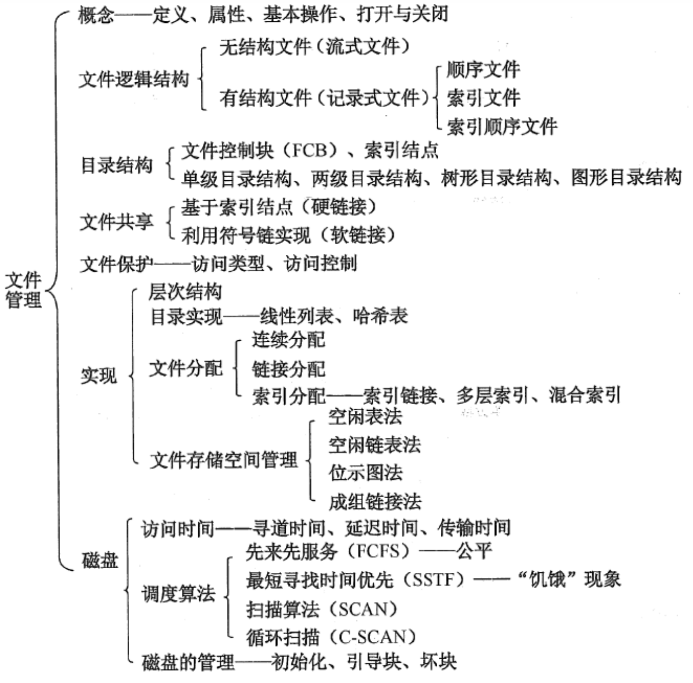
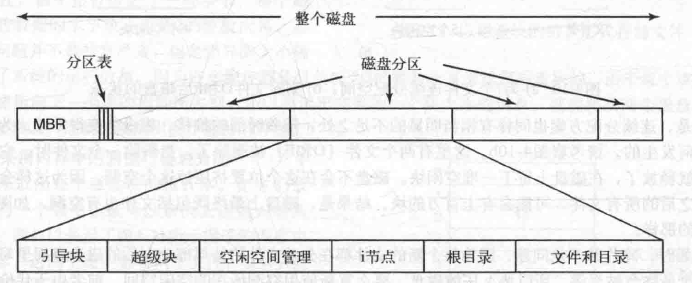
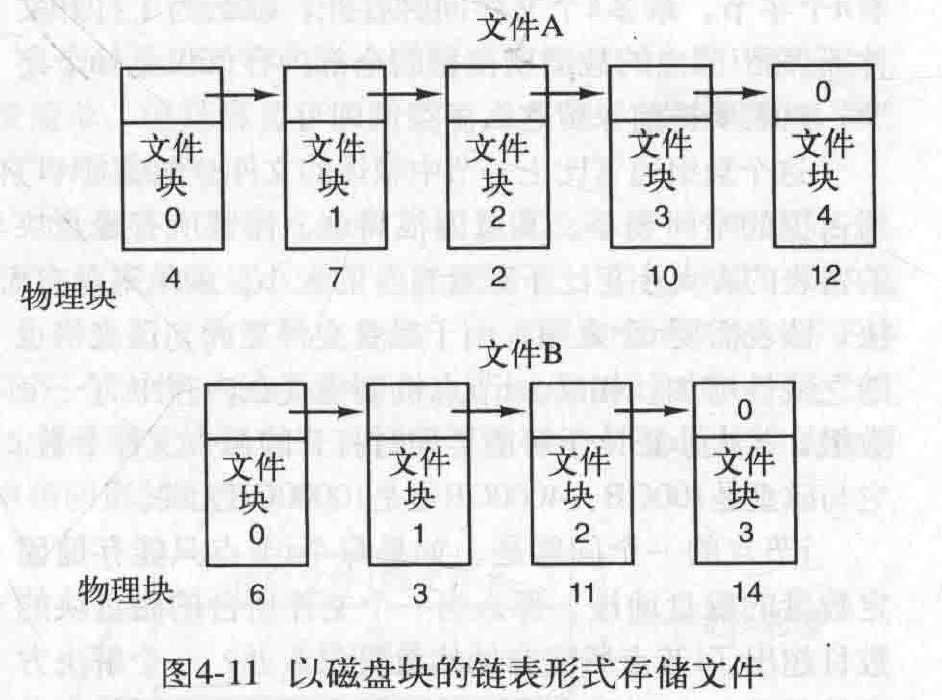
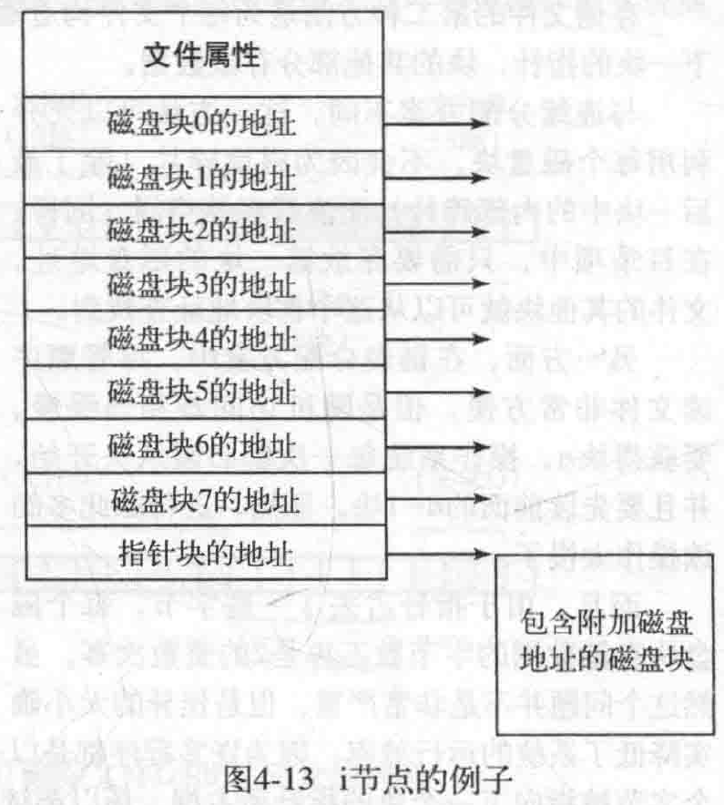
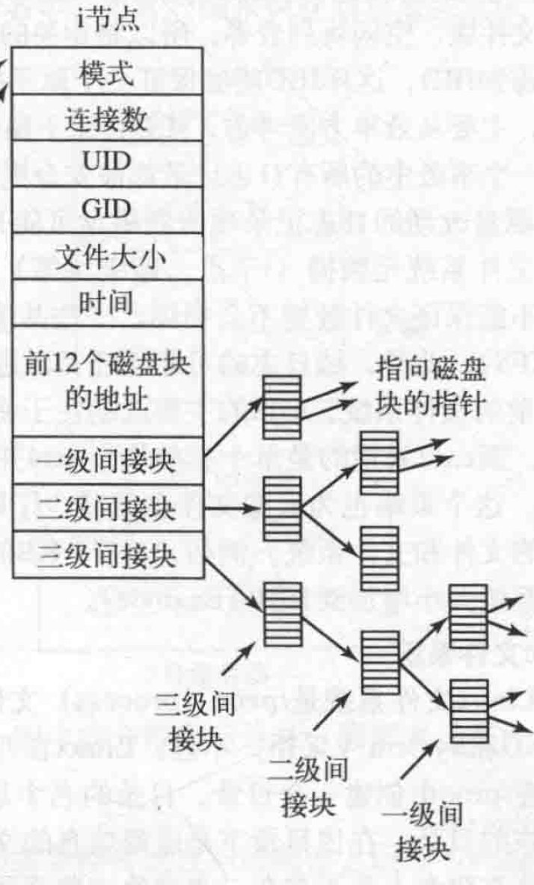
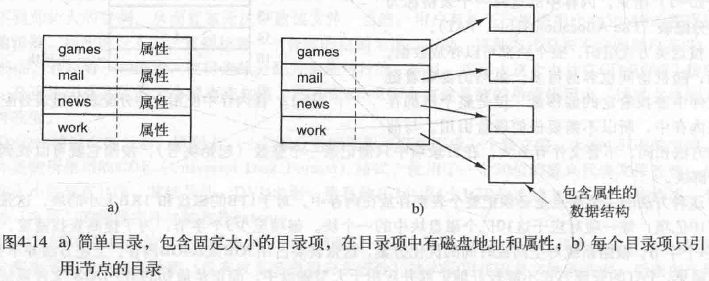
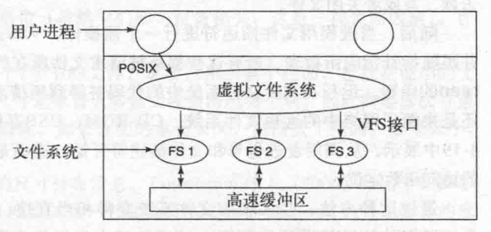
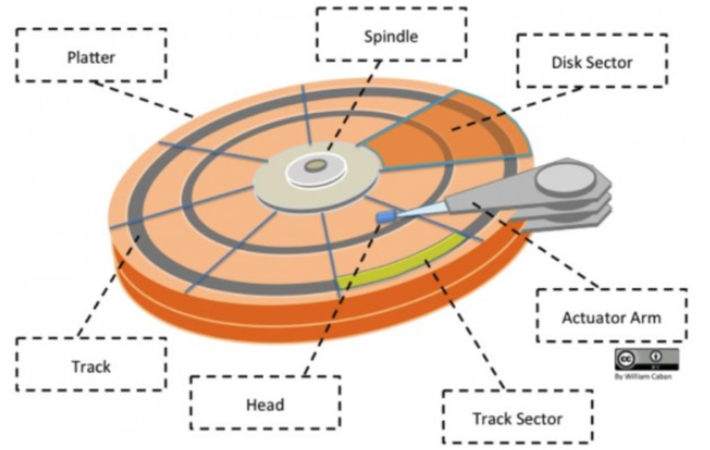
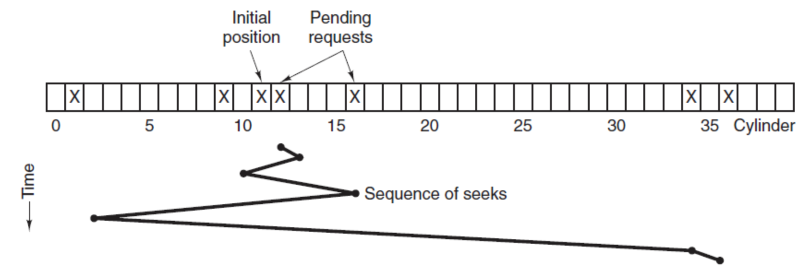
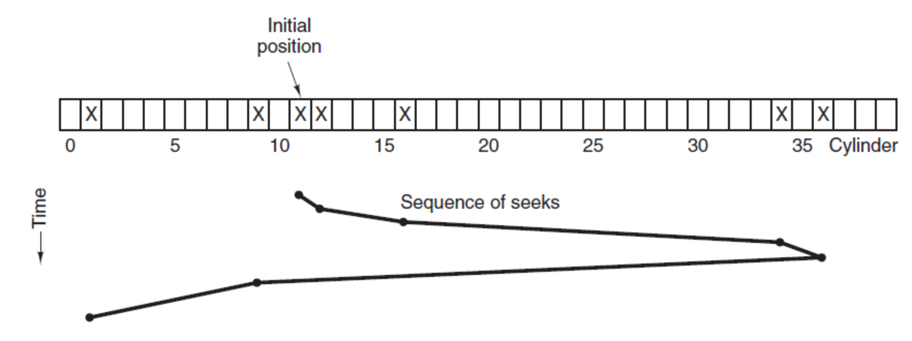

# 文件与磁盘【简略的整理下，似乎不怎么问】

## 基本知识

### 文件逻辑结构

> 索引文件：除了文件本身（称做数据区）之外，另建立一张指示逻辑记录和物理记录之间对应关系的表。（例如用来应对变长的文件）
>
> 若数据区中的记录也按关键字顺序排列，则称索引顺序文件。

### 文件系统布局

多数磁盘划分为一个或多个分区，每个分区中有一个独立的文件系统。

磁盘的 0 号扇区称为主引导记录(Master Boot Record,MBR)，用来引导计算机。在MBR的结尾是分区表。该表给出了每个分区的起始和结束地址。表中的一个分区被标记为活动分区。在计算机被引导时，BIOS读入并执行 MBR，MBR 做的第一件事是确定活动分区，读入它的第一个块，称为引导块(bootblock)，并执行之。引导块中的程序将装载该分区中的操作系统。

每个分区都从一个引导块开始,即使它不含有一个可启动的操作系统。不过，未来这个分区也许会有一个操作系统的。磁盘分区的布局是随着文件系统的不同而变化的。通常还包括：

+ 超级块(superblock)，超级块包含文件系统的所有关键参数。超级块中的典型信息包括：确定文件系统类型用的魔数、文件系统中块的数量以及其他重要的管理信息。

+ 空闲块的信息，例如，可以用位图或指针列表的形式给出。

+ i 节点区。i 节点区存放 i 节点，i 节点是对文件进行控制和管理的一种数据结构。（包括文件数据在哪些磁盘块上、权限等）

  > maybe：目录系统中的文件通常会连接到 i 节点。

+ 根目录，它存放文件系统目录树的根部。

+ 其他部分存放了其他所有的目录和文件。

### 文件系统空间管理

空闲表法、空闲链表法、位图法、成组链接法

### 文件分配

连续分配、链表分配（包括使用静态链表）、用 i 节点（index node）记录

|  |  |  |
| ------------------------------------------------------------ | ------------------------------------------------------------ | ------------------------------------------------------------ |

i 节点的一个问题是，每个 i 节点只能存储固定数量的磁盘地址，那么当一个文件所含的磁盘块的数目超出了 i 节点所能容纳的数目，可以指向其他存放地址的磁盘块的磁盘块。（所谓的间址）

### 文件共享

不同目录下共享同一文件的方法：

+ 基于索引节点（硬链接）：两个不同目录下的目录项，指向同一个文件描述结构（比如索引节点 i 节点），其指明了这个文件的各类信息，包括存储的磁盘块位置等。这样就共享了。
+ 符号链接（软链接）：系统建立一个类型为 LINK 的新文件，新的文件中只包含了它所链接的文件的路径名。当读该链接文件时，操作系统查看到要读的文件是 LINK 类型，则找到该文件所链接的文件的名字，并且去读那个文件。

### 目录结构

目录项中提供了查找文件磁盘块所需要的信息。因系统而异，这些信息有可能是整个文件的磁盘地址（对于连续分配方案)、第一个块的编号（对于两种链表分配方案或者是 i 节点号。无论怎样，**目录系统能够把文件名映射成定位文件数据所需的信息**。

对于采用 i 节点的系统，还可以把文件属性存放在 i 节点中而不是目录项中。在这种情形下，目录项会更短：只有文件名和 i 节点号。与把属性存放到目录项中相比，这种方法更好。

### 日志文件系统 & 虚拟文件系统

#### 日志文件系统 LFS

考虑到发展趋势（如 RAM 增大 -> 磁盘高速缓存迅速增加），未来大部分的文件系统操作都是零碎的写操作。（零碎：比如创建一个文件要写 目录快的 inode（大小变化了）、目录块、新建文件的目录块、文件本身）。而零碎的写操作很没有效率，要不停的训导、旋转延迟、再写入。前两个操作还很耗时。

怎么搞？将磁盘结构化为一个日志，**每隔一段时间或需要时，被缓冲在内存中的所有未决的写操作都被写到一个单独的段中，作为日志末尾的一个段写入磁盘**。这个单独的段可能会包括i节点、目录块、数据块或者都有。每一个段的开始都是该段的**摘要**，说明该段中都包含哪些内容。这样连续完整写入，比较高效。

在 LFS 的设计中，同样存在着 i 节点，但是 i 节点分散在整个日志中，而不是放在磁盘的某一个固定位置。尽管如此，当一个 i 节点被定位后，定位一个块就用通常的方式来完成。当然，由于这种设计，要在磁盘中找到一个 i 节点就变得比较困难了。为了能够找到 i 节点，必须要维护一个**由 i 节点编号索引组成的 i 节点图**。在这个图中的表项 i 指向磁盘中的第 i 个 i 节点。**这个图保存在磁盘上，但是也保存在高速缓存中**，因此，大多数情况下这个图的**最常用部分还是在内存中**。

删除的不用的旧文件会由清理线程腾出来空的 i 节点和磁盘块，可以视为放到了一个环形缓冲区，以供后续使用。

微软 NTFS，Linux ext3 就使用了日志文件系统。

#### 虚拟文件系统

抽象出所有文件系统都共有的部分，并且将这部分代码放在单独的一层，该层调用底层的实际文件系统来具体管理数据。

所有和文件相关的系统调用在最初的处理上都指向虚拟文件系统。这些来自用户进程的调用，都是标准的POSIX系统调用，比如 open、read、write 和 lseek 等。因此，VFS 对用户进程有一个“上层”接口，它就是著名的 POSIX 接口。

> /ˈpɒzɪks/

### 磁盘

#### 磁盘结构

- 盘面（Platter）：一个磁盘有多个盘面；
- 磁道（Track）：盘面上的圆形带状区域，一个盘面可以有多个磁道；
- 扇区（Track Sector）：磁道上的一个弧段，一个磁道可以有多个扇区，它是最小的物理储存单位，目前主要有 512 bytes 与 4 K 两种大小；
- 磁头（Head）：与盘面非常接近，能够将盘面上的磁场转换为电信号（读），或者将电信号转换为盘面的磁场（写）；
- 制动手臂（Actuator arm）：用于在磁道之间移动磁头；
- 主轴（Spindle）：使整个盘面转动。

#### 磁盘调度算法

读写一个磁盘块的时间的影响因素有：

- 旋转时间（主轴转动盘面，使得磁头移动到适当的扇区上）
- 寻道时间（制动手臂移动，使得磁头移动到适当的磁道上）
- 实际的数据传输时间

其中，寻道时间最长，因此磁盘调度的主要目标是使磁盘的平均寻道时间最短。

1. 先来先服务 FCFS, First Come First Served

   按照磁盘请求的顺序进行调度。

   优点是公平和简单。缺点也很明显，因为未对寻道做任何优化，使平均寻道时间可能较长。

2. 最短寻道时间优先 SSTF, Shortest Seek Time First

   优先调度与当前磁头所在磁道距离最近的磁道。

   虽然平均寻道时间比较低，但是不够公平。如果新到达的磁道请求总是比一个在等待的磁道请求近，那么在等待的磁道请求会一直等待下去，也就是出现饥饿现象。具体来说，两端的磁道请求更容易出现饥饿现象。

   

3. 电梯算法（扫描算法） SCAN

   电梯总是保持一个方向运行，直到该方向没有请求为止，然后改变运行方向。

   电梯算法（扫描算法）和电梯的运行过程类似，总是按一个方向来进行磁盘调度，直到该方向上没有未完成的磁盘请求，然后改变方向。

   因为考虑了移动方向，因此所有的磁盘请求都会被满足，解决了 SSTF 的饥饿问题。

   

## Linux 中

inode...