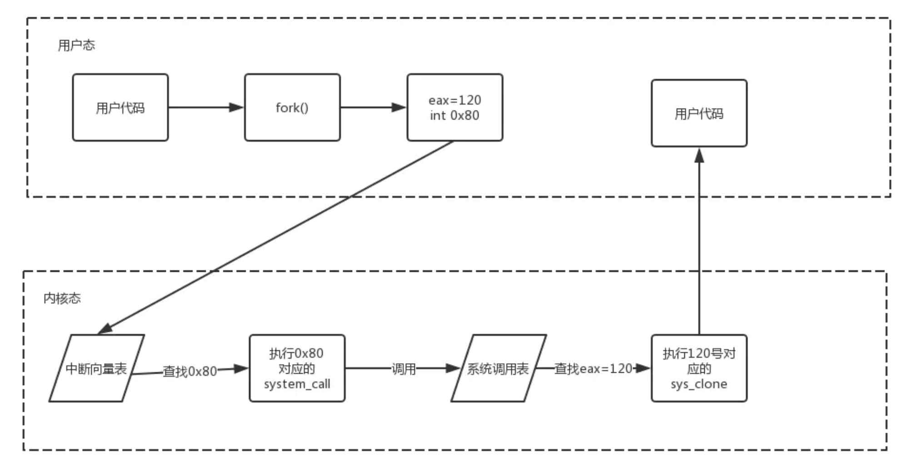

# 概述

> 什么是 OS：资源管理者（各类资源的时空复用）

> 一点硬件知识：
> 
> + 冯诺依曼体系结构
>   
>   
> 
> + x86 架构
>   
>   

## 基本特征

### 并发

并发是指宏观上在**一段时间内**能同时运行多个程序，而并行则指**同一时刻**能运行多个指令。

并行需要硬件支持，如多流水线、多核处理器或者分布式计算系统。

**操作系统通过引入进程和线程，使得程序能够并发运行。**

### 共享

共享是指系统中的**资源**可以被多个并发进程共同使用。

有两种共享方式：互斥共享和同时共享。

互斥共享的资源称为临界资源，例如打印机等，在同一时刻只允许一个进程访问，需要**用同步机制来实现互斥访问**。

### 虚拟

虚拟技术把**一个物理实体转换为多个逻辑实体**。

主要有两种虚拟技术：时（时间）分复用技术和空（空间）分复用技术。

多个进程能在同一个处理器上并发执行使用了时分复用技术，让每个进程轮流占用处理器，每次只执行一小个时间片并快速切换。

虚拟内存使用了空分复用技术，它将物理内存抽象为地址空间，每个进程都有各自的地址空间。地址空间的页被映射到物理内存，地址空间的页并不需要全部在物理内存中，当使用到一个没有在物理内存的页时，执行页面置换算法，将该页置换到内存中。

### 异步

异步指进程不是一次性执行完毕，而是走走停停，以不可知的速度向前推进。

## 基本功能

一言以蔽之：为用户程序提供计算机资源并管理计算机资源

### 进程管理

进程控制、进程同步、进程通信、死锁处理、处理机调度等。

### 内存管理

内存分配、地址映射、内存保护与共享、虚拟内存等。

### 文件管理

文件存储空间的管理、目录管理、文件读写管理和保护等。

### 设备管理

完成用户的 I/O 请求，方便用户使用各种设备，并提高设备的利用率。

主要包括缓冲管理、设备分配、设备处理、虛拟设备等。

## 系统调用

> 内核态和用户态：
> 
> 为了避免操作系统和关键数据被用户程序破坏，将处理器的执行状态分为内核态和用户态。
> 
> 内核态是操作系统管理程序执行时所处的状态，能够执行包含特权指令在内的一切指令，能够访问系统内所有的存储空间。
> 
> 用户态是用户程序执行时处理器所处的状态，不能执行特权指令，只能访问用户地址空间。
> 
> 用户程序运行在用户态,操作系统内核运行在内核态。

一些 OS 核心功能必须在内核态执行，如进程创建。系统调用是访问这些功能的接口。

如果一个进程在用户态需要使用内核态的功能（比如你要 fork 一个进程），就**进行系统调用从而陷入内核**，由操作系统实现该功能的例程代为完成。

进程从用户态陷入了内核态，这是目的，而使用系统调用，仅仅是达成该目的的手段。

系统调用流程：

> Linux 的系统调用主要有以下这些：
> 
> | Task | 系统调用的封装函数                                       |
> |:----:| ----------------------------------------------- |
> | 进程控制 | fork(); exit(); wait();                         |
> | 进程通信 | pipe(); shmget()（用于共享内存通信）;                     |
> | 文件操作 | open(); read(); write();                        |
> | 设备操作 | ioctl()（input/output control）; read(); write(); |
> | 信息维护 | getpid(); alarm(); sleep();                     |
> | 安全   | chmod(); chown();                               |

## OS 结构

### 宏内核（单内核）和微内核

1. 宏内核
   
   宏内核是将操作系统功能作为一个紧密结合的整体放到内核。
   
   由于各模块共享信息，因此有很高的性能。

2. 微内核
   
   由于操作系统不断复杂，因此将一部分操作系统功能移出内核，从而降低内核的复杂性。**移出的部分根据分层的原则划分成若干服务**，相互独立。
   
   在微内核结构下，**操作系统被划分成小的、定义良好的模块**，只有微内核这一个模块运行在内核态，其余模块运行在用户态。
   
   因为需要频繁地在用户态和核心态之间进行切换，所以会有一定的**性能损失**。

  
 

## 中断与异常

> 中断向量为什么叫中断向量？ - 谭玉刚的回答 - 知乎 https://www.zhihu.com/question/61920725/answer/2261227665
> 
> https://zhuanlan.zhihu.com/p/454700183

+ 外中断
  + 来自外部设备的中断信号（不可屏蔽的严重错误NMI、一些其他中断如鼠标 INTR）
+ 内中断（异常）
  + 自愿中断：如 Linux 通过 INT 0x80 实现系统调用
  + 软件故障：程序运行错误，如出现了除 0
  + 硬件故障：缺页中断

> 中断向量：中断服务程序的入口地址
> 
> 中断描述符表：存储中断处理程序的入口（又称为中断向量表）。

## Linux 的内核结构

> Linux 内核的整体架构 - 关于<em>linux</em>的文章 - 知乎 https://zhuanlan.zhihu.com/p/250522837

### IO 部件

IO 部件包含所有负责与设备交互以及实现联网和存储的 I/O 功能的内核部件。在最高层，这些IO功能全部整合在一个虚拟文件系统层中。

+ 从顶层来看，从某个字符设备、还是块设备、还是网路中读取一个字符（一段字符），都是类似的。

+ 从底层来看，所有的 I/O 操作都要通过某一个设备驱动器。所有的 Linux 驱动程序都可以被分类为字符驱动程序或块驱动程序，两者之间的主要区别是块设备允许查找和随机访问而字符设备不允许。
  
  + 一些程序比如 shell 是面向行的，需要将用户输入到终端中的**字符流**格式化为一行，需要一个行规则。（这里终端指的是交互设备）
    
    > 

+ 从技术上讲，网络设备实际上是字符设备，不过它们的处理和其他字符设备不太一样，因此为了清晰起见将它们单独分类。

+ 磁盘是块设备，需要 I/O 调度器负责分配读写操作，块设备顶层是文件系统。Linux 可能并存多个文件系统，为了向文件系统的实现隐藏不同硬件设备之间的区别，一个通用的通用块层提供了一个可以被所有文件系统使用的抽象。

### 进程管理部件

+ 进程管理部件的最主要任务是进程的创建和终止。
+ 它还包括一个进程调度器，负责选择下一步运行哪个进程或线程。（Linux把进程和线程简单地看作可运行的实体，并使用统一的调度策略对它们进行调度）
+ 信号处理的代码也属于进程管理部件。

### 内存管理部件

内存管理任务包括维护虚拟内存到物理内存的映射，维护最近被访问页面的缓存以及实现一个好的页面置换算法，并且根据需要把需要的数据和代码页读入内存中。
