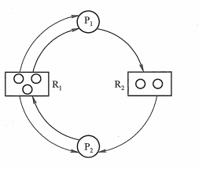
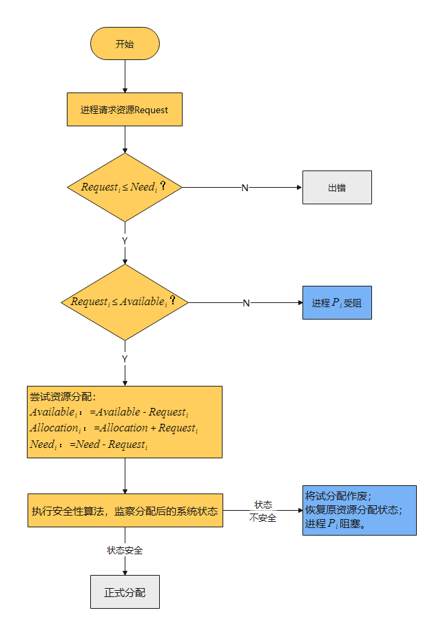

# 死锁

## 导致死锁的必要条件——什么时候会发生

- 互斥：一个资源每次只能被一个进程使用。
- 请求保持：当进程因请求资源而阻塞时，对已获得的资源保持不放。
- 不可抢占：已经分配给一个进程的资源不能强制性地被抢占，它只能被占有它的进程显式地释放。
- 环路等待：有两个或者两个以上的进程组成一条环路，该环路中的每个进程都在等待下一个进程所占有的资源。

## 死锁的处理

### 奥义——不管

假装根本没发生问题。毕竟死锁发生概率和影响一般不会很大。

>  据说大多数操作系统，包括 Unix，Linux 和 Windows，处理死锁问题的办法仅仅是忽略它。可信度未知。

### 死锁预防

破坏四个必要条件中的任意一个，分别是：

+ 破坏互斥条件，允许共享访问：可能出错
+ 不允许请求保持：一种实现方式是规定所有进程在开始执行前请求所需要的全部资源
+ 允许抢占：
+ 不允许环路等待：给资源统一编号，进程只能按编号大小顺序请求资源

### 死锁检测与死锁恢复

+ 检测

系统资源图中，**圆圈代表一个进程，方框代表一类资源，方框内的圆圈代表该类资源的一个单位的资源**。从进程到资源的有向边为请求边，表示该进程申请一个单位的该类资源；从资源到进程的边为分配边，表示该类资源已有一个资源分配给了该进程。

这张图，进程 P1 已经分得了两个 R1 资源，请求了一个 R2 资源；进程 P2 已经分得了两个 R1 资源，并又请求了一个 R2 资源；进程 P2 分得了一个 R1 资源和一个 R2 资源，并又请求了一个 R1 资源。

简化资源分配图，找出请求能够得到满足的节点，假设其正确执行完成，这样已经分配给他的资源就可以释放， 可以后续分配给别的节点。

如果最后整个图中没有有向边的存在，那么就说明没有死锁，相反，如果说资源分配图，不可以进行简化，那么就说明系统出现了死锁。

+ 恢复
  + 资源剥夺法。将一些死锁的进程暂时挂起来，并且抢占它的资源，并将这些资源分配给其他的死锁进程
  + 撤销进程法。强制撤销部分甚至全部死锁状态的进程并剥夺这些进程的资源。
  + 进程回退法，让一或多个进程回退到足以回避死锁的地步。这个方法要求系统保持进程的历史信息，并设置还原点。

### 死锁避免

避免死锁发生：银行家算法。在每次进行资源分配时：

+ 首先检查系统是否有足够的资源满足要求，如果有，则先试行分配
+ 对分配后的新状态进行安全性检查。如果新状态安全，则正式分配上述资源，否则拒绝分配上述资源。

> https://www.cnblogs.com/wkfvawl/p/11929508.html
>
> 银行家算法的实质就是**要设法保证系统动态分配资源后不进入不安全状态，以避免可能产生的死锁。**

> 这是批处理时代的技术，在现代操作系统里根本不存在。
>
> 批处理时代，提交一个作业，不仅要提交代码，还要提交程序将用到的所有输入数据。输入数据都确定了，程序行为（包括最多需要多少资源）在程序运行前就是已知的。