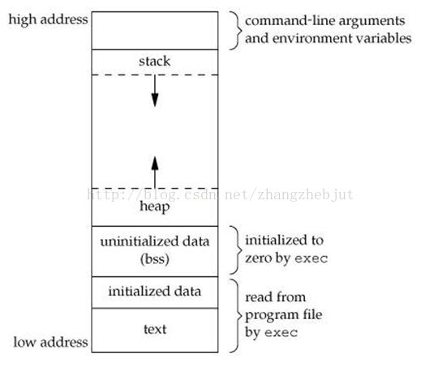
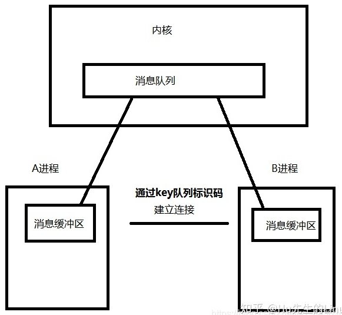
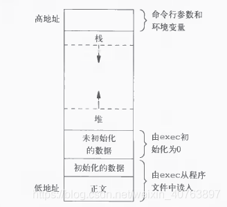
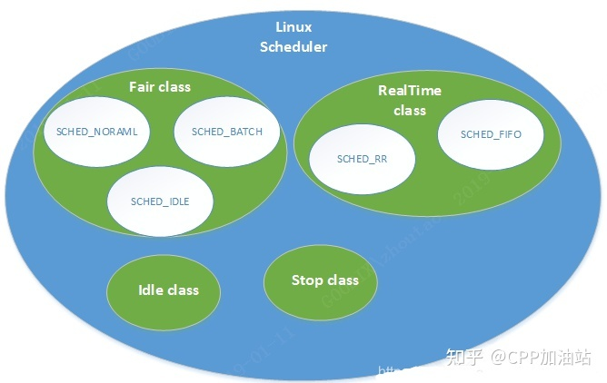

# 进程线程协程管理

干嘛用的：在可用的 CPU 内核有限时，为了具备并发的能力，需要对这些正在执行的程序进行描述与控制。

可以从资源、调度、开销、通信等角度对比他们。

## 进程、线程、协程

### 进程

进程是正在执行的程序的实例。它是资源分配的基本单位（如内存空间）。

#### 进程控制块 (Process Control Block, PCB) 

PCB 描述进程的基本信息和运行状态。系统通过 PCB 来感知进程的存在。（换句话说，PCB 是进程存在的唯一标识）。其包括但不限于：

+ 进程的**标识**信息 PID。
+ **处理机的现场**信息，如通用寄存器、专用寄存器（程序计数器、状态寄存器、用户栈指针等）。当程序中断时保留此时的信息，以便 CPU 返回时能从断点执行 。
+ 进程**调度**信息，比如状态，优先级，阻塞原因（在等待什么事件），等待时间，下一个 PCB 地址指针 等等。
+ 进程**控制和资源占用**信息，如父子进程关系结构、优先级、信号量指针；**页表起始地址**（涉及到内存空间）、资源记录（如拥有的I/O设备， 打开的文件列表）

### 线程

（此处特指 1-1 内核级线程。还有 N-1 的用户级线程和 M-N 的混合型线程，我们统一放到协程里去说）

线程是独立调度的基本单位。相同进程中的线程切换不会引起进程切换。

一个进程中可以有多个线程，如浏览器进程中有很多线程，分别用于 HTTP 请求，渲染等。它们共享进程资源，线程自己基本上不拥有系统资源，只拥有很少的资源，参见下面的结构：

##### 线程控制块（TCB）

+ 线程的**标识**信息 TID。
+ 很少的现场信息：
  + 堆栈指针：指向进程中线程的堆栈
  + 程序计数器：指向线程当前的程序指令
  + 通用寄存器值
+ 线程的状态（运行、就绪、等待、启动、完成）
+ 指向线程所在进程的进程控制块 PCB 的指针

> ```
> Per process items             | Per thread items
> ------------------------------|-----------------
> Address space                 | Program counter
> Global variables              | Registers
> Open files                    | Stack
> Child processes               | State
> Pending alarms                |
> Signals and signal handlers   |
> Accounting information        |
> ```

> 使用C/C++语言的话，数组越界后，很容易就访问到其他线程的栈了，以致有可能导致其他线程的异常。 这一点也从侧面证明一个进程内的多个线程是共享内存的。
>
> |  |  |
> | ------------------------------------------------------ | ------------------------------------------------------------ |

### 用户级线程（协程）

> **这里的回答不准确，等学完 IO 复用之后再回来看看**
>
> 协程的好处有哪些？ - Jakit的回答 - 知乎 https://www.zhihu.com/question/20511233/answer/347651080

> 也来说说协程（1）——由来和概念 - Coldwings的文章 - 知乎 https://zhuanlan.zhihu.com/p/204965836
>
> 也来说说协程（2）——上下文切换 - Coldwings的文章 - 知乎 https://zhuanlan.zhihu.com/p/220025846
>
> https://medium.com/technofunnel/understanding-golang-and-goroutines-72ac3c9a014d

协程与内核级线程十分像，重点在于，OS感知不到协程的存在，协程的创建、**切换在用户态实现**，而不是交给 OS。通常是非抢占式的调度，而是自己让出，简化了资源竞争。

有栈协程就是实现了一个用户态的线程，**用户可以在堆上模拟出协程的栈空间**，当需要进行协程上下文切换的时候，**主线程只需要交换栈空间**和恢复协程的**一些相关的寄存器**的状态就可以实现一个用户态的线程上下文切换，没有了从用户态转换到内核态的切换成本，协程的执行也就更加高效。

如果是 N-1 的用户及线程，一个协程阻塞，会导致该协程所在的线程上的所有协程都被阻塞，不好。而 M-N 混合型协程就可以解决这个问题。具体我们看一下 Golang 的实现。

## 调度与状态切换

### 进程状态切换


### 开销

#### 进程

进程切换的开销：

+ 内存空间
  + 新程序的代码数据、页表可能都不在内存中，可能带来缺页中断，大额开销
  + TLB、cache失效，大额开销

+ 寄存器（包括页表寄存器、通用寄存器、专用寄存器（程序计数器、栈指针等）等等）

由于创建或撤销进程时，系统都要为之分配或回收资源，如内存空间、I/O 设备等，所付出的开销远大于创建或撤销线程时的开销。在进行进程切换时，涉及当前执行进程 CPU 环境的保存及新调度进程 CPU 环境的设置，而线程切换时只需保存和设置少量寄存器内容，开销很小。

#### 系统级线程

线程的切换开销：

+ 修改当前线程标示（用于调度）
+ 程序计数器、通用寄存器、堆栈指针等很少的寄存器
+ 进出内核态的时间开销（可能包括中断处理之类的）

> The cost of thread-to-thread switching is about the same as the cost of entering and exiting the kernel.
>
> https://www.geeksforgeeks.org/difference-between-thread-context-switch-and-process-context-switch/

##### 线程哪方面比协程更优？

1. 线程创建的时候，不需要独立申请新内存空间，往内存塞入大量新数据（比如代码？），不需要往内存里塞入页表等，访存甚至访问外存的开销几乎没有
2. 线程切换的时候，不涉及内存地址空间的变换，不会由于 TLB 全部失效和缓存失效带来大量时间开销
3. 多线程的协作通常比较方便？加锁、信号量比较方便，还有全局变量之类的共享存储空间

#### 用户级线程（协程）

> **这里的回答不准确，等学完 IO 复用之后再回来看看**
>
> 协程的好处有哪些？ - Jakit的回答 - 知乎 https://www.zhihu.com/question/20511233/answer/347651080

##### 协程从哪方面比线程更优？

操作系统线程，在目前的主流实现中，特别是Linux实现中，具备如下特点：

1. 线程的**创建、切换发生在内核态**，完成相应的计算和资源分配后，再次回到用户态，切换线程栈，进而切换到新的线程。这**一进一出就需要进行两次栈切换**。

   除了替换掉栈帧寄存器，还需要保存其他一系列用于调度和检查的资源，这使得单次进入内核的调用将会产生百ns甚至数us级别的开销。

2. 线程的调度不由应用决定（抢占式调度），而是**内核决定**。

   内核并不确切知道当前线程在做什么，正在忙碌中的线程被换出，却切换到某个线程却发现线程还在等待IO这样的情况无法避免，于是多了很多无意义的切换。

但是协程：

1. 协程的创建、切换发生在用户态

   协程的切换无需进入内核态进行调度，也无需保留系统线程必须的其他资源，只需要调整上下文即可，切换几个寄存器和少量状态量的开销仅仅是数ns而已

2. 协程的调度由应用自身决定（协作式调度），协程让出执行机会时才会换出；协程确认已经准备好时才会换入

   协程是应用自身实现的，协程换出是程序确认需要换出时才会发生，换入也可以到应用确实结束等待时再换入，可以减少无意义的切换

尽管在线程数不多，以CPU计算为主的情况，协程的优势也就不明显；但如果待执行的任务里存在大量等待（例如 IO 任务必然伴随大量等待），对比系统线程，协程将具备特别明显的优势。

### 调度算法

1. 批处理系统：保证吞吐量和周转时间，尽量减少进程切换（是否抢占行不一定，通常不是）

   1. 先来先服务 first-come first-serverd（FCFS）
   2. 短作业优先 shortest job first（SJF）
   3. 最短剩余时间优先 shortest remaining time next（SRTN）

2. 交互式系统：快速响应，抢占式的

   1. 时间片轮转（Round Robin）

      > + 如果时间片太小，会导致进程切换得太频繁，在进程切换上就会花过多时间。
      >
      > + 而如果时间片过长，那么实时性就不能得到保证。

   2. 优先级调度

      > + 为了防止低优先级的进程永远等不到调度，可以随着时间的推移增加等待进程的优先级

   3. 多级队列（可以看成是时间片轮转调度算法和优先级调度算法的结合）

      > + 在本级队列未执行完则放入下级队列
      > + 下级队列时间片比上级队列长
      > + 最上面的优先权最高，只有上一个队列为空，才能调度当前队列上的进程。

      

3. 实时系统：实时系统要求一个请求在一个确定时间内得到响应（是否容忍超时？可分为硬实时、软实时），调度算法比较难。

   > 可调度：对于 m 个周期性事件，其发生概率与处理时间之积的和若小于 1，则意味着它能够被实现，是可调度的。

### 内核 进程/线程 调度的一系列问题

#### 调度时机

- 进程状态转换的时刻：进程终止、进程睡眠
- 当前进程的时间片用完时
- 设备驱动程序
- 进程从中断、异常及系统调用返回到用户态时

#### 切换过程


其中，context_switch 包括进程地址空间的切换和处理器状态切换。

#### goroutine 是怎么切换的

> Golang 的 goroutine 是如何实现的？ - 腾讯技术工程的回答 - 知乎 https://www.zhihu.com/question/20862617/answer/921061289

切换时机：

+ 当 goroutine 因为系统调用、互斥锁或通道而被阻塞时，goroutine 将进入睡眠模式（等待队列），并允许 Go 调度运行另一个处于就绪状态的 goroutine；

  【个人猜测在主动进入阻塞的时候，可以主动将控制权转移给 g0。也就是说，进入阻塞的过程可控。这样队列中剩下的 goroutine 还可以新找一个线程去跑，而不至于所有的 goroutine 都阻塞了】

+ 在函数调用时，如果 goroutine 必须增加其堆栈，这会使 Go 调度另一个 goroutine 以避免运行中的 goroutine 独占 CPU 时间片；

+ go 1.14 后支持信号抢占式调度（一个 goroutine 不会一直占用 cpu，在执行超过一段时间后，让出）

  > 每个 M 在初始化的时候，都会注册一个可以接收 sigurg 信号的 handler。这个 sigurg 信号是由一个 sysmon 协程发出的，sysmon 单独占用一个 M，sysmon 每隔一段时间会去检查 goroutine 是否执行超过 10ms 或者是否执行 GC（STW），如果满足条件 sysmon 就会给对应的 M 发送 sigurg 信号，对应的 handler 开始执行，可以考虑进行切换。
  >
  > https://juejin.cn/post/6972893426425528357

> 所以其实 go 1.13 及之前的版本，如果单逻辑内核的话，你写一个死循环的 goroutine，可能会卡死的，其他 goroutine 没有切换机会
>
> 关于go语言协程调度的一个问题(具体请看问题描述)? - 知乎 https://www.zhihu.com/question/32264167

切换时，运行调度程序的 `g0` 会替换当前的 goroutine（感觉也是依赖了不少 handler），然后选出下一个将要运行的 goroutine 替换 `g0` 并在线程上运行。

+ Go 首先需要保存当前执行的指令，以便稍后在同一条指令上恢复 goroutine。程序计数器（`PC`）保存在 Goroutine 的内部结构中（其他寄存器应该也会存吧）
+ 在被阻塞之前，正在运行的 Goroutine 具有其原始堆栈，堆栈将被保存【其实就存个栈顶指针】，以便在 Goroutine 再次运行时进行恢复
+ 切换的原理其实就是修改 PC 寄存器等

## 进程间通信

> - 进程同步：控制多个进程按一定顺序执行；
> - 进程通信：进程间传输信息。
>
> 进程通信是一种手段，而进程同步是一种目的。为了能够达到进程同步的目的，需要让进程进行通信，传输一些进程同步所需要的信息。

### 匿名管道

操作系统在内核中开辟的一段缓冲区，进程1可以将需要交互的数据拷贝到这段缓冲区，进程2就可以读取。

- 只支持半双工通信（单向交替传输）

  不过通常会让一个进程关闭读段，另一个关闭写段，变成单向的通信，方式冲突出错

- 只能在父子进程或者兄弟进程中使用（毕竟要调用 pipe() 得到 fd[0] 和 fd[1]） 


### 命名管道

命名管道是一种实际存在的 FIFO 文件，称作“管道文件”，用于不同进程之间通信。进程间打开同一个 FIFO 文件，进行数据传递。去除了管道只能在父子进程中使用的限制，一般只用做单向的数据传递。

### 消息队列

本质其实是一个内核提供的链表，内核基于这个链表，实现了一个数据结构，存储在**内存中**。

a 进程要给 b 进程发消息，只需要把消息挂在消息队列（可以是中介邮局，也可以是进程自己的信箱）里就行了，b 进程需要的时候再去取消息队列里的消息

+ 每个数据块都被认为**含有一个类型**

+ 消息队列**独立于进程而存在**，两个不相关进程可以通过事先约定的 key 值进行消息收发




### 信号量

> 发送信号量：int kill (pid_t pid, int signo);
>
> 设置信号量处理函数：`void (*signal(int sig, void (*func)(int)))(int)`。返回值类型是`void (*)(int);`，是指向之前的信号处理程序的指针。

### 共享内存

两个进程通过页表将虚拟地址映射到物理地址时，在**物理地址中有一块共同的内存区**，即共享内存，这块内存可以被两个进程同时看到。这样当一个进程进行写操作，另一个进程读操作就可以实现进程间通信。需要主动控制同步与互斥。

对于一个共享内存，实现采用的是引用计数的原理，当进程脱离共享存储区后，计数器减一，挂架成功时，计数器加一，只有当计数器变为零时，才能被删除。当进程终止时，它所附加的共享存储区都会自动脱离。


> 共享内存进行通信的主要好处是效率高，因为进程可以直接读写内存，而不需要任何数据的拷贝。对于像管道和消息队列等通信方式，都需要进行数据拷贝。

> https://www.cnblogs.com/52php/p/5861372.html
>
> https://blog.csdn.net/ypt523/article/details/79958188

### 套接字通信

   可用于不同机器间，跨网路的**进程**通信

## 进程同步与互斥

+ 临界区：对临界资源进行访问的那段代码

+ 同步与互斥

  + 同步：多个进程因为合作产生的直接制约关系，使得进程有一定的先后执行关系
  + 多个进程在同一时刻只有一个进程能进入临界区

+ 信号量

  + 是一个整型变量，可以对其执行 down 和 up 操作，也就是常见的 P 和 V 操作。常用于资源计数。

    + **down**   : 如果信号量大于 0 ，执行 -1 操作；如果信号量等于 0，进程睡眠，等待信号量大于 0；
    + **up**  ：对信号量执行 +1 操作，唤醒睡眠的进程让其完成 down 操作。
    + down 和 up 操作需要被设计成**原语**，**不可分割**，通常的做法是在执行这些操作的时候屏蔽中断。

  + 如果信号量的取值只能为 0 或者 1，那么就成为了   **互斥量（Mutex）**

  + 生产者消费者的例子：

    > 必须先锁 empty 或 full，再锁 mutex，否则可能死锁

    ```c
    #define N 100
    typedef int semaphore;
    semaphore mutex = 1;
    semaphore empty = N;
    semaphore full = 0;
    
    void producer() {
        while(TRUE) {
            int item = produce_item();
            down(&empty);
            down(&mutex);
            insert_item(item);
            up(&mutex);
            up(&full);
        }
    }
    
    void consumer() {
        while(TRUE) {
            down(&full);
            down(&mutex);
            int item = remove_item();
            consume_item(item);
            up(&mutex);
            up(&empty);
        }
    }
    ```

+ 管程(monitor)：保证同一时刻只有一个进程在管程内活动，即管程内定义的操作在同一时刻只被一个进程调用(由编译器实现)。

  还需要一种办法使得管程无法继续运行时被阻塞（如生产者缓冲区满了），可有使用条件变量，并用 wait 和 signal 阻塞和唤醒。条件变量不是计数器，不能累计。

  ```pascal
  // 管程
  monitor ProducerConsumer
      condition full, empty;
      integer count := 0;
      condition c;
  
      procedure insert(item: integer);
      begin
          if count = N then wait(full);
          insert_item(item);
          count := count + 1;
          if count = 1 then signal(empty);
      end;
  
      function remove: integer;
      begin
          if count = 0 then wait(empty);
          remove = remove_item;
          count := count - 1;
          if count = N -1 then signal(full);
      end;
  end monitor;
  
  // 生产者客户端
  procedure producer
  begin
      while true do
      begin
          item = produce_item;
          ProducerConsumer.insert(item);
      end
  end;
  
  // 消费者客户端
  procedure consumer
  begin
      while true do
      begin
          item = ProducerConsumer.remove;
          consume_item(item);
      end
  end;
  ```

  > C语言并不支持管程
  >
  > JAVA 支持管程，在 method 前加 sychronized 关键字，可以保证仅有一个线程调用，这个 method 其实就是一个管程

+ 锁

  + 自旋锁

    想要获得临界区执行权限时，如果临界区已经被加锁，那么自旋锁并不会阻塞睡眠等待唤醒，而是原地忙等，轮询资源是否被释放并尝试加锁。

    避免了系统的唤醒，自己来执行轮询，**如果在临界区的资源代码非常短且是原子的**，那么使用起来是非常方便的，**避免了各种上下文切换**，开销非常小

  + 互斥锁

    谁加锁谁释放，其他使用者没有释放权限。 加锁后，任何其他试图再次加锁的线程会被阻塞，直到当前进程解锁。

    区别于自旋锁，互斥锁无法获取锁时将阻塞睡眠，需要系统唤醒。

  + 读写锁：读模式共享和写模式互斥

### 锁的实现原理

> 互斥锁（mutex）的底层原理是什么？ 操作系统具体是怎么实现的？？ - 陈清扬的回答 - 知乎 https://www.zhihu.com/question/332113890/answer/1052024052

#### 锁的本质 & 硬件实现

**所谓的锁，在计算机里本质上就是一块内存空间。**当这个空间被赋值为 1 的时候表示加锁了，被赋值为 0 的时候表示解锁了，仅此而已。多个线程抢一个锁，就是抢着要把这块内存赋值为 1。在一个多核环境里，内存空间是共享的。每个核上各跑一个线程，这必须要硬件的某种 guarantee。

CPU 如果提供一些用来构建锁的 atomic 指令（譬如x86的CMPXCHG（加上LOCK prefix）），就能够完成 atomic 的 compare-and-swap（CAS），用这样的硬件指令就能实现 spin lock。LOCK 前缀的作用是**锁定系统总线（或者锁定某一块cache line）来实现atomicity**

> 用到了缓存一致协议譬如 MSEI。简单来说就是，如果指令前加了 LOCK 前缀，就是告诉其他核，一旦我开始执行这个指令了，在我结束这个指令之前，谁也不许动。缓存一致协议在这里面扮演了重要角色，这样便实现了一次只能有一个核对同一个内存地址赋值。
>
> 全知乎最详细的并发研究之CPU缓存一致性协议(MESI)有这一篇就够了！ - Linux内核库的文章 - 知乎 https://zhuanlan.zhihu.com/p/467782159

#### OS 中的实现

一个 spin lock 就是让没有抢到锁的线程不断在 while 里面循环进行 compare-and-swap，燃烧 CPU，浪费时间，这个过程不需要操作系统的介入。

如果需要长时间的等待，这样反复 CAS 轮询就比较浪费资源，这个时候程序可以向操作系统申请被挂起，然后持锁的线程解锁了以后再通知它。这样 CPU 就可以用来做别的事情，而不是反复轮询。但是 OS 切换线程也需要一些开销，所以是否选择被挂起，取决于大概是否需要等很长时间，如果需要，则适合挂起切换为别的线程。

线程向操作系统请求被挂起是通过一个系统调用，在 linux 上的实现就是 futex，宏观来讲，OS 需要一些全局的数据结构来记录一个被挂起线程和对应的锁的映射关系，这样一个数据结构天然是全局的，因为多个 OS 线程可能同时操作它。所以，**实现高效的锁本身也需要锁。futex 知道访问这个全局数据结构不会太耗时，于是 futex 里面的锁就是 spin lock。

## Linux 中是什么样的？

### Linux 中的进程基本概念

Linux系统中主要的活动实体就是进程。

在Linux系统中，系统调用 fork 将会创建一个与原始进程**完全相同**的进程**副本**。父进程和子进程都拥有自己的**私有内存映像**。如果在调用 fork 函数之后，父进程修改了属于它的一些变量，这些变化对于子进程来说是不可见的，反之亦然。但是，父进程和子进程可以共享已经打开的文件。（也是因为他们的文件描述符的内容一样，指向了相同的文件）。**事实上，父、子进程的内存映像、变量、寄存器以及其他所有的东西都是相同的。**

在大多数情况下，调用 fork 函数之后，子进程需要执行不同于父进程的代码，甚至通过 exec 簇替换掉子进程原来的全部核心映像。在等待子进程结束的过程中，父进程调用系统调用 waitpid（是否阻塞可选）获取子进程的运行结果状态。

如果一个进程退出但是它的父进程并没有在等待它，这个进程进入僵死状态(zombie state)，**不会释放内存资源**。最后当父进程等待它时,这个进程才会结束。如果父进程自己先结束了，那它就变成孤儿进程，被 init 收养，在其完成后被 init 进程 wait 以正常释放。

以 shell 为例。它从终端读取一行命令，调用 fork 函数生成一个子进程，然后等待子进程来执行这个命令，子进程结束之后继续读取下一条命令，通过调用系统调用 exec 来执行用户命令。在等待子进程结束的过程中，父进程调用系统调用 waitpid，一直等待直到子进程结束运行（如果该父进程不止拥有一个子进程，那么要一直等待直到所有的子进程全部结束运行)。


Linux 的内核是多线程的，并且它所拥有的是与任何用户进程无关的内核级线程，这些内核级线程执行内核代码。

### Linux 中的进程线程的实现

每一个进程都有一个**运行用户程序的用户模式**。但是当它的某一个线程调用系统调用之后，进程会陷入内核模式并且运行在内核上下文中，它将使用不同的内存映射并且拥有对所有机器资源的访问权**（运行非用户程序）**。它还是同一个线程，但是现在拥有更高的权限，同时拥有自己的内核堆栈以及内核程序计数器。

#### 如何描述一个进程

在Linux系统内核中，进程通过数据结构 task_struct 被表示成任务(task)。不像其他的操作系统会区别进程、轻量级进程和线程，**Linux系统用任务的数据结构来表示所有的执行上下文。**所以，**一个单线程的进程只有一个任务数据结构，而一个多线程的进程将为每一个用户级线程分配一个任务数据结构**。

对于每一个进程，一个类型为 **task_struct 的进程描述符是始终存在于内存当中的**。它包含了内核管理全部进程所需的重要信息，如调度参数、已打开的文件描述符列表等。进程描述符从进程被创建开始就**一直存在于内核堆栈之中**。为了与其他 UNIX 系统兼容，Linux 还通过进程标识符(PID) 来区分进程。内核将所有进程的任务数据结构组织成一个双向链表。PID 可以直接被映射成进程的**任务数据结构所在的地址**，从而立即访问进程的信息。

> 如果是所谓的“线程”，则 PID 一样。PID 到描述不同线程的数据结构（其实也是 task_struct）则被串起来。

任务数据结构包含非常多的分量，其中一些分量包含指向其他数据结构或段的**指针**。有些段只与用户级的数据结构有关，所以，当不需要它们的时候，这些段可以被交换出去或重新分页以达到不浪费内存的目的，比如文件描述符表。而有些东西应当永远保存在内存中，比如信号量相关的，因为其他进程随时可能给他发送信号量。

任务数据结构大致有【处理器现场类信息、内存空间相关信息、其他所拥有的资源信息、进程自身状态 profile等信息】。

>  浅析Linux下的task_struct结构体 - linux分享猿的文章 - 知乎 https://zhuanlan.zhihu.com/p/360367089
>
>  包括但不限于以下:
>
>  + 调度参数。进程优先级，最近消耗的CPU时间，最近睡眠的时间。上面几项内容结合在一起决定了下一个要运行的进程是哪一个。
>  + 内存映射（用户级的内存信息）。指向代码、数据、堆栈段或页表的**指针**。如果代码段是共享的，代码指针指向共享代码表。当进程不在内存当中时，关于如何在磁盘上找到这些数据的信息也被保存在这里。
>  + 内核堆栈。进程的内核部分可以使用的固定堆栈。
>  + 文件描述符表指针。当一个与文件描述符有关的系统调用被调用的时候,文件描述符作为索引在文件描述符表中定位相关文件的i节点数据结构。
>  + 信号、机器寄存器、系统调用状态...
>  + 其他。统计数据和资源限制、当前进程状态正在等待的事件、距离警报时钟超时的时间、PID、父进程的PID以及其他用户标识符、组标识符等...

#### 如何使用 fork 实现进程创建

+ 为子进程创建一个新的**进程描述符 task_struct ** 和 **地址空间**
+ 从父进程复制大量的内容，这个子进程被赋予一个 PID，并建立它的内存映射，同时它也被赋予了访问属于父进程文件的权限
  + 理论上父子进程不应该共享内存。但是**复制数据段、堆栈段**代价太大了，所以**子进程有自己单独的页表**但是指向父进程的页面，且标记为只读。当父子进程任意一方对其修改的时候，再复制出这个页面的副本，这种方式称为**写时复制**。

通常会使用 exec 执行新的程序，此时：

+ 创建一个新的页表并且分配新的地址空间， 通过缺页中断读入所需信息
+ 释放旧的页表、地址空间（所以刚刚不复制是有道理的，不然就浪费了吧）
+ 填入命令行参数、环境变量
+ 信号重置、寄存器初始化

> 注意，这里没有重填文件描述符表等内容，所以打开的文件在 exec 之后其实还是打开的，用相同的文件描述符（比如数字 1）是可以直接读写这个文件的。



以在 shell 中执行 ls 命令为例：


#### 关于线程

> Linux下调用pthread库创建的线程是属于用户级线程还是内核级线程？求大神指教? - 大河的回答 - 知乎 https://www.zhihu.com/question/35128513/answer/148038406
>
> 浅析Linux下的task_struct结构体 - linux分享猿的文章 - 知乎 https://zhuanlan.zhihu.com/p/360367089

进程和线程实际上是**逻辑概念**。具体实现上，Linux 实际上没有为线程单独去弄一个数据结构。线程也用了 task_struct 这样一个结构，**只是 task_struct 所指向的内存地址空间、文件描述符表等内容的指针指向同一个地址**。具体来说，通过 clone 函数，可以指定哪些东西共享，哪些东西不共享。如果共享了虚拟内存空间，那实际上就很像是线程。


> 关于 pthread 库
>
> pthread 是通过系统调用 clone 来实现的，pthread 库创建的一个线程，会在内核创建一个“线程”，这就是所谓的1：1模型。一种比较粗暴的实现？

> 关于 c++ 的 **std::thread**
>
> std::thread 在 Linux 平台上不过是对 pthread 的一层包装。但是为了更好的跨平台，std::thread 应该好好学一学，毕竟进了 C++ 标准库（虽然 pthread 也可以跨平台）

fork 一个新进程的时候，原来的好多线程怎么办？都复制吗？不太合适！（比如线程阻塞在键盘输入上，如果新复制一个，也阻塞吗，如果输入到来了，应该给哪个线程？）Linux 中，在多线程运行的情况下调用 fork 函数，**仅会将发起调用的线程拷贝到子进程中**，其它线程均在子进程中马上**停止**，而且不会为这些线程调用清理函数以及针对线程局部存储变量的析构函数。这样也有问题，比如其他线程持有了互斥锁，会导致新的进程的这个唯一的线程再也不能持有所了。而且**还有可能内存泄漏**，比如哪些线程的局部变量存在（跟着进程的地址空间一起复制），但是线程不存在了。

因为这些问题，推荐在多线程程序中调用 fork 的唯一情况是：其后马上调用 exec 函数运行还有一个程序，由新的进程覆盖掉原有的内存，使得子进程中的全部其他线程相关的东西全部消失。

### Linux 中的进程调度

> Linux 系统的调度是基于线程的，而不是基于进程的（或者说基于 task）

> Linux性能优化10：理解Linux调度模型 - 知乎用户G0K17q的文章 - 知乎 https://zhuanlan.zhihu.com/p/22596465
>
> 一文搞懂Linux 进程调度浅析 - CPP加油站的文章 - 知乎 https://zhuanlan.zhihu.com/p/451734750
>
> Linux CFS调度器 - Litrin的文章 - 知乎 https://zhuanlan.zhihu.com/p/56430999
>
> 一篇文章让你了解Linux进程调度器 - <em>linux</em>的文章 - 知乎 https://zhuanlan.zhihu.com/p/112203100

Linux 中有一个总的调度结构，称之为 调度器类（scheduler class），它允许不同的可动态添加的调度算法并存

+ 总调度器根据调度器类的优先顺序，依次去进行调度器类的中的进程进行调度
+ 再在当前选中的调度器内，使用这个调度器类的调度策略进行内部的调度

Scheduling Class 的优先级顺序为 Stop_Task > Real_Time > Fair > Idle_Task【我们仅仅看 RealTime 中的 SCHED_FIFO SCHED_RR 和 Fair Class】



线程区分为三类：

+ 实时先入先出（不可抢占的）
+ 实时轮转（Round Robin）
+ 普通分时任务

> 所谓的实时其实是伪实时，只是给他们的优先级高，执行迅速罢了。

旧的调度器有 O(1) 调度器。已经淘汰，此处不谈。他对于交互任务时的性能不佳，不能及时响应。

> https://en.wikipedia.org/wiki/O(1)_schedulerhttps://en.wikipedia.org/wiki/O(1)_scheduler

最新的调度器是 CFS 调度器。


CFS 的主要思想是使用一棵**红黑树**作为调度队列的数据结构。根据任务**在 CPU 上运行的时间长短**而将其有序地排列在树中，这种时间称为虚拟运行时间 vruntime。树中的每个内部节点对应于一个任务。左侧的子节点对应于在 CPU 上运行时间更少的任务，因此左侧的任务会更早地被调度，右侧的子节点是那些迄今消耗 CPU 时间较多的任务，叶子节点在调度器中不起任何作用。

考虑到任务有优先级的差异（称为 nice 值，nice 越大事件流失的越快，因为对其他任务“友好”），因而当一个任务在 CPU 上运行时，CFS 会改变该任务的虚拟运行时间流逝的有效速率。**对于优先级较低的任务，它的虚拟运行时间值增加得更快**，考虑到系统中还有其他任务，因此有较低的优先级的任务会失去CPU的使用权，相较于优先级高的任务更快地重新插人树中。以这种方式，CFS 可避免使用不同的调度队列结构来放置不同优先级的任务。

> 例如，假设有两个任务，它们具有相同的 nice 值。一个任务是 I/O 密集型而另一个为 CPU 密集型。通常，I/O 密集型任务在运行很短时间后就会阻塞以便等待更多的 I/O；而 CPU 密集型任务只要有在处理器上运行的机会，就会用完它的时间片。因此，I/O 密集型任务的虚拟运行时间最终将会小于 CPU 密集型任务的，从而使得 I/O 密集型任务具有更高的优先级。这时，如果 CPU 密集型任务在运行，而 I/O 密集型任务变得有资格可以运行（如该任务所等待的 I/O 已成为可用)，那么 I/O 密集型任务就会抢占 CPU 密集型任务。

【这样对于一些交互式任务比较友好（等你输入被阻塞的时候和 waitpid 阻塞的时候不算时间消耗，实际运行时间很小），比如等待你键盘输入的 shell 总能较快响应】

当系统中存在大量 vruntime 相似的线程之后，线程调度将会被过于频繁的触发，这明显不合理！于是 CFS 引入了一个阈值，即如果前后两个线程 vruntime 保持在一个阈值之内，系统不会触发调度。而这个阈值大小就是**最小的调度时间片**。


作者：Litrin
链接：https://zhuanlan.zhihu.com/p/56430999
来源：知乎
著作权归作者所有。商业转载请联系作者获得授权，非商业转载请注明出处。

#### 多核调度

多核调度其实是单核调度算法的复制。多核的CPU其实互相是看不到对方的。所谓多核调度，就是每个CPU有一个run queue（下面简称rq），创建线程（下面简称 task）的时候把线程扔到一个 rq 中，那个CPU就对这个 rq 执行单核的调度算法而已。

当然，多核调度还有一个任务是平衡调度。就是一个核特别忙，另一个核特别闲，就需要把task从一个核迁移到另一个核的 rq 中。怎么迁移可能需要考虑 cache 是否失效之类的，就很复杂了，不谈。
