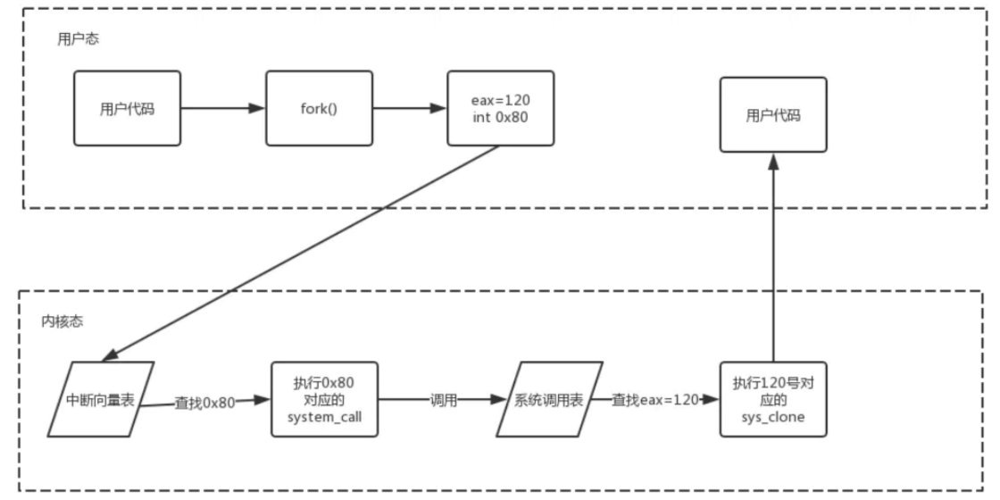
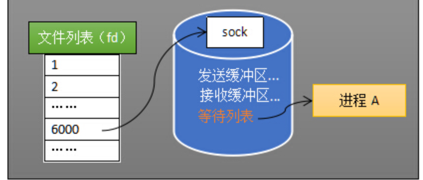

# 面试时答的不好的题目

1. 内核态和用户态怎么转换？除了系统调用？

   + 系统调用

   + 中断

     当外围设备完成用户请求的操作后，会向 CPU 发出相应的中断信号，这时 CPU 会暂停执行下一条即将要执行的指令转而去执行与中断信号对应的处理程序，如果先前执行的指令是用户态下的程序，那么这个转换的过程自然也就发生了由用户态到内核态的切换。

     比如硬盘读写操作完成，系统会切换到硬盘读写的中断处理程序中执行后续操作等。

   + 异常

     当 CPU 在执行运行在用户态下的程序时，发生了某些事先不可知的异常。例如用户程序的除 0 错误，再例如缺页异常。

     会触发由当前运行进程切换到处理此异常的内核相关程序中，也就转到了内核态。

2. 系统调用怎么实现的

   系统调用其实也是通过中断实现的。比如 Linux 中使用 INT 0X80：

   进入中断后，中断处理程序找到中断号 0X80 对应的处理程序，即 system_call 的处理程序，在此处理程序中，通过参数 eax=120，就知道了需要执行进程复制操作，进一步调用 sys_clone 处理。一切完成后中断返回，恢复用户程序。

   

3. 什么会导致中断？网络中用得到吗？

   比如网卡收包会通知内核。

   > 顺便讲讲中断和软中断
   >
   > 在中断处理时 CPU 没法处理其它事物，对于网卡来说，如果每次网卡收包时中断的时间都过长，会提高丢包的可能性。基于这样的考虑，将中断分成了上下两部分
   >
   > + 上半部分就是上面说的中断部分，需要快速及时响应，同时需要越快结束越好。
   > + 下半部分就是完成一些可以推后执行的工作，一般以内核线程的方式运行。每一个 CPU 都对应一个软中断内核线程，名字通常为 `ksoftirqd/CPU 编号`，比如 0 号 CPU 对应的软中断内核线程的名字是 `ksoftirqd/0`
   >
   > 对于网卡收包来说，网卡收到数据包，**向 cpu 发出一个中断信号**，操作系统便能得知有新数据到来。中断处理将数据包存入内存这些都是急切需要完成的工作，放到上半部完成。而解析处理数据包的工作则可以放到下半部去执行。

   可以从阻塞 IO 唤醒的角度去说？通过中断得知有数据到达，然后 CPU 就可以唤醒进程去读写这个 socket。然后可以顺着讲，五种 IO 模型和 IO 多路复用机制。

   

   

4. 惊群效应

   惊群效应：多个进程或者线程在等待同一个事件，当事件发生时，所有线程和进程都会被内核唤醒。唤醒后通常只有一个进程获得了该事件并进行处理，其他进程发现获取事件失败后又继续进入了等待状态，在一定程度上降低了系统性能。（因为需要进程线程切换）

   以 accept 为例：

   1. 第一种是由一个主进程进行 accept 监听，接受一个连接之后再 fork 出一个子进程，把连接丢给子进程去进行业务处理，然后主进程继续监听，由于只有一个进程在使用accept进行监听，自然也不存在惊群效应
   2. 第二种形式是由主进程 fork 出一批子进程，子进程继承了父进程的这个监听 socket ，大家共享，然后一起监听。在较新的 linux  内核版本中，accept() 中挂起进程使用的是 prepare_to_wait_exclusive 这个函数，exclusive 即互斥，在对一个等待队列进程唤醒的时候，只会唤醒一个进程。而如果使用 prepare_to_wait 则没有设置互斥位，会将挂在这个等待队列上的所有进程全部唤醒。

   对于 epoll，同样也会有这样的情况。

   + 若是先创建 epfd 再 fork，则 **epoll 结构是共享的**。那会出问题。比如子进程 A 添加了一个 socket 进去，结果被子进程 B wait 到了，但是子进程 B 根本就没有这个 socket，那显然会出问题。所以千万不要在多线程/多进程之间共享 epfd。
   + 若是先 fork 再创建 epfd，则 epoll 结构是非共享的。对于同一个 socket 的信号，会把所有 epoll 监控进程弄醒，但是只有一个会抢占到这个 socket，其他 epoll 监控进程继续睡了。虽然有惊群效应，但是不会出错。

   nginx 中的解决策略是，给出一个全局锁，每次只有获得锁的进程才能执行 `epoll_wait`

   ```c
   semop(...); // lock
   epoll_wait(...);
   accept(...);
   semop(...); // unlock
   ... // manage the request
   ```

   
