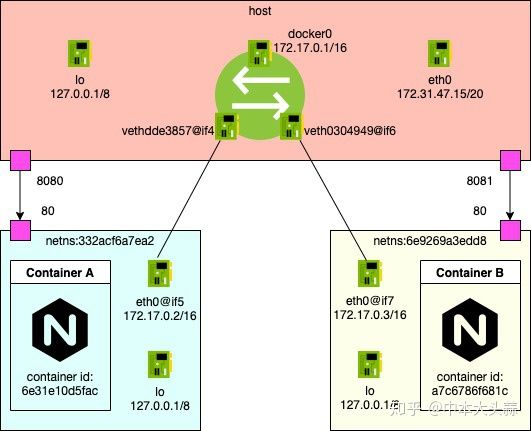
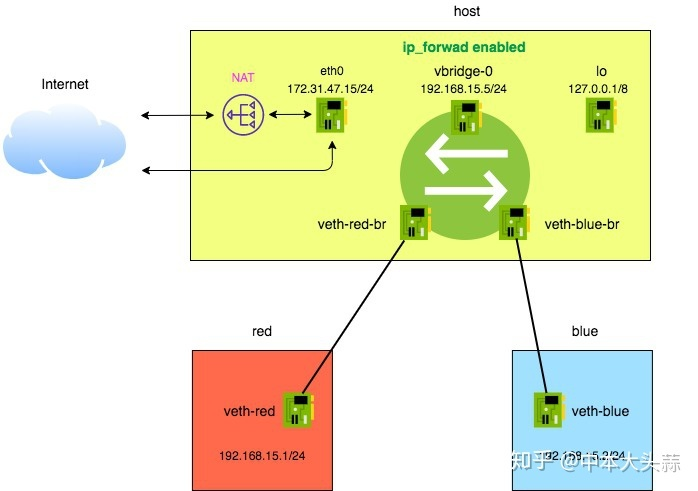
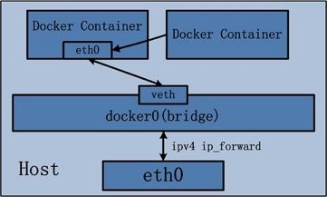
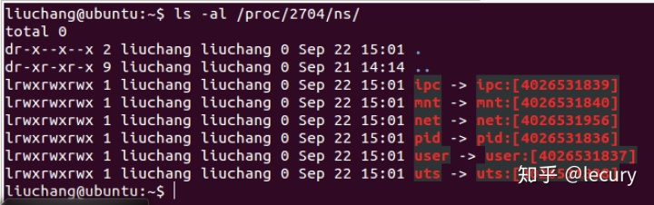
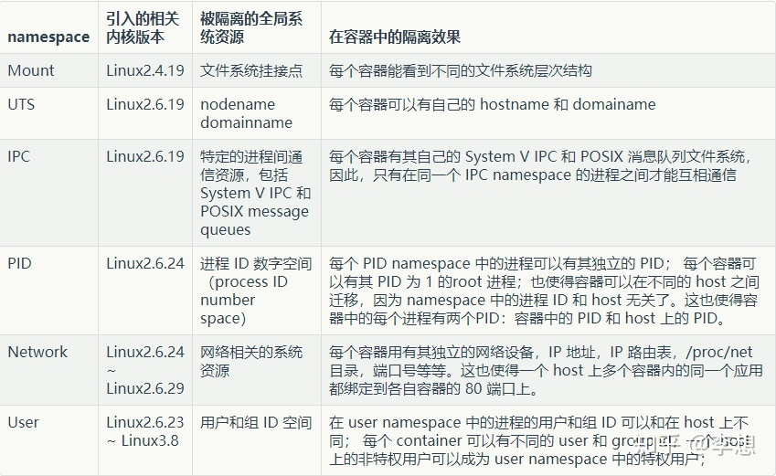
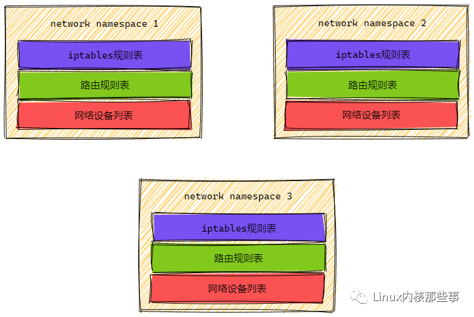
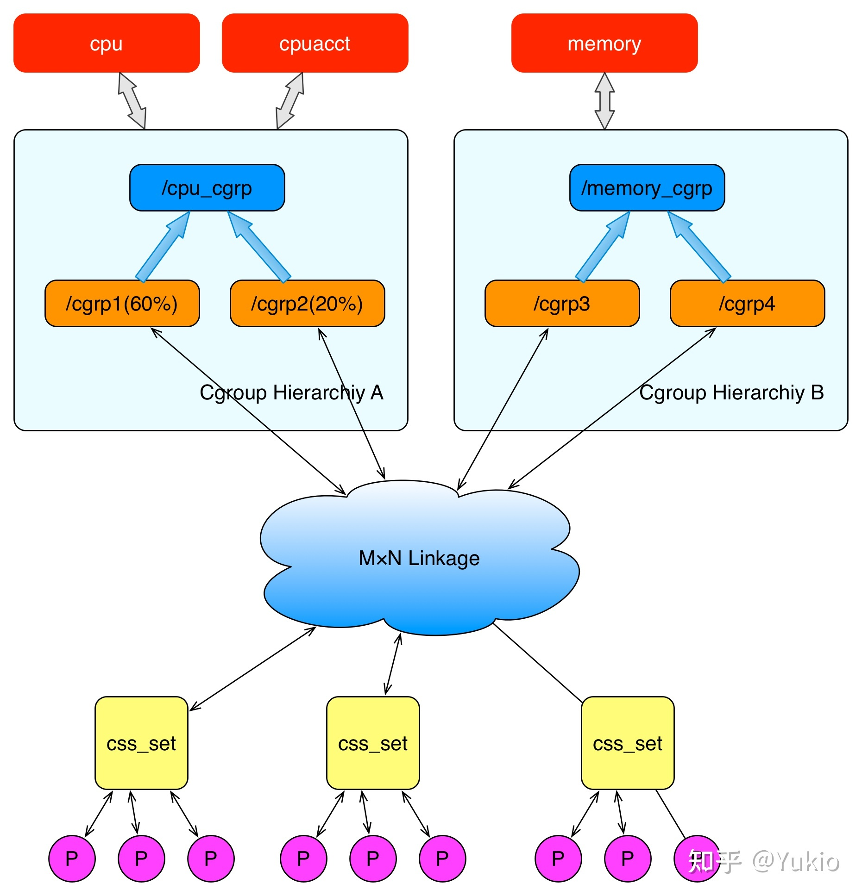
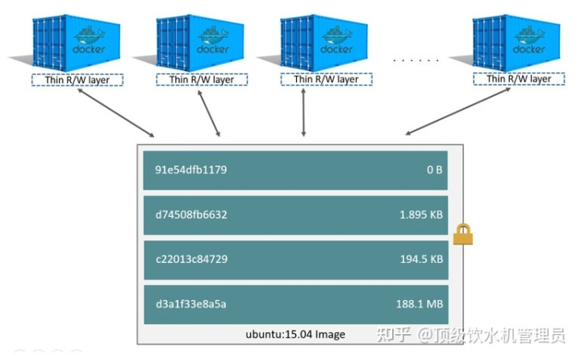
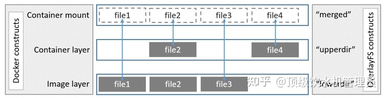

# 基础知识
## 面试问道的

### docker 单机网络模式

> 手撕Docker网络（1） —— 从0搭建Linux虚拟网络 - 中本葱的文章 - 知乎 https://zhuanlan.zhihu.com/p/199298498
>
> 手撕Docker网络（2） —— bridge模式拆解实例分析 - 中本葱的文章 - 知乎 https://zhuanlan.zhihu.com/p/206512720

+ Host 模式
  + 容器将不会获得一个独立的 Network Namespace，而是和宿主机共用一个 Network Namespace
  + 容器不会有自己的虚拟网卡，**直接使用主机的 IP 和 端口**，所以会发生**和主机的端口争用**
  + 这种模式用于网络性能较高的场景，但安全隔离性相对差一些。

+ Bridge 模式【创建容器时的默认模式】
  + 每一个 docker 容器都会有自己的 Network Namespace（就像一台独立主机一样）

  + 每一个 docker 容器都有一对虚拟对等接口（看成是网线）。即：**容器自己看自己的接口是 eth0，映射到主机上的一个虚拟接口 veth**。需要注意的是，**当你给容器的 eth0 配置 IP 之后，就可以认为它有了一块网卡**。
  + 这个 veth 可以看作是**插到了一个网桥**（交换机）上。（docker 创建的，叫 docker0）有一个虚拟 docker 子网（比如 172.17.0.0/16 网段），和主机网络是不连通的。
  + 这样，所有**该主机上的 docker 容器，都通过这个网桥（交换机）连在了一个二层网络中**。
  + 不过这样有一个问题啊，你怎么跟公网通信？你可以**给这个网桥也分配一个 IP 地址**，可以看作是**主机多了一块网卡查到这个网桥上，加入了这个网络。主机本身变成了路由器。**这样就可以通过（看作是路由器的主机） NAT（SNAT） 的方式主动访问外网了。
  + 那外网怎么访问内网？可以使用端口转发（port-forwarding，DNAT），比如以下命令可以将主机从8083端口收到的请求，发送到 192.168.15.1 的 80 端口（返回的数据也是直接回去的，不是走 SNAT 出去的）。

  

  

+ none 模式

  none模式可以说是 bridge 模式的一种特例，docker**会**为容器创建独有的network namespace ，但**不会**为这个命名空间准备虚拟网卡，IP地址，路由等。

+ joined-container 模式

  一组容器共享一个network namespace，新创建的容器不会创建自己的网卡，配置自己的 IP，而是和一个指定的容器共享 IP、端口范围等。

  kubernetes 的 pod 就是使用的这一模式。

  

# Overview

容器 = cgroup + namespace + rootfs + 容器引擎

> [https://www.cnblogs.com/yds941268778/p/12688363.html](https://www.cnblogs.com/yds941268778/p/12688363.html)

### 资源隔离 namespace

Docker利用 Namespace 实现系统环境隔离。在3.8内核开始，用户可以在 `/proc/$pid/ns` 文件下看到本进程所属的 `Namespace` 的文件信息。例如 PID 为 2704 进程的情况如下图所示：

+ **cgroups namespace**

  Cgroup是对进程的cgroup视图虚拟化。 每个 cgroup 命名空间都有自己的一组 cgroup 根目录。

  + 防止信息泄漏。否则容器外的cgroup 目录路径对容器中的进程可见。
  + 允许更好地限制容器化进程。可以挂载容器的 cgroup 文件系统，这样容器无需访问主机 cgroup 目录。

+ mount namespace：

  `mount` 所达到的效果是：像访问一个**普通的子目录**一样访问位于**其他设备（或磁盘分区）上文件系统的根目录**，也就是将**其他设备上目录的根节点**挂到了**本文件系统的一个页节点**上，达到给本文件系统扩充容量的目的。

  比如我把一个分区挂到了 mount namespace 1 的 /home/other 上，在 mount namespace 2 的进程是不知道的。

+ network namespace：

  [NetworkNamespace](https://link.zhihu.com/?target=https%3A//man7.org/linux/man-pages/man7/network_namespaces.7.html) 提供了**网络接口、IPv4 和 IPv6协议栈、路由表、Netfilter 规则、/proc/net目录(/proc/PID/net的符号链接)、端口号、本地套接字等网络资源**的隔离。

  

+ 需要注意的是，这种隔离是不完全的！**比如对时间没有隔离**。一个进程修改了本机时间，对其他所有进程来说是可见的，因为没有独立的 time namespace（据说之后加进来了）。

+ 【反其道而行之，如果要共享呢】比如要让进程互相可见，可以通过 --pid 指定同一个 pid namespace。如果要共享 hostname 就可以通过 --UTS 指定同一个 UTC namespace

### 资源限制 cgroup

通过 **Namespace**，容器实现了资源的隔离，从而每个容器**看起来**都像是拥有自己**独立的运行环境**。但是容器使用 cpu、内存等并不受限制，假如某个容器占用这些资源过高，就可能会造成其它容器运行迟缓甚至异常。

cgroups 的全称是 control groups，是 **Linux 内核提供的**一种可以**限制单个进程或者多个进程所使用资源的机制**，可以对 cpu，内存等资源实现精细化的控制。注意，这里仅仅是限制上限，并不像虚拟机那样强制分配固定大小的内存和 CPU。

一些概念：

+ 子系统(subsystem): **一个子系统就是一种资源的控制器**，比如 memory 子系统可以控制进程内存的使用。**子系统需要加入到某个层级，然后该层级的所有控制组，均受到这个子系统的控制**。包括但不限于：

  + **cpu 子系统**，主要限制进程的 cpu 使用率。
  + **cpuacct 子系统**，可以统计 cgroups 中的进程的 cpu 使用报告。
  + **cpuset 子系统**，可以为 cgroups 中的进程分配单独的 cpu 节点或者内存节点。
  + **memory 子系统**，可以限制进程的 memory 使用量。
  + **blkio 子系统**，可以限制进程的块设备 io。
  + **devices 子系统**，可以控制进程能够访问某些设备。
  + **net_cls 子系统**，可以标记 cgroups 中进程的网络数据包，然后可以使用 tc 模块（traffic control）对数据包进行控制。

+ 控制组(control group)和层级(hierarchy): 

  + cgroup 的资源控制是以控制组的方式实现，**控制组指明了资源的配额限制**。

  + 控制组有层级关系，类似树的结构，子控制组继承父控制组的属性(资源配额、限制等)。

    在**每一个 cgroups 层级结构中，每一个节点（cgroup 结构体）可以设置对资源不同的限制权重**。比如上图中 cgrp1 组中的进程可以使用 60% 的 cpu 时间片，而 cgrp2 组中的进程可以使用 20% 的 cpu 时间片。

  + **每一个 cgroups 子系统只能被一个 cgroups 层级结构接手**。（如上图 CPU 子系统只被层级结构 A 接手，B 就不能再控制）

+ `P`代表一个进程。每一个进程的描述符中有一个指针指向了一个辅助数据结构 `css_set`(cgroups subsystem set)。一个进程只能隶属于一个`css_set`，一个`css_set`可以包含多个进程，隶属于同一`css_set`的进程受到同一个`css_set`所关联的资源限制。

+ `css_set`通过辅助数据结构可以与 cgroups 节点进行多对多的关联。cgroups 的实现不允许`css_set`同时关联同一个cgroups层级结构下多个节点。（毕竟你一个 css_set 不能对 CPU 使用量有两种需求）

> 问题：
>
> 1. 为什么 css_set 和 cgroup 中间有一个连接结构，而不是 css_set 直接存储其关联的 cgroup？
>
>    因为可以从cgroup或css_set都可以进行遍历查询。
>
> 2. 为啥不是进程直接关联到 cgroup，而是经过 css_set

（猜测）docker 启动一个容器后，其中每个进程通过同一个 css_set 关联到多个 cgroup 中，使资源被控制。

> 虽然限制了资源使用率，但是你能看到真实的内存和 CPU 啊！
>
> + 在容器内看到的始终是节点的内存，而不是容器本身的内存
> + 容器内同样可以看到节点所有的CPU核

### 文件系统 & rootfs

一个 linux 系统需要运行的话，至少需要两个文件系统。：

+ 【所有容器共享宿主机的 bootfs】boot file system （bootfs）：包含 boot loader 和 **内核kernel**。在启动（boot）过程完成后，整个内核都会被加载进内存，此时 bootfs 会被卸载掉从而释放出所占用的内存。

+ 【每个容器有自己的 rootfs，它来自不同的 Linux 发行版的基础镜像】rootfs(Root File System) 是 docker 容器在启动时**内部进程可见的文件系统**，即 docker 容器的根目录。包括` /dev, /proc, /bin, /etc, /lib, /usr, and /tmp ` 等运行用户应用所需要的所有配置文件，二进制文件和库文件。这个文件系统在不同的 Linux 发行版中是不同的。Linux 系统在启动时，roofs 首先会被挂载为只读模式，然后在启动完成后被修改为读写模式 (docker 中不会)。

  > 猜测：参考 Linux 下的 chroot 命令，可以将子目录变为根目录？

> OS = 内核 + 文件系统/库
>
> linux 内核只有一个正统来源，那就是 linus 的开发团队。**内核只提供操作系统的基本功能和特性**，如内存管理，进程调度，文件管理等等。ubuntu 这些是 linux 的发行版，是基于 linus 维护的 linux 内核，由一些厂商集成了漂亮易用的桌面和常用的软件而发布的商品。
>
> **在 Docker 容器中运行的 Ubuntu 镜像只是 Ubuntu 文件系统/库 ，它不包含内核，该容器利用底层主机的内核，所有容器都在同一个内核上运行**。发行版之间最大的区别是用户区（应用程序、库、文件系统、包管理器）。每个镜像都包含它自己的版本。
>
> 虽然 kernel 的版本可能不同，但是对于非驱动开发者来说，并没有什么关系。毕竟，内存管理，文件读写之类的系统调用都是基本没有区别的。

镜像、容器、文件系统

+ Docker 镜像是由特殊的文件系统叠加而成，**最底端是 bootfs，并使用宿主机的bootfs；**第二层是 root 文件系统 rootfs，称为base image；然后再往上可以叠加其他的镜像文件。**docker 镜像的本质是一个分层的文件系统。**

+ 当从一个镜像启动容器时，Docker 会在最顶层加载一个读写文件系统作为容器。如果通过一个镜像创建多个容器，那么底层镜像只读共享，每个容器有自己的读写层

  

+ 统一文件系统（Union File System）技术能够**将不同的层整合成一个文件系统**，为这些层**提供了一个统一的视角**，这样就隐藏了多层的存在，**在用户的角度看来，只存在一个文件系统**。

  overlay 就是一种 Union File System。其分为 lowerdir（只读的，可以有堆叠的多个），upperdir（可读写的，用于表现增删改），最后整合成 merged 层表现出来。

  对于其中的修改操作，应用了写时复制的思想。 **docker 容器运行过程中文件系统发生变化时，会把变化的文件内容写到可读写层，并隐藏只读层中的旧版本文件**。

  

### 生命周期控制 Docker Engine
docker engine 是一个 client-server application。包含
+ daemon process (dockerd)： 管理容器的守护进程
+ A REST API： 联系与指导 daemon 工作的接口
+ A command line interface (CLI) client (the docker command)

CLI 使用 REST API 来控制 daemon 或与之交互。
> [https://docs.docker.com/get-started/overview/#docker-architecture](https://docs.docker.com/get-started/overview/#docker-architecture)

# docker container
Docker 容器本质上是宿主机上的进程。Docker 通过 namespace 实现了资源隔离。通过 cgroups 实现了资源限制，通过写时复制机制实现了高效的文件操作。

# docker volumn
+ volume 能在不同的容器之间共享和重用
+ 对 volume中的数据的操作会马上生效
+ 对 volume中数据操作不会影响到镜像本身，（比如 commit 新的 image 的时候，不会因为往 volume 中塞了很多数据就有庞大的体积
+ volume 的生存周期独立于容器的生存周期，即使删除容器，volume仍然会存在，没有任何容器使用的volume也不会被Docker删除

# 连接 docker 的方式
1. docker attach  
    **过时了**！不建议使用。Docker attach可以attach到一个已经运行的容器的stdin，然后进行命令执行的动作。  
    但是需要注意的是，如果从这个stdin中exit，会导致容器的停止。
2. SSH 不建议
3. docker exec  
    `docker exec [OPTIONS] CONTAINER COMMAND [ARG...]`  
    例如使用 `docker exec -it CONTAINER_NAME /bin/bash` 即可
4. nsenter  
    nsenter (namespace enter) 可以访问另一个进程的名称空间(namespace)，这样就能间接访问某个 container 的环境了。  
    实际上，理解了 docker 底层是基于 namespace 的，就可以完全明白为什么了。namespace 的描述详见 linux 中的笔记。  
    获取容器中一个进程的真实 PID，然后使用 nsenter 即可进入相同 namespace，实际上就进入了这个容器的环境了。

# docker image

### 镜像制作

可以从 dockerfile build，也可以从一个 container 直接 commit 成一个镜像。However：

1. commit 的这个容器文件，很有可能没有经过什么优化设置就落在了原先的镜像文件之上。
2. commit会把当前容器运行的日志等所有文件也打包到镜像中造成镜像体积偏大。

### 怎么缩小镜像体积

**减少层的数量、控制层的大小**

RUN 一次而不是两次：`RUN apt-get update && apt-get install vim`。因为从`docker 1.10`开始，`COPY`、`ADD`和`RUN`语句都会在镜像中新建一层。

install 过程会生成一些缓存数据，这些在应用运行过程中是不需要的，我们在安装完软件后立即将其删除后观察镜像再次缩小到 357 MB。
