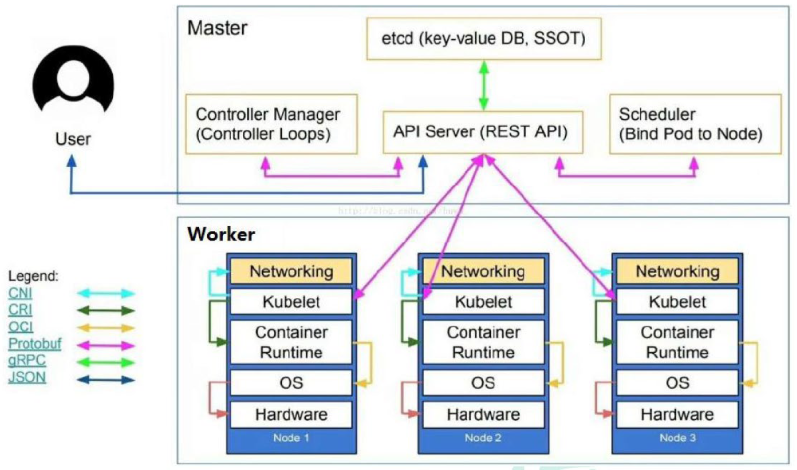
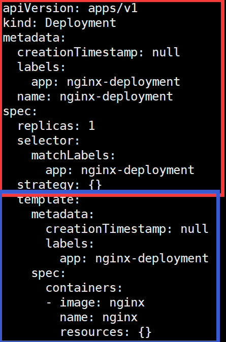
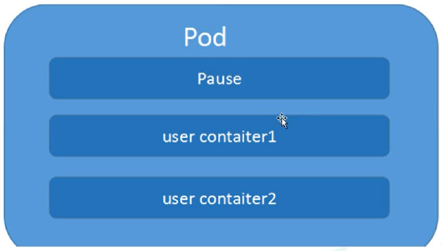
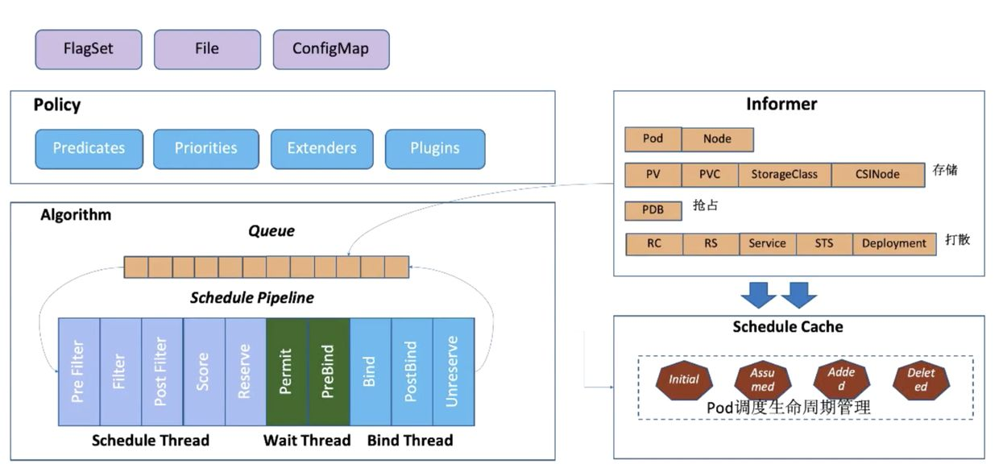
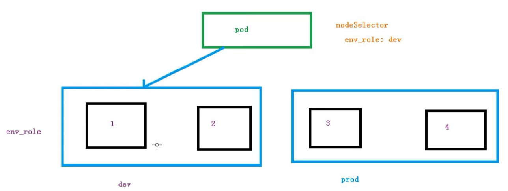

# 概览

摘录自 [https://zhuanlan.zhihu.com/p/339008746](https://zhuanlan.zhihu.com/p/339008746)

同时参考了  

+ [https://medium.com/@kumargaurav1247/components-of-kubernetes-architecture-6feea4d5c712](https://medium.com/@kumargaurav1247/components-of-kubernetes-architecture-6feea4d5c712)
+ [https://kubernetes.io/zh/docs/home/](https://kubernetes.io/zh/docs/home/)

# K8S 概览

## K8S 是什么， 为什么需要它

> Kubernetes is an open source system for managing containerized applications across multiple hosts. It provides basic mechanisms for deployment, maintenance, and scaling of applications.
> 用于自动部署、扩展和管理“容器化（containerized）应用程序”的开源系统。

翻译成大白话就是：“K8S 是负责自动化运维管理多个 Docker 程序的集群”。

传统的后端部署办法：把程序包放到服务器上跑起来。如果服务的请求量上来，已部署的服务响应不过来怎么办？如果请求量、内存、CPU 超过阈值做了告警，运维马上再加几台服务器，部署好服务之后，接入负载均衡来分担已有服务的压力。

有没有办法**自动完成服务的部署、修复、更新、卸载和扩容、缩容**呢？就是 K8S 要做的事情：**自动化运维管理** Docker（容器化）程序。

+ 部署：根据应用运行环境的资源配置要求，自动部署应用容器
+ 修复：容器失败时会尝试重启；当 node 节点有问题时重新调度任务；当容器未通过监控检查时会关闭容器，直到正常运行才对外提供服务
+ 水平拓展：可以根据设置或根据资源使用情况，可以增加副本数量达到水平推展的效果。
+ 服务发现：对外提供统一的 service 入口，并基于此来做节点调度和负载均衡
+ 滚动更新 / 回退：根据应用变化，进行一次性或批量式更新或回退
+ 存储编排：自动实现存储系统的挂载和应用，可以来源于本地存储或网络存储

## 宏观架构




K8S 是属于主从设备模型（Master-Slave 架构），即 Master 节点负责核心的调度、管理和运维，Slave 节点则在执行用户的程序。

Master Node 和 Worker Node 是分别安装了 K8S 的 Master 和 Woker 组件的实体服务器，每个 Node 都对应了一台实体服务器（虽然 Master Node 可以和其中一个 Worker Node 安装在同一台服务器，但是建议 Master Node 单独部署），所有 Master Node 和 Worker Node 组成了 K8S 集群，同一个集群可能存在多个 Master Node 和 Worker Node。

Master Node 的组件：

+ API Server  
    K8S 的请求入口服务。API Server 负责接收 K8S 所有请求（来自 UI 界面或者 CLI 命令行工具），然后，API Server 根据用户的具体请求，去通知其他组件干活。

+ Scheduler  
    K8S 所有 Worker Node 的调度器。当用户要部署服务时，Scheduler 会选择最合适的 Worker Node（服务器）来部署。
  
    调度决策考虑的因素包括单个 Pod 和 Pod 集合的资源需求、硬件/软件/策略约束、亲和性和反亲和性规范、数据位置、工作负载间的干扰和最后时限。

+ Controller Manager  
  
    运行控制器进程的控制平面组件。Controller Manager 有很多具体的 Controller。如`节点控制器`（负责在节点出现故障时进行通知和响应）、`任务控制器`（监测代表一次性任务的 Job 对象，然后创建 Pods 来运行这些任务直至完成）、`端点控制器`（填充端点（Endpoints）对象（即加入 Service 与 Pod））、`服务帐户和令牌控制器`（为新的命名空间创建默认帐户和 API 访问令牌）等。

+ etcd  
    K8S 的存储服务。etcd 存储了 K8S 的关键配置和用户配置。通常可以准备多个备存。

Worker Node 组件：

+ Kubelet  
    Worker Node 的监视器，以及与 Master Node 的通讯器。定期向 Master Node **汇报**自己 Node 上运行的服务的状态，并**接受**来自 Master Node 的指示采取调整措施，确保 PodSpecs 中描述的容器处于运行状态且健康。
+ Kube-Proxy  
    K8S 的网络代理。负责 Node 在 K8S 的网络通讯、以及对外部网络流量的负载均衡。允许从集群内部或外部的网络会话与 Pod 进行网络通信。
+ Container Runtime  
    Worker Node 的运行环境。即安装了容器化所需的软件环境，比如 Docker Engine、containerd。

插件

+ Logging Layer
    K8S 的监控状态收集器。称呼为 **Monitor** 可能更合适？Logging Layer 负责采集 Node 上所有服务的 CPU、内存、磁盘、网络等监控项信息。将容器的日志数据 保存到一个集中的日志存储中，该存储能够提供搜索和浏览接口。

+ DNS
  
    集群 DNS 是一个 DNS 服务器，和环境中的其他 DNS 服务器一起工作，它为 Kubernetes 服务提供 DNS 记录。Kubernetes 启动的容器自动将此 DNS 服务器包含在其 DNS 搜索列表中。

总结来看，K8S 的 Master Node 具备：请求入口管理（API Server），Worker Node 调度（Scheduler），监控和自动调节（Controller Manager），以及存储功能（etcd）；而 K8S 的 Worker Node 具备：状态和监控收集及本地 pod 管理（Kubelet），本地网络和负载均衡（Kube-Proxy）、保障容器化运行环境（Container Runtime）、以及定制化功能（Add-Ons）

# 一些概念

## Pod 实例

Pod是可以在 Kubernetes 中创建和管理的、最小的可部署的计算单元。一个 Work Node 中可以有多个 Pod。 “最小 xx 单位”就是资源的闭包、集合。比如一个进程是存储和计算的闭包，一个线程是 CPU 资源（包括寄存器、ALU 等）的闭包。**Pod 就是 K8S 中一个服务的闭包。**

**Pod 可以被理解成一群可以共享网络、存储和计算资源的容器化服务的集合**，在**共享的上下文**中运行。

同一个 Pod 之间的 Container **可以通过 localhost 互相访问**，并且可以挂载 Pod 内所有的数据卷；但是不同的 Pod 之间的 Container 不能用 localhost 访问，也不能挂载其他 Pod 的数据卷。


K8S 中所有的对象都通过 yaml 来表示  [Pod 的 yaml 示例](https://raw.githubusercontent.com/kubernetes/website/master/content/zh/examples/pods/resource/memory-request-limit.yaml)

## Volume 数据卷

K8S 支持很多类型的 volume 数据卷挂载，[参见 K8S 卷](https://kubernetes.io/zh/docs/concepts/storage/volumes/)。

数据卷 volume 是 Pod 内部的磁盘资源。，可以挂载到 Pod 中一个或多个容器指定路径下

## Container 容器

一个 Pod 内可以有多个容器 container。很有多种容器类型，此次就权当是 docker 标准容器。

## Deployment 和 ReplicaSet

Deployment 的作用是管理和控制 Pod 和 ReplicaSet，管控它们运行在**用户期望的状态中**。一个 Deployment 为 Pod 和 ReplicaSet 提供声明式的更新能力。只需要在 Deployment 中描述你想要的目标状态是什么， Deployment controller 就会帮你将 Pod 和 Replica Set 的实际状态改变到你的目标状态。

ReplicaSet 的作用就是管理和控制 Pod，管控他们好好干活，受控于 Deployment。如果一旦发现某 Pod 不行了，就赶紧新拉一个 Pod 过来替换它来维持 Pod 的数目。


用户会直接操作 Deployment 部署服务（用户指明目标状态），而当 Deployment 被部署的时候，K8S 会自动生成要求的 ReplicaSet 和 Pod。

## Service 和 Ingress

### Service

前文介绍的 Deployment、ReplicationController 和 ReplicaSet 主要管控 Pod 程序服务；那么，Service 和 Ingress 则负责管控 Pod 网络服务。**Service是通过规则定义出由多个 Pod 对象组合而成的逻辑组合以及访问这组 Pod 的策略。**

> [Service](https://kubernetes.io/zh/docs/concepts/services-networking/service/): 将运行在一组 Pods 上的应用程序**公开为网络服务**的抽象方法。
> 使用 Kubernetes，无需修改应用程序即可使用不熟悉的服务发现机制。 Kubernetes 为 Pods 提供自己的 IP 地址，**并为一组 Pod 提供相同的 DNS 名， 并且可以在它们之间进行负载均衡**。

K8S 中的服务（Service）更像是网关层，是若干个 Pod 的**流量入口、流量均衡器**。Service 是 K8S 服务的核心，屏蔽了服务细节，统一对外暴露服务接口，真正做到了“微服务”。

> 为什么要 Service 呢： Pod 是有生命周期的。 它们可以被创建，而且销毁之后不会再启动。 如果使用 Deployment 来运行您的应用程序，则它可以动态创建和销毁 Pod。每个 Pod 都有自己的 IP 地址，但是在 Deployment 中，在同一时刻运行的 Pod 集合可能与稍后运行该应用程序的 Pod 集合不同。
> 
> 举个例子，我们的一个服务 A，部署了 3 个备份，也就是 3 个 Pod；对于用户来说，只需要关注一个 Service 的入口就可以，而不需要操心究竟应该请求哪一个 Pod。优势非常明显：一方面外部用户不需要感知因为 Pod 上服务的意外崩溃、K8S 重新拉起 Pod 而造成的 IP 变更，外部用户也不需要感知因升级、变更服务带来的 Pod 替换而造成的 IP 变化，另一方面，Service 还可以做流量负载均衡。

service 只能提供 IP 层面的负载均衡的能力

### Ingress

Service 主要负责 K8S 集群内部的网络拓扑。那么集群外部怎么访问集群内部呢？这个时候就需要 Ingress 了

> Ingress 是对集群中服务的外部访问进行管理的 API 对象，典型的访问方式是 HTTP。
> 
> Ingress 可以提供负载均衡、SSL 终结和基于名称的虚拟托管。
> 
> Ingress 是用于将外部 HTTP（S）流量路由到服务（Service）

Ingress 只需要一个NodePort 或者一个 LB 就可以**满足暴露多个 Service 的需求**。相当于一个 7 层的负载均衡器。可以理解成在 **Ingress 里建立诸多映射规则，Ingress Controller 通过监听这些配置规则并转化成 Nginx 的反向代理配置 , 然后对外部提供服务**。

说明哪个域名对应Kubernetes集群中的哪个 Service，不然外部也找不到这些 service 的，总不能让外部记住这些 service 对应的统一 IP 吧。


## namespace 命名空间

namespace 跟 Pod 没有直接关系，而是 K8S 另一个维度的对象。或者说，前文提到的概念都是为了服务 Pod 的，而 namespace 则是为了服务整个 K8S 集群的。

namespace 是为了把一个 K8S 集群划分为若干个资源不可共享的虚拟集群而诞生的。也就是说，可以通过在 K8S 集群内创建 namespace 来分隔资源和对象。


## kubectl

Kubectl 是一个命令行接口，用于对 Kubernetes 集群运行命令。也就是说，可以通过 kubectl 来操作 K8S 集群。

> Tip: kubectl 是 K8S 的命令行工具，并不需要 kubectl 安装在 K8S 集群的任何 Node 上，但是，需要确保安装 kubectl 的机器和 K8S 的集群能够进行网络互通。

## YAML 格式

一种标记语言，用来表达数据序列。

使用空格缩进，同一级的对齐即可，不可以使用 Tab。使用 `#` 表示注释，`---` 表示新的 YAML 文件开始。

支持：

+ 键值对
  
  + 写法一
    
    ```yaml
    name: Tom
    age: 18
    ```
  
  + 写法二
    
    ```yaml
    hash: {name: Tom, age: 18}
    ```

+ 数组
  
  + 写法一
    
    ```yaml
    People
    - Tom
    - Jack
    ```
  
  + 写法二
    
    ```yaml
    People: [Tom, Jack]
    ```

Kubernetes 对象是 “目标性记录” —— 一旦创建对象，Kubernetes 系统将持续工作以确保对象存在。 通过创建对象，本质上是在告知 Kubernetes 系统，所需要的集群工作负载看起来是什么样子的， 即 **期望状态（Desired State）**。

kubenetes 的 YAML 文件通常被分为两部分，**控制器**的定义和**被控制的对对象**的定义。例如对于一个 Deployment 对象可按红蓝两部分划分。


一般来说，我们很少自己手写 YAML 文件，因为这里面涉及到了很多内容，我们一般都会借助工具来创建：

```cmd
# 尝试运行,并不会真正的创建镜像
kubectl create deployment web --image=nginx -o yaml --dry-run
# 或者我们可以输出到一个文件中
kubectl create deployment web --image=nginx -o yaml --dry-run > hello.yaml
# 然后我们就在文件中直接修改即可
```

# Pod

## 概述

Pod 是 K8S 系统中可以**创建和管理的最小单元**。其他资源都是用来支撑或者扩展 Pod对象功能的，比如控制器对象是用来管控 Pod 对象的，Service 或者 Ingress 资源对象是用来暴露 Pod 引用对象的，PersistentVolume 资源对象是用来为Pod提供存储等等。K8S 不会直接处理容器，而是 Pod，Pod 是由一个或多个 container 组成。通常不需要直接创建 Pod，而是使用诸如 Deployment 或 Job 这类工作负载资源来创建 Pod。

Pod 的共享上下文包括一组 Linux namespace、控制组（cgroup）和可能一些其他的隔离方面。【天生提供了最重要的两个共享资源：网络 和 存储】

> 就 Docker 概念的术语而言，Pod 类似于共享名字空间和文件系统卷的一组 Docker 容器。

## 一些容器

### pause 根容器

```c
static void sigdown(int signo) {
  psignal(signo, "Shutting down, got signal");
  exit(0);
}
static void sigreap(int signo) {
  while (waitpid(-1, NULL, WNOHANG) > 0)
    ;
}
int main(int argc, char **argv) {
  int i;
  for (i = 1; i < argc; ++i) {
    if (!strcasecmp(argv[i], "-v")) {
      printf("pause.c %s\n", VERSION_STRING(VERSION));
      return 0;
    }
  }
  if (getpid() != 1)
    /* Not an error because pause sees use outside of infra containers. */
    fprintf(stderr, "Warning: pause should be the first process\n");
  if (sigaction(SIGINT, &(struct sigaction){.sa_handler = sigdown}, NULL) < 0)
    return 1;
  if (sigaction(SIGTERM, &(struct sigaction){.sa_handler = sigdown}, NULL) < 0)
    return 2;
  if (sigaction(SIGCHLD, &(struct sigaction){.sa_handler = sigreap,
                                             .sa_flags = SA_NOCLDSTOP},
                NULL) < 0)
    return 3;
  for (;;)
    pause();
  fprintf(stderr, "Error: infinite loop terminated\n");
  return 42;
}
```

每个 Pod 都有一个根容器 `Pause`，属于 K8S 平台一部分，除此之外还有用户业务容器。将 Pause 作为其他容器的父容器：

+ 所有用户容器的其他各类命名空间都是基于 Pause 容器的（其实就是基于它对应的进程）。所以可以 **用pause 容器为其他容器提供了共享的命名空间**。
  
  + 例如，用户容器通过 join network namespace 的方式共享网络。【个人注：应该就是共享 network namespace 吧】毕竟让某个用户容器去 join 另一个用户容器不太合理（万一用户容器挂了呢，整个 pod 的 localhost 网络都崩溃了），所以要 join pause 容器
  
  + 如何强制结束 容器/POD？
    
    当 PID1 进程结束之后，LIinux 内核会销毁对应的 PID namespace，并向容器内所有其它的子进程发送 SIGKILL。
    
    > https://www.man7.org/linux/man-pages/man7/pid_namespaces.7.html

+ 为了回收僵尸进程，不宜把用户容器进程作为 pid = 1 的进程。因此 pause 容器一个重要功能是作为 pod 中PID 1 的角色，当产生孤儿进程并被 PID=1 进程收养后，通过调用 wait 来回收进程【注意，同一个 pod 中的容器是没有隔离的喔，pid 等 namespace 都是共享的】
  
  > 类似的，在 docker 中，ENTRYPOINT 进程是 init 进程
  
  > [知识讲解篇-143] kubernetes pod 中的万能钥匙--pause 容器 - 王sir说大数据的文章 - 知乎 https://zhuanlan.zhihu.com/p/396752702



### init 容器

Init 容器是一种特殊容器，在 Pod 内的应**用容器启动之前**运行。Init 容器可以包括一些应用镜像中不存在的实用工具和安装脚本。Init 容器与普通的容器非常像，除了如下两点：

- 它们总是运行到完成。
- 每个都必须在下一个启动之前成功完成。

如果 Pod 的 Init 容器失败，kubelet 会不断地重启该 Init 容器直到该容器成功为止。 然而，如果 Pod 对应的 `restartPolicy` 值为 "Never"，并且 Pod 的 Init 容器失败， 则 Kubernetes 会将整个 Pod 状态设置为失败。

常见用途：预加载一些基本配置、资源限制配额、还可以包括一些应用镜像中不存在的实用工具和安装脚本。例如

- 从远程数据库获取本地应用所需配置，或将自己数据库注册到某个中央数据库等
- 基于环境变量或配置模板生成配置文件
- 下载相关依赖包
  - 例如，没有必要仅为了在安装过程中使用类似 `sed、awk、python` 或 `dig` 这样的工具而去 `FROM` 一个镜像来生成一个新的镜像。
- 由于 Init 容器必须在应用容器启动之前运行完成，因此 Init 容器 提供了一种机制来阻塞或延迟应用容器的启动，直到满足了一组先决条件。【比如检查某个第三方服务目前是否可用，虽然可以把这个判断写到应用容器中，但是分离开解耦也是一个不错的策略】

资源：

在给定的 Init 容器执行顺序下，资源使用适用于如下规则：

- 所有 Init 容器上定义的任何特定资源的 limit 或 request 的最大值，作为 Pod *有效初始 request/limit*。 如果任何资源没有指定资源限制，这被视为最高限制。
- Pod 对资源的 *有效 limit/request* 是如下两者的较大者：
  - 所有应用容器对某个资源的 limit/request 之和
  - 对某个资源的有效初始 limit/request
- 基于有效 limit/request 完成调度，这意味着 Init 容器能够为初始化过程预留资源， 这些资源在 Pod 生命周期过程中并没有被使用。

## Pod 的生命周期管理

### Pod 生命期

+ Pod 的阶段（不包含所有 Pod 状态）

| 取值              | 描述                                                                                |
|:--------------- |:--------------------------------------------------------------------------------- |
| `Pending`（悬决）   | Pod 已被 Kubernetes 系统接受，**但有一个或者多个容器尚未创建**亦未运行。此阶段**包括等待 Pod 被调度的时间和通过网络下载镜像的时间**。 |
| `Running`（运行中）  | Pod 已经绑定到了某个节点，Pod 中**所有的容器都已被创建**。**至少有一个容器仍在运行，或者正处于启动或重启状态**。                  |
| `Succeeded`（成功） | Pod 中的**所有容器都已成功终止**，并且不会再重启。                                                     |
| `Failed`（失败）    | Pod 中的所有容器都已终止，并且**至少有一个容器是因为失败终止**。也就是说，容器以非 0 状态退出或者被系统终止。                      |
| `Unknown`（未知）   | 因为某些原因无法取得 Pod 的状态。这种情况**通常是因为与 Pod 所在主机通信失败**。                                   |

如果某节点死掉或者与集群中其他节点失联，Kubernetes 会实施一种策略，将失去的节点上运行的所有 Pod 的 `phase` 设置为 `Failed`。如果一个节点死掉了，调度到该节点 的 Pod 也被计划在给定超时期限结束后删除。

Pod 自身不具有自愈能力。任何给定的 Pod （由 UID 定义）**从不会被“重新调度（rescheduled）”到不同的节点**； 相反，这一 Pod 可以被一个新的、几乎完全相同的 Pod **替换**掉。 如果需要，新 Pod 的名字可以不变，但是其 **UID 会不同**。

+ Pod 状况
  
  Pod 有一个 PodStatus 对象，其中包含一个 PodConditions 数组。Pod 可能通过也可能未通过其中的一些**状况测试**。
  
  - `PodScheduled`：Pod 已经被调度到某节点；
  - `ContainersReady`：Pod 中所有容器都已就绪；
  - `Initialized`：所有的 Init 容器都已成功完成；
  - `Ready`：Pod 可以为请求提供服务，并且应该被添加到对应服务的负载均衡池中。

### 容器状态

#### 容器状态

| 取值                | 描述                                                                                                                                   |
|:----------------- |:------------------------------------------------------------------------------------------------------------------------------------ |
| `Waiting` （等待）    | 如果容器并不处在 `Running` 或 `Terminated` 状态之一，它就处在 `Waiting` 状态。 处于 `Waiting` 状态的容器仍在运行它完成启动所需要的操作：例如，从某个容器镜像 仓库拉取容器镜像，或者向容器应用 Secret 数据等等。 |
| `Running`（运行中）    | `Running` 状态表明容器正在执行状态并且没有问题发生。如果配置了 `postStart` 回调，那么该回调已经执行且已完成。                                                                   |
| `Terminated`（已终止） | 处于 `Terminated` 状态的容器已经开始执行并且或者正常结束或者因为某些原因失败。如果容器配置了 `preStop` 回调，则该回调会在容器进入 `Terminated` 状态**之前**执行。                               |

#### 容器重启策略

Pod 的 `spec` 中包含一个 `restartPolicy` 字段，其可能取值包括 Always、OnFailure 和 Never。默认值是 Always。

`restartPolicy` 适用于 Pod 中的所有容器。`restartPolicy` 仅针对同一节点上 `kubelet` 的容器重启动作。当 Pod 中的容器退出时，`kubelet` 会按指数回退方式计算重启的延迟（10s、20s、40s、...），其最长延迟为 5 分钟。 一旦某容器执行了 10 分钟并且没有出现问题，`kubelet` 对该容器的重启回退计时器执行 重置操作。

#### 容器状态检查 -> 容器探针 probe

> https://kubernetes.io/zh/docs/tasks/configure-pod-container/configure-liveness-readiness-startup-probes/

探测类型

+ 存活检查 livenessProbe
  
  指示容器是否正在运行。如果存活态探测失败，则 kubelet 会杀死容器， 并且容器将根据其[重启策略](https://kubernetes.io/zh/docs/concepts/workloads/pods/pod-lifecycle/#restart-policy)决定未来。如果容器不提供存活探针， 则默认状态为 `Success`。

+ 就绪检查 readinessProbe
  
  指示容器**是否准备好为请求提供服务**。如果就绪态探测失败， 端点控制器将从与 Pod 匹配的所有服务的端点列表中删除该 Pod 的 IP 地址。 初始延迟之前的就绪态的状态值默认为 `Failure`。 如果容器不提供就绪态探针，则默认状态为 `Success`。

+ 启动探针 startupProbe
  
  指示容器中的应用是否已经启动。如果提供了启动探针，则所有其他探针都会被 禁用，直到此探针成功为止。如果启动探测失败，`kubelet` 将杀死容器，而容器依其重启策略进行重启。 如果容器没有提供启动探测，则默认状态为 `Success`。

探测方式

+ exec：在容器内执行指定命令。如果命令退出时返回码为 0 则认为诊断成功。
+ grpc：使用 gRPC 执行一个远程过程调用。 目标应该实现  gRPC健康检查。 如果响应的状态是 "SERVING"，则认为诊断成功。
+ httpGet：对容器的 IP 地址上指定端口和路径执行 HTTP `GET` 请求。如果响应的状态码大于等于 200 且小于 400，则诊断被认为是成功的。
+ tcpSocket：对容器的 IP 地址上的指定端口执行 TCP 检查。如果端口打开，则诊断被认为是成功的。 如果远程系统（容器）在打开连接后立即将其关闭，这算作是健康的。

**【探针一般都是靠自己实现的，需要自己制定合理的策略】**

## Pod 调度

> https://zhuanlan.zhihu.com/p/101908480

调度器通过 kubernetes 的监测（Watch）机制来发现集群中新创建且尚未被调度到 Node 上的 Pod。 调度器会将发现的每一个未调度的 Pod 调度到一个合适的 Node 上来运行。

kube-scheduler 给一个 pod 做调度选择包含两个步骤：

1. 过滤
   
   过滤阶段会将所有满足 Pod 调度需求的 Node 选出来。 例如，PodFitsResources 过滤函数会检查候选 Node 的可用资源能否满足 Pod 的资源请求。 在过滤之后，得出一个 Node 列表，里面包含了所有可调度节点；
   
   如果这个列表是空的，代表这个 Pod 不可调度。这个 Pod 将一直停留在 未调度状态直到调度器能够找到合适的 Node

2. 打分
   
   在打分阶段，调度器会为 Pod 从所有可调度节点中选取一个最合适的 Node。 根据当前启用的打分规则，调度器会给每一个可调度节点进行打分。

### 调度流程概览



kube-scheduler 的主要几大组件：

+ Policy：调度策略可以配置指定调度主流程中要用哪些过滤器 (Predicates)、打分器 (Priorities) 、外部扩展的调度器 (Extenders)，以及最新支持的自定义扩展点 (Plugins)。
  
  > Scheduler 的调度策略启动配置目前支持三种方式，配置文件 / 命令行参数 / ConfigMap。

+ Informer：Scheduler 在启动的时候通过 K8s 的 informer 机制以 List+Watch 从 kube-apiserver 获取调度需要的数据例如：Pods、Nodes、Persistant Volume(PV), Persistant Volume Claim(PVC) 等等，并将这些数据做一定的预处理作为调度器的的 Cache。

+ 调度流水线：
  
  + 通过 **Informer** 将需要调度的 Pod 插入 Queue 中，Pipeline 会循环从 Queue Pop 等待调度的 Pod 放入 Pipeline 执行。
  + 调度流水线 (Schedule Pipeline) 主要有三个阶段：
    + Scheduler Thread：
      + 选择符合 Pod Spec 描述的 Nodes
      + 打分和排序
      + 节点资源预留，使调度下一个 pod 的时候能看到这个 node 已经分配了这个 pod
    + Wait Thread：
      + 等待 Pod 关联的资源的 Ready 等待，例如等待 PVC 的 PV 创建成功
    + Bind Thread
      + 将 Pod 和 Node 的关联持久化
  + 整个调度流水线只有【在 Scheduler Thread 阶段是串行的】一个 Pod 一个 Pod 的进行调度，在 Wait 和 Bind 阶段 Pod 都是异步并行执行。

### 影响 Pod 调度的属性

+ 资源限制：根据 request 找到有足够资源的 node 节点进行调度
  
  ```yaml
  apiversion: v1
  kind: Pod
  metadata :
      name : frontend
  spec:
      containers :
          -name: db
          image: mysql
          env :
              -name :  MYsQL_ROOT__PAS SWORD
              value : "passwo rd"
          resources:
              requests :
                  memory: "64Mi"
                  cpu: "250m "
              limits:
                  memory : "128Mi"
                  cpu: "500m "
  ```

+ 节点选择器标签 nodeSelector 
  
  ```yaml
  apiversion: v1
  kind: Pod
  metadata :
      name : frontend
  spec:
      nodeSelector:
          env_role: dev
      containers :
          -name: ngxin
          image: ngxin:1.15
  ```
  
  
  
  可以给 note 新增标签 `kubectl label node node1 env_role=prod`

+ 节点亲和性 nodeAffinity
  
  使用亲和性与反亲和性的一些好处有：
  
  - 亲和性、反亲和性语言的表达能力更强。`nodeSelector` 只能选择拥有所有指定标签的节点。 亲和性、反亲和性为你提供对选择逻辑的更强控制能力。
  - 你可以标明某规则是“软需求”或者“偏好”，这样调度器在无法找到匹配节点时仍然调度该 Pod。
  - 你可以使用节点上（或其他拓扑域中）运行的其他 Pod 的标签来实施调度约束， 而不是只能使用节点本身的标签。这个能力让你能够定义规则允许哪些 Pod 可以被放置在一起。
  
  节点亲和性有两种：
  
  - `requiredDuringSchedulingIgnoredDuringExecution`： 调度器只有在规则被满足的时候才能执行调度。此功能类似于 `nodeSelector`， 但其语法表达能力更强。
  - `preferredDuringSchedulingIgnoredDuringExecution`： 调度器会尝试寻找满足对应规则的节点。如果找不到匹配的节点，调度器仍然会调度该 Pod。
  
  ```yaml
  apiVersion: v1
  kind: Pod
  metadata:
    name: with-node-affinity
  spec:
    affinity:
      nodeAffinity:
        requiredDuringSchedulingIgnoredDuringExecution:
          nodeSelectorTerms:
          - matchExpressions:
            - key: kubernetes.io/os
              operator: In
              values:
              - linux
        preferredDuringSchedulingIgnoredDuringExecution:
        - weight: 1
          preference:
            matchExpressions:
            - key: another-node-label-key
              operator: In
              values:
              - another-node-label-value
    containers:
    - name: with-node-affinity
      image: k8s.gcr.io/pause:2.0
  ```
  
  在这一示例中，所应用的规则如下：
  
  - 节点必须包含键名为 `kubernetes.io/os` 的标签，并且其取值为 `linux`。
  - 节点 **最好** 具有键名为 `another-node-label-key` 且取值为 `another-node-label-value` 的标签。
  
  可以使用 `operator` 字段来为 Kubernetes 设置在解释规则时要使用的逻辑操作符。 你可以使用 `In`、`NotIn`、`Exists`、`DoesNotExist`、`Gt` 和 `Lt` 之一作为操作符。`NotIn` 和 `DoesNotExist` 可用来实现节点反亲和性行为。

+ Pod 开销
  
  Pod 本身占用大量系统资源。这些是运行 Pod 内容器所需资源之外的资源。在 Kubernetes 中，Pod 的开销是根据与 Pod 的 RuntimeClass 相关联的开销**在准入时设置的**。
  
  如果启用了 Pod Overhead，**在调度 Pod 时，除了考虑容器资源请求的总和外，还要考虑 Pod 开销**。 类似地，kubelet 将在确定 Pod cgroups 的大小和执行 Pod 驱逐排序时也会考虑 Pod 开销。
  
  ```yaml
  apiVersion: node.k8s.io/v1
  kind: RuntimeClass
  metadata:
    name: kata-fc
  handler: kata-fc
  overhead:
    podFixed:
      memory: "120Mi"
      cpu: "250m"
  ```

### 污点和污点容忍

+ overview

NodeAffinity 是 **Pod 的一种属性**，它使 Pod 被吸引到一类特定的节点。 

Taint 污点：则相反——它使节点能够排斥一类特定的 Pod。是**节点属性**

容忍度（Toleration）是应用于 Pod 上的，允许（但并不要求）Pod 调度到带有与之匹配的污点的节点上。而且污点的变化（新增 `NoExecite`有可能导致正在运行的 Pod 被驱逐）

+ 例子
  
  `kubectl taint nodes node1 key1=value1:NoSchedule`
  
  上述命令给节点 `node1` 增加一个污点，它的键名是 `key1`，键值是 `value1`，效果是 `NoSchedule`。 这表示**只有拥有和这个污点相匹配的容忍度的 Pod 才能够被分配到 `node1` 这个节点**。
  
  可以在 PodSpec 中定义 Pod 的容忍度。 下面两个容忍度均与上面例子中使用 `kubectl taint` 命令创建的污点相匹配， 因此如果一个 Pod 拥有其中的任何一个容忍度都能够被分配到 `node1` ：
  
  ```yaml
  tolerations:
  - key: "key1"
    operator: "Equal"
    value: "value1"
    effect: "NoSchedule"
  
    tolerations:
  - key: "key1"
    operator: "Exists"
    effect: "NoSchedule"
  ```

+ 上述例子中 `effect` 使用的值为 `NoSchedule`，你也可以使用另外一个值 `PreferNoSchedule`。 这是“优化”或“软”版本的 `NoSchedule` —— 系统会 **尽量** 避免将 Pod 调度到存在其不能容忍污点的节点上， 但这不是强制的。`effect` 的值还可以设置为 `NoExecute`

+ 你可以给一个节点添加多个污点，也可以给一个 Pod 添加多个容忍度设置。 Kubernetes 处理多个污点和容忍度的过程就像一个过滤器：从一个节点的所有污点开始遍历， **过滤掉那些 Pod 中存在与之相匹配的容忍度的污点（即容忍这个污点）**。余下未被过滤的污点的 effect 值决定了 Pod 是否会被分配到该节点，特别是以下情况：
  
  - 如果未被过滤的污点中存在至少一个 effect 值为 `NoSchedule` 的污点， 则 Kubernetes 不会将 Pod 分配到该节点。
  - 如果未被过滤的污点中不存在 effect 值为 `NoSchedule` 的污点， 但是存在 effect 值为 `PreferNoSchedule` 的污点， 则 Kubernetes 会 *尝试* 不将 Pod 分配到该节点。
  - 如果未被过滤的污点中存在至少一个 effect 值为 `NoExecute` 的污点， 则 Kubernetes 不会将 Pod 分配到该节点（如果 Pod 还未在节点上运行）， 或者将 Pod 从该节点驱逐（如果 Pod 已经在节点上运行）。

+ 使用场景
  
  + 将某些节点**专门分配**给特定的一组用户使用。您可以给这些节点添加一个污点， 然后给这组用户的 Pod 添加一个相对应的 toleration。
  
  + **配备了特殊硬件的节点**， 我们希望不需要这类硬件的 Pod 不要被分配到这些特殊节点，以便为后继需要这类硬件的 Pod 保留资源。（和上面其实一个意思吧）
  
  + **基于污点的驱逐**：在每个 Pod 中配置的在节点出现问题时的驱逐行为。
    
    当某种条件为真时，节点控制器会自动给节点添加一个污点。当前内置的污点包括：
    
    - `node.kubernetes.io/not-ready`：节点未准备好。这相当于节点状态 `Ready` 的值为 "`False`"。
    - `node.kubernetes.io/unreachable`：节点控制器访问不到节点. 这相当于节点状态 `Ready` 的值为 "`Unknown`"。
    - `node.kubernetes.io/memory-pressure`：节点存在内存压力。
    - `node.kubernetes.io/disk-pressure`：节点存在磁盘压力。
    - `node.kubernetes.io/pid-pressure`: 节点的 PID 压力。
    - `node.kubernetes.io/network-unavailable`：节点网络不可用。
    - `node.kubernetes.io/unschedulable`: 节点不可调度。
    - `node.cloudprovider.kubernetes.io/uninitialized`：如果 [kubelet](https://www.zhihu.com/search?q=kubelet&search_source=Entity&hybrid_search_source=Entity&hybrid_search_extra={"sourceType"%3A"article"%2C"sourceId"%3A"405348246"}) 启动时指定了一个 "外部" 云平台驱动， 它将给当前节点添加一个污点将其标志为不可用。在 cloud-controller-manager 的一个控制器初始化这个节点后，kubelet 将删除这个污点。
    
    当然也可以**手工驱逐**
    
    在节点被驱逐时，节点控制器或者 kubelet 会添加带有`NoExecute`效应的相关污点。 如果异常状态恢复正常，kubelet 或节点控制器能够移除相关的污点。

## Pod 资源限制

### 自行声明

当你为 Pod 中的 Container 指定了资源 **请求 Request** 时， kube-scheduler 就利用该信息决定将 Pod 调度到哪个节点上。 当你还为 Container 指定了资源 **约束 Limit** 时，kubelet 就可以确保运行的容器不会使用超出所设约束的资源。 kubelet 还会为容器预留所 **请求 Request** 数量的系统资源，供其使用。

容器可能（且可以）使用超出对应资源 `request` 属性所设置的资源量。不过，容器不可以使用超出其资源 `limit` 属性所设置的资源量。例如：当容器中进程尝试使用超出所允许内存量的资源时，系统内核会将尝试申请内存的进程终止， 并引发内存不足（OOM）错误。

可限制的内容包括但不限于：对象数量、计算资源（CPU、内存）、存储资源等。除此之外还可以限制 PID 消耗数量上限等内容，还可以通过一些设备插件限制其他资源，如 Google 开发的 [Kubernetes Device Plugin for NVIDIA GPUs](https://github.com/RadeonOpenCompute/k8s-device-plugin)。

### 资源配额 `Resource Quota`

资源配额，通过 `ResourceQuota` 对象来定义，对每个命名空间的**资源消耗总量**提供限制。 它可以限制命名空间中某种类型的对象的**总数目上限**（如最多有多少个 `Service`、多少个 `Deployments`），也可以限制命令空间中的 Pod 可以使用的**计算资源的总上限**。

- 集群管理员可以为每个命名空间创建一个或多个 ResourceQuota 对象。

- 当用户在命名空间下创建资源（如 Pod、Service 等）时，Kubernetes 的配额系统会跟踪集群的资源使用情况，以确保使用的资源用量不超过 ResourceQuota 中定义的硬性资源限额。

- 如果资源创建或者更新请求违反了配额约束，那么该请求会报错（HTTP 403 FORBIDDEN）， 并在消息中给出有可能违反的约束。

- 如果命名空间下的**计算资源 （如 `cpu` 和 `memory`）的配额**被启用，则用户必须为 这些资源设定请求值（request）和约束值（limit），否则配额系统将拒绝 Pod 的创建。 

在集群容量小于各命名空间配额总和的情况下，可能存在资源竞争。资源竞争时，Kubernetes 系统会遵循先到先得的原则。

### Resource Limit Range

> Kubernetes笔记（四）：详解Namespace与资源限制ResourceQuota，LimitRange - 空山新雨的文章 - 知乎 https://zhuanlan.zhihu.com/p/145505494

Resource Quota 是对 namespace 中总体的资源使用进行限制，Resource Limit Range 则是对具体某个Pod或容器的资源使用进行限制。

使用LimitRange对象，我们可以：

1. 限制namespace中每个Pod或容器的最小与最大计算资源
2. 限制namespace中每个Pod或容器计算资源request、limit之间的比例
3. 限制namespace中每个存储卷声明（PersistentVolumeClaim）可使用的最小与最大存储空间
4. 设置namespace中容器**默认计算资源的 request、limit**，并在运行时**自动注入到容器中**（配合 Resource Quota，不会因为没指定而拒接启动）

总之：

+ 如果创建或更新对象（Pod、容器、PersistentVolumeClaim）对资源的请求与 LimitRange 相冲突，apiserver 会返回错误提示信息；
+ 如果 namespace 中定义了 LimitRange 来限定CPU与内存等计算资源的使用，则用户创建 Pod、容器时，必须指定 CPU 或内存的 request 与 limit，否则将被系统拒绝（除非有 default）
+ 当 namespace 总的 limit 小于其中 Pod、容器的 limit 之和时，将发生资源争夺，Pod 或者容器将不能创建，但不影响已经创建的Pod或容器。

例如

```yaml
apiVersion: v1
kind: LimitRange
metadata:
  name: lr-test
spec:
  limits:
  - type: Container       #资源类型
    max:
      cpu: "1"            #限定最大CPU
      memory: "1Gi"       #限定最大内存
    min:
      cpu: "100m"         #限定最小CPU
      memory: "100Mi"     #限定最小内存
    default:
      cpu: "900m"         #默认CPU限定
      memory: "800Mi"     #默认内存限定
    defaultRequest:
      cpu: "200m"         #默认CPU请求
      memory: "200Mi"     #默认内存请求
    maxLimitRequestRatio:
      cpu: 2              #限定CPU limit/request比值最大为2  
      memory: 1.5         #限定内存limit/request比值最大为1.5
  - type: Pod
    max:
      cpu: "2"            #限定Pod最大CPU
      memory: "2Gi"       #限定Pod最大内存
  - type: PersistentVolumeClaim
    max:
      storage: 2Gi        #限定PVC最大的requests.storage
    min:
      storage: 1Gi        #限定PVC最小的requests.storage
```

# Controller

并不需要直接管理每个 Pod。 相反，可以使用 **负载资源** 来管理一组 Pods。 这些资源配置 控制器 来确保合适类型的、处于运行状态的 Pod 个数是正确的，与你所指定的状态相一致。在 K8S 中存在很多 controller （工作负载资源），包括 ReplicaSet, Deployment, StatefulSet 等。

每个控制器管理集群状态的一个特定方面。 最常见的一个特定的控制器使用一种类型的资源作为它的期望状态， 控制器管理**控制另外一种类型的资源向它的期望状态演化**。

## Deployment controller

一个 Deployment 为 Pod和 ReplicaSet **提供声明式的更新能力**。

通过负责描述 Deployment 中的 **目标状态**， Deployment 控制器（Controller）以受控速率更改实际状态， 使其变为期望状态。

### 使用场景

> https://kubernetes.io/zh/docs/concepts/workloads/controllers/deployment/

+ [创建 Deployment 以将 ReplicaSet 上线](https://kubernetes.io/zh/docs/concepts/workloads/controllers/deployment/#creating-a-deployment)。 ReplicaSet 在后台创建 Pods。 检查 ReplicaSet 的上线状态，查看其是否成功。

+ 通过更新 Deployment 的 PodTemplateSpec，**[声明 Pod 的新状态](https://kubernetes.io/zh/docs/concepts/workloads/controllers/deployment/#updating-a-deployment)** 。 新的 ReplicaSet 会被创建，Deployment 以受控速率将 Pod **从旧 ReplicaSet 迁移到新 ReplicaSet**。 每个新的 ReplicaSet 都会更新 Deployment 的修订版本。
- 如果 Deployment 的当前状态不稳定，**[回滚到较早的 Deployment 版本](https://kubernetes.io/zh/docs/concepts/workloads/controllers/deployment/#rolling-back-a-deployment)**。 每次回滚都会更新 Deployment 的修订版本。

- ……

### 示例

+ 创建

下面是一个 Deployment 示例。其中创建了一个 ReplicaSet，负责启动三个 `nginx` Pods：

```yaml
apiVersion: apps/v1
kind: Deployment
metadata:
  name: nginx-deployment
  labels:
    app: nginx
spec:
  replicas: 3
  selector:
    matchLabels:
      app: nginx
  template:
    metadata:
      labels:
        app: nginx
    spec:
      containers:
      - name: nginx
        image: nginx:1.14.2
        ports:
        - containerPort: 80
```

`kubectl apply -f https://k8s.io/examples/controllers/nginx-deployment.yaml`

+ 更新 **可以保证服务不中断！**
  
  更新 nginx Pod 以使用 `nginx:1.16.1` 镜像，而不是 `nginx:1.14.2` 镜像。
  
  ```shell
  kubectl set image deployment.v1.apps/nginx-deployment nginx=nginx:1.16.1
  
  # 输出类似于
  # deployment/nginx-deployment image updated
  ```
  
  或者，可以对 Deployment 执行 `edit` 操作并将 `.spec.template.spec.containers[0].image` 从 `nginx:1.14.2` 更改至 `nginx:1.16.1`。
  
  ```shell
  kubectl edit deployment/nginx-deployment
  
  # 输出类似于
  # deployment/nginx-deployment edited
  ```

+ 回滚
  
  有时可能想要回滚 Deployment；例如，当 Deployment 不稳定时（例如进入反复崩溃状态）。 默认情况下，Deployment 的所有上线记录都保留在系统中，以便可以随时回滚。
  
  首先，检查 Deployment 修订历史：
  
  ```shell
  kubectl rollout history deployment/nginx-deployment
  
  # 输出类似于：
  deployments "nginx-deployment"
  REVISION    CHANGE-CAUSE
  1           kubectl apply --filename=https://k8s.io/examples/controllers/nginx-deployment.yaml
  2           kubectl set image deployment/nginx-deployment nginx=nginx:1.16.1
  3           kubectl set image deployment/nginx-deployment nginx=nginx:1.161
  ```
  
  可以检查历史的详细信息：
  
  ```shell
  kubectl rollout history deployment/nginx-deployment --revision=2
  ```
  
  ```shell
  # 假定现在你已决定撤消当前上线并回滚到以前的修订版本：
  kubectl rollout undo deployment/nginx-deployment
  # 或者，你也可以通过使用 `--to-revision` 来回滚到特定修订版本：
  ubectl rollout undo deployment/nginx-deployment --to-revision=2
  ```
  
  + 放缩
    
    可以使用如下指令缩放 Deployment：
    
    ```shell
    kubectl scale deployment/nginx-deployment --replicas=10
    ```
    
    假设集群启用了[Pod 的水平自动缩放](https://kubernetes.io/zh/docs/tasks/run-application/horizontal-pod-autoscale-walkthrough/)， 你可以为 Deployment 设置自动缩放器，并基于现有 Pod 的 CPU 利用率选择要运行的 Pod 个数下限和上限。
    
    ```shell
    kubectl autoscale deployment/nginx-deployment --min=10 --max=15 --cpu-percent=80
    ```

## ReplicaSet

ReplicaSet 的目的是维护一组在任何时候都处于运行状态的 Pod 副本的稳定集合。 因此，它通常用来保证给定数量的、完全相同的 Pod 的可用性。

ReplicaSet 确保任何时间都有指定数量的 Pod 副本在运行。 然而，Deployment 是一个更高级的概念，它管理 ReplicaSet，并向 Pod 提供声明式的更新以及许多其他有用的功能。 因此，我们建议使用 Deployment 而不是直接使用 ReplicaSet，除非 你需要自定义更新业务流程或根本不需要更新。

## Statefulset

## DaemonSet

## Job & CronJob

# Service
