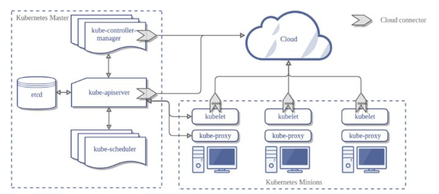
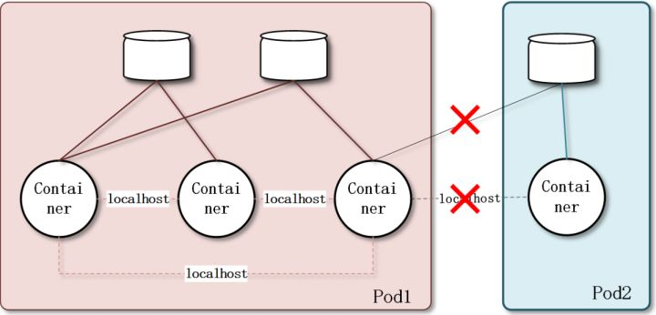
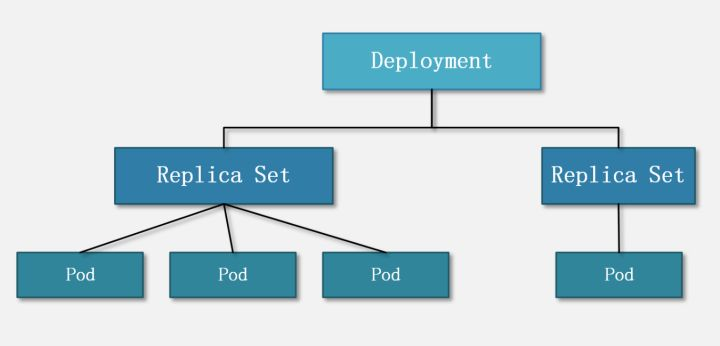
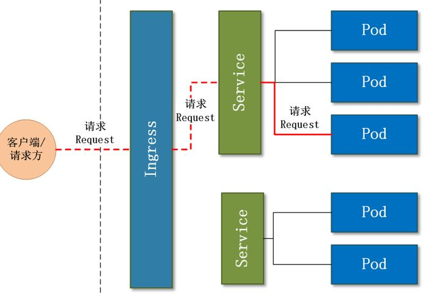
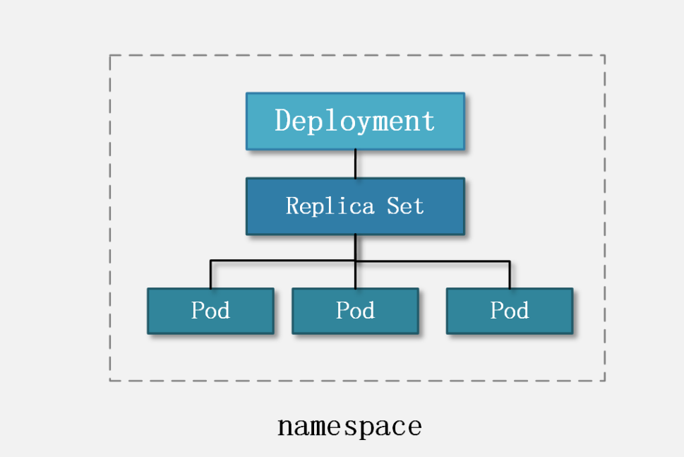

# 概览
摘录自 [https://zhuanlan.zhihu.com/p/339008746](https://zhuanlan.zhihu.com/p/339008746)

同时参考了  
+ [https://medium.com/@kumargaurav1247/components-of-kubernetes-architecture-6feea4d5c712](https://medium.com/@kumargaurav1247/components-of-kubernetes-architecture-6feea4d5c712)
+ [https://kubernetes.io/zh/docs/home/](https://kubernetes.io/zh/docs/home/)

# K8S 概览
## K8S 是什么， 为什么需要它
>Kubernetes is an open source system for managing containerized applications across multiple hosts. It provides basic mechanisms for deployment, maintenance, and scaling of applications.
用于自动部署、扩展和管理“容器化（containerized）应用程序”的开源系统。

翻译成大白话就是：“K8 是 S 负责自动化运维管理多个 Docker 程序的集群”。

传统的后端部署办法：把程序包放到服务器上跑起来。如果服务的请求量上来，已部署的服务响应不过来怎么办？如果请求量、内存、CPU 超过阈值做了告警，运维马上再加几台服务器，部署好服务之后，接入负载均衡来分担已有服务的压力。

有没有办法**自动完成服务的部署、更新、卸载和扩容、缩容**呢？就是 K8S 要做的事情：**自动化运维管理** Docker（容器化）程序。

## 宏观架构

K8S 是属于主从设备模型（Master-Slave 架构），即 Master 节点负责核心的调度、管理和运维，Slave 节点则在执行用户的程序。

Master Node 和 Worker Node 是分别安装了 K8S 的 Master 和 Woker 组件的实体服务器，每个 Node 都对应了一台实体服务器（虽然 Master Node 可以和其中一个 Worker Node 安装在同一台服务器，但是建议 Master Node 单独部署），所有 Master Node 和 Worker Node 组成了 K8S 集群，同一个集群可能存在多个 Master Node 和 Worker Node。

Master Node 的组件：
+ API Server  
    K8S 的请求入口服务。API Server 负责接收 K8S 所有请求（来自 UI 界面或者 CLI 命令行工具），然后，API Server 根据用户的具体请求，去通知其他组件干活。
+ Scheduler  
    K8S 所有 Worker Node 的调度器。当用户要部署服务时，Scheduler 会选择最合适的 Worker Node（服务器）来部署。
+ Controller Manager  
    Worker Node 的监控器。Controller Manager 有很多具体的 Controller。Controller 负责监控 Worker Node 上部署的服务的状态，并通知 Scheduler 及时调整。
+ etcd  
    K8S 的存储服务。etcd 存储了 K8S 的关键配置和用户配置。

Worker Node 组件：
+ Kubelet  
    Worker Node 的监视器，以及与 Master Node 的通讯器。定期向 Master Node **汇报**自己 Node 上运行的服务的状态，并**接受**来自 Master Node 的指示采取调整措施。
+ Kube-Proxy  
    K8S 的网络代理。负责 Node 在 K8S 的网络通讯、以及对外部网络流量的负载均衡。（TODO：了解一下能干吗）
+ Container Runtime  
    Worker Node 的运行环境。即安装了容器化所需的软件环境，比如 Docker Engine。
+ Logging Layer
    K8S 的监控状态收集器。称呼为 **Monitor** 可能更合适？Logging Layer 负责采集 Node 上所有服务的 CPU、内存、磁盘、网络等监控项信息。
+ Add-Ons  
    插件组件

总结来看，K8S 的 Master Node 具备：请求入口管理（API Server），Worker Node 调度（Scheduler），监控和自动调节（Controller Manager），以及存储功能（etcd）；而 K8S 的 Worker Node 具备：状态和监控收集（Kubelet），网络和负载均衡（Kube-Proxy）、保障容器化运行环境（Container Runtime）、以及定制化功能（Add-Ons）

# 重要概念
## Pod 实例
Pod是可以在 Kubernetes 中创建和管理的、最小的可部署的计算单元。一个 Work Node 中可以有多个 Pod。 “最小 xx 单位”就是资源的闭包、集合。比如一个进程是存储和计算的闭包，一个线程是 CPU 资源（包括寄存器、ALU 等）的闭包。**Pod 就是 K8S 中一个服务的闭包。Pod 可以被理解成一群可以共享网络、存储和计算资源的容器化服务的集合**。

同一个 Pod 之间的 Container 可以通过 localhost 互相访问，并且可以挂载 Pod 内所有的数据卷；但是不同的 Pod 之间的 Container 不能用 localhost 访问，也不能挂载其他 Pod 的数据卷。

K8S 中所有的对象都通过 yaml 来表示  [Pod 的 yaml 示例](https://raw.githubusercontent.com/kubernetes/website/master/content/zh/examples/pods/resource/memory-request-limit.yaml)

## Volume 数据卷
K8S 支持很多类型的 volume 数据卷挂载，[参见 K8S 卷](https://kubernetes.io/zh/docs/concepts/storage/volumes/)。

如何理解 volume提到：需要手动 mount 的磁盘”。此外，有一点可以帮助理解：数据卷 volume 是 Pod 内部的磁盘资源。

volume 是 K8S 的对象，对应一个实体的数据卷；而 volumeMounts 只是 container 的挂载点，对应 container 的其中一个参数。但是，volumeMounts 依赖于 volume，只有当 Pod 内有 volume 资源的时候，该 Pod 内部的 container 才可能有 volumeMounts。

## Container 容器
一个 Pod 内可以有多个容器 container。很有多种容器类型，此次就权当是 docker 标准容器。

## Deployment 和 ReplicaSet
Deployment 的作用是管理和控制 Pod 和 ReplicaSet，管控它们运行在**用户期望的状态中**。Deployment 就是包工头，主要负责监督底下的工人 Pod 干活，确保每时每刻有用户要求数量的 Pod 在工作。如果一旦发现某个工人 Pod 不行了，就赶紧新拉一个 Pod 过来替换它。

ReplicaSet 的作用就是管理和控制 Pod，管控他们好好干活。但是，ReplicaSet 受控于 Deployment。形象来说，ReplicaSet 就是总包工头手下的小包工头。

用户会直接操作 Deployment 部署服务（用户指明目标状态），而当 Deployment 被部署的时候，K8S 会自动生成要求的 ReplicaSet 和 Pod。

## Service 和 Ingress
### Service
前文介绍的 Deployment、ReplicationController 和 ReplicaSet 主要管控 Pod 程序服务；那么，Service 和 Ingress 则负责管控 Pod 网络服务。

> [Service](https://kubernetes.io/zh/docs/concepts/services-networking/service/): 将运行在一组 Pods 上的应用程序公开为网络服务的抽象方法。
使用 Kubernetes，您无需修改应用程序即可使用不熟悉的服务发现机制。 Kubernetes 为 Pods 提供自己的 IP 地址，并为一组 Pod 提供相同的 DNS 名， 并且可以在它们之间进行负载均衡。

K8S 中的服务（Service）并不是我们常说的“服务”的含义，而更像是网关层，是若干个 Pod 的流量入口、流量均衡器。

为什么要 Service 呢： Pod 是有生命周期的。 它们可以被创建，而且销毁之后不会再启动。 如果您使用 Deployment 来运行您的应用程序，则它可以动态创建和销毁 Pod。
每个 Pod 都有自己的 IP 地址，但是在 Deployment 中，在同一时刻运行的 Pod 集合可能与稍后运行该应用程序的 Pod 集合不同。

Service 是 K8S 服务的核心，屏蔽了服务细节，统一对外暴露服务接口，真正做到了“微服务”。举个例子，我们的一个服务 A，部署了 3 个备份，也就是 3 个 Pod；对于用户来说，只需要关注一个 Service 的入口就可以，而不需要操心究竟应该请求哪一个 Pod。优势非常明显：一方面外部用户不需要感知因为 Pod 上服务的意外崩溃、K8S 重新拉起 Pod 而造成的 IP 变更，外部用户也不需要感知因升级、变更服务带来的 Pod 替换而造成的 IP 变化，另一方面，Service 还可以做流量负载均衡。

### Ingress
Service 主要负责 K8S 集群内部的网络拓扑。那么集群外部怎么访问集群内部呢？这个时候就需要 Ingress 了

> Ingress 是对集群中服务的外部访问进行管理的 API 对象，典型的访问方式是 HTTP。
> 
> Ingress 可以提供负载均衡、SSL 终结和基于名称的虚拟托管。
>
> Ingress 是用于将外部 HTTP（S）流量路由到服务（Service）

## namespace 命名空间
namespace 跟 Pod 没有直接关系，而是 K8S 另一个维度的对象。或者说，前文提到的概念都是为了服务 Pod 的，而 namespace 则是为了服务整个 K8S 集群的。

namespace 是为了把一个 K8S 集群划分为若干个资源不可共享的虚拟集群而诞生的。也就是说，可以通过在 K8S 集群内创建 namespace 来分隔资源和对象。

# kubectl
Kubectl 是一个命令行接口，用于对 Kubernetes 集群运行命令。也就是说，可以通过 kubectl 来操作 K8S 集群。

> Tip: kubectl 是 K8S 的命令行工具，并不需要 kubectl 安装在 K8S 集群的任何 Node 上，但是，需要确保安装 kubectl 的机器和 K8S 的集群能够进行网络互通。