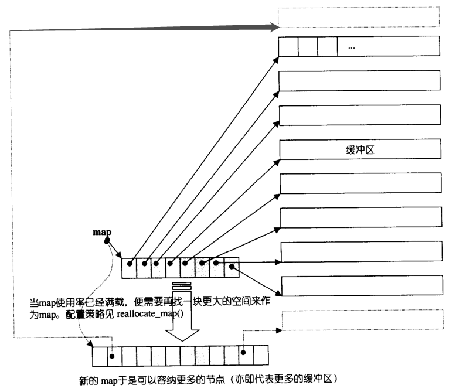

# 知识点整理

## 关于内存

### volatile

- volatile 关键字声明的变量，每次访问时都必须从内存中取出值（没有被 volatile 修饰的变量，可能由于编译器的优化，从 CPU 寄存器中取值）
- 当变量可能被某些编译器未知的因素（操作系统、硬件、其它线程等）更改，就使用 volatile 告诉编译器不应对这样的对象进行优化。

### sizeof

- sizeof 对数组，得到整个数组所占空间大小。
- sizeof 对指针，得到指针本身所占空间大小。

### 实例化对象的内存布局

成员变量是按照定义的顺序来保存的, 最先声明的在最上边, 然后依次保存。

根据是否含有虚函数，会决定是否有虚函数指针（可能多个）

根据是否是虚继承，会决定是否有虚基类表指针。（可能多个）

### 内存布局

+ 全局变量和静态变量被分配到同一块内存中，在以前的 C 语言中，全局变量和静态变量又分为初始化的和未初始化的，在 C++ 里面没有这个区分了，它们共同占用同一块内存区，在该区定义的变量若没有初始化，则会被自动初始化，例如 int 型变量自动初始为 0
+ 有点疑惑这个常量区对应到 OS 进程内存地址空间的哪一块。


### 内存分配和管理

#### malloc、calloc、realloc、alloca

1. malloc：申请指定字节数的内存。申请到的内存中的初始值不确定。其返回 void 类型指针，通常需要进行类型转换

   配合 free 使用。释放内存后指针置空。

2. calloc：为指定长度的对象，分配能容纳其指定个数的内存。申请到的内存的每一位（bit）都初始化为 0。

3. realloc：更改以前分配的内存长度（增加或减少）。当增加长度时，可能需将以前分配区的内容移到另一个足够大的区域，而新增区域内的初始值则不确定。

4. alloca：在栈上申请内存。程序在出栈的时候，会自动释放内存。但是需要注意的是，alloca 不具可移植性, 而且在没有传统堆栈的机器上很难实现。alloca 不宜使用在必须广泛移植的程序中。

##### malloc 底层原理

按照分配内存大小的不同，使用不用的方法，小空间的分配会直接使用堆，大空间的分配使用的就是内存文件映射。(目前是以128KB的空间为大小的界限)

###### 堆实现（存在碎片问题）

通过 brk() 系统调用从堆分配内存。通过 brk() 函数将「堆顶」指针向高地址移动，获得新的内存空间。free 释放内存的时候，**并不一定会把内存归还给操作系统，而是可能留着待下次使用**；


**经典的方案：链式分配**

在程序运行过程中，堆内存从低地址向高地址连续分配，随着内存的释放，会出现不连续的空闲区域。程序需要内存时，malloc() **首先遍历空闲区域**，看是否有大小合适的内存块，如果有，就分配（并拆分），**如果没有，就向操作系统申请**（发生系统调用）。为了保证分配给程序的内存的连续性，malloc() 只会在一个空闲区域中分配，而不能将多个空闲区域联合起来（除非这些空闲的内存块连续）。

内存块（包括已分配和空闲的）的结构类似于链表，它们之间通过指针连接在一起。next 是指针，指向下一个内存块，used 用来表示当前内存块是否已被使用。


**高效的方案：内存池**

malloc() 在分配内存的时候，并不是按用户预期申请的字节数来分配内存空间大小，而是**会预分配更大的空间作为内存池**。内存池如何管理应该有多种方案？

> 比如参考 Linux 内核的伙伴算法。

###### 内存文件映射实现

通过**匿名的 mmap()** 方式申请内存，创建vma结构。free 释放内存的时候，**会把内存归还给操作系统，内存得到真正的释放**。

**为什么不都用 mmap() ：**向操作系统申请内存，是要通过系统调用的，执行系统调用是要**进入内核态**的，然后在回到用户态，运行态的切换会耗费不少时间。所以，申请内存的操作应该避免频繁的系统调用，如果都用 mmap 来分配内存，等于每次都要执行系统调用。另外，因为 mmap 分配的内存每次释放的时候，都会归还给操作系统，于是每次 mmap 分配的虚拟地址都是**缺页状态**的，然后在第一次访问该虚拟地址的时候，就会触发缺页中断。

#### new、delete

1. new、delete 是运算符，可以重载。其返回具体类型指针。
1. new / new[]：完成两件事，**先底层调用 malloc** 分配了内存，然后调用**构造函数**（创建对象）。
2. delete/delete[]：也完成两件事，先调用**析构函数**（清理资源），然后**底层调用 free*** 释放空间。（所以如果你在析构函数中调用 delete this 就会一直循环调用虚构函数，最终栈溢出）
3. new 在申请内存时会自动计算所需字节数，而 malloc 则需我们自己输入申请内存空间的字节数。

> delete this 合法吗？
>
> [Is it legal (and moral) for a member function to say delete this?](https://isocpp.org/wiki/faq/freestore-mgmt#delete-this)
>
> 合法，但：
>
> 1. 必须保证 this 对象是通过 `new`分配的（不是 `new[]`、不是 placement new、不是栈上、不是全局、不是其他对象成员）
> 2. 必须保证调用 `delete this` 的成员函数是最后一个调用 this 的成员函数，之后没人使用

> new delete 的重载
>
> 为什么要这样呢？
>
> + 有时希望使用某种特殊的动态内存分配方法。例如，可能有些分配子程序，他们的堆已耗尽，自动开始把一个磁盘文件当虚存储使用
> + 希望自定义运算符 delete，以用 0 覆盖被回收的堆内存块，以提高应用程序数据的安全性。
> + 可以在重载新的运算符功能中添加异常处理例程。
>
> 使用 new 构建某个重载了 new 的对象时，先调用 new 的重载函数，再**自动**调用该类的构造函数
>
> ```c++
> void* A::operator new(size_t size) { // 这个函数只是申请内存罢了，不管吧就先
>     cout << "my new" << endl;
>     return malloc(size);
> }
> 
> void operator delete(void* var) {
>     Person *tmp=static_cast<Person*>(var);
>     if(tmp==nullptr){
>         exit(0);
>     }
>     if(tmp->d_secur){  // delete 前对用户敏感信息重置为默认值
>         tmp->d_name="";
>         tmp->d_age=0;
>         tmp->d_height=0;
>         tmp->d_idNo="";
>     }
>     ::operator delete (var);
>     var=nullptr;
> }
> ```

#### 定位new 

定位 new（placement new）允许我们向 new 传递额外的地址参数，从而在预先指定的内存区域创建对象。

- `place_address` 是个指针
- `initializers` 提供一个（可能为空的）以逗号分隔的初始值列表

```c++
new (place_address) type
new (place_address) type (initializers)
new (place_address) type [size]
new (place_address) type [size] { braced initializer list }
```

#### 如何定义一个只能在堆上（栈上）生成对象的类？

#### 只能在堆上

方法：将析构函数设置为私有

原因：C++ 是静态绑定语言，编译器管理栈上对象的生命周期，编译器在为类对象分配栈空间时，会先检查类的析构函数的访问性。若析构函数不可访问，则不能在栈上创建对象。

#### 只能在栈上

方法：将 new 和 delete 重载为私有

原因：在堆上生成对象，使用 new 关键词操作，其过程分为两阶段：第一阶段，使用 new 在堆上寻找可用内存，分配给对象；第二阶段，调用构造函数生成对象。将 new 操作设置为私有，那么第一阶段就无法完成，就不能够在堆上生成对象。

### 智能指针（详见 cpp11 专区）

### 关于内存对齐

+ 有效对齐值（对齐单位）：是给定值**#pragma pack(n)** 与 **结构体中最长数据类型长度**，两者中较小的那个。
+ 每个成员相对于结构体首地址的偏移量都是 **该成员大小与有效对齐值中较小那个** 的整数倍，如有需要编译器会在成员之间加上填充字节。
+ 总大小为 **有效对齐值** 的**整数倍**，如有需要编译器会在最末一个成员之后加上填充字节。

内存对齐规则 - 开潜艇的飞行员的文章 - 知乎 https://zhuanlan.zhihu.com/p/463658477

## 关于进程线程的操作、锁

## 关于类及面向对象

### 面向对象


#### 封装 & 继承

+ 把客观事物封装成抽象的类，并且类可以把自己的数据和方法只让可信的类或者对象操作，对不可信的进行信息隐藏。关键字：public, protected, private。不写默认为 private。

- 基类（父类）——> 派生类（子类）

#### 多态

多态是以封装和继承为基础的。C++ 多态分类及实现：【主要说前两个吧】

1. 编译期静态**重载多态**（Ad-hoc Polymorphism，编译期）：函数重载、运算符重载

   ```c++
   class A
   {
   public:
       void do(int a);
       void do(int a, int b);
   };
   ```

2. **运行期动态多态**：虚函数

   - 虚函数：用 virtual 修饰成员函数，使其成为虚函数

   - **动态绑定**：当使用基类的引用或指针调用一个虚函数时将发生动态绑定

     - 静态函数（static）不能是虚函数

     - 构造函数不能是虚函数（因为在调用构造函数时，虚表指针 vptr 并没有在对象的内存空间中，必须要构造函数调用完成后才会形成虚表指针 vptr，这样才能找到虚函数表 vtable）

       > 容易混淆的概念，纯虚类是可以有构造函数的。可以定义一些公用的操作。

3. 参数多态性（Parametric Polymorphism，编译期）：类模板、函数模板

4. 强制多态（Coercion Polymorphism，编译期/运行期）：基本类型转换、自定义类型转换

### 运行时动态识别 RTTI

由于面向对象程序设计中多态性的要求，C++ 中的指针或引用 (Reference) 本身的类型，可能与它实际代表（指向或引用）的类型并不一致。有时我们需要将一个多态指针转换为其实际指向对象的类型，就需要知道运行时的类型信息，这就产生了运行时类型识别的要求。

RTTI 提供了两个非常有用的操作符：`typeid` 和 `dynamic_cast`。

`typeid` 操作符，返回指针和引用所指的实际类型；

```c++
cout << typeid(*obj).name() << endl;

if(typeid(*obj) == typeid(CLASS_A))            // 判断对象类型
{
    Bird *bird = dynamic_cast<CLASS_A *>(obj); // 对象转化
    bird->foraging();
}
```

### 构造函数和析构函数

能不能是虚函数看后续章节的分析。

#### 构造（析构）函数可以抛出异常吗

+ 构造函数在 error handling 方面，可以抛出异常，并且只能抛出异常。抛出异常会让该对象自动释放内存，避免了内存泄漏。（但是指针之类的不会啊！指针自己的内存会被释放，但是指向的空间不会。所以你要么自己在里面处理好了再 throw，或者最好用智能指针！）

+ 不要在析构函数中抛出异常！虽然 C++ 并不禁止析构函数抛出异常。

  如果抛出异常了，那后面的都不要析构了吗，会内存泄漏啊？所以自己吃掉异常自己处理。更严重的，代码如下，当vector被析构时，他会一一调用里面所有的A的析构函数，假如有vector里面有两个A，第一个Ａ析构时抛出异常，那么是处理异常还是继续析构呢？继续析构，就会同时出现两个异常，这是C++无法处理的，一般会自动调用terminate()终结程序运行。而如果选择处理异常，那么第二个A的资源又无法释放。

  ```c++
  class A(){
       ...
       ~A(){throw Exception();}
  }
  void foo(){
       std::vector<A> v;
       ...
  }
  ```

### 虚函数

- **虚函数**的类用于 “实作继承”，**继承接口的同时也继承了父类的实现**。**纯虚函数**关注的是接口的统一性，**实现由子类完成**。

> 虚函数如果不实现其实也不会报错，但是如果要实例化 Base 类就会报错。

#### 虚函数的开销

其实通过 vptr 去找 vtable 再找虚函数入口地址，只是几次内存间接寻址，倒也还好。虚函数运行时所需的代价主要是虚函数**不能是内联函数**。因为编译器无法把确定指针指向的是哪个对象，也因此无法直接把函数代码拷贝过去。

#### 哪些能是虚函数？

##### 虚析构函数

虚析构函数是为了解决基类的指针指向派生类对象，并用基类的指针删除派生类对象时的问题。如果不用虚函数，子类的自由的成员变量可能不能被正常析构。

##### 内联函数、构造（析构）函数、静态成员函数可以吗？都不行

+ inline 是编译时展开，必须有实体

+ 构造函数跟虚构函数里面都是可以调用虚函数的，并且编译器不会报错。但是在基类中声明纯虚函数并且在基类的析构函数中调用，编译器会报错。

  **C++标准规定，在构造子类时调用父类的构造函数，而父类的构造函数中又调用了虚成员函数，这个虚成员函数即使被子类重写，也不允许发生多态的行为。即，这时必须要调用父类的虚函数，而不子类重写后的虚函数。**

  因为：基类 part 构造完成之后，派生 part 构造执行前，会有一条指令把对象中的 vfptr 覆盖成 derived::vfptr。因此，在这之后，你才能正确的触发多态。在这之前，vfptr 指向的是父类，所以调用的父类对应的虚函数。

  析构的时候同理，在析构基类的时候，vptr 指向的是基类的 vtable。

+ static 属于 class 自己的，成员函数实例相关，静态函数类相关，所以不应该是虚函数。而且，调用静态函数的时候，是不会隐式传入 this 的，也就不能根据 vptr 找到 vtable。

#### 纯虚函数

纯虚函数是一种特殊的虚函数，当在基类中不能对虚函数给出有意义的实现，就把它声明为纯虚函数，它的实现留给该基类的派生类去做。**通常用于定义接口。含有纯虚函数的类被称为抽象类，不能实例化。**仅含有纯虚函数的抽象类又称为**接口类**。

> 但是纯虚函数也是可以在基类实现的，子类可以显式的使用。可以定义一些公用的操作。

```c++
virtual int A() = 0;
```

#### 虚函数指针、虚函数表

虚函数（运行期多态）的实现过程：

+ 编译器在发现基类中有虚函数时，会自动按照声明顺序，给每个类维护一个一维数组，虚表里保存了虚函数的入口地址

+ 关于虚表：

  + 当派生类对基类的虚函数没有重写时，派生类的虚表指针指向的是基类的虚表。
  + 当派生类对基类的虚函数重写时，派生类的虚表指针指向的是自身的虚表。对应函数的地址就会被替换。
  + 当派生类中有自己的虚函数时，在自己的（第一个）虚表中将此虚函数地址添加在后面。
  + 多继承场景下，派生类对象的内存中存在两个虚表指针，分别指向两个虚函数表。

  > 非虚函数咋调用的呢？**非虚函数不需要进行查表的操作**。那么我猜测，编译器编译的时候，直接把非虚函数的地址改到代码中了。

+ **编译器会在每个对象的前四个字节中保存一个虚表指针，即 vptr**，指向对象所属类的虚表（是数组指针，不是指针数组，这样可以避免虚函数增多的时候，对象所占空间增大）。**在构造时**，根据对象的类型去初始化虚指针 vptr，从而让 vptr 指向正确的虚表，从而在调用虚函数时，能找到正确的函数。

  值得注意的是，`__vfptr`是 const 的，也就限制了通过对象去修改它所对应的类的虚函数表。

+ 当子类覆盖了父类的虚函数，子类的虚函数表中对应函数的地址就会被替换。


### 虚继承

虚继承用于解决多继承条件下的菱形继承问题（浪费存储空间、存在二义性）。

底层实现原理与编译器相关，一般通过**虚基类指针**和**虚基类表**实现，每个虚继承的子类都有:

+ 一个虚基类指针（占用一个指针的存储空间，4字节）

+ 虚基类表（该类共有，不占用对象的存储空间）

  > （需要强调的是，**虚基类依旧会在子类里面存在一份拷贝**）；当虚继承的子类被当做父类继承时，虚基类指针也会被继承。

虚基类表指针 vbptr 指针指向了虚基类表（virtual table），**表中记录了虚基类与本类的偏移地址**；通过偏移地址，这样就找到了虚基类成员，而虚继承也不用像普通多继承那样维持着公共基类（虚基类）的两份同样的拷贝，节省了存储空间。


### this

+ `this` 指针是一个隐含于每一个**非静态成员函数**中的特殊指针。它指向调用该成员函数的那个对象。
+ 当对一个对象调用成员函数时，编译程序先将对象的地址赋给 `this` 指针，然后调用成员函数，每次成员函数存取数据成员时，都隐式使用 `this` 指针。
+ 按照 object 是否为 const，可以看作是传入了一个 `const ClassName *` or `const ClassName* const`
+ `this` 并不是一个常规变量，而是个右值，所以不能取得 `this` 的地址（不能 `&this`）。【this 指针会因编译器不同而有不同的放置位置。可能是栈，也可能是寄存器，甚至全局变量。在汇编级别里面，一个值只会以3种形式出现：立即数、寄存器值和内存变量值。不是存放在寄存器就是存放在内存中。】

### C++ 中 struct、class、union

> 除了默认权限，他们没什么分别

struct 默认的数据访问控制是 public 的，而 class 作为对象的实现体，它默认的成员变量访问控制是 private 的。

默认的继承访问权限类似。struct 是 public 的，class 是 private 的。

union 以后再说

> C 实现 C++ 类（以后再说）
>
> C 实现 C++ 的面向对象特性（封装、继承、多态）
>
> - 封装：使用函数指针把属性与方法封装到结构体中
> - 继承：结构体嵌套
> - 多态：父类与子类方法的函数指针不同
>
> > [Can you write object-oriented code in C? [closed\]](https://stackoverflow.com/a/351745)

### explicit（显式）关键字

+ explicit 修饰构造函数时，可以防止隐式转换和**复制初始化**
+ explicit 修饰转换函数时，可以防止隐式转换，但按语境转换除外

```cpp
struct B
{
    explicit B(int) {}
    explicit operator bool() const { return true; }
};

void doB(B b) {}

int main()
{
    B b1(1);        // OK：直接初始化
    B b2 = 1;        // 错误：被 explicit 修饰构造函数的对象不可以复制初始化
    B b3{ 1 };        // OK：直接列表初始化
    B b4 = { 1 };        // 错误：被 explicit 修饰构造函数的对象不可以复制列表初始化
    B b5 = (B)1;        // OK：允许 static_cast 的显式转换
    doB(1);            // 错误：被 explicit 修饰构造函数的对象不可以从 int 到 B 的隐式转换
    if (b1);        // OK：被 explicit 修饰转换函数 B::operator bool() 的对象可以从 B 到 bool 的按语境转换
    bool b6(b1);        // OK：被 explicit 修饰转换函数 B::operator bool() 的对象可以从 B 到 bool 的按语境转换
    bool b7 = b1;        // 错误：被 explicit 修饰转换函数 B::operator bool() 的对象不可以隐式转换
    bool b8 = static_cast<bool>(b1);  // OK：static_cast 进行直接初始化

    return 0;
}
```

### friend 友元类和友元函数

- 能访问私有成员，破坏了封装性
- 友元关系不可传递、且是单向的

常见于运算符重载

```c++
class Vector{
	private:
	...
	public:
		...
		Vector & operator*(const Vector v) const;
		friend Vector & operator*(double n, const Vector v);
		Vector & operator*(double n, const Vector v) const;
    	// 即使把 ostream 类作为 Vector 的友元类也没用，因为我没法改动 ostream 类的结构体，为其增加成员函数，因此只能搞一个非成员函数。
    	friend ostream & operator<<( ostream & os,const Vector & v);
}
```

### 枚举类

在C++11新标准中推出了一种新的枚举定义办法叫做枚举类，也称作强类型枚举。（默认的底层类型是 int 类型）

```c++
enum class 枚举类型名: 底层类型 {枚举值列表};
enum class Type { General, Light, Medium, Heavy};//所有枚举常量都是int类型
enum class Type: char { General, Light, Medium, Heavy};//所有枚举常量都是字符类型
enum class Category { General=1, Pistol, MachineGun, Cannon};//后面的枚举常量值依次增加
```

好处：

+ 枚举类的强作用域就是把这个**作用域限制在枚举类里面**，就可以**避免在不同枚举类型之间的枚举值重名的问题**。
+ 转换限制，枚举类对象不可以与整型隐式地互相转换。（C 语言在程序中是可以直接使用枚举值的）
+ 可以指定底层类型

## 关于 STL 和底层实现

Standard Template Library。包括标准容器、算法、迭代器（和空间配置器(allocator)、配接器(adapters)、仿函数(functors)）

### 容器

| 容器                                                         | 底层数据结构                      | 时间复杂度                                                   | 有无序 | 可不可重复 | 其他                                                         |
| ------------------------------------------------------------ | --------------------------------- | ------------------------------------------------------------ | ------ | ---------- | ------------------------------------------------------------ |
| [array](https://github.com/huihut/interview/tree/master/STL#array) | 数组                              | 随机读改 O(1)                                                | 无序   | 可重复     | 支持随机访问                                                 |
| [vector](https://github.com/huihut/interview/tree/master/STL#vector) | 数组                              | 随机读改、尾部插入、尾部删除 O(1)<br/>头部插入、头部删除 O(n) | 无序   | 可重复     | 支持随机访问                                                 |
| [deque](https://github.com/huihut/interview/tree/master/STL#deque) | 【？】一个中央控制器 + 多个缓冲区 | 头尾插入、头尾删除 O(1)                                      | 无序   | 可重复     | 特定的库可能以不同的方式实现，**通常作为某种形式的动态数组**。但无论如何，它们**允许通过随机访问迭代器直接访问各个元素**，并根据需要通过扩展和收缩容器来自动处理存储。 <br/>相比 vector 能够更高效的在首部插入。但是，双端队列不保证将其所有元素存储在连续的存储位置：指向其中一个元素的指针加上 offset 来访问其他元素会导致未定义的行为。（所以用迭代器吧？) |
| [forward_list](https://github.com/huihut/interview/tree/master/STL#forward_list) | 单向链表                          | 插入、删除 O(1)                                              | 无序   | 可重复     | 不支持随机访问                                               |
| [list](https://github.com/huihut/interview/tree/master/STL#list) | 双向链表                          | 插入、删除 O(1)                                              | 无序   | 可重复     | 不支持随机访问                                               |
| [stack](https://github.com/huihut/interview/tree/master/STL#stack) | deque / list                      | 顶部插入、顶部删除 O(1)                                      | 无序   | 可重复     | deque 或 list 封闭头端开口，不用 vector 的原因应该是容量大小有限制，扩容耗时 |
| [queue](https://github.com/huihut/interview/tree/master/STL#queue) | deque / list                      | 尾部插入、头部删除 O(1)                                      | 无序   | 可重复     | deque 或 list 封闭头端开口，不用 vector 的原因应该是容量大小有限制，扩容耗时 |
| [priority_queue](https://github.com/huihut/interview/tree/master/STL#priority_queue) | vector + max-heap                 | 插入、删除 O(log<sub>2</sub>n)                               | 有序   | 可重复     | vector容器+heap处理规则                                      |
| [set](https://github.com/huihut/interview/tree/master/STL#set) | 红黑树                            | 插入、删除、查找 O(log<sub>2</sub>n)                         | 有序   | 不可重复   |                                                              |
| [multiset](https://github.com/huihut/interview/tree/master/STL#multiset) | 红黑树                            | 插入、删除、查找 O(log<sub>2</sub>n)                         | 有序   | 可重复     |                                                              |
| [map](https://github.com/huihut/interview/tree/master/STL#map) | 红黑树                            | 插入、删除、查找 O(log<sub>2</sub>n)                         | 有序   | 不可重复   |                                                              |
| [multimap](https://github.com/huihut/interview/tree/master/STL#multimap) | 红黑树                            | 插入、删除、查找 O(log<sub>2</sub>n)                         | 有序   | 可重复     |                                                              |
| [unordered_set](https://github.com/huihut/interview/tree/master/STL#unordered_set) | 哈希表                            | 插入、删除、查找 O(1) 最差 O(n)                              | 无序   | 不可重复   |                                                              |
| [unordered_multiset](https://github.com/huihut/interview/tree/master/STL#unordered_multiset) | 哈希表                            | 插入、删除、查找 O(1) 最差 O(n)                              | 无序   | 可重复     |                                                              |
| [unordered_map](https://github.com/huihut/interview/tree/master/STL#unordered_map) | 哈希表                            | 插入、删除、查找 O(1) 最差 O(n)                              | 无序   | 不可重复   |                                                              |
| [unordered_multimap](https://github.com/huihut/interview/tree/master/STL#unordered_multimap) | 哈希表                            | 插入、删除、查找 O(1) 最差 O(n)                              | 无序   | 可重复     |                                                              |

#### 在共享内存上使用 STL 容器？

+ 一个方法就是进程A把容器放在共享内存中的确定地址上（fixed offsets），则进程B可以从该已知地址上获取容器。
+ 另外一个改进点的办法是，进程 A 先在共享内存某块确定地址上放置一个 map 容器，然后进程 A 再创建其他容器，然后给其取个名字和地址一并保存到这个 map 容器里。进程 B 知道如何获取该保存了地址映射的 map 容器，然后同样再根据名字取得其他容器的地址。（哈有点像服务注册服务发现）

### 顺序容器

#### string（不算容器，知识一个类）

#### vector底层

vector 是可以自动扩充空间的，连续线性空间，支持随机存储。

start 和 finish 之间是已经被使用的空间范围，end_of_storage 是整块连续空间包括备用空间的尾部。finish- start 就是 size。


1. reserve() 和 resize()：

   + reserve 为容器预留足够的空间，避免不必要的重复分配。如果 n 大于 vector 当前的容量，reserve 会对 vector 进行扩容。其他情况下都不会重新分配vector的存储空间。
   + resize 调整容器中有效数据区域的尺寸，**如果尺寸变小，原来数据多余的截掉**。若尺寸变大，不够的数据用该函数第二个参数填充或默认值填充，**影响size**。

2. vector 的元素类型可以是引用吗？

   NO。vector的底层实现要求连续的对象排列，引用并非对象，没有实际地址，因此vector的元素类型不能是引用。

3. vector 迭代器失效的情况：引起了内存重新分配的行为。

   例如插入元素，如果引起内存重新分配，所以指向原内存的迭代器全部失效。

   当删除容器中一个元素后,该迭代器所指向的元素已经被删除，那么也造成迭代器失效。erase方法会返回下一个有效的迭代器。

4. 正确释放vector的内存 (clear(),shrink_to_fit())

   vec.clear()：清空内容，但是不释放内存。

   vec.shrink_to_fit()：请求容器降低其capacity和size匹配。

   vec.clear();vec.shrink_to_fit();：清空内容，且释放内存。

5. 扩容方式

   扩容大小为原来的两倍

#### list 底层

list的底层是一个**双向链表**，以结点为单位存放数据，结点的地址在内存中不一定连续，每次插入或删除一个元素，就配置或释放一个元素空间。

list不支持随机存取，**适合需要大量的插入和删除**，而不关心随即存取的应用场景。

注意：指针 node 指向一个尾端的空白节点，node 便能符合 STL **前闭后开**的区间要求。由于没有保存 size，其 size() 复杂度是 O(n)。

sort 如果让我自己实现的话，用归并排序。总之它是 nlogn的


#### deque 底层

deque是一个双向开口的连续线性空间（**双端队列**），在头尾两端进行元素的插入跟删除操作都有理想的时间复杂度（大概 O(1) 吧 ）。

它有一段一段的定量连续空间构成，可以在前端或尾端增加新的一段连续定量空间。

+ 使用一段所谓的 map（不是 STL map）作为主控，是一块连续空间，每个元素都是指针，指向一段连续线性空间，称为缓冲区。默认 512 byte？

  > 所以其实可以理解 map 是 T**。

+ deque 的策略是，始终保持至少一个缓冲区。同时，采用符合 STL 规范的 `左闭右开`，因此可以通过 start == finish 来判断是不是为空。也可以通过他们的计算来判断当前的 size
+ 每次更改 map 的时候，总是尽量将现有缓冲区指针放到中间。
+ pop() 的时候会自动释放空的缓冲区（map 似乎可以不动）

```c++
// 一些精简过的成员
class deque {
    private:
        iterator start_;    // 指向map的头部 (当然也包括这个缓冲区内部的指向)
        iterator finish_;   // 指向map的尾部 (当然也包括这个缓冲区内部的指向)
        map_Pointer map_;   // 指向map（map为一段连续空间）,其内部元素为指针，每个指针指向一个缓存区

        size_type map_size_; //map内部指针的个数
        enum class BuckSize { BUCK_SIZE = 16};
}
```




有空的时候自己实现一个：

```c++
const int BUF_SIZE = 8;

class Deque {
    vector<int *> mp;
    unsigned head_mp;
    unsigned tail_mp ;
    unsigned head_pos;
    unsigned tail_pos;

public:
    Deque() :mp(vector<int *> (8)), head_mp(4), tail_mp(4), head_pos(BUF_SIZE / 2), tail_pos(BUF_SIZE / 2) {
        mp[head_mp] = new int[BUF_SIZE];
    }

    int front() {
        if (head_mp == tail_mp && head_pos == tail_pos) {
            throw std::exception();
        }
        return mp[head_mp][head_pos];
    }

    int back() {
        if (head_mp == tail_mp && head_pos == tail_pos) {
            throw std::exception();
        }
        if (tail_pos == 0) {
            return mp[tail_mp - 1][BUF_SIZE - 1];
        }
        return mp[tail_mp][tail_pos - 1];
    }

    void reallocate_map() {
        vector<int *> tmp_map(mp.size() * 2);
        unsigned start = mp.size() / 2 + 1;
        for (int i = 0; i < mp.size(); ++i) {
            tmp_map[start + i] = mp[i];
        }
        head_mp = start;
        tail_mp = start + mp.size() - 1;
        mp = tmp_map;
    }

    void push_back(const int v) {
        mp[tail_mp][tail_pos] = v;
        tail_pos++;

        if (tail_pos == BUF_SIZE) {
            if (tail_mp + 1 == mp.size()) {
                reallocate_map();
            }

            tail_mp++;
            tail_pos = 0;

            mp[tail_mp] = new int[BUF_SIZE];
        }
    }

    void push_front(const int v) {
        if (head_pos == 0) {
            if (head_mp == 0) {
                reallocate_map();
            }

            head_mp--;
            head_pos = BUF_SIZE - 1;
            mp[head_mp] = new int [BUF_SIZE];
        }

        head_pos--;
        mp[head_mp][head_pos] = v;
    }

    void pop_back() {
        if (tail_pos == 0) {
            delete[] mp[tail_mp];
            tail_mp--;
            tail_pos = BUF_SIZE;
        }
        tail_pos--;
    }

    void pop_front() {
        head_pos++;
        if (head_pos == BUF_SIZE) {
            delete[] mp[head_mp];
            head_mp++;
            head_pos = 0;
        }
    }
};
```

#### stack 底层

缺省情况下使用 deque 作为 stack 的底层结构。这种修改某现有容器的接口，形成另一种风貌的性质，可以称为适配器。因此 stack 往往不被归纳为容器，而是适配器。

+ 也可以用 list vector
+ stack 没有迭代器，因为所有元素进出都必须符合“先进后出”的条件

> 为啥默认用 deque？
>
> 动态扩充的话，比 vector 高效（扩容的时候不需要全拷贝）
>
> 空间利用率比 list 高，指针少了好多

#### queue 底层

和 stack 一样，它也是一个适配器。默认用 deque，也可以用 list。**（不用 vector，没有 pop_back）**。其同样没有迭代器。

#### priority_queue 底层和 heap

heap 不是标准容器，是 priority_queue 的辅助工具。其算法包括堆的插入、删除、建堆、排序等。heap 没有迭代器，不提供遍历功能。

priority 由一个最大堆实现，权值高的在顶部。缺省情况下由 vector 作为底部容器，使用 heap 算法。

### 关联容器

关联容器每个数据都有一个 key 和 value（对于 set 类，key 就是 value）。元素插入时按照某种策略摆放，不允许修改 key，也没有严格意义上的头尾。

#### 红黑树（底层结构）

map 、set、multiset、multimap 的底层实现都是**红黑树**，epoll 模型的底层数据结构也是红黑树，linux 系统中 CFS 进程调度算法，也用到红黑树。

+ 每个结点或是红色或是黑色；
+ 根结点是黑色；
+ 每个叶结点是黑的；
+ 如果一个结点是红的，则它的两个儿子均是黑色；
+ 每个结点到其子孙结点的所有路径上包含相同数目的黑色结点。

通过上面的性质 4 和性质 5，其实上保证了没有任何一条路径会比其他路径长出两倍，所以这样的红黑树是平衡的。它其实是放弃了 AVL 树对度的绝对限制，通过一定的宽松条件，使插入删除操作时不需要过多的旋转操作。（删除最多只旋转 3 次，而 AVL 是 O(logn)。变色比删除快多了）

对于 STL 里的map容器，count 方法与 find 方法，都可以用来判断一个 key 是否出现，mp.count(key) > 0 统计的是 key 出现的次数，因此只能为0/1，而mp.find(key) != mp.end() 则表示key存在。

#### set & multiset

+ set 和 multiset 会根据特定的排序准则自动将元素排序，set 中元素不允许重复，multiset 可以重复。底层使用的是 RB-tree。
+ 为了保证有序，其迭代器是 const 的，不允许修改元素。只能删除重新插入。

+ set 和 multi_set 的不同之处在于，其底层的 RB-tree 插入操作时，一个使用的是 insert_unique()，一个是 insert_equal()。
+ 插入和删除并不会使其他迭代器失效（不涉及到内存重分配，其他节点内存都没变）。同样，因为存储的是结点，不需要内存拷贝和内存移动，所以插入删除效率比一些序列容器高。

#### map & multimap

> 关于 map 的下标访问：将关键码作为下标去执行查找，并返回对应的值；如果不存在这个关键码，就将一个具有该关键码和值类型的默认值的项插入这个map。

map 和 multimap 将 key 和 value 组成的 pair 作为元素，根据 key 的排序准则自动将元素排序（因为红黑树也是二叉搜索树，所以 map 默认是按 key 排序的），map 中元素的 key 不允许重复，multimap 可以重复。

map 迭代器不能修改 first，但是可以修改 second。这和需要保持有序有关。

其余性质和 set & multiset 差不多。

#### hashtable

近乎常数的插入删除搜寻操作。这种表现是以统计为基础的，不依赖输入元素的随机性。

hashtable 采用**开链法**应对碰撞问题。虽然在 list 上执行插入删除搜索等操作是先行操作，但是如果 list 够短，还是够快的。

其预先定义了 28 个质数（逐渐呈现 2 倍关系）以作为筒的大小，筒指针是一个 vector。**当元素总量超过 buckets 的数量后**，进行 rehashing，对散列表进行扩容，将元素进行重新散列。（负载因子始终保持在 0~1）

> + 插入的时候，如果允许重复，那碰到重复的就放在一起。
> + 如果不允许重复，检测到重复停止插入，没检测到就要一直扫描到最后，然后将新插入的放在**队列首部**


```c++
template <class Value>
struct __hashtable_node {
	__hashtable_node* next;
    Value 
};
```

#### unordered_set & unordered_map

unordered_set 以 hashtable 为底层。其键值就是实值，hashtable node 中的 value 没存什么东西（比如直接全填 1？）。unordered_multiset 允许重复 key (value)。用  insert_equal() 而不是 insert_unique()。

unordered_map 也以 hashtable 为底层。几乎就直接转调用了 hashtable 的操作行为。unordered_multiset 就是允许重复。用  insert_equal() 而不是 insert_unique()。unordered_map 允许重复 key。用  insert_equal() 而不是 insert_unique()。


#### ...

### STL 算法

| 算法                                                         | 底层算法                                            | 时间复杂度 | 可不可重复 |
| ------------------------------------------------------------ | --------------------------------------------------- | ---------- | ---------- |
| [find](http://www.cplusplus.com/reference/algorithm/find/)   | 顺序查找                                            | O(n)       | 可重复     |
| [sort](https://github.com/gcc-mirror/gcc/blob/master/libstdc++-v3/include/bits/stl_algo.h#L4808) | [内省排序](https://en.wikipedia.org/wiki/Introsort) | O(n*log2n) | 可重复     |

> sort 它以 quicksort 开始，当递归深度超过基于被排序元素数量（的对数）的级别时，它切换到堆排序，当元素数量低于某个阈值时，它切换到插入排序。


## 一些不知道怎么分类的东西

### const

修饰变量、指针（const pointer & pointer to const）、引用（refer to cosnt）、成员函数

### mutable

C++ 里的 mutable 有两种作用

+ 类中的 mutable

  + 被 mutable 修饰的数据成员，可以在 const 成员函数中修改。

    > 典型场景：getval 用来获取一个值，显然应该是 const 成员函数。但是我如果需要统计访问次数的话，需要对计数器 cnt 自增，所以需要把 cnt 声明为 mutable 的。

+ lambda 表达式中的 mutable

  + 按值捕获（Caputre by Value）的方式不允许程序员在 Lambda 函数的函数体中修改捕获的变量。而以 mutable 修饰 Lambda 函数，则可以打破这种限制。

  + ```c++
    int x{0};
    auto f1 = [=]() mutable {x = 42;};  // okay, 创建了一个函数类型的实例
    auto f2 = [=]()         {x = 42;};  // error, 不允许修改按值捕获的外部变量的值
    ```

### static

+ 修饰普通变量，修改变量的存储区域和生命周期，使变量存储在静态区（已初始的数据段 or BSS 段）。静态局部变量在程序执行到该对象的声明处时被首次初始化，即以后的函数调用不再进行初始化；

+ 修饰普通函数**，表明函数的作用范围，**仅在定义该函数的文件内才能使用**。在多人开发项目时，为了防止与他人命名空间里的函数重名，可以将函数定位为 static。

  > 实现原理：
  >
  > 每个可重定位目标模块 m 都有一个符号表，它包含 m 定义和应用的符号的消息。符号包括了：
  >
  > + 全局符号：没有用 static 修饰的函数和全局变量
  > + 局部符号：用了 static 修饰的函数和全局变量
  > + 外部符号：在模块 A 中定义，并被模块 B 引用的全局符号
  >
  > 链接器解析符号引用的方法是将每个引用与他输入的可重定位目标文件的符号表中的一个确定的符号定义关联起来，通俗来讲就是程序中的变量必须能与符号表中唯一对应。
  >
  > 这个符号表中会规定，这个是不是对外部可见的。需要注意的是，除了 static，const 默认也是 local 可见性的。如果想让 const 外部可见，你需要写 `extern const int i = 5;`
  >
  > 

+ 修饰全局变量，同上

+ 修饰成员变量和成员函数

### inline

- 相当于把内联函数里面的内容写在调用内联函数处，就像做了一个替换一样，不用执行进入函数的步骤，直接执行函数体；
- 比宏多了类型检查，真正具有函数特性
- 编译器一般不内联包含循环、递归、switch 等复杂操作的内联函数（是一个请求而并不保证实现）
- 在类声明中定义的函数，除了虚函数的其他函数都会自动隐式地当成内联函数。

#### 编译器对 inline 函数的处理步骤

1. 将 inline 函数体复制到 inline 函数调用点处；
2. 为所用 inline 函数中的局部变量分配内存空间；
3. 将 inline 函数的的输入参数和返回值映射到调用方法的局部变量空间中；
4. 如果 inline 函数有多个返回点，使用 GOTO 跳到最后。

#### 带来的问题

1. 代码膨胀。内联是以代码膨胀（复制）为代价，每一处内联函数的调用都要复制代码，将使程序的总代码量增大，消耗更多的内存空间。

2. inline 函数无法随着函数库升级而升级。inline函数的改变需要重新编译，不像 non-inline 可以直接链接。

#### 虚函数可以 inline 吗

内联是可以修饰虚函数的，但是当虚函数表现多态性的时候不会去内联。

内联是在**建议编译器内联**，而**虚函数的多态性在运行期**，编译器无法知道**运行期**调用哪个代码，因此虚函数表现为多态性时（运行期）不可以内联。

### assert

断言，**是宏，而非函数**。如果它的条件返回错误，则终止程序执行。可以通过定义 `NDEBUG` 来关闭 assert。

```c++
#ifdef  NDEBUG  
  
    #define assert(_Expression)     ((void)0)  
  
#else  
  
    void _wassert(const wchar_t * _Message, const wchar_t *_File, unsigned _Line);  
    #define assert(_Expression) (void)( (!!(_Expression)) || (_wassert(_CRT_WIDE(#_Expression), _CRT_WIDE(__FILE__), __LINE__), 0) )  
  
#endif    
```

### extern "C"

`C++` 支持函数重载，而过程式语言 `C` 则不支持。所以，函数被 `C++` 编译后在符号库中的名字与 `C` 语言的有所不同。例如，假设某个函数的原型为：

```c++
void foo( int x, int y );
```

该函数被 `C` 编译器编译后在符号库中的名字为 `_foo` ，而 `C++` 编译器则会产生像 `_foo_int_int` 之类的名字。`extern "C"` 的作用是让 C++ 编译器将 `extern "C"` 声明的代码当作 C 语言代码处理，可以**避免 C++ 因符号修饰导致代码不能和 C 语言库中的符号进行链接**的问题。

### using 与 域

1. using 用于导入命名空间。导入入命名空间的一个成员或整个命名空间。

```c++
using namespace_name::name;
using namespacee namespace_name;
```

> **在派生类中引用基类的成员其实也是这个道理**
>
> 例如 class B(A){...};
>
> 在 B 的某个中可以调用 A 的某个函数或变量（即使因为重名被隐藏。例如 `A::funtion_a()`）

> 尽量少引入整个命名空间，这样会污染当前命名空间，导致冲突。局部名称将覆盖命名空间名称，且编译器无警告。

2. 用于声明别名

   ```c++
   using T = int 等价于 typedef int T
   ```

3. 把基类的构造函数拿来用，生成一个基于父类的构造函数

   ```c++
   class A {
   public:
       A(){...};
   };
   class B: A {
       using A::A;
   };
   
   // 等价于自动生成了
   B(parms) : A(args) { }
   ```

> 全局作用域符（`::name`）：用于访问全局命名空间的 name，通常在被隐藏又需要访问的时候使用

### decltype

当你需要某个表达式的返回值类型而又不想实际执行它时用decltype。**编译器进行类型推导**

```c++
int a=8, b=3;
decltype(a + b) d; //编译期类型推导
auto c=a + b; //运行时需要实际执行a+b，哪怕编译时就能推导出类型
```

## C++  11

### 复杂的引用

> https://zhuanlan.zhihu.com/p/404741698
>
> https://zhuanlan.zhihu.com/p/335994370
>
> https://zhuanlan.zhihu.com/p/54050093

1. 左值和右值

   **简单来说**（不严谨的来说）：

   + 左值位于等号左侧，看成是一个可以获取地址的量，他的生命周期不会马上结束（比如局部变量要一直到函数末尾）

   + 右值没法取地址，位于等号右侧（比如常量或者临时值）。【暂时理解为，右值用完这一次就没用了】

   ```c++
   // 下面 a 是左值，5 是右值
   int a = 5;
   ```

   ```c++
   struct A {
       A(int a = 0) {
           a_ = a;
       }
    
       int a_;
   };
    // 下面 a 是左值，A() 这个临时变量是右值
   A a = A();
   ```

2. 左值引用

   在 `C++11` 之前就已经有了左值引用，简称为引用

   ```c++
   int x = 20;
   int& rx = x;   // 定义引用时必须初始化
   ```

   但是引用也分为 const 引用与 non-const 引用，**对于 non-const 左值引用，只能用 non-const 左值左值来初始化**：

   ```c++
   int x = 20;
   int& rx1 = x;     // non-const引用可以被non-const左值初始化
   
   const int y = 10;
   int& rx2 = y;     // 非法：non-const引用不能被const左值初始化
   int& rx3 = 10;    // 非法：non-const引用不能被右值初始化
   ```

   但是 const 没有这个限制，其可以用 非 const 左值、const 左值、**右值** 来初始化。【尤其注意哦，const 左值引用可以接收右值】

3. 右值引用

   可以认为，**右值引用的目的是为了延长马上就没用的右值的生命周期**，是一种**重用**。因此：

   + 右值引用**一旦初始化成功了，这个变量就是左值了**【因为我要重用了】
   + 右值引用一定**不能被左值所初始化**，因为左值的生命周期与其作用域有关，你没有必要去延长。

   ```c++
   int x = 20;            // 左值
   
   int&& rrx1 = x;        // 非法：右值引用无法被左值初始化
   const int&& rrx2 = x;  // 非法：右值引用无法被左值初始化
   
   int&& rx = x * 2;      // x*2的结果是一个右值，rx 延长其生命周期，rx 现在是一个左值了
   int y = rx + 2;        // 既然 rx 是左值，因此你当然可以重用它：42
   ```

综上所述，我们简单回顾一下，用下面的函数说明

```c++
// 接收左值
void fun(int& lref)
{
    cout << "l-value reference\n";
}
// 接收右值
void fun(int&& rref)
{
    cout << "r-value reference\n";
}

int main()
{
    int x = 10;
    fun(x);   // output: l-value reference
    fun(10);  // output: r-value reference
}

// 如果你定义成这样，即可以接收左值，也可以接收右值【因为 const 左值引用可以绑定右值】
void fun(const int& clref)
{
    cout << "l-value const reference\n";
}
```

4. 移动语义

   移动语义的关键目的是，将马上就没用的变量的控制权（或其资源等），直接转移给新的对象，避免申请新的内存空间和执行深拷贝，节省时间。我们来看看不用移动构造的动态数组会遇到什么：

   ```c++
   template <typename T>
   class DynamicArray {
   public:
       explicit DynamicArray(int size) :
           m_size{ size }, m_array{ new T[size] } {
           cout << "Constructor: dynamic array is created!\n";
       }
   
       virtual ~DynamicArray() {
           delete[] m_array;
           cout << "Destructor: dynamic array is destroyed!\n";
       }
   
       // 复制构造函数
       DynamicArray(const DynamicArray& rhs) :
           m_size{ rhs.m_size } {
           m_array = new T[m_size];
           for (int i = 0; i < m_size; ++i)
               m_array[i] = rhs.m_array[i];
           cout << "Copy constructor: dynamic array is created!\n";
       }
   
       // 复制赋值操作符
       DynamicArray& operator=(const DynamicArray& rhs) {
           cout << "Copy assignment operator is called\n";
           if (this == &rhs)
               return *this;
   
           delete[] m_array;
   
           m_size = rhs.m_size;
           m_array = new T[m_size];
           for (int i = 0; i < m_size; ++i)
               m_array[i] = rhs.m_array[i];
   
           return *this;
       }
   
       // 索引运算符
       T& operator[](int index) {
           // 不进行边界检查
           return m_array[index];
       }
   
       const T& operator[](int index) const {
           return m_array[index];
       }
   
       int size() const { return m_size; }
   private:
       T* m_array;
       int m_size;
   };
   
   // 生产 int 动态数组的工厂函数
   DynamicArray<int> arrayFactor(int size)
   {
       DynamicArray<int> arr{ size };
       return arr;
   }
   
   int main()
   {
       {
           DynamicArray<int> arr = arrayFactor(10);
       }
       return 0;
   }
   
   // 输出为
   Constructor: dynamic array is created!
   Copy constructor: dynamic array is created!
   Destructor: dynamic array is destroyed!
   Destructor: dynamic array is destroyed!
   ```

   其大致的过程为：

   1. arrayFactor 内部创建了一个动态数组 arr
   2. 将这个 arr 返回，但是它是内部变量，所以返回给一个用来返回的临时变量（回顾一下 OS，函数调用前就会给返回值分配空间）。这个临时变量使用复制构造函数初始化
   3. 在 main 函数中，再将其以复制赋值的形式，传递给 A。（不过这样好蠢，不如直接用内部的 arr 初始化外部的 arr。编译器也这么想，所以就优化掉了这一步）
   4. 先是内部的 arr 被析构，然后外部的 arr 被析构

   我们可以看到，尽管编译器做了优化，但是还是导致对象被创建了两次，函数内部创建的动态数组仅仅是一个中间对象，用完后就被析构了。那能不能**直接将内部的 arr 转移给外部的 arr** 呢？这样资源就可以重用，实际上只用申请一份内存。

   > 注意！const 形参可以绑定非 const 实参。但是非 const 形参不能绑定 const 实参。也就是说，这里的移动构造函数接受的是一个右值引用，而不是 const 右值引用。

   此时，我们需要移动构造函数。简而言之，当传入右值用于构造的时候，我们执行移动构造函数内的操作，通常是直接把指针指过去，然后把右值引用的空间收回（**注意噢，传入右值之后，用右值引用绑定，然后这个右值引用就是左值了，所以可以把其指针清空**）。

   ```c++
   template <typename T>
   class DynamicArray
   {
   public:
       // ...其它省略
   
       // 移动构造函数
       DynamicArray(DynamicArray&& rhs) :
           m_size{ rhs.m_size }, m_array{rhs.m_array}
       {
           rhs.m_size = 0;
           rhs.m_array = nullptr;
           cout << "Move constructor: dynamic array is moved!\n";
       }
   
       // 移动赋值操作符
       DynamicArray& operator=(DynamicArray&& rhs)
       {
           cout << "Move assignment operator is called\n";
           if (this == &rhs)
               return *this;
           delete[] m_array;
           m_size = rhs.m_size;
           m_array = rhs.m_array;
           rhs.m_size = 0;
           rhs.m_array = nullptr;
   
           return *this;
       }
   };
   ```

   这样的话执行相同代码，我们就能看到：

   ```c++\
   Constructor: dynamic array is created!
   Move constructor: dynamic array is moved!
   Destructor: dynamic array is destroyed!
   Destructor: dynamic array is destroyed!
   ```

   析构函数被调用两次，这是因为尽管内部进行了内存转移，但是临时对象依然存在，只不过第一次析构函数析构的是一个`nullptr`，这不会对程序有影响。

   **在 `C++11` 中，`STL` 的容器都实现了移动构造函数与移动赋值运算符，这将大大优化 `STL` 容器。**

   > 如果你试图移动一个简单变量 int char 之类的，没什么意义。同样，这些基本类型又不会有一个移动构造函数（他们搞不好都不是 class 吧）去清空原来的值，所以你试图移动一个 int 原来的值肯定不会变啊。

5. std::move

   之前吧，右值都是运行时候判定的。但是有时候你**自己用完一个左值变量之后，你知道它之后就再也没有用了**。但是**移动构造函数只支持传入右值**啊，咋办？那就**强行把左值当成右值来用**！

   c++ 11 中，`std::move` 就是干这个事情的。具体实现不管了，涉及到万能引用，引用折叠之类的。**就当它做了一个 static_cast 强制类型转换。**原来是右值的，还是右值；原来是左值的，强行看作是右值。

   > **`std::move` 只是一个类型转换，没有真的 move 什么东西。如果要 move 的话，要靠接收右值引用的函数去做。**

   > 不过有一个注意点。`std::move` 会保留原来的 const 属性。也就是说，如果传入了左值，`std::move` 的输出是 const 右值引用类型。
   >
   > 这样的话你在匹配构造函数的时候，是匹配不上移动构造函数的（接收非 const 参数）。但是因为 const 左值引用可以绑定右值，所以你没有调用移动构造函数，而是调用了复制构造函数。那就没用上移动的好处了。
   >
   > ```cpp
   > class string
   > {
   >     // ...
   >     string(const string& rhs);   // 复制构造函数
   >     string(string&& rhs);    // 移动构造函数
   > }
   > ```

6. 万能引用、std::forward 与完美转发

   首先，我们看一下这个情况：在模板中，万能引用 `T&&` 允许你既传入左值也传入右值，写法是下面这样：

   ```c++
   template<typename T>
   void wrapper(T&& param);               // here, “&&”does not mean rvalue reference
   ```

   根据引用折叠规则【具体不管了】，如果你传入一个左值，T&& 就当作是一个左值，如果你传入一个右值，T&& 就当作是一个右值。

   你在 foo 里面进行了一点简单的处理，然后想根据左值还是右值，再用另一个函数 foo 处理它。于是你想这样写：

   ```c++
   // 目标函数
   void foo(const string& str);   // 接收左值
   void foo(string&& str);        // 接收右值
   
   template <typename T>
   void wrapper(T&& param)
   {
       ... // 一些公共操作
       foo(param);
   }
   ```

   但是出问题了啊啊啊，之前说过，**右值引用在初始化之后，就变成左值了啊**。因此即使你传入的 param 原来是一个右值，因为你延长了它的生存期，他现在是一个左值啊。所以它只会去匹配那个接收左值的 foo 函数，而不是接收右值的 foo 函数。这违背你的本意了。这需要用到所谓的完美转发：

   > **完美转发**就是创建一个函数，该函数可以接收任意类型的参数，然后将这些参数**按原来的类型转发给目标函数**，完美转发的实现要依靠`std::forward`。

   所以，我们在传递给 foo 之前，要利用 `std::forward` 对 param 做一下转换。如果原来 param 是右值，那出来的就是右值；如果原来是左值，那出来的就是左值。

   ```c++
   template <typename T>
   void wrapper(T&& param)
   {
       foo(std::forward<T>(param));  // 完美转发
   }
   ```

   那 `std::forward` 是怎么做到的呢？把 T 拿进来用：

   ```c++
   template<typename T> 
   T&& forward(typename remove_reference<T>::type& param) 
   {
       return static_cast<T&&>(param);
   }
   ```

   还是根据引用折叠规则，如果你传入一个左值，T&& 就当作是一个左值，如果你传入一个右值，T&& 就当作是一个右值。

   关于完美转发的实际使用场景，我找到了这样的说法：

   > 在 STL 中，随处可见这种问题。比如C++11引入的`emplace_back`，它接受左值也接受右值作为参数，接着，它转调用了空间配置器的 construct 函数，而 construct 又转调用了 `placement new`，`placement new` 根据参数是左值还是右值，决定调用拷贝构造函数还是移动构造函数。
   >
   >  https://zhuanlan.zhihu.com/p/369203981
   >
   > 
   >
   > 个人理解：之前我有疑惑，直接调用 foo() 不就行了，干嘛费劲呢。如果你要执行公共操作  func_a(param)，先调用它就是了。但是**作为模板作者，这是一个包装**。你不能指望用户先执行 fun_a(param)，再调用 foo(param)。你必须帮它包裹起来，让用户**只**调用 wrapper(param)，内部你来操作。


### initializer_list 列表初始化

用花括号初始化器列表初始化一个对象，其中对应构造函数接受一个 `std::initializer_list` 参数。它的特点是：

+ 是一个轻量级的容器类型，内部定义了 iterator 等容器必需的概念，有 3 个成员接口： size()、 begin()、 end()
+ 可以接收任意长度的初始化列表，但要求元素必须是同种类型 T（或可转换为 T）
+ 只能被整体初始化或赋值

```c++
template <class T>
struct S {
    std::vector<T> v;
    S(std::initializer_list<T> l) : v(l) {
         std::cout << "constructed with a " << l.size() << "-element list\n";
    }
    void append(std::initializer_list<T> l) {
        v.insert(v.end(), l.begin(), l.end());
    }
};

S<int> s = {1, 2, 3, 4, 5};  // 复制初始化
s.append({6, 7, 8});         // 函数调用中的列表初始化
```

### 智能指针

1. shared_ptr

   实现共享式拥有（shared ownership）概念。多个智能指针指向相同对象，该对象和其相关资源会在 “最后一个 reference 被销毁” 时被释放。

2. unique_ptr

   实现独占式拥有（exclusive ownership）或严格拥有（strict ownership）概念，保证同一时间内只有一个智能指针可以指向该对象。可以通过 `std::move` 等方式移交拥有权。

3. weak_ptr

   weak_ptr 允许你**共享但不拥有某对象**，一旦最末一个拥有该对象的智能指针失去了所有权，任何 weak_ptr 都会自动成空（empty）。因此，在 default 和 copy 构造函数之外，weak_ptr 只提供 “接受一个 shared_ptr” 的构造函数。

4. auto_ptr（被 C++11 弃用）

### 强制类型转换运算符


#### const_cast

- 用于删除 const、volatile 和 __unaligned 特性（如将 const int 类型转换为 int 类型 ）

#### static_cast

- 通常用于**非多态类型**的转换
- 不执行运行时类型检查（转换安全性不如 dynamic_cast）
- 可以在整个类层次结构中移动指针，子类转化为父类安全（向上转换），父类转化为子类不安全（因为子类可能有不在父类的字段或方法）

#### dynamic_cast

- 通常用于多态类型的转换

- 可以在整个类层次结构中移动指针，包括向上转换、向下转换。执行行运行时类型检查，所以父类转换为子类是安全的

- 只适用于指针或引用

- 如果转换失败会抛出 `bad_cast` 异常

  ```c++
  try {  
      Circle& ref_circle = dynamic_cast<Circle&>(ref_shape);   
  }  
  catch (bad_cast b) {  
      cout << "Caught: " << b.what();  
  } 
  ```


#### reinterpret_cast

- 用于位的简单重新解释，即将数据以二进制存在形式的重新解释
- 比如用其将 double 转换为 int，转换后的数位是没有损失的，但是 int 表现出来的值可能不是我们想要的。就是直接把这个 double 的底层二进制，当成一个 int 的正常底层二进制表示。
- 显然是不安全的

### lambda 表达式

C++ 11 中的 Lambda 表达式用于定义并创建匿名的函数对象，以简化编程工作。

```c++
[函数对象参数] (操作符重载函数参数) mutable 或 exception 声明 -> 返回值类型 {函数体}
```

1. [函数对象参数]

   这部分必须存在，不能省略。函数对象参数有以下形式：

   - 空。没有任何函数对象参数。
   - =。函数体内可以使用 Lambda 所在范围内所有可见的局部变量（包括 Lambda 所在类的 this），并且是值传递方式（相
     当于编译器自动为我们按值传递了所有局部变量）。
   - &。函数体内可以使用 Lambda 所在范围内所有可见的局部变量（包括 Lambda 所在类的 this），并且是引用传递方式
     （相当于是编译器自动为我们按引用传递了所有局部变量）。
   - this。函数体内可以使用 Lambda 所在类中的成员变量。

2. (操作符重载函数参数)

   没有参数时，这部分可以省略。

3. mutable 或 exception 声明

   这部分可以省略。按值传递函数对象参数时，加上 mutable 修饰符后，可以修改传递进来的拷贝（**注意是能修改拷贝，而不是
   值本身**）。exception 声明用于指定函数抛出的异常

4. 返回值类型

   当返回值为 void，或者函数体中只有一处 return 的地方（此时编译器可以自动推断出返回值类型）
   时，这部分可以省略。

5. {函数体}

### RAII

Resource Acquisition Is Initialization，资源获取即初始化

通常配合智能指针来使用，它是`C++`语言中的一种管理资源、避免泄漏的良好方法。

RAII的总结如下（cppreference）：

- 将每个资源封装入一个类，其中 
  - 构造函数请求资源，并建立所有类不变式，或在它无法完成时抛出异常， 
  - 析构函数释放资源并决不抛出异常； 

- 始终经由 RAII 类的实例使用满足要求的资源，该资源      
  - 自身拥有自动存储期或临时生存期，或 
  - 具有与自动或临时对象的生存期绑定的生存期
