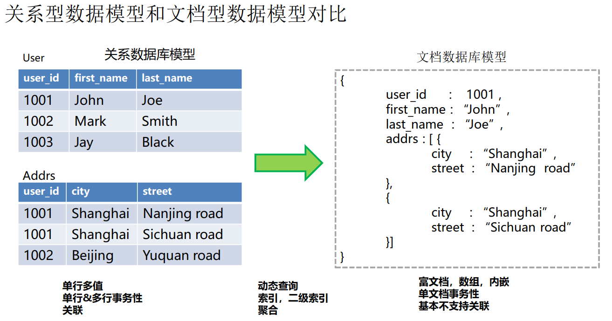

# 背景知识
MongoDB 是文档数据库。

##　分片、分区
+ 分片是一种水平切分，将一个表的行切分成多个不同的表。
+ 切分

## 典型应用
### 游戏
在游戏应用中，可以将一些用户信息，如用户装备、用户积分等存储在文档数据库中。游戏玩家活跃高峰期，对并发能力要求较高，可以使用文档数据库的集群类型，应对高并发场景。文档数据库副本集和集群架构的高可用特性，能够满足游戏在高并发场景下持续稳定运行。具有No-Schema的方式，免去游戏玩法变化中需要变更表结构的痛苦，非常适用于灵活多变的游戏业务需求。

可以将模式固定的结构化数据存储在 RDS 中，模式灵活的业务存储在 DDS 中，高热数据存储在分布式缓存服务的Redis中。

即：适用于灵活多样化的数据存储(半结构化、无结构化)

# 架构
## 集群
每个集群是一个独立运行的文档数据库。由三种组件构成：mongoos（路由）、config（配置）、shard（分片）。每个shard是一个副本集，负责存储业务数据。

数据读写请求经 mongos 分发，通过查询 config 信息，并行分配到相应的 shard。

+ mongos 是单节点配置，可以通过多个 mongos 实现负载均衡及故障转移。mongos 负责查询与写入。
+ shard 节点是分片服务器，负责存储用户数据。
+ config 负责存储实例的配置信息，由一个副本集组成。

## 副本集
副本集是为了高可用。主节点故障时，自动选出新的主节点。备用节点不可用时，隐藏节点接管。主节点用于读写请求，备用节点用于读请求，隐藏节点用于备份数据。

由一组 mongod 进程组成

# MongoDB中的一些基本概念
## 简要说明
文档数据库逻辑上按照 DB / Collection / Doc 组织  
DB：表示一个数据库， Collection: 类似关系型数据库中的表， Doc:表中存储的每一行数据  
|  SQL   | MongoDB  | 说明 |
|  ----  | ----  | ----  |
| database  | database | 数据库 |
| table  | collection | 数据库表/集合 |
| row  | doc | 行/文档 |
| column  | field | 字段/域 |
| index  | index | 索引 |
| table join  | - | MongoDB 不支持表连接 |
| primary key  | primary key | MongoDB 自动将 _id 字段设置为主键 |

## 数据类型

| 数据类型 | 描述 | 
|  ----  | ----  |
 | String	 | 字符串。存储数据常用的数据类型。在 MongoDB 中，UTF-8 编码的字符串才是合法的。 | 
 | Integer | 	整型数值。用于存储数值。根据你所采用的服务器，可分为 32 位或 64 位。 | 
 | Boolean | 	布尔值。用于存储布尔值（真/假）。 | 
 | Double | 	双精度浮点值。用于存储浮点值。 | 
 | Min/Max keys | 	将一个值与 BSON（二进制的 JSON）元素的最低值和最高值相对比。 | 
 | Array | 	用于将数组或列表或多个值存储为一个键。 | 
 | Timestamp | 	时间戳。记录文档修改或添加的具体时间。 | 
 | Object | 	用于内嵌文档。 | 
 | Null | 	用于创建空值。 | 
 | Symbol | 	符号。该数据类型基本上等同于字符串类型，但不同的是，它一般用于采用特殊符号类型的语言。 | 
 | Date | 	日期时间。用 UNIX 时间格式来存储当前日期或时间。你可以指定自己的日期时间：创建 Date 对象，传入年月日信息。 | 
 | Object ID | 	对象 ID。用于创建文档的 ID。 | 
 | Binary Data | 	二进制数据。用于存储二进制数据。 | 
 | Code	代码类型。 | 用于在文档中存储 JavaScript 代码。 | 
 | Regular expression | 	正则表达式类型。用于存储正则表达式。 | 

其中比较重要的数据类型： Object ID  
ObjectId 类似唯一主键，可以很快的去生成和排序，包含 12 bytes
  
MongoDB 中存储的文档必须有一个 _id 键。这个键的值可以是任何类型的，默认是个 ObjectId 对象。由于 ObjectId 中保存了创建的时间戳，所以你不需要为你的文档保存时间戳字段，你可以通过 getTimestamp 函数来获取文档的创建时间。

## 基本操作
```m
show dbs
use hi_test // 创建或切换到某个 database
db.createCollection("t_student") // 在当前 collection 中创建一个 collection
show collections
db.t_student.insert({"name":  "wuzhiyong","age":  18})
db.t_student.find({"name" : "wuzhiyong", "age" : 18})

db.book.remove({"_id": ObjectId("5c612b2f15338f68639e67d5")})
db.book.update({"_id" : ObjectId("5c61301c15338f68639e6802")},{"$set": {"viewCount": 3} })WriteResult({ "nMatched" : 1, "nUpserted" : 0, "nModified" : 1 })
```

> 注意: 在 MongoDB 中，集合只有在内容插入后才会创建! 就是说，创建集合(数据表)后要再插入一个文档(记录)，集合才会真正创建。

# 索引
key 到 postion 的映射  
索引支持了 DDS 的高效查询，如果没有索引，DDS 查询时就需要进行全表扫描。如果存在可以匹配查询的索引，DDS 就能使用索引优化查询的集合文档数。
### 单字段索引
单个字段上创建的索引。能加速对该字段的各种查询请求，是最常见的索引形式，DDS默认创建的_id索引就是这种类型。
例如，`db.person.createIndex( {age: 1} )` 创建了一个在 age 字段上的升序索引，`{age: -1}` 则对应着降序索引。
`db.person.createIndex( {"age": 1, "name": -1} ) `
### 多键索引
当索引的字段为数组时，创建出的索引称为多键索引。  
多键索引会为数组的每个元素建立一条索引。DDS检查到需要创建索引的字段为数组，会自动创建多键索引，不需要显式指定。
### 复合索引
复合索引是单字段索引的升级版本，它是针对多个字段联合创建索引。
复合索引的顺序很重要，索引会先按第一个字段排序，第一个字段相同的文档按第二个字段排序，依次类推。  
### 文本索引
DDS支持在字符串内容上执行文本检索的查询操作。为了执行文本检索，DDS使用 text index 和 $text 操作符。
```m
{ _id: 1, name: "Java Hut", description: "Coffee and cakes" }
{ _id: 2, name: "Burger Buns", description: "Gourmet hamburgers" }
{ _id: 3, name: "Coffee Shop", description: "Just coffee" }

db.stores.createIndex( { name: "text"} )
db.stores.find( { $text: { $search: "java coffee" } } )
```
## 索引属性
DDS除了支持多种不同类型的索引，还能对索引定制一些特殊的属性。
+ 唯一索引：保证索引对应的字段不会出现相同的值
+ TTL索引：可以针对某个时间字段，指定 collection 的过期时间
+ 部分索引 (partial index): 只针对符合某个特定条件的文档建立索引,例： 	`db.persons.createIndex({name:1},{partialFilterExpression:{age: {$gt:25}}})`
+ 稀疏索引(sparse index): 就是只包含有索引字段的文档的条目，跳过索引键不存在的文档（某条记录（文档）确实某个字段是很合理的）

## Tip
> 不能创建具有哈希索引字段的复合索引，也不能在哈希索引上指定唯一约束；但是，可以在同一字段上创建哈希索引和升序/降序（即非哈希）索引：MongoDB将标量索引用于范围查询。

# 认证和权限管理
## 用户和角色管理
```m
// 创建一个用户，并给用户读数据库reporting的权限
db.createUser(
    {user: "reportsUser",
    pwd: "12345678",
    roles: [{ role: "read", db: "reporting" },]}) 

// 创建一个角色，赋予该角色执行killop和killcursors的权限。
db.createRole(
    {role: "manageOpRole",
    privileges: [
        { resource: { cluster: true }, actions: [ "killop", "inprog" ] },
        { resource: { db: "", collection: "" }, actions: [ "killCursors" ] }],
    roles: []})
```

## 常用角色
### 数据库访问
+ read
+ readWrite
### 数据库管理
+ dbAdmin  能对数据库进行**一切操作**的管理员
+ userAdmin　　能对**数据库用户**进行管理的管理员（只能管理用户权限）
+ dbOwner
### 通用角色
+ readAnyDatabase
+ readWriteAnyDatabase
+ userAdminAnyDatabase
+ dbAdminAnyDatabase
### 具体操作
`db.createUser(user, writeConcern)`  
user:用户的身份认证和访问信息, writeConcern: 保证MongoDB提供写操作的成功报告。  
```m
{ user: "<name>",
  pwd: "<cleartext password>",
  customData: { <any information> },
  roles: [
    { role: "<role>", db: "<database>" } | "<role>",
    ...
  ]
}
// user字段，为新用户的名字；
// pwd字段，用户的密码；
// cusomData字段，为任意内容，例如可以为用户全名介绍；
// roles字段，指定用户的角色，可以用一个空数组给新用户设定空角色；
// 在roles字段,可以指定内置角色和用户定义的角色。
```

