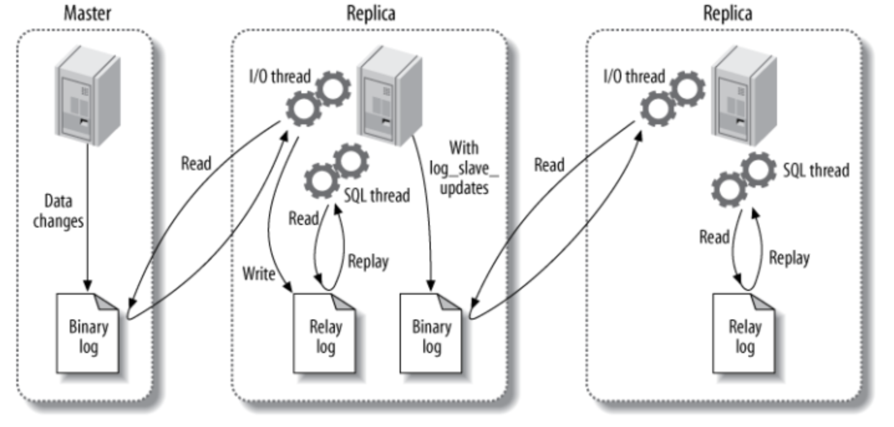

MySQL

## MySQL 的存储引擎

存储引擎是对**底层物理数据**执行实际操作的组件，为 Server 服务层提供各种操作数据的 API。常用的存储引擎有 InnoDB、MyISAM、Memory。

### InnoDB 

> in-no-DB

+ InnoDB 是 MySQL 的默认事务型引擎，支持事务
+ 表是基于聚簇索引建立的。支持表级锁和行级锁，支持外键，适合数据增删改查都频繁的情况。
+ InnoDB 采用 MVCC 来支持高并发，并且实现了四个标准的隔离级别。其默认级别是 **可重复读** REPEATABLE READ，并通过 MVCC + Next-Key Locking 防止幻读，间隙锁使 InnoDB 不仅仅锁定查询涉及的行，还会对索引中的间隙进行锁定防止幻行的插入。

> + InnoDB 是 MySQL 默认的事务型存储引擎，只有在需要 InnoDB 不支持的特性时，才考虑使用其它存储引擎。
> + 主索引是**聚簇索引**，在索引中保存了数据，从而避免直接读取磁盘，因此对查询性能有很大的提升。
> + 内部做了很多优化，包括从磁盘读取数据时采用的**可预测性读**、能够自动在内存中创建哈希索引以加速读操作的**自适应哈希索引**、能够加速插入操作的插入**缓冲区**等。
> + 通过一些机制和工具支持真正的热备份。

### MyISAM

> my-I-sam

+ MyISAM 不支持事务，
+ **崩溃后无法安全恢复**。
+ MyISAM 支持表级锁，不支持行级锁，表不支持外键
+ 该存储引擎存有表的行数，count 运算会更快。适合查询频繁，不适合对于增删改要求高的情况

> + 不支持行级锁，**只能对整张表加锁**，读取时会对需要读到的所有表加共享锁，写入时则对表加排它锁。但在表有读取操作的同时，也可以往表中插入新的记录，这被称为**并发插入**（CONCURRENT INSERT）。
> + 如果指定了 DELAY_KEY_WRITE 选项，在每次修改执行完成时，不会立即将修改的索引数据写入磁盘，而是会写到内存中的**键缓冲区**，只有在清理键缓冲区或者关闭表的时候才会将对应的索引块写入磁盘。这种方式可以极大的提升写入性能，但是在数据库或者主机崩溃时会造成索引损坏，需要执行修复操作。
> + MyISAM 提供了大量的特性，包括全文索引、压缩、空间函数（GIS）等。
> + MyISAM 设计简单，**数据以紧密格式存储**，所以在某些场景下性能很好。

## 索引

### 优缺点

优点：

+ 大大加快数据的检索速度，这也是创建索引的最主要的原因
+ 加速表和表之间的连接
+ 在使用分组和排序子句进行数据检索时，同样可以显著减少查询中分组和排序的时间
+ 通过创建唯一性索引，可以保证数据库表中每一行数据的唯一性

缺点：

+ 时间方面：当对表中的数据进行增加、删除和修改的时候，索引也要动态的维护，这样就降低了数据的维护速度
+ 空间方面：索引需要占物理空间

### 一些索引

#### B Tree & B+ Tree

##### 数据结构

B Tree 指的是 Balance Tree，也就是平衡查找树。B 树是一种**多路**搜索树。**所有叶子节点位于同一层**（实际上这些结点不存在，指向这些结点的指针为空）。（非叶节点会有数据指针）

B+ Tree 是基于 B Tree 的改进，首先其内节点只有索引，没有数据指针，其次其所有的叶子节点都用链表相连。数据指针全在叶子节点上。（inndoDB的具体实现细节可能有所不同，看聚簇索引章节）

>  在 B+ Tree 中，一个节点中的 key 从左到右非递减排列，如果某个指针的左右相邻 key 分别是 key<sub>i</sub> 和 key<sub>i+1</sub>，且不为 null，则该指针指向节点的所有 key 大于等于 key<sub>i</sub> 且小于等于 key<sub>i+1</sub>。


##### 操作

进行查找操作时，首先在根节点进行二分查找，找到一个 key 所在的指针，然后递归地在指针所指向的节点进行查找。直到查找到叶子节点，然后在叶子节点上进行二分查找，找出 key 所对应的 data。

插入删除操作会破坏平衡树的平衡性，因此在进行插入删除操作之后，需要对树进行分裂、合并、旋转等操作来维护平衡性。

##### 磁盘原理和比较

一般来说索引非常大，为了减少内存的占用，索引也会被存储在磁盘上。由于磁盘 IO 的耗时远高于内存内的二分查找，评价一个数据结构作为**索引的优劣最重要的指标就是在查找过程中磁盘I/O操作次数的渐进复杂度**。

InnoDB 将其一个节点的大小称为一个页（通常是16KB），注意这和操作系统和的页不是一回事。不过，InnoDB 可以主动调整或者被动期待，自己的这一个页会被映射到 OS 的一页（或多个页）（通常是磁盘块大小的倍数，磁盘块大小通常是4KB，专用于服务器的硬盘可能是16KB）。

InnoDB 将一个**索引的节点的大小设置为一页的大小**，这样从硬盘读入的时候，可以期待内存只需要换一个页（或页的整数倍）就可以，一次就可以完全载入一个节点。

> 一次磁盘 IO 读一页而不是一个字节是因为 磁盘的预读特性。为了提高效率，要尽量减少磁盘I/O。为了达到这个目的，磁盘往往不是严格按需读取，而是每次都会预读，即使只需要一个字节，磁盘也会从这个位置开始，顺序向后读取一定长度的数据放入主存，这个长度就是一个磁盘块。

> https://dba.stackexchange.com/questions/224969/what-is-the-relation-between-mysql-pages-and-operating-system-pages
>
> https://dev.mysql.com/doc/refman/5.7/en/optimizing-innodb-diskio.html
>
> https://dev.mysql.com/doc/refman/5.7/en/innodb-parameters.html#sysvar_innodb_page_size

###### B & B+

+ B+ 树改进了 B 树, 让内节点只作索引使用，去掉了其中指向 data record 的指针，**使得每个结点中能够存放更多的 key**，因此能有更大的出度。这样就意味着树的**层高能进一步被压缩**, 使得检索的时间更短，而且减少了读索引的磁盘操作。
+ 由于底部的叶子结点是链表形式, 因此也可以实现更方便的**顺序遍历**（**范围查询**的时候很有用吧，找到头尾，中间直接一个串一个找过去）
+ B+ 树一定要查到叶子节点，所以查询效率稳定

> 什么MongoDB用B树而不是B+树？
>
> MongoDB 作为面向文档的数据库，与数据之间的关系相比，它更看重以文档为中心的组织方式，所以选择了查询**单个文档性能较好的** **B** **树**（因为不用查到叶子节点了吧，可能中间就返回了吧），这个选择对遍历数据的查询也可以保证可以接受的时延；

###### 与红黑树的比较

红黑树等平衡树也可以用来实现索引，但是文件系统及数据库系统普遍采用 B+ Tree 作为索引结构，这是因为使用 B+ 树访问磁盘数据有更高的性能。

平衡树的树高 O(h)=O(log<sub>d</sub>N)，其中 d 为每个节点的出度。红黑树的出度为 2，而 B+ Tree 的出度一般都非常大，所以红黑树的树高 h 很明显比 B+ Tree 大非常多。如果每个节点存储一个关键词，数据量大时，红黑树的深度很深，每次读取时消耗大量 IO。B+ 树相对于红黑树有更低的树高，磁盘 IO 读取索引中间节点的次数更少，所以 B+ 树更适合磁盘数据的读取。**值得注意的是，你不能指望红黑树父子索引节点在一个 OS 页上或在连续磁盘块上。**

###### 与 hash 的比较

> https://www.cnblogs.com/igoodful/p/9361500.html

哈希索引能以 O(1) 时间进行查找，但是：

- 只支持精确查找，**无法用于范围查找，也不能高性能的排序和分组。**

  例如WHERE price > 100。由于 Hash 索引比较的是进行 Hash 运算之后的 Hash 值，所以它只能用于等值的过滤，不能用于基于范围的过滤，**因为经过相应的 Hash 算法处理之后的 Hash 值的大小关系，并不能保证和 Hash 运算前完全一样。（那么这些 Hash 记录可能在不同的盘块上，要一个一个读进来）**

  （甚至后面加间隙锁等等都不好操作）

- 数据量大了之后，那么将会存在大量记录指针信息存于同一个 Hash 值相关联。**查询性能受 hash 冲突率影响，性能不稳定**。【碰撞之后要遍历了啊！遍历！】

- 没法应对联合索引，因为 hash 拆开来算没意义

InnoDB 存储引擎有一个特殊的功能叫“自适应哈希索引”，当某个索引值被使用的非常频繁时，会在 B+Tree 索引之上再创建一个哈希索引，这样就让 B+Tree 索引具有哈希索引的一些优点，比如快速的哈希查找。

#### 全文索引

全文索引**使用倒排索引实现**，它记录着**关键词到其所在文档的映射**。

MyISAM 存储引擎支持全文索引，用于查找文本中的关键词，而不是直接比较是否相等。查找条件使用 MATCH AGAINST，而不是普通的 WHERE。

**InnoDB 存储引擎在 MySQL 5.6.4 版本中也开始支持全文索引。**

#### 空间数据索引

MyISAM 存储引擎支持空间数据索引（R-Tree），可以用于地理数据存储。空间数据索引会从所有维度来索引数据，可以有效地使用任意维度来进行组合查询。

必须使用 GIS 相关的函数来维护数据。

#### 联合索引和最左匹配原则

使用**多个字段**同时建立一个索引（比如 B+ 树索引）叫做联合索引。在联合索引中，如果想要命中索引，**需要按照建立索引时的字段顺序挨个使用**，否则无法命中索引。

联合索引底层还是一颗 B+ 树，只不过联合索引的健值数量不是一个，而是多个。但是构建一颗 **B+ 树只能根据一个值来构建**，因此数据库依据联合索引**最左的字段来构建B+树**。但是**前一个键等值的情况下，按后一个键值的顺序关系建索引**。


###### 最左匹配原则

最左优先，以最左边的为起点任何连续的索引都能匹配上。同时遇到范围查询 (>、<、between、like) 就会停止匹配。

> 例如：如果建立 (a, b) 顺序的索引，我们的条件只有 b=xxx，是匹配不到 (a, b) 索引的
>
> 但是如果查询条件是 a = 1 and b = 2 或者 b=2 and a=1就可以，因为优化器会自动调整 a, b 的顺序，并不需要严格按照索引的顺序来
>
> 再比如查询 a = 1 and b = 2 and c > 3 and d = 4 如果建立(*a, b, c, d*)顺序的索引，d 是用不到索引的，因为 c 字段是一个范围查询，它之后的字段会停止匹配。

#### 聚簇索引

**聚簇索引：**表中数据存储的物理顺序与索引值的顺序一致

+ 一个基本表最多只能有一个聚簇索引
+ 聚簇索引对于那些**经常要搜索范围值的列、需要排序的列、需要分组的列**特别有效。当索引值唯一时，使用聚簇索引查找特定的行也很有效率。例如，使用唯一雇员 ID 列 emp_id 查找特定雇员的最快速的方法，是在 emp_id 列上创建聚簇索引或 PRIMARY KEY 约束。
+ 更新聚簇索引列上的数据时，往往导致表中记录的物理顺序的变更，代价较大，因此对于经常更新的列不宜建立聚集索引。

**非聚簇索引：**表中数据的物理顺序与索引值的顺序不一致的索引组织

+ 聚簇索引和非聚簇索引都采用了 B+ 树的结构，但**聚簇索引的叶节点就是数据节点，而非聚簇索引的叶节点仍然是索引节点，只不过其包含一个指向对应数据块的指针。**
+ 一个基本表可以有多个非聚集索引（对每个表最多可以建立 249个非聚集索）。
+ 非聚集索引需要大量的硬盘空间和内存。另外，虽然非聚集索引可以提高从表中取数据的速度，它也会**降低向表中插入和更新数据的速度**（因此频繁更改的表不适宜）。每当改变了一个建立了非聚集索引的表中的数据时，必须同时更新索引。

**innoDB 中：** 聚簇索引的叶子节点 data 域记录着完整的数据记录，非聚簇索引的叶子节点的 data 域记录着主键的值，因此在使用非聚簇索引进行查找时，需要先查找到主键值，然后再到主索引中进行查找。【而不是直接从非聚簇索引的叶子节点指针指向数据】

### 索引失效

以后再补充

## 切分

### 垂直切分

在表的层面：垂直切分是将一张表按列切分成多个表，**通常是按照列的关系密集程度进行切分**，也可以利用垂直切分将**经常被使用的列和不经常被使用的列切分到不同的表中**。

**在数据库的层面**：将数据库的不同的表部署到不同的库中，例如将原来的电商数据库垂直切分成商品数据库、用户数据库等，分布在不同的物理机上。**避免拆分紧密关联的表**。因为两个表之间关联越紧密，意味着对「join」的需求越多，分布式 join 可太难搞了。

### 水平切分

水平切分又称为 Sharding，它是将**同一个表中的记录拆分到多个结构相同的表中**。当一个表的数据不断增多时，Sharding 是必然的选择，它可以将数据**分布到集群的不同节点上**，从而缓存单个数据库的压力。

> 百亿级数据分表后怎么分页查询？ - 艾小仙的文章 - 知乎 https://zhuanlan.zhihu.com/p/347157783

### Sharding 策略

- 哈希取模：hash(key) % N；
- 范围：可以是 ID 范围也可以是时间范围等；
- 映射表：使用单独的一个数据库来存储映射关系。

### Sharding 存在的问题

#### 1. 事务问题

使用分布式事务来解决，比如 XA 接口。

#### 2. 连接

可以将原来的连接分解成多个单表查询，然后**在用户程序中进行连接**。（分布式 join 可太难搞了。）

#### 3. ID 唯一性

- uuid 生成全球唯一id，本地生成没有网络开销，效率高；缺点是长度较长，**没有递增趋势性，不易维护**。

- 为每个分片指定一个 ID 范围

- 分布式 ID 生成器 (如 Twitter 的 Snowflake 算法)

  > 
  >
  > 1. 1bit-不用，因为二进制中最高位是符号位，1 表示负数，0 表示正数。生成的 id 一般都是用整数，所以最高位固定为 0
  > 2. 41bit-时间戳，用来记录时间戳，毫秒级，可以使用 (1L << 41) / (1000L * 60 * 60 * 24 * 365) = 69年
  > 3. 10bit-工作机器id，用来记录工作机器 id，最大1024个节点
  > 4. 12bit-序列号，用来记录同毫秒内产生的不同id，最多4096个/毫秒
  >
  > 在获取时间的时候，可能会出现时间回拨的问题：服务器上的时间突然倒退到之前的时间。解决方案：
  >
  > + 回拨时间小的时候，不生成 ID，循环等待到时间点到达。
  >
  > + 69 年的时间太长了，没意义，拆几位下来用【机器数量太多的时候也可以拆几位下来】
  >
  >   

## 主从复制 & 读写分离

### 主从复制

主要涉及三个线程：binlog 线程、I/O 线程和 SQL 线程。

-   **binlog 线程**：负责将主服务器上的数据更改（insert、update、delete）写入二进制日志（Binary log）中（记录了所有 sql 语句）。
-   从服务器定期探测是否发生变化
-   **I/O 线程**：负责从主服务器上读取二进制日志，并写入从服务器的中继日志（Relay log）。
-   **SQL 线程**：负责读取中继日志，解析出主服务器已经执行的数据更改并在从服务器中重放（Replay）。



### 读写分离

主服务器处理写操作以及实时性要求比较高的读操作，而从服务器处理读操作。

读写分离能提高性能的原因在于：

- 主从服务器负责各自的读和写，极大程度缓解了锁的争用；
- 从服务器可以使用 MyISAM，提升查询性能以及节约系统开销；(索引有压缩？内存能放更多的索引？)
- 增加冗余，提高可用性。

读写分离常用代理方式来实现，代理服务器接收应用层传来的读写请求，然后决定转发到哪个服务器。


## 数据类型

#### 整型

TINYINT, SMALLINT, MEDIUMINT, INT, BIGINT 分别使用 8, 16, 24, 32, 64 位存储空间，一般情况下越小的列越好。

> INT(11) 中的数字只是规定了交互工具显示字符的个数，对于存储和计算来说是没有意义的。

#### 浮点数

FLOAT 和 DOUBLE 为浮点类型，DECIMAL 为高精度小数类型。CPU 原生支持浮点运算，但是不支持 DECIMAl 类型的计算，因此 DECIMAL 的计算比浮点类型需要更高的代价。

**float，double等非标准类型，在DB中保存的是近似值，而Decimal则以字符串的形式保存数值。**

FLOAT、DOUBLE 和 DECIMAL 都可以指定列宽，例如 DECIMAL(18, 9) 表示总共 18 位，取 9 位存储小数部分，剩下 9 位存储整数部分。

#### 字符串

主要有 CHAR 和 VARCHAR 两种类型，一种是定长的，一种是变长的。

VARCHAR 这种变长类型能够节省空间，因为只需要存储必要的内容。但是在执行 UPDATE 时可能会使行变得比原来长，当超出一个页所能容纳的大小时，就要执行额外的操作。MyISAM 会将行拆成不同的片段存储，而 InnoDB 则需要分裂页来使行放进页内。

在进行存储和检索时，会保留 VARCHAR 末尾的空格，而会删除 CHAR 末尾的空格。

#### 时间和日期

+ DATETIME：能够保存从 1000 年到 9999 年的日期和时间，精度为秒，使用 8 字节的存储空间。
+ TIMESTAMP：保存 UNIX  时间戳，使用 4 个字节，只能表示从 1970 年到 2038 年。

应该尽量使用 TIMESTAMP，因为它比 DATETIME 空间效率更高。

#### 文本【据说不建议使用】

TEXT类型一般分为 TINYTEXT(255长度)、TEXT(65535)、 MEDIUMTEXT（int最大值16M），和LONGTEXT(long最大值4G)这四种，它被用来存储非二进制字符集，二进制字符集使用blob类型的字段来存储。

## 性能优化【能看多少是多少，以后再说】

> 优化顺序
>
> + 第一优化你的sql和索引
> + 第二加缓存，memcached,redis；
> + 第三以上都做了后，还是慢，就做主从复制或主主复制，读写分离。
> + 第四如果以上都做了还是慢，不要想着去做切分，mysql自带分区表，先试试这个，对你的应用是透明的，无需更改代码,但是 sql 语句是需要针对分区表做优化的，sql 条件中要带上分区条件的列，从而使查询定位到少量的分区上，否则就会扫描全部分区
> + 第五如果以上都做了，那就先做垂直拆分，其实就是根据你模块的耦合度，将一个大的系统分为多个小的系统
> + 第六才是水平切分，针对数据量大的表，这一步最麻烦，最能考验技术水平，要选择一个合理的 sharding key，为了有好的查询效率，表结构也要改动，做一定的冗余，应用也要改，sql中尽量带 sharding key，将数据定位到限定的表上去查，而不是扫描全部的表；

### 使用 Explain 进行分析

> 面试前必须知道的MySQL命令【explain】 - Java3y的文章 - 知乎 https://zhuanlan.zhihu.com/p/51771446

Explain 用来分析 SELECT 查询语句，开发人员可以通过分析 Explain 结果来优化查询语句。

比较重要的字段有：

- select_type : 查询类型，有简单查询、联合查询、子查询等

- type：该列称为**关联类型或者访问类型**，它指明了MySQL决定如何查找表中符合条件的行，同时**是我们判断查询是否高效的重要依据**。包括但不限于：

  ALL：**[全表扫描](https://www.zhihu.com/search?q=全表扫描&search_source=Entity&hybrid_search_source=Entity&hybrid_search_extra={"sourceType"%3A"article"%2C"sourceId"%3A"51771446"})**，这个类型是性能最差的查询之一。通常来说，我们的查询不应该出现 ALL 类型，因为这样的查询，在数据量最大的情况下，对数据库的性能是巨大的灾难。

  index：**全索引扫描**，和 ALL 类型类似，只不过 ALL 类型是全表扫描，而 index 类型是**扫描全部的索引**，主要优点是**避免了排序**，但是开销仍然非常大。如果在 Extra 列看到 Using index，说明正在使用覆盖索引，只扫描索引的数据，开销要少很多。

  range：**范围扫描**，就是一个有限制的索引扫描。这个类型通常出现在 `=、<>、>、>=、<、<=、IS NULL、<=>、BETWEEN、IN()` 的操作中，key 列显示使用了哪个索引。

- key : 使用的索引

- rows : **预估的**扫描的行数

### 优化数据访问

#### 1. 减少请求的数据量（真的有用吗，还是只是减少了数据传输量呢，我不确定）

- 只返回必要的列：最好不要使用 SELECT * 语句。
- 只返回必要的行：使用 LIMIT 语句来限制返回的数据。
- 缓存重复查询的数据：使用缓存可以避免在数据库中进行查询，特别在要查询的数据经常被重复查询时，缓存带来的查询性能提升将会是非常明显的。

#### 2. 减少服务器端扫描的行数

最有效的方式是使用索引来覆盖查询。

### 重构查询方式【查询优化是重点，后面重新整理】

#### 1. 切分大查询（这真的有用吗？）

一个大查询如果一次性执行的话，可能一次锁住很多数据、占满整个事务日志、耗尽系统资源、阻塞很多小的但重要的查询。

```sql
DELETE FROM messages WHERE create < DATE_SUB(NOW(), INTERVAL 3 MONTH);
```

```sql
rows_affected = 0
do {
    rows_affected = do_query(
    "DELETE FROM messages WHERE create  < DATE_SUB(NOW(), INTERVAL 3 MONTH) LIMIT 10000")
} while rows_affected > 0
```

#### 2. 分解大连接查询

将一个大连接查询分解成对每一个表进行一次单表查询，然后**在应用程序中进行关联**，这样做的好处有：

- 查询本身效率也可能会有所提升。例如下面的例子中，使用 IN() 代替连接查询，可以让 MySQL 按照 ID 顺序进行查询，这可能比随机的连接要更高效。
- **让缓存更高效**。对于连接查询，如果其中一个表发生变化，那么整个查询缓存就无法使用。而分解后的多个查询，**即使其中一个表发生变化，对其它表的查询缓存依然可以使用**。
- 减少锁竞争；

> + 在应用层进行连接，可以更容易对数据库进行拆分，从而更容易做到高性能和可伸缩。？？？
> + 查询本身效率也可能会有所提升。拆分之后可能会更容易使用索引或是有顺序查询？？？

```sql
SELECT * FROM tag
JOIN tag_post ON tag_post.tag_id=tag.id
JOIN post ON tag_post.post_id=post.id
WHERE tag.tag='mysql';
```

```sql
SELECT * FROM tag WHERE tag='mysql';
SELECT * FROM tag_post WHERE tag_id=1234;
SELECT * FROM post WHERE post.id IN (123,456,567,9098,8904);
```


### 索引优化

#### 1. 独立的列

在进行查询时，索引列不能是表达式的一部分，也不能是函数的参数，否则无法使用索引。

例如下面的查询不能使用 actor_id 列的索引：

```sql
SELECT actor_id FROM sakila.actor WHERE actor_id + 1 = 5;
```

#### 2. 多列索引

在需要使用多个列作为条件进行查询时，使用多列索引比使用多个单列索引性能更好。例如下面的语句中，最好把 actor_id 和 film_id 设置为多列索引。

```sql
SELECT film_id, actor_ id FROM sakila.film_actor
WHERE actor_id = 1 AND film_id = 1;
```

#### 3. 索引列的顺序

让选择性最强的索引列放在前面。

索引的选择性是指：不重复的索引值和记录总数的比值。最大值为 1，此时每个记录都有唯一的索引与其对应。**选择性越高，每个记录的区分度越高，查询效率也越高。**

例如下面显示的结果中 customer_id 的选择性比 staff_id 更高，因此最好把 customer_id 列放在多列索引的前面。

```sql
SELECT COUNT(DISTINCT staff_id)/COUNT(*) AS staff_id_selectivity,
COUNT(DISTINCT customer_id)/COUNT(*) AS customer_id_selectivity,
COUNT(*)
FROM payment;
```

```html
   staff_id_selectivity: 0.0001
customer_id_selectivity: 0.0373
               COUNT(*): 16049
```

#### 4. 前缀索引

对于 BLOB、TEXT 和 VARCHAR 类型的列，必须使用前缀索引，只索引开始的部分字符。

前缀长度的选取需要根据索引选择性来确定。

#### 5. 覆盖索引

**索引包含所有需要查询的字段的值**。例如我查询：主键范围在 100-150 之间的那些记录的主键是什么。

具有以下优点：

- 索引通常远小于数据行的大小，只读取索引能大大减少数据访问量。
- 一些存储引擎（例如 MyISAM）在内存中只缓存索引，而数据依赖于操作系统来缓存。因此，只访问索引可以不使用系统调用（通常比较费时）。
- **对于 InnoDB 引擎，若辅助索引能够覆盖查询，则无需访问主索引**。