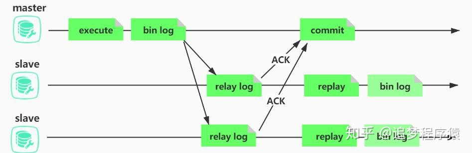

MySQL

## MySQL 的存储引擎

存储引擎是对**底层物理数据**执行实际操作的组件，为 Server 服务层提供各种操作数据的 API。常用的存储引擎有 InnoDB、MyISAM、Memory。

### InnoDB

> in-no-DB

+ InnoDB 是 MySQL 的默认事务型引擎，支持事务
+ 表是基于聚簇索引建立的。支持表级锁和行级锁，支持外键，适合数据增删改查都频繁的情况。
+ InnoDB 采用 MVCC 来支持高并发，并且实现了四个标准的隔离级别。其默认级别是 **可重复读** REPEATABLE READ，并通过 MVCC + Next-Key Locking 防止幻读，间隙锁使 InnoDB 不仅仅锁定查询涉及的行，还会对索引中的间隙进行锁定防止幻行的插入。

> + InnoDB 是 MySQL 默认的事务型存储引擎，只有在需要 InnoDB 不支持的特性时，才考虑使用其它存储引擎。
> + 主索引是**聚簇索引**，在索引中保存了数据，从而避免直接读取磁盘，因此对查询性能有很大的提升。
> + 内部做了很多优化，包括从磁盘读取数据时采用的**可预测性读**、能够自动在内存中创建哈希索引以加速读操作的**自适应哈希索引**、能够加速插入操作的插入**缓冲区**等。
> + 通过一些机制和工具支持真正的热备份。

### MyISAM

> my-I-sam

+ MyISAM 不支持事务，
+ **崩溃后无法安全恢复**。
+ MyISAM 支持表级锁，不支持行级锁，表不支持外键
+ 该存储引擎存有表的行数，count 运算会更快。适合查询频繁，不适合对于增删改要求高的情况

> + 不支持行级锁，**只能对整张表加锁**，读取时会对需要读到的所有表加共享锁，写入时则对表加排它锁。但在表有读取操作的同时，也可以往表中插入新的记录，这被称为**并发插入**（CONCURRENT INSERT）。
> + 如果指定了 DELAY_KEY_WRITE 选项，在每次修改执行完成时，不会立即将修改的索引数据写入磁盘，而是会写到内存中的**键缓冲区**，只有在清理键缓冲区或者关闭表的时候才会将对应的索引块写入磁盘。这种方式可以极大的提升写入性能，但是在数据库或者主机崩溃时会造成索引损坏，需要执行修复操作。
> + MyISAM 提供了大量的特性，包括全文索引、压缩、空间函数（GIS）等。
> + MyISAM 设计简单，**数据以紧密格式存储**，所以在某些场景下性能很好。

## 索引

### 优缺点

优点：

+ 大大加快数据的检索速度，这也是创建索引的最主要的原因
+ 加速表和表之间的连接
+ 在使用分组和排序子句进行数据检索时，同样可以显著减少查询中分组和排序的时间
+ 通过创建唯一性索引，可以保证数据库表中每一行数据的唯一性

缺点：

+ 时间方面：当对表中的数据进行增加、删除和修改的时候，索引也要动态的维护，这样就降低了数据的维护速度
+ 空间方面：索引需要占物理空间

### 一些索引

#### B Tree & B+ Tree

##### 数据结构

B Tree 指的是 Balance Tree，也就是平衡查找树。B 树是一种**多路**搜索树。**所有叶子节点位于同一层**（实际上这些结点不存在，指向这些结点的指针为空）。（非叶节点会有数据指针）

B+ Tree 是基于 B Tree 的改进，首先其内节点只有索引，没有数据指针，其次其所有的叶子节点都用链表相连。数据指针全在叶子节点上。（inndoDB的具体实现细节可能有所不同，看聚簇索引章节）

>  在 B+ Tree 中，一个节点中的 key 从左到右非递减排列，如果某个指针的左右相邻 key 分别是 key<sub>i</sub> 和 key<sub>i+1</sub>，且不为 null，则该指针指向节点的所有 key 大于等于 key<sub>i</sub> 且小于等于 key<sub>i+1</sub>。


##### 操作

进行查找操作时，首先在根节点进行二分查找，找到一个 key 所在的指针，然后递归地在指针所指向的节点进行查找。直到查找到叶子节点，然后在叶子节点上进行二分查找，找出 key 所对应的 data。

插入删除操作会破坏平衡树的平衡性，因此在进行插入删除操作之后，需要对树进行分裂、合并、旋转等操作来维护平衡性。

##### 磁盘原理和比较

一般来说索引非常大，为了减少内存的占用，索引也会被存储在磁盘上。由于磁盘 IO 的耗时远高于内存内的二分查找，评价一个数据结构作为**索引的优劣最重要的指标就是在查找过程中磁盘I/O操作次数的渐进复杂度**。

InnoDB 将其一个节点的大小称为一个页（通常是16KB），注意这和操作系统和的页不是一回事。不过，InnoDB 可以主动调整或者被动期待，自己的这一个页会被映射到 OS 的一页（或多个页）（通常是磁盘块大小的倍数，磁盘块大小通常是4KB，专用于服务器的硬盘可能是16KB）。

InnoDB 将一个**索引的节点的大小设置为一页的大小**，这样从硬盘读入的时候，可以期待内存只需要换一个页（或页的整数倍）就可以，一次就可以完全载入一个节点。

> 一次磁盘 IO 读一页而不是一个字节是因为 磁盘的预读特性。为了提高效率，要尽量减少磁盘I/O。为了达到这个目的，磁盘往往不是严格按需读取，而是每次都会预读，即使只需要一个字节，磁盘也会从这个位置开始，顺序向后读取一定长度的数据放入主存，这个长度就是一个磁盘块。

> https://dba.stackexchange.com/questions/224969/what-is-the-relation-between-mysql-pages-and-operating-system-pages
> 
> https://dev.mysql.com/doc/refman/5.7/en/optimizing-innodb-diskio.html
> 
> https://dev.mysql.com/doc/refman/5.7/en/innodb-parameters.html#sysvar_innodb_page_size

###### B & B+

+ B+ 树改进了 B 树, 让内节点只作索引使用，去掉了其中指向 data record 的指针，**使得每个结点中能够存放更多的 key**，因此能有更大的出度。这样就意味着树的**层高能进一步被压缩**, 使得检索的时间更短，而且减少了读索引的磁盘操作。
+ 由于底部的叶子结点是链表形式, 因此也可以实现更方便的**顺序遍历**（**范围查询**的时候很有用吧，找到头尾，中间直接一个串一个找过去）
+ B+ 树一定要查到叶子节点，所以查询效率稳定

> 什么MongoDB用B树而不是B+树？
> 
> MongoDB 作为面向文档的数据库，与数据之间的关系相比，它更看重以文档为中心的组织方式，所以选择了查询**单个文档性能较好的** **B** **树**（因为不用查到叶子节点了吧，可能中间就返回了吧），这个选择对遍历数据的查询也可以保证可以接受的时延；

###### 与红黑树的比较

红黑树等平衡树也可以用来实现索引，但是文件系统及数据库系统普遍采用 B+ Tree 作为索引结构，这是因为使用 B+ 树访问磁盘数据有更高的性能。

平衡树的树高 O(h)=O(log<sub>d</sub>N)，其中 d 为每个节点的出度。红黑树的出度为 2，而 B+ Tree 的出度一般都非常大，所以红黑树的树高 h 很明显比 B+ Tree 大非常多。如果每个节点存储一个关键词，数据量大时，红黑树的深度很深，每次读取时消耗大量 IO。B+ 树相对于红黑树有更低的树高，磁盘 IO 读取索引中间节点的次数更少，所以 B+ 树更适合磁盘数据的读取。**值得注意的是，你不能指望红黑树父子索引节点在一个 OS 页上或在连续磁盘块上。**

###### 与 hash 的比较

> https://www.cnblogs.com/igoodful/p/9361500.html

哈希索引能以 O(1) 时间进行查找，但是：

- 只支持精确查找，**无法用于范围查找，也不能高性能的排序和分组。**
  
  例如WHERE price > 100。由于 Hash 索引比较的是进行 Hash 运算之后的 Hash 值，所以它只能用于等值的过滤，不能用于基于范围的过滤，**因为经过相应的 Hash 算法处理之后的 Hash 值的大小关系，并不能保证和 Hash 运算前完全一样。（那么这些 Hash 记录可能在不同的盘块上，要一个一个读进来）**
  
  （甚至后面加间隙锁等等都不好操作）

- 数据量大了之后，那么将会存在大量记录指针信息存于同一个 Hash 值相关联。**查询性能受 hash 冲突率影响，性能不稳定**。【碰撞之后要遍历了啊！遍历！】

- 没法应对联合索引，因为 hash 拆开来算没意义

InnoDB 存储引擎有一个特殊的功能叫“自适应哈希索引”，当某个索引值被使用的非常频繁时，会在 B+Tree 索引之上再创建一个哈希索引，这样就让 B+Tree 索引具有哈希索引的一些优点，比如快速的哈希查找。

#### 全文索引

全文索引**使用倒排索引实现**，它记录着**关键词到其所在文档的映射**。

MyISAM 存储引擎支持全文索引，用于查找文本中的关键词，而不是直接比较是否相等。查找条件使用 MATCH AGAINST，而不是普通的 WHERE。

**InnoDB 存储引擎在 MySQL 5.6.4 版本中也开始支持全文索引。**

#### 空间数据索引

MyISAM 存储引擎支持空间数据索引（R-Tree），可以用于地理数据存储。空间数据索引会从所有维度来索引数据，可以有效地使用任意维度来进行组合查询。

必须使用 GIS 相关的函数来维护数据。

#### 联合索引和最左匹配原则

使用**多个字段**同时建立一个索引（比如 B+ 树索引）叫做联合索引。在联合索引中，如果想要命中索引，**需要按照建立索引时的字段顺序挨个使用**，否则无法命中索引。

联合索引底层还是一颗 B+ 树，只不过联合索引的健值数量不是一个，而是多个。但是构建一颗 **B+ 树只能根据一个值来构建**，因此数据库依据联合索引**最左的字段来构建B+树**。但是**前一个键等值的情况下，按后一个键值的顺序关系建索引**。


###### 最左匹配原则

最左优先，以最左边的为起点任何连续的索引都能匹配上。同时遇到范围查询 (>、<、between、like) 就会停止匹配。

> 例如：如果建立 (a, b) 顺序的索引，我们的条件只有 b=xxx，是匹配不到 (a, b) 索引的
> 
> 但是如果查询条件是 a = 1 and b = 2 或者 b=2 and a=1就可以，因为优化器会自动调整 a, b 的顺序，并不需要严格按照索引的顺序来
> 
> 再比如查询 a = 1 and b = 2 and c > 3 and d = 4 如果建立(*a, b, c, d*)顺序的索引，d 是用不到索引的，因为 c 字段是一个范围查询，它之后的字段会停止匹配。

#### 聚簇索引

**聚簇索引：**表中数据存储的物理顺序与索引值的顺序一致

+ 一个基本表最多只能有一个聚簇索引
+ 聚簇索引对于那些**经常要搜索范围值的列、需要排序的列、需要分组的列**特别有效。当索引值唯一时，使用聚簇索引查找特定的行也很有效率。例如，使用唯一雇员 ID 列 emp_id 查找特定雇员的最快速的方法，是在 emp_id 列上创建聚簇索引或 PRIMARY KEY 约束。
+ 更新聚簇索引列上的数据时，往往导致表中记录的物理顺序的变更，代价较大，因此对于经常更新的列不宜建立聚集索引。

**非聚簇索引：**表中数据的物理顺序与索引值的顺序不一致的索引组织

+ 聚簇索引和非聚簇索引都采用了 B+ 树的结构，但**聚簇索引的叶节点就是数据节点，而非聚簇索引的叶节点仍然是索引节点，只不过其包含一个指向对应数据块的指针。**
+ 一个基本表可以有多个非聚集索引（对每个表最多可以建立 249个非聚集索）。
+ 非聚集索引需要大量的硬盘空间和内存。另外，虽然非聚集索引可以提高从表中取数据的速度，它也会**降低向表中插入和更新数据的速度**（因此频繁更改的表不适宜）。每当改变了一个建立了非聚集索引的表中的数据时，必须同时更新索引。

**innoDB 中：** 聚簇索引的叶子节点 data 域记录着完整的数据记录，非聚簇索引的叶子节点的 data 域记录着主键的值，因此在使用非聚簇索引进行查找时，需要先查找到主键值，然后再到主索引中进行查找。【而不是直接从非聚簇索引的叶子节点指针指向数据】

### 索引失效（可以反过来讲，如何优化查询）

> 聊聊索引失效的10种场景，太坑了 - 苏三说技术的文章 - 知乎 https://zhuanlan.zhihu.com/p/455188214

**模 型 数 空 运 最 快 or** 

+ 模糊查询 like 以 % 开头
+ 需要类型转换（比如 name 是 varchar，上面有索引，where name = '123' 可以走索引，where id = 123 就不行）
+ where 中索引列使用了函数 `WHERE DATE(create_time) = '2020-09-03'`
+ （有人指出是错的，不要提）据说 null 可能不行
+ where 中索引列有运算 （where id - 1 = 20）
+ **复合索引未用左列字段**（没有走最左匹配）。也尽量不要用。碰到范围查询之类的也会停止
+ 如果 mysql 觉得全表扫描更快时（数据少）
+ 如果**条件中有 or 且部分条件上没有索引**，那就用不上索引了。或者使用了 `!= `

## 切分

### 垂直切分

+ 在表的层面
  
  + 垂直切分是将一张表按列切分成多个表，**通常是按照列的关系密集程度进行切分**，也可以利用垂直切分将**经常被使用的列和不经常被使用的列切分到不同的表中**。
  
  + 场景：系统绝对并发量并没有上来，表的记录并不多，但是字段多，并且**热点数据和非热点数据在一起，单行数据所需的存储空间较大**。以至于数据库**缓存的数据行减少**，查询时会去读磁盘数据产生大量的随机读IO，**产生IO瓶颈**。
  
  + 拆了之后，要想获得全部数据就需要关联两个表来取数据。但记住，千万别用 join，因为 join 不仅会增加 CPU 负担并且会将两个表耦合在一起（必须在一个数据库实例上）。关联数据，应该在业务Service层做文章。

+ **在数据库的层面**
  
  + 将数据库的不同的表部署到不同的库中，例如将原来的电商数据库垂直切分成商品数据库、用户数据库等，分布在不同的物理机上。**避免拆分紧密关联的表**。因为两个表之间关联越紧密，意味着对「join」的需求越多，分布式 join 可太难搞了。
  
  + 场景：系统绝对并发量上来了，并且可以抽象出单独的业务模块。

### 水平切分

+ 在表的层面
  
  + 水平切分又称为 Sharding，它是将**同一个表中的记录拆分到多个结构相同的表中**。当一个表的数据不断增多时，Sharding 是必然的选择，它可以将数据**分布到集群的不同节点上**，从而缓存单个数据库的压力。
  
  + 系统绝对并发量并没有上来，只是**单表的数据量太多，影响了SQL效率，加重了CPU负担**，以至于成为瓶颈。

> 百亿级数据分表后怎么分页查询？ - 艾小仙的文章 - 知乎 https://zhuanlan.zhihu.com/p/347157783

+ 在数据库的层面
  
  
  
  + 以**字段**为依据，按照一定策略（hash、range等），将一个**库**中的数据拆分到多个**库**中。
  
  + 场景：系统绝对并发量上来了，分表难以根本上解决问题，并且还没有明显的业务归属来垂直分库。

### Sharding 策略

- 哈希取模：hash(key) % N；
- 范围：可以是 ID 范围也可以是时间范围等；
- 映射表：使用单独的一个数据库来存储映射关系。

### Sharding 存在的问题

#### 1. 事务问题

使用分布式事务来解决，比如 XA 接口。

#### 2. 连接

可以将原来的连接分解成多个单表查询，然后**在用户程序中进行连接**。（分布式 join 可太难搞了。）

#### 3. ID 唯一性

- uuid 生成全球唯一id，本地生成没有网络开销，效率高；缺点是长度较长，**没有递增趋势性，不易维护**。

- 为每个分片指定一个 ID 范围

- 分布式 ID 生成器 (如 Twitter 的 Snowflake 算法)
  
  > 
  > 
  > 1. 1bit-不用，因为二进制中最高位是符号位，1 表示负数，0 表示正数。生成的 id 一般都是用整数，所以最高位固定为 0
  > 2. 41bit-时间戳，用来记录时间戳，毫秒级，可以使用 (1L << 41) / (1000L * 60 * 60 * 24 * 365) = 69年
  > 3. 10bit-工作机器id，用来记录工作机器 id，最大1024个节点
  > 4. 12bit-序列号，用来记录同毫秒内产生的不同id，最多4096个/毫秒
  > 
  > 在获取时间的时候，可能会出现时间回拨的问题：服务器上的时间突然倒退到之前的时间。解决方案：
  > 
  > + 回拨时间小的时候，不生成 ID，循环等待到时间点到达。
  > 
  > + 69 年的时间太长了，没意义，拆几位下来用【机器数量太多的时候也可以拆几位下来】
  >   
  >   

### 分区、分表、分库

分区：就是把一张表的数据分成 N 个区块，在逻辑上看最终只是一张表，但底层是由 N 个物理区块组成的，分区并不是生成新的数据表，而是将表的数据均衡分摊到不同的硬盘，缓解 IO 压力。

分表：就是把一张表按一定的规则分解成N个具有独立存储空间的实体表。（水平和垂直？）

## 主从复制 & 读写分离

> MySQL主从复制读写分离，看这篇就够了！ - 阿里技术的文章 - 知乎 https://zhuanlan.zhihu.com/p/199217698
> 
> 【152期】面试官：你能说出MySQL主从复制的几种复制方式吗？ - 小知的文章 - 知乎 https://zhuanlan.zhihu.com/p/189404442

主从复制、读写分离一般是一起使用的。目的很简单，就是**为了提高数据库的并发性能**。

### 主从复制

+ 当 Master 节点进行 insert、update、delete 操作时，会按顺序写入到 binlog 中。
+ salve 从库连接 master 主库，master 有多少个 slave 就会创建多少个 **binlog dump 线程**（并不是将 master buffer 中的 binlog 写下来的那个 log thread，区分开）。
+ 当 master 节点的 binlog 发生变化时，binlog dump 线程会通知所有的 salve 节点，并将相应的 binlog 内容推送给 slave 节点。
+ I/O 线程接收到 binlog 内容后，将内容写入到本地的中继日志 relay-log。
+ SQL 线程负责读取中继日志，解析出主服务器已经执行的数据更改并在从服务器中重放（Replay）。


主从复制的几种模式：

+ **异步复制【默认】**
  
  数据的完整性依赖于主库 BINLOG 的不丢失，只要主库的 BINLOG 不丢失，那么就算主库宕机了，我们还可以通过 BINLOG 把丢失的部分数据通过手工同步到从库上去。
  
  MySQL 在 BINLOG 中记录事务(或SQL语句)。对于支持事务的的引擎（例如InnoDB）来说，每个事务提交时都需要写 BINLOG；对于不支持事务的引擎（例如MyISAM）来说，每个 SQL 语句执行完成时，都需要写 BINLOG。为了保证 Binlog 的安全，MySQL 可以控制BINLOG刷新到磁盘的频率：
  
  + **在默认情况下，事务提交之前，MySQL 都需要先把 BINLOG 刷新到磁盘。**这样的话，即使出现数据库主机操作系统崩溃或者主机突然掉电的情况，系统最多损失 prepared 状态的事务【但是恢复起来不方便的样子？】
  + N 次事务 commit 之后才落盘
  + MySQL 不控制 binlog 的刷新，由文件系统自己控制文件缓存的刷新
  
  > 对应一个全同步复制，太拉跨了，应该不会用吧
  > 
  > 指当主库执行完一个事务，所有的从库都执行了该事务才返回给客户端。因为需要等待所有从库执行完该事务才能返回，所以全同步复制的性能必然会收到严重的影响。

+ **多线程复制**
  
  **较旧的版本：**当有多个库时多个库可以并行进行复制，而库与库之间互不干扰。但多数情况下，可能只有单schema，即只有单个库。其核心思想是：不同 schema 下的表并发提交时的数据不会相互影响，即 slave 节点可以用对 relay log 中不同的 schema 各分配一个类似 SQL 功能的线程，来重放 relay log 中主库已经提交的事务，保持数据与主库一致。
  
  **新一点的版本：**一个组提交的事务都是可以并行回放。想法是这样的：在主库上同时提交的事务设置成相同的 commit_id。在备库上 apply 时，相同的 commit_id 可以并行执行，因为这意味着这些事务之间是没有行冲突的（否则不可能同时提交）。
  
  slave机器的relay log中 last_committed相同的事务（sequence_num不同）可以并发执行。
  
  

+ **增强半同步复制**
  
  半同步复制时，主库在每次事务成功提交时，并不及时反馈给应用用户，而是等待至少一个从库（数量可以调整）也接收到 BINLOG 事务并成功写入中继日志 Relay Log 后，主库才返回 Commit 操作成功给客户端。
  
  这其实就是**两阶段提交**。master 节点 commit 的时候，slave 已经读取了 master 的完整 bin log。即使此时 master 宕机，slave 节点也能通过重放，实现和 master 节点的数据同步。
  
  假如在传送 BINLOG 日志到从库时，从库宕机或者网络延迟，导致 BINLOG 并没有即使地传送到从库上，此时主库上的事务会等待一段时间，如果 BINLOG 在这段时间内都无法成功发送到从库上，则 MySQL 自动调整为异步复制模式，事务正常返回提交结果给客户端。
  
  

### 读写分离

主服务器处理写操作以及实时性要求比较高的读操作，而从服务器处理读操作。

读写分离能提高性能的原因在于：

- 主从服务器负责各自的读和写，极大程度缓解了锁的争用；
- 从服务器可以使用 MyISAM，提升查询性能以及节约系统开销；(索引有压缩？内存能放更多的索引？)
- 增加冗余，提高可用性。

读写分离常用代理方式来实现，代理服务器接收应用层传来的读写请求，然后决定转发到哪个服务器。


### 问题：主从延迟

常见原因

1. 主备机器的性能差别大，直接导致备库的同步速度跟不上主库的生产节奏。

2. 备库除了正常读业务，有其他业务

3. **大事务**
   
   如果是处理大事务（比如 delete 很多东西），执行时间比较长（比如 5分钟）。虽然备库很快拿到 binlog，但是在`备库回放执行也要花费差不多的时间`，从而导致主备延迟很大。

怎么办：

+ 对于那种写后立马就要保证可以查到的场景，采用强制读主库的方式
+ 架构方面，采用分库架构，让不同的业务请求分散到不同的数据库服务上，分散单台机器的压力

## 高可用

需要考虑的因素：

+ 尽快恢复数据库的可用性，尽可能的减少停机时间
+ 用作备份、只读副本等功能的非主节点的数据应该和主节点的数据实时或者最终保持一致
+ 当业务发生数据库切换时，切换前后的数据库内容应当一致，不会因为数据缺失或者数据不一致而影响业务

### keepalived + 复制

主从复制可以和 proxy、keepalived 等第三方软件同时使用，即可以用来监控数据库的健康，又可以执行一系列管理命令。如果主库发生故障，切换到备库后仍然可以继续使用数据库。

#### keepalived 工作原理

> keepalived工作原理是什么？怎么保证高可用呢？ - 码海的回答 - 知乎 https://www.zhihu.com/question/34822368/answer/2126403039
> 
> keepalived工作原理是什么？怎么保证高可用呢？ - 谢昌富的回答 - 知乎 https://www.zhihu.com/question/34822368/answer/123183594

keepalived 是以 VRRP (Virtual Router Redundancy Protocol，虚拟路由冗余协议) 协议为实现基础的。

虚拟路由冗余协议是实现路由器高可用的协议，即将 N 台提供相同功能的路由器组成一个路由器组，这个组里面有一个 master 和多个 backup，**master上面有一个对外提供服务的虚拟IP地址（vip）（该路由器所在局域网内其他机器的默认路由为该vip）**。master 会发组播，当 backup 收不到 vrrp 包时就认为 master 宕掉了，根据 VRRP 的优先级来选举一个 backup 当 master。这样的话就可以保证路由器的高可用了。


注意：backup 成为 master 后，IP 地址不能变，对外必须表现为一个 IP，我们通常称为「虚拟(virtual) IP」,通常简称为 VIP

+ 如果 master（即图中的 L1）工作，则此 VIP 在 master 上可用，若 master 宕机，如果 backup（比如 L2）竞选 master 成功，则 VIP 在 L2 上生效，**同时新的 master 需要发送一个携带有本机的 MAC 地址和 VIP 地址信息的 ARP 报文**， VIP 从老的 master 转移到竞选 master 成功的 backup 上了，这种现象称为 **IP 漂移**。
+ eth0:0 是网卡接口 eth0 上的一个虚拟网卡，假设一台机器只有一个网卡，一般内网给它默认分配的 IP 绑定在 eth0 上，那么我们就可以把虚拟 IP 绑定在 eth0:0 上，这样的话外界就能正常访问此虚拟 IP 了，如果 master 挂掉了，keepalived 会让此 master 的 eth0:0 端口失效，同时让新 master 的 eth0:0 绑定虚拟 IP
+ 当机器成为 master 后，它会定时发送广播给其他的 backup，让其他 backup 知道它还存活着，如果在指定时间内 backup 没有收到 master 的广播包，那么 backup 互相之间会发广播包通过比较权重竞争 master，某台 backup 竞选 master 成功后同样会让虚拟 IP 绑定在 eth0:0 端口上，并且发送 ARP 包让路由器等更新自己的 ARP 缓存，其他竞选失败的则转为 backup 状态

#### 复制

可以采用：

+ 半同步复制
+ 双通道复制
  + 由于网络波动等一些客观原因，导致半同步复制发生超时而切换为异步复制，那么这时便不能保证数据的一致性
  + 半同步复制由于发生超时后，复制断开，当再次建立起复制时，同时建立两条通道
    + 其中一条半同步复制通道从当前位置开始复制，保证从机知道当前主机执行的进度
    + 另外一条异步复制通道开始追补从机落后的数据。当异步复制通道追赶到半同步复制的起始位置时，恢复半同步复制。

### 共享存储

共享存储实现了数据库服务器和存储设备的解耦，不同数据库之间的数据同步不再依赖于MySQL的原生复制功能，而是通过磁盘数据同步的手段，来保证数据的一致性。例如：**SAN共享储存**

SAN的概念是允许存储设备和处理器（服务器）之间建立直接的高速网络（与LAN相比）连接，通过这种连接实现数据的集中式存储。常用架构如下图。如果主库发生宕机，备库可以挂载相同的文件系统，保证主库和备库使用相同的数据。


### MySQL cluster

好像听说国内不常用。以后再说。

## 数据类型

#### 整型

TINYINT, SMALLINT, MEDIUMINT, INT, BIGINT 分别使用 8, 16, 24, 32, 64 位存储空间，一般情况下越小的列越好。

> INT(11) 中的数字只是规定了交互工具显示字符的个数，对于存储和计算来说是没有意义的。

#### 浮点数

FLOAT 和 DOUBLE 为浮点类型，DECIMAL 为高精度小数类型。CPU 原生支持浮点运算，但是不支持 DECIMAl 类型的计算，因此 DECIMAL 的计算比浮点类型需要更高的代价。

**float，double等非标准类型，在DB中保存的是近似值，而Decimal则以字符串的形式保存数值。**

FLOAT、DOUBLE 和 DECIMAL 都可以指定列宽，例如 DECIMAL(18, 9) 表示总共 18 位，取 9 位存储小数部分，剩下 9 位存储整数部分。

#### 字符串

主要有 CHAR 和 VARCHAR 两种类型，一种是定长的，一种是变长的。

VARCHAR 这种变长类型能够节省空间，因为只需要存储必要的内容。但是在执行 UPDATE 时可能会使行变得比原来长，当超出一个页所能容纳的大小时，就要执行额外的操作。MyISAM 会将行拆成不同的片段存储，而 InnoDB 则需要分裂页来使行放进页内。

在进行存储和检索时，会保留 VARCHAR 末尾的空格，而会删除 CHAR 末尾的空格。

#### 时间和日期

+ DATETIME：能够保存从 1000 年到 9999 年的日期和时间，精度为秒，使用 8 字节的存储空间。
+ TIMESTAMP：保存 UNIX  时间戳，使用 4 个字节，只能表示从 1970 年到 2038 年。

应该尽量使用 TIMESTAMP，因为它比 DATETIME 空间效率更高。

#### 文本【据说不建议使用】

TEXT类型一般分为 TINYTEXT(255长度)、TEXT(65535)、 MEDIUMTEXT（int最大值16M），和LONGTEXT(long最大值4G)这四种，它被用来存储非二进制字符集，二进制字符集使用blob类型的字段来存储。

## 性能优化【能看多少是多少，以后再说】

> 优化顺序
> 
> + 第一优化你的sql和索引
> + 第二加缓存，memcached,redis；
> + 第三以上都做了后，还是慢，就做主从复制或主主复制，读写分离。
> + 第四如果以上都做了还是慢，不要想着去做切分，mysql自带分区表，先试试这个，对你的应用是透明的，无需更改代码,但是 sql 语句是需要针对分区表做优化的，sql 条件中要带上分区条件的列，从而使查询定位到少量的分区上，否则就会扫描全部分区
> + 第五如果以上都做了，那就先做垂直拆分，其实就是根据你模块的耦合度，将一个大的系统分为多个小的系统
> + 第六才是水平切分，针对数据量大的表，这一步最麻烦，最能考验技术水平，要选择一个合理的 sharding key，为了有好的查询效率，表结构也要改动，做一定的冗余，应用也要改，sql中尽量带 sharding key，将数据定位到限定的表上去查，而不是扫描全部的表；

### 使用 Explain 进行分析

> 面试前必须知道的MySQL命令【explain】 - Java3y的文章 - 知乎 https://zhuanlan.zhihu.com/p/51771446

Explain 用来分析 SELECT 查询语句，开发人员可以通过分析 Explain 结果来优化查询语句。

比较重要的字段有：

- select_type : 查询类型，有简单查询、联合查询、子查询等

- type：该列称为**关联类型或者访问类型**，它指明了MySQL决定如何查找表中符合条件的行，同时**是我们判断查询是否高效的重要依据**。包括但不限于：
  
  ALL：**[全表扫描](https://www.zhihu.com/search?q=全表扫描&search_source=Entity&hybrid_search_source=Entity&hybrid_search_extra={"sourceType"%3A"article"%2C"sourceId"%3A"51771446"})**，这个类型是性能最差的查询之一。通常来说，我们的查询不应该出现 ALL 类型，因为这样的查询，在数据量最大的情况下，对数据库的性能是巨大的灾难。
  
  index：**全索引扫描**，和 ALL 类型类似，只不过 ALL 类型是全表扫描，而 index 类型是**扫描全部的索引**，主要优点是**避免了排序**，但是开销仍然非常大。如果在 Extra 列看到 Using index，说明正在使用覆盖索引，只扫描索引的数据，开销要少很多。
  
  range：**范围扫描**，就是一个有限制的索引扫描。这个类型通常出现在 `=、<>、>、>=、<、<=、IS NULL、<=>、BETWEEN、IN()` 的操作中，key 列显示使用了哪个索引。

- key : 使用的索引

- rows : **预估的**扫描的行数

### 优化数据访问

#### 1. 减少请求的数据量（真的有用吗，还是只是减少了数据传输量呢，我不确定）

- 只返回必要的列：最好不要使用 SELECT * 语句。
- 只返回必要的行：使用 LIMIT 语句来限制返回的数据。
- 缓存重复查询的数据：使用缓存可以避免在数据库中进行查询，特别在要查询的数据经常被重复查询时，缓存带来的查询性能提升将会是非常明显的。

#### 2. 减少服务器端扫描的行数

最有效的方式是使用索引来覆盖查询。

### 重构查询方式【查询优化是重点，后面重新整理】

#### 1. 切分大查询（这真的有用吗？）

一个大查询如果一次性执行的话，可能一次锁住很多数据、占满整个事务日志、耗尽系统资源、阻塞很多小的但重要的查询。

```sql
DELETE FROM messages WHERE create < DATE_SUB(NOW(), INTERVAL 3 MONTH);
```

```sql
rows_affected = 0
do {
    rows_affected = do_query(
    "DELETE FROM messages WHERE create  < DATE_SUB(NOW(), INTERVAL 3 MONTH) LIMIT 10000")
} while rows_affected > 0
```

#### 2. 分解大连接查询

将一个大连接查询分解成对每一个表进行一次单表查询，然后**在应用程序中进行关联**，这样做的好处有：

- 查询本身效率也可能会有所提升。例如下面的例子中，使用 IN() 代替连接查询，可以让 MySQL 按照 ID 顺序进行查询，这可能比随机的连接要更高效。
- **让缓存更高效**。对于连接查询，如果其中一个表发生变化，那么整个查询缓存就无法使用。而分解后的多个查询，**即使其中一个表发生变化，对其它表的查询缓存依然可以使用**。
- 减少锁竞争；

> + 在应用层进行连接，可以更容易对数据库进行拆分，从而更容易做到高性能和可伸缩。？？？
> + 查询本身效率也可能会有所提升。拆分之后可能会更容易使用索引或是有顺序查询？？？

```sql
SELECT * FROM tag
JOIN tag_post ON tag_post.tag_id=tag.id
JOIN post ON tag_post.post_id=post.id
WHERE tag.tag='mysql';
```

```sql
SELECT * FROM tag WHERE tag='mysql';
SELECT * FROM tag_post WHERE tag_id=1234;
SELECT * FROM post WHERE post.id IN (123,456,567,9098,8904);
```

### 索引优化

#### 1. 独立的列

在进行查询时，索引列不能是表达式的一部分，也不能是函数的参数，否则无法使用索引。

例如下面的查询不能使用 actor_id 列的索引：

```sql
SELECT actor_id FROM sakila.actor WHERE actor_id + 1 = 5;
```

#### 2. 多列索引

在需要使用多个列作为条件进行查询时，使用多列索引比使用多个单列索引性能更好。例如下面的语句中，最好把 actor_id 和 film_id 设置为多列索引。

```sql
SELECT film_id, actor_ id FROM sakila.film_actor
WHERE actor_id = 1 AND film_id = 1;
```

#### 3. 索引列的顺序

让选择性最强的索引列放在前面。

索引的选择性是指：不重复的索引值和记录总数的比值。最大值为 1，此时每个记录都有唯一的索引与其对应。**选择性越高，每个记录的区分度越高，查询效率也越高。**

例如下面显示的结果中 customer_id 的选择性比 staff_id 更高，因此最好把 customer_id 列放在多列索引的前面。

```sql
SELECT COUNT(DISTINCT staff_id)/COUNT(*) AS staff_id_selectivity,
COUNT(DISTINCT customer_id)/COUNT(*) AS customer_id_selectivity,
COUNT(*)
FROM payment;
```

```html
   staff_id_selectivity: 0.0001
customer_id_selectivity: 0.0373
               COUNT(*): 16049
```

#### 4. 前缀索引

对于 BLOB、TEXT 和 VARCHAR 类型的列，必须使用前缀索引，只索引开始的部分字符。

前缀长度的选取需要根据索引选择性来确定。

#### 5. 覆盖索引

**索引包含所有需要查询的字段的值**。例如我查询：主键范围在 100-150 之间的那些记录的主键是什么。

具有以下优点：

- 索引通常远小于数据行的大小，只读取索引能大大减少数据访问量。
- 一些存储引擎（例如 MyISAM）在内存中只缓存索引，而数据依赖于操作系统来缓存。因此，只访问索引可以不使用系统调用（通常比较费时）。
- **对于 InnoDB 引擎，若辅助索引能够覆盖查询，则无需访问主索引**。

## Innodb 的数据文件组织


数据库表空间由段（segment）、区(extent)、页(page)组成，默认情况下有一个共享表空间 ibdata1,如使用了 innodb_file_per_table 则每张表有独立表空间（指存放数据、索引等内容的地方）

+ 段包括了数据段（B+树的叶子结点）、索引段、回滚段 等
+ 区，由连续的页组成，任何情况下每个区都为 1M，一个区中有64个连续页（16k）
+ 页，数据页（B-tree Node）默认大小为 16KB （文件系统一页通常大小为4KB，硬盘中每个扇区的大小通常为 512 字节）

## Innodb 的 内存池和 buffer

首先，Innodb 的 内存池和 buffer 有很多内容，包括：


所有的内容都是以页（DB 定义的页，不是 OS 的页，通常大小相同或是倍数关系）为单位和磁盘交换的。**redo log buffer 会记录所有对页的操作（包括数据页，索引页，change buffer 等）**

### insert buffer (新版本拓展出了 change buffer)


insert buffer 主要是在 insert, update, delete 操作时，加快对非聚簇索引的维护。

+ 如果记录的插入顺序是按聚簇索引键（通常是自增主键）递增的，那聚簇索引的插入就是顺序的，会非常快。（如果把 UUID 这种东西当主键就不行了）

+ 但是非聚簇索引的修改没有固定的顺序，往往会造成磁盘的随机读写，降低性能。【非聚集索引插入的离散性导致了插入性能的下降】因此，使用 Insert Buffer 来提高性能

工作原理

+ 对于非聚集索引的插入或更新操作，不是每一次直接插入到索引页中，而是先判断插入的非聚集索引页是否在缓冲池中。

+ 若在，则直接插入；若不在，则先放入到一个 Insert Buffer对象中。（insert buffer 本身也像数据页一样，也可能被回刷到磁盘持久化（比如要修改的索引页不在内存中，就可以先把 insert buffer 持久化），也受到 redo log 保护）

+ InnoDB 会以一定的频率和情况进行 Insert Buffer 和辅助索引页子节点的 **Merge**（合并）操作。Merge 操作可能发生的情况：
  
  + 对应的辅助索引页子节点读取到缓冲池中
  + 检测到对应的辅助索引页没有可用空间了（插不下了，可能要拆到别的页里）
  + Master Thread 周期性更新
  
  > 相当于将多个叶子节点插入操作合并到一个操作中（如果在一个辅助索引子节点那自然是最好，如果不在的话，也可以先存着这次记录，等那个页面来了之后再合并），这就大大提高了辅助索引的修改性能

启用条件

+ 不是聚簇索引（如果是聚簇索引的话，本来就是顺序写入，那本来就有序吧）
+ 索引类型不是 unique：写入 Insert Buffer 的时候，没法判断唯一性。如果要去查找的话，那可能又有磁盘随机读写了，没意义

问题

在写密集的情况下，插入缓冲会占用过多的缓冲池内存（innodb_buffer_pool），默认最大可以占用到1/2的缓冲池内存。占用了过大的缓冲池必然会对其他缓冲池操作带来影响。

拓展

以类似的原理，拓展出了 Insert Buffer、Delete Buffer、Purgebuffer，统称为 Change Buffer

### Double Write

大致用于这样的情景：redo log 和 bin log 都写完了，事务 commit 了，现在由于某种情况，数据 buffer （或许索引 buffer 也可以）的脏页要落盘了。

InnoDB 的一页**由多个磁盘扇区组成**，在刷盘操作的时候，可能出现：只写了其中一些磁盘扇区，剩下的扇区没写完的时候宕机了。这种时候，这个数据页只写了一半，称为 partial page write。此时重启后，磁盘上是不完整的数据页，也没法借助 redo log 恢复。这时候这一页数据就丢了啊！

> 为什么 redo log 无法恢复损坏的数据页？
> 
> redo log 中记录的是对页的物理操作，如哪一页哪一行改了什么。而且改的东西除了数据本身，还包括索引啊，页的统计信息等内容。
> 
> 如果这个页本身是损坏的，再重做是没有意义的。（可能你不知道这一页执行到 redo log 中的哪一步了）redo log 要在一个完整的、没损坏的旧数据页上执行 redo 才有意义。

怎么解决？给这个页再搞个备份！

+ 要将脏页落盘时，先将脏页复制到 double write buffer 中

+ double write buffer 落盘【**顺序写入**到共享表空间指定地点】【需要立即调用 fsync 同步】
  
  （并不是占满了整个 double write buffer 的全部空间 2M，也不是把整个 double write buffer 空间全部写磁盘。用多少写多少。）
  
  （double write buffer 里面可能有好几个页，这些页可能是离散的。但写道磁盘上的 double write buffer 对应的段的时候，是顺序写入在里面的）

+ 然后再正常将脏页落盘

崩溃恢复：

1. 如果 double write buffer 落盘的时候发生错误，没关系啊，原来旧的页还是完整的、没有错误的，利用这个旧页面 + redo log 就可以恢复了
2. 如果 double write buffer 正常落盘了，但是脏页落盘的时候出错了，没关系啊，虽然数据段中的页损坏了，但是我可以用 double write buffer 去修它

拓展：redo log 需要 double write buffer 吗？不需要

+ redo log 是在 data page 前完成的，即 DB 需要保证 redo log 先完整安全地落盘，然后才能去修改对应的 data page（先在内存上的 page 修改）
+ 如果这时 redo log 由于异常事件坏了， data page 是还没有修改的，不存在损坏 data page 的可能。而且如果 redo log 出问题不能正常记录，那应当认为事务执行失败。
+ 而且据说 redo log 的写入大小是和扇区大小对齐的，每次写入 redo log 都是原子操作，不存在一条 redo log 记录跨多个扇区

啥时候可以关掉

+ 数据页落盘保证是原子的
+ 不怕数据损坏丢失
+ 系统写负载太大

### 缓存淘汰机制

> 一文了解MySQL的Buffer Pool - 华为云开发者社区的文章 - 知乎 https://zhuanlan.zhihu.com/p/488819733

Buffer Pool 里有三种页和链表来管理数据。

+ Free Page（空闲页），表示此页未被使用，位于 Free 链表；
+ Clean Page（干净页），表示此页已被使用，但是页面未发生修改，位于LRU 链表。
+ Dirty Page（脏页），表示此页「已被使用」且「已经被修改」，其数据和磁盘上的数据已经不一致。当脏页上的数据写入磁盘后，内存数据和磁盘数据一致，那么该页就变成了干净页。脏页同时存在于 LRU 链表和 Flush 链表。


简单的 LRU 算法并没有被 MySQL 使用，因为简单的 LRU 算法无法避免下面这两个问题：

+ 预读失效
+ Buffer Pool 污染

#### 预读失效的解决和 MySQL 的淘汰策略

MySQL 在加载数据页时，会提前把它相邻的数据页一并加载进来，目的是为了减少磁盘 IO。

但是可能这些**被提前加载进来的数据页，并没有被访问**，相当于这个预读是白做了，这个就是**预读失效**。如果使用简单的 LRU 算法，就会把预读页放到 LRU 链表头部，而当 Buffer Pool空间不够的时候，还需要把末尾的页淘汰掉。如果这些预读页如果一直不会被访问到，就会出现一个很奇怪的问题，**不会被访问的预读页却占用了 LRU 链表前排的位置，而末尾淘汰的页，可能是频繁访问的页**，这样就大大降低了缓存命中率。

要避免预读失效带来影响，最好就是**让预读的页停留在 Buffer Pool 里的时间要尽可能的短，让真正被访问的页才移动到 LRU 链表的头部，从而保证真正被读取的热数据留在 Buffer Pool 里的时间尽可能长**。

##### 改进的 LRU 算法

为了解决预读失效问题，MySQL 改进了 LRU 算法，将 LRU 划分了 2 个区域：**old 区域 和 young 区域**。


**划分这两个区域后，预读的页就只需要加入到 old 区域的头部，当页被真正访问的时候，才将页插入 young 区域的头部（把 young 区的 tail page 挤到 old 区，但是没有淘汰！）**。如果预读的页一直没有被访问，就会从 old 区域移除，这样就不会影响 young 区域中的热点数据。

#### Buffer Pool 污染 及其解决

当某一个 SQL 语句**扫描了大量的数据**时，在 Buffer Pool 空间比较有限的情况下，可能会将 **Buffer Pool 里的所有页都替换出去，导致大量热数据被淘汰了**，等这些热数据又被再次访问的时候，由于缓存未命中，就会产生大量的磁盘 IO，MySQL 性能就会急剧下降，这个过程被称为 **Buffer Pool 污染**。

例如：

```sql
select * from t_user where name like "%xiaolin%";
```

可能这个查询出来的结果就几条记录，但是由于这条语句会发生索引失效，所以这个查询过程是全表扫描的，接着会发生如下的过程：

- 从磁盘读到的页加入到 LRU 链表的 old 区域头部；
- 当从页里读取行记录时，也就是页被访问的时候，就要将该页放到 young 区域头部；
- 接下来拿行记录的 name 字段和字符串 xiaolin 进行模糊匹配，如果符合条件，就加入到结果集里；
- 如此往复，直到扫描完表中的所有记录。经过这一番折腾，原本 young 区域的热点数据都会被替换掉。

像前面这种全表扫描的查询，很多缓冲页其实只会被访问一次，但是它却只因为被访问了一次而进入到 young 区域，从而导致热点数据被替换了。LRU 链表中 young 区域就是热点数据，**只要提高进入到 young 区域的门槛，就能有效地保证 young 区域里的热点数据不会被替换掉。**

MySQL 是这样做的：进入到 young 区域条件增加了一个**停留在 old 区域的时间判断**。在对某个处在 old 区域的缓存页进行第一次访问时，就在它对应的控制块中记录下来这个访问时间：

- 如果后续的访问时间与第一次访问的时间**在某个时间间隔内**【默认 1s】，那么**该缓存页就不会被从 old 区域移动到 young 区域的头部**；
- 如果后续的访问时间与第一次访问的时间**不在某个时间间隔内**，那么**该缓存页移动到 young 区域的头部**；

另外，MySQL 针对 young 区域其实做了一个优化，为了防止 young 区域节点频繁移动到头部。young 区域前面 1/4 被访问不会移动到链表头部，只有后面的 3/4 被访问了才会。

## Innodb 的后台线程

> 浅析 InnoDB 存储引擎的工作流程 - 小芳芳的文章 - 知乎 https://zhuanlan.zhihu.com/p/48296142
> 
>  MySQL我了解得不是深？！MySQL底层-InnoDB缓冲池底层原理分析，就问你深不深 - 高级架构师Winner的文章 - 知乎 https://zhuanlan.zhihu.com/p/277553830


1. IO Thread
   
   在 InnoDB 中使用了大量的 AIO（异步输入/输出）来做读写处理，可以极大提高数据库的性能。一共有 4 种IO Thread，分别为 write、read、insert buffer 和 log 对应的 thread。
   
   - read thread（4个）：负责读取操作，将数据从磁盘加载到 Buffer Pool 的 Page 页。
   - write thread（4个）：负责写操作，将 Buffer Pool 的 dirty page 刷新到磁盘。
   - log thread（1个）：负责将 Log Buffer 内容刷新到磁盘。
   - change buffer thread（1个）：负责将 Change Buffer 内容刷新到磁盘。

2. Purge Thread
   
   事务提交之后，其使用的 Undo Log 将不再需要，需要 Purge Thread 回收已经分配的 Undo Page。

3. Page Cleaner Thread
   
   将脏页刷新到磁盘，脏页刷盘后相应的 Redo Log 也就可以覆盖，即可以同步数据，又能达到 Redo Log 循环使用的目的。
   
   调用 write thread 线程处理。

4. Master Thread
   
   InnoDB 的主线程，负责调度其他各线程，优先级最高。
   
   作用是将 Buffer Pool中 的数据异步刷新到磁盘，保证数据的一致性。包含：脏页的刷新（Page Cleaner Thread）、Undo 页回收（Purge Thread）、Redo Log 刷新（log thread）、合并 Change Buffer 等。

## Innodb 的其他特性

### 自适应哈希

InnoDB 存储引擎会监控对表上各索引页的查询。如果观察到建立哈希索引可以提升速度，则建立哈希索引，称之为自适应哈希索引（Adaptive Hash Index, AHI）。

AHI 是通过缓冲池的 B+ 树页构造而来的。因此建立的速度非常快，且不要对整张表构建哈希索引。InnoDB存储引擎会自动根据访问的频率和模式来自动的为某些热点页建立哈希索引。**InnoDB 用户无法手动创建哈希索引。**

常见的可能会建立的场景：

+ 很多单行记录查询（例如 passport，用户中心等业务）
+ 索引范围查询（此时 AHI 可以快速定位首行记录）
+ 所有记录内存能放得下

当业务有大量 like 或者 join，AHI 的维护反而可能成为负担，降低系统效率，此时可以手动关闭 AHI 功能。

### 异步 IO（AIO）

与 AIO 对应的是 Sync IO，即每进行一次IO操作，需要等待此次操作结束才能继续接下来的操作。

但是如果用户发出的是一条索引扫描的查询，那么这条 SQL 语句可能需要扫描多个索引页，也就是需要进行多次 IO 操作。在每扫描一个页并等待其完成再进行下一次扫描，这是没有必要的。用户可以在发出一个 IO 请求后立即再发出另外一个 IO 请求，当全部 IO 请求发送完毕后，等待所有 IO 操作完成，这就是 AIO。

AIO 的另外一个优势是进行 IO Merge 操作，也就是将多个 IO 合并为一个 IO 操作，这样可以提高的性能。

在 InnoDB 存储引擎中，read ahead 方式的读取都是通过 AIO 完成，脏页的刷新，也是通过 AIO 完成。

### 刷新邻接页

InnoDB 存储引擎在刷新一个脏页时，会检测该页所在区（extent）的所有页，如果是脏页，那么一起刷新。这样做的好处是将多个 IO 写操作合并为一个 IO 操作。该工作机制在传统机械磁盘下有显著优势。但是需要考虑:

+ 是不是将不怎么脏的页进行写入，而该页之后又会很快变成脏页？
+ 固态硬盘有很高 IOPS（Input/Output Operations Per Second），是否还需要这个特性？（不需要）

### Checkpoint机制

TODO