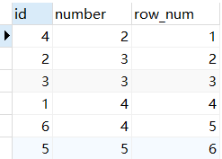
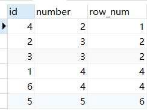
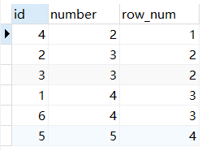
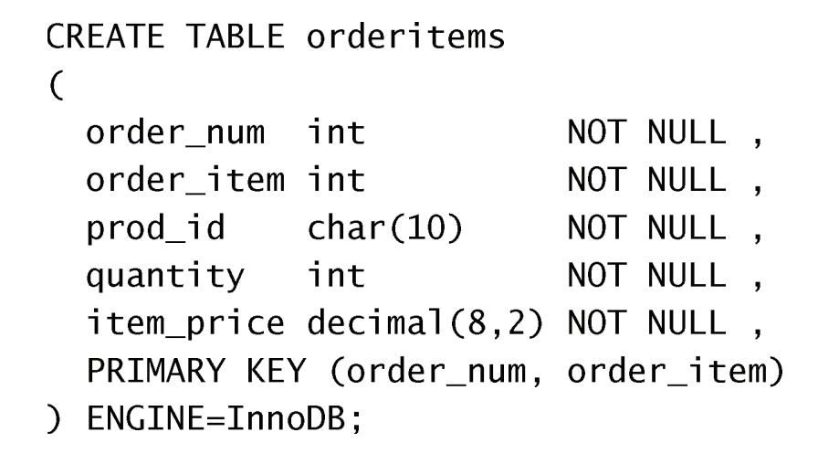
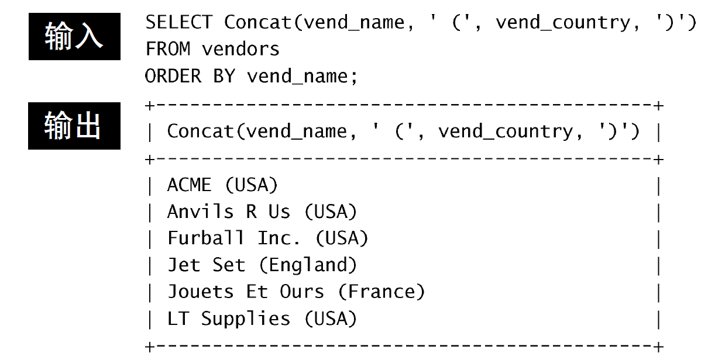
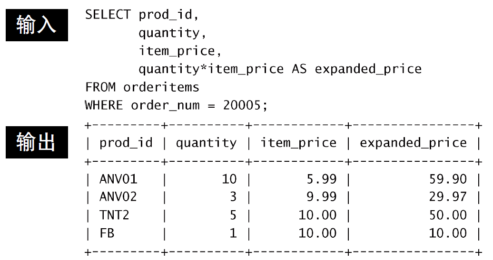
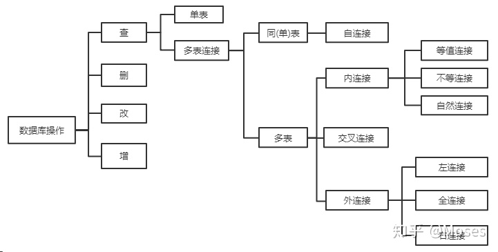

# SQL 语法

## 四大排名函数


### row_number() 

在排名是序号 连续 不重复，即使遇到表中的两个一样的数值亦是如此

```sql
select *,row_number() OVER(order by number ) as row_num
from num
```



### rank()

把要求排序的值相同的归为一组且每组序号一样，**排序不连续**

```sql
select *,rank() OVER(order by number ) as row_num
from num 
```



### dense_rank()

把相同的值分为一组且每组排序号一样，**排序是连续的**

```sql
select *,dense_rank() OVER(order by number ) as row_num
from num 
```



### ntile(group_num) 

将所有记录切分成 group_num 个组，每组序号一样

```sql
select *,ntile(2) OVER(order by number ) as row_num
from num 
```


> 如果分区行的数量不能被整除`n`，则`NTILE()`函数将生成两个大小的组，差异为1。较大的组总是以`ORDER BY`子句指定的顺序位于较小的组之前。
>
> 例如
>
> ```sql
> +-----+
> | val |
> +-----+
> |   1 |
> |   2 |
> |   3 |
> |   4 |
> |   5 |
> |   6 |
> |   7 |
> |   8 |
> |   9 |
> +-----+
> 
> SELECT 
>     val, 
>     NTILE(4) OVER (
>         ORDER BY val
>     ) group_no
> FROM 
>     ntileDemo; 
>     
> +-----+----------+
> | val | group_no |
> +-----+----------+
> |   1 |        1 |
> |   2 |        1 |
> |   3 |        1 |
> |   4 |        2 |
> |   5 |        2 |
> |   6 |        3 |
> |   7 |        3 |
> |   8 |        4 |
> |   9 |        4 |
> +-----+----------+
> ```

## 基础

+ 模式定义了数据如何存储、存储什么样的数据以及数据如何分解等信息，数据库和表都有模式。

+ SQL（Structured Query Language)，标准 SQL 由 ANSI 标准委员会管理，从而称为 ANSI SQL。各个 DBMS 都有自己的实现。

+ SQL 语句不区分大小写（尤其是各类指令），但是数据库表名、列名和值是否区分依赖于具体的 DBMS 以及配置。

> 主键的值不允许修改，也不允许复用（不能将已经删除的主键值赋给新数据行的主键）。
>
> 我试了一下其实是可以的，大概是以前旧版本的规定吧

+ SQL 支持以下三种注释：

```sql
## 注释
SELECT *
FROM mytable; -- 注释
/* 注释1
   注释2 */
```

+ 数据库创建与使用（切换）：

```sql
CREATE DATABASE test;
USE test;
```

+ SQL 的语言编写规范

  https://blog.csdn.net/qq_34100655/article/details/82904797

+ SELECT 字句的书写顺序

  ```sql
  SELECT * FROM * WHERE * GROUP BY * HAVING * ORDER BY * LIMIT
  ```

+ SQL 执行顺序

```sql
（8）SELECT（9）DISTINCT <select_list>
（1）FROM <left_table>
（3）<join_type> JOIN <right_table>
（2）ON <join_condition>
（4）WHERE <where_condition>
（5）GROUP BY <grout_by_list>
（6）WITH {CUTE|ROLLUP}
（7）HAVING <having_condition>
（10）ORDER BY <order_by_list>
（11）LIMIT <limit_number>
```

每步关键字执行的结果都会形成一个虚表，编号大的关键字执行的动作都是在编号小的关键字执行结果所得的虚表上进行（或者说编号大的关键字处理的对象是编号小的关键执行过后得到的虚表），以此类推。

## 创建表

1. 普通的创建，通过数据定义语言 DDL

```sql
CREATE TABLE mytable(
	id INT NOT NULL AUTO_INCREMENT,
    col1 INT NOT NULL DEFAULT 1,
    col2 VARCHAR(45) NULL,
    col3 DATE NULL,
    PRIMARY KEY ('id')
) ENGINE=InnoDB;
```

+ 为创建由多个列组成的主键，应该以逗号分隔的列表给出各列名



+ NULL：NULL 是没有值，不是空串
+ AUTO_INCREMENT：
  + 可以简单地在INSERT语句 中指定一个值，只要它是唯一的（至今尚未使用过）即可，该值将被用来替代自动生成的值。后续的增量将开始使用该手工 插入的值。
  + 可使用last_insert_id() 函数获得这个值
+ 默认值：Mysql 只支持常量默认值，有些 DBMS 则支持函数

+ 引擎类型：如果省略则使用默认引擎（Mysql 5.1 之后是 innoDB）


2. 利用别的数据建表，创建表和数据插入同步完成，是数据操纵语言DML

```sql
CREATE TABLE newtable AS
    SELECT * FROM mytable;
```

## 修改表、删除表、重命名表

+ 添加列

```sql
ALTER TABLE mytable
ADD col CHAR(20);
```

+ 删除列

```sql
ALTER TABLE mytable
DROP COLUMN col;
```

+ 还可以通过 ALTER TABLE 定义外键等

> 对于复杂的表，可以新建表、复制数据到新表、删除旧表、重命名新表、重新创建触发器存储过程索引外键等

+ 删除表

```sql
DROP TABLE mytable;
```

+ 重命名表

```sql
RENAME TABLE backup_customers To customers,
			 backup_vendors TO vendors,
             backup_products TO products;
```

## 插入

+ 普通插入

```sql
INSERT INTO mytable(col1, col2) VALUES (val1, val2);
```

也可以不指定列名，按顺序给出，但不推荐，万一表中列的顺序修改了呢。

> 可以一次性插入多行，比一行一行加入性能高
>
> ```sql
> INSERT INTO mytable(col1, col2) VALUES (val1, val2), (val1, val2), (val1, val2);
> ```

+ 插入检索出的数据

```sql
INSERT INTO mytable(col1, col2)
	SELECT (col1, col2) FROM table2
```

> 还可以利用查出得到的数据直接创建新表，详见表的创建章节

## 更新

UPDATE 语句总是以要更新的表的名字开始

```sql
UPDATE mytable
SET col = val
WHERE id = 1;

## 更新多个列时只需要一个 SET
UPDATE customers
SET cust_name = 'The Fudds ',
	cust_email = 'e1mer@fudd. com'
WHERE cust_id = 10005;
```

## 删除

```sql
DELETE FROM mytable
WHERE id = 1;
```

**TRUNCATE TABLE**   可以清空表，也就是删除所有行。

```sql
TRUNCATE TABLE mytable;
```

使用更新和删除操作时一定要用 WHERE 子句，不然会把整张表的数据都破坏。**可以先用 SELECT 语句测试影响范围。**

>  **DELETE、TRUNCATE 和 DROP**
>
> DELETE 删除表中 WHERE 语句指定的数据。
>
> InnoDB 数据库在使用 delete 进行删除操作的时候，只会将已经删除的数据标记为删除，并没有把数据文件删除，因此并不会彻底的释放空间。这些被删除的数据会被保存在一个链接清单中，当有新数据写入的时候，MySQL 会重新利用这些已删除的空间进行再写入。
>
> 可以使用 OPTIMIZE TABLE 来回收未使用的空间，并整理数据文件的碎片。
> 
> ```sql
> OPTIMIZE TABLE 表名;
> ```
> 
> TRUNCATE 清空表：相当于删除表中的所有数据。会将表和索引占用的空间恢复到初始值。
> 
> DROP 删除表结构：会将表和索引占用的空间释放。


## 检索

### SELECT

### DISTINCT

相同值只会出现一次。**它作用于所有列**，也就是说**所有列的值都相同才算相同**。

```sql
SELECT DISTINCT col1, col2
FROM mytable;
```

### LIMIT

限制返回的行数。可以有两个参数，第一个参数为起始行，从 0 开始；**第二个参数为返回的总行数**。

返回前 5 行：

```sql
SELECT *
FROM mytable
LIMIT 5;
```

```sql
SELECT *
FROM mytable
LIMIT 0, 5;
```

返回第 3 \~ 5 行：

```sql
SELECT *
FROM mytable
LIMIT 2, 3;
```

## 排序

-   **ASC**  ：升序
-   **DESC** ：降序

可以按多个列进行排序，并且为每个列指定不同的排序方式：

```sql
SELECT *
FROM mytable
ORDER BY col1 DESC, col2 ASC;
```

> + 可以用没有选择的列来排序，这是合法的
>
> + 不指定 ORDERED BY 的话，不保证顺序：https://www.zhihu.com/question/19726583

## 过滤数据 （使用 where）

不进行过滤的数据非常大，导致通过网络传输了多余的数据，从而浪费了网络带宽。因此尽量使用 SQL 语句来过滤不必要的数据，而不是传输所有的数据到客户端中然后由客户端进行过滤。

```sql
SELECT *
FROM mytable
WHERE col IS NULL;
```

下表显示了 WHERE 子句可用的操作符

|     操作符      |     说明     |
| :-------------: | :----------: |
|        =        |     等于     |
|      &lt;       |     小于     |
|      &gt;       |     大于     |
| &lt;&gt;     != |    不等于    |
| &lt;=     !&gt; |   小于等于   |
| &gt;=     !&lt; |   大于等于   |
|     BETWEEN     | 在两个值之间 |
|     IS NULL     |  为 NULL 值  |

>  应该注意到，NULL 与 0、空字符串都不同。

**AND 和 OR**   用于连接多个过滤条件。优先处理 AND，当一个过滤表达式涉及到多个 AND 和 OR 时，**可以使用 () 来决定优先级**，使得优先级关系更清晰。

**IN**   操作符用于**匹配一组值**，其后也**可以接一个 SELECT 子句**，从而匹配子查询得到的一组值。

**NOT**   操作符用于否定一个条件。

## 通配符

通配符也是用在过滤语句中，但它只能用于**文本字段**。

-   **%**    匹配 \>=0 个任意字符；
-   **\_**      匹配 ==1 个任意字符；
-   **[ ]**    匹配集合内的一个字符，例如 [ab] 将匹配字符 a 或者 b。
-   **[^]**   匹配不在括号所列之内的单个字符

使用 Like 操作符来进行通配符匹配。

```sql
SELECT *
FROM mytable
WHERE col LIKE '[^AB]%'; -- 不以 A 和 B 开头的任意文本
```

> 不要滥用通配符，通配符位于开头处匹配会非常慢。

> MySQL 支持正则表达式的一个子集，利用 REGEXP 关键字，例如
>
> ```sql
> WHERE prod_name REGEXP '\\([O-9] sticks?\\)'
> ```

## 计算字段（段拼接和算术计算为例）

在数据库服务器上完成数据的转换和格式化的工作往往比客户端上快得多，并且转换和格式化后的数据量更少的话可以减少网络通信量。

+ 段拼接

  MySQL 使用 Concat() 函数，而很多 DBMS 都用 + 或者 || 实现。

  

  > 可以用 TRIM('abc  ') = 'abc' 来去除多余空格

  > 考虑到新创建出来的字段是没有列名的，通常需要用 AS 给他一个列明。

+ 算术计算

  支持的基本算术操作符为 + - * /

  

## 函数

各个 DBMS 的函数都是不相同的，因此不可移植，以下主要是 MySQL 的函数。

### 汇总

|         函 数         |           说 明            |
| :-------------------: | :------------------------: |
| AVG([distinct\|all]x) |      返回某列的平均值      |
| COUNT([distinct\|all]x) | all]x)all]x)返回某列的行数 |
|     MAX([distinct\|all]x)    |   all]x)返回某列的最大值   |
|     MIN([distinct\|all]x)|   all]x)返回某列的最小值   |
|     SUM([distinct\|all]x)  |    all]x)返回某列值之和    |

> AVG() 会忽略 NULL 行。
>
> 使用 AVG(DISTINCT col1) 则可以计算  col1 中不同值的 AVG.
> ```sql
> SELECT AVG(DISTINCT col1) AS avg_col
> FROM mytable;
> ```

### 文本处理

|   函数   |      说明      |
| :------: | :------------: |
|  LEFT()  |   左边的字符   |
| RIGHT()  |   右边的字符   |
| LOWER()  | 转换为小写字符 |
| UPPER()  | 转换为大写字符 |
| LTRIM()  | 去除左边的空格 |
| RTRIM()  | 去除右边的空格 |
| LENGTH() |      长度      |

### 日期和时间处理（知道有就行了）


- 日期格式：YYYY-MM-DD
- 时间格式：HH:\<zero-width space\>MM:SS

|     函 数     |             说 明              |
| :-----------: | :----------------------------: |
|   ADDDATE()   |    增加一个日期（天、周等）    |
|   ADDTIME()   |    增加一个时间（时、分等）    |
|   CURDATE()   |          返回当前日期          |
|   CURTIME()   |          返回当前时间          |
|    DATE()     |     返回日期时间的日期部分     |
|  DATEDIFF()   |        计算两个日期之差        |
|  DATE_ADD()   |     高度灵活的日期运算函数     |
| DATE_FORMAT() |  返回一个格式化的日期或时间串  |
|     DAY()     |     返回一个日期的天数部分     |
|  DAYOFWEEK()  | 对于一个日期，返回对应的星期几 |
|    HOUR()     |     返回一个时间的小时部分     |
|   MINUTE()    |     返回一个时间的分钟部分     |
|    MONTH()    |     返回一个日期的月份部分     |
|     NOW()     |       返回当前日期和时间       |
|   SECOND()    |      返回一个时间的秒部分      |
|    TIME()     |   返回一个日期时间的时间部分   |
|    YEAR()     |     返回一个日期的年份部分     |

```sql
mysql> SELECT NOW();
2018-4-14 20:25:11
```

### 数值处理

|  函数  |  说明  |
| :----: | :----: |
| SIN()  |  正弦  |
| COS()  |  余弦  |
| TAN()  |  正切  |
| ABS()  | 绝对值 |
| SQRT() | 平方根 |
| MOD()  |  余数  |
| EXP()  |  指数  |
|  PI()  | 圆周率 |
| RAND() | 随机数 |

## 分组

把具有相同的数据值的行放在同一组中。

可以对同一分组数据使用**汇总函数**进行处理，例如求分组数据的平均值等。

先分组，然后借助 ORDER BY 对**指定的分组字段排序**

> 有些 DBMS 实现里，如果没指定也会自动按该字段进行排序。但这不是 SQL 规范，不推荐

```sql
SELECT col, COUNT(*) AS num
FROM mytable
GROUP BY col;

SELECT col, SUM(col2) AS num
FROM mytable
GROUP BY col;
```

GROUP BY 自动按分组字段进行排序，通过 ORDER BY **也可以按汇总字段来进行排序**。

> 分组规定：
>
> - GROUP BY 子句出现在 WHERE 子句之后，ORDER BY 子句之前，；
> - **除了汇总字段外，SELECT 语句中的每一字段都必须在 GROUP BY 子句中给出**；
> - NULL 的行会单独分为一组；
> - 大多数 SQL 实现不支持 GROUP BY 列具有可变长度的数据类型。

```sql
SELECT col, COUNT(*) AS num
FROM mytable
GROUP BY col
ORDER BY num;
```

HAVING 可以过滤分组（基于分组字段和汇总字段），其支持所有 WHERE 支持的操作符


**WHERE 过滤行**，**HAVING 过滤分组**，**行过滤应当先于分组过滤**。（或者理解为，WHERE 在分组之前进行过滤，然后分组，然后再用 HAVING 过滤）

```sql
SELECT col, COUNT(*) AS num
FROM mytable
WHERE col > 2
GROUP BY col
HAVING num >= 2;
```

## 子查询

子查询指嵌套在其他查询中的查询。通常子查询中返回**一个列的数据**。子查询**总是从内向外处理**。

**可以将子查询的结果作为 WHRER 语句的过滤条件**：

```sql
SELECT *
FROM mytable1
WHERE col1 IN (SELECT col2
               FROM mytable2);
```

下面的语句可以检索出客户的订单数量，**子查询语句会对第一个查询检索出的每个客户执行一次**：

```sql
SELECT cust_name, (SELECT COUNT(*)
                   FROM Orders
                   WHERE Orders.cust_id = Customers.cust_id)
                   AS orders_num
FROM Customers
ORDER BY cust_name;
```

> 思考，如果先把 orders 按照 cust_id 先 group by 呢？这实际上就是先 GROUP BY 再和 Customers 表 join
>
> 因为通常来说 Orders 表会大于 Customers 表，这样可能不需要每次遍历 Orders 表
>
> ```sql
> SELECT cust_name, cnt
> FROM (
> 	SELECT cust_id, COUNT(*)
>     FROM Orders
>     GROUP BY cust_id
> ) AS t1 JOIN Customers AS t2 ON t1.cust_id = t2.cust_id
> ```

## 连接

使用 JOIN 关键字连接多个表，使用 ON 作为条件语句。

> 连接可以替换子查询，并且比子查询的效率一般会更快。
>
> 如果连接的时候不指定关键词，则左表每一行和右边每一行都匹配，生成了笛卡尔积，变成了 m * n 行



### 自连接

连接的表是自身。

一张员工表，包含员工姓名和员工所属部门，要找出与 Jim 处在同一部门的所有员工姓名。

子查询版本

```sql
SELECT name
FROM employee
WHERE department = (
      SELECT department
      FROM employee
      WHERE name = "Jim");
```

自连接版本

```sql
SELECT e1.name
FROM employee AS e1 INNER JOIN employee AS e2
ON e1.department = e2.department
      AND e2.name = "Jim";
```

> 有些时候，自连接版本会比子查询快很多

### 内连接

使用 INNER JOIN 关键字，不保留没有关联的那些行

#### 等值连接

```sql
SELECT A.value, B.value
FROM tablea AS A INNER JOIN tableb AS B
ON A.key = B.key;

SELECT A.value, B.value
FROM tablea AS A, tableb AS B
WHERE A.key = B.key;
```

#### 自然连接

SQL NATURAL JOIN 是 EQUI JOIN 的一种，其结构方式是，关联表的同名列只会出现一次。

**Natural Join: Guidelines**

+ 关联表具有一对或多对同名列，且相同的列是相同的数据类型
+ 不要在自然连接中使用 ON 子句

```sql
SELECT * from Table_A A NATURAL JOIN Table_B B
```

### 外连接

外连接保留了没有关联的那些行。分为左外连接，右外连接以及全外连接，左外连接就是保留左表没有关联的行。

例如，检索所有顾客的订单信息，包括还没有订单信息的顾客。

```sql
SELECT Customers.cust_id, Customer.cust_name, Orders.order_id
FROM Customers LEFT OUTER JOIN Orders
ON Customers.cust_id = Orders.cust_id;
```

customers 表：

| cust_id | cust_name |
| :-----: | :-------: |
|    1    |     a     |
|    2    |     b     |
|    3    |     c     |

orders 表：

| order_id | cust_id |
| :------: | :-----: |
|    1     |    1    |
|    2     |    1    |
|    3     |    3    |
|    4     |    3    |

结果：

| cust_id | cust_name | order_id |
| :-----: | :-------: | :------: |
|    1    |     a     |    1     |
|    1    |     a     |    2     |
|    3    |     c     |    3     |
|    3    |     c     |    4     |
|    2    |     b     |   Null   |

## 视图

视图是虚拟的表，本身不包含数据，也就不能对其进行索引操作。

对视图的操作和对普通表的操作一样。

视图具有如下好处：

- 简化复杂的 SQL 操作，比如复杂的连接；（包装好复杂的操作）
- 只使用实际表的一部分数据；
- 通过只给用户访问视图的权限，保证数据的安全性；
- 更改数据格式和表示。（比如计算字段）

```sql
CREATE VIEW myview AS
SELECT Concat(col1, col2) AS concat_col, col3*col4 AS compute_col
FROM mytable
where col5 = val;
```

### 关于视图的更新

如果 MySQL 不能确定被更新的基数据，就不能更新视图（包括插入和删除）。但是各种 JOIN、聚集函数等都会导致不能更新视图。总之视图主要的作用是用来检索的（SELECT），而不是更新

## 存储过程 

存储过程可以看成是对一系列 SQL 操作的批处理。

使用存储过程的好处：

- 代码封装，保证了一定的安全性；
- 代码复用；
- 由于是预先编译，因此具有很高的性能。

命令行中创建存储过程需要自定义分隔符，因为命令行是以 ; 为结束符，而存储过程中也包含了分号，因此会错误把这部分分号当成是结束符，造成语法错误。

包含 in、out 和 inout 三种参数。

给变量赋值都需要用 select into 语句。

每次只能给一个变量赋值，不支持集合的操作。

```sql
delimiter //

create procedure myprocedure( out ret int )
    begin
        declare y int;
        select sum(col1)
        from mytable
        into y;
        select y*y into ret;
    end //

delimiter ;
```

```sql
call myprocedure(@ret);
select @ret;
```

## 游标

在存储过程中使用游标可以对一个结果集进行移动遍历。

游标主要用于交互式应用，其中用户需要对数据集中的任意行进行浏览和修改。

使用游标的四个步骤：

1. 声明游标，这个过程没有实际检索出数据；
2. 打开游标；
3. 取出数据；
4. 关闭游标；

```sql
delimiter //
create procedure myprocedure(out ret int)
    begin
        declare done boolean default 0;

        declare mycursor cursor for
        select col1 from mytable;
        # 定义了一个 continue handler，当 sqlstate '02000' 这个条件出现时，会执行 set done = 1
        declare continue handler for sqlstate '02000' set done = 1;

        open mycursor;

        repeat
            fetch mycursor into ret;
            select ret;
        until done end repeat;

        close mycursor;
    end //
 delimiter ;
```

## 触发器

触发器会在某个表执行以下语句时而自动执行：DELETE、INSERT、UPDATE。

在创建触发器时，需要给出4条信息：

+ 唯一的触发器名
+ 触发器关联的表（只有表支持触发器，视图不支持）
+ 触发器应该响应的活动 (DELETE、INSERT或UPDATE)
+ 触发器何时执行（语句执行之前还是之后)

### INSERT 触发器（通常将 BEFORE 用于数据验证、适当修改【UPDATE 的 BEFORE 触发器同理】）

+ 在 INSERT 触发器代码内，可引用一个名为 NEW 的虚拟表，访问被插入的行

+ 在 BEFORE INSERT触发器中，NEW 中的值也可以被更新（允许更改被插入的值)

  对于AUTO_INCREMENT列，NEW 在 INSERT 执行之前包含0，在 INSERT 执行之后包含新的自动生成值。

### DELETE 触发器

+ 在 DELETE 触发器代码中，你可以引用一个名为 OLD 的虚拟表访问将要被删除的行
+ OLD 中的值全都是只读的，不能更新。

> 下面的例子演示使用 OLD 保存将要被删除的行到一个存档表中：
>
> ```sql
> CREATE TRIGGER deleteorder BEFORE DELETE ON orders
> FOR EACH ROW
> BEGIN
>     INSERT INTO archive_orders(order_num，order_date，cust_id) 
>     VALUES (OLD.order_num，OLD.order_date，OLD.cust_id);
> END;
> ```
>
> 如果 DELETE BEFORE 触发器执行出错，是不会继续 DELETE 的，这比较好。如果用的是 DELETE AFTER 触发器，不能正常执行，那 OLD 就丢了

### UPDATE 触发器

+ 在 UPDATE 触发器代码中，你可以引用一个名为 OLD 的虚拟表访问以前（UPDATE 语句前）的值，引用一个名为 NEW 的虚拟表访问新更新的值
+ 在 BEFORE UPDATE 触发器中，NEW 中的值可能也被更新（允许更改将要用于 UPDATE 语句中的值)
+ OLD 中的值全都是只读的，不能更新。

## 事务管理

基本术语：

- 事务（transaction）指一组 SQL 语句；
- 回退（rollback）指撤销指定 SQL 语句的过程；
- 提交（commit）指将未存储的 SQL 语句结果写入数据库表；
- 保留点（savepoint）指事务处理中设置的临时占位符（placeholder），之后可以回退到这个点。

**不能回退 SELECT 语句，回退 SELECT 语句也没意义；也不能回退 CREATE 和 DROP 语句。**

MySQL 的事务提交默认是隐式提交，**每执行一条语句就把这条语句当成一个事务然后进行提交**。当出现 START TRANSACTION 语句时，会关闭隐式提交；当 COMMIT 或 ROLLBACK 语句执行后，事务会自动关闭，重新恢复隐式提交。

设置 autocommit 为 0 可以取消自动提交；autocommit 标记是针对每个连接而不是针对服务器的。

如果没有设置保留点，ROLLBACK 会回退到 START TRANSACTION 语句处；如果设置了保留点，并且在 ROLLBACK 中指定该保留点，则会回退到该保留点。

```sql
START TRANSACTION
// ...
SAVEPOINT delete1
// ...
ROLLBACK TO delete1
// ...
COMMIT
```

> mysiam本身就不是事务型的存储引擎，这引擎出来时候事务概念还不完善。

## 字符集

基本术语：

- 字符集为**字母和符号的集合**
- 编码为某个字符集成员的**内部表示**
- 校对字符指定如何**比较**，主要用于**排序和分组**

可以给表、列指定字符集和校对

```sql
CREATE TABLE mytable
(col VARCHAR(10) CHARACTER SET latin COLLATE latin1_general_ci )
DEFAULT CHARACTER SET hebrew COLLATE hebrew_general_ci;
```

可以在排序、分组时指定校对：

```sql
SELECT *
FROM mytable
ORDER BY col COLLATE latin1_general_ci;
```

## 

## 权限管理

MySQL 的账户信息保存在 mysql 这个数据库中。

```sql
USE mysql;
SELECT user FROM user;
```

**创建账户**  

新创建的账户没有任何权限。

```sql
CREATE USER myuser IDENTIFIED BY 'mypassword';
```

**修改账户名**  

```sql
RENAME USER myuser TO newuser;
```

**删除账户**  

```sql
DROP USER myuser;
```

**查看权限**  

```sql
SHOW GRANTS FOR myuser;
```

**授予权限**  

账户用 username@host 的形式定义，username@% 使用的是默认主机名。

```sql
GRANT SELECT, INSERT ON mydatabase.* TO myuser@'登录IP或域名';
```

**删除权限**  

GRANT 和 REVOKE 可在几个层次上控制访问权限：

- 整个服务器，使用 GRANT ALL 和 REVOKE ALL；
- 整个数据库，使用 ON database.\*；
- 特定的表，使用 ON database.table；
- 特定的列；
- 特定的存储过程。

```sql
REVOKE SELECT, INSERT ON mydatabase.* FROM myuser;
```

**更改密码**  

必须使用 Password() 函数进行加密。

```sql
SET PASSWROD FOR myuser = Password('new_password');
```
