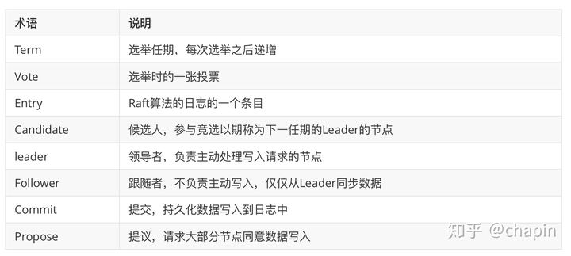

# 概述
[https://zhuanlan.zhihu.com/p/96428375?from_voters_page=true](https://zhuanlan.zhihu.com/p/96428375?from_voters_page=true)

# 背景
## definition
etcd是一个分布式的、高可用的、一致的key-value存储数据库，基于Go语言实现，主要用于共享配置和服务发现。
## etcd 的应用场景
etcd 比较多的应用场景是用于服务发现，服务发现 (Service Discovery) 要解决的是分布式系统中最常见的问题之一，即在同一个分布式集群中的进程或服务如何才能找到对方并建立连接。包括：
+ 配置管理
+ 服务注册发现
+ 选主
+ 应用调度
+ 分布式队列
+ 分布式锁

# 工作原理
etcd 使用 raft 协议来维护集群内各个节点状态的一致性。简单说，etcd 集群是一个分布式系统，由多个节点相互通信构成整体对外服务，每个节点都存储了完整的数据，并且通过 Raft 协议保证每个节点维护的数据是一致的。

每个 etcd 节点都维护了一个状态机，并且，任意时刻至多存在一个有效的主节点。主节点处理所有来自客户端写操作，通过 Raft 协议保证写操作对状态机的改动会可靠的同步到其他节点。

## 数据模型
设计目标是用来存放非频繁更新的数据，提供可靠的 Watch插件，它暴露了键值对的历史版本，以支持低成本的快照、监控历史事件。

这些设计目标要求它使用一个**持久化的、多版本的、支持并发的**数据数据模型。

当 etcd 键值对的新版本保存后，先前的版本依然存在。从效果上来说，键值对是不可变的，etcd 不会对其进行 in-place 的更新操作，而总是生成一个新的数据结构。为了防止历史版本无限增加，etcd 的存储支持压缩（Compact）以及删除老旧版本。

## 逻辑视图
从逻辑角度看，etcd 的存储是一个扁平的二进制键空间，键空间有一个针对键（字节字符串）的词典序索引，因此范围查询的成本较低。

键空间维护了多个修订版本（Revisions），每一个原子变动操作（一个事务可由多个子操作组成）都会产生一个新的修订版本。

一个键的一次生命周期（从创建到删除）叫做 “代 (Generation)”，每个键可以有多个代。创建一个键时会增加键的版本（version），如果在当前修订版中键不存在则版本设置为1。删除一个键会创建一个墓碑（Tombstone），将版本设置为0，结束当前代。当压缩时，任何在压缩修订版之前结束的代，都会被移除。

## 物理视图
etcd 将数据存放在一个持久化的 B+ 树中，处于效率的考虑，每个修订版仅仅存储相对前一个修订版的数据状态变化（Delta）。单个修订版中可能包含了 B+ 树中的多个键。

键值对的键，是三元组（major，sub，type）：
+ major：存储键值的修订版
+ sub：用于区分相同修订版中的不同键
+ type：用于特殊值的可选后缀，例如 t 表示值包含墓碑

键值对的值，包含从上一个修订版的 Delta。

# etcd 术语

# 使用
[https://www.tizi365.com/archives/557.html](https://www.tizi365.com/archives/557.html)

[https://etcd.io/docs/v3.4.0/demo/](https://etcd.io/docs/v3.4.0/demo/)

[https://blog.csdn.net/c_circle/article/details/98473421](https://blog.csdn.net/c_circle/article/details/98473421)