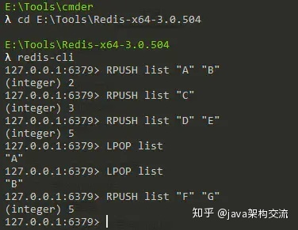
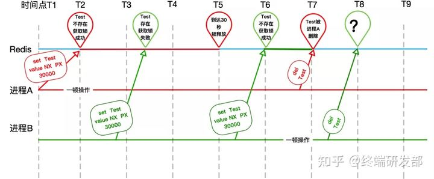
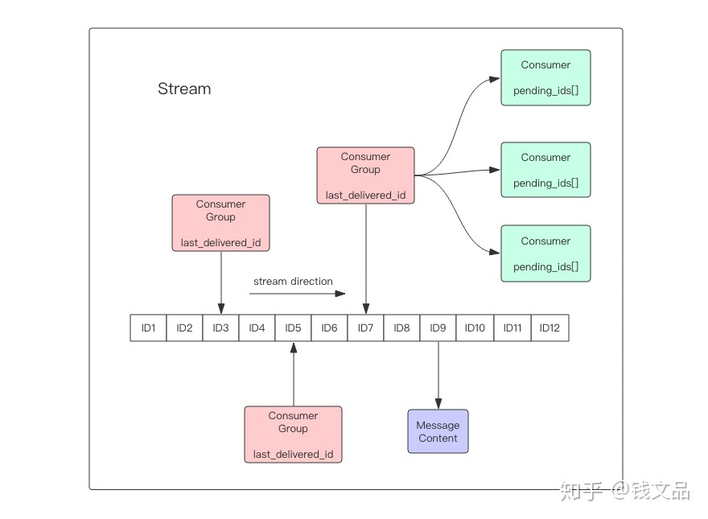
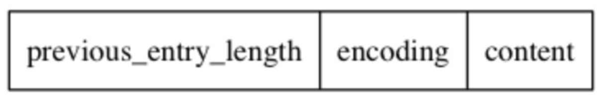

# Redis

## Redis 单线程 & 为什么快

> Redis到底是多线程还是单线程？ - 三分恶的回答 - 知乎 https://www.zhihu.com/question/55818031/answer/2247511664

Redis **执行命令阶段是完全单线程的**。在较新的版本中引入了多线程。

**多线程主要用于网络 I/O 阶段**，也就是接收命令和写回结果阶段，而在执行命令阶段，还是由单线程串行执行。由于执行时还是串行，因此无需考虑并发安全问题。

### Redis为什么要使用单线程

官方 FAQ 表示，因为 Redis 是基于内存的操作，CPU 成为 Redis 的瓶颈的情况很少见，Redis 的瓶颈最有可能是内存的大小或者网络限制。

Redis 4.0 之后，除了主线程外，它也有后台线程在处理一些较为缓慢的操作，例如清理脏数据、无用连接的释放、大 Key 的删除等等。

### Redis 为什么使用单进程、单线程也很快

1. 纯内存访问，Redis 将所有数据放在内存中，内存的响应时长大约为 100 ns，这是 Redis 达到每秒万级别访问的最重要的基础。
2. 单线程可以避免不必要的上下文切换和竞争条件，减少了这方面的性能消耗。
3. 使用了 I/O 多路复用模型，select、epoll 等，不在网络 I/O 上浪费过多的时间

> 如果万一单核的 CPU 成为了 Redis 瓶颈了，不想让其他核闲置怎么办？
>
> 多开几个 Redis 进程就好了，只要客户端分得清哪些 key 放在哪个Redis 进程上就好了。

### 用多线程来处理网络请求

> Redis6.0引入的多线程和Netty的多线程模型有何不同？ - 冒泡的回答 - 知乎 https://www.zhihu.com/question/403600935/answer/1318210809
>
> Redis 多线程网络模型全面揭秘 - 腾讯技术工程的文章 - 知乎 https://zhuanlan.zhihu.com/p/356059845

Redis 6.0 采用多个 IO 线程来处理网络请求（返回），**网络请求的解析可以由其他线程完成**，然后把解析后的请求交由主线程进行实际的内存读写。提升网络请求（返回）处理的并行度，进而提升整体性能。总的来说就是网络读写操作被分摊了

#### 之前的逻辑是

有请求来->收请求->读写内存数据库->发送回复（此时包括 IO 多路复用的）


> **client**：客户端对象，Redis 是典型的 CS 架构（Client <---> Server），客户端通过 **socket** 与服务端建立网络通道然后发送请求命令，服务端执行请求的命令并回复。**Redis** 使用结构体 **client** 存储客户端的所有相关信息，包括但不限于`封装的套接字连接 -- *conn`，`当前选择的数据库指针 -- *db`，`读入缓冲区 -- querybuf`，`写出缓冲区 -- buf`，`写出数据链表 -- reply`等。
>
> **aeApiPoll**：I/O 多路复用 API，是基于 epoll_wait/select/kevent 等系统调用的封装，监听等待读写事件触发，然后处理，它是事件循环（Event Loop）中的核心函数，是事件驱动得以运行的基础。
>
> **acceptTcpHandler**：连接应答处理器，底层使用系统调用 `accept` 接受来自客户端的新连接，并为新连接注册绑定命令读取处理器，以备后续处理新的客户端 TCP 连接；除了这个处理器，还有对应的 `acceptUnixHandler` 负责处理 Unix Domain Socket 以及 `acceptTLSHandler` 负责处理 TLS 加密连接。
>
> **readQueryFromClient**：命令读取处理器，解析并执行客户端的请求命令。
>
> **beforeSleep**：事件循环中进入 aeApiPoll 等待事件到来之前会执行的函数，其中包含一些日常的任务，比如把 `client->buf` 或者 `client->reply` （后面会解释为什么这里需要两个缓冲区）中的响应写回到客户端，持久化 AOF 缓冲区的数据到磁盘等，相对应的还有一个 afterSleep 函数，在 aeApiPoll 之后执行。

工作流程是：

1. Redis 服务器启动，开启主线程事件循环（Event Loop），等待客户端通过 `acceptTcpHandler`建立连接。初始化一个 client 绑定该 conn

2. 客户端发送请求命令，触发读就绪事件，主线程调用 `readQueryFromClient` 通过 socket 读取客户端发送过来的命令存入 `client->querybuf` 读入缓冲区；

3. 根据 Redis 协议解析命令，最后调用 `processCommand` 执行命令

4. 将响应数据写入到对应 `client` 的写出缓冲区：`client->buf` 或者 `client->reply` ，`client->buf` 是首选的写出缓冲区，固定大小 16KB，一般来说可以缓冲足够多的响应数据，但是如果客户端在时间窗口内需要响应的数据非常大，那么则会自动切换到 `client->reply` 链表上去，使用链表理论上能够保存无限大的数据。

   最后把 `client` 添加进一个 LIFO 队列 `clients_pending_write`

5. 在事件循环（Event Loop）中，遍历 `clients_pending_write` 队列，调用 `writeToClient` 把 `client` 的写出缓冲区里的数据回写到客户端

Redis 的单线程模式（单 reactor + 单线程）会导致系统消耗很多 CPU 时间在网络 I/O 上从而降低吞吐量

#### 后面

作者发现（或者说是他认为）相对于内存数据库的读写操作，网络 IO 占大头（系统调用费时了），所以把收请求和发送回复放到 IO 线程组去做了，主线程要进行 IO 时通知一下线程组，线程组做完了再通知主线程，这段时间主线程可以去做其他操作，**线程之间通知基本是内存操作（一个 spinlock 负责的队列）**

不过这种方法的前提就是：主线程和 IO 线程组的通讯 要比 主线程直接执行 IO 更快，从而提高了并行处理能力，但如果线程数量配置很多，spinlock 竞争严重，那么也会造成 CPU 虚高的情况

工作流程是：

1. Redis 服务器启动，开启主线程事件循环（Event Loop），等待客户端通过 `acceptTcpHandler`建立连接。初始化一个 client 绑定该 conn
2. 客户端发送请求命令，触发读就绪事件，【个人猜测是在事件信号的中断处理函数中？】，将 `client` 放入一个 LIFO 队列 `clients_pending_read`；
3. 在事件循环（Event Loop）中，主线程把 `clients_pending_read`队列中的连接均匀地分配给 I/O 线程各自的本地 FIFO 任务队列 `io_threads_list[id]` 和主线程自己，I/O 线程通过 socket 读取客户端的请求命令，存入 `client->querybuf` 并解析第一个命令，**但不执行命令**，主线程忙轮询，等待所有 I/O 线程完成读取任务；
4. 主线程和所有 I/O 线程都完成了读取任务，主线程结束忙轮询，遍历 `clients_pending_read` 队列，**执行所有客户端连接的请求命令**
5. 将响应数据写入到对应 `client` 的写出缓冲区，最后把 `client` 添加进一个 LIFO 队列 `clients_pending_write`
6. 在事件循环（Event Loop）中，主线程执行 `beforeSleep` --> `xxx`，利用 Round-Robin 轮询负载均衡策略，把 `clients_pending_write` 队列中的连接均匀地分配给 I/O 线程各自的本地 FIFO 任务队列 `io_threads_list[id]` 和主线程自己，把 `client` 的写出缓冲区里的数据回写到客户端，主线程忙轮询，等待所有 I/O 线程完成写出任务

这里大部分逻辑和之前的单线程模型是一致的，变动的地方仅仅是把读取客户端请求命令和回写响应数据的逻辑异步化了，交给 I/O 线程去完成，这里需要特别注意的一点是：**I/O 线程仅仅是读取和解析客户端命令而不会真正去执行命令，客户端命令的执行最终还是要在主线程上完成**。


## 场景

+ 缓存（核心）

  + 不失效的情况下作为查找表：DNS
  + 会话缓存：可以使用 Redis 来统一存储多台应用服务器的会话信息 session。一个用户可以请求任意一个应用服务器，从而更容易实现高可用性以及可伸缩性
  + 正常缓存：将热点数据放到内存中，设置内存的最大使用量以及淘汰策略来保证缓存的命中率。

+ 计数器

  可以对 String 进行自增自减运算，从而实现计数器功能。Redis 这种内存型数据库的读写性能非常高，很适合存储频繁读写的计数量。

+ 分布式锁（setnx + lua 脚本）

  可以使用 Redis 自带的 SETNX 命令实现分布式锁，除此之外，还可以使用官方提供的 RedLock 分布式锁实现

+ 消息队列

  List 是一个双向链表，可以通过 lpush 和 rpop 写入和读取消息。也可以用最新的 Stream。

+ 排行榜（zset）

+ 访客统计（hyperloglog）

## 与 memcached 的对比

两者都是非关系型内存键值数据库，主要有以下不同：

+ 数据类型

  Memcached 仅支持字符串类型，而 Redis 支持五种不同的数据类型，可以更灵活地解决问题。

+ 数据持久化

  Redis 支持两种持久化策略：RDB 快照和 AOF 日志，而 Memcached 不支持持久化。

+ 分布式

  Memcached 不支持分布式，只能通过在客户端使用一致性哈希来实现分布式存储，这种方式在存储和查询时都需要先在客户端计算一次数据所在的节点。

  Redis Cluster 实现了分布式的支持。

+ 内存管理机制

  - 在 Redis 中，并不是所有数据都一直存储在内存中，可以将一些很久没用的 value 交换到磁盘，而 Memcached 的数据则会一直在内存中。

  - Memcached 将内存分割成特定长度的块来存储数据，以完全解决内存碎片的问题。但是这种方式会使得内存的利用率不高，例如块的大小为 128 bytes，只存储 100 bytes 的数据，那么剩下的 28 bytes 就浪费掉了。

## 数据淘汰策略

可以设置内存最大使用量，当内存使用量超出时，会施行数据淘汰策略。

Redis 具体有 8（6+2） 种淘汰策略：

| 策略            | 描述                                                     |
| :-------------- | :------------------------------------------------------- |
| volatile-lru    | 从 已设置过期时间的数据集 中挑选 最近最少使用 的数据淘汰 |
| volatile-ttl    | 从 已设置过期时间的数据集 中挑选 将要过期 的数据淘汰     |
| volatile-random | 从 已设置过期时间的数据集 中 任意 选择数据淘汰           |
| allkeys-lru     | 从 所有数据集 中挑选 最近最少使用 的数据淘汰             |
| allkeys-random  | 从 所有数据集 中 任意 选择数据进行淘汰                   |
| noeviction      | 禁止淘汰数据，只是返回错误                               |

作为内存数据库，出于对性能和内存消耗的考虑，Redis 的淘汰算法实际实现上并非针对所有 key，而是抽样一小部分并且从中选出被淘汰的 key。

使用 Redis 缓存数据时，为了提高缓存命中率，需要保证缓存数据都是热点数据。可以将内存最大使用量设置为热点数据占用的内存量，然后启用 allkeys-lru 淘汰策略，将最近最少使用的数据淘汰。

**Redis 4.0 引入了 volatile-lfu 和 allkeys-lfu** 淘汰策略，LFU 策略通过**统计访问频率，将访问频率最少的键值对淘汰**。

## Redis 持久化

> 阿里二面：熟悉Redis？讲讲你理解的Redis的持久化机制(RDB、AOF) - java架构交流的文章 - 知乎 https://zhuanlan.zhihu.com/p/106997927

因为Redis是内存数据库，它将自己的数据存储在内存里面，一旦Redis服务器进程退出或者运行Redis服务器的计算机停机，Redis服务器中的数据就会丢失。

为了避免数据丢失，所以Redis提供了持久化机制，将存储在内存中的数据保存到磁盘中，用于在Redis服务器进程退出或者运行Redis服务器的计算机停机导致数据丢失时，快速的恢复之前Redis存储在内存中的数据。

### RDB持久化（快照方式, Redis DataBase）

+ RDB持久化是将某个时间点上 Redis 中的数据以二进制的方式保存到一个RDB文件中。二进制的数据，占用内存更小，更紧凑，更适合做为备份文件。

+ 可以将快照复制到其它服务器从而创建具有相同数据的服务器副本。

+ 如果系统发生故障，将会丢失最后一次创建快照之后的数据。

+ 如果数据量很大，保存快照的时间会很长。

|  |  |
| ------------------------------------------------- | ------------------------------------------------- |

#### 生成 RDB 方式

可以手动执行备份命令，但还是推荐设置 Redis 服务器配置文件的选项，让服务器每隔一段时间自动执行一次保存。主从复制中，当从节点执行全量复制，主节点也会执行 `bgsave`将 RDS 文件发送给从节点。

**SAVE:** SAVE 命令会阻塞 Redis 服务器进程，直到 RDB 文件创建完毕为止，在服务器进程阻塞期间，服务器不能处理任何命令请求。

**BGSAVE:** BGSAVE 命令会派生出一个子进程，然后由子进程负责创建 RDB 文件，服务器进程（父进程）继续处理命令请求

> BGSAVE 咋实现的？
>
> fork() + copy on write
>
> 当 bgsave 执行时，Redis 主进程会 fork() 出一个子进程来执行 rdb 文件持久化的工作。基于 linux 的 fork 策略，子进程与Redis主进程共享同一份内存空间，所以子进程可以搞他的 rdb 文件持久化工作，主进程又能继续他的对外提供服务，二者互不影响。
>
> 主进程 fork() 子进程之后，内核把主进程中所有的内存页的权限都设为 read-only，然后子进程的地址空间指向主进程。这也就是共享了主进程的内存，当其中某个进程写内存时(这里肯定是主进程写，因为子进程只负责rdb文件持久化工作，不参与客户端的请求)，CPU硬件检测到内存页是 read-only 的，于是触发页异常中断（page-fault），陷入内核的一个中断例程，内核就会把触发的异常的页复制一份（这里仅仅复制异常页，也就是所修改的那个数据页，而不是内存中的全部数据），于是主子进程各自持有独立的一份。
>
> 因此，redis 在 BGSAVE 时，用户与 redis 的交互不能保存在本次持久化的 RDB 中

### AOF 持久化（Append-Only File）

> 阿里二面：熟悉Redis？讲讲你理解的Redis的持久化机制(RDB、AOF) - java架构交流的文章 - 知乎 https://zhuanlan.zhihu.com/p/106997927

AOF 持久化是通过保存 Redis 服务器所执行的写命令来记录数据库数据的。


使用 AOF 持久化需要设置同步选项，从而确保写命令同步到磁盘文件上的时机。这是因为对文件进行写入并不会马上将内容同步到磁盘上，而是先存储到缓冲区，然后由操作系统决定什么时候同步到磁盘。有以下同步选项：

|   选项   | 同步频率                                                     |
| :------: | :----------------------------------------------------------- |
|  always  | 每个写命令都同步【always 选项会严重减低服务器的性能】        |
| everysec | 每秒同步一次【可以保证系统崩溃时只会丢失一秒左右的数据，并且 Redis 每秒执行一次同步对服务器性能几乎没有任何影响】 |
|    no    | 让操作系统来决定何时同步【不能给服务器性能带来多大的提升，而且也会增加系统崩溃时数据丢失的数量】 |

#### AOF 重写

随着服务器写请求的增多，AOF 文件会越来越大。Redis 提供了一种将 AOF 重写的特性，能够去除 AOF 文件中的冗余写命令。



AOF 文件重写并不需要对现有的 AOF 文件进行任何读取、分析或者写入操作，而是通过读取服务器当前的数据库数据来实现的。

仍然以上面的 list 键为例，旧的 AOF 文件保存了 6 条命令来记录 list 键的状态，但 list 键的结果是“C” "D" "E" "F" "G"这样的数据，所以 AOF 文件重写时，可以用一条 `RPUSH list “C” "D" "E" "F" "G"` 命令来代替之前的六条命令，这样就可以将保存 list 键所需的命令从六条减少为一条。

即：AOF文件重写功能的实现原理为：**首先从数据库中读取键现在的值，然后用一条命令去记录键值对，代替之前记录这个键值对的多条命令。**

**AOF后台重写的步骤如下所示**：

1. 服务器进程创建子进程，子进程开始 AOF 文件重写
2. 从创建子进程开始，服务器进程执行的所有写命令不仅要写入 AOF 缓冲区，还要写入 AOF 重写缓冲区
   + 写入 AOF 缓冲区的目的是为了同步到原有的 AOF 文件。
   + 写入 AOF 重写缓冲区的目的是因为子进程在进行 AOF 文件重写期间，服务器进程还在继续处理命令请求，而新的命令可能会对现有的数据库进行修改，从而使得服务器当前的数据库数据和重写后的 AOF 文件所保存的数据库数据不一致。
3. 子进程完成 AOF 重写工作，向父进程发送一个信号，父进程在接收到该信号后，会执行以下操作：
   1.将 AOF 重写缓冲区中的所有内容写入到新 AOF 文件中，这样就保证了新 AOF 文件所保存的数据库数据和服务器当前的数据库数据是一致的。
   2.对新的 AOF 文件进行改名，原子地覆盖现有的 AOF 文件，完成新旧两个 AOF 文件的替换。

Redis将AOF文件重写功能放到子进程里执行，这样做有以下 2 个好处：

1. 子进程进行 AOF 文件重写期间，服务器进程（父进程）可以继续处理命令请求。
2. 子进程带有服务器进程的数据副本（其实是写时复制啦），使用子进程而不是线程，可以在避免使用锁的情况下，保证数据的安全性。

### RDB 和 AOF 对比

+ 实现方式
  + RDB持久化是通过将某个时间点 Redis 服务器存储的数据保存到 RDB 文件中来实现持久化的。
  + AOF持久化是通过将 Redis 服务器执行的所有写命令保存到 AOF 文件中来实现持久化的。

+ 文件体积

  由上述实现方式可知，RDB 持久化记录的是结果，AOF 持久化记录的是过程，所以 AOF 持久化生成的 AOF 文件会有体积越来越大的问题，Redis 提供了 AOF 重写功能来减小 AOF 文件体积。

+ 安全性

  AOF持久化的安全性要比 RDB 持久化的安全性高，即如果发生机器故障，AOF持久化要比RDB持久化丢失的数据要少。

  因为 RDB 持久化会丢失上次 RDB 持久化后写入的数据，而 AOF 持久化最多丢失1s之内写入的数据（使用默认everysec配置的话）。

+ 优先级

  由于上述的安全性问题，如果 Redis 服务器开启了 AOF 持久化功能，Redis 服务器在启动时会**优先使用 AOF 文件**来还原数据。

## 大 key 问题

**所谓的大key问题是某个key的value比较大，所以本质上是大value问题**。

**有啥影响？**

redis的一个典型特征就是：核心工作线程是单线程。单线程中请求任务的处理是串行的，前面完不成，后面处理不了，同时也导致分布式架构中内存数据和 CPU 的不平衡。

+ 执行大 key 相关读取或者删除操作时，会严重占用带宽和 CPU，影响其他客户端。大 key 有时候也是热 key，读取操作频繁，影响面会很大执行大 key 删除时，在低版本 redis 中可能阻塞线程
+ 大 key 本身的存储带来分布式系统中分片数据不平衡，CPU 使用率也不平衡

**大key是如何产生的**

大 key 的产生往往是业务方设计不合理，没有预见 vaule 的动态增长问题：

- 一直往 value 塞数据，没有删除机制，迟早要爆炸
- 数据没有合理做分片，将大 key 变成小 key

**如何找到大key**

- 增加内存 & 流量 & 超时等指标监控

- bigkeys命令：返回整体统计信息与每个数据类型中 Top1 的大 Key

  

**怎么解决**

> redis 删除大key集合的方法 - <em>大</em>数据技术派的文章 - 知乎 https://zhuanlan.zhihu.com/p/59511903

1. 删除

   当 Redis 版本大于 4.0 时，可使用 UNLINK 命令安全地删除大 Key，该命令能够以**非阻塞的方式**，**逐步地清理**传入的 Key。

   > UNLINK 命令不同与 DEL 命令在于它是异步非阻塞删除。

   当 Redis 版本小于 4.0 时，避免使用阻塞式命令 KEYS，而是建议通过 SCAN 命令执行增量迭代扫描 key，然后判断进行删除。

   > Redis Scan 命令用于迭代数据库中的数据库键。
   > SCAN 命令是一个基于游标的迭代器，每次被调用之后， 都会向用户返回一个新的游标， 用户在下次迭代时需要使用这个新游标作为 SCAN 命令的游标参数， 以此来延续之前的迭代过程。
   >
   > 
   >
   > hash key: 通过  `hscan` 命令，每次获取 500 个字段，再用 hdel 命令；
   >
   > set key: 使用 `sscan` 命令，每次扫描集合中 500个 元素，再用 srem 命令每次删除一个元素；
   >
   > list key: 删除大的 list 键，**通过 `ltrim` 命令每次删除少量元素**。
   >
   > sorted set key: 删除大的有序集合键，和 list 类似，使用 sortedset 自带的 zremrangebyrank 命令,每次删除top 100个元素。

2. 压缩和拆分

   + 当 vaule 是 string 时，比较难拆分，则使用序列化、压缩算法将 key 的大小控制在合理范围内，但是序列化和反序列化都会带来更多时间上的消耗。
   + 当 value 是 string，压缩之后仍然是大 key，则需要进行拆分，一个大 key 分为不同的部分，记录每个部分的 key，使用 multiget 等操作实现事务读取。
   + 当 value 是 list/set 等集合类型时，根据预估的数据规模来进行分片，不同的元素计算后分到不同的片。

## Redis 主从与 Cluster

### 主从复制

通过使用 slave of host port 命令来让一个服务器成为另一个服务器的从服务器。一个从服务器只能有一个主服务器，并且不支持主主复制。

> Redis 主从复制的缺点：没有办法对 master 进行动态选举，需要使用 Sentinel 机制完成动态选举。

特点：

1. 采用异步复制。主从复制对于主 redis 服务器来说是非阻塞的，这意味着当从服务器在进行主从复制同步过程中，主 redis 仍然可以处理外界的访问请求；

2. 主从复制对于从 redis 服务器来说也是非阻塞的，这意味着，即使从 redis 在进行主从复制过程中也可以接受外界的查询请求，只不过这时候从 redis 返回的是以前老的数据。（虽然说主从复制过程中对于从 redis 是非阻塞的，但是当从 redis 从主 redis 同步过来最新的数据后还需要将新数据加载到内存中，在加载到内存的过程中是阻塞的，在这段时间内的请求将会被阻，对于大数据集，加载到内存的时间也是比较多的）

3. 为了避免主redis服务器写磁盘压力带来的开销，可以配置让主redis不在将数据持久化到磁盘，而是通过连接让一个配置的从redis服务器及时的将相关数据持久化到磁盘

   > 不过这样会存在一个问题，就是主 redis 服务器一旦重启，因为主 redis 服务器数据为空，这时候通过主从同步可能导致从 redis 服务器上的数据也被清空

#### 连接过程

1. 主服务器创建快照文件，发送给从服务器，并在发送期间使用缓冲区记录执行的写命令。快照文件发送完毕之后，开始向从服务器发送存储在缓冲区中的写命令；
2. 从服务器丢弃所有旧数据，载入主服务器发来的快照文件，之后从服务器开始接受主服务器发来的写命令；
3. **主服务器每执行一次写命令，就向从服务器发送相同的写命令。**

#### 主从链

随着负载不断上升，主服务器可能无法很快地更新所有从服务器，或者重新连接和重新同步从服务器将导致系统超载。为了解决这个问题，可以创建一个中间层来分担主服务器的复制工作。中间层的服务器是最上层服务器的从服务器，又是最下层服务器的主服务器。


#### Sentinel 哨兵模式

主要功能

+ 监控（Monitoring）：哨兵（可以多弄几个）会不断地检查主节点和从节点是否运作正常。
+ 自动故障转移（Automatic Failover）：当主节点不能正常工作时，哨兵会开始自动故障转移操作，它会将失效主节点的其中一个从节点升级为新的主节点，并让其他从节点改为复制新的主节点。
+ 配置提供者（Configuration Provider）：客户端在初始化时，通过连接哨兵来获得当前Redis服务的主节点地址。
+ 通知（Notification）：哨兵可以将故障转移的结果发送给客户端。

其中，监控和自动故障转移功能，使得哨兵可以及时发现主节点故障并完成转移，保证系统的高可用；而配置提供者和通知功能，则需要在与客户端的交互中才能体现。

##### 故障判定

+ 每个 Sentinel （哨兵）进程以每秒钟一次的频率向整个集群中的 Master 主服务器， Slave 从服务器以及其他 Sentinel（哨兵）进程发送一个 PING 命令。
+ 如果一个实例（ instance ）距离最后一次有效回复 PING 命令的时间超过 `down-aftermilliseconds` 选项所指定的值， 则这实例会被 Sentinel （哨兵）进程标记为`主观下线（ SDOWN ）`。
+ 如果一个 Master 主服务器被标记为`主观下线（ SDOWN ）`，则正在监视这个 Master 主服务器的所有 Sentinel （哨兵）进程要以每秒一次的频率确认 Master 主服务器的确进入了主观下线状态。当有足够数量的 Sentinel （哨兵）进程（大于等于配置文件指定的值）在指定的时间范围内确认 Master 主服务器进入了`主观下线状态（ SDOWN ）`， 则 Master 主服务器会被标记为`客观下线（ ODOWN ）`。
+ 若没有足够数量的 Sentinel （哨兵）进程同意 Master 主服务器下线， Master 主服务器的客观下线状态就会被移除。若 Master 主服务器重新向 Sentinel （哨兵）进程发送 PING 命令返回有效回复， Master 主服务器的主观下线状态就会被移除。

除了这样的心跳检测，还有其他定时任务：

1. 每10秒通过向主从节点发送info命令获取最新的主从结构，以发现slave节点、确定主从关系
2. 每 2 秒通过发布订阅功能获取其他哨兵节点的信息，交互对节点的“看法”和自身情况

##### 自动故障迁移

> 哪个哨兵节点最先判断出这个主节点客观下线，就会在各个哨兵节点中发起投票机制Raft算法（选举算法），最终被投为领导者的哨兵节点完成主从自动化切换的过程。

+ 它会将失效 Master 的其中一个 Slave（随机选） 升级为新的 Master , 并让失效 Master 的其他 Slave 改为复制新的 Master ；
+ 当客户端试图连接失效的 Master 时，集群也会向客户端返回新 Master 的地址，使得集群可以使用现在的 Master 替换失效 Master 。
+ Master 和 Slave 服务器切换后， Master 的 redis.conf、 Slave 的 redis.conf 和 sentinel.conf 的配置文件的内容都会发生相应的改变，即，Master 主服务器的 redis.conf 配置文件中会多一行 slaveof 的配置， sentinel.conf 的监控目标会随之调换。

### Cluster

> Redis Cluster 详解 - 罗政的文章 - 知乎 https://zhuanlan.zhihu.com/p/347125538
>
> 你不知道的Redis：RedisCluster与JedisCluster - 一颗白菜菜的文章 - 知乎 https://zhuanlan.zhihu.com/p/69800024

Redis Cluster 要求至少需要 3 个 master 才能组成一个集群，同时每个 master 至少需要有一个 slave 节点。各个节点之间保持 TCP 通信。当 master 发生了宕机， Redis Cluster 自动会将对应的 slave 节点提拔为 master，来重新对外提供服务。

#### 负载均衡

集群中每个 redis 实例都负责接管一部分槽，总槽数为：16384（$2^{14}$），如果有 3 台master，那么每台负责 1/3 的槽。当 redis 客户端设置值时，会拿 key 进行CRC16算法，然后取模，得到的就是落在哪个槽位，再匹配到哪台节点上。

**Redis Cluster 采用了直接节点的方式** 。集群模式下，客户端去操作集群是直连到一个具体的节点上操作的。当该节点接收到任何键操作命令时，会先计算键对应的 slot，然后根据 slot 找出对应节点（这里如何找后面会提到），如果对应的节点是自身，则执行键操作命令，返回结果；如果不是自身，会返回给客户端 MOVED 重定向错误，告诉客户端应该请求具体哪个节点，由客户端发起二次请求到正确的节点，完成本次键操作。

#### 节点间的信息共享

Redis Cluster使用 Gossip协议 维护节点的元数据信息，这种协议是 P2P 模式的，主要指责就是信息交换。节点间不停地去交换彼此的元数据信息，那么总会在一段时间后，大家都知道彼此是谁，负责哪些数据，是否正常工作等等。节点间信息交换是依赖于彼此发出的 Gossip 消息的。常用的一般是以下四种消息：

+ **meet消息** 会通知接收该消息的节点，发送节点要加入当前集群，接收者进行响应。
+ **ping消息** 是集群中的节点定期向集群中其他节点（部分或全部）发送的连接检测以及信息交换请求，消息包含发送节点信息以及发送节点知道的其他节点信息。
+ **pong消息** 是在节点接收到meet、ping消息后回复给发送节点的响应消息，告诉发送方本次通信正常，消息包含当前节点状态。
+ **fail消息** 是在节点认为集群内另外某一节点下线后向集群内所有节点广播的消息。

#### 故障发现 & 节点晋升

##### 故障发现

Cluster 的故障发现也是基于节点通信的。每个节点在本地存储有一个节点列表（其他节点信息），列表中每个节点元素除了存储其ID、ip、port、状态标识（主从角色、是否下线等等）外，还有最后一次向该节点发送 ping 消息的时间、最后一次接收到该节点的 pong 消息的时间以及一个保存其他节点对该节点下线传播的报告链表 。

节点与节点间会定时发送 ping 消息，彼此响应 pong 消息，成功后都会更新这个时间。同时每个节点都有定时任务扫描本地节点列表里这两个消息时间，若发现超时，便会将本地列表中对应节点的状态标识为 PFAIL，认为其有可能下线。节点间通信（ping）时会携带本地节点列表中部分节点信息，如果其中包括标记为PFAIL的节点，那么在消息接收方解析到该节点时，会找自己本地的节点列表中该节点元素的下线报告链表，看是否已经存在发送节点对于该故障节点的报告，如果有，就更新接收到发送ping消息节点对于故障节点的报告的时间，如果没有，则将本次报告添加进链表。

消息接收方解析到 PFAIL 节点，并且更新本地列表中对应节点的故障报告链表后，会去查看该节点的故障报告链表中有效的报告节点是否超过所有主节点数的一半。如果没超过，便继续解析 ping 消息；如果超过，代表超过半数的节点认为这个节点可能下线了，当前节点就会将 PFAIL 节点本地的节点信息中的状态标识标记为 FAIL ,然后向集群内广播一条 fail 消息，集群内的所有节点接收到该 fail 消息后，会把各自本地节点列表中该节点的状态标识修改为 FAIL。

##### 节点晋升

只有从节点与主节点的连接断线不超过一定时间，才会初步具备被提名的资格。

从节点在定时任务中与其他节点通信，当发现主节点FAIL后，会判断自身是否有晋升提名资格。如果有的话，则会根据相关规则设置一个选举自己的时间。在到达那个设置的时间点后，再发起针对自己晋升的选举流程，**选票则由集群中其他正常主节点选投**。若自己获得的选票超过正常主节点数的一半时，则会执行替换原主节点工作，完成本次选举晋升。

发现主节点 FAIL 后并不会立马发起选举。而是经过 **固定延时（500ms）+ 随机延时（0-500ms）+ 从节点复制偏移量排名 \* 1000ms** 后发起针对自己的选举流程。其中 固定延时 是保证主节点的 FAIL 状态被所有主节点获知，随机延时是为了尽量避免发生多个从节点同时发起选举的情况，最后的排名* 1000ms是为了保证复制偏移量最大也就是最接近于原主节点数据的从节点最先发起选举。因此一般来说，从节点晋升选举一次就会成功。 

## Redis 实现分布式锁 与 Redlock

> 细说Redis分布式锁！什么是setnx？什么是Redlock？什么是Redisson？ - 终端研发部的文章 - 知乎 https://zhuanlan.zhihu.com/p/418268774

分布式锁：在分布式模型下，对数据访问有限制，需要利用锁的技术控制某一时刻修改数据的进程数。与单机模式下的锁不仅需要保证进程可见，还需要考虑进程与锁之间的网络问题。

### Redis 实现分布式锁

首先再重新认识一下 `SET` 命令。

```lua
SET key value [EX seconds|PX milliseconds] [NX|XX] [KEEPTTL]
```

+ 基于此实现分布式锁：主要依托了它的key不存在才能set成功的特性，进程A拿到锁，在没有删除锁的Key时，进程B自然获取锁就失败了。


+ 但是还是有问题啊，**如果如果进程 A 在释放锁之前 crash 了，那这个锁就永远不会被释放了**。所以要设置一个超时时间。

+ 但是还是有问题啊，它并不是 crash 了，而是单纯的自己需要执行操作的时间超过了超时时间。这样就可能导致其他进程拿到锁，进程 A 回头释放的时候，可能释放了别人的锁。更坏的情况下以此类推，每个进程可能删除别的进程加的锁，bad bad。

  

+ 因此，在设置 key 的时候，可以同时设置一个唯一的客户端 ID。当解锁的时候，先获取 value 判断是否是当前进程加的锁，再去删除。伪代码：

  ```
  String uuid = xxxx;
  set Test uuid NX PX 3000
  try{
  // handle....
  } finally {
      // unlock
      if(uuid.equals(redisTool.get('Test')){
          redisTool.del('Test');
      }
  }
  ```

  然而，get 和 del 并非原子操作，还是有进程安全问题。因此，删除锁的正确方式之一，就是使用 Lua 脚本，通过 Redis 的 eval 命令执行一个脚本。**Redis 执行 Lua 脚本的时候是由统一的一个解析器进行执行，脚本执行的过程中是不会有其它脚本和指令执行，一个脚本的执行过程不会被其他指令打断，能保证脚本里的操作具备原子性。**

  ```lua
  `if redis.call("get",KEYS[1]) == ARGV[1]`
  `then`
   `return redis.call("del",KEYS[1])`
  `else`
   `return 0`
  `end`
  ```

### Redlock 算法

> 怎样实现redis分布式锁？ - 胡慢慢的回答 - 知乎 https://www.zhihu.com/question/300767410/answer/647252732

上面的讨论中有一个非常重要的假设：**Redis 是单点的**。如果 Redis 是集群模式，可能存在：

> 客户端1从Master获取了锁。
> Master宕机了，存储锁的key还没有来得及同步到Slave上。
> Slave升级为Master。
> 客户端2从新的Master获取到了对应同一个资源的锁。

因此，Redis 作者写了个 RedLock 算法解决此问题。

**获取**

1. 获取当前时间。

2. 按顺序依次向 N 个 Redis 节点执行**获取锁**的操作。这个获取操作跟前面基于单 Redis 节点的获取锁的过程相同，包含随机字符串`my_random_value`，也包含过期时间（比如`PX 30000`，即锁的有效时间）。

   为了保证在某个Redis节点不可用的时候算法能够继续运行，这个获取锁的操作还有一个**超时时间 (time out)**，它要远小于锁的有效时间（几十毫秒量级）。客户端在向某个Redis节点获取锁失败以后，应该立即尝试下一个Redis节点。

3. 计算整个获取锁的过程总共消耗了多长时间，计算方法是用当前时间减去第1步记录的时间。如果客户端从大多数Redis节点（>= N/2+1）成功获取到了锁，并且获取锁总共消耗的时间没有超过锁的有效时间(lock validity time)，那么这时客户端才认为最终获取锁成功；否则，认为最终获取锁失败。

4. 如果最终获取锁成功了，那么这个锁的有效时间应该重新计算，它等于最初的锁的有效时间减去第3步计算出来的获取锁消耗的时间。

   如果最终获取锁失败了（可能由于获取到锁的Redis节点个数少于N/2+1，或者整个获取锁的过程消耗的时间超过了锁的最初有效时间），那么客户端应该立即向所有Redis节点发起**释放锁**的操作（即前面介绍的**单机Redis Lua脚本释放锁的方法**）。

**释放**

客户端向**所有** Redis 节点发起释放锁的操作，不管这些节点当时在获取锁的时候成功与否。

#### 关于 RedLock 算法的一些问题

- 如果有节点发生崩溃重启，可能不止一个客户端拿到锁。

  假设一共有5个Redis节点：A, B, C, D, E。设想发生了如下的事件序列：

  > 客户端1成功锁住了A, B, C，获取锁成功（但D和E没有锁住）。
  > 节点C崩溃重启了，但客户端1在C上加的锁没有持久化下来，丢失了。
  > 节点C重启后，客户端2锁住了C, D, E，获取锁成功。

  此时，客户端 1 和客户端 2 同时获得了锁。为了应对这一问题，有了**延迟重启**（delayed restarts）的概念。也就是说，一个节点崩溃后，先不立即重启它，而是等待一段时间再重启，这段时间应该大于锁的有效时间（lock validity time）。这样的话，**这个节点在重启前所参与的锁都会过期**，它在重启后就不会对现有的锁造成影响。

- 时钟跳跃问题

  > 客户端 1 从 Redis 节点 A, B, C 成功获取了锁（多数节点）。由于网络问题，与 D 和 E 通信失败。 节点 C 上的时钟发生了向前跳跃，导致它上面维护的锁快速过期。 
  >
  > 客户端 2 从Redis节点 C, D, E 成功获取了同一个资源的锁（多数节点）。
  >
  > 客户端1和客户端2现在都认为自己持有了锁。

  暂时不知道怎么办

- 客户端长期阻塞导致锁过期（其实对于单节点来说也一样，本质上就是拿到锁的那个客户端没挂掉但又卡了太久了），但是它自己又不知道锁过期了

  获取锁的客户端给它一个递增的 fencing token。例如：客户端 1 先获取到的锁，因此有一个较小的 fencing token，等于 33，而客户端 2 后获取到的锁，有一个较大的 fencing token，等于 34。

  客户端 1 恢复过来之后，依然是向存储服务发送访问请求，但是带了 fencing token = 33。存储服务发现它之前已经处理过 34 的请求，所以会拒绝掉这次 33 的请求。这样就避免了冲突。

  

## 数据类型

### String：字符串


```c
struct sdshdr {
    int len;
    int free;
    char buf[];
};
```

+ 获取长度的时间复杂度为 O(1)

+ 是安全的不会缓冲区溢出

+ 修改字符串长度不一定会导致内存重分配：字符串小于1M，采用的是加倍扩容的策略，也就是多分配100%的剩余空间，当大于1M，每次扩容，只会多分配1M的剩余空间

+ 可以保存文本数据或者二进制数据。

### List：列表


```
> rpush list-key item
> rpush list-key item2
> rpush list-key item

lrange list-key 0 -1
1) "item"
2) "item2"
3) "item"

> lindex list-key 1
"item2"
```


### Hash：哈希对象


```
hset
hgetall
hdel
```


### Set：集合

Set 是一个特殊的 value 为空的 Hash。


```
> sadd set-key item
> sadd set-key item2
> sadd set-key item3
> sadd set-key item

> smembers set-key
1) "item"
2) "item2"
3) "item3"

> sismember set-key item4
(integer) 0
> sismember set-key item
(integer) 1
```


### Zset：有序集合


ZSet（有序集合）当前有两种编码：ziplist、skiplist。ziplist使用压缩列表实现，当保存的元素长度都小于64字节，同时数量小于128时，使用该编码方式;否则会使用 skiplist。详见下方的数据结构部分

```
> zadd zset-key 728 member1
> zadd zset-key 982 member0
> zadd zset-key 982 member0

> zrange zset-key 0 -1 withscores
1) "member1"
2) "728"
3) "member0"
4) "982"

> zrangebyscore zset-key 0 800 withscores
1) "member1"
2) "728"
```


### HyperLogLog

通常用于基数统计（使用少量固定大小的内存，**用来统计集合中唯一元素的数量）**。统计结果不是精确值，而是一个带有0.81%标准差（standard error）的近似值。所以，HyperLogLog 适用于一些对于统计结果精确度要求不是特别高的场景，例如网站的 UV 统计。

> too much math work!

### Bitmap

位图。其实就是 Redis 实现的布隆过滤器。（大致判断某个 key 是不是存在，防止缓存穿透问题。不一定能判断某个 key 一定存在，但是可以判断其一定不存在）

它本质上是 String 数据结构，只不过操作的粒度变成了位，即 bit。

### Stream

主要用于消息队列，类似于 kafka，可以认为是 pub/sub 的改进版。提供了消息的持久化和主备复制功能，可以让任何客户端访问任何时刻的数据，并且能记住每一个客户端的访问位置，还能保证消息不丢失。



它有一个消息链表，将所有加入的消息都串起来，每个消息都有一个唯一的ID和对应的内容。消息是持久化的，Redis重启后，内容还在。

+ 每个 Stream 都有唯一的名称，它就是 Redis 的key，在我们首次使用 `xadd` 指令追加消息时自动创建。
+ 每个 Stream 都可以挂多个消费组，每个消费组会有个游标 `last_delivered_id` 在Stream数组之上往前移动，表示当前消费组已经消费到哪条消息了。每个消费组都有一个Stream内唯一的名称。**每个消费组(Consumer Group)的状态都是独立的，相互不受影响。也就是说同一份Stream内部的消息会被每个消费组都消费到。**
+ 同一个消费组 (Consumer Group) 可以挂接多个消费者 (Consumer)，**这些消费者之间是竞争关系**，任意一个消费者读取了消息都会使游标 `last_delivered_id` 往前移动。每个消费者者有一个组内唯一名称。

### Geo

可以将用户给定的地理位置信息储存起来， 并对这些信息进行操作：获取2个位置的距离、根据给定地理位置坐标获取指定范围内的地理位置集合。

## 数据结构


### 压缩列表 ziplist

> redis 压缩列表ziplist、quicklist - 诚毅的文章 - 知乎 https://zhuanlan.zhihu.com/p/375414918

一整块连续内存，没有多余的内存碎片，更新会导致内存 realloc 与内存复制，平均时间复杂度为 `O(N)`


#### 结构

1、**zlbytes**：压缩列表的字节长度，占4个字节，因此压缩列表最长(2^32)-1字节；

2、**zltail**：压缩列表尾元素相对于压缩列表起始地址的偏移量，占4个字节；

3、**zllen**：压缩列表的元素数目，占两个字节；那么当压缩列表的元素数目超过 `(2^16)-1` 怎么处理呢？此时通过 zlen 无法获得压缩列表的元素数目，必须遍历整个压缩列表才能获取到元素数目；

4、**entryX**：压缩列表存储的若干个元素，可以为字节数组或者整数



+ previous_entry_length：该属性根据前一个节点的大小不同可以是 1 个字节或者 5 个字节。
  + 如果前一个节点的长度小于254个字节，那么 previous_entry_length 的大小为 1 个字节，**即前一个节点的长度可以使用 1 个字节表示**
  + 如果前一个节点的长度大于等于254个字节，那么 previous_entry_length 的大小为 5 个字节**，第 1 个字节会被设置为 0xFE(十进制的254），之后的四个字节则用于保存前一个节点的长度。**
+ encoding：编码类型
+ content：保存节点的值

5、**zlend**：压缩列表的结尾，占一个字节，恒为**0xFF**。

#### 操作

**逆向遍历**：从表尾开始向表头进行遍历（但是插入还是在表头）

在 p 之后插入元素：计算新 entry 需要的空间，移动 p 以后的 entry 腾出空间，修改 p 和 p 以后的 prelen，然后插入新 entry，修改 tail 值。

> 连锁更新：当添加或删除节点时，可能就会因为previous_entry_length的变化导致发生连锁的更新操作。假设 **e1 的 previous_entry_length 只有1个字节**，而新插入的节点大小超过了 254 字节，此时由于 e1 的 previous_entry_length 无法存下该长度，就会将 **previous_entry_length 的长度更新为5字节**。假设 e1 原本的大小为252字节，**当 previous_entry_length 更新后它的大小则超过了 254，此时又会引发对 e2 的更新**。顺着这个思路，一直更新下去……
>
> 因为连锁更新在最坏情况下需要对压缩列表执行N次空间重分配操作，而每次空间重分配的最坏复杂度为o(N)，所以连锁更新的最坏复杂度为O($N^2$)

|  |  |
| ------------------------------------------------------------ | ------------------------------------------------------------ |


### 双向链表 linkedlist

发布与订阅、慢查询、监视器等功能也用到了链表， Redis 服务器本身还使用链表来保存多个客户端的状态信息， 以及使用链表来构建客户端输出缓冲等。


```c
typedef struct list {
    // 表头节点
    listNode *head;
    // 表尾节点
    listNode *tail;
    // 链表所包含的节点数量
    unsigned long len;
    // 节点值复制函数
    void *(*dup)(void *ptr);
    // 节点值释放函数
    void (*free)(void *ptr);
    // 节点值对比函数
    int (*match)(void *ptr, void *key);
} list;
```

特点：

+ 双端： 链表节点带有 prev 和 next 指针， 获取某个节点的前置节点和后置节点的复杂度都是 O(1) 。

+ 无环： 表头节点的 prev 指针和表尾节点的 next 指针都指向 NULL ， 对链表的访问以 NULL 为终点。

+ 带表头指针和表尾指针： 通过 list 结构的 head 指针和 tail 指针， 程序获取链表的表头节点和表尾节点的复杂度为 O(1) 。

+ 带长度计数器： 程序使用 list 结构的 len 属性来对 list 持有的链表节点进行计数， 程序获取链表中节点数量的复杂度为 O(1) 。

+ 多态： 链表节点使用 void* 指针来保存节点值， 并且可以通过 list 结构的 dup 、 free 、 match 三个属性为节点值设置类型特定函数， 所以链表可以用于保存各种不同类型的值。

### quicklist


在 redis 3.2 之后，list 的底层实现变为快速列表 quicklist。快速列表是 linkedlist 与 ziplist 的结合: quicklist 包含多个内存不连续的节点，但每个节点本身就是一个 ziplist。

虽然压缩列表是通过紧凑型的内存布局节省了内存开销，但是因为它的结构设计，如果保存的元素数量增加，或者元素变大了，压缩列表会有连锁更新的风险，一旦发生，会造成性能下降。

quicklist 解决办法是：**通过控制每个链表节点中的压缩列表的大小或者元素个数，来规避连锁更新的问题。**

### listpack 


与 ziplist entry 不同的是，len 保存的是 encoding+data 的总长度。listpack 只记录当前节点的长度，当向 listpack 加入一个新元素的时候，不会影响其他节点的长度字段的变化，从而避免了压缩列表的连锁更新问题。

### hash table & 字典

dictht 是一个散列表结构，使用拉链法解决哈希冲突。


```c
/* 哈希表节点 */
typedef struct dictEntry {
    void *key; /* 键名 */
    union {
        void *val;
        uint64_t u64;
        int64_t s64;
        double d;
    } v; /* 值 */
    struct dictEntry *next; /* 指向下一个节点, 将多个哈希值相同的键值对连接起来*/
} dictEntry;

/* 哈希表结构 */
typedef struct dictht {
    dictEntry **table; /* 哈希表节点数组, 个人理解是 dictEntry* 的一维数组，用指针表示 */ 
    unsigned long size; /* 哈希表大小 */
    unsigned long sizemask; /* 哈希表大小掩码，用于计算哈希表的索引值，大小总是dictht.size - 1，由于 size 通常很少 2^n，所以 sizemask 其实就是每一位都是 1*/
    unsigned long used; /* 哈希表已经使用的节点数量 */
} dictht;
```

dict

```c
/* 字典结构 每个字典有两个哈希表，实现渐进式哈希时需要用在将旧表 rehash 到新表 */
typedef struct dict {
    dictType *type; /* 类型特定函数 */
    void *privdata; /* 保存类型特定函数需要使用的参数 */
    dictht ht[2]; /* 保存的两个哈希表，ht[0]是真正使用的，ht[1]会在rehash时使用 */
    long rehashidx; /* rehashing not in progress if rehashidx == -1 rehash进度，如果不等于-1，说明还在进行rehash */
    unsigned long iterators; /* number of iterators currently running 正在运行中的遍历器数量 */
} dict;

/* 保存一连串操作特定类型键值对的函数 */
typedef struct dictType {
    uint64_t (*hashFunction)(const void *key); /* 哈希函数 */
    void *(*keyDup)(void *privdata, const void *key); /* 复制键函数 */
    void *(*valDup)(void *privdata, const void *obj); /* 复制值函数 */
    int (*keyCompare)(void *privdata, const void *key1, const void *key2); /* 比较键函数 */
    void (*keyDestructor)(void *privdata, void *key); /* 销毁键函数 */
    void (*valDestructor)(void *privdata, void *obj); /* 销毁值函数 */
} dictType;
```

type 属性和 privdata 属性是针对不同类型的键值对，为创建多态字典而设置的：type 属性是一-个指向 dictType 结构的指针，每个 dictrype 结构保存了一簇用
于操作特定类型键值对的函数，Redis 会为用途不同的字典设置不同的类型特定函数。而 privdata 属性则保存了需要传给那些类型特定函数的可选参数。

ht 属性是一个包含两个项的数组，数组中的每个项都是一个 dictht 哈希表，一般情况下，字典只使用 ht [0] 哈希表，ht [1] 哈希表只会在对 ht[0] 哈希表进行 rehash 时使用。另一个和 rehash 有关的属性是 rehashidx，它记录了 rehash 目前的进度，如果目前没有在进行 rehash，那么它的值为-1。


#### 哈希算法

当要将一个新的键值对添加到字典里时，程序需要先根据键值对的键计算出哈希值和索引值，将键值对添加到哈希表数组的指定索引上去。

> 通常 size 是 $2^n$，sizemask 其实就是每一位都是 1 的表示。通过这样的 & 操作就可以保证下标在合法范围内。

```c
hash = dict->type->hashFunction(key);
index = hash & dict->hx[x].sizemask;
```

#### rehash 和渐进式 rehash

##### rehash

随着操作的不断执行，哈希表保存的键值对会逐渐地增多或者减少，为了让哈希表的负载因子（已用已存键值对数量 used 和槽数 size 的比值，默认为 5）维持在一个合理的范围之内，当哈希表保存的键值对数量太多或者太少时，程序需要对哈希表的大小进行相应的扩展或者收缩。

rehash 的步骤如下：

+ 为字典的 ht[1] 哈希表分配空间，这个哈希表的空间大小取决于要执行的操作，以及 ht[0] 当前包含的键值对数量（也即是ht [0].used 属性的值)
  + 如果执行的是扩展操作，那么 ht [1] 的大小为第一个大于等于 `ht [0].used *2`的 $2^n$;
  + 如果执行的是收缩操作，那么 ht[1] 的大小为第一个大于等于 ht[0]. used的$2^n$.
+ 将保存在 ht [0] 中的所有键值对 rehash 到 ht[1] 上面：rehash指的是重新计算键的哈希值和索引值，然后将键值对放置到 ht[1] 哈希表的指定位置上。
+ 当 ht[0] 包含的所有键值对都迁移到了 ht[1] 之后，释放ht[0]，将ht [1] 设置为 ht[0]，并在 ht[1] 新创建一个空白哈希表，为下一次 rehash 做准备。

##### 渐进式 hash

hash 并不是一次性完成的，如果服务器存储的 (k,v) 数量过多，庞大的计算量可能导致服务器在一段时间内停止服务。因此是分多次、渐进式地将 ht[0] 里面的键值对慢慢的 rehash 到 ht[1]，具体步骤：

+ 为 ht[1] 分配空间
+ 在字典中维持一个索引计数器变量 rehashidx，并将它的值设置为 0，表示 rehash 工作正式开始。
+ 在 rehash 进行期间，每次对字典执行添加、删除、查找或者更新操作时，程序除了执行指定的操作以外，还会顺带将 ht[0] 哈希表在 rehashidx 索引上的所有键值对 rehash 到 ht[1]，再将 rehashidx 的值 +1。
+ 随着字典操作的不断执行，最终在某个时间点上，ht[0] 的所有键值对都会被 rehash 至 ht[1]，这时程序将 rehashidx 属性的值设为 -1，表示 rehash 操作已完成。

在渐进式 rehash 进行期间，字典的删除、查找、更新等操作会在两个哈希表上进行。例如，要在字典里面查找一个键的话，程序会先在 ht[0] 里面进行查找，如果没找到的话，就会继续到 ht[1] 里面进行查找。**新添加到字典的键值对一律会被保存到 ht[1] 里面,而 ht[0] 则不再进行任何添加操作**，这一措施保证了 ht[0] 包含的键值对数量会只减不增，并随着 rehash 操作的执行而最终变成空表。

### skiplist 

> Redis系列(七)底层数据结构之跳跃表 - 呼延十的文章 - 知乎 https://zhuanlan.zhihu.com/p/103368713
>
> 跳跃表的用途：
> 1、实现有序集合键
> 2、作为集群节点中的内部数据结构

+ 跳跃表是一种有序数据结构，它通过在每个节点中维持多个指向其他节点的指针，从而达到快速访问节点的目的。
+ 跳跃表支持平均 O(logN)、最坏 O(N) 复杂度的节点查找，还可以通过顺序性操作来批量处理节点。在大部分情况下，跳跃表的效率可以和平衡树相媲美，并且因为跳跃表的实现比平衡树要来得更为简单，所以有不少程序都使用跳跃表来代替平衡树。
+ 跳跃表是基于多指针有序链表实现的，可以看成多个有序链表。在查找时，从上层指针开始查找，找到对应的区间之后再到下一层去查找。

与红黑树等平衡树相比，跳跃表具有以下优点：

- 插入速度非常快速，不需要进行旋转等操作来维护平衡性；
- 更容易实现；

```c
typedef struct zskiplist{
    // 表头结点和尾节点
    struct zskiplistNode *header, *tail;
    // 表中节点的数量
    unsigned int length;
    // 表中层数最大的节点的层数
    int level;
} zskiplist;
```

```c
typedef struct zskiplistNode{
    struct zskiplistLevel{
        // 前进指针
        struct zskiplistNode *forward;
        // 跨度
        unsigned int span;
    } level[]; // (本节点，以及本节点在所有层的索引)

    struct zskiplistNode *backward; // 后退指针
    double score; // 分值
    sds ele; // 成员对象
} zskiplistNode;
```

+ **ele**：用于记录跳跃表节点的值，类型是 **SDS**。
+ **score**：保存跳跃表节点的分值，在跳跃表中，节点按各自所保存的分值**从小到大**排列。
+ **backward**：后退指针，它指向当前节点的前一个节点，在程序从表尾向表头遍历时使用。**因为一个跳跃表节点只有一个后退指针，所以每次只能后退至前一个节点。**
+ **level**：跳跃表节点的层（每个跳跃表节点最多有  32 层），每个层都带有两个属性：**前进指针 `forward`** 和**跨度 `span`**。
  + **前进指针**用于访问位于表尾方向的其他节点
  + 而**跨度**则记录了**前进指针**所指向节点和当前节点的距离

#### 一些问题

**插入时的层高问题**：如果上层链表节点的个数是下层节点个数的一半，整个查找过程就类似于二分查找，复杂的是 O(logn)。但是在插入和删除的时候有很大的问题，插入和删除会打乱上下两层链表上个数2：1对应关系，需要对后面的节点重新调整，插入复杂度会退化到 O(n)。因此，为了避免这一问题，skiplist 不要求上下相邻两层链表之间的节点个数有严格的对应关系，而是 **为每个节点随机出一个层数(level)**。因此，**插入操作只需要修改节点前后的指针，而不需要对多个节点都进行调整**，这就降低了插入操作的复杂度。直观上期望的目标是 50% 的概率被分配到 `Level 1`，25% 的概率被分配到 `Level 2`，12.5% 的概率被分配到 `Level 3`，以此类推。

**顺序问题**：在 zset 中，是可以存储分数一样的值的。Redis 除了按照分值排序之外，还会按照字符串的字典序来存储。

**排名问题**：前面提到了 `跨度` 这个属性，当我们需要查找某个元素的排名时，跳跃表首先开始一次查询过程，找到该节点时，也可以找到从顶层索引找到该节点的 **查找路径**, 将 路径上的所有节点的 **跨度** 值相加就是该节点的排名。
