# 数据库系统原理

## 事务

事务指的是满足 ACID 特性的一组操作，可以通过 Commit 提交一个事务，也可以使用 Rollback 进行回滚。

### ACID

#### 1. 原子性（Atomicity）

事务被视为**不可分割**的最小单元，事务的所有操作**要么全部提交成功，要么全部失败回滚**。

#### 3. 隔离性（Isolation）

一个事务所做的修改在**最终提交以前，对其它事务是不可见的**。

#### 2. 一致性（Consistency）

保证事务只能把数据库从一个有效（正确）的状态 “转移” 到另一个有效（正确）的状态。

事务不能破坏数据的完整性和业务的一致性。例如在转账时，不管事务成功还是失败，双方钱的总额不变。

#### 4. 持久性（Durability）

一旦事务提交，则其所做的**修改将会永远保存到数据库中**。即使系统发生崩溃，事务执行的结果也**不能丢失**。

系统发生崩溃可以用重做日志（Redo Log）进行恢复，从而实现持久性。与回滚日志记录数据的逻辑修改不同，**重做日志记录的是数据页的物理修改**。

#### 他们之间的关系

- 只有满足一致性，事务的执行结果才是正确的。
- 在无并发的情况下，事务串行执行，隔离性一定能够满足。此时只要能满足原子性，就一定能满足一致性。
- 在并发的情况下，多个事务并行执行，事务不仅要满足原子性，还需要满足隔离性，才能满足一致性。
- 事务满足持久化是为了能应对系统崩溃的情况。

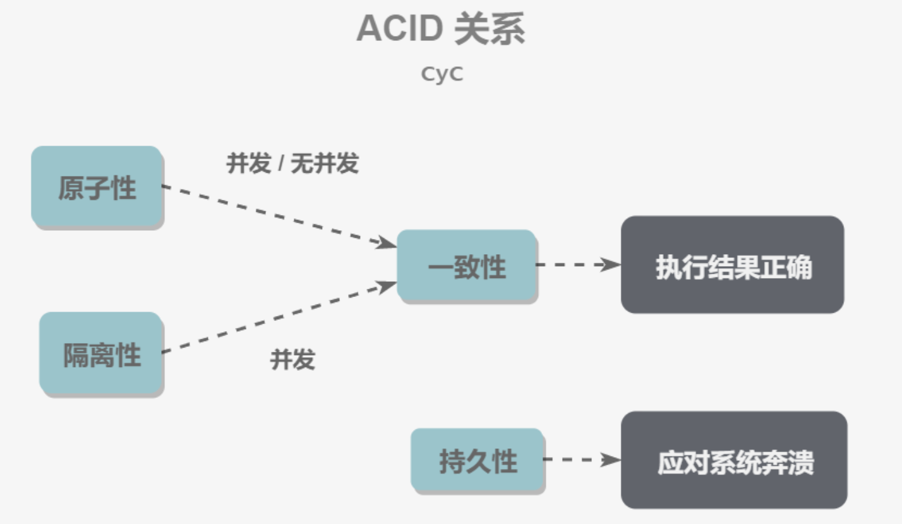

### ACID 的实现

#### 1. 原子性（Atomicity）

原子性是通过 MySQL 的 回滚日志 undo log 来实现的：当事务对数据库进行修改时，InnoDB 会生成对应的 undo log；**如果事务执行失败或调用了 rollback，导致事务需要回滚，便可以利用 undo log 中的信息将数据回滚到修改之前的样子。**

#### 3. 隔离性（Isolation）

通过封锁来实现。详见隔离级别章节

#### 2. 一致性（Consistency）

一致性指的是事务不能破坏数据的完整性和业务的一致性：

**数据的完整性：**实体完整性、列完整性（如字段的类型、大小、长度要符合要求）、外键约束等

**业务的一致性：**例如在银行转账时，不管事务成功还是失败，双方钱的总额不变。【可能依靠的就是原子性】

可能还要使用触发器之类的东西。

#### 4. 持久性（Durability）

持久性的依靠 redo log 日志实现

**redo log**

- 1.在修改数据buffer前，把更新后的值写入到 redo log 中
- 2.redo log 落地后，再去修改数据 buffer 的值
- 3.当突然断电后，数据以 redolog 中的值为准来恢复

> **redo log还是要落地才能保证持久化，跟在数据buffer修改后，直接持久化有啥不同呢？**
>
> - 1.数据buffer直接落地，磁盘是随机写，Redo log 是顺序写（**具体来说就是只记录事务对数据页做了哪些修改**）
> - 2.redo log只能追加，而且与其他事务共享，提高的写的效率
>
> 所以mysql是否持久化的关键要看redo log的持久化策略,mysql提供了三种redo log持久化策略
>
> - 0：只写 redo log buffer，每秒写一次到 OS buffer 并且同时 fsync 落，性能最高，数据一致性最差，如果 mysql 奔溃可能丢失一秒的数据
> - 1：写 redo log buffer 同时落地（每次都写到 OS buffer 并且同时 fsync 落地），性能最差，一致性最高
> - 2：写 redo log buffer 同时写入到 os buffer，但隔一秒才将 os buffer fsync 落地，性能好，安全性也高，只要 os 不宕机就能保证数据一致性（如果 mysql 崩溃了也没事）
>
> 通俗易懂-Mysql事务持久化实现之-redolog - share陈的文章 - 知乎 https://zhuanlan.zhihu.com/p/93131864

**bin log**

还有一个 bin log 保存了 SQL 语句（或者说是逻辑日志，记录的是这个语句的原始逻辑，比如 “给 id = 1 这一行的 age 字段加 1”）

+ bin log 是可以追加写入的。“追加写” 是指 bin log 文件写到一定大小后会切换到下一个，并不会覆盖以前的日志，**通常是用来存档和主复制的**。redo log 是循环写的，已经刷入磁盘的数据都会从 redo log 这个有限大小的日志文件里删除。

+ why bin log 不能用来做 crash 恢复

  当一个事务做插入/更新/删除时，其实涉及到的数据页改动非常细致和复杂，包括行的字段改动以及行头部以及数据页头部的改动，甚至b+tree会因为插入一行而发生若干次页面分裂，那么事务也会把所有这些改动记录下来到redolog中。总之，任何对数据页的改动都会记录到redolog中。 这样才能做事务恢复。因为数据库系统进程crash时刻，磁盘上面页面镜像可以非常混乱，其中有些页面含有一些正在运行着的事务的改动，而一些已提交的事务的改动并没有刷上磁盘。事务恢复过程可以理解为是要把没有提交的事务的页面改动都去掉，并把已经提交的事务的页面改动都加上去 这样一个过程。这些信息，都是binlog中没有记录的，只记录在了存储引擎的redolog中。

  > mysql 为什么不能用binlog来做crash－Save? - 赵伟的回答 - 知乎 https://www.zhihu.com/question/425750274/answer/1525436152

  对于 `InnoDB` 存储引擎而言，默认每一个事务提交时，记录`biglog` 。

**两阶段提交**（在此之前要写 undo log）

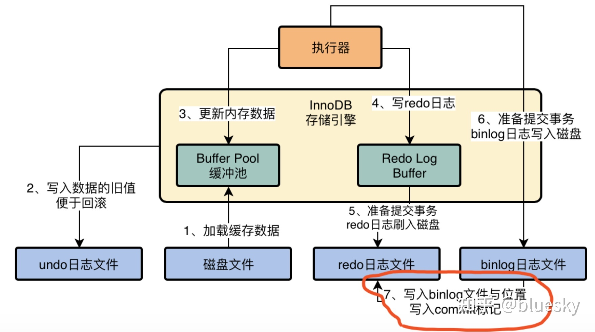

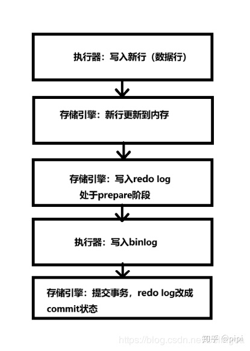

崩溃时：

1. 如果 redo log 里面的事务是完整的，也就是已经有了 commit 标识，则直接提交
2. 如果 redo log 里面的事务处于 prepare 状态，则判断对应的事务 binlog 是否存在并完整
   - a. 如果 binlog 存在并完整，则提交事务；
   - b. 否则，回滚事务。
     - 因为 binlog 还没有写入，之后从库进行同步的时候，无法执行这个操作，但是实际上主库已经完成了这个操作，所以为了主备一致，在主库上需要回滚这个事务

但是这个 buffer 里的数据是旧的啊，会有一个线程随即将 buffer 中的数据写回磁盘，崩溃的时候磁盘里的数据可能是旧的啊。没关系，因为重启之后，会根据 redo 日志恢复之前提交的事务做过的修改到内存里去，然后等适当时机，IO 线程自然还是会把这个修改后的数据刷到磁盘上的数据文件里去的。

## 并发一致性问题

在并发环境下，事务的隔离性很难保证，因此会出现很多并发一致性问题。

### 丢失修改

丢失修改指一个事务的更新操作被另外一个事务的更新操作替换。

例如：T<sub>1</sub> 和 T<sub>2</sub> 两个事务都对一个数据进行修改，T<sub>1</sub> 先修改并提交生效，T<sub>2</sub> 随后修改，T<sub>2</sub> 的修改覆盖了 T<sub>1</sub> 的修改。

> **T1 对 A 的修改丢失了**，T1 在提交前，**其所维护的 A 被别人修改了**，这样 **T1 内部可能会出问题**
>
> 这和所谓的银行转账，账户余额100，两个线程先判断再各扣50, 100，最后导致余额 -50 **不一样**。对于丢失修改，应该指的是，第一个事务扣 50，第二个事务扣款 100，结果最后余额是 0 而不是 -50。

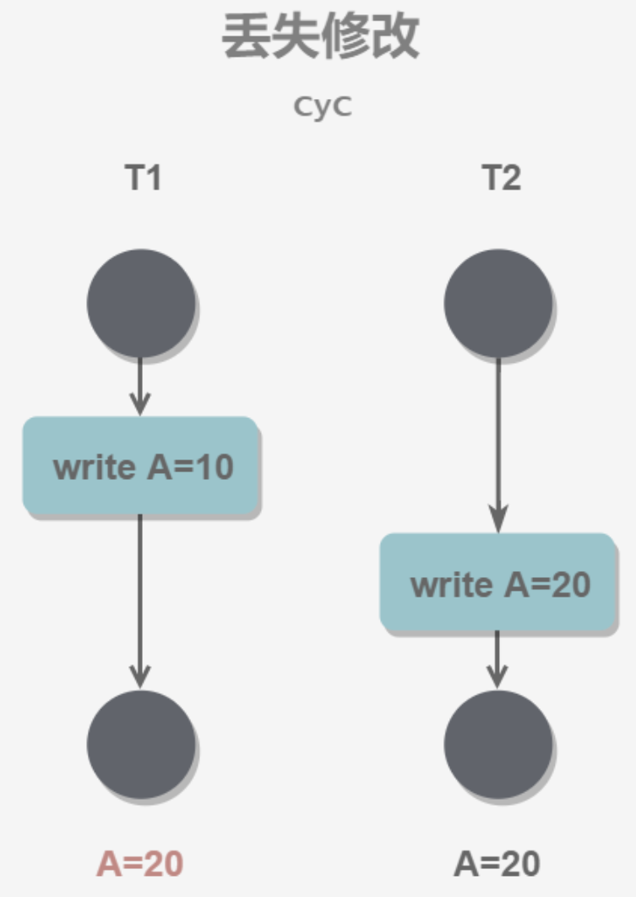

### 读脏数据

读脏数据指在不同的事务下，**当前事务可以读到另外事务未提交的数据**。例如：T<sub>1</sub> 修改一个数据但未提交，T<sub>2</sub> 随后读取这个数据。**如果 T<sub>1</sub> 撤销了这次修改，那么 T<sub>2</sub> 读取的数据是脏数据**。

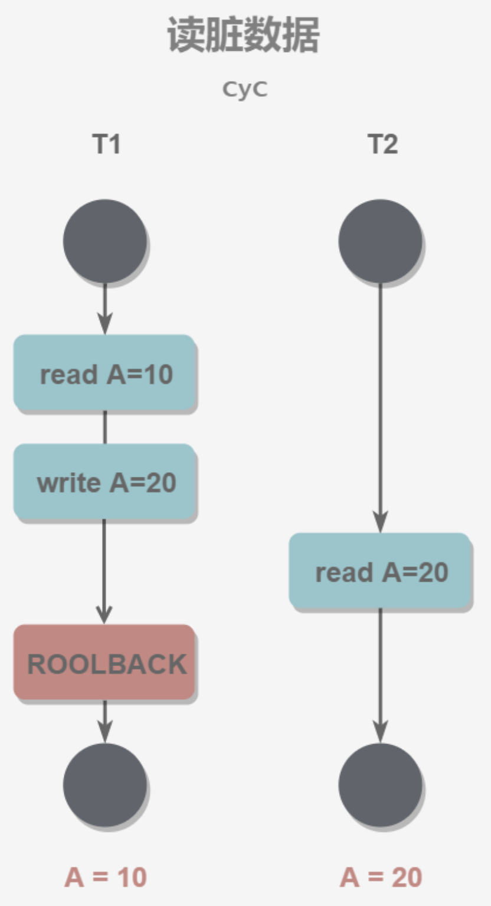

### 不可重复读

不可重复读指在**一个事务内**多次**读取同一数据的结果不一样**。【因为其他事物执行了 **update ** 操作】

在这一事务还未结束前，另一事务也访问了该同一数据并做了修改，由于第二个事务的修改，第一次事务的两次读取的数据可能不一致。

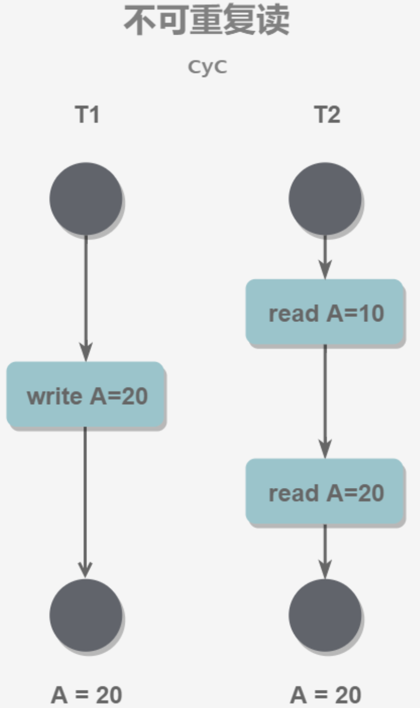

### 幻影读

> https://dev.mysql.com/doc/refman/8.0/en/innodb-next-key-locking.html
>
> The so-called phantom problem occurs within a transaction when the same query produces different sets of rows at different times.

事务 A 按照一定条件进行数据读取， 期间事务 B 插入了相同搜索条件的新数据或删除了数据，事务A再次按照原先条件进行读取时，发现了事务B 新插入的数据或者之前有的数据不见了，这称为幻读。幻读会进而导致 范围查询、计数、取最大最小值等操作出现错误。

【因为其他事物执行了 **add or delete** 操作】

T<sub>1</sub> 读取某个范围的数据，T<sub>2</sub> 在这个范围内插入新的数据，T<sub>1</sub> 再次读取这个范围的数据，此时读取的结果和和第一次读取的结果不同。

> 即使加行锁也没用，加行锁只能保证现有数据不被修改，但锁不住新加的数据。（数据课上说，可以往索引上加锁来解决，但这要求有索引的存在啊）

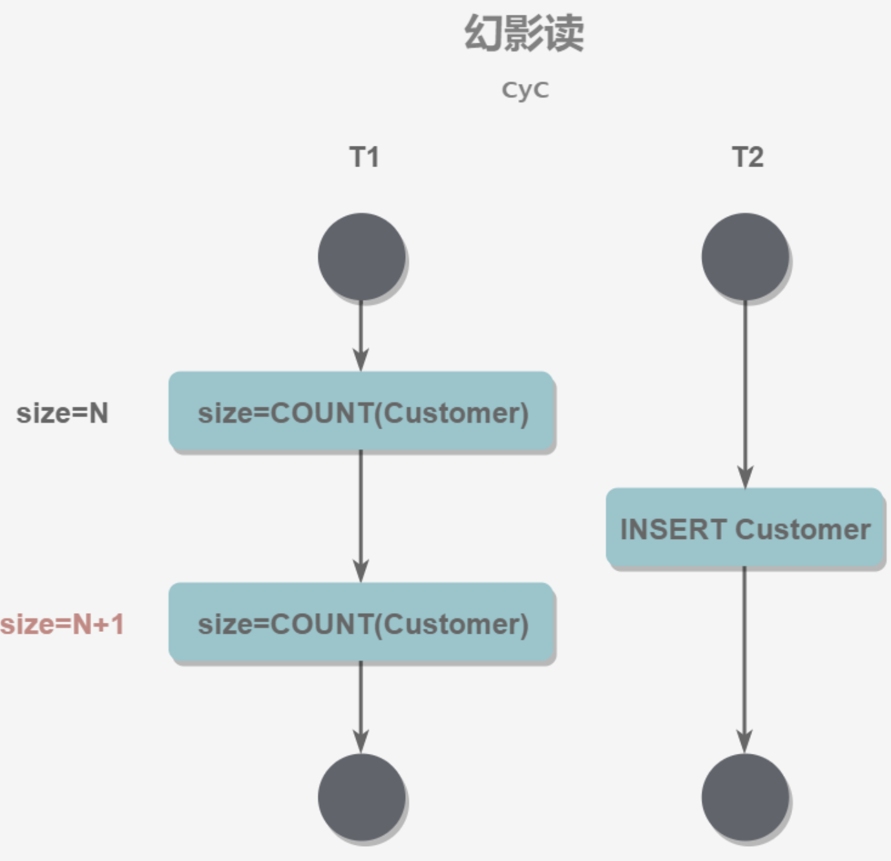

### HOW TO HANDLE

产生并发不一致性问题的**主要原因是破坏了事务的隔离性**，解决方法是通过**并发控制**来保证隔离性。并发控制可以**通过封锁**来实现，但是封锁操作需要用户自己控制，相当复杂。

数据库管理系统提供了事务的隔离级别，让用户以一种更轻松的方式处理并发一致性问题【看你容忍到什么程度？采用不同的隔离级别会容忍不同的并发一致性问题】。

## 事务的隔离级别

### 未提交读（读到未提交的数据）（READ UNCOMMITTED）

事务中的修改，即使没有提交，对其它事务也是可见的。【可能读到脏数据】

### 提交读（读到提交的数据）（READ COMMITTED）

一个事务只能**读取已经提交的事务**所做的修改。换句话说，一个事务所做的修改在提交之前对其它事务是不可见的。【不会读到脏数据；但是仍然可能会有不可重复读，其他事务提交可能会篡改我正在访问的数据】

### 可重复读（REPEATABLE READ）

保证在同一个事务中多次读取同一数据的结果是一样的。

> 个人理解，读未提交肯定会导致不可重复读，反之则未必

### 可串行化（SERIALIZABLE）

强制事务串行执行，这样多个事务互不干扰，不会出现并发一致性问题。

该隔离级别需要加锁实现，因为要使用加锁机制保证同一时间只有一个事务执行，也就是保证事务串行执行。

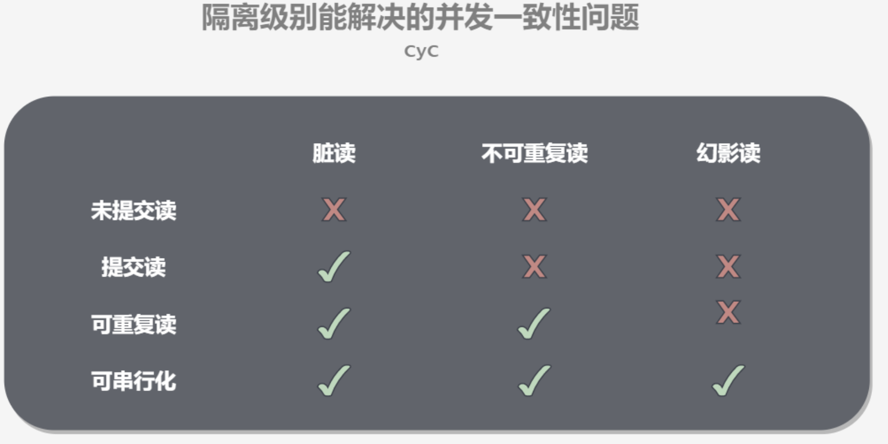

## 事务隔离的实现原理

> https://mp.weixin.qq.com/s?__biz=MzUxODAzNDg4NQ==&mid=2247496769&idx=1&sn=30990d141185303fd0c7ecf63c125b30&scene=21#wechat_redirect
>
> https://mp.weixin.qq.com/s/oOL4yradD5w73VsrfoyneA

Innodb 事务的隔离级别是由 **MVCC 和锁机制**实现的：

### MVCC

+ MVCC（Multi-Version Concurrency Control，多版本并发控制）是 MySQL 的 InnoDB 存储引擎实现事务隔离级别的一种具体方式，**它能够保存数据的历史版本，通过对数据行的多个版本管理来实现数据库的并发控制。用于实现读已提交和可重复读**这两种隔离级别。而读未提交隔离级别总是读取最新的数据行（没啥限制），无需使用 MVCC。**读序列化隔离级别单纯使用** **MVCC** **无法实现。**

+ MVCC 主要是保证读操作写操作互不干扰，不使用锁，以提升性能。

  在实际场景下，读操作往往多于写操作，如果加读写锁的话，写操作会阻塞所有读操作，性能问题很大。而 MVCC 利用了多版本的思想，在并发访问数据库时，**写操作更新最新的版本快照，而（快照）读操作去读旧版本快照，互不影响**。

+ 在 MVCC 中事务的修改操作（DELETE、INSERT、UPDATE）会为数据行新增一个版本快照。

+ 两个定义
  + 系统版本号 SYS_ID：是一个递增的数字，每开始一个新的事务，系统版本号就会自动递增。
  + 事务版本号 TRX_ID：事务开始时的系统版本号。

#### 所用到的结构

##### 数据表中的隐藏项目

数据库中的每行数据，除了我们肉眼看见的数据，还有几个**隐藏字段**（前三个和 MVCC 有关）

- `trx_id`：6byte，**最近**修改（修改/插入）这一行的事务ID
- `roll_pointer`（版本链）：7byte，**回滚指针**，指向**本行记录**的**上一个版本**（存储于rollback segment里）
- `删除 flag` ： 记录被删除并不代表真的删除，而是删除 flag 变了。这样 DELETE 可以看成是一个特殊的 UPDATE，会将 DEL 字段设置为 1。
- `row_id`：6byte，当表没有主键的时候，InnoDB 会生成一个 隐含的自增 ID 作为主键，并且在其上产生一个聚簇索引。

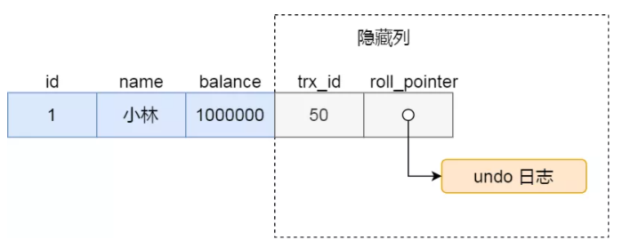


##### Undo 日志

MVCC 的多版本指的是多个版本的快照，快照存储在 Undo 日志中，该日志通过回滚指针 ROLL_PTR 把一个数据行的所有快照连接起来。

INSERT、UPDATE、DELETE 操作会创建一个日志，并将事务版本号 TRX_ID  写入。

> 例如在 MySQL 创建一个表 t，包含主键 id 和一个字段 x。我们先插入一个数据行，然后对该数据行执行两次更新操作。
>
> ```sql
> INSERT INTO t(id, x) VALUES(1, "a");
> UPDATE t SET x="b" WHERE id=1;
> UPDATE t SET x="c" WHERE id=1;
> ```
>
> 因为没有使用 `START TRANSACTION` 将上面的操作当成一个事务来执行，根据 MySQL 的 AUTOCOMMIT 机制，每个操作都会被当成一个事务来执行，所以上面的操作总共涉及到三个事务。
>
> 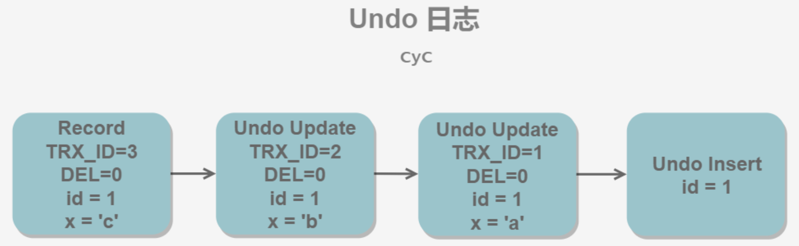

##### ReadView

> Mysql innodb 中各事务隔离级别实现原理 - 付大力的文章 - 知乎 https://zhuanlan.zhihu.com/p/277458692
>
> https://github.com/mysql/mysql-server/blob/ee4455a33b10f1b1886044322e4893f587b319ed/storage/innobase/read/read0read.cc#L426

对于**每次 SELECT**（RC 模式） 或**每次事务的第一个 SELECT**（RR 模式），MVCC 会在  SELECT 执行瞬间创建一个ReadView 结构，包含了：

+ `trx_ids`：**创建该 Read View 时**当前系统**未提交的事务列表**，（**不包含创建事务的 ID**）

  > ```cpp
  > /** Set of RW transactions that was active when this snapshot
  >   was taken */
  > ```

  > 事务 k 的 `trx_ids` 可能会有事务 k+1, k+2, ... 。因为出现事务 K 中出现 SELECT 的地方可能晚于事务 k+1, k+2, ... 的创建 

+ `min_trx_id`：创建 Read View 时当前数据库中**未提交的事务中最小的事务 id**（即 `trx_ids` 中的最小值）

+ `max_trx_id `：创建 Read View 时当前数据库中**应该给下一个事务的 id 值**

  > 所有事务最大的 ID + 1，不是 `trx_ids`中的最大值 + 1，因为编号大的事务可能已经提交了。

+ `creator_trx_id `：**创建该 Read View 的事务的事务 id**

#### MVCC 如何判断当前版本数据是否可用，应该用哪一版本？

在进行 **SELECT 操作**时，根据数据行快照的 `trx_id` 与 `min_trx_id` 和 `max_trx_id ` 之间的关系，从而判断数据行快照是否可以使用：

+ `trx_id = min_trx_id` ：表示**该数据行快照**是我自己修改的，那读自己该过的东西显然合理

+ `trx_id < min_trx_id` ：表示**该数据行快照**是在当前**所有未提交事务之前**进行更改的，因此可以使用。【我读旧的快照，不会受到新的快照的感染】

+ `trx_id > max_trx_id` ：表示**该数据行快照**是在创建该 Read View 的事务启动之后被更改的，因此不可使用。【读一个之后启动的事物创建的快照，可能会出现不可重复读的现象，也有可能出现读未提交】

  > 现有结构无法判断新的时候是不是读未提交的，因为未来的事物不在 `trx_ids` 中。我们只能假设其是未提交的，所以会造成读未提交和不可重复读。

+ `min_trx_id <= trx_id <= max_trx_id`：该数据可能是未提交事务修改的，也可能不是

  要**保证不会读到未提交的事物相关的数据**。所以如果 `trx_id ` 不在 `trx_id ` 中，那我不会读到未提交是事务，就可以用。如果 `trx_id ` 在 `trx_id ` 中，就不能用，只能往前找旧的快照。

> 简单一句话说明：凡是小于未提交事务最小值，不包含在未提交事务里面的，刚好等于当前事务的，都可以查询最新值。其他任何情况都要一直递归查询undo 日志，直到符合这三个条件其一为止。（未提交事务最小值感觉像一个缓存，省的遍历未提交事务列表来确定这一个快照对应的事务有没有提交）

对于 RR 而言：由于要求可重复读，为了防止我两次读之间，有一个事务修改了数据并且提交了，导致我读到了不一样的数据，所以我每次的 Read View 不应该改变。因此，每次事务的第一个 SELECT 创建 Read View

对于 RC 而言：我不要求可重复读，只要保证我读到的是已经提交的就可以了，所以不需要保存第一次 SELECT 的 Read View，而是每次 SELECT 的时候创建一个新的 Read View

#### 快照读、当前读、和幻读的问题

##### 1. 快照读

MVCC 的 SELECT 操作是快照中的数据，不需要进行加锁操作。

```sql
SELECT * FROM table ...;
```

##### 2. 当前读

MVCC 其它**会对数据库进行修改的操作（INSERT、UPDATE、DELETE）需要进行加锁操作**，从而读取最新的数据。可以看到 MVCC 并不是完全不用加锁，而只是避免了 SELECT 的加锁操作。

在进行 SELECT 操作时，可以强制指定进行加锁操作。以下第一个语句需要加 S 锁，第二个需要加 X 锁。

```sql
SELECT * FROM table WHERE ? lock in share mode;
SELECT * FROM table WHERE ? for update;
```

##### 3. 幻读
> 关于幻读，可重复读的真实用例是什么？ - 湾区极客的回答 - 知乎 https://www.zhihu.com/question/47007926/answer/1523900737
>
> 跟他有点不一样，我是 add，它是 update。它的 update 也是有道理的。因为如果修改的是主键 ID，mysql 的逻辑是以 insert + delete 完成的。但是 delete   的那条记录对于事务 A 是不可见的，要通过它往前找到可读的记录，所以会读到旧的主键 ID 。

**MVCC 实现 RR 后，如果该事务只执行快照读，就不会出现幻读。但是一旦中途混入了当前读，就会有问题。**

例如，当前表中只有一行，列 col_a 的值为 1

事务 A 先读了一遍，此时创建了本事务的 Read View。不管事务 B 如何折腾（比如 B 新增了一行，col_a 对应的值是 2），只要事务 A 是快照读，就会一直按照这个 Read View 正常读取快照。

但是如果在事务 B 新增且提交之后，事务 A 产生了一次当前读，就会篡改这个新数据的 `trx_id`，导致 A 再读的时候居然读到了。

> update 带来的读是当前读
>
> + 比如 update a = a + 1 读 a 是当前读
> + update ...where ... 中 where是当前读

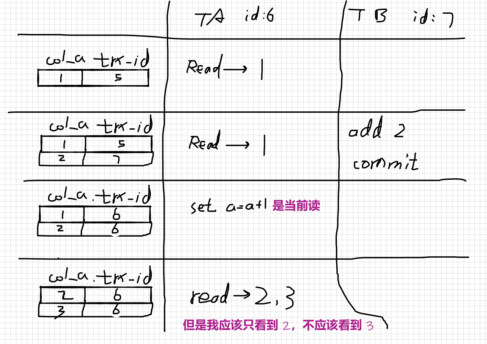

因此，如果事务中有当前读，MVCC RR 是不够的，需要新的帮助：`Next-Key Locks`。临键锁 `Next-Key` = 记录锁 `Record Locks ` + 间隙锁 `Gap Locks`，**不仅锁定一个记录上的索引，也锁定索引之间的间隙。**

### 锁（和封锁协议）解决并发一致性问题

#### 封锁协议

##### 一级封锁协议【可防止丢失修改】

+ 做法：修改对象之前必须加 X 锁，直到事务结束才能释放。
+ 好处：可防止丢失修改。

##### 二级封锁协议【避免了读脏数据】

+ 做法：在一级锁的基础上**，读取数据之前必须先对其加 S 锁，读完后即可释放 S 锁。**

> 事务 T1 对 C 进行修改，加 X 锁；事务 T2 想读C，加 S 锁，这个时候因为已经有 X 锁，无法加锁。直到 T1修改完后，释放 X 锁，才可以加

　　S锁。

+ 好处：避免了读脏数据。

##### 三级封锁协议【解决不可重复读的问题】

+ 做法：在一级锁的基础上**，读取数据之前必须先对其加 S 锁，直到事务结束才释放。**

+ 好处：解决了不可重复读的问题。

  > 出现重复读的情况：如果仅仅采用二级封锁协议，事务 T1 对 A 读数据之前，加 S 锁，然后读完再释放。然后事务 T2 对 A 加 X 锁，修改了 A，T2 事务结束释放 X 锁。然后 T1 再次读 A，已经不能读到之前的数据了。

#### Next-Key 锁机制【解决当前读下的幻影读】

对于涉及到区间查询的操作（包括计数，最值等），加上 record lock 和 gap lock，阻止可能的插入、删除、更新操作。

#### 两段锁协议【串行化】

- 在对任何数据进行读、写操作之前，事务首先要申请并获得对该数据的封锁；
- 在释放一个封锁之后，事务不再申请和获得任何其他封锁。

若并发的所有事务均遵守两段锁协议，则对这些事务的任何并发调度策略都是可串行化的。

> 可串行化的：多个事务的并发执行结果与这些事务按照某个顺序顺次执行的结果相同

MySQL 的 InnoDB 存储引擎采用两段锁协议，会根据隔离级别在需要的时候自动加锁，并且所有的锁都是在同一时刻被释放，这被称为**隐式锁定**。

## 事务的其他零碎知识

1. 事务的类型

   + 扁平事务：最普通的事务。

   + 带有保存点的扁平事务：允许在事务执行过程中回滚同一事务中较早的一个状态。因为某些事务可能在执行过程中出现的错误并不会导致所有的操作都无效，放弃整个事务不合乎要求，开销太大。

   + 链事务：

     带有保存点的扁平事务，当发生系统崩溃是，所有的的保存点都将消失，因为其保存点是易失的，这意味着当进行恢复时，事务需要从开始处重新执行，而不能从最近的一个保存点继续执行。

     链事务的思想是：在提交一个事务时，释放不需要的数据对象，将必要的处理上下文隐式地传给下一个要开始的事务，**提交事务操作和开始下一个事务操作 将合并为一个原子操作**，这意味着下一个事务将看到上一个事务的结果，就好像一个事务中进行的一样

   + 嵌套事务

   + 分布式事务

2. mysql 事务可以嵌套吗？

   > （MySQL官方文档13.3.3 Statements That Cause an Implicit Commit）

   事务不能嵌套，这是由于START TRANCACTION语句会隐式地执行commit。

   但对于 innoDB 来说，可以利用 Savepoint 功能模拟事务嵌套，也就是在一个事务中，在想开子事务的地方定义一个保存点，想要回滚的时候回滚到这个保存点，这样在保存点和回滚操作中间就模拟出了一个原子性的事务。

3. 数据库的死锁和解决

   **死锁**

   1. 一个用户A 访问表A(锁住了表A),然后又访问表B；另一个用户B 访问表B(锁住了表B)，然后企图访问表A

   **死锁解决：套用死锁解决常见思路**

   1. **设置事务等待锁的超时时间**。当一个事务的等待时间超过该值后，就对这个事务进行回滚，于是锁就释放了
   2. **开启主动死锁检测**。主动死锁检测在发现死锁后，主动回滚死锁链条中的某一个事务，让其他事务得以继续执行。

4. 

## 更详细的锁

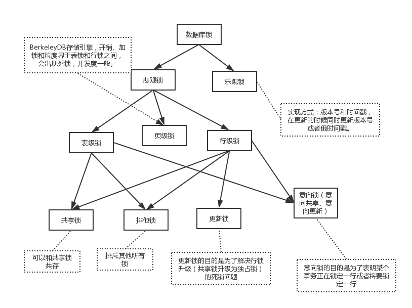

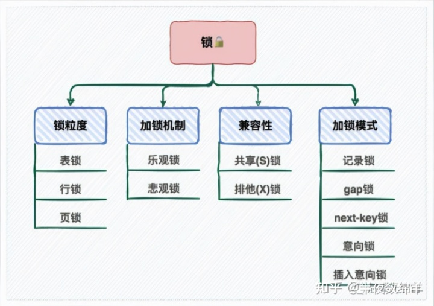

+ MySQL锁机制的基本工作原理就是，事务在修改数据库之前，需要先获得相应的锁，获得锁的事务才可以修改数据；在该事务操作期间，这部分的数据是锁定，其他事务如果需要修改数据，需要等待当前事务提交或回滚后释放锁。
+ 应该尽量只锁定需要修改的那部分数据，而不是所有的资源。**锁定的数据量越少，发生锁争用的可能就越小**，系统的并发程度就越高。但是加锁需要消耗资源，锁的各种操作（包括获取锁、释放锁、以及检查锁状态）都会增加系统开销。因此**封锁粒度越小，系统开销就越大**。


### 按锁的使用策略划分：乐观锁、悲观锁

+ 乐观锁（乐观并发控制）：在访问数据之前，默认不会有其他事务对此数据进行修改，**不会对操作的数据进行加锁**（这使得多个任务可以并行的对数据进行操作），只有到数据**提交的时候**才通过一种机制来**验证数据是否存在冲突**

  > 场景：假设有A、B两个用户同时各购买一件 id=1 的商品，用户A获取到的库存量 V 为 1000，用户B获取到的库存量 V 也为 1000，用户A完成购买后修改该商品的库存量为 999，用户B完成购买后修改该商品的库存量为 999，此时库存量数据产生了不一致。
  >
  > + 方案一：CAS
  >
  >   CAS(V，E，N) 。V表示准备要被更新的变量。E表示我们提供的 期望的值。N表示新值 ，准备更新V的值。
  >
  >   比如用户 B 这里来看，检测当前库存 V 是不是 1000，如果是，就改成 999。如果发生冲突，就重新获取 V 再重新执行（重新获取库存量再减少库存）。
  >
  >   CAS 总是认为自己能够操作成功，所以操作失败的线程将会再次发起操作，而不是被OS挂起。但是**对多个共享变量操作时，循环CAS就无法保证操作的原子性，不得不考虑加锁**。
  >
  > + 方案二：加版本号，然后进行版本号的对比方式实现） 
  >
  >   还是上面那个例子。原来 V 的版本为 1，用户 A 和 B 分别都进来。用户 A 修改了 V，将 V 的数据版本变为 2。然后检查数据库记录的版本，是 1，所以正常提交，把 V 的版本号变成 2。用户 B 修改了 V，将 V 的数据版本变为 2。然后检查数据库记录的版本，居然也是 2，那就不能提交，需要重新获取 V 重新计算。
  >
  > 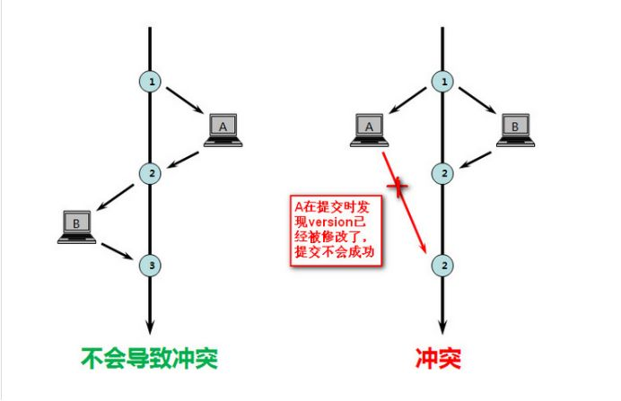

+ 悲观锁：基于一种悲观的态度类来防止一切数据冲突，**在修改数据之前把数据锁住，然后再对数据进行读写**，在它释放锁之前任何人都不能对其数据进行操作。

### 按锁的粒度划分：表级锁、行级锁、页级锁

+ 表级锁：对当前操作的**整张表**加锁，实现简单，**加锁快**，**不死锁**，但并发能力低。【适合于以查询为主，只有少量按索引条件更新数据的应用，如 Web 应用】

+ 行级锁：**只针对当前操作的行进行加锁**。行级锁能大大减少数据库操作的冲突。其加锁粒度最小，并发度高，但加锁的**开销也最大，加锁慢，会出现死锁**。【适合于有大量按索引条件并发更新数据，同时又有并发查询的应用，如一些在线事务处理系统。】

  > 为啥会死锁？
  >
  > 为啥开销大？

+ 页锁：开销和加锁速度介于表锁和行锁之间；会出现死锁；锁定粒度介于表锁和行锁之间，并发度一般【BDB，BerkeleyDB，没怎么听说过】

  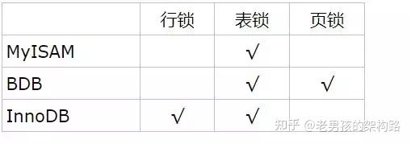

### 按锁的级别类型划分：共享锁（S锁）、排他锁（X锁）、意向锁

#### 共享锁

又被称为读锁，其他用户可以并发读取数据，但**其他任何事务**都不能获取数据上的**排他锁**，直到已释放所有共享锁。

#### 排他锁

又称为写锁，若事务 T 对数据对象A加上X锁，则只允许 T 读取和修改A，**其它任何事务**都不能再对 A 加**任何类型的锁**，直到 T 释放 A 上的锁。

> Innodb 同时支持行锁和表锁。但行锁和表锁的同时存在会发生冲突，如 A 申请了行共享锁，而 B 再申请表排他锁。这时 B 不仅需要查看是否已经存在其他表锁，以及逐个查看是否存在行锁，效率低。（用意向锁解决）

#### 意向锁

使用意向锁（Intention Locks）可以更容易地支持多粒度封锁。

在存在行级锁和表级锁的情况下，事务 T 想要对表 A 加 X 锁，就需要先检测是否有其它事务对表 A 或者表 A 中的任 意一行加了锁，那么就需要对表 A 的每一行都检测一次，这是非常耗时的。

意向锁在原来的 X/S 锁之上引入了 IX/IS，IX/IS 都是表锁，用来表示一个事务想要在表中的某个数据行上加 X 锁或 S 锁。有以下两个规定：

+ 一个事务在获得某个数据行对象的 S 锁之前，必须先获得表的 IS 锁或者更强的锁
+ 一个事务在获得某个数据行对象的 X 锁之前，必须先获得表的 IX 锁

通过引入意向锁，事务 T 想要对表 A 加 X 锁，只需要先检测是否有其它事务对表 A 加了 X/IX/S/IS 锁，如果加了就表 示有其它事务正在使用这个表或者表中某一行的锁，因此事务 T 加 X 锁失败。

> 任意 IS/IX 锁之间都是兼容的，因为它们只是表示想要对表加锁，而不是真正加锁；
>
> S 锁只与 S 锁和 IS 锁兼容，也就是说事务 T 想要对数据行加 S 锁，其它事务可以已经获得对表或者表中的行的 S 锁。

### 索引上的锁

#### Record Locks

锁定一个记录上的索引，而不是记录本身。 如果表没有设置索引，InnoDB 会自动在主键上创建隐藏的聚簇索引，因此 Record Locks 依然可以使用。

#### Gap Locks

锁定索引之间的间隙，但是不包含索引本身。例如当一个事务执行以下语句，其它事务就不能在 t.c 中插入 15。

```sql
SELECT c FROM t WHERE c BETWEEN 10 and 20 FOR UPDATE;
```

> for update 仅适用于 InnoDB，且必须在事务块 (BEGIN/COMMIT) 中才能生效。在进行事务操作时，通过 “for update” 语句，MySQL 会对查询结果集中每行数据都添加排他锁，其他线程对该记录的更新与删除操作都会阻塞。排他锁包含行锁、表锁。

#### Next-Key Locks

它是 Record Locks 和 Gap Locks 的结合，不仅锁定一个记录上的索引，也锁定索引之间的间隙。用来解决幻影读的问题【不能新增数据了，不会导致同一事物中相同操作下查询到的集合的改变，即使是当前读】

### 数据库引擎的实现

#### 不同引擎支持不同的锁

+ InnoDB 存储引擎支持行级锁和表级锁，默认情况下使用行级锁，但**只有通过索引进行查询数据，才使用行级锁**，否就使用表级锁。（因为行锁基于索引实现）

+ MyISAM 和 MEMORY 存储引擎采用的是表级锁

  > Memory存储引擎将所有数据都保存在内存，不需要磁盘 IO。支持哈希索引，因此查找速度极快。Memory 表使用表级锁，因此并发写入的性能较低。

+ BDB 存储引擎使用的是页面锁，但也支持表级锁。

#### InnoDB 的锁

InnoDB 的锁一共有：

+ 行的共享、排他锁
+ 表的意向共享、意向排他锁
+ 表的共享、排他锁
+ 索引上的锁
  + 记录锁
  + 间隙锁
  + 他们组合成的 临键锁


##### InnoDB 的行锁

InnoDB 的行锁有共享锁和排它锁。InnoDB 的**行锁是通过给索引上的索引项加锁来实现的**。

对于 update，delete，insert 操作，InnoDB 会自动给涉及的数据行加排他锁；对于普通（快照读）SELECT语句，InnoDB 不会加任何锁。

##### InnoDB 的表锁和意向锁

**表锁**：挺普通的没啥好说的

**意向锁是一种表级锁，**分为读意向锁（IS锁）和写意向锁（IX锁）。当事务要在记录上加上行锁时，则先在表上加上对应的意向锁。之后事务如果想进行锁表，只要先判断是否有意向锁存在，存在时则可快速返回该表不能启用表锁，否则就需要等待。这样比较提高效率。

##### InnoDB 索引上的锁

+ 记录锁：锁定一个记录上的索引，而不是记录本身。当使用唯一索引，且记录存在的精准查询时，使用记录锁。

+ 间隙锁：锁定索引之间的间隙，但是不包含索引本身。

  当使用范围查询而不是精准查询进行检索数据，并请求共享或排它锁时，InnoDB 会给符合范围条件的已有数据记录的索引项加记录锁，对于键值在条件范围内但并不存在的记录，叫做间隙(GAP)，在索引上加间隙锁。

+ 临键锁：上述两个的结合
