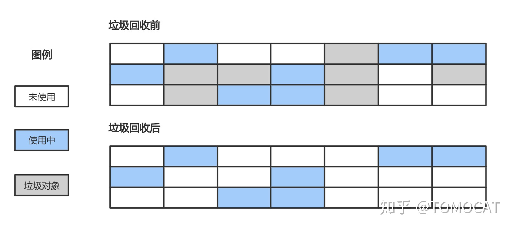
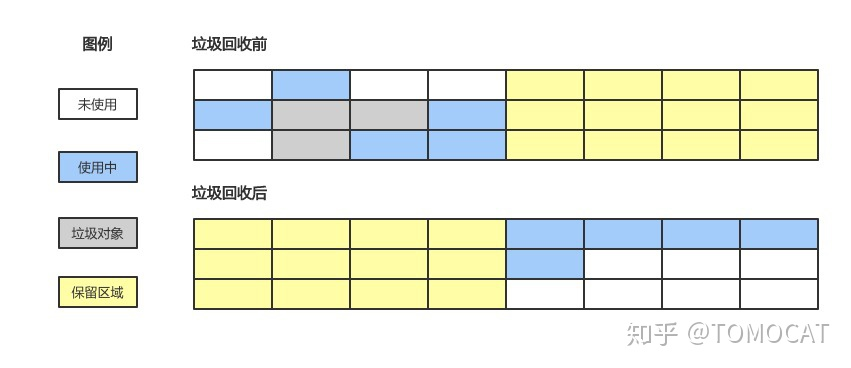
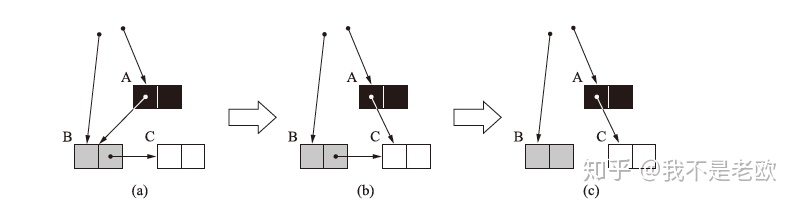
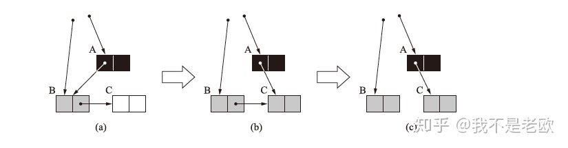
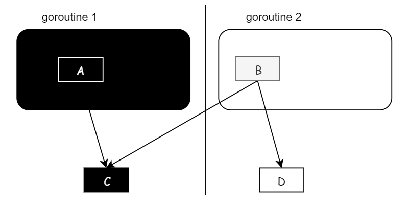
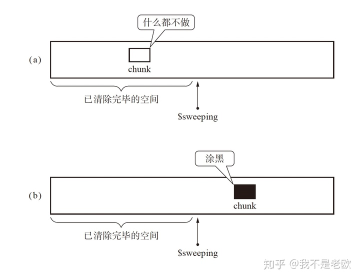

# 垃圾回收

参考：

+ 图示Golang垃圾回收机制 - TOMOCAT的文章 - 知乎 [https://zhuanlan.zhihu.com/p/297177002](https://zhuanlan.zhihu.com/p/297177002)
+ 从垃圾回收解开Golang内存管理的面纱之三垃圾回收 - 我不是老欧的文章 - 知乎 [https://zhuanlan.zhihu.com/p/53928921](https://zhuanlan.zhihu.com/p/53928921)

## 自动垃圾回收与手动垃圾回收

C、CPP 手动向操作系统申请和释放内存，极容易忘记释放自己申请的内存或释放前程序出错，错过释放指令。

Go、JAVA 等采取的都是自动垃圾回收方式，程序员只需要负责申请内存，垃圾回收器会 周期性 释放 结束生命周期的变量 所占用的内存空间。

> 为什么 cpp 没有自动 GC 呢？有很多现实原因和历史原因，其中一个是，cpp 支持复杂的指针运算，若引入自动回收则很麻烦，例如：
>
> ```cpp
> int *p = new int;
> p += 10; // 指针偏移, 原来p指向的内存不再被引用
> // 原来p指向的内存可能被回收
> p -= 10; // 偏移为指针p初始指向的位置
> *p = 10; // 如果p指向的内存被回收的话, 那么这里就会出现野指针的问题
> ```
>
> Golang 没有 cpp 这种对指针偏移的操作，便于实现自动的垃圾回收功能

## 垃圾回收目标

- 无内存泄漏：减少防止程序员未及时释放导致的内存泄漏，垃圾回收器会识别并清理内存中的垃圾
- 自动回收无用内存：不需要显式调用即可自动清理内存垃圾
- 内存整理：如果只是简单回收无用内存，那么堆上的内存空间会存在较多碎片而无法满足分配较大对象的需求，因此垃圾回收器需要重整内存空间，提高内存利用率

## 一些自动GC的回收策略

1. 引用计数

   为每个对象维护一个计数器，当该对象被其他对象引用时加一，引用失效时减一，当引用次数归零后即可回收对象。使用这类方法的语言包括 python 和  C++ 标准库中的 std::shared_ptr 等。

   缺点：

   + 无法解决循环引用
   + 时间和空间成本较高：一方面是因为每个对象需要额外的空间存储引用计数器变量，另一方面是在栈上的赋值时修改引用次数时间成本较高

2. 标记清除算法、标记复制算法、标记整理算法

   + 标记清除算法：记录需要回收的垃圾对象，在标记完成后回收垃圾对象的内容空间。会产生大量内存碎片。

     

   + 标记复制算法：将内存分成大小相同的两块，当某一块的内存使用完了之后就将使用中的对象挨个复制到另一块内存中，最后将当前内存恢复未使用的状态。内存利用率较低，复制对象开销也挺大的。

     

   + 标记整理算法：该方法首先标记出所有“可达”的对象，然后将存活的对象移动到内存空间的一端，最后清理掉端边界以外的内存。需要多次遍历内存，使得 STW 时间较长。

## 三色标记法

### 为什么需要三色标记法

标记清除方法簇会**较长的暂停**程序执行，不能异步进行 GC。stop the world，然后严格标记再清除。STW 指的是**暂停所有 goroutine**

相比传统的标记清扫算法，三色标记最大的好处是**可以异步执行**，从而可以以中断时间极少的代价来进行整个 GC。

**三色标记的核心是将长时间的stop the world变为小段的stop the world**，并利用了write barrier来辅助实现。

### 具体步骤

所有对象分为三类：

- 白色：未搜索的对象，在回收周期开始时所有对象都是白色，在回收周期结束时所有的白色都是垃圾对象
- 灰色：正在搜索的对象，但是对象身上还有一个或多个引用没有扫描
- 黑色：已搜索完的对象，所有的引用已经被扫描完


#### 第一阶段

1.  stop the world
2.  每个 processor 启动一个 mark worker goroutine 用于标记（用于第二阶段工作）
3.  启动 gc write barrier（记录一下后续在进行 marking 时被修改的指针）
4.  找到所有 roots（stack, heap, global vars）加入队列，标记为灰色
5.  start the world，进入第二阶段

#### 第二阶段

1. 从标记队列里面取出对象，标记为黑色
2. 将其指向的对象标记为灰色并加入队列
3. 重复上述过程直到队列为空

#### 第三阶段（对于插入写屏障来说）

1.  stop the world，将 gc write barrier 记录的所有修改的指针也加入标记队列进行一轮标记
2. 扫描完了以后 start the world

#### 第四阶段

到这一阶段，所有内存要么是黑色的要么是白色的，清除所有白色的即可

### 为什么需要写屏障？

因为标记阶段和用户程序是并发执行的，用户操作可能使标记的结果不正确。例：



状态为 (a) 时修改，使A 指向 C 且 B 不指向 C，上述三色标记执行过后堆内存中白色对象 C 会被当做垃圾对象清理掉，那么会导致后续对 C 的访问出错。

假设三色标记法和用户程序并发执行，那么下列两个条件**同时满足**就可能出现错误回收非垃圾对象的问题：

- 条件1：某一黑色对象引用白色对象
- 条件2：对于某个白色对象，所有和它存在可达关系的灰色对象丢失了访问它的可达路径

那么怎么解决呢？

1. 标记时停止**全局的**赋值操作，那么还是可能会引发标记阶段的 stop the world.
2. 写屏障：两种策略：插入写屏障和删除写屏障

> 因为开销问题与过于复杂，栈上和寄存器对象不能 hook，没有写屏障

#### 特别提醒

不会存在不同栈上的对象相互访问，否则会逃逸到堆上。

每个 goroutine 独有的是其内部的栈空间，堆空间是共享的。

#### 插入写屏障（Go1.5）

>  知乎 https://zhuanlan.zhihu.com/p/334999060

它破坏条件1，又被称为 Dijkstra 写屏障。

```go
添加下游对象(当前下游对象slot, 新下游对象ptr) {   
  //1
  标记灰色(新下游对象ptr)   

  //2
  当前下游对象slot = 新下游对象ptr                   
}
```

算法：如果新指向的对象是白色的，直接把它标记成灰色，这样的话，新创建的对象以及黑色对象指向白色对象的情况就能被解决。



因为栈没有写屏障，所以当全部三色标记扫描之后,栈上有可能依然**存在白色对象被引用的情况**或者**栈上的黑色对象引用了堆上的白色对象**。所以要对栈重新进行三色标记扫描（如果栈上对象引用了堆上对象，会跨越过去一起扫）, 但这次为了对象不丢失, 需要 STW， 直到栈空间的三色标记结束。

Q: 如果是堆上的对象新指向了栈上的白色对象怎么办？【个人猜测：搞不好是栈逃逸（编译期），栈上变量跑到堆上了啊喂】

他的缺点：在二次扫描栈上的对象时需要 STW。

#### 删除写屏障（好像没用过）

也叫基于快照的写屏障方案，又称为 YUASA 写屏障。

必须在起始时，STW 扫描整个栈（注意了，是所有的 goroutine 栈），栈上对象全黑，下一级堆上相关对象全灰，保证**所有栈上对象及其相关的堆上对象**都处于保护下。这个叫快照。

```text
// 添加下游对象的函数, 当前下游对象slot, 新下游对象ptr
func YuasaWritePointer(slot *unsafe.Pointer, ptr unsafe.Pointer) {
    // 1) 将当前下游对象标记为灰色
    shade(*slot)
    // 2) 当前下游对象slot = 新下游对象ptr
    *slot = ptr
}

// 场景一：B被A删除, 将B标记为灰色
A.添加下游对象(B, nil)
// 场景二：B被A删除, 将B标记为灰色
A.添加下游对象(B, C)
```

避免了前面提到的条件2，防止丢失灰色对象到白色对象的可达路径。一句话解释就是当删除对象 A 指向对象 B 的指针时，那么将被删除的对象标记为灰色。

它不需要在一轮三色标记后对栈空间上的对象进行重新扫描。缺点在于它悲观地认为所有被删除的对象都可能被黑色对象引用，因此不删除他们。

Q：如果是栈上的对象删除了对堆上对象的引用怎么办？【在起始扫描的时候，已经把那个堆上对象变成灰色了】

Q：扫描的时候出现了新对象怎么办【可能是当成黑色】

**思考问题**：如果不 STW 所有 goroutine 的栈，而是一个栈一个栈的快照（一个栈一个栈的扫黑），这样也没有对全局 goroutine 的 STW 了，是否可以满足要求？（这个就是当前 golang 混合写屏障的时候做的，注：虽然没有全局 goroutine 的 STW 了，但是扫描到某一个具体的栈的时候，还是要暂停这一个 goroutine 的）

【不行，在 goroutine 1 扫黑完毕之后，在 goroutine2 执行扫黑前，goroutine2 让 C 指向 D，取消 B 对 D 的引用，由于 B 在栈上没有写屏障，那么 D 就不会被标记为灰色，会被错误删除。而正确的做法是先 STW 再扫黑所有的 goroutine】[https://studygolang.com/articles/30067](https://studygolang.com/articles/30067)



#### 混合写屏障（Go1.8）

那么如果我们想要像上述那样，不需要 STW 暂定所有 goroutine，而是每次只暂停一个 goroutine，一个栈一个栈的扫呢？诶，可以，对堆上对象加上插入写屏障就行了。这样 C 在引用 D 的时候，会把 D 变灰。具体而言：

+ 一个栈一个栈扫描的时候，只暂停当前这个 goroutine，将栈上的对象进行扫描，**可达对象**（包括关联的堆上对象）全部标记成黑色
+ GC期间，任何在栈上创建的新对象，均标记黑色
+ 被删除的对象标记为灰色
+ 被添加的对象标记为灰色

只需要在开始时并发扫描各个goroutine的栈，使其变黑并一直保持，这个过程不需要STW暂定所有 goroutine，而标记结束后，因为栈在扫描后始终是黑色的，也无需再进行re-scan操作了，减少了STW的时间。

### 清除阶段时，清楚协程和应用协程同时跑会有问题吗

1. 引用变化会引起清除掉活跃的对象吗？想象下什么情况下可能会出现清除活跃对象呢，需要被清除的对象又重新被引用了才可能会出问题。但如果它本来就要被清除，**在全部标记完成的情况下，就不会被找到了**，那怎么引用它呢？如果它能通过某个方式找到这个对象，那么在之前扫描的时候一定会把它最后标记为黑色的。所以不会出问题。

2. 如果在清除阶段出现新的对象呢？清除阶段是扫描整个内存，其实我们是可以知道当前清除到什么位置，那么我们创建的新对象判定下，如果新对象的指针位置已经被扫描过了，那么就不用作任何操作，不会被误清除，如果在当前扫描的位置的后面，就直接把该对象的颜色标记为黑色，这样就不会被误清除了。


