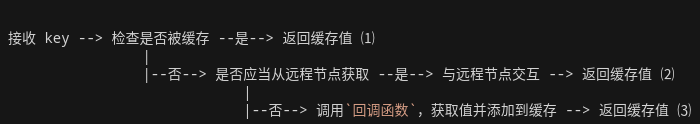

# 分布式缓存
本内容是学习 7days golang - 分布式缓存 项目的记录与笔记。[原项目](https://github.com/geektutu/7days-golang/tree/master/gee-cache)是一个非常棒的项目。

# Day 0: 分布式缓存 的 why what how
缓存目的：第一次请求时将一些耗时操作的结果暂存，以后遇到相同的请求，直接返回暂存的数据。

缓存中最简单的莫过于存储在内存中的键值对缓存了。很容易想到使用 map 实现，那直接创建一个 map，每次有新数据就往 map 中插入不就好了，这不就是键值对缓存么？这样做有什么问题呢？
1. 内存不够  
   删掉一些？用什么策略去删除呢？LRU可能是一个不错的选择。
2. 读写冲突  
   对缓存的访问，一般不可能是串行的。**map 是没有并发保护的**，应对并发的场景，修改操作(包括新增，更新和删除)需要加锁。
3. 单机性能不足  
   单台计算机的资源是有限的，计算、存储等都是有限的。随着业务量和访问量的增加，单台机器很容易遇到瓶颈。
   > 如果利用多台计算机的资源，并行处理提高性能就要缓存应用能够支持分布式，这称为水平扩展(scale horizontally)。与水平扩展相对应的是垂直扩展(scale vertically)，即通过增加单个节点的计算、存储、带宽等，来提高系统的性能，硬件的成本和性能并非呈线性关系，大部分情况下，分布式系统是一个更优的选择。

本次学习的目标功能是：
+ 单机缓存和基于 HTTP 的分布式缓存
+ LRU 的缓存策略
+ 使用锁机制防止缓存击穿
+ 使用一致性哈希选择节点，实现负载均衡
+ 使用 protobuf 优化节点间二进制通信

# Day 1: 基于 LRU 策略的缓存


cache 的存储由列表 list 承担，并保留一个 key->*Element 的 map，用于快速存取、更新、删除。当访问某个元素，将其移动至队尾，复杂度为 O(1)

列表允许值是实现了 Value 接口的任意类型，该接口只包含了一个方法 Len() int，用于返回值所占用的内存大小

# Day 2: 单机并发缓存
## 只读的 ByteView
由于希望能够存入各种类型的数据，因此我们将所有存入的数据转为 []byte 类型。又由于该数据需要为只读，因此我们进行一层封装，每次返回深拷贝之后的值。又由于其存于上节中实现的 lru list，要求实现 Value 接口，所以还需要包含方法 Len() int
> bytes 是切片，切片不会深拷贝，切片[]byte与byte数组[4]byte是不同的

## 实现 LRU Cache 的并发性
用结构体 cache 来表示一个并发缓存，其主要包含 lru 存储模块和并发访问控制锁。之后会被封装成一个 cache group,其包含回调接口 getter。 稍后会有一个 cache groups 管理一组 cache group。

!! 每个 cache 包含一个用于存储的 lru list，本 cache 的 mutex，最大容量。还需要封装 add get 两个方法。 
其中通过 sync.mutex 来完成并发处理。

## cache group
cache groups 管理了一系列 cache group，还兼顾了单机、分布式功能。

本系列作者定义了这样的 cache group 工作流程：
> 

cache group 结构：本组 cache 的 name、取源数据的回调函数、一个并发缓存。

> 为什么要将回调函数封装成接口：[https://geektutu.com/post/7days-golang-q1.html](https://geektutu.com/post/7days-golang-q1.html)
> 
> 简而言之，封装成接口之后，用户不仅可以直接传入一个匿名函数或者有名函数作为获取源信息的回调函数，还可以传入一个实现了该接口的复杂结构体（如某数据库的管理结构体）

# Day 3: HTTP 服务端
创建一个结构体实现 `ServeHTTP` 接口即可。不如创建一个类型，记录本 http 服务器的 IP：Port 和 本 cache 服务的前缀地址。

使用 strings.Split 将 URL 分割，判断是否是合法的 cache 请求并找到 cache group 和 key。

将 Header 设置为 `application/octet-stream`，以返回二进制流格式的缓存数据。

# Day 4: 一致性哈希
什么是 [一致性哈希](https://zhuanlan.zhihu.com/p/24440059)

哈希一般都是将一个大数字取模然后分散到不同的桶里，如果我们嫌桶的数量太少了，需要新增一个新桶，那么模数就发生了变化，导致所有数字的分布都变了，这就意味着哈希表的每次扩展和收缩都会导致所有条目分布的重新计算。

这个特性在某些场景下是不可接受的。比如分布式的存储系统，每个桶就相当于一个机器，文件分布在哪台机器由哈希算法来决定，几乎缓存值对应的节点都发生了改变。即几乎所有的缓存值都失效了。节点在接收到对应的请求时，均需要重新去数据源获取数据，容易引起**缓存雪崩**。
> 缓存雪崩：缓存在同一时刻全部失效，造成瞬时DB请求量大、压力骤增，引起雪崩。常因为缓存服务器宕机，或缓存设置了相同的过期时间引起。

具体步骤是：
将所有的 key 映射到 2^32 的空间中，将这些数字首尾相连看成一个环。
+ 计算节点（机器）的哈希值，放到这个环上
+ 计算 key 的哈希值，找到第一个大于等于它的节点，就是应选取的节点（机器）。

也就是说，一致性哈希算法，在新增/删除节点时，只需要重新定位该节点附近的一小部分数据，而不需要重新定位所有的节点，这就解决了上述的问题。


如果服务器的节点过少，容易引起 key 的倾斜。例如上面例子中的 peer2，peer4，peer6 分布在环的上半部分，下半部分是空的。那么映射到环下半部分的 key 都会被分配给 peer2，key 过度向 peer2 倾斜，缓存节点间负载不均。

为了解决这个问题，引入了虚拟节点的概念，一个真实节点对应多个虚拟节点。假设 1 个真实节点对应 3 个虚拟节点，那么 peer1 对应的虚拟节点是 peer1-1、 peer1-2、 peer1-3（通常以添加编号的方式实现），其余节点也以相同的方式操作。这种操作代价很小，只需要增加一个字典(map)维护真实节点与虚拟节点的映射关系即可。那么哈希步骤就变成：
+ 第一步，计算虚拟节点的 Hash 值，放置在环上。
+ 第二步，计算 key 的 Hash 值，在环上顺时针寻找到应选取的虚拟节点，例如是 peer2-1
+ 第三部，找到这个虚拟节点对应的真实节点，例如 peer2-1 对应真实节点 peer2

一致性哈希的一致性体现在，当服务器数量变化时，影响到的，（数据—服务器）对应关系变化不是全量的。（对于绝大多数数据来说，是前后一致的）

# Day 5: 分布式节点
要实现分布式节点，就势必需要节点之间的互相通信。我们可以在维护每一个 cache group 的结构 `Group` 中，加入实现了 `PeerPicker` 接口的实例，通过调用它获取实现了 `PeerGetter` 接口的实例，用于从其他 peer 远程地 Get 数据。
> 这里，`PeerPicker` 和 `PeerGetter` 用接口的形式实现，是为了预留接口，给除了 HttpPeerPicker 和 HTTPPeerGetter 之外的其他 Picker 和 Getter 预留空间。

当 CacheGroup 缓存未命中时，使用其关联的 `PeerPicker` 找到所属的 `PeerGetter`，若发现在远端，则从远端获取，否则本地获取。

定义一个 `httpGetter`，实现 `PeerGetter` 接口，用 HTTP 从远程获取数据。

给 HTTPPool 实现 `PeerPicker` 接口，通过新增一个一致性 hash 算法实例和用一个 map 保存各个真实节点相对应的 `PeerGetter`，使其能够根据 key 挑选出相对应的 `PeerGetter`。

值得注意的是，没有指定本 HTTPPool 属于哪个 group，而是作为基础组件给所有 group 共用，这也符合常理。（不过如果共用的话，难道所有 group 的 `PeerPicker` 都相同吗， 他们的 Peer 节点都相同吗？或许可以吧，不是特别通用的样子）
> 作者：group 和 HTTPPool 是解耦的，可以复用，也可以各自搭配各自的。

在某个节点上独立提供一个对外的 api 服务，用于相应用户的请求。

> 作者的一些其他细节解释：本处的实现里，从其他节点获取数据之后，没有存在本地。分布式缓存的目的是不同key缓存在不同的节点上，增加总的吞吐量。如果大家转发请求后，都再备份一次，每台机器上都缓存了相同的数据，就失去意义了。每个节点缓存1G数据，理论上10个节点总共可以缓存10G不同的数据。对于热点数据，每个节点拿到值后，本机备份一次是有价值的，增加热点数据的吞吐量。groupcache 的原生实现中，有1/10的概率会在本机存一次。这样10个节点，理论上可以缓存9G不同的数据，算是一种取舍。

# Day 6: 防止缓存击穿
首先总结一下 缓存雪崩、缓存击穿、缓存穿透
> 缓存雪崩：**多个 key** 在同一时间全部失效，大量请求打到 DB（不同 key 的多个请求和同一 key 的多个请求 都存在），引起雪崩。通常是因为缓存服务器宕机或是所有 key 设定的相同的过期时间

> 缓存击穿：**某个 key** 在过期的那一刻，这个 key 的多个请求击穿到 DB，造成 DB 瞬时负载过大

> 缓存穿透：查询一个**不存在**的 key，每次请求都会穿透到 DB，如果瞬间流量过大，导致负载过大

在这里解决的是 **缓存击穿** 的问题

参考标准库 single flight 的实现，我们定义一个结构及其所属的方法 `Do` ，对于相同的 key，无论 Do 函数被调用多少次，key 所对应的函数只会被执行一次。

```go
// call 表示某一次请求的控制结构，包含了返回值
type call struct {
	wg    sync.WaitGroup
	value interface{}
	err   error
}

// 某一组 singleflight，可以给一个 cache group 使用。针对每一个 key，控制其并发访问
type Group struct {
	mu sync.Mutex
	m  map[string]*call
}

func (g *Group) Do(key string, fn func() (interface{}, error)) (interface{}, error) {
	g.mu.Lock()

	if g.m == nil {
		g.m = make(map[string]*call)
	}

	if c, ok := g.m[key]; ok {
		g.mu.Unlock()
		c.wg.Wait()  // 如果请求正在进行，则等待
		return c.value, c.err
	}

	c := new(call)
	c.wg.Add(1)
	g.m[key] = c  // 表明这个 key 此时将会被请求
	g.mu.Unlock()

	c.value, c.err = fn()
	c.wg.Done()  // 调用结束，通知所有 wait 这个 key function 执行的协程

	g.mu.Lock()
	delete(g.m, key)  // 因为 c 是指针类型，所以即使从 map 中删除对应的键值对，也不会影响其指向的 call 的值，故这里可以继续使用
	g.mu.Unlock()

	return c.value, c.err
}
```

将需要并发使用的场景用 `Do` 包起来即可。确保了并发场景下，针对相同的 key，load 只执行一次。

# Day ７: Protobuf
学习它**暂时**没什么意义，跳过。