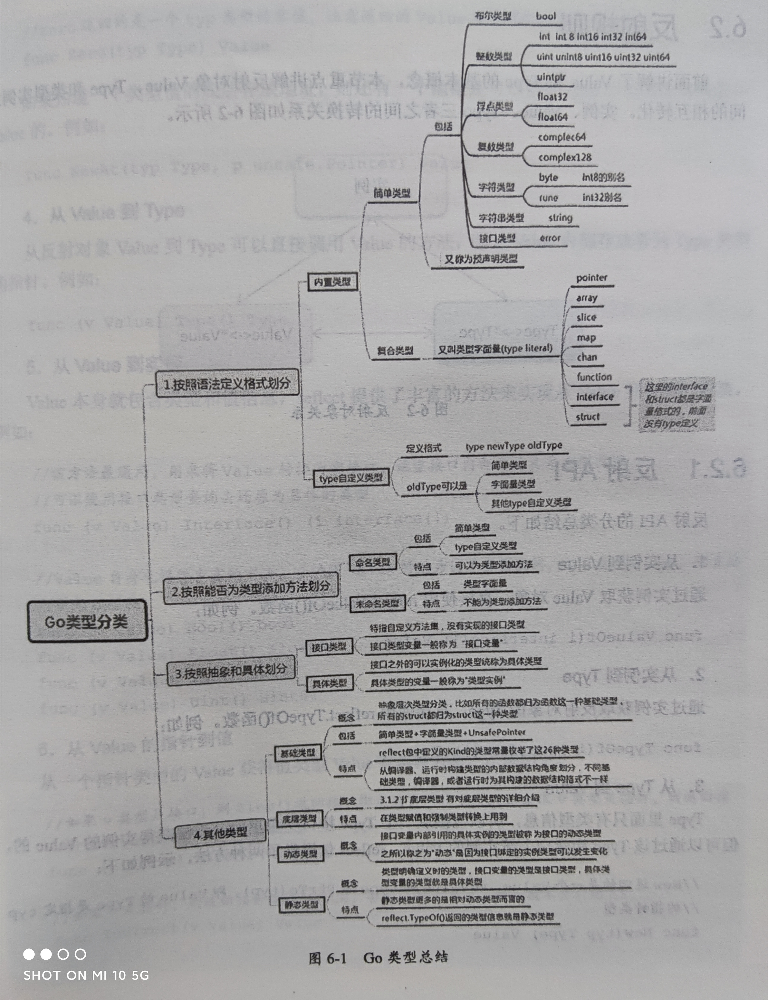
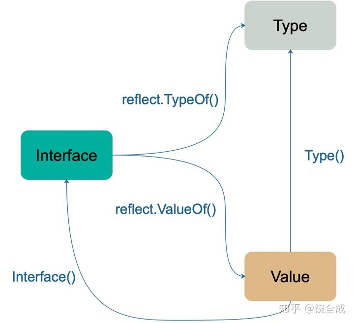

# 反射
本文部分参考了 [https://zhuanlan.zhihu.com/p/64884660](https://zhuanlan.zhihu.com/p/64884660)

反射是为了在系统运行过程中访问、检测、修改自身状态的能力。其实关注的无非就是两点：
+ 类型是什么
+ 存储的值是什么

Go 语言中，编译器和 runtime **将类型信息保存在程序中**，通过 reflect 标准库提供了一套**访问接口**。

## 反射的好处坏处
两个常见的常见：
+ 有时你需要编写一个函数，但是并不知道传给你的参数类型是什么，可能是没约定好；也可能是传入的类型很多，这些类型并不能统一表示。这时反射就会用的上了。
+ 有时候需要根据某些条件决定调用哪个函数，比如根据用户的输入来决定。这时就需要对函数和函数的参数进行反射，在运行期间动态地执行函数。

不使用反射的原因
+ 与反射相关的代码，经常是**难以阅读的**。在软件工程中，代码可读性也是一个非常重要的指标。
+ Go 语言作为一门静态语言，编码过程中，编译器能提前发现一些**类型错误**，但是对于反射代码是无能为力的。所以包含反射相关的代码，很可能会运行很久，才会出错，这时候经常是**直接 panic**，可能会造成严重的后果。
+ 反射对**性能影响还是比较大**的，比正常代码运行速度慢一到两个数量级。所以，对于一个项目中处于运行效率关键位置的代码，尽量避免使用反射特性。

## 基本概念
Go 的反射的基础是接口和类型系统。它巧妙的**借助了实例到接口的转换**。具体而言，实例被传递（值传递）给一个空接口，空接口　**eface 中的　*type 指针**实际上就包含了该实例的全部类型信息。reflect 标准库其实就是在这个数据结构之上进行访问。

### 基本数据结构和 入口函数
#### reflect.Type
类型的**公共信息**由一个结构　rtype 所描述，实际上和描述接口内部实现的　runtime 包中的　_type 是一个东西。rtype 实现了 Type 接口，通过　reflect.TypeOf() 返回一个 Type 类型的接口
```go
func TypeOf(i interface{}) Type {
    eface := *(*emptyInterface)(unsafe.Pointer(&i))
    return toType(eface.typ)
}
type emptyInterface struct {
    // emptyInterface 和 eface 实际上是一回事
    // 个人理解是，将接口变量接口 i 从 eface 转换为本包中的 emptyInterface
    typ  *rtype
    word unsafe.Pointer
}
func toType(t *rtype) Type {
    if t == nil {
        return nil
    }
    return t
}
// 调用 TypeOf 函数时，实参会先被转化为 interface{} 类型。这样，实参的类型信息、方法集、值信息都存储到 interface{} 变量里了。先将指针转换为 unsafe.Pointer，再转换为 emptyInterface 指针，最后转换成 eface
```
> 返回 Type 类型接口而不是 rtype 类型是因为
> 1. 安全起见，rtype 不应当被动态修改，而应该当成只读信息来处理，还有其他种种访问控制的缘故，总之，接口类型 Type 一定程度上阻止了不安全访问。**（因为接口对象可调用的函数取决于它的静态类型）**
> 2. 除了 rtype，不同类型可能会返回不同的类型定义，需要有一个统一的接口管理。例如：
> ```go
> type arrayType struct {
>     rtype `reflect:"array"`
>     elem  *rtype // array element type
>     slice *rtype // slice type
>     len   uintptr
> }
> ```

reflect.Type 接口的主要方法有：`Name, Kind, Implements(u Type), AssignableTo(u Type), Comparable, NumMethod, Method(i), MethodByName(string), PkgPath， Size` 等和类型有关的接口。

不同的基础类有一些专有方法，如
```
Int*, Uint*, Float*, Complex*: Bits
Array: Elem, Len
Chan: ChanDir, Elem
Func: In, NumIn, Out, NumOut, ISVariadic(可变参数)
Map: Key, Elem
Ptr: Elem
Slice: Elem
Struct: Field, FieldByName, FieldByName, FieldByNameFunc, NumField
```

对于 reflect.TypeOf(a)，传入的实参 a 有三种可能：
1. 具体类型变量：返回实例的具体类型信息
2. 未绑定实例的接口变量：返回接口的**静态类型信息（即接口自身的类型信息）**
3. 绑定实例的接口变量：返回接口的**动态类型信息（接口所绑定的实例的类型信息）**

#### reflect.Value
reflect.Value **表示实例的值的信息**，它是一个 struct，并提供了一系列访问接口。

ValueOf 函数先将 i 转换成 *emptyInterface 类型， 再将它的 typ 字段和 word 字段以及一个标志位字段组装成一个 Value 结构体，而这就是 ValueOf 函数的返回值，它包含类型结构体指针、真实数据的地址、标志位。
```go
type Value struct {
    // type of the value represented by a Value
    typ *rtype
    // 指向值的指针
    ptr unsafe.Pointer
    // flag
    flag
}

func ValueOf(i interface{}) Value {
    if i == nil {
        return Value{}
    }

   // ……
    return unpackEface(i)
}

// 分解 eface
func unpackEface(i interface{}) Value {
    e := (*emptyInterface)(unsafe.Pointer(&i))

    t := e.typ
    if t == nil {
        return Value{}
    }

    f := flag(t.Kind())
    if ifaceIndir(t) {
        f |= flagIndir
    }
    return Value{t, e.word, f}
}
```
可以通过 Value.Type() 获取到 Value 的类型信息，Value.Interface() 将把 Value 的数据当成一个空接口返回。

Value 结构体定义了很多方法，通过这些方法可以直接操作 Value 字段 ptr 所指向的实际数据（**ptr所指向的数据其实指的是，赋值给空接口时值复制的结果**，比如传递了一个 double 给空接口变量，其实是复制了一份 double，然后 eface 中的 ptr 指向了这个复制结果。因此，只有 ptr所指向的数据是一个指针时，才能控制其真正指向的数据，和反射的三大定律的第三条是一个意思）。

### 基础类型和底层类型
Type 中的 Kind 方法返回的是整数枚举值，不同的值代表了不同的基础类型。

这里的基础类型没有特别具体，可以看作是一个抽象的概念。比如，所有的　func 无论其签名如何，都是　func。struct 同理。

底层类型是针对每一个具体的类型来定义的，不同 struct 可能会有不同的底层类型。 

```go
type A struct {
    a int
}
type Aa A
type B struct {
    b int
}
```
在这里，A Aa B 的基础类型都是 struct，B 的底层类型是B自身，A 和 Aa 的底层类型都是 A。

### 类型总结


## 反射规则
反射涉及到三个概念：Value、Type、实例。
> Value 和 Type 又可以成为 反射类型对象


### 反射　API
1. 从实例到 Value
   
    `func ValueOf(i interface{}) Value`

2. 从实例到 Type

    `func TypeOf(i interface{}) Type`

3. 从Type到 Value

    Type 只有类型信息，可以通过建立一个该 Type 的实例获取其 Value
    
    `func New(typ Type) Value`, Value 的类型为 typ 指针，即 PtrTo(typ)

    `func Zero(typ Type) Type`，返回的是 typ 类型的零值。该 Value 不能寻址，值不可改变。

    若是知道一个类型值的底层存放地址，可以根据 Type 和地址恢复出 Value. `func NewAt(typ Type, p unsafe.Pointer) Value`

4. 从Value 到 Type

    Value 内部就存放着 Type. `func (v Value) Type() Type`

5. 从Value 到实例

    Value 本身就包含了类型信息和值信息。`function（v Valie) Interface() (i interface{})` 返回了 Value 对应实例的空接口，再用**接口类型查询或断言**即可恢复具体类型。

6. 从 Value 的指针到值
    指针值类型的 Value 获得值类型的 Value

    `func (v Value) Elem() Value`， 如果 v 的类型是接口，则返回接口绑定的实例的 Value, 如果 v 是指针型 Value，就返回指针值所指地点的 Value.

    ？

7. Type指针和值的相互转换

    指针类型 Type 到值类型 Type
    `t.Elem() Type`

    值类型 Type 到指针类型 Type
    `func PtrTo(t Type) Type`

    ？

8. Value的可修改性
   Value 何时可以修改？实例对象传递给接口的是一个完全的值拷贝，调用反射方法，获得的实际上是 Value 的副本，无法修改。假如穿进去的是一个指针，虽然指针值本身无法修改，但是可以通过指针访问到原始对象进行修改。判断和赋值方法如下。
    + `func (v Value) CanSet() bool`
    + `func (v Value) Set(x Value)`

    ```go
    type User struct {
        Id int
        Name string
        Age int
    }

    func main() {
        u := User{Id: 1, Name:"TDD", Age: 2}

        v := reflect.ValueOf(&u)
        
        name := "CY"
        v_name = reflect.Valueof(name)

        v.Elem().FieldByName("Name").Set(v_name)
        // 此时 u 中的 Name 字段已经变成了 “CY”
    }
    ```

### 反射三定律
1. 反射可以从接口值获得反射对象，对应上节的 1,2
2. 反射可以从反射对象获得接口值，对应上节的 5
3. 若要修改一个反射对象，则其值必须可以修改，对应上节的 7。  
    ```go
    var x float64 = 3.4
    v := reflect.ValueOf(x)
    v.SetFloat(7.1) // Error: will panic.
    ```
    执行上面的代码会产生 panic，原因是反射变量 v 不能代表 x 本身。因为调用 reflect.ValueOf(x) 这一行代码的时候，传入的参数在函数内部只是一个拷贝，是值传递，所以 v 代表的只是 x 的一个拷贝，因此对 v 进行操作是被禁止的。当我们想改变传入的变量时，使用指针就可以解决了。
    ```go
    var x float64 = 3.4
    p := reflect.ValueOf(&x)
    fmt.Println("type of p:", p.Type())  // type of p: *float64
    fmt.Println("settability of p:", p.CanSet())  // settability of p: false, p 还不是代表 x，p.Elem()才真正代表 x

    v := p.Elem()
    v.SetFloat(7.1)
    fmt.Println(v.Interface()) // 7.1
    fmt.Println(x) // 7.1
    ```

## 代码样例与用途介绍
1. [https://zhuanlan.zhihu.com/p/64884660](https://zhuanlan.zhihu.com/p/64884660) 的 **代码样例** 部分
2. [https://zhuanlan.zhihu.com/p/64884660](https://zhuanlan.zhihu.com/p/64884660) 的 **未导出成员** 部分。原来，利用反射机制，可以读取结构体中未导出成员（小写字母开头的外部不可见的成员），但不能修改其值。正常情况下，代码是不能读取结构体未导出成员的，但通过反射可以越过这层限制。
3. [通过反射动态调用方法](https://blog.csdn.net/weixin_33724059/article/details/93836045?utm_medium=distribute.pc_relevant.none-task-blog-baidujs_title-0&spm=1001.2101.3001.4242)
4. DeepEqual：判断两个变量的实际内容完全一致。如判断两个 Map 是否完全一致。
```go
func DeepEqual(x, y interface{}) bool {
    if x == nil || y == nil {
        return x == y
    }
    v1 := ValueOf(x)
    v2 := ValueOf(y)
    if v1.Type() != v2.Type() {
        return false
    }
    return deepValueEqual(v1, v2, make(map[visit]bool), 0)
}

// deepValueEqual 函数
// ……

case Map:
    if v1.IsNil() != v2.IsNil() {
        return false
    }
    if v1.Len() != v2.Len() {
        return false
    }
    if v1.Pointer() == v2.Pointer() {
        return true
    }
    for _, k := range v1.MapKeys() {
        val1 := v1.MapIndex(k)
        val2 := v2.MapIndex(k)
        if !val1.IsValid() || !val2.IsValid() || !deepValueEqual(v1.MapIndex(k), v2.MapIndex(k), visited, depth+1) {
            return false
        }
    }
    return true
// ……
```

## 总结
Go 作为一门静态语言，相比 Python 等动态语言，在编写过程中灵活性会受到一定的限制。但是通过接口加反射实现了类似于动态语言的能力：可以在程序运行时动态地捕获甚至改变类型的信息和值。

Go 语言的反射实现的基础是类型，或者说是 interface，当我们使用反射特性时，实际上用到的就是存储在 interface 变量中的和类型相关的信息，也就是常说的 <type, value> 对。