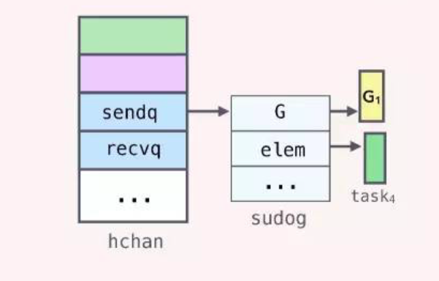

# 并发 与 通信

## goroutine

routine 指例程，这里就是 Go 例程。go routine 是用户级线程，是 Go 的并发执行体。通过 `go + 匿名函数/命名函数` 的方式启动一个 goroutine。goroutine 的特点是：

+ 返回值被忽略
+ 调度器不保证多个 goroutine 的执行顺序
+ 没有父子 goroutine 的概念，每个 goroutine 之间是平等的调度与执行的
+ 程序执行时，为 main 创建一个 goroutine，遇到其他 go 关键字再创建别的 goroutinue
+ go 没有暴露 goroutine id，难以在一个 goroutine 里面显示操作另一个 goroutine，可使用 runtime 包进行有限的操作，包括但不限于：
  + func GOMAXPROCS 用于设置和查询可以并发执行的 goroutine 数目
  + func Goexit 结束当前 goroutine 的执行，结束前会调用已经注册的 defer
  + func Gosched 放弃当前调度执行的机会，将当前的 goroutine 放到队列中等待下一次的调度

## chan

**不要通过共享内存来通信，而是通过通信来共享内存**  
chan 即 channel。Go 通过 make 来创建通道， `close(chan)` 之后，缓冲中是数据不会丢失，除非 channel 的生命周期结束。

```go
make(chan datatype)  // 通道元素是 datatype 的通道, 可以用于同步功能
make(chan datatype, 10) // 通道元素是 datatype 的通道，有 10 个缓冲
```

+ 向未初始化的通道读或写数据会导致永久阻塞
+ 向缓冲区已满的通道写数据会导致 goroutine 阻塞
+ 通道中没有数据的时候，读取通道会导致 goroutine 阻塞

### 原理

> 深入理解Golang Channel - KDF5000的文章 - 知乎 https://zhuanlan.zhihu.com/p/27917262

make 函数在创建 channel 的时候会在该进程的 heap 区申请一块内存，创建一个 hchan 结构体，返回执行该内存的指针，所以获取的的 ch 变量本身就是一个指针，在函数之间传递的时候是同一个 channel。

hchan 结构体使用**一个环形队列**来保存groutine之间传递的数据，使用两个 list 保存像该 chan 发送和从该 chan 接收数据的 goroutine，还有一个 mutex 来保证操作这些结构的安全。

```go
type hchan struct {
    qcount   uint           // total data in the queue
    dataqsiz uint           // size of the circular queue
    buf      unsafe.Pointer // points to an array of dataqsiz elements
    elemsize uint16
    closed   uint32
    elemtype *_type // element type
    sendx    uint   // send index
    recvx    uint   // receive index
    recvq    waitq  // list of recv waiters
    sendq    waitq  // list of send waiters

    lock mutex
}
```

+ 向 ch 里发送数据的时候，会首先加锁，然后将要发送的**数据 copy 到 buf 里**，并增加 sendx 的值，最后释放的锁。

+ 消费的时候首先加锁，然后将 buf 里的**数据 copy 出来**，增加 recvx ，最后释放锁

+ 当 G1 向 buf 已经满了的 ch 发送数据的时候，当 runtine 检测到对应的 hchan 的 buf 已经满了，会通知调度器，调度器会将 G1 的状态设置为 waiting, 移除与线程 M 的联系。
  
  当G1变为waiting状态后，会创建一个代表自己的 sudog 的结构，然后放到 sendq 这个 list 中，sudog 结构中保存了 channel 相关的变量的指针（如果该 Goroutine 是 sender，那么保存的是待发送数据的变量的地址，如果是 receiver 则为接收数据的变量的地址）
  
  

### go select 与 fan in/out

#### select

select语句只能用于信道的读写操作, 会随机选择一个可以执行的信道操作，如果没有可以操作的信道，则阻塞。空的 select{} 会带来死锁。

```go
select {
case ch1 <- data:
    // 如果成功向 ch1 信道成功发送数据，则执行该分支代码
case ch2 <- data:
    // 如果成功向 ch2 信道成功发送数据，则执行该分支代码
default:
    // 如果上面都没有成功，则进入 default 分支处理流程
}
```

#### fan in/out

扇入是指将多路通道聚合到一路通道之中，例如 select。扇出是指将一条通道发送到多条通道中处理，例如使用多个 goroutine。当生产者速度很慢，可以使用多个生产者并且扇入聚合来满足消费者需求，例如耗时的加密解密服务。当消费者速度很慢的时候，需要使用扇出技术，比如 Web 并发。

### 退出通知机制

+ 读取已经关闭的通道不会阻塞或 panic，而是会返回该通道的零值 **!important**
+ 关闭 select 的某个监听，select 能够立即感知，进行相应处理，不再选择该分支

## sync 与 WaitGroup 的同步

```go
var wg sync.WaitGroup

// 每个 go routinue 中
wg.Add()
defer wg.Done()

// 等待 其他goroutinue 执行完毕的 goroutinue
wg.Wait()
```

## 并发范式

### 生成器

1. 多个 goroutine 增强型生成器  
   
   ```go
   func GenerateIntA() chan int {
       ch := make(chan int, 10)
       go func() {
           for {
               ch <- rand.Int()
           }
       }()
       return ch
   }
   func GenerateIntB() chan int {
       ch := make(chan int, 10)
       go func() {
           for {
               ch <- rand.Int()
           }
       }()
       return ch
   }
   func GenerateInt() chan int {
       ch := make(chan int, 20)
       go func() {
           chA := GenerateIntA()
           chB := GenerateIntB()
           for {
               select {
                   case ch <- <- chA:
                   case ch <- <- chB:
               }
           }
       }()
       return ch
   }
   ```

2. 借助 Go 通道的退出通知机制，使生成器自动退出
   
   ```go
   func Generater (done chan struct{}) chan int {
       ch := make(chan int)
       go func() {
           Lable:
               for {
                   select {
                   case ch <- rand.Int():
                   case <- done:
                           break Lable
                   }
               }
               close(ch)
       }()
       return ch
   }
   
   func main() {
       done := make(chan struct{})
       ch := Generater(done)
   
       fmt.Println(<-ch)
       fmt.Println(<-ch)
   
       close(done)
   
       fmt.Println(<-ch)
       println("num of goruntine:",runtime.NumGoroutine())
   }
   ```

3. 融合了并发、缓冲、退出通知的多重特性生成器，此处略

### 每个请求一个 goroutine

每来一个请求就启动一个 goroutine 去处理，典型代表就是 Go 中的 HTTPserver

### woker 工作池

构建固定数目的 goroutinues 作为工作池。

对于 routine, 除了 main routine，还包括了 分发任务的 goroutine。程序中有两个通道，分别是：传递 task 任务的通道，接受 task 结果的通道。

可以结合 ```select i.(type)``` 一起用

> Tip:这里简化了书上的例子，假设系统无限制工作，不考虑结束任务处理携程

```go
const (
    WORKER_NUMBER = 10
    MAX_TASK_CACHE = 10000
    MAX_RESULT_CACHE = 10000
)

type task struct {
    taskID  // 自定义的需要的数据结构
    result  chan result_type // 用于任务处理完成后，返回信息
}

func (t *task) do() {
    // handle task
}

func main() {

    // 待处理工作，可以当成是 消息队列？
    taskchan := make(chan task, MAX_TASK_CACHE)

    // task 处理完成后的结果消息队列
    resultchan := make(chan result_type, MAX_RESULT_CACHE)

    // worker 信号通道
    done := make(chan struct{}, MAX_TASK_CACHE)

    generate_task(taskchan)  // 生成任务的函数，自定义

    go generate_worker(taskchan)

    go result_handle(resultchan)
}

func generate_worker(taskchan) {
    for i := 0; i < WORKER_NUMBER; ++i {
        go Process_task(taskchan)
    }
}

func Process_task(taskchan) {
    for t : range(taskchan) {
        t.do()
    }
}

func result_handle(resultchan) {
    for t : range(resultchan) {
        // 处理每一个结果，也可以改成并发的形式
    }
}
```

### future 模式

在一个流程中需要调用多个子调用，这些子调用之间没有任何依赖，如果串行调用会很耗时，可以考虑使用 future 模式。future 模式的基本工作原理：

+ 使用 chan 作为函数参数，并通过 chan 传入参数

+ 启动 goroutinue 调用函数，可以做其他可以并行处理的事情

+ 通过 chan 异步获取结果
  
  ```go
  type query struct {
    sql chan string // (实际上可以是更复杂的数据结构，而不只是 string)
    result chan string // (实际上可以是更复杂的数据结构，而不只是 string)
  }
  func execQuery(q query) {
    go func() {
        sql := <- q.sql;
  
        res := operation// 进行数据库操作
  
        q.result <- res
    }
  }
  func main() {
    q := query(make(chan string, 1), make(chan string, 1))
  
    go execQuery(q)
  
    q.sql <- "select * from table"
  
    // 做其他事
  
    // 获取结果
    fmt.Println(<- q.result)
  }
  ```
  
  future 可以将函数的同步调用转换为异步调用，适用于一个交易需要多个子调用且这些子调用之间没有依赖的场景。

## context 标准库

GO 中的 goroutinue 之间没有父子关系，也没有所谓的子进程退出后的通知机制，多个 routinue 平行调度，所以涉及到通信、同步、通知和退出。

+ 通信： chan 通道
+ 同步： 不带缓冲的 chan 或者 sync.WaitGroup
+ 通知： 通信中指的是业务数据。通知指的是管理、控制数据。可以绑定多个 chan 来解决
+ 退出： routinue 之间没有父子关系。可使用一个单独的通道实现退出

go 的 context 标准库可以解决这个问题，提供了两种功能：退出通知 和 元数据传递。 context 库的目的是跟踪 routinue 调用，在内部维护一个调用树，在其中传递通知和元数据，来实现：

+ 退出通知机制——传递给 routine 调用树上的每一个 routine
+ 传递数据——传递给 routine 调用树上的每一个 routine

个人认为 上下文 这个翻译真的精准独到

### context 的使用

#### context 树根节点

要创建 context 树，第一步是要有一个根结点。context.Background() 函数的返回值是一个空的 context，经常作为树的根结点，它一般由接收请求的第一个 routine 创建，不能被取消、没有值、也没有过期时间。

#### 创建子孙节点

```go
func WithCancel(parent Context) (ctx Context, cancel CancelFunc)
func WithDeadline(parent Context, deadline time.Time) (Context, CancelFunc)
func WithTimeout(parent Context, timeout time.Duration) (Context, CancelFunc)
func WithValue(parent Context, key interface{}, val interface{}) Context
```

第一个参数都是父 context ，返回一个 Context 类型的值，这样就层层创建出不同的节点。子节点是从复制父节点得到的，并且根据接收的函数参数保存子节点的一些状态值，然后就可以将它传递给下层的 routine 了。

+ WithCancel 函数，返回一个额外的CancelFunc函数类型变量，该函数类型的定义为： `type CancelFunc func()`。调用 CancelFunc 对象将撤销对应的 Context 对象，这样父结点的所在的环境中，获得了撤销子节点 context 的权利，当触发某些条件时，可以调用 CancelFunc 对象来终止子结点树的所有 routine。在子节点的 routine 中，需要用类似下面的代码来判断何时退出 routine
  
  ```go
  select {
      case <-cxt.Done():
          // do some cleaning and return
  }
  ```

+ WithDeadline 和 WithTimeout 比 WithCancel 多了一个时间参数，它指示 context 存活的最长时间。如果超过了过期时间，会自动撤销它的子 context。所以 context 的生命期是由父 context 的 routine 和 deadline 共同决定的。

+ WithValue 返回 parent 的一个副本，该副本保存了传入的 key/value，而调用 Context 接口的 Value(key) 方法就可以得到 val。注意在同一个 context 中设置 key/value，若key相同，值会被覆盖

### context 的基本数据结构

第一个创建 Context 的 goroutine 称为 root 节点。root节点负责创建一个实现 Context 接口的具体对象，并将该对象作为参数传递到其新拉起的 goroutine，下游的 goroutine 可以在封装、再传递，最终形成一个树状的数据结构。使用位于 root 节点处的 Context 就可以遍历整个 Context 树，消息和通知就可以从 root 节点传递出去，实现上游 goroutine 对下游 goroutine 的消息传递。

#### Context 接口

Context 是一个基本接口，所有　Context 对象都要实现该接口，context 的使用者在调用接口中都使用 Context 作为类型参数。

```go
type Context interface {
    // 如果其实现了超时控制，deadline 为超时时间，ok 为 true；否则 ok 为false
    Deadline() (deadline time.Time, ok bool)

    // 后端被调的 context 应该监听该方法返回的 chan，以便及时释放资源
    Done() <- chan struct{}

    // Done 返回的 chan 收到通知的时候，才可以访问 Err 获知为什么取消
    Err() error

    // 访问上游传给下游 goroutine 的值
    Value(key interface{}) interface{}
}
```

#### cancaler 接口

canceler 接口是一个拓展接口，规定了取消通知的 Context 具体类型需要实现的接口。一个 Context 对象如果实现了 cancler 接口，则可以被取消。

```go
type cancler interface {
    // 创建 cancler 接口实例的 goroutine 调用 cancler 方法通知后续创建的 goroutine 退出。
    cancel(removeFromParent bool, err error)

    // Done 方法返回的 chan 需要后端 goroutine 来监听，并及时退出
    Done() <-chan struct{}
}
```

#### context package 构造 Context 的 root 节点

package 中有：

```go
var (
    background new(emptyCtx)
    todo new(emptyCtx)
)
func Background() Context {
    return background
}
func TODO() Context {
    return todo
}
```

#### empty Context 结构

emptyCtx 是一个具体类型，实现了 Context 接口，但是没有任何功能，所有其实现的方法都是空方法。其存在的目的是作为 Context 对象树的 root。context 包的使用思路就是不停的调用 context 包提供的包装函数来创建具有特殊功能的 Context 实例，每一个 Context 实例的创建都是以上一个 Context 对象作为参数。

```go
type emptyCtx int
func (*emptyCtx) Deadline() (deadline time.Time, ok book) {
    return
}
func (*emptyCtx) Done() <- chan struct{} {
    return nil
}

func (*emptyCtx) Err() error {
    return nil
}

func (*emptyCtx) Value(key interface{}) interface{} {
    return nil
}
```

#### cancelCtx

cancalCtx 是一个具体类型，实现了 Context 接口，同时实现了 canceler 接口。其具有退出通知方法，不但能通知自己，也能逐层通知其 children 节点。

```go
type cancelCtx struct {
    Context
    done chan struct{}  // closed by the first cancel call

    mu sync.Mutex
    children map[canceler]struct{}  // set to nil by the first cancel call
    err error  // set to non-nil by the first cancel call
}

func (c *cancelCtx) Done() <-chan struct{} {
    return c.done
}

func (c *cancelCtx) Err() error {
    c.mu.Lock()
    defer c.mu.Unlock()
    return c.error
}

func (c *cancelCtx) cancel(removeFromParent bool, err Error) {
    if err == nil {
        panic("context: internal error: missing cancel error")
    }
    c.mu.Lock()
    if c.err != nil {
        c.mu.Unlock()
        return // already canceled
    }
    c.error = err  // 显示地通知自己
    close(c.done)
    // 调用每个 child 的 cancel。由于 parent 已经取消，所以此时调用的 calcel 传入 false
    for child := range children {
        child.cancel(false, err)
    }
    c.children = nil
    c.mu.Unlock()

    if removeFromParent {
        removeChild(c.Context, c)
    }
}
```

#### timerCtx

timerCtx 是一个实现了 Context 的具体类型，内部封装了 cancelCtx 类型实例，同时有一个 deadline 变量，用来实现定时退出通知

```go
type timerCtx struct {
    cancelCtx
    time *time.Timer  // under cancelCtx.mu.
    deadline time.Timer
}

func (c *timerCtx) Deadline() (deadline time.Timer, ok bool) {
    return c.deadline, true
}

func (c *timerCtx) cancel (removeFromParent bool, err error) {
    c.cancelCtx.cancel(false, err)
    if removeFromParent {
        removeChild(c.cancelCtx.Context, c)
    }
    c.mu.Lock()
    if c.timer != nil {
        c.timer.Stop()
        c.timer = nil
    }
    c.mu.Unlock()
}
```

#### valueCtx

timerCtx 是一个实现了 Context 的具体类型，内部封装了 Context 类型实例，同时封装了一个 k/v 的存储变量。valueCtx 可以用来传递通知信息。context 上下文数据的存储就像一个树，每个结点只存储一个 key/value 对。

```go
type valueCtx struct {
    Context
    key, val interface{}
}

func (c *valueCtx) Value(key interface{}) interface{} {
    if c.key == key {
        return c.val
    }
    return c.Context.value(key)  // 若当前节点没有，则递归向父节点找
}
```

### context 用法

1. 创建一个 context 根对象
   （例如借助 func Background())
2. 包装上一步创建的 Context 对象，使其具有特定的功能
3. 将上一步包装创建的对象作为实参传递给后续启动的并发函数。每个并发函数内部还可以重复 2、3 来实现自己的功能
4. 顶端的 goroutine 在超时等需要退出时，调用 cancel 通知函数，通知子树中所有 goroutine 释放资源
5. 子树中的 goroutine 通过 select 监听 Context.Done() 返回的 chan，及时响应其父亲 goroutine 的退出通知。一般停止本次处理，释放所占用的资源。

| Tip: 也可以自己封装更多的 context，但是要实现很多东西很麻烦。

例子：

```go
func main() {
    ctxa, cancel := context.WithCancel(context.Background())
    go work(ctxa, "work1")

    tm := time.Now().Add(3 * time.Second)
    ctxb, _ := context.WithDeadline(ctxa, tm)
    go work(ctxbb, "work2")

    ctxc, _ := context.WithValue(ctxb, "key", "value of k/v")
    go workWithValue(ctxbc, "work3")

    time.Sleep(10 * time.Second)
    cancel()

    time.Sleep(5 * time.Second)
}

func work(ctx context.Context, name string) {
    for {
        select {
            case <- ctx.Done():
                fmt.printf("%s get msg to cancel\n", name)
                return
            default:
                fmt.printf("%s is running\n", name)
                time.Sleep(1 * time.Second)
        }
    }
}

func workWithValue(ctx context.Context, name string) {
    for {
        select {
            case <- ctx.Done():
                fmt.printf("%s get msg to cancel\n", name)
                return
            default:
                value := ctx.Value("key").(string)
                fmt.printf("%s is running, value = %s\n", name, value)
                time.Sleep(1 * time.Second)
        }
    }
}
```

实际上，程序维护了两条关系链。

+ 一条是 Context 的 children key 构成的根到叶子的引用关系，使得取消广播能够沿着链传递到下层节点，直至叶子结点。
+ 另一条是 Context 对象获取自身包裹的 Context 对象，自底向上查找。用于自身取消之后，把自己从广播树上清除。其实也用于 Value 的逐层查找。自 Context 可查到父 Context 的 key-value 信息。

## 并发模型

### 调度模型

+ 多进程模型  
  
  + 每个进程都有自己独立的内存空间，隔离性好，健壮性强
  + 进程比较重，切换开销大，进程间通信需要在内核区用户区之间复制数据

+ 多线程模型
  
  + 通过共享内存通信，线程切换代价小
  
  + 多线程共享内存，可能导致数据访问混乱。某个进程误操作可能会导致整个线程组挂掉，健壮性差  
    
    > Tip: 实际上，进程线程都需要上下文切换，只不过线程组间的内存资源指针指向同一块地址空间。这会导致线程的 cache/TLB 命中的概率比进程高很多，缺页中断少，数据写回少。这是线程调度开销少的根本原因。

+ 用户级多线程模型
  
  1. 分为 M:1 和 M:N 两种。前一种还是会存在一个线程阻塞导致所有线程阻塞，后一种若系统线程数量过多会导致操作系统调度开销过大，单个线程时间片太少。
  2. 新的概念：协程。  
      协程是一种用户级别的轻量级线程，协程的调度完全由用户态程序控制。协程拥有自己的寄存器上下文和栈，协程调度切换时，会保存恢复寄存器上下文(AX BX PC IR 等等)和栈。  
      **每个内核线程可以对应多个用户协程。当一个协程执行体阻塞，调度器会调度另一个协程执行。** 当然，其也可以使用 M:N 模型。  
      好处显而易见：
     + 控制了系统线程总数，使每个系统线程时间片充足
     + 调度层可以进行用户态的切换(避免内核态用户态频繁切换)，不会因为单个协程阻塞整个程序，减少程序上下文切换。

### GO 的 goroutine 调度模型

> https://draveness.me/golang/docs/part3-runtime/ch06-concurrency/golang-goroutine/

更旧的不谈了，较新的：

- 任务窃取调度器 ·1.1
  - 引入了处理器 P，构成了目前的 **G-M-P** 模型；
  - 在处理器 P 的基础上实现了基于**工作窃取**的调度器；
  - 在某些情况下，Goroutine 不会让出线程，进而造成饥饿问题；
  - 时间过长的垃圾回收（Stop-the-world，STW）会导致程序长时间无法工作；
- 抢占式调度器 ·1.2 ~ 至今
  - 基于协作的抢占式调度器 - 1.2 ~ 1.13
    - 通过编译器在函数调用时插入**抢占检查**指令，在函数调用时检查当前 Goroutine 是否发起了抢占请求，实现基于协作的抢占式调度；
    - Goroutine 可能会因为垃圾回收和循环长时间占用资源导致程序暂停；
  - 基于信号的抢占式调度器 - 1.14 ~ 至今
    - 实现**基于信号的真抢占式调度**；
    - 垃圾回收在扫描栈时会触发抢占调度；
    - 抢占的时间点不够多，还不能覆盖全部的边缘情况；

#### 任务窃取调度器

```go
static void schedule(void) {
    G *gp;
 top:
    if(runtime·gcwaiting) {
        gcstopm();
        goto top;
    }

    gp = runqget(m->p);
    if(gp == nil)
        gp = findrunnable();

    ...

    execute(gp);
}
```

1. 如果当前运行时在等待垃圾回收，调用 [`runtime.gcstopm:779c45a`](https://draveness.me/golang/tree/runtime.gcstopm:779c45a) 函数；（总之就是等待 start the world）
   
   > Stops the current m for stoptheworld. Returns when the world is restarted.

2. 调用 [`runtime.runqget:779c45a`](https://draveness.me/golang/tree/runtime.runqget:779c45a) 和 [`runtime.findrunnable:779c45a`](https://draveness.me/golang/tree/runtime.findrunnable:779c45a) 从本地或者全局的运行队列中获取待执行的 Goroutine；

3. 当前处理器本地的运行队列中不包含 Goroutine 时，调用 [`runtime.findrunnable:779c45a`](https://draveness.me/golang/tree/runtime.findrunnable:779c45a) 会触发工作窃取，从其它的处理器的队列中随机获取一些 Goroutine。

4. 调用 [`runtime.execute:779c45a`](https://draveness.me/golang/tree/runtime.execute:779c45a) 在当前线程 M 上运行 Goroutine；

1.1 版本中的调度器不支持抢占式调度，程序只能依靠 Goroutine 主动让出 CPU 资源才能触发调度。可能存在：

- 某些 Goroutine 可以长时间占用线程，造成其它 Goroutine 的饥饿；
- 垃圾回收需要暂停整个程序（Stop-the-world，STW），最长可能需要几分钟的时间，导致整个程序无法工作；

#### 基于协作的抢占式调度

1. **编译器**会在调用函数前插入 [`runtime.morestack`](https://draveness.me/golang/tree/runtime.morestack)；
2. Go 语言运行时会在垃圾回收暂停程序、系统监控发现 Goroutine 运行超过 10ms 时发出抢占请求 `StackPreempt`；
3. 当发生函数调用时，可能会执行编译器插入的 [`runtime.morestack`](https://draveness.me/golang/tree/runtime.morestack)，它调用的 [`runtime.newstack`](https://draveness.me/golang/tree/runtime.newstack) 会检查 Goroutine 的 `stackguard0` 字段是否为 `StackPreempt`；
4. 如果 `stackguard0` 是 `StackPreempt`，就会触发抢占让出当前线程；

因为这里的抢占是通过编译器插入函数实现的，还是需要函数调用作为入口才能触发抢占，所以这是一种**协作式的抢占式调度**。

不过其并不完备，可能存在一些问题，例如：

+ tight loop 
+ an empty for{}

#### 非协作的（基于信号的）抢占式调度

看一看 OS-进程线程协程管理-goroutine 是怎么切换的

#### G-M-P 模型线程模型 和 G-M-P 的数据结构

goroutine 调度模型有三个实体：M, P, G

+ G(Goroutine) 是对 goroutine 的抽象描述，存放了并发执行的代码入口、上下文、运行环境（关联的 M 和 P）、运行栈等信息。Go runtime 的监控线程会监控 G 的调度。G 新建或恢复时会加入运行队列，等待 M 取出并执行。为了减少对象分配回收，G 是可复用的。

+ M(Machine) 表示内核线程，是系统层面调度运行的实体。 M 不停的被唤醒/创建，然后执行。唤醒/创建时，会首先执行 Go runtime 管理代码，获取 G 和 P，然后执行调度。 Go runtime 有一个监控线程会对内存、调度监控控制。
  
  调度器最多可以创建 10000 个内核线程，但是其中大多数的线程都不会执行用户代码（可能陷入系统调用），最多只会有 `GOMAXPROCS` 个**活跃线程**能够正常运行。默认情况下，运行时会将 `GOMAXPROCS` 设置成当前机器的核数。这样，不会频繁触发操作系统的线程调度和上下文切换，调度几乎都会发生在用户态，由 Go 语言调度器触发，能够减少很多额外开销。

+ P(Processer)是一个**数据模型**，只是一个 M 管理调度 G 的间接控制用的数据结构。可以被看做运行在线程上的本地调度器。
  
  + 调度器在启动时就会创建 `GOMAXPROCS` 个处理器，所以 Go 语言程序的处理器数量会等于 `GOMAXPROCS`（虽然可以另外设置），这些处理器会绑定到不同的内核线程上。Processor 数量固定意味着任意时刻只有 GOMAXPROCS 个线程在运行。
  
  + P 代表 M 运行 G 所需要的资源，是对资源的一种抽象和管理。包括与性能追踪、垃圾回收和计时器相关的字段。
  
  + P 持有 G 的**队列**，隔离了调度，解除 P-M 的绑定就解除了 M 对一串 G 的调度。M 通过绑定 P 来调用一串 G。

M 和 P 构成了一个 runtime 环境。每个 P 持有一个可调度 G 队列，如果 P 中 G 空了，就去全局队列偷取一部分 G，如果全局队列也空了，就从其他 P 中偷取一部分 G。这就是所谓的 Work Stealing。

特殊的 M 和 G（m0 和 g0）: m0 是启动程序之后的主线程，负责初始化和启动第一个 G(runtime.main)。每一个 M 都会有自己的管理堆栈 g0，用于 M 的执行管理和调度逻辑。

>  具体的内容不过于细致的介绍了，可以参考
> 
> https://draveness.me/golang/docs/part3-runtime/ch06-concurrency/golang-goroutine/#%E4%BB%BB%E5%8A%A1%E7%AA%83%E5%8F%96%E8%B0%83%E5%BA%A6%E5%99%A8


**调度时机的话题，参考 OS 相关章节**

> 这里偏个题，被问到 Go 线程模型的时候，还被问了 JS 的线程模型是什么样的。
> 
> > 如何理解JS的单线程？ - 千锋前端学习营的文章 - 知乎
> > https://zhuanlan.zhihu.com/p/265349066
> 
> JS 是主线程单线程模型 + 辅助线程
> 
> 
> 
> **JS本质是单线程的**。也就是说，它并不能像JAVA语言那样，两个线程并发执行。
> 
> JS引擎的主线程负责执行代码，由于只有这一个线程，执行当然是同步的，即按照顺序来。另外，还有一个叫做**任务队列**的东西，所有的异步代码都是从队列当中来。
> 
> 当有事件发生的时候，事件触发线程就负责来接收这个事件，并把要执行的任务暂时保存在任务队列当中。等主线程把手里的同步代码执行完，就立刻会向任务队列提取最新的任务。
> 
> **这也就解释了为什么我们总把JS的异步函数叫做回调了，因为真的不是马上执行，而是回头再调的！**
> 
> 平时我们使用定时器，时间往往不准确，就是因为在加入任务队列时，前面可能已经有好多任务在排队了，你明明写了 80ms 的延迟，可是却等了 100ms 才出现结果。