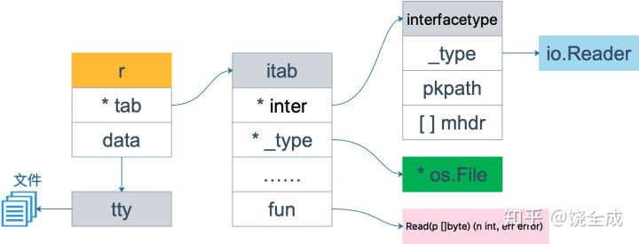
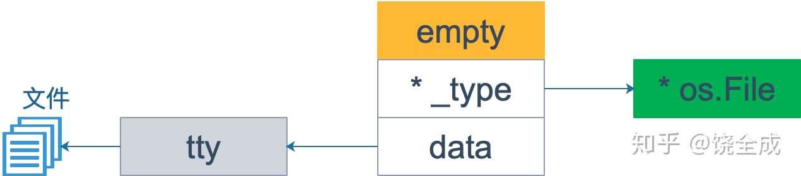

# 接口
## 基本概念
接口变量有的 方法声明 与 方法值变量。  
接口声明中包含数个**方法声明**（是带有方法名的，不是方法签名）  

接口变量可以绑定到某个具体类型实例上 ，（该实例实现了该方法，也就是该实例的方法集是接口方法集的超集），接口调用方法实际上就是调用其绑定的实例的方法。  

接口有动态类型和静态类型的概念。接口的动态类型指的是接口绑定的具体实例的类型是动态的，具体实例的类型称为接口的动态类型。而接口能绑定什么实例是由接口的方法签名集合（？签名还是声明，带不带函数名？）所决定的，这称为接口的静态类型。  

接口赋值，也就是接口初始化时会进行**静态类型检查**，具体类型实例的方法集必须是接口方法集的超集 **（特别是指针类的类型方法，如果直接赋值一个实例会导致方法集不全，比如没有 set ）** 。用接口变量赋值同理。

## 空接口
没有任何方法的接口称为空接口，任何类型都符合空接口的要求。  

空接口可用于 泛型（参数化类型，空接口用于接收任意类型参数） 与 反射。  

空接口并不是真的是空的，实际上它有两个字段：绑定的实例的类型 和 绑定的实例的指针。当且仅当这两个都是 nil 的时候，空接口才是 nil。所以不能用 `接口变量 == nil` 来判断接口绑定的实例指针是不是空，有可能空接口绑定的是某类型的空指针。

## 接口类型检查
接口变量可以绑定实例（实例值或者实例指针值）
### 类型断言
```go
value, ok := i.(TypeName)
```

1. TypeName 是具体类型名，则类型断言用于判断接口变量 i 绑定的实例的类型是不是 TypeName
2. TypeName 是接口类型名，则类型断言用于判断接口变量 i 绑定的**实例**是否**实现了接口** TypeName
  
i 必须是接口变量而不是具体类型变量。 ok 为 `true` or `false`，表示断言的结果。
1. 如果断言为真，则 value 是接口绑定的实例值的副本（如果实例是指针值，那么就是指针值的副本）；或 value 是接口类型 TypeName 变量，且其底层绑定的实例是 i 绑定的实例的副本（指针同理）。
2. 如果断言为假，则 value TypeName 类型的零值，没有任何意义，不应当使用它。

如果确信断言结果为真，可以简写为 `value := i.(TypeName)`，但如果结果为假就会导致抛出 panic

### 类型查询
```go
switch v := i.(type) {
case type1:
    xxx
case type2:
    xxx
case nil:  // 例如空的接口变量
    xxx
default:
    xxx
}
```
其中 type1, type2 ... 可以是接口类型名或实例类型名。需要注意的是，case 后面可以跟着多个 type，只要有一个符合，就等价于 v:= o，比较奇怪，需要留意一下。

## 接口的内部实现
### 数据结构
非空接口的底层数据结构是 iface。非空接口初始化的过程就是初始化一个 iface 的过程。
```go
type iface struct {
    tab *itab
    data unsafe.Pointer
}
```
+ itab 用来存放 **接口自身类型** 和 **绑定的实例的类型** 以及 **实例相关的函数指针**  
+ data 是个指针，指向接口绑定的**实例的副本**或者是**指针的副本**，接口的初始化也是一种值拷贝（哪怕传递的是指针，也是赋值了一个指针）。

itab 数据结构是接口内部实现的核心和基础，itab的信息存放在静态分配的存储空间中，不受到GC的限制，不会被回收。itab 表示 interface 和 实际类型的转换信息。对于每个 interface 和实际类型，只要在代码中存在引用关系， go 就会在运行时为这一对具体的 <Interface, Type> 生成 itab 信息。
```go
type itab struct {
    inter *interfacetype  // 接口自身的静态类型
    _type *_type  // 接口对应的具体实例的类型，也就是接口的动态类型
    hash uint32
    _ [4]byte
    fun [1]uintptr
}
```
+ inter 是接口自身的静态类型的信息（接口类型的元信息）
+ _type 是接口对应的具体类型的信息，也就是接口的动态类型的信息（具体实例的元信息）。注意的是，这里存放的对应的具体类型的类型信息，而 iface 中的 data 指向的是该类型的值。
+ hash 具体类型的 Hash 值，在 _type 中也有一份，用于接口断言或是类型查询
+ fun 是函数指针，有点像 CPP 中的虚函数指针。

_type ：Go是强类型语言，编译器在编译时会进行严格的类型检查，所以需要为每一个类型维护一个类型的元信息。所有其他类型都是以 _type 为内嵌字段封装而成的结构体。**_type 是类型的类型元信息**。  
Go语言的类型元信息由编译器负责构建，并以表的形式存放在编译后的对象文件中，再由链接器在链接时进行段合并、符号重定位。这些类型信息会在接口的动态调用与反射中被**运行中引用**

上面说的是类型的类型元信息。下面看一下接口类型的元信息
```go
type interfacetype struct {
    typ _type
    pkgpath name  // 接口所属包的信息
    mhdir []imethod  // 接口的方法
}
```

下面是一个示例
```go
var r io.Reader
// r 的静态类型是 io.Reader，动态类型为 nil，并且它的动态值也是 nil

tty, err := os.OpenFile("/Users/qcrao/Desktop/test", os.O_RDWR, 0)
if err != nil {
    return nil, err
}
r = tty
// r 的动态类型变成 *os.File，动态值则变成非空，表示打开的文件对象。这时，r 可以用<value, type>对来表示为： <tty, *os.File>
```


### 接口的调用过程与代价
接口调用过程：
1. 构建 iface 动态数据结构。在接口实例化的时候完成该过程。
2. 通过函数指针间接调用接口绑定的实例方法

接口调用代价：
1. 接口实例化的过程，也就是 iface 的创建过程。一旦实例化完成之后，这个接口和具体类型的 itab 数据接口是可以复用的
2. 接口的方法调用，是函数指针的间接调用。需要注意的是，这里的调用是一种动态的计算后的调用，会导致CPU缓存与分支预测失效，带来损耗

### 空接口的数据结构
空接口是没有任何方法集的接口，所以空接口内部不需要维护和动态相关的数据结构 itab。空接口只关心存放的具体类型是什么，具体类型的值是什么。所以空接口的底层数据结构 eface 如下：
```go
type eface struct {
    _type *type
    data unsafe.Pointer
}
```

下面是一个示例
```go
tty, err := os.OpenFile("file_path", os.O_RDWR, 0)
var empty interface{} = tty
```


空接口自身没有方法集，所以空接口实例化之后的真正用途并不是接口方法的动态调用。空接口真正的意义是支持多态，这一步需要将空接口类型还原，方法有：
+ 接口类型断言
+ 接口类型查询
+ 反射
