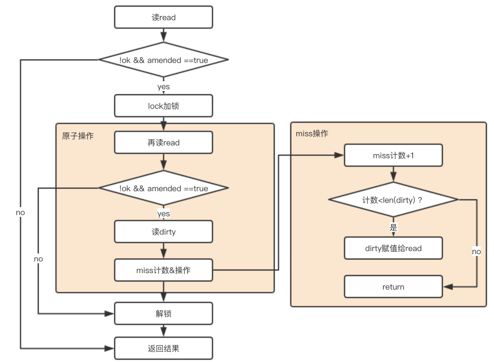
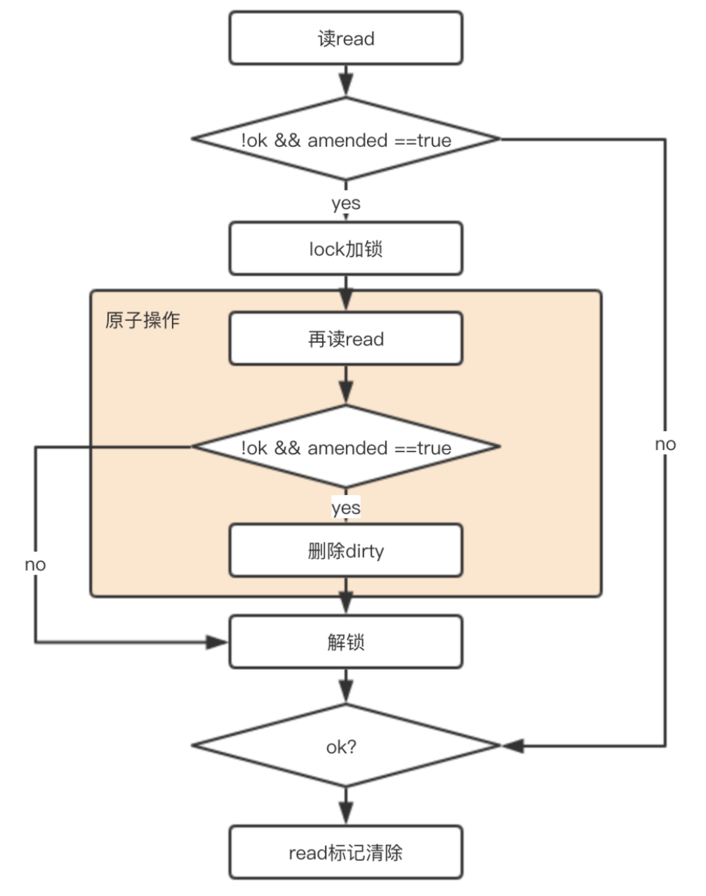

# 面试可能问的知识

> https://mp.weixin.qq.com/s/xKmGVWe7zz7OD3hULH-otw

## 一些语法

### make new 的区别

> Go语言（golang）中，make和new有什么区别呢？ - 无忌的回答 - 知乎 https://www.zhihu.com/question/446317882/answer/2245768201

#### new是什么

>  ```go
>  func new(Type) *Type
>  ```
>
> The new built-in function allocates memory. The first argument is a type, not a value, and the value returned is a pointer to a newly allocated zero value of that type.

从官方定义里可以看到，new 有以下几个特点：

1. 分配内存。内存里存的值是对应类型的**零值**。

2. 只有一个参数。参数是分配的内存空间所存储的**数据类型**

   > Go语言里的任何类型都可以是 new 的参数，比如 int， 数组，结构体，甚至函数类型都可以。

3. 返回的是**指针**。

以下代码是等价的，可以认为 `new(T)` 是 `var t T`;`&t` 的语法糖。

```go
ptr := new(T)

var t T
ptr := &t

// ps: 如果 T 是一个 struct， 其实好像也可以这样写？
ptr := &T{}
```

注意：**Go里的 new 和C++ 的 new 是不一样的：**

- Go 的 new 分配的内存可能在栈 (stack) 上，可能在堆 (heap) 上。【感觉就是看会不会逃逸之类的动态管理？】C++ new 分配的内存一定在堆上。

- Go 的 new 分配的内存里的值是**对应类型的零值**，不能显示初始化指定要分配的值。C++ new 分配内存的时候可以显示指定要存储的值。（C++ 其实还是隐式的调用构造函数）

  ```c++
  class D: public Base {
  public:
      int value;
      D(int v) {
          value = v;
      }
  };
  D *ptr = new D{0};
  ```

- Go 里没有构造函数，Go 的 new 不会去调用构造函数。C++ 的 new 是会调用对应类型的构造函数。

#### make 是什么

> ```go
> func make(t Type, size ...IntegerType) Type
> ```
>
> The make built-in function **allocates and initializes** an object of **type slice, map, or chan (only)**. Like new, the first argument is a type, not a value. Unlike new, make's return type is the same as the type of its argument, not a pointer to it. The specification of the result depends on the type:
>
> Slice: The size specifies the length. The capacity of the slice is  equal to its length. A second integer argument may be provided to  specify a different capacity; it must be no smaller than the  length. For example, make([]int, 0, 10) allocates an underlying array  of size 10 and returns a slice of length 0 and capacity 10 that is  backed by this underlying array.
>
> Map: An empty map is allocated with enough space to hold the  specified number of elements. The size may be omitted, in which case  a small starting size is allocated.
>
> Channel: The channel's buffer is initialized with the specified  buffer capacity. If zero, or the size is omitted, the channel is  unbuffered.

从官方定义里可以看到，make 有如下几个特点：

1.  分配和初始化内存。

2.  只能用于slice, map和chan这3个类型，不能用于其它类型。

   如果是用于slice类型，make函数的第2个参数表示 slice 的长度，这个参数必须给值。第三个参数是初始容量。

   如果指定的长度 len>0，则 make 创建的 slice 下标从 0 到 len-1 的值都是对应 slice 里元素类型的零值。

3. 返回的是原始类型，也就是 slice, map, chan，不是返回指针。

##### 为啥有个 make？

slice、map、channel 这些类型它是复合类型数据结构，通常是一个结构体+堆内存，因此 make 的额外作用就是初始化这些数据和指针，从这一点看，make 的作用是申请内存，并且初始化数据。

#### 最佳实践

1. 尽量不使用new，直接用 `v := ST{}` 多好，还能顺带初始化。
2. 对于slice, map和chan的定义和初始化，优先考虑使用make函数

### 逃逸分析

> 详解二：Go 语言机制之逃逸分析 - polarisxu的文章 - 知乎 https://zhuanlan.zhihu.com/p/137536970

堆无法像栈一样能自清理，所以使用这部分内存会造成很大的开销，开销跟 GC 有很大的关系。当 GC 运行时，它会占用 CPU，也会造成微秒级的 stop the world 的延时。在 Go 中，会将一部分值分配到堆上。这些分配给 GC 带来了压力，因为堆上没有被指针索引的值都需要被删除。

**不允许 goroutine 中的指针指向另外一个 goroutine 的栈**。这是因为**当栈增长或者收缩时，goroutine 中的栈内存会被一块新的内存替换**。如果运行时需要追踪指针指向其他的 goroutine 的栈，就会造成非常多需要管理的内存，以至于更新指向那些栈的指针将使 “stop the world” 问题更严重。

> 在 1.2 之前，每一个 Goroutine 创建的时候，都会申请一个 8KB 大小的空间作为该 Goroutine 的栈。当 8KB 用完时，Go 会通过 `morestack` 函数为之 再申请一块内存，然后把两个栈连起来。segmented stacks 有这么一个缺点，就是当一个栈快要满时，会申请一个 新的栈来执行子函数，当子函数执行完成时，会把栈回收。 如果不断重复上面这个过程，那么就会出现这个 Goroutine 频繁的申请和释放栈
>
> Go 在 1.13时，切换到了新的策略，叫做 “contiguous stacks”，它的策略如下：
>
> - 当栈不够用时，创建一个更大的栈
> - 把老栈的所有内容copy到新的栈
> - 调整copy过去的内容中的指针地址(把老栈的地址，改成新栈的)
> - 销毁老的栈
>
> https://go.dev/play/p/pxn5u4EBSI

因此，**任何时候，一个值被分享到函数栈帧范围之外，它都会在堆上被重新分配**。这是逃逸分析算法发现这些情况和管控这一层的工作。**逃逸分析是在编译器完成的**。逃逸包括但不限于：

+ 变量类型不确定

  ```go
  func main() {
      a := 666
      fmt.Println(a)
  }
  ```

  变量`a`逃逸到了堆上。a 逃逸是因为它被传入了 `fmt.Println` 的参数中。

  很多函数参数为 interface 类型,编译期间很难确定其参数的具体类型，也能产生逃逸。

+ 在某个函数中创建出的变量，将其指针作为函数返回值，则该变量一定发生逃逸。（构造函数返回的指针变量一定逃逸）
+ 变量所占内存较大
+ 被 slice、map 和 chan 引用的指针一定发生逃逸

### channel 的实现

Go 语言的 Channel 在运行时使用 `runtime.hchan`结构体表示。

```go
type hchan struct {
	qcount   uint
	dataqsiz uint
	buf      unsafe.Pointer
    sendx    uint
	recvx    uint
    
	elemsize uint16
	elemtype *_type

	recvq    waitq
	sendq    waitq

    closed   uint32
    
	lock mutex
}
```

结构体中的五个字段 `qcount`、`dataqsiz`、`buf`、`sendx`、`recv` 构建底层的循环队列：

- `qcount` — Channel 中的元素个数；
- `dataqsiz` — Channel 中的循环队列的长度；
- `buf` — Channel 的缓冲区数据指针；
- `sendx` — Channel 的发送操作处理到的位置；
- `recvx` — Channel 的接收操作处理到的位置；

除此之外，`elemsize` 和 `elemtype` 分别表示当前 Channel 能够收发的元素类型和大小

`sendq` 和 `recvq` 存储了当前 Channel 由于缓冲区空间不足而阻塞的 Goroutine 列表，这些等待队列使用双向链表 `runtime.waitq`表示

根据 channel 元素类型和缓冲区大小进行初始化：

- 如果当前 Channel 中不存在缓冲区，那么就只会为 `runtime.hchan`分配一段内存空间；
- 如果当前 Channel 中存储的类型不是指针类型，会为当前的 Channel 和底层的数组分配一块连续的内存空间；
- 在默认情况下会单独为 `runtime.hchan`和缓冲区分配内存；

#### 发送过程

向 Channel 发送数据时，就需要使用 `ch <- i` 语句。总之最后会调用 `runtime.chansend` 函数。

因为 `runtime.chansend`函数的实现比较复杂，这里将该函数的执行过程分成以下的三个部分：

- 当存在等待的接收者时，通过 `runtime.send` 直接将数据发送给阻塞的接收者

  ```go
  if sg := c.recvq.dequeue(); sg != nil {
      send(c, sg, ep, func() { unlock(&c.lock) }, 3)
      return true
  }
  ```

  `runtime.send`，该函数的执行可以分成两个部分：

  1. 调用 `runtime.sendDirect`将发送的数据直接拷贝到 `x = <-c` 表达式中变量 `x` 所在的内存地址上；
  2. 调用 `runtime.goready` 将等待接收数据的 Goroutine 标记成可运行状态 `Grunnable` 并把该 Goroutine 放到发送方所在的处理器的 `runnext` 上等待执行，**该处理器在下一次调度时会立刻唤醒数据的接收方**；

  ```go
  func send(c *hchan, sg *sudog, ep unsafe.Pointer, unlockf func(), skip int) {
  	if sg.elem != nil {
  		sendDirect(c.elemtype, sg, ep)
  		sg.elem = nil
  	}
  	gp := sg.g
  	unlockf()
  	gp.param = unsafe.Pointer(sg)
  	goready(gp, skip+1)
  }
  ```

- 当缓冲区存在空余空间时，将发送的数据写入 Channel 的缓冲区

  ```go
  func chansend(c *hchan, ep unsafe.Pointer, block bool, callerpc uintptr) bool {
  	...
  	if c.qcount < c.dataqsiz {
  		qp := chanbuf(c, c.sendx)
  		typedmemmove(c.elemtype, qp, ep)
  		c.sendx++
  		if c.sendx == c.dataqsiz {
  			c.sendx = 0
  		}
  		c.qcount++
  		unlock(&c.lock)
  		return true
  	}
  	...
  }
  ```

  首先会使用 `runtime.chanbuf`计算出下一个可以存储数据的位置，然后通过 `runtime.typedmemmove`将发送的数据拷贝到缓冲区中并增加 `sendx` 索引和 `qcount` 计数器。

- 当不存在缓冲区或者缓冲区已满时，等待其他 Goroutine 从 Channel 接收数据

  当 Channel 没有接收者能够处理数据时，向 Channel 发送数据会被下游阻塞。

  > 当然使用 `select` 关键字可以向 Channel 非阻塞地发送消息。

  大体的流程是：

  + 获取发送数据使用的 Goroutine
  + 设置这一次阻塞发送的相关信息，例如发送的 Channel、是否在 select 中和**待发送数据的内存地址**等
  + 加入发送等待队列，并设置到当前 Goroutine 的 `waiting` 上，将当前的 Goroutine 陷入沉睡等待唤醒
  + 被调度器唤醒后会执行一些收尾工作，将一些属性置零并且释放

  ```go
  func chansend(c *hchan, ep unsafe.Pointer, block bool, callerpc uintptr) bool {
  	...
  	if !block {
  		unlock(&c.lock)
  		return false
  	}
  
  	gp := getg()
  	mysg := acquireSudog()
  	mysg.elem = ep
  	mysg.g = gp
  	mysg.c = c
  	gp.waiting = mysg
  	c.sendq.enqueue(mysg)
  	goparkunlock(&c.lock, waitReasonChanSend, traceEvGoBlockSend, 3)
  
  	gp.waiting = nil
  	gp.param = nil
  	mysg.c = nil
  	releaseSudog(mysg)
  	return true
  }
  ```

#### 接收过程

+ 如果 【channel 为 nil】 或【已关闭且缓冲区中不存在数据】直接返回

+ 当存在等待的发送者时，通过 `runtime.recv`从阻塞的发送者或者缓冲区中获取数据；

  + 不存在缓冲区时，将 Channel 发送队列中 Goroutine 存储的 `elem` 数据拷贝到目标内存地址中；
  + 存在缓冲区时：将队列中的数据拷贝到接收方的内存地址；将发送队列头的数据拷贝到缓冲区中，释放一个阻塞的发送方；
  + 无论发生哪种情况，运行时都会调用将当前处理器的 `runnext` 设置成发送数据的 Goroutine，在调度器下一次调度时将阻塞的发送方唤醒。

+ 当不存在等待的发送者且缓冲区非空时

  直接接受，维护相关变量（尾指针、计数器等）

+ 没数据可以拿的时候（发送队列中不存在等待的 Goroutine 并且缓冲区中也不存在任何数据时）

  将当前 Goroutine 包装成一个处于等待状态的 Goroutine 并将其加入到接收队列中。之后让出处理器的使用权并等待调度器的调度。

## sync.Map【搞不明白】

> sync/atomic
>
> 原子操作就是指该操作是不可分割的，在执行完毕之前不会被其他的任务或者事件中断，该操作的内部不能被高层的操作发现并分割执行，处理器会首先保证我们这些操作内存的原子性，也就是说**当向该内存地址写入或者读取数据的时候，其他的操作无法获取该内存的地址，也就是保证了该内存所保存数据的正确性**。
>
> 在 sync/atomic 中提供了许多原子操作支持，主要有五大类：
>
> 1. Load
>
>    接收一个地址，并返回该地址中的数据。
>
> 2. Store
>
>    Store一类的方法接收两个参数，一个是保存数据的地址，另外一个是要保存的值
>    该类主要负责将对应的值保存在相应的内存地址中
>
> 3. Add
>
>    Add 一类的方法接收两个参数，一个是保存数据的地址，一个是需要加上的数据，而后返回一个处理后的值
>    （不应看作 Load 和 Store 的结合，因为是原子的）
>
>    ```go
>    func main() {
>        var n int32
>        var wg sync.WaitGroup
>        for i := 0; i < 1000; i++ {
>            wg.Add(1)
>            go func() {
>                atomic.AddInt32(&n, 1)  
>                wg.Done()
>            }()
>        }
>        wg.Wait()
>    
>        fmt.Println(atomic.LoadInt32(&n)) // 1000
>    }
>    ```
>
> 4. Swap
>
>    Swap 一类的方法接收两个参数，一个是保存数据的地址，一个是新的数据，函数会**返回该地址原本保存的数据**并保存新数据
>
> 5. CompareAndSwap
>
>    先比较旧数据和地址中保存数据的值，如果相同的话，执行Swap，把新的数值保存在地址中，返回true，如果不同，那么直接返回false

```go
type Map struct {
	mu sync.Mutex
	read atomic.Value // readOnly
	dirty map[interface{}]*entry
	misses int
}

type readOnly struct {
	m       map[interface{}]*entry
	amended bool // true if the dirty map contains some key not in m.
}

// expunged is an arbitrary pointer that marks entries which have been deleted
// from the dirty map.
var expunged = unsafe.Pointer(new(interface{}))

// An entry is a slot in the map corresponding to a particular key.
// 虽然前文 read 和 dirty 存在冗余的情况，但是由于 value 都是指针类型，其实存储的空间其实没增加多少。
// 个人猜测：而且每次将 readOnly 都原子的读出来，包含数据在里面的话太大了，所以要用指针？
type entry struct {
	p unsafe.Pointer // *interface{}
}
func (e *entry) load() (value interface{}, ok bool) {
	p := atomic.LoadPointer(&e.p)
	if p == nil || p == expunged {
		return nil, false
	}
	return *(*interface{})(p), true
}
```

总体思想：

1. 空间换时间。 通过冗余的两个数据结构(read、dirty),实现加锁对性能的影响。
2. 使用只读数据(read)，避免读写冲突。
3. **动态调整，miss 次数多了之后，将 dirty 数据提升为read。**
4. double-checking。
5. 延迟删除。 **删除一个键值只是打标记，只有在提升 dirty 的时候才清理删除的数据。**
6. 优先从 read 读取、更新、删除，**因为对 read 的读取不需要锁**。

具体函数的实现逻辑：

1. 查询 Load

   **流程：先 read 里面读，如果没读到，再去 dirty 里面找。**

   写操作只会操作 dirty，所以保证了 dirty 是最新的，并且数据集是肯定包含 read 的。（可能有疑问，dirty 不是下一步就置为 nil 了，为何还包含？后文会有解释。）

   

   ```go
   func (m *Map) Load(key interface{}) (value interface{}, ok bool) {
       // 因read只读，线程安全，优先读取
       read, _ := m.read.Load().(readOnly)
       e, ok := read.m[key]
       
       // 如果read没有，并且dirty有新数据，那么去dirty中查找 （如果既没有读到，dirty 又没有新数据，那肯定不存在了）
       if !ok && read.amended {
           m.mu.Lock()
           // 双重检查（原因是前文的if判断和加锁非原子的，害怕这中间发生故事）
           read, _ = m.read.Load().(readOnly)
           e, ok = read.m[key]
           
           // 如果read中还是不存在，并且dirty中有新数据
           if !ok && read.amended {
               e, ok = m.dirty[key]
               // m计数+1
               m.missLocked()
           }
           
           m.mu.Unlock()
       }
       
       if !ok {
           return nil, false
       }
       return e.load()
   }
   
   func (m *Map) missLocked() {
       m.misses++
       if m.misses < len(m.dirty) {
           return
       }
       
       // 将dirty置给read，因为穿透概率太大了(耗时不算特别大吧)
       m.read.Store(readOnly{m: m.dirty})
       m.dirty = nil
       m.misses = 0
   }
   
   func (e *entry) load() (value interface{}, ok bool) {
   	p := atomic.LoadPointer(&e.p)
   	if p == nil || p == expunged {
   		return nil, false
   	}
   	return *(*interface{})(p), true
   }
   ```

2. 删除 Delete

   **流程：先检查是不是存在（read 和 amended）**，如果存在开始删除流程。**把 dirty 中的删除，把 read 标记删除。**

   + 为什么 dirty 是直接删除，而 read 是标记删除？

     read 的作用是在 dirty 前充当一种快速缓存？

     遇到相同元素的时候为了不穿透到 dirty，所以采用标记的方式。有点像缓存中处理未命中情况的处理办法。
     正是因为这样的机制+amended的标记，可以保证 read 找不到 && amended=false 的时候，dirty 中肯定找不到。

   + 为什么 dirty 是可以直接删除，而没有先进行读取存在后删除？

     删除成本低。读一次需要寻找，删除也需要寻找，无需重复操作。

   + 如何进行标记的？

     将值置为nil。（这个很关键）

   

   ```go
   func (m *Map) Delete(key interface{}) {
       // 读出read，断言为readOnly类型
       read, _ := m.read.Load().(readOnly)
       e, ok := read.m[key]
       // 如果read中没有，并且dirty中有新元素，那么就去dirty中去找。这里用到了amended，当read与dirty不同时为true，说明dirty中有read没有的数据。
       
       if !ok && read.amended {
           m.mu.Lock()
           // 再检查一次，因为前文的判断和锁不是原子操作，防止期间发生了变化。
           read, _ = m.read.Load().(readOnly)
           e, ok = read.m[key]
           
           if !ok && read.amended {
               // 直接删除
               delete(m.dirty, key)
           }
           m.mu.Unlock()
       }
       
       if ok {
       // 如果read中存在该key，则将该value 赋值nil（采用标记的方式删除！）
           e.delete()
       }
   }
   
   func (e *entry) delete() (hadValue bool) {
       for {
       	// 再次再一把数据的指针
           p := atomic.LoadPointer(&e.p)
           if p == nil || p == expunged {
               return false
           }
           
           // 原子操作
           if atomic.CompareAndSwapPointer(&e.p, p, nil) {
               return true
           }
       }
   }
   ```

3. 增加 or 修改 Store()


```go
func (m *Map) Store(key, value interface{}) {
    // 如果m.read存在这个key，并且没有被标记删除，则尝试更新。
    read, _ := m.read.Load().(readOnly)
    if e, ok := read.m[key]; ok && e.tryStore(&value) {
        return
    }
    
    // 如果read不存在或者已经被标记删除
    m.mu.Lock()
    read, _ = m.read.Load().(readOnly)
   
    if e, ok := read.m[key]; ok { // read 存在该key
    // 如果entry被标记expunge，则表明dirty没有key，可添加入dirty，并更新entry。
        if e.unexpungeLocked() { 
            // 加入dirty中，这儿是指针
            m.dirty[key] = e
        }
        // 更新value值
        e.storeLocked(&value) 
        
    } else if e, ok := m.dirty[key]; ok { // dirty 存在该key，更新
        e.storeLocked(&value)
        
    } else { // read 和 dirty都没有
        // 如果read与dirty相同，则触发一次dirty刷新（因为当read重置的时候，dirty已置为nil了）
        if !read.amended { 
            // 将read中未删除的数据加入到dirty中
            m.dirtyLocked() 
            // amended标记为read与dirty不相同，因为后面即将加入新数据。
            m.read.Store(readOnly{m: read.m, amended: true})
        }
        m.dirty[key] = newEntry(value) 
    }
    m.mu.Unlock()
}

// 将read中未删除的数据加入到dirty中
func (m *Map) dirtyLocked() {
    if m.dirty != nil {
        return
    }
    
    read, _ := m.read.Load().(readOnly)
    m.dirty = make(map[interface{}]*entry, len(read.m))
    
    // 遍历read。
    for k, e := range read.m {
        // 通过此次操作，dirty中的元素都是未被删除的，可见标记为expunged的元素不在dirty中！！！
        if !e.tryExpungeLocked() {
            m.dirty[k] = e
        }
    }
}

// 判断entry是否被标记删除，并且将标记为nil的entry更新标记为expunge
func (e *entry) tryExpungeLocked() (isExpunged bool) {
    p := atomic.LoadPointer(&e.p)
    
    for p == nil {
        // 将已经删除标记为nil的数据标记为expunged
        if atomic.CompareAndSwapPointer(&e.p, nil, expunged) {
            return true
        }
        p = atomic.LoadPointer(&e.p)
    }
    return p == expunged
}

// 对entry尝试更新 （原子cas操作）
func (e *entry) tryStore(i *interface{}) bool {
    p := atomic.LoadPointer(&e.p)
    if p == expunged {
        return false
    }
    for {
        if atomic.CompareAndSwapPointer(&e.p, p, unsafe.Pointer(i)) {
            return true
        }
        p = atomic.LoadPointer(&e.p)
        if p == expunged {
            return false
        }
    }
}

// read里 将标记为expunge的更新为nil
func (e *entry) unexpungeLocked() (wasExpunged bool) {
    return atomic.CompareAndSwapPointer(&e.p, expunged, nil)
}

// 更新entry
func (e *entry) storeLocked(i *interface{}) {
    atomic.StorePointer(&e.p, unsafe.Pointer(i))
}

```

