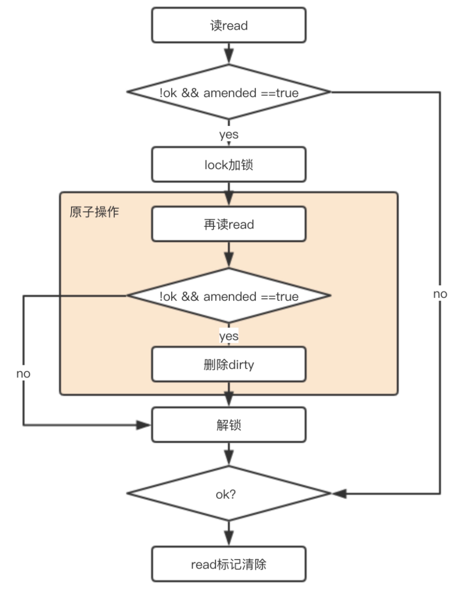

# 面试可能问的高阶知识

## sync.Map【搞不明白】

> sync/atomic
>
> 原子操作就是指该操作是不可分割的，在执行完毕之前不会被其他的任务或者事件中断，该操作的内部不能被高层的操作发现并分割执行，处理器会首先保证我们这些操作内存的原子性，也就是说**当向该内存地址写入或者读取数据的时候，其他的操作无法获取该内存的地址，也就是保证了该内存所保存数据的正确性**。
>
> 在 sync/atomic 中提供了许多原子操作支持，主要有五大类：
>
> 1. Load
>
>    接收一个地址，并返回该地址中的数据。
>
> 2. Store
>
>    Store一类的方法接收两个参数，一个是保存数据的地址，另外一个是要保存的值
>    该类主要负责将对应的值保存在相应的内存地址中
>
> 3. Add
>
>    Add 一类的方法接收两个参数，一个是保存数据的地址，一个是需要加上的数据，而后返回一个处理后的值
>    （不应看作 Load 和 Store 的结合，因为是原子的）
>
>    ```go
>    func main() {
>        var n int32
>        var wg sync.WaitGroup
>        for i := 0; i < 1000; i++ {
>            wg.Add(1)
>            go func() {
>                atomic.AddInt32(&n, 1)  
>                wg.Done()
>            }()
>        }
>        wg.Wait()
>    
>        fmt.Println(atomic.LoadInt32(&n)) // 1000
>    }
>    ```
>
> 4. Swap
>
>    Swap 一类的方法接收两个参数，一个是保存数据的地址，一个是新的数据，函数会**返回该地址原本保存的数据**并保存新数据
>
> 5. CompareAndSwap
>
>    先比较旧数据和地址中保存数据的值，如果相同的话，执行Swap，把新的数值保存在地址中，返回true，如果不同，那么直接返回false

```go
type Map struct {
	mu sync.Mutex
	read atomic.Value // readOnly
	dirty map[interface{}]*entry
	misses int
}

type readOnly struct {
	m       map[interface{}]*entry
	amended bool // true if the dirty map contains some key not in m.
}

// expunged is an arbitrary pointer that marks entries which have been deleted
// from the dirty map.
var expunged = unsafe.Pointer(new(interface{}))

// An entry is a slot in the map corresponding to a particular key.
// 虽然前文 read 和 dirty 存在冗余的情况，但是由于 value 都是指针类型，其实存储的空间其实没增加多少。
// 个人猜测：而且每次将 readOnly 都原子的读出来，包含数据在里面的话太大了，所以要用指针？
type entry struct {
	p unsafe.Pointer // *interface{}
}
func (e *entry) load() (value interface{}, ok bool) {
	p := atomic.LoadPointer(&e.p)
	if p == nil || p == expunged {
		return nil, false
	}
	return *(*interface{})(p), true
}
```

总体思想：

1. 空间换时间。 通过冗余的两个数据结构(read、dirty),实现加锁对性能的影响。
2. 使用只读数据(read)，避免读写冲突。
3. **动态调整，miss 次数多了之后，将 dirty 数据提升为read。**
4. double-checking。
5. 延迟删除。 **删除一个键值只是打标记，只有在提升 dirty 的时候才清理删除的数据。**
6. 优先从 read 读取、更新、删除，**因为对 read 的读取不需要锁**。

具体函数的实现逻辑：

1. 查询 Load

   **流程：先 read 里面读，如果没读到，再去 dirty 里面找。**

   写操作只会操作 dirty，所以保证了 dirty 是最新的，并且数据集是肯定包含 read 的。（可能有疑问，dirty 不是下一步就置为 nil 了，为何还包含？后文会有解释。）

   

   ```go
   func (m *Map) Load(key interface{}) (value interface{}, ok bool) {
       // 因read只读，线程安全，优先读取
       read, _ := m.read.Load().(readOnly)
       e, ok := read.m[key]
       
       // 如果read没有，并且dirty有新数据，那么去dirty中查找 （如果既没有读到，dirty 又没有新数据，那肯定不存在了）
       if !ok && read.amended {
           m.mu.Lock()
           // 双重检查（原因是前文的if判断和加锁非原子的，害怕这中间发生故事）
           read, _ = m.read.Load().(readOnly)
           e, ok = read.m[key]
           
           // 如果read中还是不存在，并且dirty中有新数据
           if !ok && read.amended {
               e, ok = m.dirty[key]
               // m计数+1
               m.missLocked()
           }
           
           m.mu.Unlock()
       }
       
       if !ok {
           return nil, false
       }
       return e.load()
   }
   
   func (m *Map) missLocked() {
       m.misses++
       if m.misses < len(m.dirty) {
           return
       }
       
       // 将dirty置给read，因为穿透概率太大了(耗时不算特别大吧)
       m.read.Store(readOnly{m: m.dirty})
       m.dirty = nil
       m.misses = 0
   }
   
   func (e *entry) load() (value interface{}, ok bool) {
   	p := atomic.LoadPointer(&e.p)
   	if p == nil || p == expunged {
   		return nil, false
   	}
   	return *(*interface{})(p), true
   }
   ```

2. 删除 Delete

   **流程：先检查是不是存在（read 和 amended）**，如果存在开始删除流程。**把 dirty 中的删除，把 read 标记删除。**

   + 为什么 dirty 是直接删除，而 read 是标记删除？

     read 的作用是在 dirty 前充当一种快速缓存？

     遇到相同元素的时候为了不穿透到 dirty，所以采用标记的方式。有点像缓存中处理未命中情况的处理办法。
     正是因为这样的机制+amended的标记，可以保证 read 找不到 && amended=false 的时候，dirty 中肯定找不到。

   + 为什么 dirty 是可以直接删除，而没有先进行读取存在后删除？

     删除成本低。读一次需要寻找，删除也需要寻找，无需重复操作。

   + 如何进行标记的？

     将值置为nil。（这个很关键）

   

   ```go
   func (m *Map) Delete(key interface{}) {
       // 读出read，断言为readOnly类型
       read, _ := m.read.Load().(readOnly)
       e, ok := read.m[key]
       // 如果read中没有，并且dirty中有新元素，那么就去dirty中去找。这里用到了amended，当read与dirty不同时为true，说明dirty中有read没有的数据。
       
       if !ok && read.amended {
           m.mu.Lock()
           // 再检查一次，因为前文的判断和锁不是原子操作，防止期间发生了变化。
           read, _ = m.read.Load().(readOnly)
           e, ok = read.m[key]
           
           if !ok && read.amended {
               // 直接删除
               delete(m.dirty, key)
           }
           m.mu.Unlock()
       }
       
       if ok {
       // 如果read中存在该key，则将该value 赋值nil（采用标记的方式删除！）
           e.delete()
       }
   }
   
   func (e *entry) delete() (hadValue bool) {
       for {
       	// 再次再一把数据的指针
           p := atomic.LoadPointer(&e.p)
           if p == nil || p == expunged {
               return false
           }
           
           // 原子操作
           if atomic.CompareAndSwapPointer(&e.p, p, nil) {
               return true
           }
       }
   }
   ```

3. 增加 or 修改 Store()


```go
func (m *Map) Store(key, value interface{}) {
    // 如果m.read存在这个key，并且没有被标记删除，则尝试更新。
    read, _ := m.read.Load().(readOnly)
    if e, ok := read.m[key]; ok && e.tryStore(&value) {
        return
    }
    
    // 如果read不存在或者已经被标记删除
    m.mu.Lock()
    read, _ = m.read.Load().(readOnly)
   
    if e, ok := read.m[key]; ok { // read 存在该key
    // 如果entry被标记expunge，则表明dirty没有key，可添加入dirty，并更新entry。
        if e.unexpungeLocked() { 
            // 加入dirty中，这儿是指针
            m.dirty[key] = e
        }
        // 更新value值
        e.storeLocked(&value) 
        
    } else if e, ok := m.dirty[key]; ok { // dirty 存在该key，更新
        e.storeLocked(&value)
        
    } else { // read 和 dirty都没有
        // 如果read与dirty相同，则触发一次dirty刷新（因为当read重置的时候，dirty已置为nil了）
        if !read.amended { 
            // 将read中未删除的数据加入到dirty中
            m.dirtyLocked() 
            // amended标记为read与dirty不相同，因为后面即将加入新数据。
            m.read.Store(readOnly{m: read.m, amended: true})
        }
        m.dirty[key] = newEntry(value) 
    }
    m.mu.Unlock()
}

// 将read中未删除的数据加入到dirty中
func (m *Map) dirtyLocked() {
    if m.dirty != nil {
        return
    }
    
    read, _ := m.read.Load().(readOnly)
    m.dirty = make(map[interface{}]*entry, len(read.m))
    
    // 遍历read。
    for k, e := range read.m {
        // 通过此次操作，dirty中的元素都是未被删除的，可见标记为expunged的元素不在dirty中！！！
        if !e.tryExpungeLocked() {
            m.dirty[k] = e
        }
    }
}

// 判断entry是否被标记删除，并且将标记为nil的entry更新标记为expunge
func (e *entry) tryExpungeLocked() (isExpunged bool) {
    p := atomic.LoadPointer(&e.p)
    
    for p == nil {
        // 将已经删除标记为nil的数据标记为expunged
        if atomic.CompareAndSwapPointer(&e.p, nil, expunged) {
            return true
        }
        p = atomic.LoadPointer(&e.p)
    }
    return p == expunged
}

// 对entry尝试更新 （原子cas操作）
func (e *entry) tryStore(i *interface{}) bool {
    p := atomic.LoadPointer(&e.p)
    if p == expunged {
        return false
    }
    for {
        if atomic.CompareAndSwapPointer(&e.p, p, unsafe.Pointer(i)) {
            return true
        }
        p = atomic.LoadPointer(&e.p)
        if p == expunged {
            return false
        }
    }
}

// read里 将标记为expunge的更新为nil
func (e *entry) unexpungeLocked() (wasExpunged bool) {
    return atomic.CompareAndSwapPointer(&e.p, expunged, nil)
}

// 更新entry
func (e *entry) storeLocked(i *interface{}) {
    atomic.StorePointer(&e.p, unsafe.Pointer(i))
}

```

