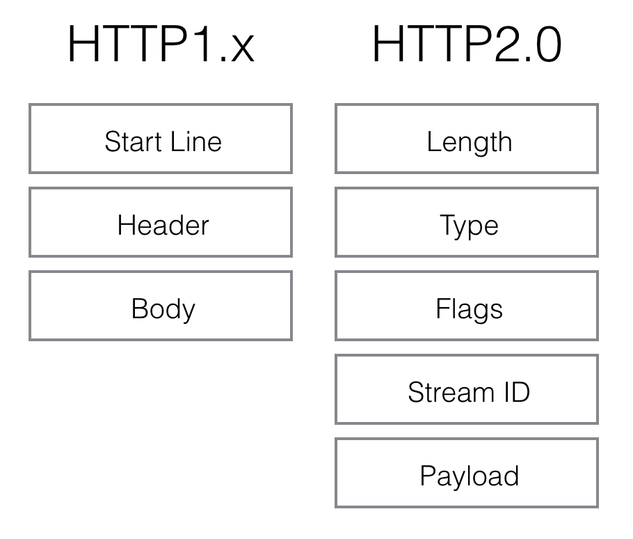
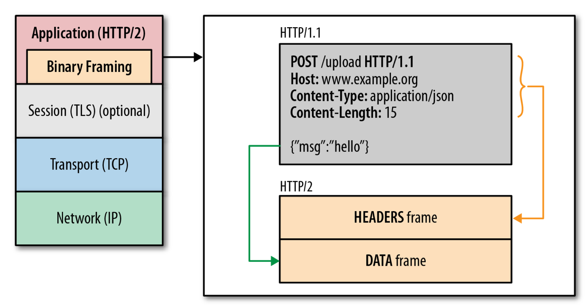
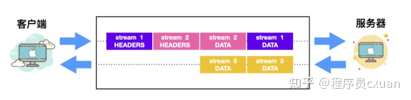
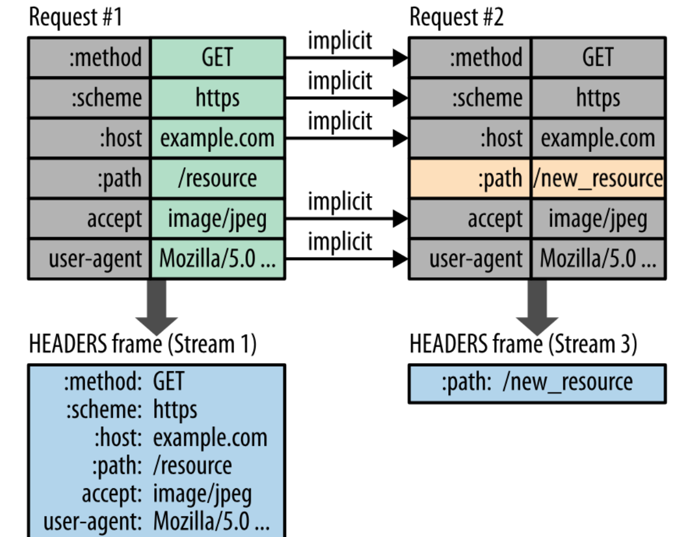

# HTTP 概览
## 不保存状态
Http 是不保存状态的协议，即无状态协议。HTTP 协议自身不对请求和响应之间的通信状态进行保存。在 HTTP 这个级别，协议对于发送过的请求和响应都不做持久化处理。（之后引入了 cookie, token 等）

## Http 中的方法
1. GET：用于获取资源
2. POST：传输实体主体（虽然 GET 也可以用于传输，但是一般不用）
3. DELETE：删除文件
4. PUT：传输文件。和 POST 的区别在于其一般有幂等性 [https://www.zhihu.com/question/48482736](https://www.zhihu.com/question/48482736)
5. HEAD: 和 GET 一样，但是只获得报文首部，不返回主体部分。一般用于确认 URI 有效性和资源更新的时间日期等等
6. OPTIONS：询问支持的方法
7. TRACE：追踪路径
8. CONNECT：要求和代理服务器通信时建立隧道，和隧道进行 TCP 通信。通信时使用  SSL/TSL 加密。

## 持久连接以节省通信量：
   1. 持久连接：只有任意一端没有明确提出断开连接，则保持 TCP 连接状态。减少了 TCP 连接的重复建立和断开带来的开销。必须通信的双方都支持。
   2. 管线化：发送请求后不需要等待并收到响应，直接发送下一个请求。如请求一个包含 10 张图片的 HTML Web 界面，不需要传完一张图再传下一张图。

## URI 与 URL
[https://www.zhihu.com/question/21950864/answer/28847598](https://www.zhihu.com/question/21950864/answer/28847598)

URI 在于I(Identifier)是统一资源标示符，可以唯一标识一个资源。

URL在于Locater，一般来说（URL）统一资源定位符，可以提供找到该资源的路径，比如 `http://www.zhihu.com/question/21950864`，但URL又是URI，因为它可以标识一个资源，所以URL又是URI的子集。

举个是个URI但不是URL的例子：`urn:isbn:0-486-27557-4`，这个是一本书的isbn，可以唯一标识这本书，更确切说这个是URN。

总的来说，locators are also identifiers, so every URL is also a URI, but there are URIs

## HTTP 1.0、1.1、2.0

+ HTTP 1.0

  + HTTP 1.0 规定浏览器与服务器只保持短暂的连接，浏览器的每次请求都需要与服务器建立一个 TCP 连接，服务器完成请求处理后立即断开 TCP 连接，服务器不跟踪每个客户也不记录过去的请求。
  + 由于HTTP 1.0 规定下一个请求必须在前一个请求响应到达之前才能发送，假设前一个请求响应一直不到达，那么下一个请求就不发送，后面的请求就阻塞了。

+ HTTP 1.1

  + HTTP 1.1 支持持久连接（HTTP/1.1 的默认模式使用带流水线的持久连接 KEEP-ALIVE），在一个TCP连接上可以传送多个HTTP请求和响应，减少了建立和关闭连接的消耗和延迟。
  + HTTP 1.1 支持请求**管道化**（`pipelining`），允许客户端不用等待上一次请求结果返回，就可以发出下一次请求，但服务器端必须按照接收到客户端请求的先后顺序依次回送响应结果，以保证客户端能够区分出每次请求的响应内容（所以还是可能会有队头阻塞，所以这个功能基本不用，现在浏览器厂商通常使用多个 TCP 连接）

+ HTTP 2.0

  + 二进制分帧：http1.x 诞生的时候是明文协议，其格式由三部分组成：start line（request line或者status line），header，body。文本解析天然慢。

    http2.0的协议解析决定采用二进制格式，实现方便且健壮。length定义了整个frame的开始到结束，type定义frame的类型（一共10种），flags用bit位定义一些重要的参数，stream id用作流控制，剩下的payload就是request的正文了。

    

    

  + 多路复用：客户端与服务器之间也只需要一个连接即可，节省了连接建立的开销。这样即使来自很多流的数据包也能够混合在一起通过同样连接传输，再根据不同帧首部的 stream id 标识符重新连接将不同的数据流进行组装。

    

  + 服务端推送：在客户端请求一个资源时，会把相关的资源一起发送给客户端，客户端就不需要再次发起请求了。例如客户端请求 page.html 页面，服务端就把 script.js 和 style.css 等与之相关的资源一起发给客户端。

  + 首部压缩：HTTP/2.0 要求客户端和服务器同时维护和更新一个包含之前见过的首部字段表，不变的就不传了。从而避免了重复传输。

    