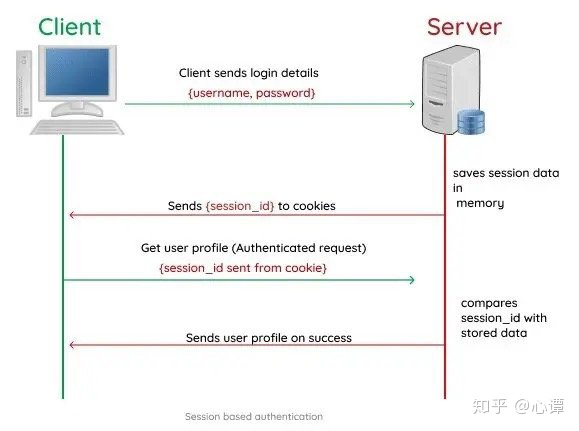
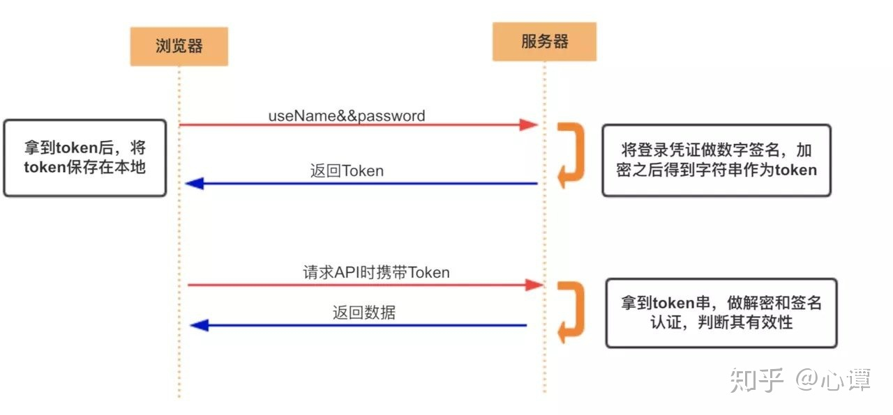
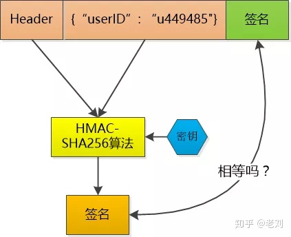
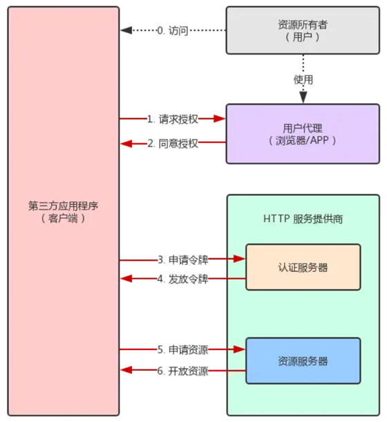

# HTTP 的用户身份认证

## BASIC 认证

HTTP 1.0 时代的认证方式。当资源需要认证时，服务器返回带有 WWW-Authenticate 首部的 401 响应，要求认证。客户端将字符串 `username:password` 用 Base64 编码之后传输给服务器。服务器再进行校验。

base64 编码并非加密，任何人都可以解码，所以不安全。此外，一般浏览器不支持注销操作。

## DIGEST 认证

HTTP 1.1 开始有的。服务器先发送一个质询码，用户用凭证在本地计算之后得到响应码，直接传输响应码。相比 BASIC 认证更安全。

## SSL 客户端认证

相较于凭证的泄露风险，SSL 客户端认证借助**客户端证书**可以防范这种问题。这一步实际上验证客户端的机器是否合法，但是仍不能确保使用者是用户本人。

## 表单认证

并不是由 HTTP 协议所定义的认证方式。将用户的ID密码等登录信息以表单形式提交给后端服务器。现有的认证基本都是基于表单的认证。

表单认证通常和 session/token 结合起来。
[https://blog.csdn.net/whl190412/article/details/90024671?utm_medium=distribute.pc_relevant.none-task-blog-baidujs_title-2&spm=1001.2101.3001.4242]()

+ session: 服务器验证之后，给该用户生成一个**识别码** session 返回给用户，并且将该 session 记录在服务端。客户端收到 session 后存在本地，之后的请求里都需要带上 session 用于证明自己的身份。服务器通过查询 session 得到对应的用户名、认证状态等信息。
+ token: 服务器验证用户的用户名密码之后，发送一个 token 给客户端，token 内包含用户名等自定义信息。token 的生成过程是私有的。后续的用户活动都需要带上 token，服务器**解析该 token** 来验证请求是否合法，是否有该权限。

需要说明的是，如果 session/token 被盗，服务器是无法阻止的。

## Token Cookie Session

> https://www.cnblogs.com/ityouknow/p/10856177.html

### Cookie

cookie 是以 K-V 形式，**存储在浏览器中**一种数据。通常可以**由服务器下令设置**，客户端浏览器根据协议自动保存。它拥有 maxAge、domain、path 等属性，借助这些属性，可以实现父子域名之间的数据传递。

单纯的使用 cookie，需要**将用户的身份信息、权限等保存在客户端**，并**不安全**。除此之外，cookie 还有**大小限制**，以及只能使用字符串类型作为 value 值。

### Session

Session 机制准确来说，也是通过 K-V 数据格式来保存状态。其中：

- Key：也称 SessionID，保存在客户端浏览器。（比如可以存在 cookie 里，浏览器禁用了 cookie 也可以存在 localstorage等地并以Post等方式传输）
- Value：也称“Session”，保存在服务端。

**session 传输数据少，数据结构灵活**：相较于 cookie 来说，session 存储在服务端，可以存任意数据类型，客户端仅保留换取 session 的用户凭证。因此传输数据量小，速度快。

**session 更安全**：检验、生成、验证都是在服务端按照指定规则完成，而 cookie 可能被客户端通过 js 代码篡改。

**session 的不足**：服务器是有状态的。多台后端服务器无法共享 session。解决方法是：

+ 根据一定策略，让一个用户浏览器的请求每次都分配到同一台服务器（万一这台服务器挂了就不好了）
+ 专门准备一台 session 服务器，关于 session 的所有操作都交给它来调用。不过这样也有瓶颈呢。

### Token

- 用户尝试登陆
- 登陆成功后，后端依靠加密算法，将凭证生成 token，返回给客户端
- 客户端保存 token，每次发送请求时，携带 token
- 后端再接收到带有 token 的请求时，验证 token 的有效性

优势有：

+ 服务器是无状态的，减少存储压力

+ 安全：能够一定程度上防止 CSRF(跨站请求伪造)，因为访问一个同样的域名会自动带上所有 cookie，而 token 通常存在 localstorage，不会有这个问题。即使在客户端使用 cookie 存储 token，cookie也仅仅是一个存储机制而不被拿来主动认证。（比如我只解析 POST 传过来的 token，不看 cookie）。且 token 是有时效的。

+ 可扩展：

#### JWT

> 还分不清 Cookie、Session、Token、JWT？ - 老刘的文章 - 知乎
> https://zhuanlan.zhihu.com/p/164696755

JSON Web Token（简称 JWT）是一种**认证授权机制**。可以使用 HMAC 算法或者是 RSA 的公/私秘钥对 JWT 进行签名。JWT 的声明一般被用来在身份提供者和服务提供者间传递被认证的用户身份信息，以便于从资源服务器获取资源因为数字签名的存在，这些传递的信息是可信的。

缺点：无法主动使 token 失效。

优点：

+ 可以用来做单点登录【**在多个系统中，用户只需一次登录，各个系统即可感知该用户已经登录**，不是说只能在一个地方登录！】

+ 服务端不需要去存储已经登录的用户，只需要校验就可以了

JSON Web Token由三部分组成，它们之间用圆点(.)连接。这三部分分别是：

- Header
  
  + token的类型（“JWT”）
  
  + 算法名称（比如：HMAC SHA256或者 RSA 等等）。
  
  用 Base64 对这个 JSON 编码就得到 JWT 的第一部分

- Payload
  包含声明（要求）。声明是关于实体(通常是用户)和其他数据的声明。
  
  - 可以包含 颁发者、过期时间等信息
  - 也可以自定义信息
  
  对 payload 进行 Base64 编码就得到 JWT 的第二部分

- Signature
  
  为了得到签名部分，你必须有编码过的 header、编码过的 payload、一个秘钥
  
  签名算法是 header 中指定的那个，然对它们签名即可。
  
  例如：
  
  > HMACSHA256(base64UrlEncode(header) + "." + base64UrlEncode(payload), secret)

签名是用于验证消息在传递过程中**有没有被更改**，并且，对于使用私钥签名的 token，它还可以验证 JWT 的发送方是否为它所称的发送方。

### OpenID & OAuth

> OpenID 和 OAuth 有什么区别？ - biaodianfu的回答 - 知乎 https://www.zhihu.com/question/19628327/answer/23291315

#### OpenID：用于认证

1. 用户希望访问其在http://example.com的账户
2. http://[example.com](https://www.zhihu.com/search?q=example.com&search_source=Entity&hybrid_search_source=Entity&hybrid_search_extra={"sourceType"%3A"answer"%2C"sourceId"%3A"23291315"}) (在OpenID的黑话里面被称为“Relying Party”) 提示用户输入他/她/它的OpenID
3. 用户给出了他的OpenID，比如说”[http://user.myopenid.com](https://link.zhihu.com/?target=http%3A//user.myopenid.com)”
4. http://example.com 跳转到了用户的OpenID提供商“mypopenid.com”
5. 用户在”myopenid.com”(OpenID provider)提示的界面上输入用户名密码登录
6. “myopenid.com” (OpenID provider) 问用户是否要登录到http://example.com
7. 用户同意后，”myopenid.com” (OpenID provider) 跳转回http://example.com
8. http://example.com 允许用户访问其帐号

> 国内不普遍噢
> 
> OpenID不具备普遍的使用性，大家还得去注册一个OpenID才能用上这个接口登录。。。国内来说:QQ号码如果作为OpenID将会有很大的潜力

#### OAuth：用于授权

