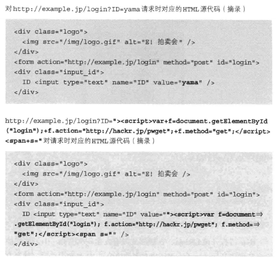
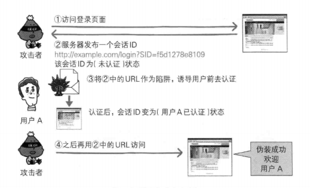

# Web 攻击
## 主动攻击
攻击者直接访问 Web 应用，传入攻击代码。目的是对服务器资源进行攻击。
+ SQL 注入攻击  
通过输入精心构造的数据，使得拼接 SQL 之后得到意想不到的效果

+ OS 命令注入攻击
通过输入精心构造的数据，使得服务器执行意想不到的脚本

## 被动攻击
诱导其他用户触发陷阱，在其浏览器中运行恶意代码，篡改用户的 HTTP 请求，导致 Cookie 等个人信息泄露，登陆状态中的用户权限遭到恶意滥用。  
尤其需要注意的是，如果此时用户通过 VPN 等方式访问了某企业内网，则内网信息也会外泄。
+ 跨站脚本攻击（Cross-Site Scripting, XSS）  
通过存在安全漏洞的网站的用户的浏览器内运行非法 HTML 标签或 JS 进行攻击。如：
  + 利用虚假的输入表单骗取用户个人信息
  + 利用脚本窃取用户的 Cookie 值
  + 显示伪造的文章或图片  
  
  一般来说，都是通过在 URL 等处置入恶意 JS 代码，向外泄露了信息。
  
  
  

  需要指出的是，就算不触发这些代码，也有可能仅仅是把 Cookie 存放在 local storage 中，就被恶意 JS 读取泄露。

+ 会话固定攻击


+ 跨站点请求伪造（Cross-Site Request Forgeries, CSRF）  
  [https://zhuanlan.zhihu.com/p/37293032](https://zhuanlan.zhihu.com/p/37293032)  
  挟制用户在当前已登录的Web应用程序上执行非本意的操作。攻击者通过一些技术手段欺骗用户的浏览器去访问一个自己曾经认证过的网站并运行一些操作（如发邮件，发消息，甚至财产操作如转账和购买商品）。由于浏览器曾经认证过，所以被访问的网站会认为是真正的用户操作而去运行。这利用了web中用户身份验证的一个漏洞：简单的身份验证只能保证请求发自某个用户的浏览器，却不能保证请求本身是用户自愿发出的。  

  跟跨站脚本攻击（XSS）相比，XSS 利用的是用户对指定网站的信任，CSRF 利用的是网站对用户网页浏览器的信任。

  > 假如一家银行用以运行转账操作的URL地址如下：http://www.examplebank.com/withdraw?account=AccoutName&amount=1000&for=PayeeName
  >
  > 那么，一个恶意攻击者可以在另一个网站上放置如下代码： 
  > ```
  >  amount=1000&for=Badman">
  > ```
  > 如果有账户名为Alice的用户访问了恶意站点，而她之前刚访问过银行不久，登录信息尚未过期，那么她就会损失1000资金。

  防御措施:
  + 检查Referer字段：HTTP头中有一个Referer字段，这个字段用以标明请求来源于哪个地址。在处理敏感数据请求时，通常来说，Referer字段应和请求的地址位于同一域名下。以上文银行操作为例，Referer字段地址通常应该是转账按钮所在的网页地址，应该也位于 www.examplebank.com 之下。而如果是CSRF攻击传来的请求，Referer字段会是包含恶意网址的地址，不会位于 www.examplebank.com 之下，这时候服务器就能识别出恶意的访问
  + 添加校验token：要求用户浏览器提供不保存在cookie中，并且攻击者无法伪造的数据作为校验。