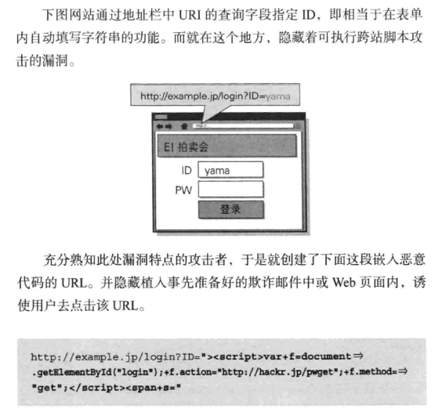
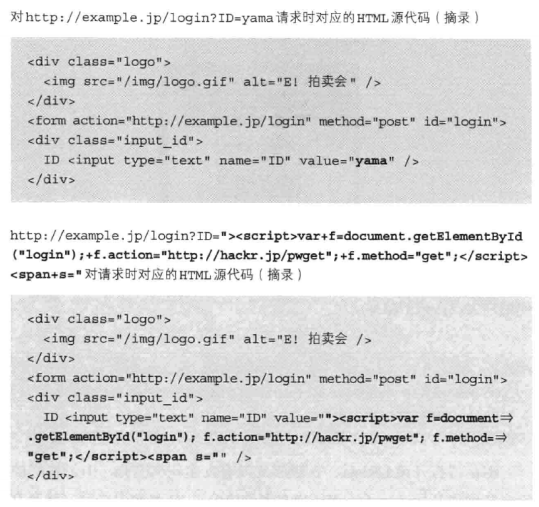
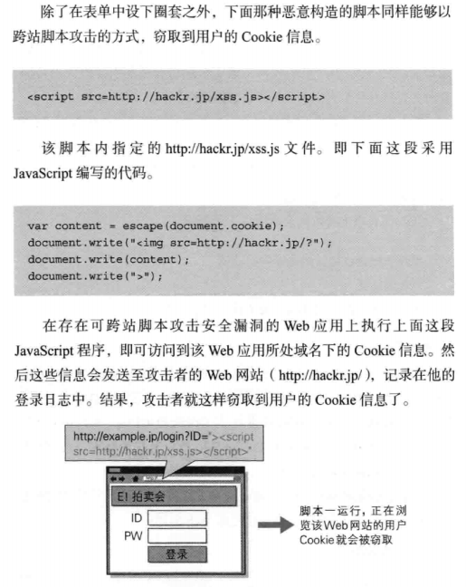

# Web 及网络基础
## TCP/IP 协议簇
+ 应用层：向用户提供各种应用服务的通信协议，如 FTP DNS HTTP
+ 传输层：服务应用层，提供 **两台计算机之间的** 数据传输。将上层数据划分为 **报文** 并传输。有 TCP 和 UDP
+ 网络层：处理网路中的 **数据包**，边搜索路径边传输
+ 链路层：连接网络的硬件或处理硬件的部分。如网卡等硬件的驱动、网卡本身、光纤等。

# HTTP 概览
1. Http 是不保存状态的协议，即无状态协议。HTTP 协议自身不对请求和响应之间的通信状态进行保存。在 HTTP 这个级别，协议对于发送过的请求和响应都不做持久化处理。（之后引入了 cookie, token 等）
2. Http 中的方法
   1. GET：用于获取资源
   2. POST：传输实体主体（虽然 GET 也可以用于传输，但是一般不用）
   3. DELETE：删除文件
   4. PUT：传输文件。和 POST 的区别在于其一般有幂等性 [https://www.zhihu.com/question/48482736](https://www.zhihu.com/question/48482736)
   5. HEAD: 和 GET 一样，但是只获得报文首部，不返回主体部分。一般用于确认 URI 有效性和资源更新的时间日期等等
   6. OPTIONS：询问支持的方法
   7. TRACE：追踪路径
   8. CONNECT：要求和代理服务器通信时建立隧道，和隧道进行 TCP 通信。通信时使用  SSL/TSL 加密。
3. 持久连接以节省通信量：
   1. 持久连接：只有任意一端没有明确提出断开连接，则保持 TCP 连接状态。减少了 TCP 连接的重复建立和断开带来的开销。必须通信的双方都支持。
   2. 管线化：发送请求后不需要等待并收到响应，直接发送下一个请求。如请求一个包含 10 张图片的 HTML Web 界面，不需要传完一张图再传下一张图。

## URI 与 URL
[https://www.zhihu.com/question/21950864/answer/28847598](https://www.zhihu.com/question/21950864/answer/28847598)

URI 在于I(Identifier)是统一资源标示符，可以唯一标识一个资源。

URL在于Locater，一般来说（URL）统一资源定位符，可以提供找到该资源的路径，比如http://www.zhihu.com/question/21950864，但URL又是URI，因为它可以标识一个资源，所以URL又是URI的子集。

举个是个URI但不是URL的例子：urn:isbn:0-486-27557-4，这个是一本书的isbn，可以唯一标识这本书，更确切说这个是URN。

总的来说，locators are also identifiers, so every URL is also a URI, but there are URIs

# HTTP 报文中的 HTTP 信息
HTTP 报文用于 HTTP 协议交互信息。分为请求报文和响应报文。报文可分为**报文首部**和**报文主体**两部分。使用 CR+LF 符分开。

## 报文首部
请求报文分为：请求行，请求首部字段，通用首部字段，实体首部字段，其他  
响应报文分为：状态行，相应首部字段，通用首部字段，实体首部字段，其他  

+ 请求行：包含用于请求的方法，请求 URL 和 HTTP 版本，如：
  + `GET / HTTP/1.1`
+ 状态行：包含表明响应结果的状态码，原因短语和 HTTP 版本，如：
  + `HTTP/1.1 200 OK`
+ 首部字段：包含请求和响应的各种条件与属性的字段
+ 其他：一些 RFC 中未定义的首部信息，如 Cookie

## 报文编码与解码
HTTP 报文传输过程中，可以原样传输，但是可能比较大。也可以编码压缩之后传输，但是这样需要编码解码，消耗一定的 CPU 资源。这涉及到两个概念：

+ 报文：HTTP 基本通信单位，由 8-bit 字节流组成。
+ 实体：请求或相应的有效载荷数据，包括实体首部和实体主体

报文主体用于传输实体主体。在非压缩的情况下，`报文主体==实体主体`，编码之后会导致差异。HTTP协议中的内容编码功能会指明在实体内容上的编码格式，由接收端负责解码。常用的内容编码包括：`gzip` 等。

若实体资源没有传输完成，不能进行解码，所以传输大量内容时，浏览器会很长一段时间不能显示任何内容。所以，可以使用分割发送的**分块传输编码**，能够让浏览器逐个解码，逐渐显示页面。每一块都会标记块的大小，最后一块会有结束标志。

## 报文中的 多部分对象集合
HTTP 采用了**多部分对象集合**(multipart)，报文主体中含有多类型实体，可以容纳多种类型的多份实体内容。多部分对象集合包含的对象如下：
+ multipart/form-data：Web 表单文件上传时使用
  ```
  Content-Type: multipart/form-data; boundary=Aab03x

  --AaB03x
  Content-Disposition: form-data; name="field"

  Joe Blow
  --AaB03x
  Content-Disposition: form-data; name="pics"; filename="file.txt"
  Content-Type: text/plain

  …(file1.txt的数据)…
  --AaB03x--
  ```
+ multipart/byteranges：响应报文 206(Partial Content) 包含了多个范围的内容的时候是使用
  ```
  HTTP/1.1 206 Partial Context
  ……
  Content-Type: multipart/byteranges; boundary=THIS_STRING

  --THIS_STRING
  Content-Type: application/pdf
  Content-Range: bytes 500-999/8000

  …(指定范围的数据)…
  --THIS_STRING
  Content-Type: application/pdf
  Content-Range: bytes 7000-7999/8000

  …(指定范围的数据)…
  --THIS_STRING--
  ```

HTTP 报文中需要使用多部分对象集合时，需要在首部字段加上 Content-type 首部字段 和指定 boundary 字符串用来划分多部分对象集合的各类实体。多部分对象集合的每个部分类型中，都可以含有首部字段，或嵌套多类型对象集合。

## 范围请求：获取部分内容
为了支持断点续传，需要支持指定下载的实体范围，这种请求叫范围请求。
范围请求的响应如上节示例中的 `Content-Range: bytes 500-999/8000`。

范围请求会返回状态码 206 Partial Content，对于多重的范围请求HTTP 首部中标明 `Content-Type: multipart/byteranges`。如果服务器无法响应范围请求，会返回状态码 200 OK 和完整的实体内容。

## 内容协商：返回最合适的内容
同一个网站可能存在多份相同内容的页面，如中文版或英文版、PC 版或手机版。

通过内容协商机制，基于语言、字符集、编码方式等进行判断，返回最合适的内容。请求报文中的某些首部字段就有这样的作用：`Accept, Accept-Charset, Accept-Encoding, Accept-Language, Content-Language`

# 状态行
HTTP 相应报文中所包含的状态，大致分为五类，常用的只有十四多种
+ 1XX：信息性状态码
+ 2XX：成功状态码。请求正常处理完毕
  + 200 OK：请求正常处理
  + 204 No Content：请求处理成功，但是没有资源需要返回，i.e., 没有实体主体。用于只需要客户端向服务器发送请求。
  + 206 Partial Content：范围请求。用于响应范围请求。
+ 3XX：重定向状态码。需要附加操作
  + 301 Moved Permanently：该资源的 URL 被永久性重定向了。在 Location 首部中会给出该资源新的 URL。
  + 302 Found 或 307 Temporary Redirect：临时重定向。
  + 303 See Other：由于资源对应着另一个 URL，明确表示客户端应该使用 **GET** 去访问新的 URL。类似 302，但是指明了 **Get**。
  + 304 Not Modified：客户端发出请求之前，发现本地有 cache，那么会发送请求的时候带上一个 `If-Modified-Since: XXX 时间` 等条件。如果服务端检查后发现，自从上次请求后，请求的网页未修改过，那么服务器返回 304 响应时，不会返回网页内容。
+ 4XX：客户端错误状态码。服务器无法处理客户端的该请求。
  + 400 Bad Request：报文请求中存在语法错误
  + 401 Unauthorized：请求要求身份验证。 对于需要登录的网页，服务器可能返回此响应。返回的响应中包含 `WWW-Authenticate` 首部用于质询用户信息。若不是第一次返回该请求，则意味着之前的验证失败。
  + 403 Forbidden：拒绝访问。可以在实体中给出理由，也可以不给出理由。
  + 404 Not Found：无法找到该资源
+ 5XX：服务器错误状态码。服务器处理请求出错。
  + 500 Internal Server Error：服务器端执行请求的时候发生了错误，由 bug 或临时故障导致
  + 503 Service Unavailable：服务器目前超负荷或者停机维护中。若是知道何时恢复，可以在 `Retry-After` 首部中加入该时间

需要注意的是，经常发生不按照错误码返回的情况。就算各种出错，响应报文的装填吗依然是 200 OK，在返回的内容中指明出错（我之前项目就是这么干的，不太好）

# HTTP 首部
HTTP 报文首部必须存在于报文之中，用于客户端与服务器分别处理请求和响应，根据之前所述：
+ 请求报文首部含有：请求行、请求首部字段、通用首部字段、实体首部字体、其他。具体而言：  
  + 请求行：方法（GET/POST 等）、URL、HTTP版本
  + HTTP 首部字段：请求首部字段、通用首部字段、实体首部字段
  + 其他
+ 响应报文首部含有：状态行、响应首部字段、通用首部字段、实体首部字段、其他。具体而言：
  + 状态行：HTTP 版本、状态码
  + HTTP 首部字段：请求首部字段、通用首部字段、实体首部字段
  + 其他
## HTTP 首部字段
HTTP 首部字段用于传递一些重要信息，包含了报文主题大小、语言、认证信息等内容。其是由许多许多 `key:value` 键值对组成的。
### 通用首部字段
+ Cache-Control：用于操作缓存的工作机制
  + 缓存请求指令
    + no-cache：强制向源服务器验证是否有效
    + no-store：机密信息，不缓存请求或响应的任何内容
    + max-age=[秒]：无需确认的缓存时间
    + max-stale=[秒]：接受已过期的响应
    + min-fresh=[秒]：期望在指定时间内的响应一直有效
    + no-transform：代理不可更改媒体类型
    + only-if-cached：从缓存获取资源
    + cache-extension：拓展字段，可以加入一些拓展指令，服务器并不一定能够处理。不能处理时，会忽略。
  + 缓存响应字段
    + public：该缓存公开，可向所有用户提供该缓存
    + private：仅向特定用户返回该缓存
    + no-cache：强制禁止缓存，且源服务器不再提供缓存有效性确认服务
    + no-store：禁止缓存请求或响应的任意部分。
    + s-maxage/maxage：源服务器在一段时间内不提供缓存有效性确认，且保证缓存在该段时间内有效
    + no-transform 请求和响应中，不允许缓存更改实体主体的媒体类型，**防止缓存或代理压缩图片等操作**
    + must-revalidate/proxy-revalidate：源服务器允许代理缓存，但是要求每次认证
    + cache-extension
+ Connecttion
  + 控制代理不再转发的首部字段：代理删除该字段再转发
  + 管理持久连接：客户端要求持久连接：`Connection: Kepp-Alive`，服务器明确表示断开连接：`Connection:close`。**持久连接中，每个连接可以处理多个请求-响应事务。HTTP/1.1 默认使用持久连接**
+ Date：HTTP 报文的时间和日期
+ Pragma：弃用
+ Trailer：在首部中事先说明报文主体中有哪些内容。
+ Transfer-Encoding：指定传输时的编码格式
+ Upgrade：检测 HTTP 及其他协议是否可使用更高的版本进行通信。参数值用来指定新的通信协议。
+ Via：追踪客户端与服务器之间的请求和响应的路径。不仅可用于追踪路径，还可用于防止回路转发。
+ Warning
### 请求首部字段
### 响应首部字段
### 实体首部字段


# 与 HTTP 协作的 Web 服务器
## 单台主机实现多个域名
HTTP/1.1 允许一台服务器上存在多个站点。如果一台服务器内托管了多个站点，当收到请求的时候，域名已经被 DNS 解析为 IP 地址，为了区分不同网站，HTTP 首部内必须**完整**指定主机名或域名 URL

## 通信数据的转发
代理、网关、隧道可以将请求转发给通信链路上的下一站服务器，并且能够接受从那台服务器返回的响应并转发给客户端。
### 代理
接收客户端发送的请求，转发给其他服务器。代理**不改变请求 URL，直接发送给持有资源的目标服务器**。持有资源的服务器称为目标服务器，源服务器的响应经过代理服务器返回给客户端。请求可以经过多台级联服务器。转法师，在 Via 首部标记经过的主机的信息。

代理可用于包括但不限于：
+ 利用缓存技术减少网络带宽流量、缓解源服务器压力
+ 访问控制，记录访问日志

缓存代理：预先将资源副本（缓存）保存在代理服务器上，再次受到对相同资源的请求时，就可以直接返回缓存的资源

透明代理：对请求和响应报文不做任何加工。若对报文内容进行了加工，成为非透明代理。
### 网关
机制和代理很像。但是网关能够**使通信链路上的服务器提供非 HTTP 协议的服务**
。通过网关和源服务器之间的链路加密可以提高安全性，也可以连接数据库执行 SQL 等非 HTTP 协议。
### 隧道
建立一条与其他服务器的加密通信线路，确保安全通信。隧道本身不解析 HTTP 请求，原样转发。隧道对于客户端来说是透明的。

## 缓存
缓存存在有效期，需要根据需要及时与源服务器确认缓存有效性。服务器和客户端都可以有缓存。例如，客户端浏览器的缓存成为 临时网络文件（Temporary Internet File）

# HTTPS
## HTTP 的缺点：
+ 使用明文通信（不加密），内容可能会被窃听  
  请求和响应的传输过程中经过许多第三方设备，不能保证不被窃听。即使机密了，加密之后的报文信息仍然会被看到。总之，最为普及有效的方法就是加密技术：
+ 通信的加密  
  利用 SSL(Secure Socket Layer 安全套接曾) 和 TS(Transport Layer Security 安全传输层协议)
  > Tip: TSL 实际上是 SSL 的升级版。流程与原理如下
  [https://zhuanlan.zhihu.com/p/79113758](https://zhuanlan.zhihu.com/p/79113758)
  + 内容的加密
+ 不验证通信方身份，有可能遭遇伪装   
  任何人都可以进行通信，不能确定服务器或客户端是否被伪装，没有权限控制信息。无意义的请求也照单全收（DDOS）。  
  可使用 SSL 中的证书机制确认身份。
+ 无法验证报文完整性，可能遭到篡改  
  请求和响应在传输途中，遭遇拦截并篡改，也称为“中间人攻击”。  
  可通过 MD5 等 hash 手段来防止篡改。不过如果 MD5 也被篡改，HTTP 就无能为力了。所以可以通过 SSL 中的摘要功能来解决。

## HTTPS
HTTPS = HTTP + 加密 + 认证 + 完整性保护  
HTTPS 是 HTTP 通信接口部分用 SSL/TLS 代替的产物。HTTP 直接和 TCP 通信，HTTPS 则是 HTTPS 和 SSL 通信，间接的和 TCP 通信。
> SSL 是独立于 HTTP 的。包括 SMTP 等协议也可以使用 SSL 加密。

### 加密方式分类
+ 共享密钥加密：加密解密使用同一把密钥，**又称为对称密钥**。但是如何安全的传递密钥成为了难题。
+ 公开密钥加密：公开密钥可以给任何人，私有密钥自己保留。他人使用公开密钥加密文件传出给我方，我方使用私有密钥解密。**又称为非对称密钥**。然而，这只能单向传递信息，且处理速度较慢。

在 HTTPS 中，采用对称密钥和非对称密钥混合的形式。在交换对称密钥的过程中，使用非对称密钥。建立通信后的交换报文阶段使用对称密钥。
> [https://zhuanlan.zhihu.com/p/79113758](https://zhuanlan.zhihu.com/p/79113758)

# HTTP 的用户身份认证
## BASIC 认证  
HTTP 1.0 时代的认证方式。当资源需要认证时，服务器返回带有 WWW-Authenticate 首部的 401 响应，要求认证。客户端将字符串 `username:password` 用 Base64 编码之后传输给服务器。服务器再进行校验。

base64 编码并非加密，任何人都可以解码，所以不安全。此外，一般浏览器不支持注销操作。

## DIGEST 认证
HTTP 1.1 开始有的。服务器先发送一个质询码，用户用凭证在本地计算之后得到响应码，直接传输响应码。相比 BASIC 认证更安全。

## SSL 客户端认证
相较于凭证的泄露风险，SSL 客户端认证借助**客户端证书**可以防范这种问题。这一步实际上验证客户端的机器是否合法，但是仍不能确保使用者是用户本人。

## 表单认证
并不是由 HTTP 协议所定义的认证方式。将用户的ID密码等登录信息以表单形式提交给后端服务器。现有的认证基本都是基于表单的认证。

表单认证通常和 session/token 结合起来。
[https://blog.csdn.net/whl190412/article/details/90024671?utm_medium=distribute.pc_relevant.none-task-blog-baidujs_title-2&spm=1001.2101.3001.4242]()
+ session: 服务器验证之后，给该用户生成一个**识别码** session 返回给用户，并且将该 session 记录在服务端。客户端收到 session 后存在本地，之后的请求里都需要带上 session 用于证明自己的身份。服务器通过查询 session 得到对应的用户名、认证状态等信息。
+ token: 服务器验证用户的用户名密码之后，发送一个 token 给客户端，token 内包含用户名等自定义信息。token 的生成过程是私有的。后续的用户活动都需要带上 token，服务器**解析该 token** 来验证请求是否合法，是否有该权限。

需要说明的是，如果 session/token 被盗，服务器是无法阻止的。

# 基于 HTTP 扩展的协议/技术
Http 存在一些固有的瓶颈。如：一次连接只能处理一次 http 请求、只能由客户端主动向服务器发起请求，服务器只能被动响应、首部臃肿重复、数据并非强制压缩。

## Ajax
Ajax 指：异步 Javascript 及 XML 技术，是一种利用了 JS 和 DOM 的操作，局部替换 Web 界面的技术。通过 XMLHttpRequest API ，可以在加载完成的页面上发起请求，局部更新界面

## Comet
客户端发起试探性的页面更新检测请求，服务器挂起该请求，直到有页面更新，达到了一种假的“推送”效果。然而，维持链接需要消耗资源

## WebSocket
WebSocket 建立在 TCP 之上。WebSocket 协议是一种全双工的通信协议，通信过程中可以传输格式的数据。发起方使用 HTTP 请求建立连接，然后双方切换到 WebSocket 上进行通信。
WebSocket 可以实现
+ 推送功能：服务器直接发送数据
+ 减少通信录：建立连接之后一直保持连接状态，不需要每次传输都重新建立连接。且首部信息很小，也减少了通信量

> WebSocket 的特点可以用于心跳检测

[http://www.ruanyifeng.com/blog/2017/05/websocket.html](http://www.ruanyifeng.com/blog/2017/05/websocket.html)
[https://www.jianshu.com/p/65ef71ddb910](https://www.jianshu.com/p/65ef71ddb910)
 
# 一些 Web 构建技术
## CGI
[https://zhuanlan.zhihu.com/p/25013398](https://zhuanlan.zhihu.com/p/25013398)
[https://blog.csdn.net/guodongxiaren/article/details/50569675](https://blog.csdn.net/guodongxiaren/article/details/50569675)

极其古老的动态网页语言。归根结底 CGI就是一个接口协议，各种语言都可以编写CGI。CGI程序通常部署到 Web 服务器上，Web服务器然后调用CGI程序。

我们看到的网页不是静态网页，也就是说在服务端是没有这个网页文件，它是在网页请求的时候动态生成的，比如PHP/JSP网页。依据你请求的参数不同，所返回的内容不同。同理，如果是请求一个CGI程序的时候（ 比如在浏览器直接输入CGI程序的URL，或者提交表单的时候发送给CGI程序），CGI程序负责解析从前端传递过来的参数，理解它的意图然后返回数据，比如返回HTML、XML或JSON等。

CGI有一大硬伤：每次 HTTP 请求 CGI，Web 服务器都有启动一个新的进程去执行这个CGI程序，即颇具 Unix 特色的 fork-and-execute。当用户请求量大的时候，这个 fork-and-execute 的操作会严重拖慢Web服务器的性能。

## Servlet
[https://www.zhihu.com/question/21416727/answer/690289895](https://www.zhihu.com/question/21416727/answer/690289895)
[https://www.zhihu.com/question/21416727/answer/339012081](https://www.zhihu.com/question/21416727/answer/339012081)

事实上，servlet 就是一个Java 接口。servlet 接口定义的是一套处理网络请求的规范，所有实现 servlet 的类，都需要实现它那五个方法，其中最主要的是两个生命周期方法 init() 和destroy()，还有一个处理请求的 service()，也就是说，所有实现servlet接口的类，或者说，所有想要处理网络请求的类，都需要回答这三个问题：你初始化时要做什么、你销毁时要做什么、你接受到请求时要做什么。这是Java给的一种规范。

> servlet 不会直接和客户端打交道。那请求怎么来到servlet呢？答案是 servlet 容器，比如我们最常用的 tomcat。tomcat 才是与客户端直接打交道的家伙，他监听了端口，请求过来后，根据 url 等信息，确定要将请求交给哪个 servlet 去处理，然后调用那个 servlet 的 service 方法，service 方法返回一个 response 对象，tomcat 再把这个 response 返回给客户端。
> 
> 我们为什么能通过Web服务器映射的URL访问资源？肯定需要写程序处理请求，主要3个过程：
>  + 接收请求
>  + 处理请求
>  + 响应请求
> 
> 需要说明的是，tomcat 是 Web 服务器和 Servlet 容器的组合体。
> + 接收请求和响应请求是共性功能，且没有差异性，完成这一部分工作的是 Web 服务器。
> + 处理请求的逻辑是不同的，这里抽取出来做成Servlet，交给程序员自己编写。

Servlet 对 CGI 的最主要优势在于一个 Servlet 运行于 Servlet 容器中，等待以后的请求。每个请求将生成一个新的线程，而不是一个完整的进程。多个客户能够在同一个进程中同时得到服务。

# Web 攻击
## 主动攻击
攻击者直接访问 Web 应用，传入攻击代码。目的是对服务器资源进行攻击。
+ SQL 注入攻击  
通过输入精心构造的数据，使得拼接 SQL 之后得到意想不到的效果

+ OS 命令注入攻击
通过输入精心构造的数据，使得服务器执行意想不到的脚本

## 被动攻击
诱导其他用户触发陷阱，在其浏览器中运行恶意代码，篡改用户的 HTTP 请求，导致 Cookie 等个人信息泄露，登陆状态中的用户权限遭到恶意滥用。  
尤其需要注意的是，如果此时用户通过 VPN 等方式访问了某企业内网，则内网信息也会外泄。
+ 跨站脚本攻击（Cross-Site Scripting, XSS）  
通过存在安全漏洞的网站的用户的浏览器内运行非法 HTML 标签或 JS 进行攻击。如：
  + 利用虚假的输入表单骗取用户个人信息
  + 利用脚本窃取用户的 Cookie 值
  + 显示伪造的文章或图片  
  
  一般来说，都是通过在 URL 等处置入恶意 JS 代码，向外泄露了信息。
  
  
  

  需要指出的是，就算不触发这些代码，也有可能仅仅是把 Cookie 存放在 local storage 中，就被恶意 JS 读取泄露。

+ 会话固定攻击


+ 跨站点请求伪造（Cross-Site Request Forgeries, CSRF）  
  [https://zhuanlan.zhihu.com/p/37293032](https://zhuanlan.zhihu.com/p/37293032)  
  挟制用户在当前已登录的Web应用程序上执行非本意的操作。攻击者通过一些技术手段欺骗用户的浏览器去访问一个自己曾经认证过的网站并运行一些操作（如发邮件，发消息，甚至财产操作如转账和购买商品）。由于浏览器曾经认证过，所以被访问的网站会认为是真正的用户操作而去运行。这利用了web中用户身份验证的一个漏洞：简单的身份验证只能保证请求发自某个用户的浏览器，却不能保证请求本身是用户自愿发出的。  

  跟跨站脚本攻击（XSS）相比，XSS 利用的是用户对指定网站的信任，CSRF 利用的是网站对用户网页浏览器的信任。

  > 假如一家银行用以运行转账操作的URL地址如下：http://www.examplebank.com/withdraw?account=AccoutName&amount=1000&for=PayeeName
  >
  > 那么，一个恶意攻击者可以在另一个网站上放置如下代码： 
  > ```
  >  amount=1000&for=Badman">
  > ```
  > 如果有账户名为Alice的用户访问了恶意站点，而她之前刚访问过银行不久，登录信息尚未过期，那么她就会损失1000资金。

  防御措施:
  + 检查Referer字段：HTTP头中有一个Referer字段，这个字段用以标明请求来源于哪个地址。在处理敏感数据请求时，通常来说，Referer字段应和请求的地址位于同一域名下。以上文银行操作为例，Referer字段地址通常应该是转账按钮所在的网页地址，应该也位于www.examplebank.com之下。而如果是CSRF攻击传来的请求，Referer字段会是包含恶意网址的地址，不会位于www.examplebank.com之下，这时候服务器就能识别出恶意的访问
  + 添加校验token：要求用户浏览器提供不保存在cookie中，并且攻击者无法伪造的数据作为校验。