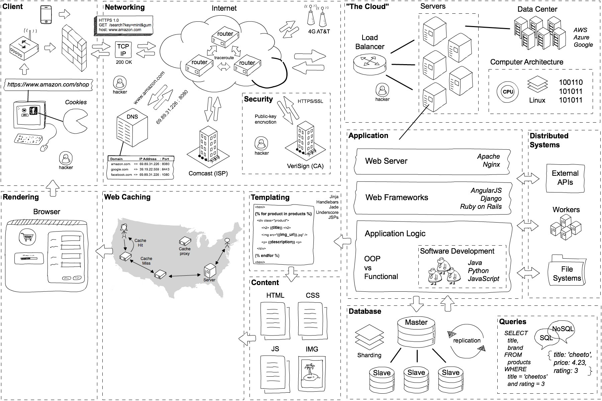

# a day in the life of  web request

当我输入一个网址 `www.seu.edu.cn` 之后，都发生了什么？

0. 查浏览器自身缓存，如果有未过期的数据就直接返回，不需要继续请求网络

1. URL 解析

   格式化检查；如果没有显式写协议名，默认补齐为 `http://www.seu.edu.cn`；封装 HTTP 请求（包括带上 Cookie 之类的）

2. 浏览器通过 DNS 查询服务器 IP 

   缓存 -> hosts -> 本机配置的 DNS 服务器 -> 迭代查询 -> ...

3. 通过 TCP socket API，发出 HTTP 请求

4. 得到 302 响应，要求重定向到 `https://www.seu.edu.cn`。（如何发出请求和得到响应后面再说）

5. 新建立 TCP 连接，首先进行一系列安全协商 -> HTTPS

   1. 通过 TCP 信道，协商 TSL 的版本等信息，包括认证算法、加密算法、数据校验算法、随机码等。
   2. 用 CA 公钥解密服务器证书，确认其真实有效，并得到服务器公钥
   3. 用公钥加密一个随机的字符串，发送给服务器。
   4. 服务器用自己的私钥解密，得到这个随机的字符串
   5. 根据相同的随机字符串，之前协商好的算法、随机码等等，各自推导出相同的对称密钥和HMAC Key（主要用于保护数据的完整性）

6. 浏览器通过 TCP socket API 发出 HTTP 请求（基于 HTTPS），TCP 包需要封装成 IP 数据报（分组），通过 Internet 发给服务器。

   1. 途径路由器的时候，根据 IP 地址进行路由选择，找到下一条的 IP 地址和端口，再封装成链路层的帧，发送出去
   1. 这时候有一个问题，封装成链路层的帧的时候，只知道下一跳的 IP 但是不知道它的 MAC 啊喂。所以需要通过 ARP 获得下一跳的 MAC 地址。
   1. 网卡获得到帧之后，加上用于检测错误的帧校验序列，转换成电信号发送出去。
   
   > 上述过程中，**源 IP 和目标 IP 始终是不会变的，一直变化的是 MAC 地址**

7. 服务器收到这个请求

   1. 负载均衡

      请求在真正进入应用服务器前，可能会经过负载均衡的机器，它的作用是将请求合理地分配到多个服务器上，同时具备具备防攻击等功能。比如我们用 nginx

      + 应用层的分流策略都能在这里做，比如对 /xx 路径的请求分到 a 服务器，对 /yy 路径的请求分到 b 服务器，或者按照 cookie 进行小流量测试等
      + 缓存，并在后端服务挂掉的时候显示友好的 404 页面
      + 很多统一处理，比如防攻击策略、防抓取、**TSL**、gzip、自动性能优化等

   2. 后端语言处理

8. 将响应返回到浏览器

   外链资源加载、JavaScript 执行、页面渲染...

