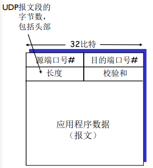
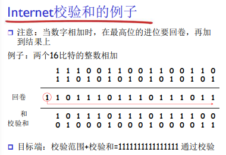
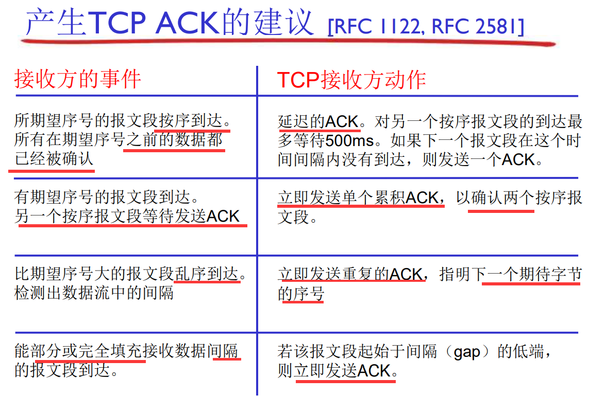
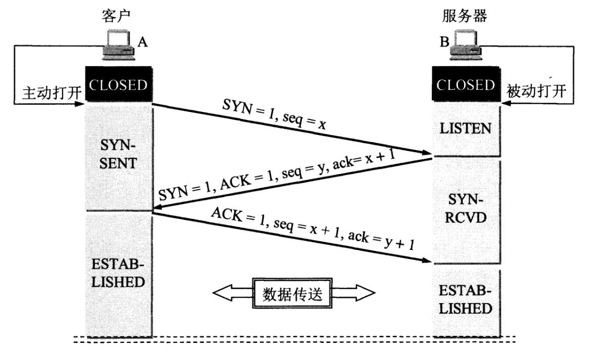

# 传输层

## 概述

传输层提供了进程间的**逻辑通信**，传输层向高层用户屏蔽了下面网络层的核心细节。

+ 报文
  + 发送方：将**应用层报文**分成**报文段**，然后传递给网络层
  + 接收方：将**报文段**重组成**报文**，然后传递给应用层

+ 端口

  + 借助**端口号**识别码指出具体应用程序。端口也被称为 程序地址。
  + **端口号由其使用的传输层协议决定**，不同的传输协议可以使用相同的端口号。IP 数据报到达后，会检查 IP 首部中的协议号，在交给传输层相应协议的模块。即使是同一个端口号，由于传输协议各自独立处理，因此相互之间不会受到影响

+ 多路复用与解复用

  + 多路复用：从多个套接字接收来自多个进程的报文，根据**对应的（IP地址和）端口号**等信息对报文段**用头部加以封装**
  + 解复用：根据**头部信息中的（ IP 地址和）端口号**，将接收到的报文段发给正确的套接字 (和对应的应用进程)

  > 在目标端上，UDP 套接字用二元组标识 (目标IP地址、目标端 口号)
  >
  > TCP 套接字则需要四元组标示

## UDP

### 特点

+ 尽力而为：可能丢失乱序
+ 无连接
+ 被用于流媒体等丢失不敏感的应用及 DNS、SNMP 等
+ 需要应用层自己处理可靠性问题

### 报文段格式

+ **包长度**保存了 UDP 首部长度（不包括伪首部）和数据长度**之和**，单位为字节【伪首部中的 UDP 包长度也是如此】

+ 校验和的计算

  在计算校验和时，会添加一个伪首部：

  

  

  + 先将 UDP 头中校验和字段设置为 0，然后以 16 bit 为一个单位进行 **1 的补码和**计算，并将**该补码的反码**写入校验和字段。

    > 补码和的计算：
    >
    > 

  + 接收到 UDP 数据报之后，从 IP 首部获得 IP 信息重新构造 UDP 伪首部，再进行校验和计算，如果全为 1，则认为收到的数据正确。

  > 为啥 UDP 校验和有一个伪首部呢？
  >
  > 因为除了源、目标端口号，识别一个通信还需要源IP、目的IP、协议号。如果这些发生了差错，很有可能导致收包应用收不到包，不该收到的应用却收到了包。因此这五个基本要素都需要验证。
  >
  > 此外，IPv6 中 IP 首部没有校验和，所以可以在 IP 不可靠时，借助上层的 UDP 提高可靠程度。

## 可靠传输原理 RDT (Reliable Data Transfer)

> RDT 在应用层、传输层和数据链路层都很重要。这里主要介绍原理，可以通用到其他层
>
> 只考虑单向数据传输，双向的数据传输问题实际上是2个单向数据传输问题的综合

### RDT 1.0：在可靠信道上的可靠数据传输

下层的信道是完全可靠的，不需要处理

### RDT 2.0：具有比特差错的信道

下层信道可能会出错：将分组中的比特翻转。但不会丢失乱序。

怎样从差错中恢复：

+ 确认(ACK)：接收方显式地告诉发送方分组已被正确接收
+ 否定确认(NAK): 接收方显式地告诉发送方分组发生了差错 ；发送方收到NAK后，重传分组

### rdt2.1：rdt2.0致命缺陷（如果ACK/NAK出错）的补丁

ACK/NAK 可能出错（不丢失），发送方无法识别。

+ 发送方怎么做【重传？可能重复（给应用层两个相同的报文）】

+ 处理重复：

  + 发送方在每个分组中**加入序号**
  + 如果 ACK/NAK 出错，发送方重传当前分组
  + 接收方丢弃重复分组，不重复（不发给上层的应用层）

  > 停等协议：发送方发送一个分组， 然后等待接收方的应答

对于发送方，需要在分组中加入序号。两个序列号（0，1）就足够了，因为**一次只发送一个未经确认的分组**

对于接收方，必须检测接收到的分组是否是重复的（状态会指示希望接收到的分组的序号为0还是1）。不知道发送方是否正确收到了其 ACK/NAK。

### RDT 2.2：无NAK的协议

功能同 RDT 2.1，但只使用ACK(ack 要编号）：对最后正确接收的分组发ACK，以替代NAK

当收到重复的ACK，发送方重传当前分组

### RDT 3.0：具有比特差错和分组丢失的信道

**新的假设**：下层信道可能会**丢失**分组（数据或ACK）

**方法**：发送方等待 ACK 一段合理的时间，超时重传

> 重传将会导致数据重复，但利用序列号已经可以处理这个问题。（因为接收方给 ACK 编号了）

> 过早超时（延迟的ACK）也能够正常工作；但是效率较低，有过多分组和确认是重复的
>
> 

### 流水线协议

上述 RDT XX 其实都是停止等待协议。发一个报文段要确认一个报文段。

流水线：为了提高链路利用率，允许发送方在未得到对方确认的情况下一次发送多个 分组

+  必须增加序号的范围：用多个bit表示分组的序号
+ 在发送方/接收方要有缓冲区

两种通用的流水线协议：回退N步（GBN）和选择重传（SR）

> Go-back-N
>
> + 接收端只是发送累计 型确认，如果发现gap，不确认新到来的分组（乱序的不缓存）
> + 发送端拥有对**最老的**未确认分组的定时器，当定时器到时时，**重传所有未确认分组**
>
> Selective Repeat
>
> + 接收方对每个到来的分组单独确认
> + 发送方**为每个**未确认的分组保持一个定时器，只重发到时的未确认分组
> + 注意：接收方对在接收窗口 base 之前的 N 个分组，也会发送 ACK，而不是丢弃。
>
> 
>
> 适用范围
>
> 出错率低：比较适合GBN，出错非常罕见，没有必 要用复杂的SR
>
> 链路容量大（延迟大、带宽大）：比较适合SR而不 是GBN，一点出错代价太大

### 滑动窗口(slide window)协议

#### 发送缓冲区

+  形式：内存中的一个区域，落入缓冲区的分组可以发送
+ 功能：用于存放**可以发送但还未发送**的分组及**已发送，但是没有得到确认**的分组
+ 必要性：需要重发时可用
+ 大小：停止等待协议=1；流水线协议>1，合理的值，不能很大（链路利用率不能够超100%）

#### 发送窗口

+ 指发送缓冲区中**已发送但是未经确认**分组的序号构成的空间
+ 每发送一个分组，前沿前移一个单位，不能够超过发送缓冲区
+ 收到老分组的确认，后沿会向前移动
+ （GBN 和 SR 的发送窗口都可以 \> 1）

#### 接收窗口（==接收缓冲区）

接收窗口用于控制哪些分组可以接收，若序号在接收窗口之外，则丢弃。

尺寸

+ GBN（=1），则只能顺序接收

+ SR（\>1） ，则可以乱序接收

滑动

+ 低序号的分组到来，接收窗口移动
+ 高序号分组乱序到，缓存但不交付（不允许失序），不滑动

发送确认

+ GBN（接收窗口尺寸=1 ）； 发送连续**收到的最大的分组**确认（累计确认）
+ SR（接收窗口尺寸>1） ； 收到分组，发送那个分组的确认（非累计确认）

### 窗口的最大尺寸（报文编号值）

用 n 位来标示编号时，能表示的编号的范围是  0 ~ $2^n-1$ 。为了防止将重复数据误认为新数据，需要限制了发送窗口大小。

+ **GBN的发送缓冲区最大尺寸是 $k=2^n-1$**，即编号最多取到 $k=2^n-2$

  如果最大尺寸是 $2^n$, 那么编号最多能取到 $2^n-1$。发送方发送了 $2^n$ 个包，接收方全部收到了，所以接收方下一个期待的编号是 0。然而所有的 ACK 都丢了，发送方会从 0 开始超时重传。此时接收方会把旧的编号位 0 开始的包，当成是新的包。

  所以，发送缓冲区最大尺寸是 $k=2^n-1$，即编号最多取到 $k=2^n-2$

+ **SR的发送缓冲区最大尺寸是 $k=2^{n-1}$**

  这次看正例。发送方发送 $2^{n-1}$个包，编号为 0~$2^{n-1}-1$。接收方收到了之后，因为是选择性重传，所以接收窗口的范围变成 $2^{n-1}$~$2^n-1$。发送方超时重传，编号恰好不会发生重叠。

  若是小一点点，接收窗口的最大值会越过$2^n-1$变成 0，那么就会把重传的旧报文段当成新的报文段。

## TCP

面向连接的点对点、可靠的、按顺序的、全双工的字节流，有流量控制（发送方不会淹没接收方）。

### 段结构、往返延时及超时

#### 段结构

- **序号**   ：用于**对字节流进行编号**，例如序号为 301，表示第一个字节的编号为 301，如果携带的数据长度为 100 字节，那么下一个报文段的序号应为 401。（该标号仅指数据载荷部分，不包括 tcp head）

- **确认号**   ：期望收到的下一个报文段的序号。例如 B 正确收到 A 发送来的一个报文段，序号为 501，携带的数据长度为 200 字节，因此 B 期望下一个报文段的序号为 701，B 发送给 A 的确认报文段中确认号就为 701。

- **数据偏移**   ：指的是数据部分距离报文段起始处的偏移量，**实际上指的是首部的长度**。

- **确认 ACK**   ：当 ACK=1 时确认号字段有效，否则无效。TCP 规定，在连接建立后所有传送的报文段都必须把 ACK 置 1。

- **同步 SYN**   ：在连接建立时用来同步序号。当 SYN=1，ACK=0 时表示这是一个连接请求报文段。若对方同意建立连接，则响应报文中 SYN=1，ACK=1。

- **终止 FIN**   ：用来释放一个连接，当 FIN=1 时，表示此报文段的发送方的数据已发送完毕，并要求释放连接。

- **选项**：常见的有 最大报文段（MSS）、窗口扩大、选择确认(SR)、时间戳选项（用来算往返延时）等等

  > 最大报文段（MSS）是接收方指出的自己能接受最大的报文多长。不是链路层的最大传输单元 MTU。
  >
  > 

-   **窗口**   ：愿意接收的字节数量。

> PSH：马上推出数据 (通常不用)
>
> URG：紧急数据 (通常不用)
>
> RST：表示复位，用来异常的关闭连接。比如AB正常建立连接，B网断了，A由于若干原因放弃了这个连接。网通了后，B又开始发数据包，A收到后，不知道这野连接哪来的，就发个RST包强制把连接关了，B收到后会出现 connect [reset](https://so.csdn.net/so/search?q=reset&spm=1001.2101.3001.7020) by peer 错误。

#### 往返延时和超时

RTT 是往返延迟。如何估计？思想是，在短时间内是稳定的。因此用历史值和本次测量值加权来估计：

> SampleRTT：测量从报文段发出到 收到确认的时间

$ EstimatedRTT = (1- \alpha)*EstimatedRTT + \alpha*SampleRTT$

超时时间：EstimatedRTT+安全边界。安全边界也是用历史差值来估计

$DevRTT = (1-\beta)*DevRTT + \beta*\|SampleRTT-EstimatedRTT\|$

超时时间间隔为 $TimeoutInterval = EstimatedRTT + 4*DevRTT$

### TCP 的 RDT

TCP在IP不可靠服务的基础上 建立了 RDT

+ 累积确认（确认最后一个顺序的正确的字节）（像GBN）
+ 单个重传定时器（像GBN）
+ 没有规定接收是否可以乱序

近在以下事件发生的情况下重传

+ 超时（只重发那个最早的未确认段：像SR，不是将所有 未确认的都传一遍）
+ 收到三个冗余的确认（一共四个）

#### 不考虑流量控制拥塞控制时

#### 快速重传

考虑到超时周期往往太长：在重传丢失报文段之前的 延时太长，需要让发送方尽早知道报文段可能已经丢了，需要快速重传（在定时器过时之前重发报文段）。

+ 如果报文段丢失，通常会引起多个重复的 ACK
+ 如果发送方收到同一数据的 3 个**冗余**ACK，重传最小序号的段

> 思想是，收到40-49的 ACK 之后，又重复收到 ACK50，说明后面乱序到达了很多，很有可能 50-59 已经丢了

### 流量控制

场景：TCP 实体往缓冲区里写数据，应用程序从中读数据。发送发发的太多太快了，应用来不及处理，可能导致接收方缓冲区溢出。

接收方的 RcvBuffer 是有限的，典型默认大小为 4096 字节。

处理：

+ 接收方在其向发送方的 TCP 段头部的 **接收窗口 The Receiver Window （rwnd）字段** “通告” 其**空闲 buffer** 大小
+ 发送方限制未确认(“in-flight”)字节的个数 ≤ 接收方发送过来的 rwnd 值

### 连接管理

在正式交换数据之前，发送方和接收方握手建立通信关系：同意建立连接（每一方都知道对方愿意建立连接）、同意连接参数

#### 连接建立

##### 流程

+ B 处于 LISTEN（监听）状态，等待客户的连接请求。
+ A 向 B 发送**连接请求报文**，**SYN=1，ACK=0**，选择一个**初始序号 x**。
+ B 收到连接请求报文，如果同意建立连接，则向 A 发送**连接确认报文**，**SYN=1，ACK=1，确认号为 x+1**，同时也选择**一个初始序号 y**。
+ A 收到 B 的连接确认报文后，还要向 B 发出确认，**确认号为 y+1，序号为 x+1**。【通常和第一个数据包一起发送，所以序号可能不是 x+1】A 随即进入 ESTABLISHED 状态。
+ B 收到 A 的确认后，进入 ESTABLISHED 状态。

> TCP 协议规定SYN报文虽然不携带数据， 但是也要消耗1个序列号， 所以前两次握手客户端和服务端都需要向对方回复 x+1 或 y+1
>
> 值得注意的是， 最后一次握手在默认不携带数据的情况下， 由于SYN 不是 1 ， 是不消耗序列号的。 所以三次握手结束后，**客户端下一个发送的报文中** seq 依旧是 x+1

##### 为什么需要三次握手

**在信道不可靠时，为了实现可靠数据传输**，TCP 协议的通信双方，都必须维护一个序列号， 以标识发送出去的数据包。三次握手的过程重点在于：通信双方相互告知序列号起始值，并确认对方已经收到了序列号起始值，并**防止旧的重复连接初始化造成混乱**。为什么两次握手不行

+ 两次握手可能导致失效的连接请求报文段被服务端接收，从而**浪费服务器资源**或**接收错误数据**。

  + 浪费服务器资源

    如果**网络拥塞**，客户端发送的连接请求迟迟到不了服务端，客户端便**超时重发**请求，如果服务端正确接收并确认应答，双方便开始通信，**通信结束后释放连接**。此时，如果那个**具有相同四元组**的**失效的连接请求抵达**了服务端，由于只有两次握手，服务端**收到请求就会进入ESTABLISHED状态**，等待发送数据或主动发送数据。但此时的客户端早已进入CLOSED状态，服务端将会**一直等待**下去，这样**浪费服务端连接资源**。

    

  + 接收错误数据

    进一步的，不仅仅连接建立请求重发了，数据也重发了，那服务器会把旧连接的旧数据当成新连接的新数据。

    

+ 三次握手怎么解决上述问题

  + 客户端可以通过 RST 报文告知服务器，该链接已被废弃。这样服务器就不会一直维持一个废弃连接，更不会接受旧连接的数据。

    

+ 自己的一点其他思考

  + 如果两次握手的时候，客户端收到一个旧连接的确认，主动告诉服务器关掉不就可以了吗？

    不可以。1. 无法及时阻止旧数据被接收。2. 主动告知出错的报文也可能丢失，服务器因为已经处在连接建立状态，会一直等下去。但在三次握手中，如果服务器没有及时收到第三次握手的报文，会超时关闭。

  + 关于序列号生成

    刚刚提到的随机序列号 ISN(Initial Sequence Number) 其实是一个生成器生成的32位的时钟计数器，大概 4.5 小时循环一次。而网络中一个报文段的最大生存时间为1~2分钟（**最大报文存活时间MSL**），远小于这个循环时间，所以可以认为这个序列号此时是唯一的。

    发送方可以通过自己本地的时钟，判断接收方的连接确认是不是对应了旧的链接（如上图中的 ACK=91），并发送 RST 将它关闭。

    但是接收方如果想要知道的话，必须记录本IP、端口和对方IP、端口最后一次链接所采用的序列号 X 是多少。全记下来是不现实的。

    > 如果有全局时钟，可能有改进的办法。暂时超出我的学习范围。可参考：
    >
    > http://mirrors.ustc.edu.cn/rfc/ien/ien193.pdf
    >
    > https://www.zhihu.com/question/24853633/answer/573627478

#### 连接释放

##### 流程

+ A 发送连接释放报文，FIN=1。

+ B 收到之后发出确认，此时 TCP 属于半关闭状态，B 能向 A 发送数据但是 A 不能向 B 发送数据。

+ 当 B 不再需要连接时，发送连接释放报文，FIN=1。

+ A 收到后发出确认，进入 TIME-WAIT 状态，等待 2 MSL（最大报文存活时间）后释放连接（如果收到了冗余的 FIN 会重新计时）。

  > **如果 FIN 报文比数据包先抵达客户端，此时 FIN 报文其实是一个乱序的报文，此时客户端的 TCP 连接并不会从 FIN_WAIT_2 状态转换到 TIME_WAIT 状态**

+ B 收到 A 的确认后释放连接。

##### TIME_WAIT 2MSL 的原因

+ TIME_WAIT状态的主要目的有两个：

  -  优雅的关闭TCP连接，也就是尽量保证被动关闭的一端收到它自己发出去的FIN报文的ACK确认报文；

    如果 A 回复 B FIN 报文的 ACK 丢失，要完成这一目标， B 会反复多次尝试重发 FIN 报文 K 次，所以应该等待的时间应该是 K 次的超时时间加上一个最大报文存活时间 MSL。但这个时间太保守，而且数据既然已经传完了，信道没那么不可靠，所以等待时间没必要那么严格。

  - 处理延迟的重复报文，这主要是为了**避免前后两个使用相同四元组的连接**中的**前一个连接的报文干扰后一个连接**。

    如果 ACK 丢失了，会像上述一样，不讨论了。如果 ACK 没丢失到达了 B ，而在此之前 B 一直在发 FIN。A 知道最晚经过一个 MSL，B 收到了改报文，进入 CLOSED 状态，停止重传 FIN。而已经发出的重传的 FIN 需要再等待 MSL 才完全消失在网络中。

  + 综上所述，TIME_WAIT 至少需要持续 2 MSL时长，这 2 个 MSL 中的第一个 MSL 是为了等自己发出去的最后一个 ACK 从网络中消失，而第二 MSL 是为了等在对端收到 ACK 之前的一刹那可能重传的 FIN 报文从网络中消失。另外，虽然说维持 TIME_WAIT 状态一段时间有2个目的，但这段时间具体应该多长主要是为了达成上述第二个目的而设计的。

+ 一点思考

  + 连接建立的过程中，三次握手不是会确保不受到旧链接的影响吗？没有，保证的是不受到旧的连接建立请求的影响。比如说第一次连接建立请求 seq = x，发了很多数据包，所以最后的 seq = x + 20000。第二次建立链接的时候，计时器还没跑那么多，初始的 seq = x + 19500。那就出问题了。所以最好还是确保网络中没有未失效报文。

#### TCP 连接中的大量 TIME-WAIT / CLOSE-WAIT

linux 在文件句柄的数目上有两个级别的限制。一个是系统级别的总数限制，一个是针对用户的限制。默认情况下每个用户所能使用的，句柄数是 1024。可以对其进行修改到一个较大的值。而 TIME_WAIT 和 CLOSE_WAIT 两种状态如果一直被保持，那么意味着对应数目的通道就一直被占着，一旦达到句柄数上限，新的请求就无法被处理了。

##### 出现大量 TIME-WAIT

服务器中出现的原因：

- 大量的短连接存在，TCP 四次挥手关闭连接机制中，主动关闭的一方为了保证 ACK 重发和丢弃延迟数据，设置 time_wait 为 2 倍的 MSL(报文最大存活时间)
- 特别是 HTTP 请求中，如果 connection 头部取值被设置为 close 时，基本都由服务端发起主动关闭连接

怎么办：

- 服务器端允许 time_wait 状态的 socket 被重用
- 缩减 time_wait 时间，设置为 1 MSL

##### 出现大量 CLOSE-WAIT

服务器中出现的原因：

+ 服务器端收到客户端发送的 FIN，则按照 TCP 实现发送 ACK，因此进入 CLOSE_WAIT 状态。但如果服务器端不执行 `close()`，就不能由 CLOSE_WAIT 迁移到 LAST_ACK，则系统中会存在很多 CLOSE_WAIT 状态的连接。多半是因为：
  应用程序写的有问题，没有合适的关闭 socket；要么是服务器 CPU 处理不过来（CPU太忙）或者应用程序一直睡眠到其它地方(锁，或者文件I/O等等)，应用程序获得不到合适的调度时间，造成程序没法真正的执行close操作。

## 拥塞控制 与 TCP 拥塞控制

### 拥塞&控制方案

拥塞：太多的数据需要网络传输，超过了网络的处理能力

> 与流量控制不同，流量控制是为了防止接收方处理不过来

拥塞会发生什么：分组丢失 (路由器缓冲区溢出)、 分组经历比较长的延迟(在路由器的队列中排队)

方案

+ 端到端的控制（TCP 所采用的方案）
  + 没有来自网络的显式反馈，端系统根据延迟和丢失事件推断是否有拥塞
+ 网络辅助的拥塞控制
  + 路由器提供给端系统反馈信息（如 ATM）

### TCP 拥塞控制方案

#### 如何检测拥塞

+  某个段超时了（丢失事件 ）：拥塞

  大概率是因为网络拥塞被丢弃了，也有可能因为是没有通过校验出错了，不过这个概率小。所以一旦超时，就认为拥塞了。

+ 有关某个段的 3 次重复ACK：轻微拥塞

  段的第 2、3、4 个 ACK 重复，意味着红段的后第 2、3、4个段收到了且乱序抵达，同时红段丢失的可能性很大（后面3个段都到了， 红段都没到）。 网络这时还能够进行一定程度的传输，拥塞但情况要比第一种好。

  

#### 如何控制拥塞

发送端限制已发送但是未确认的数据量的上限（拥塞窗口 CongWin 个 MSS（e.g., 1460 Bytes）），从而粗略地控制发送方的往网络中注入的速率。

##### Congwin 的调整

再维护一个变量 Threshold

+ 慢启动（slow start SS）（其实挺快的）（Congwin指数型增）：

  当 $Congwin<Threshold$，每个 RTT 时间内，Congwin 指数性增加（实现策略是，每收到一个ACK时， CongWin 加 1MSS）

   启动初值很低，但是增长速度很快

  

+ 拥塞避免阶段（Congwin**加性增**）

  当 $Congwin>Threshold$，每个 RTT 时间内，如果没有异常事件，则 Congwin+1 MSS

  探测极限

+ 当收到3个重复的 ACKs（轻微拥塞）

  警示还有一定的传输能力，但是马上很有可能要超时了

  **Threshold** 设置成 CongWin 的1/2，CongWin = Threshold + 1（大约是原来的一半，**乘性减**）

  这样实际上就开始加性增（拥塞避免阶段）

  > 此时还会触发快速重传

+ 当超时事件发生

  **Threshold** 设置成 CongWin 的1/2，CongWin被设置成 1 MSS

  这样实际上就开始慢启动。

##### TCP 的吞吐量

忽略慢启动阶段，假设发送端总有数据传输。若发生丢失事件时的窗口尺寸为 W，则每个 RTT 平均吞吐 $\frac{3W}{4}$，平均吞吐量为 $\frac{3W}{4RTT}$

##### 拥塞控制和流量控制的联合动作

发送窗口其实要同时满足拥塞控制和流量控制要求：

`SendWin=min{CongWin, RecvWin}`

#### 为什么TCP是公平的

2个竞争的TCP会话，加性增加，斜率为1, 吞吐量增加，乘性减，吞吐量比例减少。按下图，最后变得公平。

但是如果有人用 UDP，或者开了多个 TCP 连接，就不公平了。

## 关于最大传输量

### TCP

#### 一个 TCP 报文段

本身没啥限制。但是 IP 数据报有自己的最大长度啊。而且一般网卡也会限制的。

> 虽然链路层也有 MTU，但是 IP 数据报可以切分再重组，所以没关系。

#### 一次 TCP 连接

TCP 是字节流服务，其实可以传输无限多的字节，序列号是会越过最大值回到 0，循环使用的。这也是为什么 n 位序列号时，最大可以发 $2^{n-1}$个未确认的报文段。

>  https://www.zhihu.com/question/25399270/answer/259732524
>
>  暂时的结论，TCP 其实可以传无限多的数据，没有最大限制一说。自己看看这个问题下面的所有回答。（毕竟 TCP 是流啊！）

### UDP

虽然一个 UDP 报文最大可以传送 $2^{16}-1-8$ Bytes，但是封装成 IP 数据报的时候会被分片（非可靠传输），IP 数据报再交给链路层传输时（Internet中是以太网），还会根据帧的大小，再被分片（非可靠传输）。

由于UDP的特性，当某一片数据传送中丢失时，接收方无法重组数据报，将导致丢弃整个UDP数据报。所以：

+ 普通**局域网（以太网）环境下**标准 MTU 为 1500 字节，UDP的数据建议控制在1500-20（IP头）-8（UDP头）=1472 Bytes。
+ 而 Internet 上的标准 MTU 值为576字节，所以 UDP 的数据建议控制在576-20（IP头）-8（UDP头）= 548 Bytes
