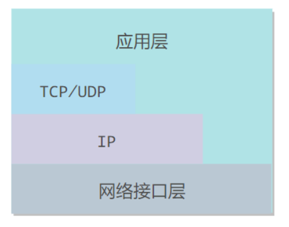
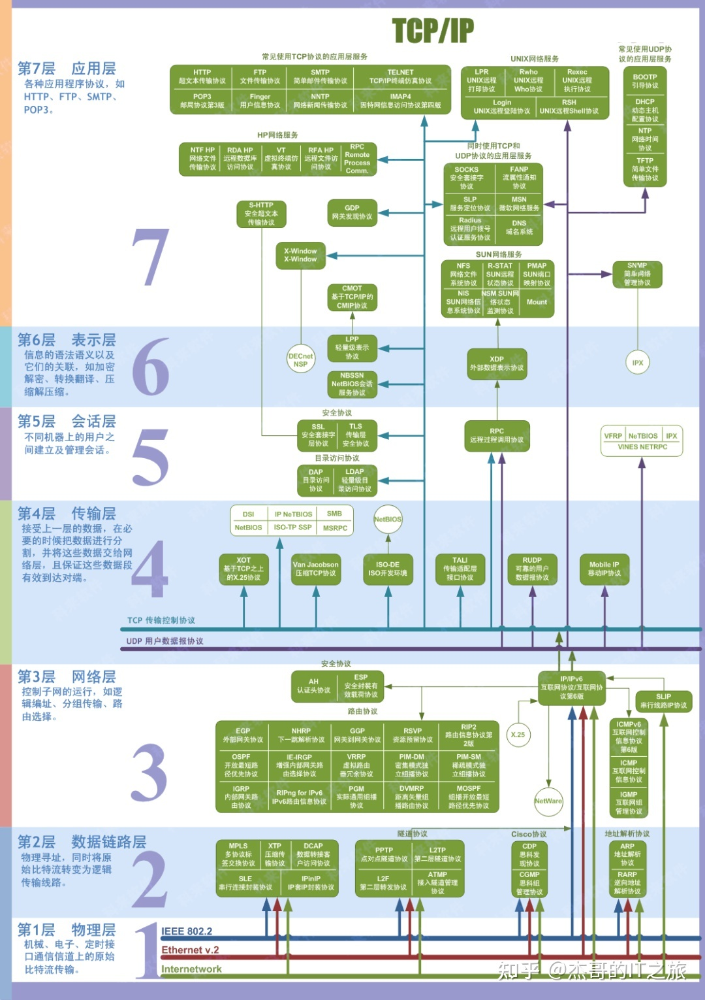

# 基础知识

## 电路交换与分组交换

### 电路交换

电路交换用于电话通信系统，两个用户要通信之前需要建立一条专用的物理链路，并且在整个通信过程中始终占用该链路。由于通信的过程中不可能一直在使用传输线路，因此电路交换对线路的利用率很低，往往不到 10%。

### 报文交换

存储接收到的报文，判断其目标地址以选择路由，在下一跳路由空闲时，将数据转发给下一跳路由。类似于分组交换，但是报文整个地发送，一次一跳。**由于数据进入交换结点后要经历存储、转发这一过程，从而引起转发时延**

### 分组交换

每个分组都有首部和尾部，包含了源地址和目的地址等控制信息，**在同一个传输线路上同时传输多个分组互相不会影响**，因此在同一条传输线路上允许同时传输多个分组，也就是说**分组交换不需要占用传输线路**。

## 时延

总时延 = 排队时延 + 处理时延 + 传输时延 + 传播时延

+ 排队时延

​	分组在路由器的输入队列和输出队列中排队等待的时间，取决于网络当前的通信量。

+ 处理时延

​	主机或路由器收到分组时进行处理所需要的时间，例如分析首部、从分组中提取数据、进行差错检验或查找适当的路由等。

​	对低速率的链路而言很大（如拨号），通常为微秒级到毫秒级

+ 传输时延

​	主机或路由器传输数据帧所需要的时间。【从端口打出去需要的事件】

  
 

​	其中 l 表示数据帧的长度，v 表示传输速率。

+ 传播时延

​	电磁波在**信道中传播**所需要花费的时间，电磁波传播的速度接近光速。

  
 

​	其中 l 表示信道长度，v 表示电磁波在信道上的传播速度。

## 协议分层

### Internet 协议栈

+ 应用层：为人类用户或者其他应用进程提供网络应用服务
+ 传输层：为**进程**提供通用数据传输服务
  + 在网络层提供的端到端通信基础上，细分为进程到进程
+ 网络层：为数据报从源到目的选择路由
  + 主机主机之间的通信
+ 链路层：为同一链路的主机提供数据传输服务，在同一网络的相邻节点间的数据传输
+ 物理层：在线路上传送bit 

### ISO/OSI 参考模型多出来两层

+ 表示层：允许应用解释传输的数据, e.g., 加密，压缩，机器相关的表示转换
+ 会话层：认证、权限、数据交换的同步（比如音视频同步）

​	Internet 协议栈没有这两层，这些服务，如果需要的话，在应用内实现

### TCP/IP

它只有四层，相当于五层协议中数据链路层和物理层合并为网络接口层。TCP/IP 体系结构不严格遵循 OSI 分层概念，应用层可能会直接使用 IP 层或者网络接口层。

## 各层的数据单元

+ 应用层：报文(message) 
+ 传输层：报文段(segment)：TCP段，UDP数据报
+ 网络层：分组 packet（如果无连接方式：数据报 datagram，如 IP 数据报）
+ 数据链路层：帧(frame)
+ 物理层：位(bit)

## 杂项

+ 计算机内部的数据存储, 1K=2^10,而在数据传输中，是按照时钟频率来算的，1K=1000
+ 协议所在层次图：

