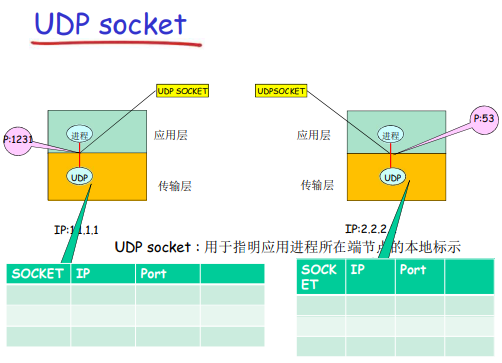

# 应用层

## 应用层协议原理

### 可能的应用架构

+ 客户-服务器模式（C/S:client/server）
+  对等模式(P2P:Peer To Peer)
  +  例子: 迅雷
+ 混合体
  + 例如即时通信软件：当用户上线时，向中心服务器注册其IP地址，用户与中心服务器联系，以找到其在线好友的位置，两个用户之间聊天采用P2P

### 分布式进程通信需要解决的问题

#### 问题1：进程标示和寻址问题（服务用户）

进程为了接收（发送）报文，必须有一个标识 SAP：IP+TCP(UDP) 端口

#### 问题2：传输层如何提供服务

通过应用程序接口API（socket API）向上提供服务

> socket 本质是传输层的封装，便于应用层使用的 API。

+ 穿过层间接口需要提供的信息：报文，发送方标识，接收方标示
+ 传输层实体（tcp或者udp实体）根据这些信息进行TCP 报文段（UDP数据报）的封装

如果 Socket API 每次传输报文，都携带如此多 的信息，太繁琐易错，不便于管理。因此用个**本地代号**标示通信的双方（或者单方）（就像OS打开文件返回的句柄一样）

+ TCP之上的套接字（socket）

  

  + 用一个套接字标号值表示 4 元组：(源IP，源port，目标IP，目标port)，这唯一的指定了 2 个进程之间的一个会话
  + 应用使用这个标示与远程的应用进程通信，不必在每一个报文的发送都要指定这4元组
  + 发送方**只需要传送 socket 值**给传输层的 TCP 实体，它自己可以查到 4 元组
  + 接收方的 TCP 实体自己知道 4 元组，**查表得到 socket 值**，就知道**交给哪个应用进程**

+ UDP之上的套接字（socket）

  

  + 对于使用无连接服务（UDP）的应用而言，一个套接字标号值表示了 2 元组（IP，port ）
  + 在发送数据报时采用本地套接字（标示 ID），就不必在发送每个报文中指明自己所采用的 IP和 port，**但是在发送报文时，必须要指定对方的 IP和 UDP port**

#### 问题3：如何使用传输层提供的服务实现应用

定义应用层协议：报文格式，解释，时序等

### Internet 传输层提供的服务

+ TCP 服务
  + 可靠的传输服务
  + 流量控制
  + 拥塞控制
  + 面向连接
+ UDP 服务器
  + 不提供的服务：可靠， 流量控制、拥塞控制、带宽保证、建立连接
  + 那为什么要有 UDP?
    + 能够区分不同的进程，而IP服务不能
    + 不做可靠性的工作，时间代价小
    + 没有拥塞控制和流量控制，应用能够按照设定的速度发送数据

## Web and HTTP

详见 HTTP 的笔记

## FTP

FTP 使用 TCP 进行连接，它需要两个连接来传送一个文件：

- 控制连接：服务器打开端口号 21 等待客户端的连接，客户端主动建立连接后，使用这个连接将客户端的命令传送给服务器，并传回服务器的应答。

- 数据连接：用来传送一个文件数据。

  根据数据连接是否是服务器端主动建立，FTP 有主动和被动两种模式。

  - 主动模式：服务器端主动建立数据连接，其中服务器端的端口号为 20，客户端的端口号随机，但是必须大于 1024，因为 0\~1023 是熟知端口号。主动模式要求客户端开放端口号给服务器端，需要去配置客户端的防火墙。

    

  

  - 被动模式：客户端主动建立数据连接，其中客户端的端口号由客户端自己指定，服务器端的端口号随机。被动模式只需要服务器端开放端口号即可，无需客户端配置防火墙。但是被动模式会导致服务器端的安全性减弱，因为开放了过多的端口号。

    

  

## Email

一个电子邮件系统由三部分组成：

+ 用户代理
  + 如 Outlook、Foxmail，输出和输入邮件保存在服务器上
+ 邮件服务器
  + 管理和维护发送给用户 的邮件
+ 邮件协议
  + SMTP
    + 使用TCP在客户端和服务器之间传送报文，端口号为25
    + 也用于从发送方服务器到接收方服务器的传输
    + SMTP使用持久连接
    + 报文格式由最初得到 ASCII，借助多媒体邮件拓展MIME，能够传输任意内容
  + 邮件访问协议
    + POP3
      + 下载（并可以设置是否删除）邮件到本地
      + 无状态的
    + IMAP
      + 允许用户用目录来组织报文，支持一些复杂操作
    + HTTP（GMail）

## 代理

### 正向代理

正向代理是客户端和其他所有服务器**（重点：所有）**的代理者。用户可以感知。

正向代理是为客户端做事，隐藏客户端，去请求服务器，最终服务器是不知道这个请求一开始是哪个客户端发起的。

比如翻墙，任何可以连接到该代理服务器的软件，就可以通过代理访问任何的其他服务器，然后把数据返回给客户端，这里代理服务器只对客户端负责，所以叫正向。

### 反向代理

反向代理是客户端和**所要代理的服务器**之间的代理

反向代理是为服务器做事，隐藏服务器，客户端直接请求反向代理服务器就拿到数据就行，客户端不知道这个数据是哪个最终服务器处理的。

## DNS

DNS 是：

+ 分层的、基于域的命名机制（可以解决不同机构的主机名重名问题）
+ 若干分布式的数据库完成名字到IP地址的转换（这里的分布式数据库是指，每个站点只保留它自己的那部分数据）
+ 它是Internet的核心功能，但是是运行在UDP之上端口号为53的**应用服务**

除了实现主机名-IP的转换，还可以：

+ 主机别名到规范名字的转换：Host aliasing
+ 邮件服务器别名到邮件服务器的正规名字的转换：Mail server  aliasing
+ 负载均衡

### 区域(zone)

+ 区域的划分有区域管理者自己决定，将DNS名字空间划分为互不相交的区域，每个区域都是树的一部分
+ 每个区域都有一个名字服务器：维护着它所管辖区域的**权威信息 (authoritative record)**

### RR （resource records）格式

(name, value, type, ttl)

+ Type=A：name为主机, Value为IP地址

+ Type=NS：Name为域名(如foo.com)，Value为**解析该域名的权威服务器的域名**

+ Type=CNAME：Name为规范名字的别名， value 为规范名字；如 www.ibm.com 的规范名字为 servereast.backup2.ibm.com

  + CDN 服务用到了 CNAME，可以根据用户所在位置选择并返回最优节点 IP。如果不用CNAME，A记录只能实现域名解析到IP，无法实现CDN的加速效果。

    > 什么是CNAME以及CDN？ - 漢堡再来一個的文章 - 知乎 https://zhuanlan.zhihu.com/p/400556541

+ Type=MX：Value 为 name 对应的邮件服务器的名字

### DNS大致工作过程

+ 应用调用解析器(resolver)(进行 DNS 查询的主机和软件叫 DNS 解析器，如个人电脑)
+ 解析器作为客户向Name Server发出查询报文 （封装在UDP段中）
+ Name Server返回响应报文(name/ip)

解析器的解析流程

1. 本机查看本地的缓存，看看是否有 域名->IP 的记录缓存，如果有，直接用

2. 如果本地没有缓存，看看本地的 hosts 文件中有没有记录，如果有，直接用

3. 如果本地 hosts 文件也没有域名解析记录，则将域名解析请求发送给本机配置的 DNS 服务器

4. 本机配置的 DNS 服务器会在自己的区域里面查找，找到即根据此记录进行解析，若有则返回，此解析具有权威性；若没有找到，就会在其缓存里面查找，此解析不具有权威性。

5. 如果本地还不能找，就借助上级服务器，有两种类型：

   1. 递归查询（不好，靠近根的 DNS 服务器负担太大）

      

      此 DNS 服务器就会把请求转发至上一级 DNS 服务器，由上一级服务器进行解析，上一级服务器如果不能解析，再递归，**逐个 DNS 服务器返回**。

   2. 迭代查询

      

      根（及各级域名）服务器返回的不是查询结果，而是下一个 NS 的地址。本机配置的 DNS 服务器根据返回的信息接着访问下一级的 DNS 服务器。最后由权威名字服务器给出解析结果。

   > 解析器和 DNS 服务器（域名服务器）会将最新了解到的信息保存在缓存里。

6. 本机配置的 DNS 服务器将域名解析结果返回给本机

> **本机**和本机配置的 DNS 服务器之间，**一去一回**得到域名结果的过程，是一种**递归解析**。本机**并不知道**本机配置的 DNS 服务器为了得到解析结果，执行的是递归解析还是迭代解析。

### DNS 用到 TCP 了吗

DNS 域名解析的时候用的是 UDP。因为UDP快，传输内容少。

但是下列情况会用到 TCP:

+ **返回的结果过大**时

+ 执行DNS 的**区域传送**时。

  一个域有主 DNS 服务器和辅助 DNS 服务器。主 DNS 服务器从本机文件读取该区的 DNS 数据信息。辅助 DNS 服务器启动时，需要与主 DNS 服务器通信加载数据，这叫做区域传送(zone transfer)。区域传送使用 TCP 协议。因为 **TCP 协议可靠性好**，且 **TCP 协议可靠传输的内容大**。

> 虽然 UDP 最大可以传送 $2^{16}-1-8$ Bytes，但是封装成 IP 数据报的时候会被分片（非可靠传输），IP 数据报再交给链路层封装成帧的时候（Internet中是以太网）还会再被分片（非可靠传输）。
>
> 由于UDP的特性,当某一片数据传送中丢失时,接收方无法重组数据报.将导致丢弃整个UDP数据报。所以普通**局域网（以太网）环境下**标准 MTU 为 1500 字节，UDP的数据建议控制在1500-20（IP头）-8（UDP头）=1472 Bytes
>
> 而 Internet 上的标准 MTU 值为576字节，所以 UDP 的数据建议控制在576-20（IP头）-8（UDP头）=548 Bytes
>
> 综上，DNS规定如果返回的响应超过的 512 字节，就用 TCP

## CDN

CND：在CDN节点中存储内容的多个拷贝，就近为用户提供服务，提高用户体验

用户从CDN中请求内容，可以重定向到最近的拷贝，请求内容。如果网络路径拥塞，可能选择不同的拷贝。

## 流式多媒体技术 DASH

服务器

+ 将视频文件分割成多个块
+ 每个块独立存储，编码于不同码率（8-10种）（比如对应不同清晰度）
+ 告示文件（manifest file）: 提供不同块的URL

客户端

+ 先获取告示文件
+ 周期性地测量服务器到客户端的带宽
+ 查询告示文件,在一个时刻请求一个块，HTTP头部指定字 节范围
  + 可以自适应决定：什么时候去请求块，请求什么编码速率的视频块，去哪里请求块

## 套接字编程 Socket API

### TCP套接字编程

#### 流程

1. 服务器首先运行，等待连接建立

   1. 创建欢迎socket
   2. 和本地端口捆绑
   3. 在欢迎socket上阻塞式等待接收用户的连接

2. 客户端主动和服务器建立连接

   1. 创建客户端本地套接字（隐式捆绑到本地 port）
   2. 指定服务器进程的IP地址和端口 号，与服务器进程连接

3. 当与客户端连接请求到来时

   1. 解除阻塞式等待，返回一个 新的socket（与欢迎socket不 一样），与客户端通信

      > 允许服务器与多个客户端通信，使用源 IP 和源端口来区分不同的客户端

#### 相关数据结构和编程实例

以客户端发送小写句子，由服务器返回大写句子为例

+ 服务器

  

  

+ 客户端

### UDP 套接字编程

#### 流程

+ 发送端在每一个报文中明确地指定目标的IP地址和端口号

+ 服务器必须从收到的分组中提取出发送端的IP地址和端口号，否则不知道返回给谁。（而 TCP 不需要）

#### 编程实例

+ 服务器

  

  

+ 客户端

## 常用应用的端口

|       应用       | 应用层协议 | 端口号  | 传输层协议 |            备注             |
| :--------------: | :--------: | :-----: | :--------: | :-------------------------: |
|     域名解析     |    DNS     |   53    |  UDP/TCP   | 长度超过 512 字节时使用 TCP |
| 动态主机配置协议 |    DHCP    |  67/68  |    UDP     |                             |
| 简单网络管理协议 |    SNMP    | 161/162 |    UDP     |                             |
|   文件传送协议   |    FTP     |  20/21  |    TCP     |  控制连接 21，数据连接 20   |
|   远程终端协议   |   TELNET   |   23    |    TCP     |                             |
|  超文本传送协议  |    HTTP    |   80    |    TCP     |                             |
| 简单邮件传送协议 |    SMTP    |   25    |    TCP     |                             |
|   邮件读取协议   |    POP3    |   110   |    TCP     |                             |
| 网际报文存取协议 |    IMAP    |   143   |    TCP     |                             |
