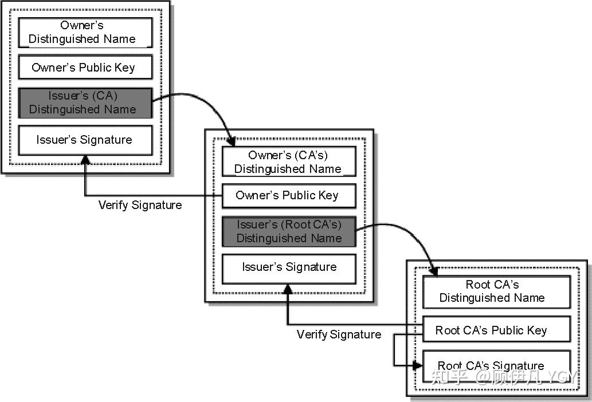

# 网络安全

网络安全目标：

+ 机密性
+ 认证：双方互相确认身份
+ 报文完整性：不被篡改

## 加密原理

### 对称密钥密码学：发送方和接收方的密钥相同

$ m=k_{A-B}(K_{A-B}(m)) $

+ 如果通信双方都各自持有同一个密钥，且没有别人知道，这两方的通信安全当然是可以被保证的
+ 然而最大的问题就是**这个密钥怎么让传输的双方知晓，同时不被别人知道**。
+ 例子：AES

### 公开密钥密码学：用公钥加密的内容必须用私钥才能解开，同样，私钥加密的内容只有公钥能解开。

+ $ m=k_{B}^{+}(K_{B}^{-}(m)) $ or$ m=k_{B}^{-}(K_{B}^{+}(m)) $。从计算带加上来说，从公钥推不出私钥，反之亦然。

+ 例子：RSA
  
  

### 可信公钥 certification  authority (CA)

在非对称加密中，如何**确保对方发来的公钥是可靠的**，而不是被中间人篡改成它自己的？利用 CA 机构。

+ E 到 CA 注册自己的公钥，并提供自己的**身份证明**（伪装者不能证明自己真的是这个域名的所有人）
+ CA创建一个证书，捆绑了 实体信息和他的公钥. 该证书是被CA签署的（被CA用自己的私钥加了密的），**证书里包含了 E 的信息，如括域名**
+ 当别人需要或许 E 的公钥，就去拿这个证书，并用 CA 的公钥来认证。若认证通过，就可以解密出 E 的公钥。

#### 怎么证明CA机构的公钥是可信的？

+ CA 机构的公钥是否也可以用数字证书来证明？
  
  是的，操作系统、浏览器本身会预装一些它们信任的根证书，如果其中会有CA机构的根证书，这样就可以拿到它对应的可信公钥了。

+ 实际上证书之间的认证也可以不止一层，可以 A 信任 B，B 信任 C，以此类推，我们把它叫做**信任链**或**数字证书链**。也就是一连串的数字证书，由根证书为起点，透过层层信任，使终端实体证书的持有者可以获得转授的信任，以证明身份。

+ 有时候一些网站访问不了需要安装证书，说明浏览器不认可给这个网站颁发证书的机构，那么你就得手动下载安装该机构的根证书（风险自己承担）

## HTTPS 原理

> 彻底搞懂HTTPS的加密原理 - 顾伊凡 YGY的文章 - 知乎 https://zhuanlan.zhihu.com/p/43789231

+ 仅用对称加密可行吗？
  
  不行。如何协商一个对称密钥很难不被他人知晓。也不可能预先在所有浏览器和服务器存放一对一的密钥。

+ 仅用非对称加密可行吗？
  
  不好。服务器预先向浏览器发送公钥，浏览器把自己的内容加密后传输，服务器用私钥解密。【但是只有浏览器到服务器的单一方向是安全的】【而且还需要从 CA 获取公钥，直接采用服务器发来的公钥，可能是被中间人篡改成他自己的】

+ 如果改进一下，浏览器也向服务器发一个自己的公钥呢？
  
  每个浏览器都去 CA 注册一下不太现实，如果不去 CA 注册，服务器也就不能确定浏览器发来的公钥是不是真的是它自己的。
  
  **更严重的是，非对称加密算法非常耗时，而对称加密快很多。**
  
  > 加密主要的运算是**位运算**，非对称加密有很多乘法和取模操作。

+ 那怎么办呢最后？采用非对称加密 + 对称加密结合的方式
  
  + 浏览器获得服务器的公钥 A+（通过 CA 认证的，也称证书）
  + 浏览器随机生成一个用于对称加密的密钥 X，用服务器的公钥 A+ 加密后传给服务器。
  + 服务器用自己的私钥 A- 解密，得到对称密钥 X
  + 之后双方所有数据都通过密钥 X 加密解密

### HTTPS 流程

首先，需要纠正和明确证书的内容和生成过程

Q：为什么不直接对整个证书签名，而是对摘要签名并且连着证书原文一起传递？

> HTTPS为什么要hash一次再签名？ - 萧骁的回答 - 知乎
> https://www.zhihu.com/question/407373065/answer/1343579794

+ 性能问题：签名算法还是很耗时的，且签名完的内容实际上也是很长的（为了还原）

+ 能力问题：非对称算法 RSA 只能加密比私钥小 27Byte 的数据，假设私钥是 1024bits 的，那么加密内容不能超过 997Bytes，这根本不够。

1. 客户端向服务端发起请求
   
   1. 客户端生成随机数R1 发送给服务端
   
   2. 告诉服务端自己支持哪些加密算法

2. 服务器向客户端发送数字证书等内容
   
   1. 服务端生成随机数R2
   
   2. 从客户端支持的加密算法中选择一种双方都支持的加密算法（此算法用于后面的会话密钥生成）
   
   3. 服务端生成把**证书**、**随机数R2**、**会话密钥生成算法**，一同发给客户端

3. 客户端验证数字证书
   
   1. 验证证书的可靠性，先用 CA 的公钥解密被加密过后的证书,能解密则说明证书没有问题
      
      再通过证书明文里提供的摘要算法进行对证书数据进行摘要，然后**通过自己生成的摘要与服务端发送的证书摘要比对**。
   
   2. 验证证书合法性，包括证书是否吊销、是否到期、域名是否匹配，通过后则进行后面的流程
   
   3. 获得证书的公钥、会话密钥生成算法、随机数R2
   
   4. 生成一个随机数R3
   
   5. 根据会话秘钥算法使用R1、R2、R3生成会话秘钥
   
   6. 用服务端证书的公钥加密随机数R3并发送给服务端

4. 服务器得到会话密钥
   
   1. 服务器用私钥解密客户端发过来的随机数R3
   
   2. 根据会话秘钥算法使用R1、R2、R3生成会话秘钥

5. 客户端与服务端进行加密会话

### HTTPS 中私钥泄露了怎么办？

> 你不在意的HTTPS证书吊销机制 - 陈小鱼的文章 - 知乎
> https://zhuanlan.zhihu.com/p/75475419

当私钥泄露，用户将需要吊销的证书通知到 CA 服务商，CA 服务商通知浏览器该证书的撤销状态。例如：

具体的措施有：

### Certificate Revocation Lists (CRL)

CA 会定期更新发布撤销证书列表，Certificate Revocation Lists (以下简称CRL)。 CRL 分布在公共可用的存储库中，浏览器可以在验证证书时获取并查阅 CA 的最新 CRL。

该方法的一个缺陷是撤销的时间粒度受限于 CRL 发布期。，有的是几小时，有的是几天，甚至几周。

CRL 信息是 CA 在颁发证书时，写入在 X.509 v 的扩展区域的，比如 `http://alipay.com` 的证书信息：可以看到，其CRL信息为`http://crl3.digicert.com/SecureSiteCAG2.crl` 以及`http://crl4.digicert.com/SecureSiteCAG2.crl`

可以想象一下，在浏览器去校验证书合法性时，还要去下载一个 1M 的文件后，再去校验。校验通过后才去连想要访问的网站服务器，这相当浪费时间、效率。

相对于 CRL 方式，证书吊销后，CA Server 可以立刻将吊销信息发送给浏览器，生效时间快。

### Online Certificate Status Protocol (OCSP)

为了解决单个文件大，延迟性高等问题，迎来了新的解决方案 Onlie Certificate StatusOCSP（以下简称OCSP）。

浏览器从在线 OCSP 服务器（也称为OCSP Response Server）请求证书的撤销状态，OCSP Server 予以响应。这种方法避免 CRL 更新延迟问题。同样的，X.509 v3 证书的 OCSP 信息也是存储在拓展信息中，如 `alipay.com` 证书那张图的绿色框内部分。

然后，它也有缺点

+ 浏览器的每次 HTTPS 请求创建，都需要连接 CA OCSP Server 进行验证，有的浏览器所在 IP 与 CA OCSP Server 的网络并不总是通畅的

+ 在浏览器发送服务器 HTTPS 证书序号到 CA OCSP Server 时，也将暴露了用户的隐私，将用户访问的网址透漏给了 CA OCSP Server。

## OCSP Stapling

OCSP Stapling 的方案是解决了 CRL、OCSP 的缺点，**将通过 OCSP Server 获取证书吊销状况的过程交给 Web 服务器来做**

Web 服务器直接查询 OCSP 信息（规避`网络访问限制`、`OCSP服务器离用户的物理距离较远`等问题），还可以将查询响应缓存起来，给其他浏览器使用。由于 OCSP 的响应也是具备 CA RSA 私钥签名的，所以不用担心伪造问题。

OCSP 证书是添加了时间戳和数字签名的，所以可以保证其正确性。这些 OCSP 证书会在客户端和 web 端建立 SSL 握手的时候就包含在 OCSP 响应中。这样客户端不需要单独和 CA 建立额外的连接，从而提高了性能。

## OAuth 2.0

+ 什么是 OAuth?
  
  开放授权（OAuth）是一个开放标准，允许用户让**第三方应用**访问该用户在**某一网站上存储的私密的资源**（如照片，视频，联系人列表），而无需将用户名和密码提供给第三方应用。**OAuth 的核心就是向第三方应用颁发令牌。**
  
  需要注意的是，`OAuth 2.0`是为授权(Authorization)的，不是为了认证(Authentication)。

+ 基本流程
  
  + 第三方应用请求用户授权。
  + 用户同意授权，并返回一个凭证（code）（实际上也是授权服务器颁发的）
    + 以网页认证为例。当我们向授权服务器**提交应用信息时，通常需要填写一个 redirect_uri**，当我们引导用户**进入授权页面时，也会附带一个redirect_uri **的信息，当授权服务器验证两个URL一致时，会通知浏览器跳转到 redirect_uri，同时，在 redirect_uri 后附加用户凭证（code）的相关信息。如 `http://tianmaying.com/oauth/github/callback?code=9e3efa6cea739f9aaab2&state=XXX`或`com.app.read//callback?code=oMsCeLvIaQm6bTrgtp7`（根据第三方是网站还是 app 还是别的，各不相同）
    + 用户主动行为结束，用户理论上可以不需要再做任何主动的操作。接下来的行为都在第三方应用与授权服务器、资源服务器之间的交互。
  + 第三方应用通过第二步的凭证（code）向授权服务器请求授权
    + 要拿到授权需要如下信息：
      + client_id 标识第三方应用的 id，由授权服务器在**第三方应用提交时颁发给第三方应用**
      + client_secret 第三方应用和授权服务器之间的安全凭证，由授权服务器在**第三方应用提交时颁发给第三方应用**
      + code 第一步中返回的用户凭证 redirect_uri 第一步生成用户凭证后跳转到第二步时的地址
      + state 由第三方应用给出的随机码
    + 上述涉及到client_secret 第三方应用和授权服务器之间的安全凭证，OAuth 要求该请求必须是 POST 请求，同时，还必须是 HTTPS，以此保证获取到的验证凭证（Access Token）的安全性。
  + 授权服务器验证凭证（code）通过后，同意授权，并返回一个资源访问的凭证（Access Token）。
  + 第三方应用通过第四步的凭证（Access Token）向资源服务器请求相关资源。
    + 此时的访问不是通过浏览器进行的，而第三方应用直接发送 HTTP 请求，因此其安全性是可以保证的。
  + 资源服务器验证凭证（Access Token）通过后，将第三方应用请求的资源返回。
  
  

+ 问题
  
  + 为什么在得到授权码（authentication code）之后，还要再访问一次，将授权码换成访问令牌（access token)
    
    user agent 可能是不安全的（协议不应该假设用户代理的行为是可信赖的，比如通常的浏览器），如果直接给 access token，很有可能被盗取。
    
    但 authorization_code 可以给，是因为 authorization_code 并不像 access_token 一样敏感。即使 authorization_code 被泄露，攻击者也无法直接拿到access_token，因为拿 authorization_code 去交换 access_token 是需要验证 Client 的真实身份。
    
    其次，因为 code 是单次消耗，用完一次就作废的。当黑客窃取到一个 code 的时候，这个 code 已经作废了（用户自己用过了），因此 code 不怕被窃取。而 token 通常是长时间有效的。
  
  + 我截获了 code，然后自己也搞一个 client 去模拟操作，利用截获的 code 和真实的应用去访问怎么办？这不是 oauth 的问题了，第三方应用或许需要一些调整。
    
    > 首先，code 被截获很难有办法。上层的任何保护手段都防范不了下层的安全漏洞，OAuth2 一个应用层之上的玩意儿，没法考虑下层的安全问题。
    > 
    > 其次，client 的 client_secret 需要 client 自己保证，如果第三方 client 不靠谱，那就根本不应该给它提交注册的机会。用户面对这样一个风险应用，也不应该随便授权。就算应用的 client_secret  泄露了，因为 code 是单次消耗，用完一次就作废的，所以也可能还算安全。

## OIDC

> https://www.cnblogs.com/linianhui/p/openid-connect-core.html
> 
> 过于详细！终于搞懂SSO里面的SAML和OIDC讲的啥了 - 敲代码的阿克的文章 - 知乎
> https://zhuanlan.zhihu.com/p/312224113
> 
> https://deepzz.com/post/what-is-oidc-protocol.html

通过 OAuth 实现身份验证。感觉像是在返回 access token 的时候加了一个 ID token。

ID token 是加密过的 User ID 之类的东西，可以供第三方来找自己的用户。也可以往它的 payload 里加入一些用户的信息，这样就不需要拿着 access token 再消耗一次请求的时间去拿用户信息了。

当然你也可以拿着这个 access token 再去资源服务器拿一些用户信息。

> 思考：为啥不把用户信息直接加在 access token 里面呢
> 除了登录，其他认证也需要获取 access token。但是他们不需要用户信息啊。登录和授权还是分离比较好。