# 网络层--控制平面

## 路由选择算法

+ 路由：按照某种指标(传输延迟,跳数等)找到一条从源节点到目标节点的较好路径
+ 路由以网络为单位进行（而不是以主机为单位），这样路由信息传输、计算和匹配的代价低。这要求一个网络所有节点物理上聚集。

### link state （链路状态 LS）算法

是全局的，所有的路由器拥有**完整的拓扑和边的代价的信息**

LS路由的工作过程：

+ 各点通过各种渠道获得整个**网络拓扑**, 网络中**所有链路代价**等信息（**这部分和算法没关系，属于协议和实现**）。具体的：
  
  + 发现相邻节点，获知对方网络地址【一个路由器上电之后广播HELLO分组，其它路由器收到HELLO分组，回送应答，告知自己全局唯一的名字】
  
  + 测量到相邻节点的代价(延迟,开销)【发送一个分组要求对方立即响应，通过测量时间可以估算出延迟情况】
  
  + 组装一个LS分组,描述它到相邻节点的代价情况
    
    + 顺序号Seq（视为版本号）：用于控制无穷的扩散,每个路由器都记录 <源路由器,顺序号>，发现重复的或老的就不扩散
    
    + 年龄字段(age)：生成一个分组时,年龄字段不为0，每个一个时间段,AGE字段减1，AGE为0的分组将被抛弃
      
      （版本号可能需要循环使用、路由器崩溃之后序号可能从 0 重新开始编号，链路状态可能也会变化，所以要过一段时间就失效）
    
    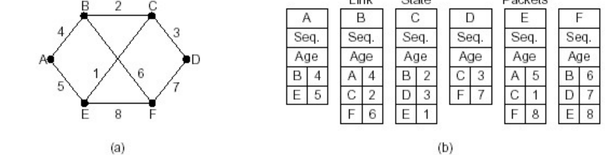
  
  + 将分组通过扩散的方法**发到所有其它路由器**
    
    + 为了确保可靠的泛洪，需要尽量保证每个节点都正确收到了信息。所以需要规定，关于某个节点的信息，需要向哪些邻居发送请求直到他们返回确认消息，自己需要向哪些邻居发送确认消息。
      
      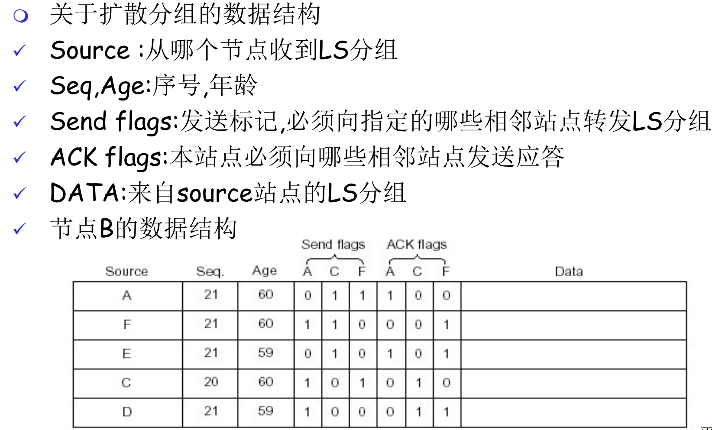

+ 使用LS路由算法，计算本站点到其它站点的最优路径，得到路由表【严格来说只有这部分算】
  
  + 实际上就是 Dijkstra 算法（复杂度 $O(nlogn+e)$）

+ 使用路由转发分组

### distance vector （距离矢量 DV）算法

路由器只知道与它有**物理连接关系的邻居路由器**，和**到相应邻居路由器的代价值**。通过叠代地与邻居交换路由信息、 计算路由信息。

DV 的基本思想&工作过程：

+ 各路由器维护一张路由表（到其他点的代价）
  
  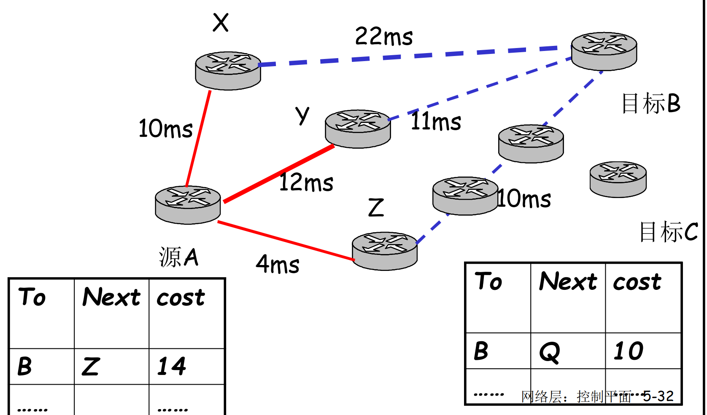

+ 定期测量到相邻节点的代价

+ 各路由器**与相邻路由器交换**路由表

+ 根据获得的路由信息,更新路由表
  
  + 根据各相邻站点声称它们到目标站点 B 的代价，计算出本站点 A 经过各相邻站点到目标站点 B 的代价
  + 找到一个最小的代价，和相应的下一个节点 Z ，到达节点 B 经过此节点 Z，并且代价为 A-Z-B 的代价

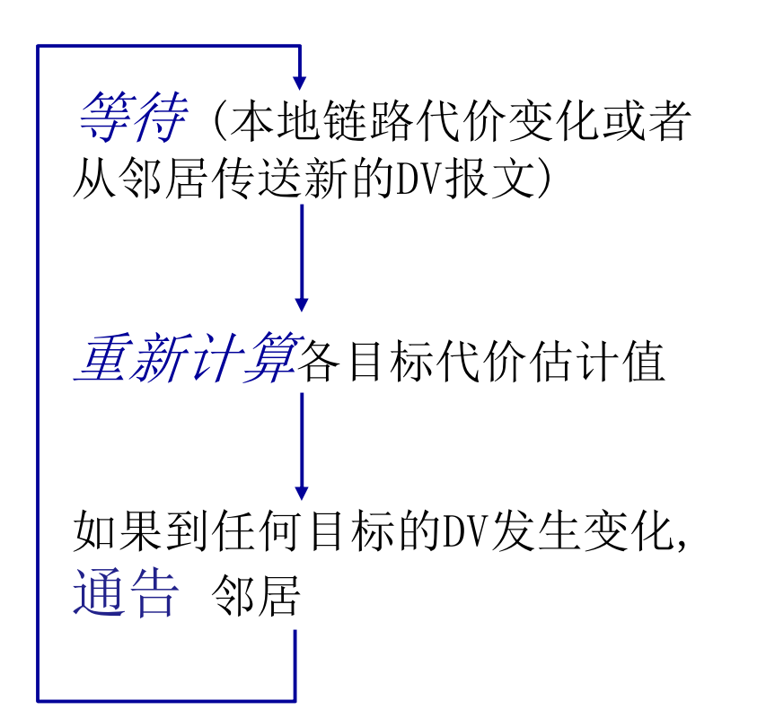

#### DV 的无穷计算问题

##### 无穷计算问题：好消息传得快坏消息传的慢

+ 好消息传的快，以每一个交换周期前进一个路由器 的速度进行
  
  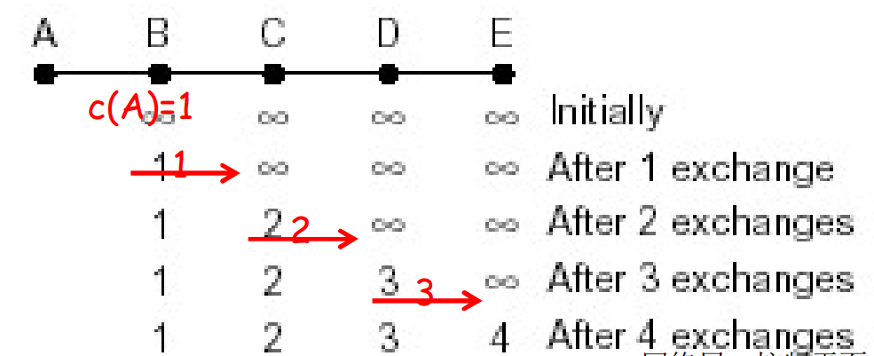

+ 坏消息传的慢，以 A B 断连为例
  
  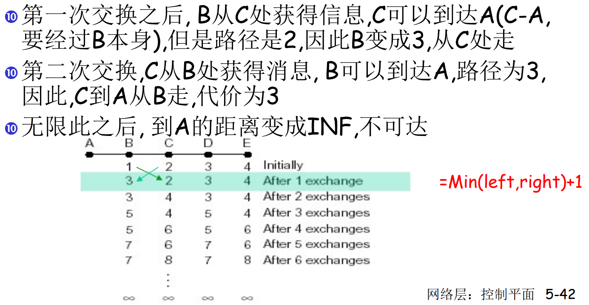

##### 解决方案：**毒性逆转&水平分裂 (split horizon) 算法**

任意节点到节点 X 的距离如果是从节点 Y 发送的路由信息中获得的，那么该节点向 Y 报告其到 X 的距离为 INF

> 毒性逆转：报告到某节点的距离为 INF，作用是通知别的路由器，这条路由已经不可用
> 
> 普通水平分割：从一个接口收到的路由不会再从这个接口泛洪出去。也就是不向 Y 报告其到 X 的距离

以上图为例：

+ C 知道要经过 B 才能到达A，所以 C 向 B 报告它到 A 的距离 为INF；C 告诉 D 它到 A 的真实距离
+ 第一次交换: B 通过测试发现到 A 的路径为 INF，而 C 也告诉 B 到 A 的距离为 INF，因此，B 到 A 的距离为 INF
+ 第二次交换: C从 B 和 D 那里获知，到 A 的距离为 INF，因此将它到 A 的距离为 INF
+ 即：坏消息以一次交换一个节点的速度传播

##### 某些拓扑下水平分裂法可能会失效：比如环路情况下

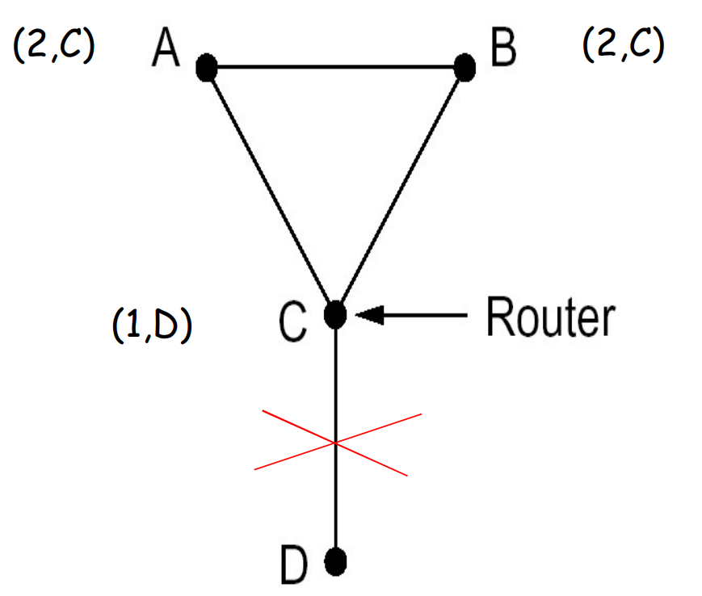

### LS 和 DV 的比较

消息复杂度：DV 少，之和邻居交换

收敛时间：LS 更优（但可能振荡）

健壮性：LS 更优（如果某个节点不能正确广播自己到邻居的链路代价，影响范围比较小）

## 自治系统内部路由选择协议

### RIP (Routing Information Protocol)

适用于小型网络，比较简单，在实际使用中已经较少适用。

采用 Distance vector 算法，是它的一种实现。

 RIP 以应用进程的方式实现：route-d (daemon)；通告报文通过UDP报文传送，周期性重复。

> 网络层的协议使用了传输层的服务，以应用层实体的 方式实现
> 
> 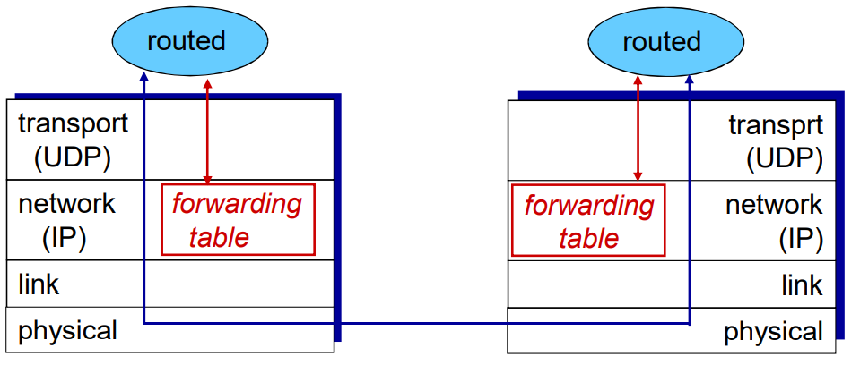

#### 及时的失效反馈

如果 180 秒没有收到路由通告信息，则认为邻居失效。采用带毒性逆转的水平分裂，快速反馈。

### OSPF (Open Shortest Path First)

采用 LS 链路动态算法，是它的一种实现。

#### 高级特性（RIP没有）

+ 允许有**多个代价相同的路径**存在 (在RIP协议中只有一个)【**负载均衡**的时候很有用】
+ 在大型网络中支持**层次性OSPF**
+ 安全: 所有的 OSPF 报文都是经过认证的 (防止恶意的攻击) 
+ 每条链路可以有多重代价，适用于不同的情况

#### OSPF 层次路由

2个级别的层次性: 本地, 骨干。

链路状态通告仅仅在本地区域 Area 范围内进行（每一个节点拥有本地区域的拓扑信息）。其他区域，通过区域边界路由器通信。

+ 区域边界路由器: “汇总（聚集）”到自己区域内网络的距离, 向其它区域边界路由器通告。
+ 每一个节点拥有本地区域的拓扑信息，与其他区域通信需要借助区域边界路由器
+ 骨干路由器: 仅仅在骨干区域内，运行 OSPF 路由
+ 边界路由器: 连接其它的自治区域 AS.

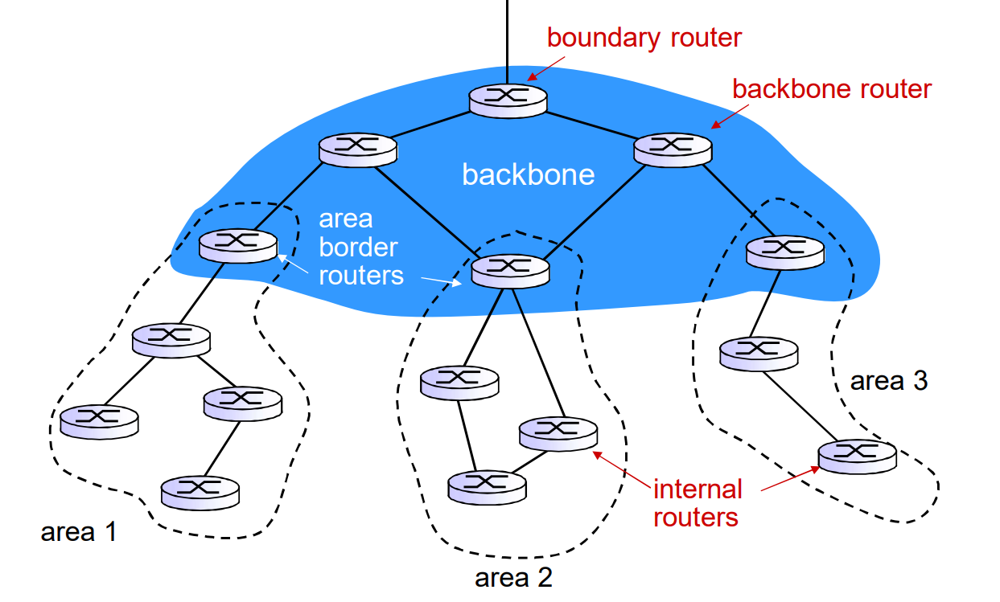

## ISP 之间（或自治系统AS之间）的路由选择协议

不同的 ISP 或机构内部**内部可能需要选择不同的路由算法**， 不对外暴露网络细节，屏蔽某些包。这种**制定自己的路由策略，并以此为准在一个或多个网络群体中采用的小型单位叫做自治系统（AS）或路由选择域**。一个AS用 AS Number(ASN) 唯一标示。AS 内部采用内部网关协议（RIP 或 OSPF 等），AS 之间采用 边界网关协议（BGP 等）。

> 一个 ISP 或机构可能包括 1 个或者多个AS

这样解决了规模问题：

+ AS内部规模可控，数量有限的路由器相互到达的问题（如 AS 节点太多，可分割 AS）
+ AS之间的路由的规模问题：增加一个AS，总体上来说，只是增加了一 个节点=子网。对于其他 AS 来说只是增加了一 个表项，就是这个新增的 AS如何走。

### BGP

BGP 基于 DV 距离矢量算法。

BGP 提供给每个 AS 以以下方法：

+ eBGP: 从相邻的 AS 那里获得子网可达信息
+ iBGP: 将获得的子网可达信息传遍到AS内部的所有路由器

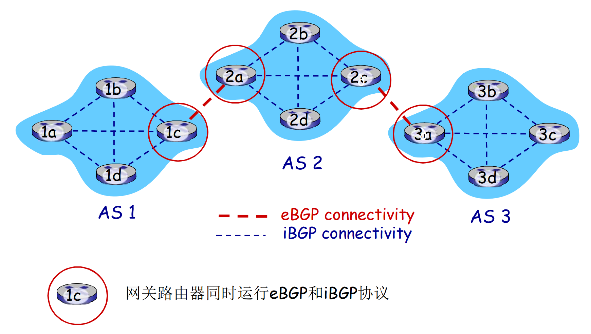

#### 路由通告内容

BGP 会话: 2个 BGP 路由器在一个半永久的 **TCP 连接**上交换 BGP 报文。

+ 路径：这在基础的 DV 中没有。指明了沿途经过的 AS 有哪些，可以防止环路

+ 下一条：为了到达我这个 AS，你应该传给谁（也就是我的地址），代价是什么

从多个 eBGP 会话，网关路由器可能获取有关一个子网 X 的多条路径，会根据策略选取最优的。

> 一种特殊的策略——热土豆策略：
> 
> 选择具备最小内部区域代价的网关作为往 X 的出口（如：2d选择2a，即使往X可能有比较多的AS跳数）：不操心域间的代价
> 
> 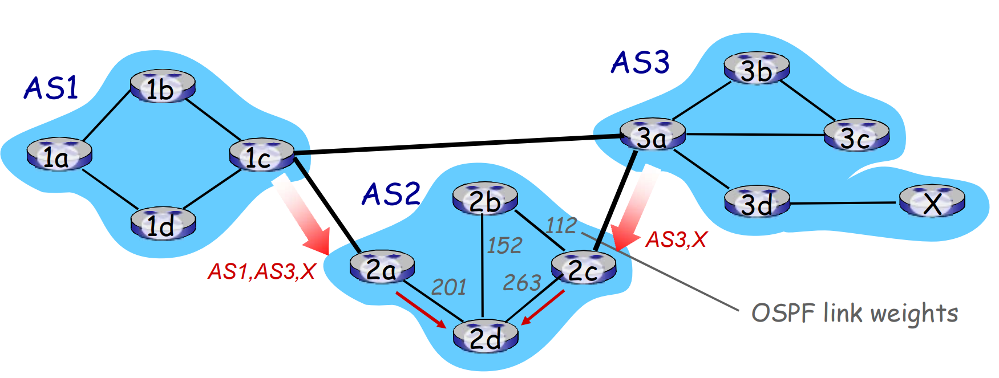

#### 路径通告流程

AS 1 中的 1a 路由器如何知道怎么去 AS 3 中的 3x 呢？

+ AS3 网关路由器 3a 向 AS2 的网关路由器 2c 通告路径： AS3,X
  
  + 因为 3a 参与 AS 内路由运算，知道本 AS 所有子网的信息与如何到达
  + 语义上：AS3 向 AS2承诺，它可以向子网X转发数据报。3a 是 2c 关于 X 的下一跳（next hop）

+ 路由器 AS2.2c 从 AS3.3a 接收到的 AS3,X 路由通告 **（通过 eBGP）**

+ 基于 AS2 的输入策略，AS2.2c 决定接收 AS3,X 的通告，而且 **(通过 iBGP）**向 AS2 的所有路由器进行通告

+ 基于 AS2 的策略，AS2 路由器 2a 通过 eBGP 向 AS1.1c 路由器通告 AS2,AS3,X 路由信息（路径上加上了 AS2 自己作为 AS 序列的一跳）

+ 同理 1c 通过 eBGP 得知路径，并通过 iBGP 告诉 AS1 内的所有路由器。

+ AS1.1a 根据 AS 内和 AS 间的路由，共同决定到达子网 X 的下一跳是什么。
  
  例如 1a 的路由表项：
  
  | dest | interface    |
  | ---- | ------------ |
  | ...  | ...          |
  | X    | 1c 的那个**端口** |
  | ...  | ...          |

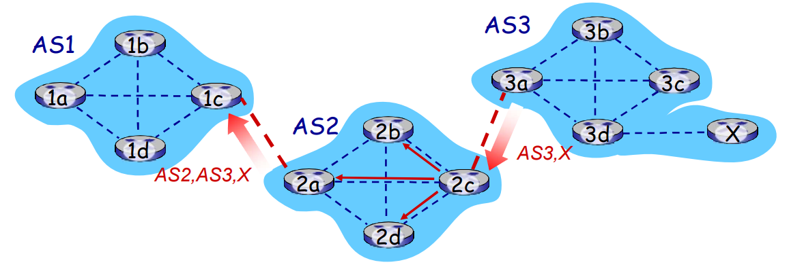

## 控制平面用到的协议

### ICMP互联网控制报文协议（网络层协议）与 Ping & Traceroute

ICMP (Internet Control Message Protocol ) 是互联网控制消息协议，用于**IP 协议中发送控制消息**。ICMP 封装在 IP 数据报中，但是不属于高层协议。 ICMP 的两个主要功能：

+ 确认 IP 包是否能够成功到达目标地址
+ 网络诊断

常见的类型有：

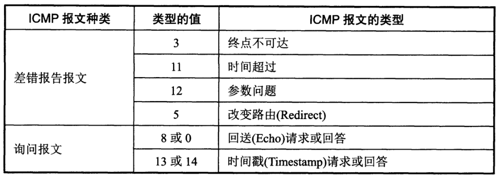

#### ICMP 的应用

1. Ping
   
   Ping 是 ICMP 的一个重要应用，主要用来测试两台主机之间的连通性。
   
   Ping 的原理是通过向目的主机发送 ICMP Echo 请求报文，目的主机收到之后会发送 Echo 回答报文。Ping 会根据时间和成功响应的次数估算出数据包往返时间以及丢包率。

2. Traceroute
   
   跟踪一个分组从源点到终点的路径。Traceroute 发送的 IP 数据报封装的是无法交付的 UDP 用户数据报，并由目的主机发送终点不可达差错报告报文。
   
   - 源主机向目的主机发送一连串的 IP 数据报。第一个数据报 P1 的生存时间 TTL 设置为 1，当 P1 到达路径上的第一个路由器 R1 时，R1 收下它并把 TTL 减 1，此时 TTL 等于 0，R1 就把 P1 丢弃，并向源主机发送一个 ICMP 时间超过差错报告报文；
   - 源主机接着发送第二个数据报 P2，并把 TTL 设置为 2。P2 先到达 R1，R1 收下后把 TTL 减 1 再转发给 R2，R2 收下后也把 TTL 减 1，由于此时 TTL 等于 0，R2 就丢弃 P2，并向源主机发送一个 ICMP 时间超过差错报文。
   - 不断执行这样的步骤，直到最后一个数据报刚刚到达目的主机，主机不转发数据报，也不把 TTL 值减 1。但是因为数据报封装的是无法交付的 UDP，因此目的主机要向源主机发送 ICMP 终点不可达差错报告报文。
   - 之后源主机知道了到达目的主机所经过的路由器 IP 地址以及到达每个路由器的往返时间。
