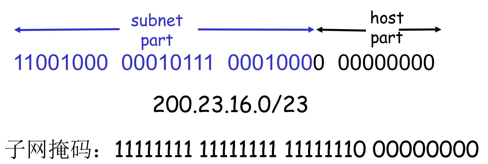
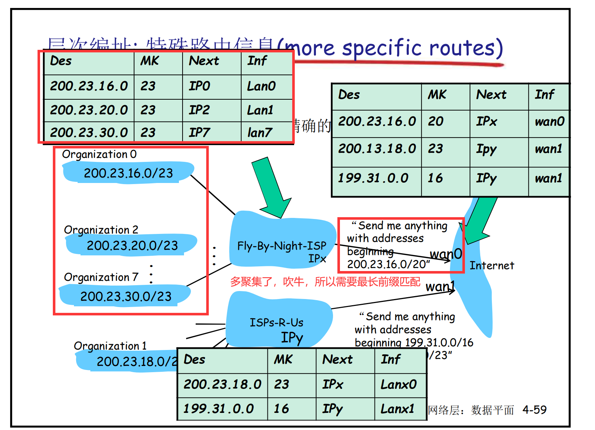

# 网络层（数据平面）

## 网络层功能 & 数据平面、控制平面

#### 网络层提供的服务

+  在发送主机和接收主机对之间传送**传输层 的段（segment）**
+ 在发送端将段**封装到数据报**，在接收端，将段上交给传输层实体
+ 检查途径中间节点的数据报头部

#### 网络层关键功能

转发：将分组从路由器的**输入接口**转发到合适的**输出接口** （单个路由器上的操作）

+ 对应数据平面，关注于如何完成转发操作
  + 传统方式：基于目标地址 + 转发表
  + SDN（software-defined networking）方式：基于多个字段 + 流表

路由：使用路由算法来决定分组从发送主机到目标接收主机的**路径**（路径规划的过程）

+ 对应控制平面，决定数据报如何在路由器之间路由、经过的路径
  +  传统的路由算法: 在路由器中被实现
  + SDN: 在远程的服务器中实现

> 路由表里有什么？
>
> 包括但不限于：
>
> | Dest 目标网络地址 | Mask 目标网络子网掩码 | 下一条 IP 地址 | Interface 从哪个口发出去 | 代价 |
> | ----------------- | --------------------- | -------------- | ------------------------ | ---- |

## 路由器结构

### 结构概况

 路由：运行路由选择算法／协议 (RIP, OSPF, BGP)  ->  生成路由表

 转发：从输入到输出链路交换数据报

+ 根据路由表进行转发。不考虑 SDN 时，仅基于目标 IP

  如 (IP Des addr) & (mask)== destination, 则按照表项对应的接口转发该数据报；如果都没有找到,则使用默认表项转发数据报

  

+ 转发时遵循最长前缀匹配原则。因为子网聚集的时候，可能会把间隙补上，虚假的宣称某端口能到达某网络

  

### 输入端口

+ 缓存

  + 当交换机构的速率小于输入端口的汇聚速率时，在输入端口可能要排队，因此需要一个缓存
  + 可能因为过长的排队延迟或输入缓存溢出，可能造成丢失
  
  

### 交换结构

将分组从输入缓冲区传输到合适的输出端口。

当具有 **N 个输入端口**时，交换机构的**交换速度是输入线路速度的 N 倍**比较理想，才不会成为瓶颈。

### 输出端口

+ 缓存
  + 当数据报从交换机构的到达速度比传输速率快就需要输出端口缓存
  + 可能因为过长的排队延迟或输入缓存溢出，可能造成丢失
+ 当多个输入端口通过交换结构向输出端口转发数据报的时候，选择哪个？有很多调度策略。FIFO, RR, etc.

## IP: Internet  Protocol

### IP 协议到底是什么？

（不一定正确的理解）IP 协议是**对不同网络进行互联的协议**。在**各种局域网地址标准**上，为互联网络中的所有主机设定了**统一的IP地址**，保证不同网络中的主机主要接入互联网就可以**互相识别通信**。

> 更大白话一点：因为大家用的局域网标准都不一样。有用以太网的，有用ATM的，XXX。这些网络咋互联咋互联转发数据呢？IP 协议统一了一个地址, e.g. IP 地址。还统一了 IP 数据报的格式，分组怎么处理等等。路由器可以按照统一的标准转发。（这很棒！）

### 数据报格式

-   **版本**   : 有 4（IPv4）和 6（IPv6）两个值；
-   **首部长度**   : 占 4 位，因此最大值为 15。值以 4 Bytes 为单位，例如值为 1 表示的 4 Bytes。因为固定部分长度为 20 字节，因此该值最小为 5。**如果可选字段的长度不是 4 字节的整数倍，就用尾部的填充部分来填充。**
-   **区分服务**   : 用来获得更好的服务。包括一个3 bit的优先权子字段（现在已被忽略），4 bit 的 TOS 子字段和 1 bit 未用位但必须置0。4bit的TOS分别代表：最小时延、最大吞吐量、最高可靠性和最小费用。4bit中只能置其中1bit。如果所有4bit均为0，那么就意味着是一般服务。比如 FTP 的控制连接需要最小时延，数据连接需要u自大吞吐量。
-   **总长度**   : 包括首部长度和数据部分长度。
-   **生存时间**   ：TTL，防止无法交付的数据报在互联网中不断兜圈子。
-   **协议**  ：指出携带的数据应该上交给哪个协议进行处理，例如 ICMP、TCP、UDP 等。
-   **首部检验和**  ：数据报每经过一个路由器，都要重新计算检验和。因此检验和**不包含数据部分**可以减少计算的工作量。
-   **标识**   : 在数据报长度过长从而发生分片的情况下，相同数据报的不同分片具有相同的标识符。
-   **标志**：第 1 个 bit 不用。第 2 个 bit 置1标示 “不分片”，否则标示分片。在分片的情况下，第 3 个 bit 置1表示“还有更多分片”，只有最后一个分片是 0。
-   **片偏移**   : 和标识符一起，用于发生分片的情况。**片偏移的单位为 8 字节**。
-   **选项**：包括但不限于
    -   记录路径（让每个路由器都记下它的IP地址）
    -   时间戳（让每个路由器都记下它的IP地址和时间）

### 分片

网络链路有 MTU (最大传输单元) ，不同的链路类型有不同的 MTU。大的IP数据报在网络上被分片，一个数据报被分割成若干个小 的数据报：

+  相同的ID、不同的偏移量、最后一个分片第三个标志位全为0
+ “重组” **只在最终的目标主机**进行（因为路由器重组负担很大，而且重组了之后往下一个路由器发的时候搞不好又要分片，无效劳动）
+ 到了目标主机后，根据头部信息排序重组。

> 为了尽量减小分片带来的路由器负担，会采用**路径MTU发现**技术。路径MTU指从发送端主机到接收端主机的所有链路中最小的 MTU，主机按此将数据报分片然后再发送出去，避免中途路由器进行分片处理。这个过程是：
>
> + 发送时 IP 首部中的分片标志位设置为不分片
> + 中途某路由器如果发现数据报过大且不分片就转发不了，就丢包，并通过 ICMP 通知下一次 MTU 大小
> + 反复上述过程，直到路径上再也没有路由器返回 ICMP 消息。
> + UDP 层转发过来的消息“UDP 首部 + UDP 数据”在 IP 层被分片。按分片大小发送。 （UDP 似乎不会感知到，只有一个 UDP 首部） 
>
> 上述是 UDP 的例子，在 TCP 情况下，会根据 MTU 算出最大段长度 MSS，IP 层就不用再分片了。

### IPv4 地址

路由器通常拥有多个接口（主机也可能是多个），**一个IP地址和一个接口相关联**。

IPv4 由 32 位正整数表示，每 8 位为 1 组。其由两部分组成：“网络标识（网络地址）”  + “主机标识（主机地址）”。子网掩码用于标识前多少位为网络标识。

**相互连接的**每**个数据链路段**必须具有**不同的“网络标识”**，**每个数据链路段内的主机**必须有**相同的网络地址**。**同一网段**内的**“主机标识”必须不同**。当 IP 数据包转发时，利用目标 IP 的网络标识进行路由，即使看不到主机标识，只要看到网络标识就知道在哪个网段。

> 个人理解：家里路由器有一个对外网的 WAN 接口，有一个外网分配的 IP。对内部其他设备而言，还有一个内部接口，通常不用去配置。可以看作是这个对内的接口通过一个交换机和其他接入设备连在一起。

#### IPv4 地址分类

IPv4 地址分为 A B C D 四类。

+ A类地址前 8 位为网路标识，其中首位为 0，因此网段为 0.0.0.0~127.0.0.1
+ B类地址前 16 位为网络标识，且前 2 位必须为 10，因此网段位 128.0.0.1~191.255.0.0
+ C类地址前 32 位位网络标识，且前 3 位必须为 110，因此网段为 192.0.0.0~223.255.255.0
+ D类地址没有主机地址，全是网络标识，且前 4 位必须为 1110。它没有主机地址，所以通常用于多播【直说不了解即可】。

>  需要说明的是，主机地址全为 0 标示网络标识（网络号），或暂时不可获取 IP 地址；全为 1 表示广播地址。因此分配主机地址时应该去掉这两种情况。
>
>  广播地址用来向一个网段发送数据包，其主机位全为 1。广播包分为本地广播（本网段内）和直接广播（发到其他网段，通常会被屏蔽）。

> 专用地址：
>
> + Class A 10.0.0.0-10.255.255.255         MASK 255.0.0.0
> + Class B 172.16.0.0-172.31.255.255     MASK 255.255.0.0
> + Class C 192.168.0.0-192.168.255.255 MASK  255.255.255.0

#### 子网

什么是子网(subnet)？同时满足：

+ 节点（主机或者路由器）它们的 IP地址的高位部分相同
+ **无需路由器介入**，子网内各主机可以在物理上相互直接到达

#### CIDR: Classless Inter-Domain Routing （无类域间路由）

子网部分可以在任意的位置，地址格式: a.b.c.d/x, 其中 x 是 地址中子网号的长度

#### 路由聚集

将多个连续的网络合并到一个大的网络内，**通过路由集中降低了路由器的负担**。例如 203.183.224.0/23 + 203.183.254.0/23 = 203.183.224.0/22。这种通过使用网络前缀减少路由表项的方式成为路由聚合，也称为**超网**。

## TCP/IP 协议簇其他和网络层相关的协议&技术（不一定处于网络层）
### DHCP（服务于网络层的，基于 UDP 的应用层协议）

允许主机在加入网络的时候，动态地从服务器那里获得、更新 IP地址

DHCP 让网络能够即插即用。工作机制：

+ 流程：

  + 客户端发送 DHCP **发现**包，要求设置 IP 地址和子网掩码（由于不知道  IP 情况，目的地址为广播地址 255.255.255.255，源地址为 0.0.0.0）
  + DHCP 服务器发送 DHCP **提供**包，返回所分配的设置（目的地址为广播地址 255.255.255.255，源地址为 DHCP 服务器的地址）
  + 客户端从（可能的）多个返回中，选择一个使用，并发送 DHCP **请求**包，声明需要使用其设置（目的地址仍然为广播地址 255.255.255.255，源地址为 0.0.0.0）
  + DHCP 服务器发送 DHCP **确认**包，批准使用。（目的地址为广播地址 255.255.255.255，源地址为 DHCP 服务器的地址）

  > DHCP 消息中会有其他辅助信息，比如客户端的 MAC Addr。这样有多个客户端同时发出请求的时候，不会互相混乱。

  网络设置结束后，方可进行 TCP/IP 通信。不需要 IP 地址时，可以发送 DHCP 解除包。

  

+ DHCP: 不仅仅是IP addresses，返回内容包括：IP 地址、子网掩码、默认网关、DNS 服务器域名和 IP。

+ DHCP 中继代理

  大型网络中，会有很多网段（比如一个学校内），不宜为每个网段单独设置 DHCP 服务器，可通过 DHCP 中继代理，由一个 DHCP 服务器统一管理：客户端向 DHCP 中继代理发送 DHCP 请求包，DHCP 中继代理将这个包以单播形式发送给 DHCP 服务器，服务端收到后再通过代理返回应答。

### NAT(network address translator)

用于在本地网络中使用私有地址，在连接互联网时使用全局 IP 地址。除了转换 IP 地址之外，还出现了可以转换 TCP、UDP 端口号的 NAPT(network address port translation)技术。还有 IPv4 和 IPv6 转换的技术。

+ NAT 穿越方法：
  + 静态 NAT 映射
  + 使用一个中继：NAT后面的服务器建立和中继的连接，外部的客户端链接到中继，中继在2个连接之间桥接

### 地址解析协议 ARP（网络层协议）

确定了 IP 地址便可以向其发送数据。但在底层的数据链路层， 进行通信时需要了解 IP 地址对应的 MAC 地址。

ARP 是一个解决地址问题的协议，以目标 IP 为线索，用来定位下一个应该接受数据分包的网络设备对应的 MAC 地址。（跨网段通信的时候，上层会自动将下一跳的 IP 地址指定为下一跳路由器的 IP 地址，因此这里 ARP 用来找路由器对应端口的 MAC 地址。）

+ 流程

  + 主机 A 为了获得主机 B （或路由器端口等）的 MAC 地址，**广播**发送一个 ARP 请求包。包中包含了需要检索的 IP 地址和发送端自身的 IP 及 MAC。

  + 链路上所有的设备都刻有接收到 ARP 请求包，检查是否和自身 IP 相匹配。若匹配，则将自己的 MAC 地址放入 ARP 响应包返回给主机 A（不是广播）。

+ 缓存
  + 对一个地址发送 IP 数据包之后，可能会对同一地址多次发送，因此可以记录 ARP 的结果；
  + 在接收端缓存 MAC 地址也是一种提高效率的方法：接受 ARP 请求的主机可以缓存 ARP 请求中包含的发送端 IP 及 MAC，根据此发送相应包；接受 IP 数据包的主机往往会继续返回 IP 数据包给发送端主机（因此需要 MAC）。

+ RARP

  + RARP 服务器提供 MAC 到 IP 的映射转换。

  + RARP是一种逝去的**地址分配技术**

    > 在 RARP 的基础上，后面又有了 **Bootp协议**，功能同 RARP，也是用于电脑接入网络时，用来获取IP地址的。
    >
    > Bootp 协议能让电脑启动时，**不仅仅获取IP地址，而且能获取到网关地址**，从而让电脑实现跨网段通信。**服务器仍然需要提前手工绑定 MAC 和 IP 地址**
    >
    > RARP 是 Bootp 和 DHCP 的鼻祖，目前我们的电脑基本不会用到这个协议

### 隧道技术

隧道技术是一种通过使用互联网络的基础设施在网络之间传递数据的方式。被封装的数据包在公共互联网络上传递时所经过的逻辑路径称为隧道。

隧道协议将这些其他协议的数据帧或包**重新封装在新的包头中发送**。新的包头提供了路由信息，从而**使封装的负载数据能够通过互联网络传递**。被封装的数据包在隧道的两个端点之间通过公共互联网络进行路由。

它的应用

+ 从IPv4到IPv6的平移：在IPv4路由器之间传输的IPv4数据报中携带IPv6数据报

  

+ 虚拟专用网 VPN

  一个机构并不需要把所有的主机接入到外部的互联网中，机构内的计算机可以使用仅在本机构有效的 IP 地址（专用地址），只与本机构内的其它主机通信。使用隧道技术在没有铺设专线的两个地域之间相互通信。

  
