# 链路层与局域网
数据链路层负责：从一个节点通过链路将 （帧中的）数据报发送到相邻的物理节点 （一个子网内部的2个节点）。基本问题有：

+ 封装成帧

  + 将上层载荷封装，加上合适的首部尾部，必要的前导码定界符等，能够区分每一个帧的开始和结束

+ 透明传输

  帧使用首部和尾部进行定界，如果帧的数据部分含有和首部尾部相同的内容，那么帧的开始和结束位置就会被错误的判定。需要在数据部分出现首部尾部相同的内容前面插入转义字符。如果数据部分出现转义字符，那么就在转义字符前面再加个转义字符。在接收端进行处理之后可以还原出原始数据。这个过程透明传输的内容是转义字符，用户察觉不到转义字符的存在。

  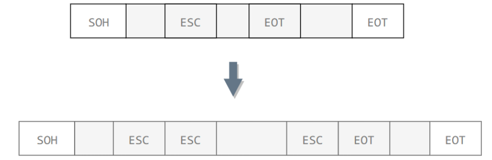

+ 差错检测

## 基础知识章节

### 术语定义

+ 节点nodes：主机和路由器、网桥、交换机等

+ 链路links：沿着通信路径，连接相邻节点通信信道

+ 帧frame：第二层协议的数据单元，封装了数据报

  > protocol data unit（PDU）

### 链路层服务

+ 成帧，链路接入

  + 将数据报封装在帧中，加上帧头（MAC地址等）、帧尾部

  +  如果采用的是共享性介质，需要**信道接入**，**获得信道访问权**

+ 在（一个网络内）相邻两个节点完成**可靠数据传递（转发）**
  + 不是所有的链路层都提供这些服务，例如**以太网**等低出错率的链路不提供，而在**出错率较高**的无线链路中经常使用

+ 流量控制

+ 错误检测、差错纠正

### 链路层在哪里实现

链路层功能在“适配器”上 实现 (aka network  interface card NIC) 或 者在一个芯片组上，接到主机的系统总线上

### 网络连接方式

+ 点到点连接
  + 实现简单，封装和解封装简单
+ 多点连接
  + 通过共享介质（如同轴电缆）、交换机等设备相连
  + 寻址很重要 
  + 需要协调各节点对共享性介质的访问和使用（MAC）
    + 竞争方式：冲突之后的协调
    + 令牌方式：令牌的占有、释放、传递

WAN：常采用点到点的链路

+ 带宽大、距离远、延迟大
+ 如果采用多点连接方式
  + 竞争方式：一旦冲突代价大
  + 令牌等协调方式：协调节点的代价大

LAN：常采用多点连接的方式

+ 节点间相互连接非常方便

##  差错检测和纠正

### 基本信息

+ EDC（error-detection and-correction）=差错检测和纠正位

+ D =由差错检测保护的数据，可以包含头部字段

+ 错误检测不是100%可靠的，更长的EDC字段可以得到更好的检测和纠正效果

  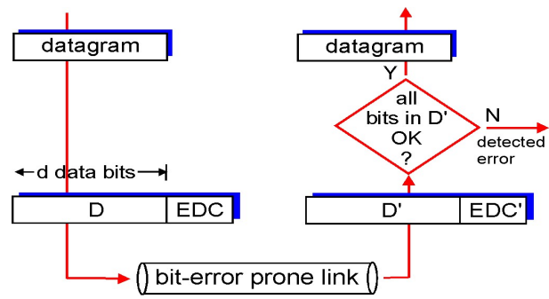
  

### 奇偶校验

+ 单bit奇偶校验：检测单个bit级错误
+ 2维奇偶校验：检测和纠正单个bit错误

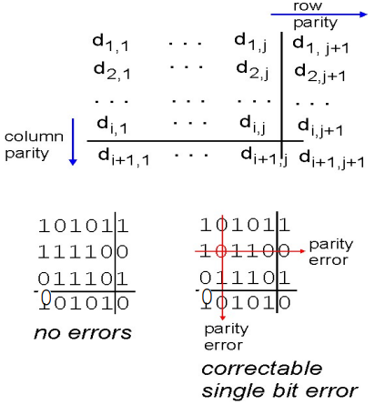

 ### Internet 校验和 checksum（仅仅用在传输层，这里略）

### CRC校验和（循环冗余校验）

是强大的差错检测码， 实际中广泛使用（以太网、802.11 WiFi、ATM）

+ 生成多项式G：双方协商**r+1位**模式（**r次方**）

+  目标:选择 r 位 CRC附加位R，使得

  +  正好被 G整除
  + 接收方知道：如果非0余数: 检查出错误
  + 能**检出所有 <= r 位**的突发错误

+ 计算：左移 r 位后，除以生成多项式，得到的余数即使 R （不足在前面补 0）

  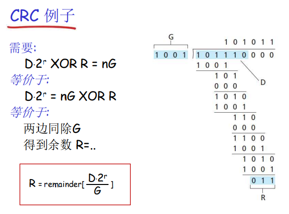

## 多点访问协议（共享广播信道、多路访问）

可以划分两种类型的链路：

+ 点对点（如拨号访问的PPP协议、以太网交换机和主机之间的点对点链路）
+ 广播 (共享线路或媒体，如传统以太网的同轴电缆、无线局域网)：2个或更多站点同时传送: 冲突（collision）

多路访问协议：

+ 分布式算法-决定节点如何使用共享信道，即：决定节点什么时候可以发送
+ 关于**共享控制的通信**必须用**借助信道本身**传输
+ 分为 3 大类
  + 信道划分：把信道划分成小片（时间、频率、编码）
  + 随机访问：信道不划分，允许冲突、 冲突后恢复
  + 依次轮流：节点依次轮流，但是有很多数据传输的节点可以获得较长的信道使用权（不公平）

### 信道划分类

共享信道在高负载时是有效和公平的，在低负载时效率低下

#### TDMA

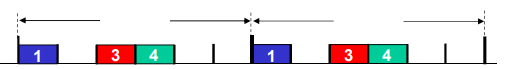

+ 轮流使用信道，信道的时间分为周期，每个站点使用每周期中固定的时隙
+ 如果站点无帧传输，时隙空闲，会导致浪费

#### FDMA 

+ 信道的有效频率范围被分成一个个小的频段，每个站点被分配一个固定的频段

#### CDMA 码分多路访问（code division multiple access）

+ 所有站点在整个频段上同时进行传输, 采用**编码原理加以区分**，完全无冲突
+ 类比：不同的人使用不同的语言讲话

### 随机访问类

在低负载时效率高：单个节点可以完全利用信道全部带宽；高负载时：冲突开销较大，效率极低，时间很多浪费在冲突中。

需要规定：如何检测冲突、 如何从冲突中恢复（如：通过稍后的重传）

时隙ALOHA、纯ALOHA(非时隙)、CSMA(载波侦听多路访问)、CSMA/CD(冲突检测)、CSMA/CA(冲突避免)

#### CSMA

在传输前先侦听信道，如果侦听到信道空闲，传送整个帧，如果侦听到信道忙，推迟传送

+ 冲突仍然可能发生
  + 由传播延迟造成，两个节点 可能侦听不到正在进行的传输。（例如一个在最左边发，一个在最右边发）
  
    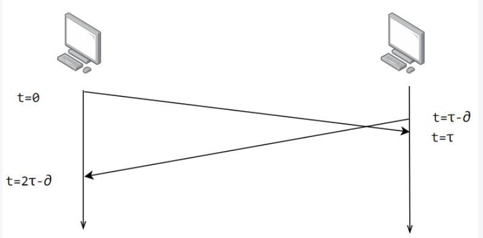
  
  + 整个冲突帧的传输时间都被浪费了，是无效的传输
  
  + 传播延迟（距离）越远，冲突的概率越大

#### CSMA/CD（现行以太网使用）

+ 边传输边检测，有线局域网中容易实现：如检测信号强度等
+  冲突发生时则传输终止，减少对信道的浪费

以太网的 CSMA/CD 算法

1. 适配器获取数据报，创建帧

2. 发送前侦听信道 CS，闲：开始传送帧；忙：一直等到闲再发送

3. 发送过程中，冲突检测CD

     + 没有冲突:成功

     + 检测到冲突:放弃,之后尝 试重发

4. 发送方适配器检测到冲突， 除放弃外，还发送一个 Jam 信号，所有听到冲突的适配器也是如此。这是**强化冲突**：让所有站点都知道冲突。（因为如果很快检测到冲突并很快放弃发送，电磁波信号可能衰减的让远方节点不知道发生了冲突）

5. 如果放弃，适配器进入指数退避状态（二进制指数退避算法）

6. 第m次失败后，适配器随机选择一个 {0，1，2， ， $2^{m-1}$} 中的 K，等待 K*512 位时 ，然后转到步骤 2 

   > 位时: 发送 1bit 的时延，例如10Mbps以太网中的位时是 1/10M=0.1us

所用的一些概念

+ $T_{prop}$ = LAN上2个节点的**最大传播延迟**。最先发送的站点最多经过 $2T_{prop}$ 就可以知道是否发生了碰撞，称 $2T_{prop}$ 为   **争用期**  。只有经过争用期之后还没有检测到碰撞，才能肯定这次发送不会发生碰撞。最大传播延迟和距离有关，以太网中通常定义为 2500m。

#### CSMA/CD（通常无线局域网中使用）

不做冲突检测（不可检测，自身信号远远大于其他节点信号；且由于覆盖范围不同，不能知道接收方是否有冲突了）

策略为：

+ 无法CD，**一旦发送就必须发完**，如冲突信道浪费严重，代价高昂
+ 尽量**事先避免冲突**，而不是在发生冲突时放弃然后重发
+ 听到发送的站点，分别选择随机值，回退到0发送
  +  不同的随机值，一个站点会胜利。失败站点会冻结计数器，当胜利节点发完再发

但是无法完全避免冲突，原因有：

+ 两个站点相互隐藏，A和C只知道B的存在，不能互相感知
+ 选择了非常近的回退值

还可以进一步采取预约的策略，发送方发送 RTS (request to send)，接收方在检测不到冲突的时候发送 CTS (clear to send) 允许发送，并使其他节点禁言。

### 轮流 (Taking Turns) 访问类

太复杂，目前放弃不用

#### 轮询

+ 主节点邀请从节点依次传送
+ 缺点
  + 轮询开销：轮询本身消耗信道带宽
  + 等待时间：每个节点需等到主节点轮询后开始传输，即使只有一个节点，也需要等到轮询一周后才能够发送。
  + 单点故障：主节点失效时造成 整个系统无法工作

#### 令牌传递

+ 控制令牌 (Token) 循环从一 个节点到下一个节点传递
+ 缺点
  + 令牌开销：本身消耗带宽
  + 延迟：只有等到抓住令牌，才可传输
  + 单点故障：令牌丢失系统级故障，整个 系统无法传输

##  LANs

### 寻址：LAN 地址和 ARP

#### LAN（MAC/物理/以太网）地址

用于使帧从**一个网卡传递到与其物理连接的另一个网卡** (在同一个物理网络中)，**48bit MAC地址**固化在适配器的ROM，有时也可以通 过软件设定

| 第 1 位        | 第2位                 | 第3~24位   | 第25~48位    |
| -------------- | --------------------- | ---------- | ------------ |
| 表示 单播/多播 | 表示全局地址/本地地址 | 厂商识别码 | 厂商内识别码 |

#### 网络地址和mac地址分离

+ 两种地址的作用

  + IP地址完成网络到网络的交付。由于其分层，可以用于路由聚集，减少路由表项。
  + MAC地址完成一个物理网络内部的节点到节点的数据交付

+ 为啥要分离

  + 网络层除了IP，还有其他协议，分离的话可以一块网卡支持多种协议
  + 网卡坏了，换一个网卡，IP 可以不变，上层应用不需要变化
  + 若没有分离，每次都要上传到 IP 层判断，是不是给自己的

  > 看到知乎上一种说法，如果先出来的是 IP 而不是 MAC，可能就不需要 MAC 了。我表示认同。

#### ARP (Address Resolution Protocol)

+ 在LAN上的每个IP节点都有一个ARP表
  + ARP是即插即用的，不需要配置
  + 包括一些 LAN节点的  IP/MAC 地址的映射 <IP address; MAC address; TTL>。 典型的 TTL 是 20 min（因为映射关系可能变化）
+ 流程
  + A 广播包含 B 的 IP 地址的 ARP 查询包。Dest MAC address =  FF-FF-FF-FF-FF-FF，LAN上的所有节点都会收到该查询包
  + B 接收到 ARP 包，回复 A 自己的MAC地址，其中使用了 A 的 MAC 地址（单播）
  + A 在自己的 ARP 表中，缓存 IP-to-MAC 地址映射关系 ，直到信息超时

### 以太网

目前最主流的**LAN技术**：98%占有。（LAN 的技术还包括 ATM 等。）

> 以太网是技术概念，LAN 的一种技术。它规定了包括物理层的连线、电子信号和介质访问协议等内容。
>
> 互联网是范围概念。

+ 无连接（没有握手）、不可靠（没有 ACK，本身较可靠）

+ 使用 CSMA/CD 的多路访问竞争型算法

+ 根据不同通信电缆（同轴电缆、双绞线、光纤等）和不同通信速度，衍生出不同类型

#### 物理拓扑

+ 总线型（用同轴电缆等）：可靠性差，破损截面会反弹电磁波信号，让发送节点误认为产生了冲突

+ 星型（借助 hub 或 switch）：
  + hub：一个接口收，所有端口发，就像 hub 盒子里有一个总线一样。**在一个碰撞域内**，没有帧的缓存
  
  + switch：每个节点以及相连的交换机端口**使用（独立的）以太网协议**（不会和其他节点的发送产生碰撞），（存储转发）
  
    + 这时候是非共享介质网络。不同设备不共享介质，每个站点直连交换机，由交换机负责转发数据帧。
  
      > 这种连接在全双工模式下不会有冲突，不需要CSMA/CD的机制，可以高效通信。【Tip：双绞线内，发送和接收的线是分开的，所以可以全双工】

#### 以太网的帧结构 

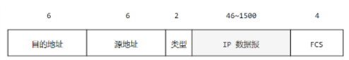

+ 前导码:
  + 7B 10101010 + 1B 10101011 (8 Bytes)
  + 用来同步接收方和发送方的时钟速率，使得接收方将自己的时钟调到和发送端的时钟同步
+ 地址：6字节源MAC地址，6字节目标MAC地址
+ 类型：指出高层协 (大多情况下是IP，但也支 持其它网络层协议）
+ 数据  ：长度在 46-1500 之间，如果太小则需要填充；
+ FCS（Frame Check Sequence） ：帧检验序列，使用的是 **CRC 检验**方法

> 目的地址、源地址、类型是 帧头
>
> FCS 是帧尾
>
> 前导码不是帧头。
>
> 以太网规定了帧间间隔为 96位时，所以 MAC 帧不需要定界标识符（下图从左往右发送）
>
> 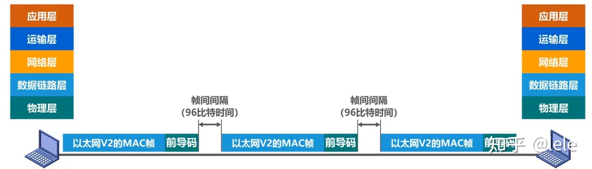

### Hub & Switch

+ Hub
  + 所有以Hub连到一起的站点处在一个网段，处在一个碰撞域
  +  通过Hub可扩展节点之间的最大距离
  +  通过Hub,不能将不同速率的网络连接到一起
+ Switch（只有两个口的也可以叫网桥）
  + **隔离了冲突域，但是没有隔离广播域** (毕竟 ARP 可是广播诶)
  + **链路层**设备：扮演主动角色（**端口执行以太网协议**）
  + 对帧进行**存储和转发**，根据目标MAC地址进行选择性转发
  + 每个端口有MAC地址；无IP地址
  + 即插即用，自学习转发表：<MAC addr, interface, TTL>。（还会有生成树算法，防止环形造成广播风暴）
    + 当接收到帧，交换机学习到发送站点所在的端口，记录 MAC 地址-端口的映射关系
    + 不知道其位置在哪：**泛洪**；知道在哪：**选择转发**
    + 如果源和目标的 MAC 位于同一个端口，则**过滤**

### VLAN

>+ 图文并茂VLAN详解，让你看一遍就理解VLAN - 51CTO网工运维之家的文章 - 知乎 https://zhuanlan.zhihu.com/p/385949949
>+ 网络工程师（17）：用路由器让VLAN之间互通 - 微峰清雨的文章 - 知乎 https://zhuanlan.zhihu.com/p/137368250

VLAN 的目的是：将同一个局域网划分成**物理位置无关的**不同的广播域，避免广播风暴。

IEEE 定义了一种扩展的以太网帧格式 802.1Q，它在标准以太网帧上加进了 4 字节首部 VLAN 标签，用于表示该帧属于哪一个虚拟局域网。

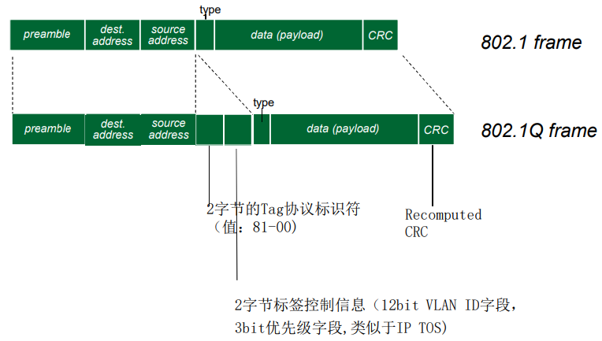

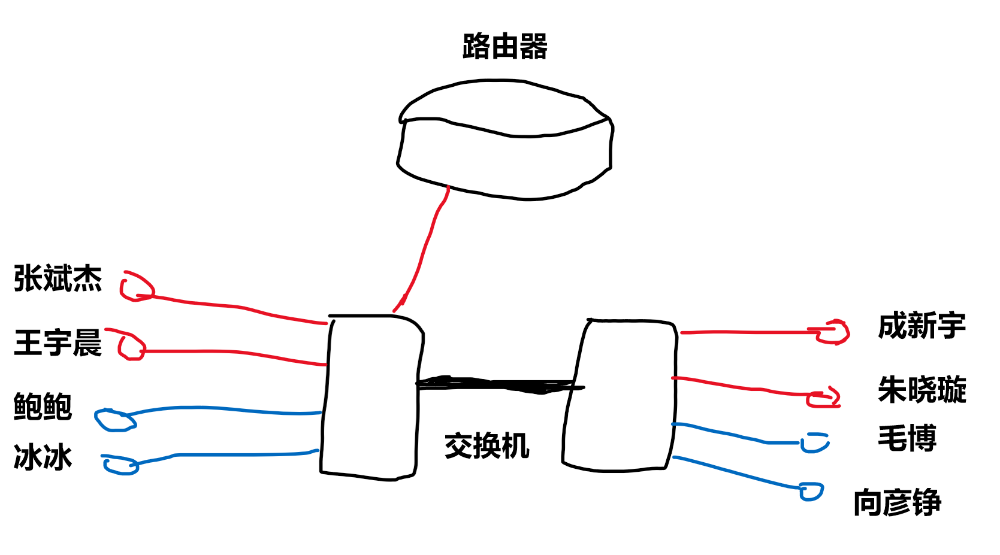

例如我们实验室里，大家通过两个交换机互相连接，且只有其中一个交换机连了一个路由器。

在现在我需要【和宇晨进行通信】，我知道他的 IP 地址，那么为了获取他的 MAC 地址，我发了一个广播消息，于是实验室里所有人都收到了这个消息，这不好。为了避免广播风暴，我们建立了两个 VLAN（暂时只考虑左边的交换机，右边当成不存在），发 ARP 消息的时候，只有宇晨能收到我的消息，鲍鲍和冰冰和我不在一个 VLAN，所以收不到。（通过在数据帧上加 VLAN ID 实现）。

如果我要【和鲍鲍通信】怎么办？用路由器啊。从我的角度来看，我和鲍鲍不在一个局域网中，通过路由器，我把数据帧经由交换机发给路由器，路由器再经由交换机发给鲍鲍。我并不知道我和鲍鲍连在一个交换机上。那怎么用路由器连接两个不同VLAN？

+ 每个VLAN都单独连接到路由器的一个端口，不过这太浪费路由器端口了。
+ 将路由器的一个接口划分为几个逻辑接口，每个子接口处理不同VLAN的帧，就可以节省大量的物理接口。交换机通过一个Trunk接口连接路由器，这种方式叫**单臂路由**。但是，如果使用路由器进行 VLAN 间路由的话，随着 VLAN 之间流量的不断增加，很可能导致路由器成为整个网络的瓶颈。所有有了三层交换机，就是“带有路由功能的（二层）交换机”，由于是内部连接，可以确保相当大的带宽。

我们和交换机的连接方式叫做 **访问链接（Access Link）**，指的是“只属于一个VLAN，且仅向该VLAN转发数据帧”的端口。那么问题来了，我要跨交换机和成新宇通信怎么办？两个交换机之间怎么连？

+ 用**汇聚链接（Trunk Link）**。汇聚链接指的是能够转发多个不同VLAN的通信的端口。即，一条通道上承载多个 VLAN 的消息，加上 VLAN ID 以示区分。这样就不需要不同 VLAN 专门各用一个端口互联了。
+ 也可以把两个交换机不同 VLAN 的端口分别连接。比如左边、右边交换机各出一个端口分在 VLAN1，然后把这两个端口连起来。有几个 VLAN 就连几条线。

## 家里上网是怎么实现的（数据链路层）

+ 模拟电话线：通过电话线使用PPP，连接到ISP调制解调器上，再连接到路由器

  PPP 的帧格式

  F 字段为帧的定界符、A 和 C 字段暂时没有意义、FCS 采用 CRC

  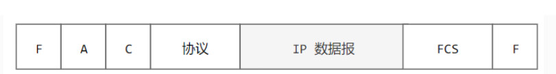

+ ADSL：模拟电话线的拓展，将电话音频信号和数据数字信号分离，互不干扰。

+ FTTH (Fiber To The Home) 使用 ONU 设备将光信号和电子信号转换，通过光缆连接到服务商处，服务商再转换后接入路由器。