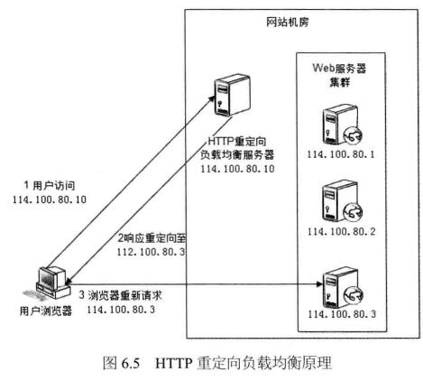
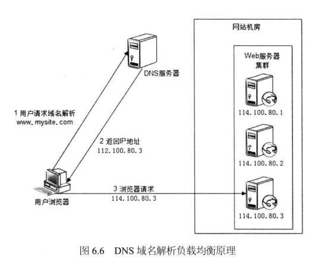
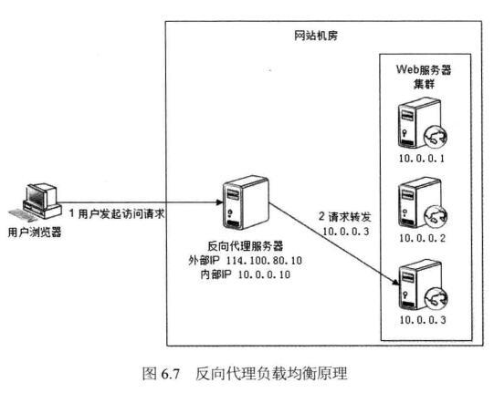
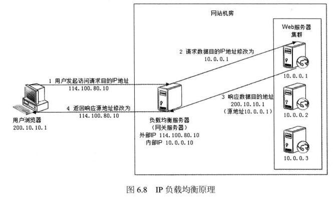
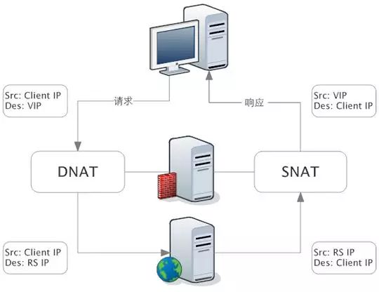
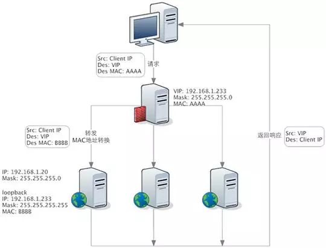

# 面试时答得不好的题

+ tcp的传输过程是可靠的，那为什么许多较大的下载最终还要校验文件完整性？
  + TCP靠什么验证？靠的 checksum。每个包都有 checksum。但是 TCP 的 checksum 其实很弱了。大概每 6 万个出错的包里，就有 1 个包 TCP 不会发现出错。可以用 MD5 再校验一下，进一步减小未被发现的概率。
  + 传输层协议只保证传输过程的校验。假如发送方进程在部分数据还没有发送的时候，进程崩溃了，或者断点续传的时候断点计算漏了。这时候数据还没有进入到传输层，也就更无法保证了。
  + 有可能被篡改！比如在 HTTP 时代，中间的某一跳的运营商出于利益驱使完全是有能力修改传输的数据的，当然现在 HTTPS 的广泛应用使得这种情况已经好多了。
  + **防止下载假冒（错误）的文件，比如钓鱼文件。**
  + tcp 接收方传输层的 ack 确认其实只是确认的接收方的内核正确地收到了，这时候用户进程有没有收到其实不一定。假如用户进程在读取内核中的数据时候发生了内存翻转等错误，或者是说接收到了写硬盘的时候出错了。这些错误都是所谓可靠的 tcp 所无法照顾到的场景。

## 杂项

### 心跳包相关

1. 为什么基于 TCP 的移动端 IM 仍然需要心跳保活？
   
   很多人认为，TCP协议自身先天就有KeepAlive机制，为何基于它的通讯链接，仍然需要在应用层实现额外的心跳保活？
   
   + 对于客户端而言，使用 TCP 长连接来实现业务的最大驱动力在于：在当前连接可用的情况下，每一次请求都只是简单的数据发送和接受，免去了 DNS 解析，连接建立等时间，大大加快了请求的速度，同时也有利于接受服务器的实时消息。但前提是连接可用。
     
     对于服务器而言，能够及时获悉连接可用性也非常重要：一方面服务器需要及时清理无效连接以减轻负载，**另一方面也是业务的需求，如游戏副本中服务器需要及时处理玩家掉线带来的问题**。（TCP 默认 keep alive 时间太长了吧）
   
   + TCP KeepAlive 是用于检测连接的死活，而心跳机制则附带一个额外的功能：检测通讯双方的存活状态。两者听起来似乎是一个意思，但实际上却大相径庭。
     
     某台服务器因为某些原因导致负载超高，CPU 100%，无法响应任何业务请求，但是使用 TCP 探针则仍旧能够确定连接状态，这就是典型的连接活着但业务提供方已死的状态，对客户端而言，这时的最好选择就是断线后重新连接其他服务器，而不是一直认为当前服务器是可用状态，一直向当前服务器发送些必然会失败的请求。
     
     因此，KeepAlive 并不适用于检测双方存活的场景，这种场景还得依赖于应用层的心跳。

2. master 向 slave 发心跳包 和 slave 向 master 发心跳包有什么区别？
   
   以下答案全是猜测，实在没找到正确答案。
   
   1. master 向 slave 发送心跳包，相对来说 master 的服务器压力会更大吧，可能还要额外成本维护 slave 的状态；slave 向 master 发送的话还可以借助一些第三方例如 zk 维护状态，分担 master 的压力。（你只要把它们记下来就好了？）
   
   2. slave 向 master 发送心跳包，是定时向服务端汇报自身状态，master 接收到 slave的心跳包做心跳检测和心跳续约；master 向 slave 发送心跳包一般是验证 slave 是否存活（或者说保持控制，如 Raft）

## TCP 相关

1. TCP 有两个长连接。一个保持了两小时，一个刚刚用过。那我要再用的时候，应该选哪个
   
   + 一方面，有人说可以用两小时那个，激活一下，避免它后面发探测报文浪费时间
   
   + 另一方面，有人说可以用较新的那个，它正常的概率相对来说比较高，避免在可能失效的连接上发送大量数据造成浪费

## 负载均衡

负载均衡技术，用来在多个计算机（计算机集群）、网络连接、CPU、磁盘驱动器或其他资源中分配负载，以达到最佳化资源使用、最大化吞吐率、最小化响应时间、同时避免过载的目的。

可以通过 HTTP 重定向、DNS、反向代理、NAT等方式实现。









负载均衡算法包括：轮询、随机、加权、hash（ip_hash：每个请求按访问 ip 的 hash 结果分配，这样每个访客固定访问一个后端服务器，可以解决 session 的问题） 等。介绍三个常见的负载均衡器：

> 一文详解 LVS、Nginx 及 HAProxy 工作原理（ 附大图 ） - 地球的外星人君的文章 - 知乎 https://zhuanlan.zhihu.com/p/71690089

1. LVS
   
   LVS 是 Linux Virtual Server 的简称，也就是 Linux 虚拟服务器。现在 LVS 已经是 Linux 标准内核的一部分。
   
   **LVS 是四层负载均衡**，建立在传输层之上，LVS 支持 **TCP/UDP 的负载均衡**。因为 LVS 是四层负载均衡，因此它相对于其它高层负载均衡的解决办法（比如 DNS 域名轮流解析、应用层负载的调度、客户端的调度等）它的效率是非常高的。
   
   LVS 的转发主要通过修改 IP 地址（NAT 模式，分为源地址修改 SNAT 和目标地址修改 DNAT）、修改目标 MAC（DR 模式）来实现。
   
   1. NAT 模式：网络地址转换
      
      网络数据报的进出都要经过 LVS 的处理。LVS 需要作为 RS（真实服务器）的网关。当包到达 LVS 时，LVS 做目标地址转换（DNAT），将目标 IP 改为 RS 的 IP。RS 接收到包以后，仿佛是客户端直接发给它的一样。RS 处理完，返回响应时，源 IP 是 RS IP，目标 IP 是客户端的 IP。这时 RS 的包通过网关（LVS）中转，LVS 会做源地址转换（SNAT），将包的源地址改为 VIP
      
      
   
   2. DR 模式：直接路由
      
      DR 模式下需要 LVS 和 RS 集群绑定同一个 VIP（**RS 通过将 VIP 绑定在 loopback 实现**）。**与 NAT 的不同点在于：请求由 LVS 接受，由真实提供服务的服务器（Real Server，RS）直接返回给用户，返回的时候不经过 LVS。**这样可以避免负载均衡服务器网卡带宽成为瓶颈。因此，DR 模式具有较好的性能，也是目前大型网站使用最广泛的一种负载均衡手段。
      
      一个请求过来时，LVS 只需要将网络帧的 MAC 地址修改为某一台 RS 的 MAC，该包就会被转发到相应的 RS 处理，注意此时的源 IP 和目标 IP 都没变。RS 收到 LVS 转发来的包时，链路层发现 MAC 是自己的，到上面的网络层，发现 IP 也是自己的（loopback），于是这个包被合法地接受，RS 感知不到前面有 LVS 的存在。而当 RS 返回响应时，直接向源 IP（即用户的 IP）返回即可，不再经过 LVS。
      
      

2. Nginx
   
   Nginx 是一个强大的 Web 服务器软件，用于处理高并发的 HTTP 请求和作为反向代理服务器做负载均衡。
   
   相对于传统基于进程或线程的模型（Apache就采用这种模型）在处理并发连接时会为每一个连接建立一个单独的进程或线程，且在网络或者输入/输出操作时阻塞，Nginx 大量使用多路复用和事件通知方式，避免过多的上下文切换。
   
   Nginx 负载均衡主要是对七层网络通信模型中的**第七层应用层上的 http、https 进行支持**。Nginx 是以反向代理的方式进行负载均衡的。反向代理（Reverse Proxy）方式是指以代理服务器来接受 Internet 上的连接请求，然后将请求转发给内部网络上的服务器，并将从服务器上得到的结果返回给 Internet 上请求连接的客户端，此时代理服务器对外就表现为一个服务器。
   
   Nginx 的 5 种负载均衡算法有：
   
   + **轮询（默认）**
     
     每个请求按时间顺序逐一分配到不同的后端服务器，如果后端服务器down掉，能自动剔除。
   
   + **weight**
     
     指定轮询几率，weight 和访问比率成正比，用于后端服务器性能不均的情况。
     
     ```nginx
     upstream bakend {  
       server 192.168.0.14 weight=10;  
       server 192.168.0.15 weight=10;  
     }
     ```
   
   + **ip_hash**
     
     每个请求按访问ip的hash结果分配，这样每个访客固定访问一个后端服务器，可以解决session的问题。
   
   + **fair（第三方）**
     
     按后端服务器的响应时间来分配请求，响应时间短的优先分配。
   
   + **url_hash（第三方）**
     
     按访问url的hash结果来分配请求，使每个url定向到同一个后端服务器，后端服务器为缓存时比较有效。
     
     例：在upstream中加入hash语句，server语句中不能写入weight等其他的参数，hash_method是使用的hash算法。
     
     ```text
     upstream backend {  
       server squid1:3128;  
       server squid2:3128;  
       hash $request_uri;  
       hash_method crc32;  
     }
     ```
     
     > 负载均衡算法里还有个 随机，nginx 没有它。

3. HAproxy（没空研究）
   
   + 支持两种代理模式：TCP（四层）和HTTP（七层），支持虚拟主机
   + 能够补充Nginx的一些缺点比如Session的保持，Cookie的引导等工作

## 127.0.0.1 localhost 0.0.0.0 有什么区别

### 0.0.0.0

IPV4中，0.0.0.0地址被用于表示一个无效的，未知的或者不可用的目标。

- 当一台主机还没有被分配一个IP地址的时候，用于表示主机本身。（DHCP分配IP地址的时候）
- **在服务器监听中，0.0.0.0 指的是本机上的所有 IPV4 地址和 10.1.2.1***，并且该主机上的一个服务监听的地址是 0.0.0.0,那么通过两个 ip 地址都能够访问该服务。
  
  > 看了一眼 Go 的 net.Liseten 的源码：
  > 
  > For TCP networks, if the host in the address parameter is empty or  a literal unspecified IP address, Listen listens on all available unicast and anycast IP addresses of the local system.
- 在路由中，0.0.0.0 表示的是默认路由，即当路由表中没有找到完全匹配的路由的时候所对应的路由。

### 127.0.0.1

127.0.0.1 属于 {127,} 集合中的一个，而所有网络号为 127 的地址都被称之为回环地址即回环地址包含127.0.0.1。

回环地址：所有发往该类地址的数据包都应该被 loop back。

大部分 Web 容器测试的时候绑定的本机地址。

**监听127.0.0.1， 则这个端口只能被本机访问**

### localhost

localhost是个域名，而不是一个ip地址。大多数电脑上都将 localhost 指向了 127.0.0.1 这个地址。

## 从网卡到应用层，一个数据包经历了什么？

> 从网卡到应用层nginx，一个数据包经历了什么？ - linux的文章 - 知乎 https://zhuanlan.zhihu.com/p/423241850

### 从网卡到内存

+ 数据包从外面的网络进入物理网卡。如果目的地址不是该网卡，且该网卡没有开启混杂模式，该包会被网卡丢弃。

+ 网卡将数据包通过 DMA 的方式写入到指定的内存地址，该地址由网卡驱动分配并初始化。
  
  > 老的网卡可能不支持DMA，不过新的网卡一般都支持。

+ 网卡通过硬件中断（IRQ）通知 CPU，告诉它有数据来了
  
  + CPU根据中断表，调用已经注册的中断函数，这个中断函数会调到驱动程序（NIC Driver）中相应的函数
  + 驱动先禁用网卡的中断，表示驱动程序已经知道内存中有数据了，告诉网卡下次再收到数据包直接写内存就可以了，不要再通知 CPU 了，这样可以提高效率，避免 CPU 不停的被中断。
  + 启动软中断。这步结束后，硬件中断处理函数就结束返回了。由于硬中断处理程序执行的过程中不能被中断，所以如果它执行时间过长，会导致CPU没法响应其它硬件的中断，于是内核引入软中断，这样可以将硬中断处理函数中耗时的部分移到软中断处理函数里面来慢慢处理。

### 内存-网络模块-协议栈

驱动程序将链路层数据校验解包等。上交给上层协议栈

### 网络层

+ 校验检查

+ 判断是要发给本机的吗？如果不是，进入转发流程

+ 如果是的话，解包 IP 层（可能涉及到 IP 切片的聚合），上交给上层（如 TCP UDP）

### 传输层

+ 校验检查
+ 查找该 package 的 **socket**。如果找不到，该 package 会被丢弃。接下来检查 socket 和 connection 的状态。
+ 如果 socket 和 connection 一切正常，调用 `tcp_prequeue` 使 package 从内核进入 user space，**放进 socket 的 receive queue**。然后 **socket 会被唤醒**，调用 system call，并最终调用 `tcp_recvmsg` 函数去从 socket recieve queue 中获取 segment。

### 应用层

+ 每当用户应用调用 `read` 或者 `recvfrom` 时，该调用会被映射为 `/net/socket.c` 中的 `sys_recv` 系统调用，并被转化为 `sys_recvfrom` 调用，然后调用 `sock_recgmsg` 函数。

+ **对 TCP 来说**，调用 `tcp_recvmsg`。该函数**从 socket buffer 中拷贝数据到 user buffer**。