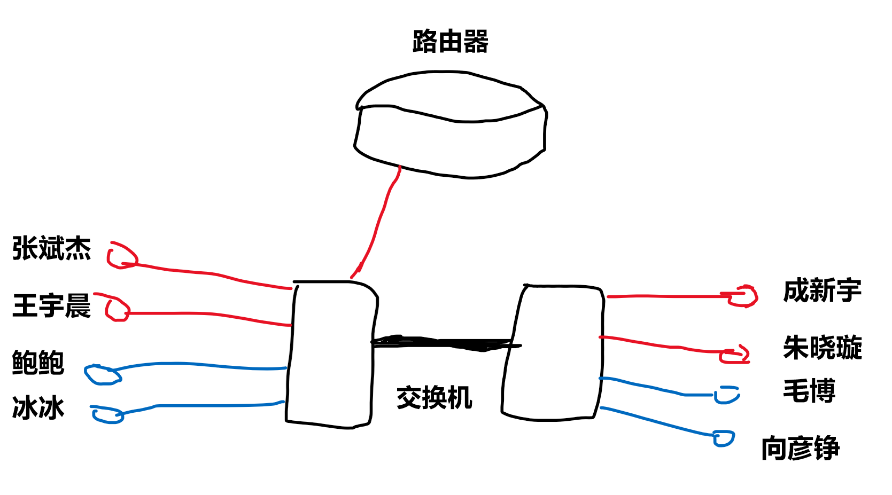
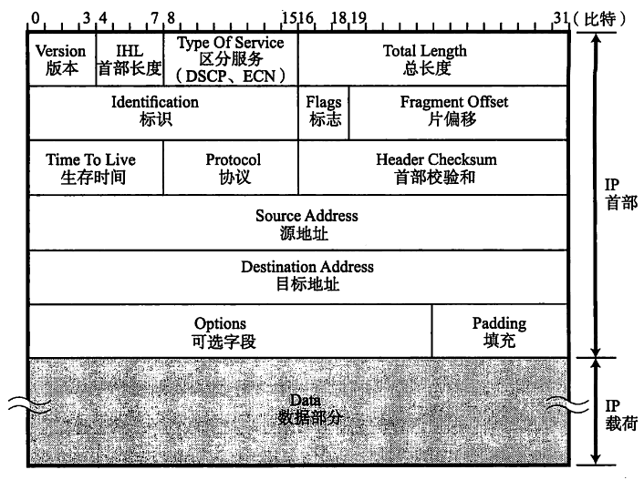
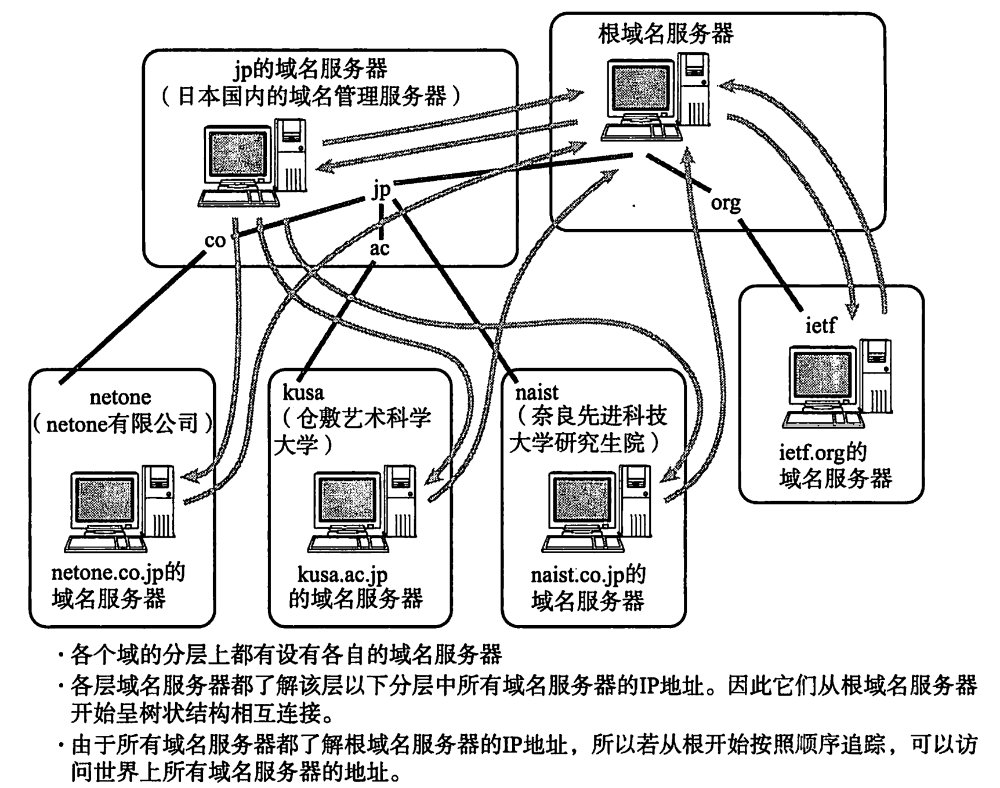
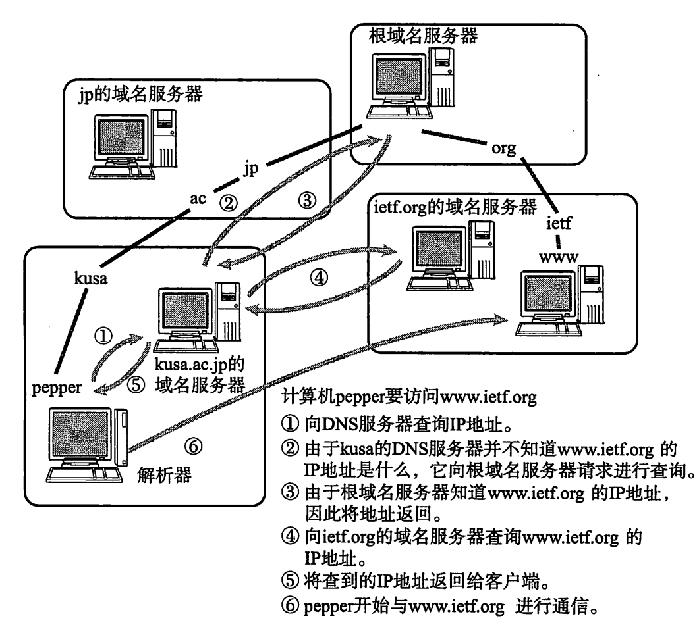
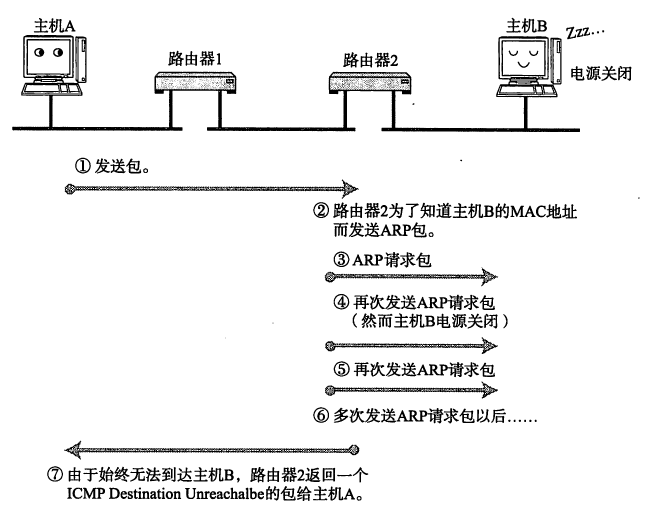
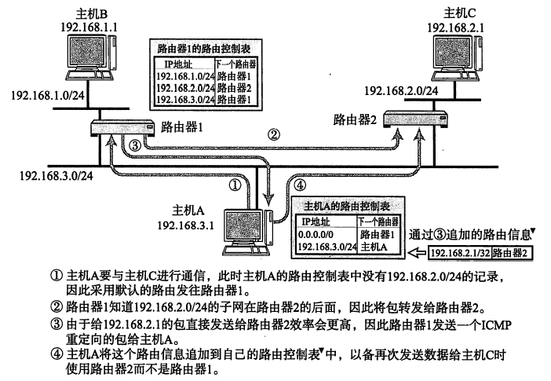
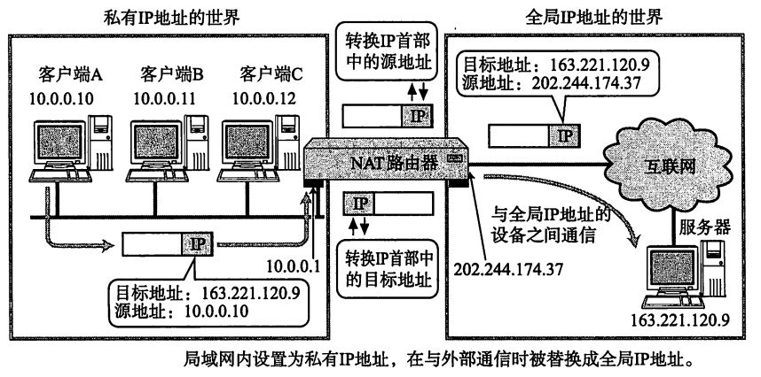
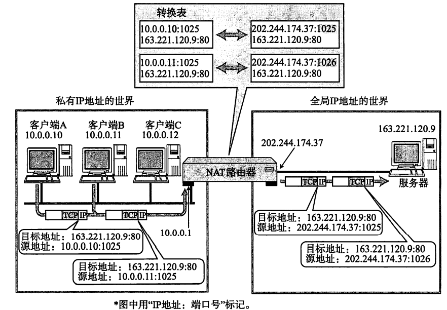
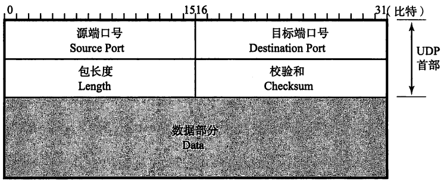
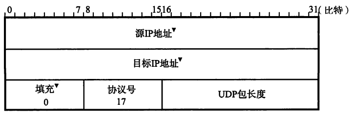

# TCP/IP

# 网络基础知识

# TCP/IP 概览

# 数据链路

## 数据链路层是干啥的

TCP/IP 中其实并未定义数据链路层和物理层，视为透明，不过还是在这里学一下（和网络中其他部分必然有重复啦）。

数据链路层的协议定义了通过**通信媒介**进行互联的设备之间的传输规范。通信媒介包括同轴电缆双绞线等，传输时也会经过交换机（2口的叫网桥）、中继器等设备。数据链路层中，以“帧”为单位传输数据块。

> 在不可靠的物理介质上提供可靠的传输，接收来自物理层的位流形式的数据，并封装成帧，传送到上一层；同样，也将来自上层的数据帧，拆装为位流形式的数据转发到物理层。这一层在物理层提供的比特流的基础上，通过差错控制、流量控制方法，使有差错的物理线路变为无差错的数据链路。提供物理地址寻址功能。交换机工作在这一层。

## 数据链路层相关技术

### MAC 地址

MAC 地址用于识别数据链路中互联的节点，一般被烧录到 ROM 中，任何一个网卡的 MAC 地址都是唯一的。（例外情况，虚拟设备的MAC可以自己设定，其实也可以改MAC地址，只要保证同MAC地址的设备不属于同一个数据链路即可）

| 第 1 位    | 第2位         | 第3~24位 | 第25~48位 |
| -------- | ----------- | ------ | ------- |
| 表示 单播/多播 | 表示全局地址/本地地址 | 厂商识别码  | 厂商内识别码  |

### 共享介质型网络

共享介质型网络指的是多个设备共享一个通信介质（比如多台电脑直接连在一根线上），基本是半双工的。为了防止冲突，需要进行介质访问控制，对应两种方式

+ 争用方式
  + CSMA  载波监听多路访问：确认没有其他设备发送数据，然后自己发送数据
  + CSMA-CD (with Collision Detection) ：除了CSMA的限定，还需要一边发送一边监测信道情况（电压），一旦冲突就放弃发送，随机延时一段时间再重新征用介质
+ 令牌传递方式：令牌按序传递，持有令牌才能发送数据

### 非共享介质网络

不同设备不共享介质，每个站点直连交换机，由交换机负责转发数据帧。这种连接在全双工模式下不会有冲突，不需要CSMA/CD的机制，可以高效通信。【Tip：双绞线内，发送和接收的线是分开的，所以可以全双工】

该方式还可以根据交换机的高级特性构建 VLAN 和进行流量控制。

### 根据MAC地址转发

> 设备介绍：交换机。交换机是有多个端口的网桥，根据数据链路层中每个帧的目标MAC地址，决定从哪个接口发送数据（需要参考转发表，其系通信过程中自动学习生成）。【Tip：交换机没有 MAC 地址，从来都不是数据帧的目的地址，只是负责转发。】转发方式分为存储转发（需要先完整接收整个帧，带校验）和直通转发（较快）。
> 
> 更多设备介绍：https://mp.weixin.qq.com/s/BJqp72EyEMahxi2XOfSrBQ

### 环路监测技术

环路监测技术。用网桥链接的设备，拓扑结构可能出现环路。最坏的情况下，数据帧会在环路中被持续转发。有两种解决办法：

+ 生成树方法：每隔一段时间交换信息，优先使用某些端口，另一些端口作为备份不使用。
+ 源路由法：用于解决令牌环网络的问题，源路由的用户可以指定他所发送的数据包沿途经过的部分或者全部路由。

### VLAN

> + 图文并茂VLAN详解，让你看一遍就理解VLAN - 51CTO网工运维之家的文章 - 知乎 https://zhuanlan.zhihu.com/p/385949949
> + 网络工程师（17）：用路由器让VLAN之间互通 - 微峰清雨的文章 - 知乎 https://zhuanlan.zhihu.com/p/137368250

VLAN 的目的是：将同一个局域网划分成不同的广播域，避免广播风暴。例如我们实验室里，大家通过两个交换机互相连接，且只有其中一个交换机连了一个路由器。

在现在我需要【和宇晨进行通信】，我知道他的 IP 地址，那么为了获取他的 MAC 地址，我发了一个广播消息，于是实验室里所有人都收到了这个消息，这不好。为了避免广播风暴，我们建立了两个 VLAN（暂时只考虑左边的交换机，右边当成不存在），发 ARP 消息的时候，只有宇晨能收到我的消息，鲍鲍和冰冰和我不在一个 VLAN，所以收不到。（通过在数据帧上加 VLAN ID 实现）。

如果我要【和鲍鲍通信】怎么办？用路由器啊。从我的角度来看，我和鲍鲍不在一个局域网中，通过路由器，我把数据帧经由交换机发给路由器，路由器再经由交换机发给鲍鲍。我并不知道我和鲍鲍连在一个交换机上。那怎么用路由器连接两个不同VLAN？一种方法是，每个VLAN都单独连接到路由器的一个端口，不过这太浪费路由器端口了。所以可以将路由器的一个接口划分为几个逻辑接口，每个子接口处理不同VLAN的帧，就可以节省大量的物理接口。交换机通过一个Trunk接口连接路由器，这种方式叫**单臂路由**。但是，如果使用路由器进行 VLAN 间路由的话，随着 VLAN 之间流量的不断增加，很可能导致路由器成为整个网络的瓶颈。所有有了三层交换机，就是“带有路由功能的（二层）交换机”，由于是内部连接，可以确保相当大的带宽。

我们和交换机的连接方式叫做 **访问链接（Access Link）**，指的是“只属于一个VLAN，且仅向该VLAN转发数据帧”的端口。那么问题来了，我要跨交换机和成新宇通信怎么办？两个交换机之间怎么连？用**汇聚链接（Trunk Link）**。汇聚链接指的是能够转发多个不同VLAN的通信的端口。即，一条通道上承载多个 VLAN 的消息，加上 VLAN ID 以示区分。这样就不需要不同 VLAN 专门各用一个端口互联了。

## 以太网

以太网是什么：以太网是一种为实现“局域网”而设计出来的技术标准，或者说，以太网是局域网（在数据链路层）的一种实现方式，它规定了包括物理层的连线、电子信号和介质访问层协议的内容。比如，数据帧是什么？如何使用MAC地址实现设备间的通信？如何获取MAC地址？

### 以太网连接形式

最初：多台终端使用同一根同轴电缆的共享介质型连接方式。现在：终端与交换机中间独立电缆连接。

### 以太网的分类

根据不同通信电缆（同轴电缆、双绞线、光纤等）和不同通信速度，衍生出不同类型。

值得注意的是，计算机内部的数据存储, 1K=2^10,而在数据传输中，是按照时钟频率来算的，1K=1000

### 以太网 帧 格式

#### Ethernet II 帧格式

| 6字节       | 6字节      | 2字节 | 46~1500字节      | 4字节 |
| --------- | -------- | --- | -------------- | --- |
| 目标 MAC 地址 | 源 MAC 地址 | 类型  | 数据（TCP/UDP报文等） | FCS |

+ 【以太网帧头】有 14 个字节，除了目标/源 MAC 地址，还有一个 2 字节的类型用来表示上层协议（ IPV4、IPV6、ARP、RARP等等）。

+ 【数据】46~1500字节的数据

+ 【帧尾】4字节的帧检验序列 FCS(Frame Check Sequence)，用于检查帧是否有损坏，若损坏则丢弃。FCS是用帧除以生成多项式的余数算出来的。

#### IEEE802.3 Ethernet 帧格式

| 6字节    | 6字节   | 2字节 |                                       |                                         | 46~1500字节        | 4字节 |
| ------ | ----- | --- | ------------------------------------- | --------------------------------------- | ---------------- | --- |
| 目标 MAC | 源 MAC | 长度  | 逻辑链路控制LLC （Logical Link Control） | SNAP （Sub-network Access Protocol） | 数据 （TCP报文等） | FCS |

## 数据链路层的细分

IEEE802 将数据链路层分为两个子层：

+ 逻辑链路控制（LLC）层–负责向其上层提供服务
  
  + 识别不同的网络层协议，然后对它们进行封装与处理（帧中LLC+SNAP部分）
    
    + > https://baike.baidu.com/item/SAP/3082834
  
  + 建立 / 释放逻辑连接，差错控制
  
  + 帧序号处理（帧同步）
  
  + 流量控制

+ 介质访问控制（MAC）层–屏蔽了不同物理链路种类的差异性。
  
  + 帧定界和识别
  + 目标站的寻址、源站寻址信息的传送
  + 信息的透明数据传输
  + 错误检查【通过校验码等方式】
  + 对物理传输介质的访问

LAN  对  LLC  子层透明， 只有下到  MAC  子层才可见到所连接的是采用什么标准的局域网（总线网、令牌总线网或令牌环网等）。

## 其他数据链路层协议

+ PPP (Point-to-Point Protocol)
  
  点对点传输协议，使用电话线，ADSL等线路实现接入。有些 ISP 在以太网上利用 PPPoE (PPP over Ethernet) 协议提供PPP功能，通信线路依靠以太网模拟。

+ 令牌环网

+ ATM

## 家里上网是怎么实现的（数据链路层）

+ 模拟电话线：通过电话线使用PPP，连接到ISP调制解调器上，再连接到路由器
+ ADSL：模拟电话线的拓展，将电话音频信号和数据数字信号分离，互不干扰。
+ FTTH (Fiber To The Home) 使用 ONU 设备将光信号和电子信号转换，通过光缆连接到服务商处，服务商再转换后接入路由器。

# IP 协议簇及其相关技术【网络层】

## IP 协议及其基础知识

IP 协议对应OSI 参考模型的第三层（网络层）。网络层的主要作用是实现**终端节点**之间的通信，即**点对点**通信。

数据链路层的主要作用是在互联同一种数据链路的节点之间进行通信，而网络层可以跨越不同的数据链路。也可以认为：数据链路层提供**直连设备**之间的通信功能（自己注：交换机并没有切割两个设备，或许两个设备可以看成是直连的），网络层的IP则负责在**没有直连**的两个网络之间进行通信传输。

### 路由控制

路由控制是能够控制分组数据发送到最终目标地址的功能。

+ Hop 的概念
  
  一跳(hop)是指利用数据链路层及以下层的功能**传输数据帧的一个区间**，对于以太网等数据链路中使用 MAC 地址传输数据帧的，一跳是指从源 MAC 地址到目标 MAC 地址之间传输数据帧的区间。
  
  IP路由（即多跳路由）中，节点转发数据包时，**只指定下一个路由器或主机**，而不是将到最终目标地址为止的所有通路全部指定出来，每个区间（每跳）在转发IP数据包时，会指定下一跳的操作。

+ 路由控制表
  
  为了将数据包发给目标主机，所有主机都维护着一张路由控制表，记录 IP 数据下一步该发送给哪个路由器，其包括 `目的网段及掩码、下一跳 IP、输出接口、cost 等内容`。
  
  + 路由控制表有两种生成形式：管理员手动设置（静态路由控制）、路由器与其他路由器交互信息时自动学习（动态路由控制）。
  + 在路由聚合的情况下，如果出现多跳网络地址的记录都符合情况，则使用**最长匹配原则**决定下一跳地址。
  + 默认路由：任意一个地址都能和它匹配 （表示为 0.0.0.0/0 或 default）
  + 主机路由：IP地址/32 被称为主机路由。他不是按照网段进行路由，而是完全基于这个主机设备的 IP 进行路由。例如在该网络中，我需要单独控制其中一台机器的路由选择结果。
  + 环回地址：127.0.0.1 localhost 同一台计算机上程序进行网络通信所使用的地址。
  + 路由控制表的聚合：类似 CIDR 构建超网的方式。例如，路由器发现 192.168.2.0/25, 192.168.2.1/25 的下一跳都是路由器 A，那么干脆记成 192.168.2.0/24 的下一跳是路由器 A，这样就**缩小了路由表**，减轻路由器负担，使查表变快。聚合完成后，还可以将聚合信息发送给临近路由器进行公告。

### 分包与组包

最大传输单位（MTU, Maximum Transmission Unit）每个链路有各自的最大传输单位

每个数据链路的最大传输单位不同，IP对它的上层隐藏了这一细节，抽象了数据链路层。IP进行分片处理，将较大的  IP 包分成多个较小的 IP 包。

由于每条链路的最大传输单元不同，路由器或主机会按照自己的需求对数据报进行分片，分片之后的数据报**只能由目标主机**进行重组。即：路由器虽然会做分片，但是不会重组。这样处理的原因：IP 是不可靠传输，分片可能会在中间丢失，而且即使在中间某处重新组装，再经过下一站时也可能再次被拆分，会给路由器带来多余的负担，降低网络传送效率。

为了尽量减小分片带来的路由器负担，会采用**路径MTU发现**技术。路径MTU指从发送端主机到接收端主机的所有链路中最小的 MTU，主机按此将数据报分片然后再发送出去，避免中途路由器进行分片处理。这个过程是：

+ 发送时 IP 首部中的分片标志位设置为不分片
+ 中途某路由器如果发现数据报过大且不分片就转发不了，就丢包，并通过 ICMP 通知下一次 MTU 大小
+ 反复上述过程，直到路径上再也没有路由器返回 ICMP 消息。
+ UDP 层转发过来的消息“UDP 首部 + UDP 数据”在 IP 层被分片。按分片大小发送。 （UDP 似乎不会感知到，只有一个 UDP 首部）

上述是 UDP 的例子，在 TCP 情况下，**TCP 会将数据分成不会再被 IP 层分片的大小**再传给 IP 层。（TCP 知道这个事，每个数据报都有一个 TCP 首部）

### IP 地址 及 相关知识

IPV4 由 32 位正整数表示，每 8 位为 1 组。其由两部分组成：“网络标识（网络地址）”  + “主机标识（主机地址）”。子网掩码用于标识前多少位为网络标识。

相互连接的每个数据链路段必须具有不同的“网络标识”，每个数据链路段内的主机必须有相同的网络地址。同一网段内的“主机标识”必须不同。当 IP 数据包转发时，利用目标 IP 的网络标识进行路由，即使看不到主机标识，只要看到网络标识就知道在哪个网段。

> 个人理解：家里的路由器其实是类似与单臂路由的路由器+交换机的组合

#### IP 地址分类

IP 地址分为 A B C D 四类。

+ A类地址前 8 位为网路标识，其中首位为 0，因此网段为 0.0.0.0~127.0.0.1
+ B类地址前 16 位为网络标识，且前 2 位必须为 10，因此网段位 128.0.0.1~191.255.0.0
+ C类地址前 32 位位网络标识，且前 3 位必须为 110，因此网段为 192.0.0.0~223.255.255.0
+ D类地址没有主机地址，全是网络标识，且前 4 位必须为 1110。它没有主机地址，所以通常用于多播【直说不了解即可】。

>  需要说明的是，主机地址全为 0 标识网络标识（网络号），或暂时不可获取 IP 地址；全为 1 表示广播地址。因此分配主机地址时应该去掉这两种情况。
> 
> 广播地址用来向一个网段发送数据包，其主机位全为 1。广播包分为本地广播（本网段内）和直接广播（发到其他网段，通常会被屏蔽）。

##### 子网划分：

A类B类地址挺浪费的，网络标识相同的主机必须属于同一个链路，那一个链路内放几万台机器是基本不可能的。所以这个地址很浪费啊。
所以有了子网划分：可以通过子网掩码进一步从 ABC类地址划分出更小的网络。即：将主机地址的前面拿出一些，作为子网地址。从有了子网开始，一个 IP 地址的识别，除了 IP 本身，还有一个子网掩码，用于标识内部网。

#### CIDR 和 VLSM

+ CIDR 无类型域间路（无分类编址）由 classless inter-domain routing 
+ VLSM 可变长子网掩码 variable length subnet mask。

CIDR`**完全放弃**了之前的分类IP地址表示法，它真正消除了传统的`A`类、`B`类、`C`类地址以及划分子网的概念，它使用如下的IP地址表示法：`IP地址 ::= {<网络前缀>， <主机号>} / 网络前缀所占位数`

CIDR 能够将多个连续的网络合并到一个大的网络内，**通过路由集中降低了路由器的负担**。例如 203.183.224.0/23 + 203.183.254.0/23 = 203.183.224.0/22。这种通过使用网络前缀减少路由表项的方式成为路由聚合，也称为**超网**。

#### 全局地址和私有地址

私网最初设计被计划为不连接互联网，所以每一个私网的 IP 都可以自行指定，不同私网出现相同的 IP 并没关系。不过万一因为改变配置联网了，那就出现问题了，所以为了防止误用和冲突，制定了私有IP。

+ A类：10.0.0.1~10.255.255.255 (10/8) 
+ B类：172.16.0.1~172.31.255.255 (172.16/12) 【B类有 16 个私网网段诶】
+ C类：192.168.0.0~192.168.255.255 (192.168/16)

不过后来，NAT (network address translation 网络地址转换)技术诞生之后，给路由器一个公网 IP，那么路由器内部的私网 IP 可以通过 NAT 进行互联网通信。这也恰好缓解了 IP 不足的问题。

### IPV4 首部

+ 版本：4位比特组成，IPV4的值就是4，IPV6的值是6，还有一些其他不常见的。
+ 首部长度：可选字段长度是可变的，所以 IP 首部的长度是可变的。对于没有可选字段的 IP 首部，其长度是 32bit * 5 = 20 字节
+ 区分服务（服务类型）：标识服务质量（优先度等），由于实现困难以及会带来不公平性，基本都不用
+ 总长度：16 bit，因此IP包的最大长度位 2^16 字节 (65535 Byte)
+ 标识：用于分片重组，相同数据报的不同分片的标识值相同
+ 标志：标识包被分片的相关信息：
  + 第 0 位 未使用，必须是 0     
  + 第 1 位，指示是否分片     0：可以分片；1：不能分片（可能由于过长被丢弃）
  + 第 2 位，包被分片的情况下，标识是否是最后一个包     0：最后一个分片的包；1：分片中段的包
+ 片偏移：由 13 位 bit 组成，标识该分片相对于原始数据的位置，第 1 个分片的偏移为 0 。每一个偏移的单位为 **8 字节**。
+ 生存时间：TTL。最初设想是秒为单位，现在则标识可以中转多少个路由器。每经过一个路由器，TTL 会减 1，直到变成 0 表示丢弃。
+ 协议：表示的是 IP 包传输层的**上层协议编号**，如 ICMP, TCP, UDP 等
+ 首部校验和：【只校验首部，不校验数据】每经过一个路由器都重新计算校验和。不校验数据可以减少工作量。
+ 源/目标 地址 均是 32 bit 的 IPV4 地址
+ 可选项：路径信息等，实验或诊断时才使用
+ 填充：由于可选项的存在，可能长度不是 32 bit 的整数倍，填充 0
+ 数据部分：上层协议的数据

### IPV6

暂且不管

## IP 协议的相关技术（IP 协议簇的其他东西，不局限于网络层）

### DNS

#### DNS 是什么

由于 IP 不便于记忆，因此引入了主机名。若采用集中管理，那么中心就要不断更新庞大的 hosts 文件，其他计算机需要定时下载。随着网络规模的不断扩大，这种方式可行性降低。因此需要有效的管理主机名到IP地址之间的映射。

DNS 系统是一个可以**有效管理主机名（域名）和 IP 地址之间对应关系**的系统。无论网络规模多么庞大，这种映射关系都能够**在一个较小的范围内**进行管理。

> 域名是为了识别主机名称和组织机构名称的一种**分层**的名称。例如 seu.edu.cn
> 
> 可以在每个主机名后面追加域名，这样的层次结构使得不同组织机构可以用相同的主机名而不发生冲突。例如东南大学计算机学院网站部署在主机 cse.seu.edu.cn 上，某某学校计算机学院网站部署在主机 cse.xxx.xxx.xxx 上。

#### 域名服务器

域名服务器是指管理域名的主机和相应的软件，他可以管理所在分层的域（ZONE）的相关信息。

根域名服务器注册了 cn jp 等域名服务器，如果想要新增一个与 cn 同层的域名或是修改 cn 同层的域名，则需要在根域名服务器中进行追加或更改。类似的，第 N 层服务器管理了所有 N+1 层（下层）域名服务器，但若要修改第 N 层（上层）的域名或是其域名服务器的IP，必须在 N-1 层更改。

所有的域名服务器都必须注册根域名服务器的 IP。通过根域名服务器可以找到所有域名服务器地址。

#### 解析器

进行 DNS 查询的主机和软件叫 DNS 解析器，如个人电脑。一个解析器至少注册一个以上的根域名服务器的 IP，如组织内部的域名服务器的 IP。

#### DNS 查询过程

DNS 协议是**基于 UDP** 的**应用层协议**（为了效率：一次 UDP 交换可以短到两个包：一个查询包、一个响应包。一次TCP交换则至少包含9个包：三次握手、一个查询包、一个响应包以及四次挥手）。

> 参考：DNS的工作原理及递归和迭代解析过程 - 百哥的文章 - 知乎 https://zhuanlan.zhihu.com/p/150417003

1. 本机查看本地的缓存，看看是否有 域名->IP 的记录缓存，如果有，直接用

2. 如果本地没有缓存，看看本地的 hosts 文件中有没有记录，如果有，直接用

3. 如果本地 hosts 文件也没有域名解析记录，则将域名解析请求发送给本机配置的 DNS 服务器
   
   1. 本机配置的 DNS 服务器会在自己的区域里面查找，找到即根据此记录进行解析，若有则返回，此解析具有权威性；若没有找到，就会在其缓存里面查找，此解析不具有权威性。
   
   2. 分两种情况：
      
      【迭代查询】
      
      1. 如果没找到，则会将此请求发送到根域名 dns 服务器，根域名服务器解析请求的根域部分，它把包含的**下一级的 dns 服务器的地址**返回到本机配置的 DNS 服务器
      2. 本机配置的 DNS 服务器根据返回的信息接着访问下一级的 dns 服务器
      3. 这样递归的方法一级一级接近查询的目标，最后在有目标域名的服务器上面得到相应的IP信息
      
      【递归查询（不好，靠近根的 DNS 服务器负担太大）】
      此 DNS 服务器就会把请求转发至上一级 DNS 服务器，由上一级服务器进行解析，上一级服务器如果不能解析，再递归，**逐个 DNS 服务器返回**。

4. 本机配置的 DNS 服务器将域名解析结果返回给本机

解析器和 DNS 服务器（域名服务器）会将最新了解到的信息保存在缓存里。

>  例：假设全局都没有 cse.seu.edu.cn 的服务器地址的缓存，则
> 
> 1. 本地 DNS 服务器向根域名服务器发送请求，得到负责 cn 域的服务器（有很多，随机选择其中一个用）。
> 2. 负责 cn 域的服务器返回负责 edu.cn 域的服务器
> 3. 以此类推，最终由东大的 DNS 服务器（负责 seu.edu.cn 域）返回 cse.seu.edu.cn 的主机地址。
> 
> 基本都能很快命中缓存。

本机配置的 **DNS 服务器**，一步步请求得到域名解析结果的过程，叫做**迭代解析**

**本机**和本机配置的 DNS 服务器之间，**一去一回**得到域名结果的过程，叫**做递归解析**。本机**并不知道**本机配置的 DNS 服务器为了得到解析结果而执行的迭代解析过程。

#### 会用到 TCP 吗

会。

DNS 域名解析的时候用的是 UDP。因为UDP快，传输内容少。

但是 DNS 的**区域传送**会用到 TCP。一个域有主 DNS 服务器和辅助 DNS 服务器。主 DNS 服务器从本机数据文件读取该区的 DNS 数据信息。辅助 DNS 服务器启动时，需要与主 DNS 服务器通信加载数据，这叫做区域传送(zone transfer)。区域传送使用 TCP 协议。因为 **TCP 协议可靠性好**，且 **TCP 协议传输的内容大**。~~UDP 最大只能传 512 bytes，同步数据可能超过该大小~~, UDP数据包不宜过大，在 IP 层面分片，丢失一片时，会导致丢弃整个 UDP 数据报。TCP 则是“流协议”，对大小没有什么特殊限制，可以借助 IP 分片传输很大的内容。关于数据包大小https://blog.csdn.net/qq_42031483/article/details/108941491。

#### DNS 保存的其他内容

主机名（域名）到 IP 的解析被称为 A 记录。除了 A 记录，DNS 还会负责 上下级域名服务器映射(NS)，主机名别名(CNAME)、邮件交换(MX)等等。

> CDN服务之所以要用CNAME，最主要的原因是要根据用户所在位置选择并返回最优节点 IP。如果不用CNAME，A记录只能实现域名解析到IP，因此就无法实现CDN的加速效果。
> 
> 什么是CNAME以及CDN？ - 漢堡再来一個的文章 - 知乎 https://zhuanlan.zhihu.com/p/400556541

### ARP

确定了 IP 地址便可以向其发送数据。但在底层的数据链路层， 进行通信时需要了解 IP 地址对应的 MAC 地址。

ARP 是一个解决地址问题的协议，以目标 IP 为线索，用来定位下一个应该接受数据分包的网络设备对应的 MAC 地址。（跨网段通信的时候，上层会自动将下一跳的 IP 地址指定为下一跳路由器的 IP 地址，因此这里 ARP 用来找路由器对应端口的 MAC 地址。）

+ 主机 A 为了获得主机 B （或路由器端口等）的 MAC 地址，广播发送一个 ARP 请求包。包中包含了需要检索的 IP 地址和发送端自身的 IP 及 MAC。
+ 链路上所有的设备都刻有接收到 ARP 请求包，检查是否和自身 IP 相匹配。若匹配，则将自己的 MAC 地址放入 ARP 响应包返回给主机 A。

#### 缓存

为了保证效率，IP 与 MAC 的映射通常会缓存一段时间：

1. 对一个地址发送 IP 数据包之后，可能会对同一地址多次发送，因此可以记录 ARP 的结果；
2. 在接收端缓存 MAC 地址也是一种提高效率的方法：接受 ARP 请求的主机可以缓存 ARP 请求中包含的发送端 IP 及 MAC，根据此发送相应包；接受 IP 数据包的主机往往会继续返回 IP 数据包给发送端主机（因此需要 MAC）。

#### RARP

RARP 服务器提供 MAC 到 IP 的映射转换。

> 在RARP的基础上，后面又有了 **Boot p协议**，直译过来便是**"启动协议"**，功能同 RARP，也是用于电脑接入网络时，用来获取IP地址的。Bootp协议能让电脑启动时，**不仅仅获取IP地址，而且能获取到网关地址**，从而让电脑实现跨网段通信。**服务器仍然需要提前手工绑定MAC和IP地址**
> 
> RARP是一种逝去的地址分配技术，是Bootp和DHCP的鼻祖，目前我们的电脑基本不会用到这个协议

#### 代理 ARP

通常 ARP 包会被路由器隔离，采用代理 ARP 的路由器可以将 ARP 请求转发给临近网段。

### ICMP

ICMP(Internet Control Message Protocol ) 是互联网控制消息协议，用于**IP 协议中发送控制消息**。即**ICMP，是IP层的附属协议，所以属于网络层协议**： ICMP 的两个主要功能：

+ 确认 IP 包是否能够成功到达目标地址
+ 网络诊断

主要的 ICMP 消息如下：

+ ICMP 目标不可达消息
  
  IP 路由器无法将 IP 数据包发送给目标地址时，会给发送端主机返回一个目标不可达的 ICMP 消息，并显示具体消息不可达的原因。如：网络不可达、主机不可达（目标主机没有连接到网络等原因）、端口不可达等等。
  
  

+ ICMP重定向消息
  
  路由器发现主机使用了次优路径，返回一个路由重定向消息给主机，包含了合适的路由信息。主要在路由器持有一个更好路由信息的情况下通知主机。（一般不用）
  
  

+ ICMP超时消息
  
  IP 包中有一个字段 TTL，没过 1 跳路由就减 1，减少到 0 时丢弃该 IP 包。此路，路由器发送一个 ICMP 超时消息给发送端。
  
  设置 IP 包生存周期是为了防止由于路由控制问题导致的循环状况；或是通过跳数限制消息到达范围。
  
  充分利用 ICMP 超时消息的一个应用 `traceroute`，通过从 1 开始发送 TTL，知道在何处超时，追踪路径，知道经过了几跳。

+ ICMP回送消息
  
  判断用于通信的主机或路由器之间的数据包是否成功到达。依靠一组 echo reply 进行会送消息的请求和应答。`ping`命令就是利用此消息实现的。

+ 其他
  
  ICMP源点抑制（解决网络拥塞、一般不用）；路由器探索消息（发现与自己相连的网络中的路由器），由路由器发送一个路由器公告消息回应、地址掩码消息，用于向目标主机或路由器了解子网掩码的情况

#### ICMPv6

IPv4中，ICMP仅作为一个辅助，没有其仍然可以通信。IPv6中则不行。

尤其在IPv6中，IP->MAC 的映射不由 ARP 完成，而**由ICMP的邻居探索消息**完成。邻居探索消息集成了 IPv4 的 ARP、ICMP 重定向等由邻居请求消息发出 IPv6 地址与 MAC 地址对应关系的查询请求（靠多播），由邻居宣告消息得响应发出自身的 MAC 地址。此外，IPv6 的路由地址自动设置，也需要通过 ICMPv6 向路由器查询信息（路由器请求消息和路由器宣告消息）

### DHCP

DHCP 让网络能够即插即用。工作机制：

+ 架设 DHCP 服务器，输入要分配的 IP 地址集、响应的子网掩码、路由控制信息、DNS 服务器等。

+ DHCP 基于 UDP。DHCP 是应用层协议。

+ 流程：
  
  + 客户端发送 DHCP 发现包，要求设置 IP 地址和子网掩码
  
  + DHCP 服务器发送 DHCP 提供包，返回所分配的设置（由于不知道  IP 情况，目的地址为广播地址 255.255.255.255，源地址为 0.0.0.0）
  
  + 客户端从（可能的）多个返回中，选择一个使用，并发送 DHCP 请求包，声明需要使用其设置
  
  + DHCP 服务器发送 DHCP 提供包，批准使用。
    
    网络设置结束后，方可进行 TCP/IP 通信。不需要 IP 地址时，可以发送 DHCP 解除包。

+ DHCP 中继代理
  
  大型网络中，会有很多网段（比如一个学校内），不宜为每个网段单独设置 DHCP 服务器，可通过 DHCP 中继代理，由一个 DHCP 服务器统一管理：客户端向 DHCP 中继代理发送 DHCP 请求包，DHCP 中继代理将这个包以单播形式发送给 DHCP 服务器，服务端收到后再通过代理返回应答。

### NAT(network address translator)

用于在本地网络中使用私有地址，在连接互联网时使用全局 IP 地址。除了转换 IP 地址之外，还出现了可以转换 TCP、UDP 端口号的 NAPT(network address port translation)技术。还有 IPv4 和 IPv6 转换的技术。

# TCP与UDP【传输层】

TCP/IP 协议簇中有两个代表性的传输层协议，TCP 和 UDP。

## 传输层的一些基础知识

1. 功能
   
   网络层只把分组发送到目的主机，但是真正通信的并不是主机而是主机中的进程。传输层提供了**进程间的逻辑通信**，传输层向高层用户屏蔽了下面网络层的核心细节，使应用程序看起来像是在两个传输层实体之间有一条端到端的逻辑通信信道。

2. 端口
   
   借助**端口号**识别码指出具体应用程序。端口也被称为 程序地址。
   
   **端口号由其使用的传输层协议决定**，不同的传输协议可以使用相同的端口号。IP 数据报到达后，会检查 IP 首部中的协议号，在交给传输层相应协议的模块。即使是同一个端口号，由于传输协议各自独立处理，因此相互之间不会受到影响。

3. 通信识别
   
   通常采用 5 个信息来识别一个通信：源IP、目标IP、协议号、源端口号、目标端口号。只要其中某一项不同，就被认为是其他通信。

## UDP

### 特点及用途

UDP(User Datagram Protocol) 用户数据报。UDP 不提供复杂的控制机制，提供面向无连接的通信服务。

UDP 接收到应用的发送请求后就会立刻在网络上发送，不能进行流量控制避免拥堵，不能处理丢包与重发，数据乱序到达也不能纠正。若想实现这些控制，需要使用 UDP 的程序去处理。

通常为用作：包总量较少（DNS等）、视频音频（即时通信）、限定于LAN的特定网络中、广播通信。

### UDP 头格式

+ 包长度保存了 UDP 首部长度和数据长度**之和**，单位为字节

+ 校验和的计算：
  
  > 参考：
  > 
  > + https://www.zhihu.com/question/53854306
  > + https://www.cnblogs.com/roccoshi/p/13033014.html
  
  在计算校验和时，会添加一个伪首部：
  
  
  
  先将 UDP 头中校验和字段设置为 0，然后以 16 bit 为一个单位进行 **1 的补码和**计算，并将**该补码的反码**写入校验和字段。接收到 UDP 数据报之后，从 IP 首部获得 IP 信息重新构造 UDP 伪首部，再进行校验和计算，如果全为 1，则认为收到的数据正确。
  
  > 为啥 UDP 校验和有一个伪首部呢？因为之前提到了，除了源、目标端口号，识别一个通信还需要源IP、目的IP、协议号。如果这些发生了差错，很有可能导致收包应用收不到包，不该收到的应用却收到了包。因此这五个基本要素都需要验证。此外，IPv6 中 IP 首部没有校验和，所以可以在 IP 不可靠时提高可靠程度。

# 路由协议

# 应用协议

# 网络安全
