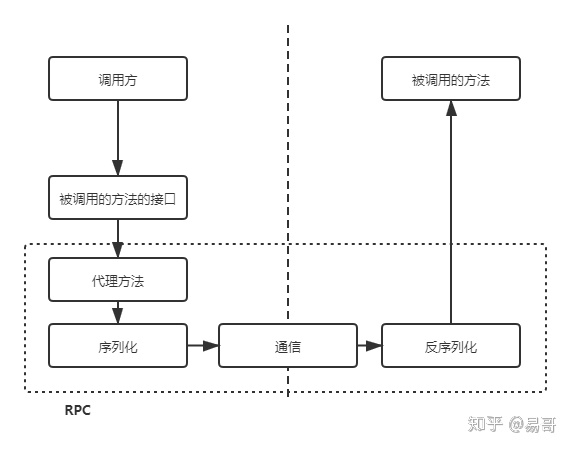
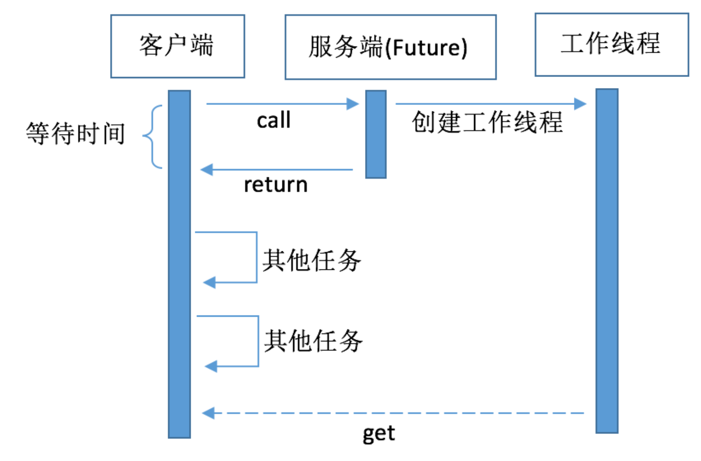

# RPC

> RPC 通常配合微服务，服务注册服务发现共同食用

## what is RPC

RPC 是指远程过程调用，也就是说两台服务器 A，B，一个应用部署在 A 服务器上，想要调用 B 服务器上应用提供的函数/方法，由于不在一个内存空间，不能直接调用，需要通过网络来表达调用的语义和传达调用的数据。

RPC是一个完整的远程调用方案，它包括了：**接口规范+序列化反序列化规范+通信协议**等。

+ 首先，调用方调用的是接口，必须得为接口构造一个假的实现。显然，要使用动态代理。这样，调用方的调用就被动态代理接收到了。
+ 动态代理接收到调用后，应该想办法调用远程的实际实现。包括下面几步：
  + 将调用方法的入参进行序列化
  + 识别具体要调用的远程方法的IP、端口，通过通信（例如 gRPC 使用 HTTP）将请求发送到远程的方法中
+ 远程的服务就接收到了调用方的请求。它应该：
  + 反序列化各个调用参数
  + 定位到实际要调用的方法，然后输入参数，执行方法
  + 按照调用的路径返回调用的结果

+ 由于不需要考虑通信时的可读性，完全可以不使用七层的 HTTP 作为通信方式，可以直接使用四层的 TCP/UDP。

### 和 HTTP 请求有啥区别

单纯的 HTTP 请求只是通信协议。

**HTTP+Restful规范+序列化与反序列化**这一套，可以看作是一个远程调用方案。和远程过程调用（强调调用的是一个方法） RPC 是一个比较平等的概念。

> what is Restful？
> 
> **资源** 在网络中以 **某种表现形式** 进行 **状态转移**。
> 
> 用 URL 定位资源，用某种表现形式表示资源（如 JSON, JPEG），用 HTTP 动词描述操作（状态变换）。

## 异步 RPC

在大多数情况下，RPC 本身处理请求的效率是在毫秒级的。RPC 请求的耗时大部分都是业务耗时，比如业务逻辑中有访问数据库执行慢 SQL 的操作，核心是在 I/O 瓶颈。所以说，在大多数情况下，影响到 RPC 调用的吞吐量的原因也就是业务逻辑处理慢了，CPU 大部分时间都在等待资源。所以， 要作为一个高性能的 RPC 框架必须要做到异步化，这样可以极大的提升整体吞吐量。

**调用端如何实现异步：**

以常用的方式就是 Future 方式，它是返回 Future 对象，通过 GET 方式获取结果；或者采用入参为 Callback 对象的回调方式，处理结果。 DUBBP 框架为例：

+ 用户端发送的每条消息都一个唯一的消息标识，调用端向服务端发送请求消息之前会先创建一个 Future，并会存储这个消息标识与这个 Future 的映射，动态代理所获得的返回值最终就是从这个 Future 中获取的
+ 当收到服务端响应的消息时，调用端会根据响应消息的唯一标识，通过之前存储的映射找到对应的 Future，将结果注入给那个 Future
+ 最后动态代理从 Future 中通过GET方法获得到正确的返回值。

> Future 模式
> 
> Future模式，只是发起了耗时操作，函数立马就返回了，并不会阻塞客户端线程。所以在工作线程执行耗时操作的时候客户端无需等待，可以继续做其他事情，等到需要的时候再向工作线程获取结果：
> 
> 

**服务端如何实现异步？**

RPC 服务端接收到请求的二进制消息之后会根据协议进行**拆包解包**，之后将完整的消息进行**解码并反序列化**，获得到入参参数之后再通过**反射执行业务逻辑**。这些操作并非都是由**一个线程负责执行**的。

二进制消息数据包拆解包的处理是放在处理网络 IO 的线程中，而解码与反序列化不涉及业务逻辑， 一般也是放在 IO 线程中处理。业务逻辑是应该交给专门的业务线程池处理，以防止由于业务逻辑处理得过慢而影响到网络 IO 的处理。

**上次被问到的：除了回调 API ，还有什么更好的方式吗（比如 RPC）**

如果每次都要传一个回调 URL，再重复发送 HTTP 请求，确实有点蠢。会两次建立 TCP 连接，回调 URL 的传输也是冗余的。

可以通过仅建立一条 TCP 连接的 RPC，在其上应用 Future 模式。

+ 一方面，网站后端可以直接异步返回给前端这次的 Operation ID
+ 另一方面，后端和 Master 之间的控制采用 RPC 的方式，而不是借助于 URL callback，也就不需要在他们之间传输 Operation ID。后端先进行一些其他处理操作，最后在通过 Future get 获取对 Master 的远程调用结果。
