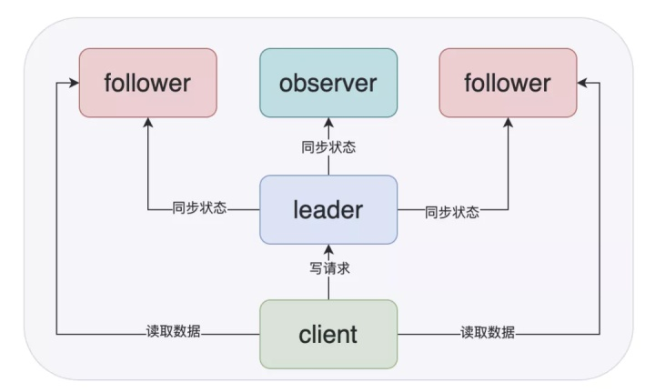
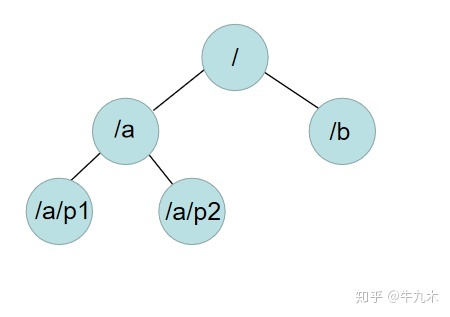
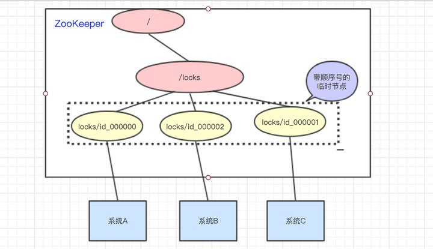
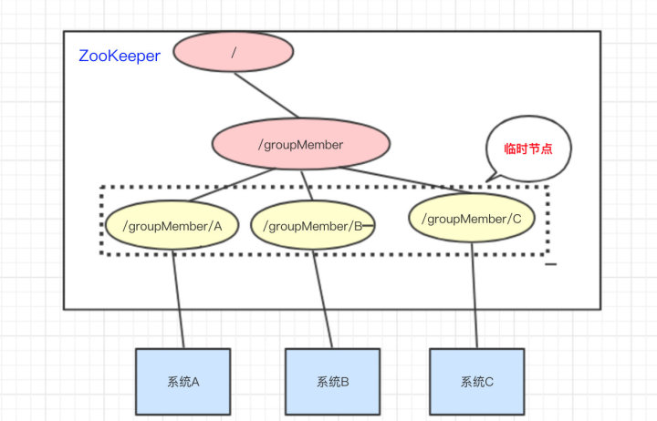

# Raft & Zookeeper

> 对 Raft 的一些直观理解 - 杨辰的文章 - 知乎 https://zhuanlan.zhihu.com/p/50448999

## raft

### raft 是什么

raft 是一个分布式一致性算法，他的作用是**保证 log 完全相同地复制到多台服务器上**。一致性是指多个计算机就某个值达成了一致。比如 a=2，所有计算机达成一致之后 a 就是等于 2 且**此决定一旦达成不可更改。**

这里面涉及到了很多健康检查、数据同步相关的算法逻辑。和单机相比，raft 其实是让多个服务器做几乎完全相同的工作。集群接收到一条日志，集群里所有的服务器都要将日志记录一次。相比单机，为了同步状态服务器之间还需要彼此发送网络消息。

raft 的工作只是记日志，日志的含义完全是由使用者来定义。像 etcd、consul 等服务，应用层才负责实现了 key/value 存储等功能。raft 的一条日志一般可以理解 etcd、consul 服务的一次请求，比如 `put foo bar`。两个需要知道的关键点：

1. raft 日志有生命周期，可以大致分为 propose、sync、apply 三个阶段，apply 阶段的日志才是 raft 算法认为真正生效的日志，这部分日志才是应用层需要处理的
2. 进入 apply 阶段的日志，可能是一次 **非法请求**。raft 系统只能保证日志被集群正确记录，但是无法保证日志是否合法，合法性问题应该由应用层来负责。

### 基础概念

#### node 分类

+ leader：集群中的管理者，正常情况下只有一个 leader，会周期性的向 follower 发出心跳维持统治。当发现自己不是 leader 的时候会转为 follower。
+ follower：响应 Leader 的日志同步请求，响应 Candidate 的投票请求。client 可以向 follower 发送事务请求，但是要把请求转发给 leader。在长时间得不到 leader 响应之后会转为 candidate。
+ candidate：集群的候选者，会发起投票试图当选 leader。

#### term

为了解决选举中的冲突问题以及各种数据冲突的问题，raft 将时间划分为 term，每个 term 是一个连续递增的数字，保存在每个服务器的内存中。每个 term 的最初是选举阶段，当 leader 诞生之后，这个 term 的剩余时间里整个 raft 集群堆外提供正常的服务，如果没有发生异常，这个 term 将一直持续下去；如果发生异常（比如 leader 挂掉），那么当前 term 将结束，服务器递增 term，然后进行新一轮的选举。

term 在raft 协议中实际是作为逻辑时钟角色存在的，它对 raft 服务器的影响是：**只有处在最新 term 的服务器和消息才是安全有效的。**

+ 服务器会在消息中交换自己的当前 term，**如果服务器发现自己的 term 比某个 term 更小，那么服务器会更新自己的 term**；如果服务器是 leader 或者 candidate, 那么还会立即转化为 follower。
+ 如果服务器接收到的消息的 term 小于自己的 term，那么会认为此消息无效。

#### 两个 RPC 调用

Raft 中服务器之间所有类型的通信通过两个 RPC 调用，**如果在指定时间内没有得到响应，服务器会不停的重试（对于实现很重要）**：

+ RequestVote RPC：在投票过程（candidate发起）
  
  PRC 请求和恢复的数据结构：
  
  

+ AppendEntries RPC：用来复制日志和进行 heartbeat 通信（leader 发起）

+ SnapShoot RPC：在传输节点快照(Snapshot)时使用

### 选举

集群开始时，所有服务器都是 follower，当服务器在指定的时间之内没有收到 **leader 或者 candidate 的有效消息**时会发起选举。这个指定的时间被称为 election timeout，是一个随机的值（比如200ms-500ms）。

> 1. 什么是有效消息？leader 的有效消息是指心跳消息，candidate 的有效消息是指投票消息。
> 2. 要求 `heartbeat time interval << min(election timeout)`，避免 follower 重新发起无谓的投票。

#### **投票过程**

candidate 角度

1. follower 递增自己的 term，将自己的状态变为 candidate，投票给自己。

2. 向集群其它机器发起投票请求（RequestVote请求）。

3. 当以下情况发生，结束自己的candidate状态。

4. 1. 超过集群一半服务器都同意，状态变为 leader，并且立即向所有服务器发送心跳消息，之后按照心跳间隔时间发送心跳消息。**任意一个 term 中的任意一个服务器只能投一次票**，所有的 candidate 在此 term 已经投给了自己，那么需要另外的 follower投票才能赢得选举。
   2. 发现了其它 leader 并且这个 leader 的 term 不小于自己的 term，状态转为 follower。否则丢弃消息。
   3. 没有服务器赢得选举，可能是由于：
      + 网络超时或者服务器原因没有 leader 被选举，这种情况比较简单，超时之后重试。
      + split votes，没有一个节点获得过半票数。raft 处理这种情况是采用 random election timeout，随机超时保证了 split votes发生的几率很小。

follower 角度：怎么投票

1. 同时满足下列两个条件则同意投票：
   + 如果发起投票请求的 node 包含的 **term 大于等于当前 node 的 term**。（不应该投票给 Term 落后的节点）
   + **candidate 的日志信息 idx 大于等于当前 node 的日志信息 idx**，那么会同意投票。（**选出的领导拥有系统中绝大部分节点承认的最新最长的日志记录**）
2. 一个 term 内只会给最先到来的一个合法的 candidate 投票。

#### 选举要保证的两个特性：安全性和活性

选举过程需要保证两个特性：**安全性(safety)**和**活性(liveness)**。

**安全性(safety)**：一个任期内只会有一个 Leader 被选举出来。需要保证：

- 每个节点在同一任期内只能投一次票。节点将投给第一个满足条件的投票请求，然后拒绝其它 Candidate 的请求。**这需要持久化存储投票信息** `votedFor`，以便宕机重启后恢复，否则重启后 `votedFor` 丢失会导致投给别的节点；
- 只有获得超过半数节点的选票才能成为 Leader：两个不同的 Candidate 无法在同一任期内都获得超过半数的票；

**活性(liveness)**：确保最终能选出一个 Leader。

问题是：假如选举同一时间开始，同一时间超时，同一时间再次选举，如此循环。解决办法很简单：

- 节点随机选择超时时间，通常在 [T, 2T] 之间（T = `electionTimeout`）
- 这样，节点不太可能再同时开始竞选，先竞选的节点有足够的时间来索要其他节点的选票
- T >> broadcast time(T 远大于广播时间)时效果更佳

### 日志同步

每个节点存储自己的日志副本，每条日志记录包含三部分：

- 命令：给复制状态机使用
- term：逻辑时钟
- 在logs中的序号：可以理解为数组中的位置。

**日志必须持久化存储。**一个节点必须先将记录安全写到磁盘，才能向系统中其他节点返回响应。

#### 正常运行流程

- 客户端向 Leader 发送命令，希望该命令被所有状态机执行；

- Leader 先将该命令追加到自己的日志中；

- Leader 并行地向其它节点发送 `AppendEntries RPC`，等待响应；

- 收到超过半数节点的响应，则认为新的日志记录是被提交的（并不存在一个数据位，显式的指出该日志是否提交，commit index 只是一个位置，标记了该位置之前的 log 是已经提交了）：
  
  - Leader 将命令传给自己的状态机，然后向客户端返回响应
  - 此外，一旦 Leader 知道一条记录被提交了，将在后续的 `AppendEntries RPC` 中**通知已经提交记录的 Followers**
  - Follower 将已提交的命令传给自己的状态机

- 如果 Follower 宕机/超时：Leader 将反复尝试发送 RPC；

>  性能优化在于：Leader 不必等待每个 Follower 做出响应，只需要超过半数的成功响应（确保日志记录已经存储在超过半数的节点上）——一个很慢的节点不会使系统变慢，因为 Leader 不必等他；

#### 日志一致性

**Raft 日志的 index 和 term 唯一标示一条日志记录。**Raft 有两个非常重要的属性：

1. 如果两个节点的日志在相同的索引位置上的任期号相同，则认为他们具有一样的命令；**且从头到这个索引位置之间的日志完全相同**；
2. **如果给定的记录已提交，那么所有前面的记录也已提交**。

为了保证这两个属性，需要通过 `AppendEntries RPC` 进行一致性检查：

- 每个 `AppendEntries RPC` 包含新日志记录**之前那条记录的**索引(`prevLogIndex`)和任期(`prevLogTerm`)；
- Follower 检查自己的 index 和 term 是否与 `prevLogIndex` 和 `prevLogTerm` 匹配，匹配则接收该记录；否则拒绝；

#### 日志不一致问题

leader 节点的崩溃可能会导致日志不一致。新的 leader 节点上的某个已提交日志，可能某个 follower 上没有。

leader 通过**强制 followers 复制它的日志**来处理日志的不一致，不一致的日志会被**强制覆盖**。follower首先找到**最近一致的一条日志条目**，然后**删除** follower上后续不匹配的日志，然后用leader的日志**覆盖**。

不过这里有一个问题，新被选举出来的节点，可能会通过强制覆盖，覆盖掉已经提交的日志。（leader 的 term 较新，碰巧 log idx 是一样的。例如下图中，在 c 图中，s2 s3 s5 的 log idx 都是 2，S5 很有可能被投票成 leader）在 d 中，s5 通过强制复制，丢失了（之前被视为 commit 的） term 2 中的数据。这就需要下面的安全性保证引入额外的机制来防止

> 在(a)中，S1当选为leader，同步任期编号为2的日志到S2中。
> 
> (b)中，S1由于故障崩溃离线，在任期编号为3中选举S5为新的leader。
> 
> (c)中，S5作为leader后立刻奔溃，还未发送任何同步日志请求。S1恢复并当选为leader，继续日志同步。此时**多数follower**已经同步了来自S1的日志，可以**提交**。
> 
> (d)中，S1再次奔溃离线，S5可以被选举为leader，因为其有**最新的日志**，符合上述安全特性。故其覆盖了其它follower的日志。

#### 安全性保证

**限制提交先前任期的日志条目 (committing entries from previous terms)。**

上述过程出现了日志的覆盖丢失。此时我们需要加一些限制保证Raft的安全性。究其原因，**(c)中的任期 4 将之前任期 2 的日志认为是已提交的**，这种情况应该被杜绝。

Raft认为，**之前任期的**日志条目**不应该根据多数 follower 同步原则提交**（包括反馈给客户端），而应该等到有一个**当前任期的日志条目提交时**，之前任期的日志条目再视为已提交。这样在图 (c) 中，就不会认为任期 2 的数据是已提交的，那图 (d) 中，覆盖了该数据就是合理的（覆盖的数据未被认为已提交）

反之，在图 (e) 中提交之后，若是 leader S1 挂了，由于 term 落后，s5 绝不会获得 s2 s3 的投票，也就不会成为 leader，没有机会去覆盖视为已提交的任期2和任期4的日志

### 集群配置变更（成员变更）

前置说明：Cold 和 Cnew 表示新/旧 Config，即新/旧群成员视图

1. 单步成员变更
   
   raft 集群成员变更算法基于 raft 基础协议，即其将配置的变更 Cnew  也作为一条日志，日志内容为更新后的集群成员列表。
   
   - 当 leader 收到集群成员变更请求时，其将变更后的成员列表 Cnew  作为日志内容持久化在本地；
   - 然后尝试通过 AppendEntries RPC 请求将日志复制到其他成员节点；
   - 当其他成员节点收到该日志，并将它存储到本地时，**对于该节点，其集群成员视图即已更新**；
   - 类似的，**当集群中多数节点存储了该日志时，该成员变更日志即被视为已 commit**。（根据选举协议，没有更新该日志的节点，即没有更新群成员视图的节点，不可能被选举为 leader）

2. 一次变更多个成员
   
   可以从数学上严格证明，只要每次只允许增加或删除一个成员，Cold 与 Cnew 不可能形成两个不相交的多数派。如果一次变更多个成员，则可能在某一时刻出现 Cold 和 Cnew 中同时存在两个不相交的多数派，进而可能选出两个 Leader，形成不同的决议，破坏安全性。
   
   
   
   > 如图是 3 个节点的集群扩展到 5 个节点的集群，直接扩展可能会造成 Server1 和 Server2 构成老成员配置的多数派，Server3、Server4 和 Server5 构成新成员配置的多数派，两者不相交从而可能导致决议冲突。
   
   为了解决这个问题，要么**直接串行一个一个变更**，要么使用 Raft 提出的**两阶段的成员变更方法 Joint Consensus**。
   
   Joint Consensus 成员变更让集群先从旧成员配置 Cold 切换到一个过渡成员配置，称为联合一致成员配置（Joint Consensus），联合一致成员配置是旧成员配置 Cold 和新成员配置 Cnew 的组合 Cold,new。联合一致成员配置 Cold,new 提交后，再切换到新成员配置 Cnew。
   
   + Leader 收到成员变更请求后，先向 Cold 和 Cnew 同步一条 Cold,new 日志，此后所有日志都需要 Cold 和 Cnew 两个多数派的确认。
   + Cold,new 日志在 Cold 和 Cnew 都达成多数派之后才能提交，此后 Leader 再向 Cold 和 Cnew 同步一条只包含 Cnew 的日志，此后日志只需要 Cnew 的多数派确认。
   + Cnew 日志只需要在 Cnew 达成多数派即可提交，此时成员变更完成，不在 Cnew 中的成员自动下线。

> 成员变更可能带来的问题，此处略去，参考如下：
> 
> raft 集群成员变更异常处理 - 一抹光辉油彩的文章 - 知乎 https://zhuanlan.zhihu.com/p/447307870

### 日志压缩

1. **全盘快照**。整个当前系统状态被写入稳定存储上的快照，然后该点之前的整个日志被丢弃。

2. **增量压缩**。选择一个积累了许多已删除和覆盖对象的数据区域，然后更紧凑地重写该区域中的活动对象，并释放该区域。**最后包含的索引是快照替换的日志中最后一个条目的索引(状态机应用的最后一个条目)，最后包含的任期是这个条目的任期。**
   
   

## Zookeeper

> ZooKeeper入门，看这篇就够了！ - java技术爱好者的文章 - 知乎 https://zhuanlan.zhihu.com/p/158986527

**ZooKeeper是一个分布式服务协调框架**，提供了分布式数据一致性的解决方案，基于 ZooKeeper 的**数据结构，Watcher，选举机制**等特点，可以**实现数据的发布/订阅，软负载均衡，命名服务，统一配置管理，分布式锁，集群管理**等等。

ZooKeeper能保证：

- 更新请求顺序进行。来自同一个client的更新请求按其发送顺序依次执行
- 数据更新原子性。一次数据更新要么成功，要么失败
- **全局唯一数据视图**。client无论连接到哪个server，数据视图都是一致的
- **实时性**。在一定时间范围内，client读到的数据是最新的

zookeeper 除了 leader, follower，还有 observer 节点。Follower 会参与节点的选举和**过半写成功**，Observer 则不会，他只是单纯的提供读取数据的功能。

> **Leader**:负责投投票的发起与决议，更新系统状态，写数据
> 
> **Follower**:用于接收客户端请求并用来返回结果，在选主过程中参与投票
> 
> **Observer**:可以接受客户端连接，将**写请求转发**节点，但是不参与投票过程，只**同步leader状态**，主要存在目的就是**为了提高读取效率**

通常这样设置的话，是为了避免太多的从节点参与过半写的过程，导致影响性能，这样Zookeeper只要使用一个几台机器的小集群就可以实现高性能了，如果要横向扩展的话，只需要增加Observer节点即可。

### 数据结构

ZooKeeper的数据结构和Unix文件系统很类似，总体上可以看做是一棵树，每一个节点称之为一个ZNode，每一个ZNode**默认能存储1M的数据**。每一个ZNode可**通过唯一的路径标识**。

Znode包含了**存储数据(data)**、**访问权限(acl)**、**子节点引用(child)**、**节点状态信息(stat)**

创建ZNode时，可以指定以下四种类型，包括：

**PERSISTENT，持久性ZNode**。创建后，即使客户端与服务端断开连接也不会删除，只有客户端主动删除才会消失。

**PERSISTENT_SEQUENTIAL，持久性顺序编号ZNode**。和持久性节点一样不会因为断开连接后而删除，并且ZNode的编号会自动增加。

**EPHEMERAL，临时性ZNode**。客户端与服务端断开连接，该ZNode会被删除。

**EPEMERAL_SEQUENTIAL，临时性顺序编号ZNode**。和临时性节点一样，断开连接会被删除，并且ZNode的编号会自动增加。

### 监听通知机制

Watcher是基于**观察者模式**实现的一种机制。如果我们需要实现当某个ZNode节点发生变化时收到通知，就可以使用Watcher监听器。监视点的类型有很多，如**监控ZNode数据变化、监控ZNode子节点变化、监控ZNode 创建或删除**。

**客户端通过设置监视点（watcher）向 ZooKeeper 注册需要接收通知的 znode，在 znode 发生变化时 ZooKeeper 就会向客户端发送消息**。

**这种通知机制是一次性的**。一旦watcher被触发，ZooKeeper就会从相应的存储中删除。如果需要不断监听ZNode的变化，可以在收到通知后再设置新的watcher注册到ZooKeeper。

### Session 会话 & 健康检查

会话是指 Zookeeper 客户端和服务端之间的通信，他们使用TCP长连接的方式保持通信

+ 会有心跳检测的机制
+ 同时他可以接受来自服务器的 Watch 事件通知。

### 用途

#### 分布式锁

创建临时顺序节点来实现分布式锁。

锁的目录是一个持久节点 locks。客户端需要加锁的时候，在该节点下创建临时顺序节点。

当客户端成功创建了节点之后，获取其同级的所有节点。此时客户端会根据**10位的自增序号**去判断，当前自己创建的节点是否是所有的节点中最小的那个，如果是**最小的**则自己获取到了**分布式锁**。

如果不是最小的，说明当前客户端**并没有抢到锁**。而且你知道当前最小的值（别人的抢到的锁）是 `id_0000000`。此时客户端会对节点`id_0000000`注册一个**监听器**，对于该节点的任意更新都将触发对应的操作。当其被删除之后，就会唤醒客户端B的线程，此时客户端1会再次进行判断自己是否是序号最小的一个节点，如果是则客户端**加锁成功**。

> 顺带一提，依赖Zookeeper可以生成全局唯一的节点ID（顺序节点），来对分布式系统中的资源进行管理

#### 发布订阅（理所当然的可以作为配置中心）

由于Zookeeper自带了**监听器（Watch）的功能，所以发布订阅**也顺理成章的成为了Zookeeper的应用之一。

#### 分布式协调

##### 软负载均衡

服务器端将启动的服务注册到，zk注册中心上，采用临时节点。客户端从zk节点上获取最新服务节点信息，本地使用负载均衡算法，分配服务器。

##### 服务节点动态上下线（有点像服务注册吧） & 动态选举 Master

以我们三个系统A、B、C为例，在ZooKeeper中创建**临时节点**。只要系统A挂了，那`/groupMember/A`这个节点就会删除，通过**监听**`groupMember`下的子节点，系统B和C就能够感知到系统A已经挂了。(新增也是同理)

如果想要实现动态选举Master的功能，Znode节点的类型是带**顺序号的临时节点**(`EPHEMERAL_SEQUENTIAL`)就好了。每次选举最小编号的作为Master，如果Master挂了，自然对应的Znode节点就会删除。然后让**新的最小编号作为Master**，这样就可以实现动态选举的功能了。
