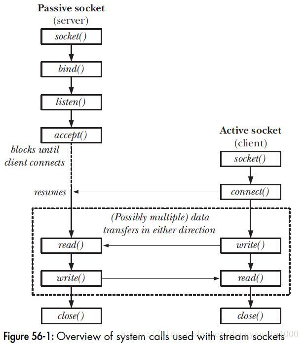
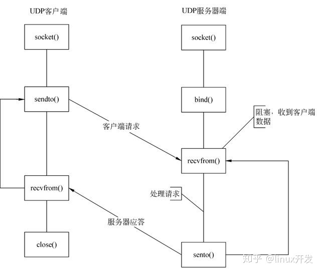
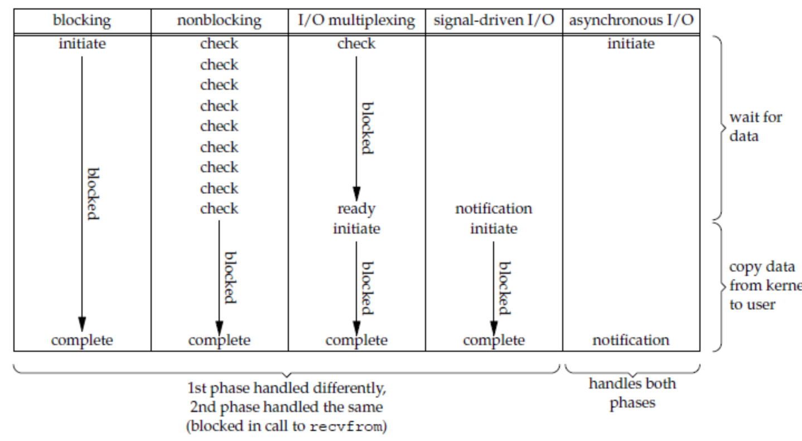

# Socket 编程和 IO 复用

## TCP 与 UDP 编程流程与接口

> socket编程 ----使用 TCP 协议的流程图 - 李点点的文章 - 知乎 https://zhuanlan.zhihu.com/p/466675391
>
> https://www.mkssoftware.com/docs/man3/recvfrom.3.asp

+ 基于 TCP 的：

  TCP 是传送字节流的服务，所以通常使用 read, **recv**, write, **send**。不过使用 sendto, recvfrom 也不是不可以（但是也不能通过 recvfrom 获取地址，因为 connect 的时候已经绑过了，在实现上，就没有给出）

  > listen() 函数：主要作用就是**告知内核**将套接字 (sockfd) 变成被动的连接监听套接字（被动等待客户端的连接），可以通过参数设置内核中连接队列的长度，**TCP 三次握手也不是由这个函数完成，listen() 的作用仅仅告诉内核一些信息。**listen()函数不会阻塞，当有一个客户端主动连接（connect），Linux **内核就自动完成 TCP 三次握手**，将建立好的链接自动存储到**队列**中，如此重复。
  >
  >
  > accept() 函数功能是，从处于 established 状态的连接队列头部取出一个已经完成的连接，如果这个队列没有已经完成的连接，accept() 函数就会阻塞，直到取出队列中已完成的用户连接为止。

  > https://blog.csdn.net/tennysonsky/article/details/45621341/
  >
  > https://stackoverflow.com/questions/26909982/using-write-read-on-udp-socket

  

+ 基于 UDP 的

  

## Unix 五大网络 IO 模型

一个输入操作通常包括两个阶段：

- 等待数据准备好：对于一个 Socket 上的输入操作，第一步通常涉及等待数据从网络中到达，当所等待数据到达时，它被复制到内核中的某个缓冲区。
- 从内核向进程复制数据：把数据从内核缓冲区复制到应用进程缓冲区。



### 阻塞式 IO

**应用进程被阻塞**，直到数据从内核缓冲区复制到应用进程缓冲区中才返回。在阻塞的过程中，**其它应用进程还可以执行**，因此阻塞**不意味着整个操作系统都被阻塞**。(因为其它应用进程还可以执行，阻塞的进程不消耗 CPU 时间，这种模型的 CPU 利用率会比较高。)

例如，阻塞式 socket 的数据接收函数

```c
ssize_t recvfrom(int sockfd, void *buf, size_t len, int flags, struct sockaddr *src_addr, socklen_t *addrlen);
```


### 非阻塞 IO

应用进程执行系统调用之后，内核返回一个错误码 EWOULDBLOCK error 。应用进程可以继续执行，

用户进程需要不断的主动询问 kernel 数据好了没有，这种方式称为轮询（polling）。

由于 CPU 要处理更多的系统调用，因此这种模型的 CPU 利用率比较低。


> socket() 函数创建的套接字默认是阻塞的，可通过设置参数 SOCK_NONBLOCK 使其变为非阻塞：
>
> https://man7.org/linux/man-pages/man2/socket.2.html
>
> ```text
> int s = socket(AF_INET, SOCK_STREAM | SOCK_NONBLOCK, IPPROTO_TCP);  
> ```

### IO 复用

> IO多路复用到底是不是异步的？ - 闪客sun的回答 - 知乎 https://www.zhihu.com/question/59975081/answer/1932776593

IO 复用方式下，单个 process (thread) 可以同时处理多个网络连接的 IO。使用 select，poll，epoll 等调用，不断的轮询相关的的所有 socket，当某个 socket 有数据到达了，就通知用户进程。

如果一个 Web 服务器没有 I/O 复用，那么每一个 Socket 连接都需要创建一个线程去处理。如果同时有几万个连接，那么就需要创建相同数量的线程。相比于多进程和多线程技术，I/O 多路复用技术的最大优势是系统开销小，系统不必创建进程/线程，也不必维护这些进程/线程。IO 复用的优势并不是单个连接能处理得更快，而是在于能处理更多的连接。

在IO multiplexing Model中，实际中，对于每一个socket，一般都设置成为 non-blocking，但是，整个用户的 process (thread) 其实是一直被阻塞的。只不过是被 select 阻塞，而不是被 socket IO 阻塞。


### 信号驱动方式

为 IO 准备好这样一个信号 SIGIO，注册一个处理函数。（比如通过  sigaction 系统调用）。注册后内核立即返回，应用进程可以继续执行，也就是说等待数据阶段应用进程是非阻塞的。

内核在数据到达时向应用进程发送 SIGIO 信号，应用进程收到之后在信号处理程序中再读数据，比如用 recvfrom。

相比于非阻塞式 I/O 的轮询方式，信号驱动 I/O 的 CPU 利用率更高。


> https://www.itzhai.com/articles/it-seems-not-so-perfect-signal-driven-io.html
>
> 信号驱动式 IO 对于 TCP 套接字产生的作用不大。因为该信号在 TCP 套接字中产生的过于频繁。进程对该信号一头雾水，没法确定套接字具体发生了什么事情。不过**可以对 TCP 监听套接字可以使用 SIGIO**，因为对于监听套接字，产生SIGIO信号的唯一条件是某个新连接完成了。这样就可以在SIGIO信号处理函数中获取新连接了。
>
> 在UDP套接字中，只有 数据报到达套接字 和 套接字上发生异步错误 会产生SIGIO信号，只需要相应处理即可

### 异步 IO

应用进程执行 aio_read 系统调用会立即返回，应用进程可以继续执行，不会被阻塞，内核会在**所有操作完成之后**向应用进程发送信号。

异步 I/O 与信号驱动 I/O 的区别在于，**异步 I/O 的信号是通知应用进程 I/O 完成**，而**信号驱动 I/O 的信号是通知应用进程可以开始 I/O**。

> https://man7.org/linux/man-pages/man3/aio_read.3.html
>
> https://man7.org/linux/man-pages/man7/aio.7.html

```c
int aio_read(struct aiocb *aiocbp);
struct aiocb {
    /* The order of these fields is implementation-dependent */

    int             aio_fildes;     /* File descriptor */
    off_t           aio_offset;     /* File offset */
    volatile void  *aio_buf;        /* Location of buffer */
    size_t          aio_nbytes;     /* Length of transfer */
    int             aio_reqprio;    /* Request priority */
    struct sigevent aio_sigevent;   /* Notification method */
    int             aio_lio_opcode; /* Operation to be performed;
                                                  lio_listio() only */

    /* Various implementation-internal fields not shown */
};
```

有一点像访问外存的 DMA 方式，把这件事委托出去，存好了再告诉我。

之前的信号驱动有点像访问外存的中断方式，准备好了告诉我，然后我读出来处理。


## IO 复用的几个接口

select/poll/epoll

> IO 多路复用是什么意思？ - 小林coding的回答 - 知乎 https://www.zhihu.com/question/32163005/answer/1802684879
>
> 下面所提到的 sockfd 是针对网络 IO 的，其实对于普通文件的文件描述符 file descriptor，也是一样的。
>
> 一些代码示例：彻底理解 IO多路复用 - caspar的文章 - 知乎 https://zhuanlan.zhihu.com/p/150972878

### select

select 实现多路复用的方式是，将已连接的 Socket 都放到一个**sockfd集合**，然后调用 select 函数将 sockfd 集合**拷贝**到内核里，让内核来检查是否有网络事件产生，检查的方式很粗暴，就是通过**遍历** sockfd 集合的方式，当检查到有事件产生后，将此 Socket 标记为可读或可写， 接着再把整个 sockfd 集合**拷贝**回用户态里，然后用户态还需要再通过**遍历**的方法找到可读或可写的 Socket，然后再对其处理。

所以，对于 select 这种方式，需要进行 **2 次「遍历」sockfd 集合**，一次是在内核态里，一个次是在用户态里 ，而且还会发生 **2 次「拷贝」sockfd集合**，先从用户空间传入内核空间，由内核修改后，再传出到用户空间中。select 使用固定长度的 BitsMap 表示 sockfd 集合，而且所支持的文件描述符的个数是有限制的，**在 Linux 系统中， 默认最大值为 `1024`**。

```c
int select(int n, fd_set *readfds, fd_set *writefds, fd_set *exceptfds, struct timeval *timeout);
```

### poll

相比于 select，poll 不再用 BitsMap 来存储所关注的 sockfd，取而代之用动态数组，**以链表形式来组织，突破了 select 的 sockfd 个数限制**。

但是 poll 和 select 并没有太大的本质区别，**都是使用「线性结构」存储进程关注的 Socket 集合，因此都需要遍历文件描述符集合来找到可读或可写的 Socket，时间复杂度为 O(n)，而且也需要在用户态与内核态之间拷贝 sockfd 集合**，这种方式随着并发数上来，性能的损耗会呈指数级增长。

```c
int poll(struct pollfd *fds, unsigned int nfds, int timeout);
struct pollfd {
    int   fd;         /* file descriptor */
    short events;     /* requested events */
    short revents;    /* returned events */
};

// The structure for two events
struct pollfd fds[2];

// Monitor sock1 for input
fds[0].fd = sock1;
fds[0].events = POLLIN;

// Monitor sock2 for output
fds[1].fd = sock2;
fds[1].events = POLLOUT;

// Wait 10 seconds
int ret = poll( &fds, 2, 10000 );
// Check if poll actually succeed
if ( ret == -1 )
    // report error and abort
else if ( ret == 0 )
    // timeout; no event detected
else
{
    // If we detect the event, zero it out so we can reuse the structure
    if ( fds[0].revents & POLLIN )
        fds[0].revents = 0;
        // input event on sock1

    if ( fds[1].revents & POLLOUT )
        fds[1].revents = 0;
        // output event on sock2
}
```

### epoll

> 注:epoll 没有共享内存 https://www.zhihu.com/question/39792257

epoll 通过两个方面，很好解决了 select/poll 的问题。

+ epoll 在**内核里**使用**红黑树来跟踪进程所有待检测的 sockfd**，把需要监控的 socket 通过 `epoll_ctl()` 函数加入内核中的红黑树里。红黑树是个高效的数据结构，增删查一般时间复杂度是 `O(logn)`，通过对这棵黑红树进行操作，这样就不需要像 select/poll 每次操作时都传入整个 socket 集合，只需要传入一个待检测的 socket，减少了内核和用户空间大量的数据拷贝和内存分配。
+ epoll 使用事件驱动的机制，内核里**维护了一个链表来记录就绪事件**，当某个 socket 有事件发生时，内核会将其加入到这个就绪事件列表中。内核不再通过轮询的方式找到就绪的文件描述符，而是通过异步 IO 事件唤醒。
+ 当用户调用 `epoll_wait()` 函数时，只会从就绪列表中取出有事件发生的 sockfd，不需要像 select/poll 那样轮询扫描整个 socket 集合，大大提高了检测的效率。


epoll 的两种工作模式

+ 边缘触发（edge-triggered，ET）：当被监控的 Socket 描述符上有可读事件发生时，只会触发一次事件。一旦调用了 epoll_wait ，该 socket 就不在就绪事件列表里了。即使进程没有调用 read 函数从内核读取数据，也依然不会再次触发事件，除非有新的数据到达，因此我们程序要保证一次性将内核缓冲区的数据读取完；
+ 水平触发（level-triggered，LT）：当被监控的 Socket 上有可读事件发生时，用户程序总是可以从 epoll_wait 中获取到这个 socket，直到内核缓冲区数据被 read 函数读完才结束，目的是告诉我们有数据需要读取。

```c
int epoll_create(int size);
int epoll_ctl(int epfd, int op, int fd, struct epoll_event *event)；
int epoll_wait(int epfd, struct epoll_event * events, int maxevents, int timeout);

// Create the epoll descriptor. Only one is needed per app, and is used to monitor all sockets.
// The function argument is ignored (it was not before, but now it is), so put your favorite number here
int pollingfd = epoll_create( 0xCAFE );

if ( pollingfd < 0 )
 // report error

// Initialize the epoll structure in case more members are added in future
struct epoll_event ev = { 0 };

// Associate the connection class instance with the event. You can associate anything
// you want, epoll does not use this information. We store a connection class pointer, pConnection1
ev.data.ptr = pConnection1;

// Monitor for input, and do not automatically rearm the descriptor after the event
ev.events = EPOLLIN | EPOLLONESHOT;
// Add the descriptor into the monitoring list. We can do it even if another thread is
// waiting in epoll_wait - the descriptor will be properly added
if ( epoll_ctl( epollfd, EPOLL_CTL_ADD, pConnection1->getSocket(), &ev ) != 0 )
    // report error

// Wait for up to 20 events (assuming we have added maybe 200 sockets before that it may happen)
struct epoll_event pevents[ 20 ];

// Wait for 10 seconds, and retrieve less than 20 epoll_event and store them into epoll_event array
int ready = epoll_wait( pollingfd, pevents, 20, 10000 );
// Check if epoll actually succeed
if ( ret == -1 )
    // report error and abort
else if ( ret == 0 )
    // timeout; no event detected
else
{
    // Check if any events detected
    for ( int i = 0; i < ready; i++ )
    {
        if ( pevents[i].events & EPOLLIN )
        {
            // Get back our connection pointer
            Connection * c = (Connection*) pevents[i].data.ptr;
            c->handleReadEvent();
         }
    }
}
```

### 他们的应用场景

很容易产生一种错觉认为只要用 epoll 就可以了，select 和 poll 都已经过时了，其实它们都有各自的使用场景。

#### 1. select 应用场景

select 的 timeout 参数精度为微秒，而 poll 和 epoll 为毫秒，**因此 select 更加适用于实时性要求比较高的场景**，比如核反应堆的控制。

select **可移植性更好**，几乎被所有主流平台所支持。

#### 2. poll 应用场景

poll **没有最大描述符数量的限制**，如果平台支持并且对实时性要求不高，应该使用 poll 而不是 select。

#### 3. epoll 应用场景

只需要运行在 Linux 平台上，**有大量的描述符需要同时轮询，并且这些连接最好是长连接**。

如果需要同时监控小于 1000 个描述符，就没有必要使用 epoll，因为这个应用场景下并不能体现 epoll 的优势。

如果需要监控的描述符状态变化多，而且都是非常短暂的，也没有必要使用 epoll。因为 epoll 中的所有描述符都存储在内核中，造成每次需要对描述符的状态改变都需要通过 epoll_ctl() 进行系统调用，频繁系统调用降低效率。并且 epoll 的描述符存储在内核，不容易调试。

## 网路编程模型（不仅考虑了 IO）

### 阻塞IO+多线程

client连接服务器，服务器有一个线程阻塞的调用 accept，accept 接收到连接后，创建一个线程来读写读写，并且处理业务逻辑


### 单 reactor + 单线程

典型的模型应用代表: redis。

服务器只有一个线程，一个epoll，epoll 接收到连接事件后就调用 accept，接收到客户端的fd后，将 fd 加入到 epoll，监听客户端的读写以及断开连接事件，读取到客户端的消息后，对消息进行解码，然后业务逻辑处理，处理完后编码需要回复的数据包，然后发送消息，交互完成后客户端断开连接，监听到断开连接的消息后调用close.

有可能业务逻辑过重，IO 不是瓶颈，反而是业务逻辑成了瓶颈。


### 单reacotor +消息队列+多线程模型

跟 reactor + 单线程 的区别就是在业务逻辑处理的地方加了消息队列，接收到的消息放入接收消息队列，然后业务线程从该队列取消息进行业务处理**（业务线程数量最好是跟cpu核心数，业务线程中基本没有了IO操作）**，业务线程处理完后，将需要回复的消息放入发送队列中，当有可发送事件触发时，epoll 从发送队列取消息发送。

相比 单 reactor + 单线程，**解决了业务逻辑重的问题**。


### 多 Reactor 

在单 Reactor中，其要同时响应所有的事件，如果 IO 连接，读写都很多，可能会出现处理不过来的情况。（毕竟涉及到状态维护之类的？）

> 像 TCP 这样的需要经过 3 次握手才能建立连接，这个建立连接的过程也是要耗时间和资源的，单独分一个 Reactor 来处理，可以提高性能。

因此可以采用一个 main reactor + **n 个 sub reactor** 。

main reactor 一直在监听连接事件，如果有连接建立，main reactor 通过 accept 方法获取已连接的 SocketChannel，然后按照一定的算法选取一个 sub reactor，并把 SocketChannel 交给选定的 sub reactor 处理。

> 为了防止单个 sub-reactor 线程出错，还是考虑选用多进程的多 reactor。nginx 就是多进程 reactor 

