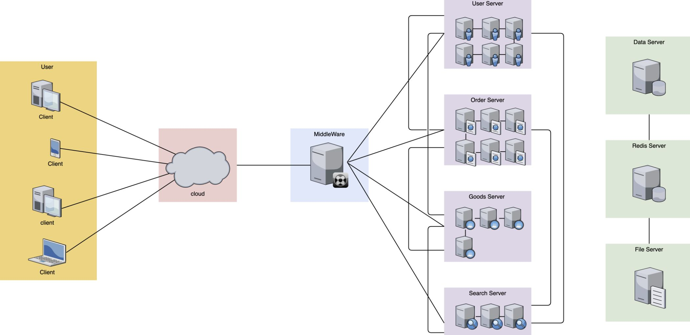
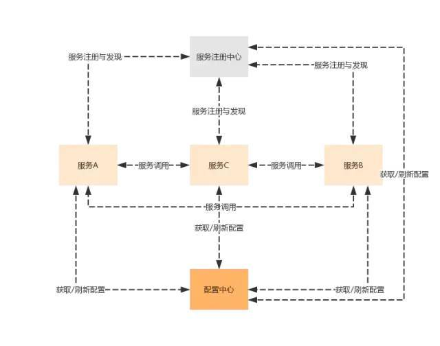
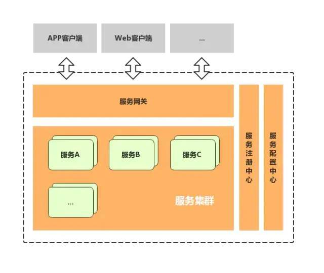
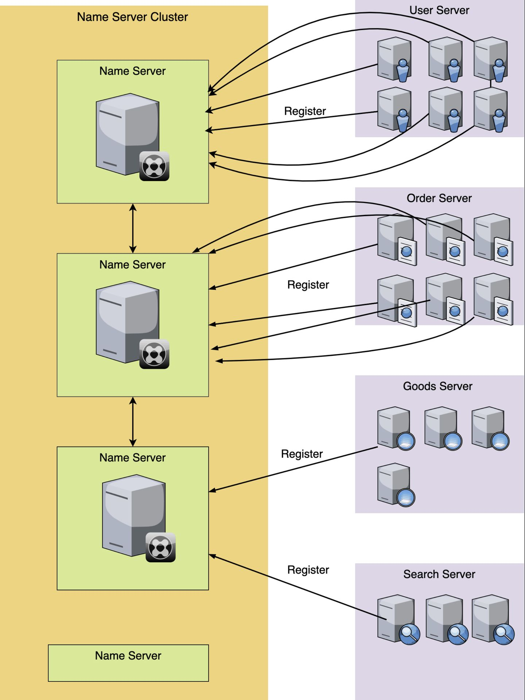
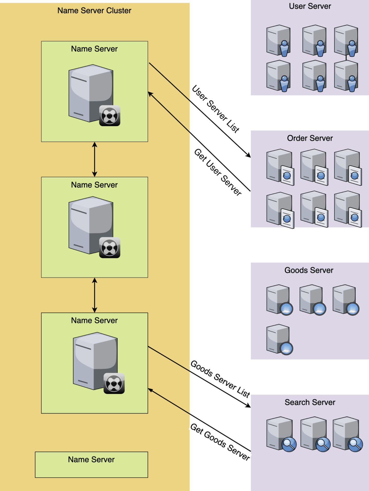

# 微服务
> 深入了解服务注册与发现 - 腾讯技术工程的文章 - 知乎 https://zhuanlan.zhihu.com/p/161277955

在微服务时代，我们所有的服务都被劲量拆分成最小的粒度，原先所有的服务都在混在 1 个 server 里，现在就被按照功能或者对象拆分成 N 个服务模块，这样做的好处是深度解耦，1 个模块只负责自己的事情就好，能够实现快速的迭代更新。

坏处就是服务的管理和控制变得异常的复杂和繁琐，人工维护难度变大。还有排查问题和性能变差（服务调用时的网络开销）。



微服务典型架构

应用微服务化之后，首先遇到的第一个问题就是服务发现问题，一个微服务如何发现其他微服务呢？最简单的方式就是每个微服务里面配置其他微服务的地址，但是当微服务数量众多的时候，这样做明显不现实。所以需要使用到微服务架构中的一个最重要的组件：**服务注册中心**，所有服务都注册到服务注册中心，同时也可以从服务注册中心获取当前可用的服务清单

解决服务发现问题后，接着需要解决微服务分布式部署带来的第二个问题：服务配置管理的问题。当服务数量超过一定程度之后，如果需要在每个服务里面分别维护每一个服务的配置文件，运维人员估计要哭了。那么，就需要用到微服务架构里面第二个重要的组件：**配置中心**



以上应用内部的服务治理，当客户端或外部应用调用服务的时候怎么处理呢？服务A可能有多个节点，服务A、服务B和服务C的服务地址都不同，服务授权验证在哪里做？这时，就需要使用到服务网关提供统一的服务入口，最终形成典型微服务架构



## 服务注册与发现

**服务注册**

每一个服务对应的机器或者实例在启动运行的时候，都去向名字服务集群注册自己，比如图中，`User服务`有 6 个 docker 实例，那么每个 docker 实例，启动后，都去把自己的信息注册到名字服务模块上去，同理`Order服务`也是一样。

```go
//给User服务申请1个独有的专属名字
UserNameServer = NameServer->apply('User');

//User服务下的6台docker实例启动后，都去注册自己
UserServer1 = {ip: 192.178.1.1, port: 3445}
UserNameServer->register(UserServer1);

......

UserServer6 = {ip: 192.178.1.6, port: 3445}
UserNameServer->register(UserServer6);
```



**服务发现**

`Order`服务想要获取`User`服务相关的信息，首先向注册集群中心发送请求获取，然后就能收到`User`服务相关的信息。

```go
//服务发现，获取User服务的列表
list = NameServer->getAllServer('User'); 

//list的内容
[
    {
        "ip": "192.178.1.1",
        "port": 3445
    },
    {
        "ip": "192.178.1.2",
        "port": 3445
    },
    ......
    {
        "ip": "192.178.1.6",
        "port": 3445
    }
]
```

通过服务发现，就获得了`User`模块的所有的 ip 列表，然后，我们再用一定的负载均衡算法，或者干脆随机取 1 个 ip，进行调用。当然，也有些注册服务软件也提供了 DNS 解析功能或者负载均衡功能，它会直接返回给你一个可用的 ip，你直接调用就可以了，不用自己去做选择。

使用 Name Serve 的方式各异，有的是得自己发送 HTTP 接口去**轮训调用**，如果发现有更新，就更新自己本地的配置文件。有的是可以通过实时的 **sub/pub** 的方式实现的**自动发现服务**，当我订阅的这个服务内容发生了更新，就实时更新自己的配置文件。也有的是通过 RPC 的方式。



服务发现还需配合健康检查，通过心跳包等形式，确保 Server 的存活，给服务发现查询返回的结果，应当明确指出哪些是可用的，或者直接过滤掉离线的节点。

### 服务注册和服务发现的难点

1. **集群：** 得组成集群，这样单台出现故障，不至于服务宕机
2. **数据同步：** 组成了集群，得要数据同步，注册的信息，在 1 台注册了，在其他机器上也能看到，不然的话，1 台挂了，他这台的数据都丢失了。
3. **强一致性：** 数据同步，在多台要有一致性的要求，保证数据不会出现不一致的情况。
4. **高并发高可用：** 要能保证请求量比较大的情况下，服务还能保持高可用。
5. **选举机制：** 在有集群和数据同步以及一致性要求的情况下，得有一个 master 来主持整个运作，那就要有选取机制，确保选举公平和稳定。

目前市面上已经有了服务注册和服务发现的解决方案，代表作是：`zookeeper`和`consul`以及`etcd`

# etcd

> etcd 快速入门 - chapin666的文章 - 知乎 https://zhuanlan.zhihu.com/p/96428375

etcd 是一个分布式的、高可用的、一致的 key-value 存储数据库，基于 Go 语言实现，主要用于共享配置和服务发现。

- 一致性协议： etcd 使用 Raft 协议,容易理解，方便工程实现；
- 数据存储：etcd 多版本并发控制（MVCC）数据模型 ， 支持查询先前版本的键值对；
- API：etcd 提供 HTTP+JSON, gRPC 接口，跨平台跨语言；
- 访问安全方面：etcd 支持 HTTPS 访问；

etcd 有很多使用场景，包括：
+ **配置管理**
+ **服务注册发现**
+ 选主
+ 应用调度
+ 分布式队列
+ 分布式锁

### 工作原理
etcd 使用 raft 协议来维护集群内各个节点状态的一致性。简单说，etcd 集群是一个分布式系统，由多个节点相互通信构成整体对外服务，每个节点都存储了完整的数据，并且通过 Raft 协议保证每个节点维护的数据是一致的。

每个 etcd 节点都维护了一个状态机，并且，任意时刻至多存在一个有效的主节点。主节点处理所有来自客户端写操作，通过 Raft 协议保证写操作对状态机的改动会可靠的同步到其他节点。

### 数据模型
设计目标是用来存放非频繁更新的数据，提供可靠的 Watch插件，它暴露了键值对的历史版本，以支持低成本的快照、监控历史事件。

这些设计目标要求它使用一个**持久化的、多版本的、支持并发的**数据数据模型。

当 etcd 键值对的新版本保存后，先前的版本依然存在。从效果上来说，键值对是不可变的，etcd 不会对其进行 in-place 的更新操作，而总是生成一个新的数据结构。为了防止历史版本无限增加，etcd 的存储支持压缩（Compact）以及删除老旧版本。

### 逻辑视图
从逻辑角度看，etcd 的存储是一个扁平的二进制键空间，键空间有一个针对键（字节字符串）的词典序索引，因此范围查询的成本较低。

键空间维护了多个修订版本（Revisions），每一个原子变动操作（一个事务可由多个子操作组成）都会产生一个新的修订版本。

一个键的一次生命周期（从创建到删除）叫做 “代 (Generation)”，每个键可以有多个代。创建一个键时会增加键的版本（version），如果在当前修订版中键不存在则版本设置为1。删除一个键会创建一个墓碑（Tombstone），将版本设置为0，结束当前代。当压缩时，任何在压缩修订版之前结束的代，都会被移除。

### 物理视图
etcd 将数据存放在一个持久化的 B+ 树中，出于效率的考虑，每个修订版仅仅存储相对前一个修订版的数据状态变化（Delta）。单个修订版中可能包含了 B+ 树中的多个键。

键值对的键，是三元组（major，sub，type）：
+ major：存储键值的修订版
+ sub：用于区分相同修订版中的不同键
+ type：用于特殊值的可选后缀，例如 t 表示值包含墓碑

键值对的值，包含从上一个修订版的 Delta。

### etcd 用于服务注册

> 在系统中用etcd实现服务注册和发现 - Kevin Yan的文章 - 知乎 https://zhuanlan.zhihu.com/p/90851329

### 使用

[https://www.tizi365.com/archives/557.html](https://www.tizi365.com/archives/557.html)

[https://etcd.io/docs/v3.4.0/demo/](https://etcd.io/docs/v3.4.0/demo/)

[https://blog.csdn.net/c_circle/article/details/98473421](https://blog.csdn.net/c_circle/article/details/98473421)