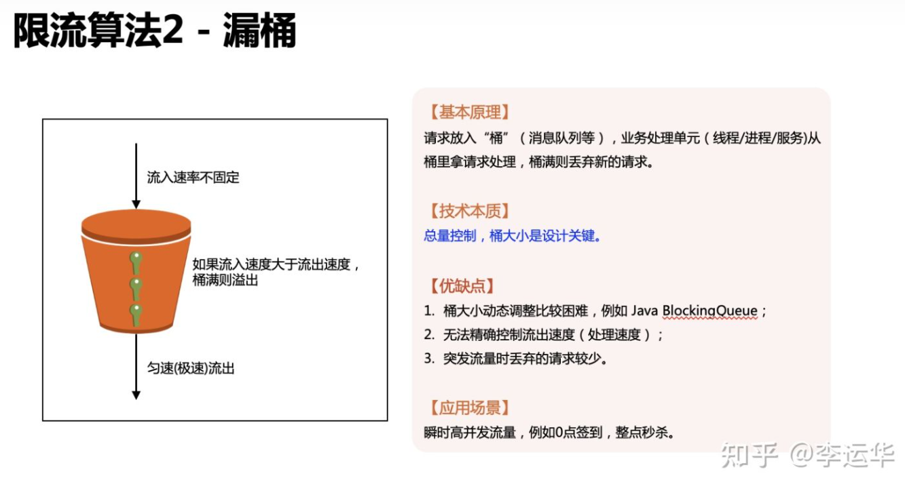
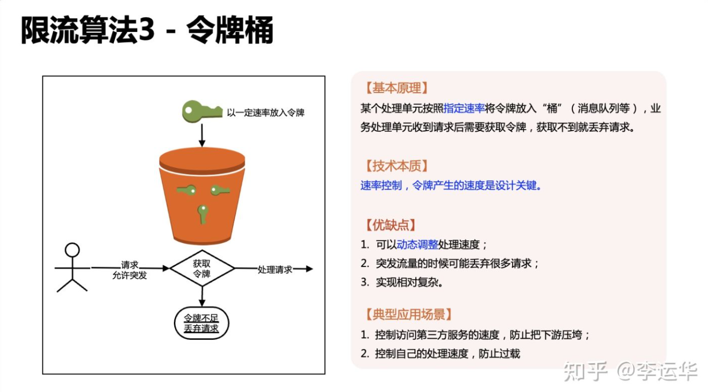

# 系统设计

> 如何答好面试中的系统设计题？ - 九章算法的回答 - 知乎 https://www.zhihu.com/question/26312148/answer/151552277

## 面试原则

+ Ask before design. 问清楚再动手设计，不要一上来就冲着一个巨牛的方案去设计；

+ No more no less. 不要总想着设计最牛的系统，要设计够用的系统；

+ Work solution first. **先设计一个基本能工作的系统，然后再逐步优化**；

+ Analysis is important than solution. 系统设计没有标准答案，通过分析过程展示知识储备，权衡各种设计方式的利弊。

## 系统设计怎么答？

### 第一步：Scenario 场景

需要设计哪些功能（也可以自己想），需要承受多大的访问量。例如 Twitter：

+ Post a Tweet

+ Timeline

+ News Feed

+ Follow/Unfollow a user

+ Register/Login

分析QPS有什么用？

+ 如果QPS = 100，那么用你的笔记本作Web服务器就好了；

+ QPS = 1K，一台好点的Web 服务器也能应付，需要考虑 Single Point Failure；

+ QPS = 1m，则需要建设一个1000台Web服务器的集群，并且要考虑如何实现高可用。

### 第二步，Service服务

将整个系统细分为若干个小的服务。

### 第三步，Storage 存储

根据每个服务的数据特性选择合适的存储结构，然后细化数据表结构。

一般有三大类：数据库系统，文件系统，缓存系统。

确定存储结构后，我们需要细化数据表结构，面试中可以通过画图展示数据存储和读取的流程。

### Scale 扩展

系统的鲁棒性和扩展性，比如有一台服务器/数据库挂了怎么办？如果有流量暴增，如何扩展？

## 秒杀系统

秒杀系统
页面：动静资源分离CDN，服务降级（不显示评论等），令牌桶算法限流等
下单逻辑：验证码放机器人 + 限流 + Redis预扣库存分布式锁
消息队列优化，Redis读写分离 等

### 限流算法

漏桶的本质是总量控制，令牌桶的本质是速率控制。

注意：

+ 这里指适用于高并发，指的是指秒杀、抢购、整点打卡签到、微博热点事件这种业务高并发场景。这种业务场景为了用户体验和业务尽量少受损，优先采取的不是丢弃大量请求，而是缓存请求，避免系统出现雪崩效应。

+ 漏桶的保护是尽量缓存请求（缓存不下才丢），令牌桶的保护主要是丢弃请求（即使系统还能处理，只要超过指定的速率就丢弃，除非此时动态提高速率）。

+ 令牌桶的算法原本是用于网络设备控制传输速度的，而且它控制的目的是保证一段时间内的平均速率控制

+ 之所以说令牌桶适合突发流量，是指在网络传输的时候，可以允许某段时间内（一般就几秒）超过平均传输速率。

+ 这个**短时间**的突发流量是不会导致雪崩效应，也能够处理得过来。

# 系统与架构相关的概念技术

## 存储系统

块存储？对象存储？文件系统？

> 块存储、文件存储、对象存储这三者的本质差别是什么？ - 木头龙的回答 - 知乎
> https://www.zhihu.com/question/21536660/answer/1159036357

这三者的本质差别是使用数据的 用户 不同：

+ 块存储的用户是可以读写块设备的软件系统，例如传统的文件系统、数据库
  
  介质不关心也无法去关心这些数据的组织方式以及结构，因此用的是最简单粗暴的组织方式：所有数据按照固定的大小分块，每一块赋予一个用于寻址的编号。以大家比较熟悉的机械硬盘为例，一块就是一个扇区。所以，硬盘往往又叫块设备（Block Device）。至于哪些块组成一个文件，哪些块记录的是目录/子目录信息，这是文件系统的事情。
  
  在网络存储中，服务器把本地的一个逻辑块设备（部分物理块设备或多个物理块设备的组合）**通过某种协议模拟成一个块设备**，远程的客户端（可以是一台物理主机，也可以是虚拟机）**使用相同的协议把这个逻辑块设备作为一个本地存储介质来使用**，划分分区，格式化自己的文件系统等等。【比如 VM 挂载的磁盘，其实就是块存储在干的事情】
  
  块存储是排它的，服务器上的某个逻辑块被一台客户端挂载后，其它客户端就无法访问上面的数据了。而且挂载了块存储的客户端上的一个程序要访问里面的数据，通常也需要对其进行分区、安装文件系统后才能使用（有特例，比如数据库直接访问裸设备这种方式）。

+ 对象存储的用户则是其它计算机软件
  
  文件存储的树状结构以及路径访问方式虽然方便人类理解、记忆和访问，但对于应用程序来说既没必要，也很浪费性能。
  
  考虑到块存储是排他的，不合适。**而且一个文件往往是由多个块组成，需要让应用程序自己去维护一个文件有哪些块，自行拼接整合，很麻烦。**
  
  为了解决这中麻烦，**使用一个统一的底层存储系统，管理这些文件和底层介质的组织结构**，然后给每个文件一个唯一的标识，其它系统需要访问某个文件，直接提供文件的标识就可以了。存储系统可以用更高效的数据组织方式来管理这些标识以及其对应的存储介质上的块。
  
  
  
  元数据的好处很明显，可以大大加快对象的排序速度、分类查找速度等，也帮应用程序维护了存储块的信息。
  
  > 他们通常会把存储业务分为3个等级，即标准型、低频型、归档型。对应的应用场景如下：  
  > 
  > **标准类型**：移动应用 | 大型网站 | 图片分享 | 热点音视频
  > 
  > **低频访问类型**：移动设备 | 应用与企业数据备份 | 监控数据 | 网盘应用
  > 
  > **归档类型**：各种长期保存的档案数据 | 医疗影像 | 影视素材

+ 文件存储的用户是自然人
