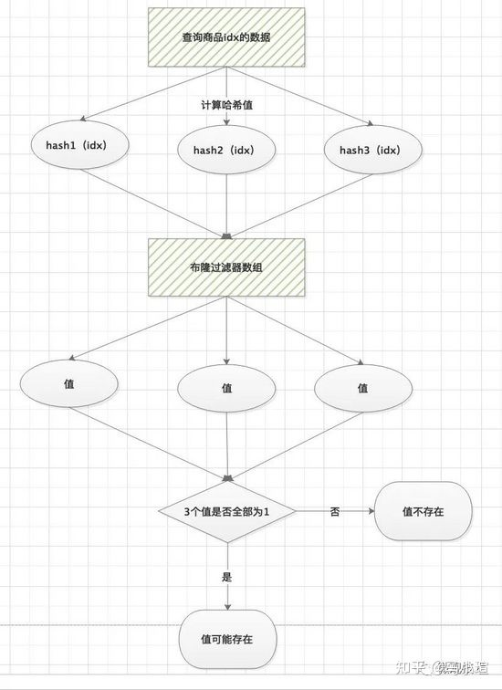

# 缓存

缓存目的：第一次请求时将一些耗时操作的结果暂存，以后遇到相同的请求，直接返回暂存的数据。

## 缓存穿透，缓存击穿，缓存雪崩

具体可参见 7days-golang 分布式缓存章节。这里只讲一讲缓存面临的一些问题。

1. 缓存面临的问题

   1. 缓存穿透：

      描述：查询一个**不存在**的 key，**每次**请求都会穿透到 DB，如果瞬间流量过大，导致负载过大。

      解决方案：

      1. 接口校验：在正常业务流程中可能会存在少量访问不存在 key 的情况，但是一般不会出现大量的情况，所以这种场景最大的可能性是遭受了非法攻击。可以在最外层先做一层校验：用户鉴权、**数据合法性校验**等，例如商品查询中，商品的ID是正整数，则可以直接对非正整数直接过滤等等。

      2. 缓存空值：当访问缓存和DB都没有查询到值时，可以将空值写进缓存，但是设置较短的过期时间，该时间需要根据产品业务特性来设置

      3. 布隆过滤器：使用布隆过滤器存储所有可能访问的 key，不存在的 key 直接被过滤，存在的 key 则再进一步查询缓存和数据库

         > 一个很长的二进制向量和一系列随机映射函数。布隆过滤器可以用于检索一个元素是否在一个集合中。
         >
         > - 优点：空间效率和查询时间都远远超过一般的算法。
         > - 缺点：有一定的误识别率，删除困难。
         >
         > 布隆过滤器本质上是一个 n 位的二进制数组，用0和1表示。对于某一个 `id1` ，进行三次哈希，并确定其在二进制数组中的位置，并将其置位。
         >
         > 

   2. 缓存击穿：

      描述：**某个 key** 在过期的那一刻，这个 key 的多个请求击穿到 DB，造成 DB 瞬时负载过大

      解决方案：

      1. single flight，在并发的多个请求中，只有第一个请求线程能拿到锁并执行数据库查询操作，其他的线程拿不到锁就阻塞等着，等到第一个线程将数据写入缓存后，直接走缓存。
      2. 热点数据不过期。直接将缓存设置为不过期，然后由定时任务去异步加载数据，更新缓存。

   3. 缓存雪崩：

      描述：**多个 key** 在同一时间全部失效，大量请求打到 DB（不同 key 的多个请求和同一 key 的多个请求 都存在），引起雪崩。通常是因为缓存服务器宕机或是所有 key 设定的相同的过期时间

      解决方案：

      1. 过期时间打散。给缓存的过期时间时加上一个随机值时间，使得每个 key 的过期时间分布开来，不会集中在同一时刻失效。
      2. 辅助使用缓存击穿的处理办法：single flight 和 热点数据不过期
      2. redis 预加载（缓存预）。将一些可能会经常使用的数据，在系统启动的时候就预先设置到缓存中，这样可以避免在使用的时候去先去数据库查询。还有一种方式就是添加一个缓存刷新页，这样可以通过人工干预的方式将一些可能为热点key添加到缓存中。

## 先更新数据库还是先更新缓存

> 如何保持mysql和redis中数据的一致性？ - 鹅厂架构师的回答 - 知乎 https://www.zhihu.com/question/319817091/answer/2176813916
>
> 如何保持mysql和redis中数据的一致性？ - Kaito的回答 - 知乎 https://www.zhihu.com/question/319817091/answer/2110995185
>
> 面试官：Redis数据更新，是先更新数据库还是先更新缓存? - Java编程宇宙的文章 - 知乎 https://zhuanlan.zhihu.com/p/437203229

从理论上来说，给缓存设置过期时间，是保证最终一致性的解决方案。这种方案下，我们可以对存入缓存的数据设置过期时间，所有的写操作以数据库为准，对缓存操作只是尽最大努力即可。**也就是说如果数据库写成功，缓存更新失败，那么只要到达过期时间，则后面的读请求自然会从数据库中读取新值然后回填缓存。因此，接下来讨论的思路不依赖于给缓存设置过期时间这个方案。**

在这里讨论三种更新策略：

- 先更新数据库，再更新缓存
- 先删除缓存，再更新数据库
- 先更新数据库，再删除缓存

#### 先更新缓存，后更新数据库

如果缓存更新成功了，但数据库更新失败，那么此时缓存中是最新值，但数据库中是「旧值」。虽然此时读请求可以命中缓存，拿到正确的值，但是，一旦缓存「失效」，就会从数据库中读取到「旧值」，重建缓存也是这个旧值。

这时用户会发现自己之前修改的数据又「变回去」了，对业务造成影响。

#### 先更新数据库，再更新缓存【普遍反对】

- 原因一（线程安全角度）

  同时有请求A和请求B进行更新操作，那么会出现

  > - 线程A更新了数据库
  >
  > - 线程B更新了数据库
  >
  > - 线程B更新了缓存
  >
  > - 线程A更新了缓存

  请求 A 更新缓存应该比请求 B 更新缓存早才对，但是因为网络等原因，B 却比 A 更早更新了缓存。这就导致了脏数据，因此不考虑。

- 原因二（业务场景）

  + 如果你是一个**写数据库场景比较多，而读数据场景比较少**的业务需求，采用这种方案就会导致，数据压根还没读到，缓存就被频繁的更新，浪费性能。
  + 如果你写入数据库的值，并不是直接写入缓存的，而是要经过一系列复杂的计算再写入缓存。那么，每次写入数据库后，都再次计算写入缓存的值，无疑是浪费性能的。显然，删除缓存更为适合。

#### 先删缓存，再更新数据库

仍会导致不一致性：

> - 请求A进行写操作，删除缓存
> - 请求B查询发现缓存不存在
> - 请求B去数据库查询得到旧值
> - 请求B将旧值写入缓存
> - 请求A将新值写入数据库

可以采取双删策略解决：

```
public void write(String key,Object data){
    redis.delKey(key);
    db.updateData(data);
    Thread.sleep(1000);
    redis.delKey(key);
}
```

转化为中文描述就是

- 先淘汰缓存
- 再写数据库（这两步和原来一样）
- 休眠1秒，再次淘汰缓存
  - 时间需要根据业务逻辑自行评估。
  - 为了防止休眠造成系统吞吐率降低，可以进行异步的删除，新开一个线程执行删除。

这么做，可以将1秒内所造成的缓存脏数据，再次删除。不过还是可能删除失败的！

#### 先更新数据库，再删缓存

这种情况下依然可能存在脏数据，不过概率已经小了很多很多很多。

> - 缓存刚好失效
> - 请求A查询数据库，得一个旧值
> - 请求B将新值写入数据库
> - 请求B删除缓存
> - 请求A将查到的旧值写入缓存

#### 怎么办

##### 加个消息队列吧

其实，上述问题主要是因为 更新数据库 和 删除缓存 这两步并不能都保证执行成功。如何保证两步都执行成功？

最简单的办法是重试。不过，立即重试很大概率「还会失败」，重试会一直「占用」这个线程资源，无法服务其它客户端请求。因此更好的方案是**异步重试**。

其实就是把重试请求写到「消息队列」中，然后由专门的消费者来重试，直到成功。或者更直接的做法，为了避免第二步执行失败，我们可以把操作缓存这一步，直接放到消息队列中，由消费者来操作缓存。

写消息队列也有可能会失败啊？而且，引入消息队列，这又增加了更多的维护成本，这样做值得吗？
问题很好，但考虑到：如果在执行失败的线程中一直重试，还没等执行成功，此时如果项目「重启」了，那这次重试请求也就丢失了，那这条数据就一直不一致了。

所以，必须把重试消息或第二步操作放到另一个「服务」中，这个服务用「消息队列」最为合适。这是因为消息队列的特性，正好符合需求

+ 消息队列保证可靠性：写到队列中的消息，成功消费之前不会丢失（重启项目也不担心）
+ 消息队列保证消息成功投递：下游从队列拉取消息，成功消费后才会删除消息，否则还会继续投递消息给消费者（符合重试的需求）

##### 订阅 binlog

如果引入了消息队列，其实对现有的业务造成了入侵，不妙。

可以用一个服务（比如阿里的 canal）去监听数据库的binlog，获取需要操作的数据。

然后用另外一个服务获取订阅程序传来的信息，进行缓存删除操作。这样一来，对我们本身的业务入侵就小了很多。

#### 针对读写缓存

之前业务都只需要读缓存。

读写缓存：增删改在缓存中进⾏，并采取相应的回写策略，同步数据到数据库中。

- 同步直写：使用事务，保证缓存和数据更新的原子性，并进行失败重试（如果Redis 本身出现故障，会降低服务的性能和可用性） 

- 异步回写：写缓存时不同步写数据库，等到数据从缓存中淘汰时，再写回数据库（没写回数据库前，缓存发生故障，会造成数据丢失）

  该策略在秒杀场中有见到过，业务层直接对缓存中的秒杀商品库存信息进行操作，⼀段时间后再回写数据库。 

⼀致性：同步直写 > 异步回写 

