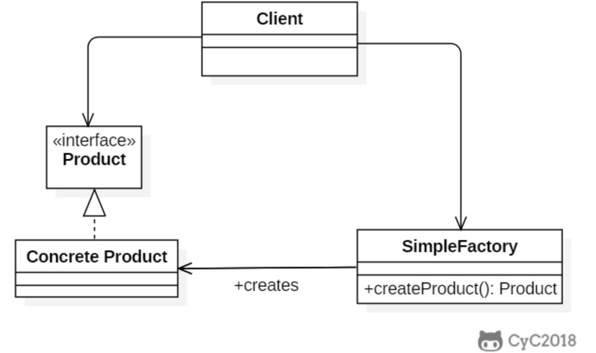
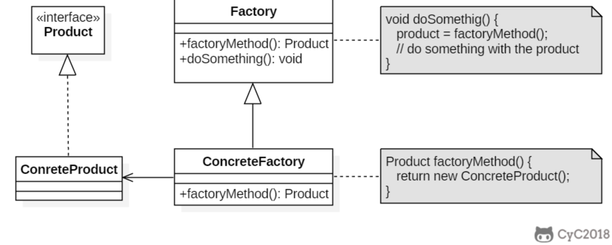
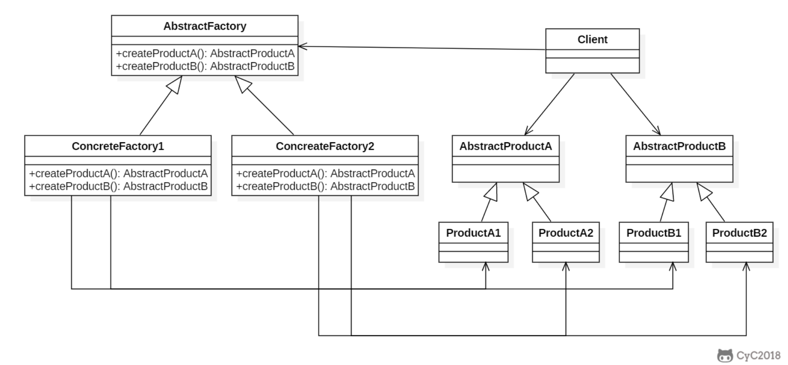

# 设计模式

> C++各类设计模式及实现详解 - linux的文章 - 知乎 https://zhuanlan.zhihu.com/p/431714886
>
> https://lailin.xyz/post/go-design-pattern.html
>
> https://refactoringguru.cn/design-patterns/

总原则：开闭原则（Open Close Principle）

开闭原则就是说对扩展开放，对修s改关闭。在程序需要进行拓展的时候，不能去修改原有的代码，而是要扩展原有代码，实现一个热插拔的效果。

## 设计模式分类

总体来说设计模式分为三大类

创建型模式，共五种：工厂方法模式、抽象工厂模式、单例模式、建造者模式、原型模式。

结构型模式，共七种：适配器模式、装饰器模式、代理模式、外观模式、桥接模式、组合模式、享元模式。

行为型模式，共十一种：策略模式、模板方法模式、观察者模式、迭代子模式、责任链模式、命令模式、备忘录模式、状态模式、访问者模式、中介者模式、解释器模式。

其实还有两类：并发型模式和线程池模式。

## 创建型模式

### 单例模式（Singleton）

#### Intent

确保一个类只有一个实例，并提供该实例的全局访问点。

##### Class Diagram

使用**一个私有构造函数、一个私有静态变量以及一个公有静态函数**来实现。

私有构造函数保证了不能通过构造函数来创建对象实例，只能通过公有静态函数返回唯一的私有静态变量。

#### Implementation

```c++
struct Database {
 protected:
  Database() { 
      /* do what you need to do */
  }

 public:
  static Database& get() {
    // thread-safe in C++11
    static Database database;
    return database;
  }
  Database(Database const&) = delete;
  Database(Database&&) = delete;
  Database& operator=(Database const&) = delete;
  Database& operator=(Database&&) = delete;
};
```

#### 看一眼 Go 的实现

+ 饿汉式

  ```go
  package singleton
  
  // Singleton 饿汉式单例
  type Singleton struct{}
  
  var singleton *Singleton
  
  func init() {
  	singleton = &Singleton{}
  }
  
  // GetInstance 获取实例
  func GetInstance() *Singleton {
  	return singleton
  }
  ```

+ 懒汉式

  ```go
  package singleton
  
  import "sync"
  
  var (
  	lazySingleton *Singleton
  	once          = &sync.Once{}
  )
  
  // GetLazyInstance 懒汉式
  func GetLazyInstance() *Singleton {
  	if lazySingleton == nil {
  		once.Do(func() {
  			lazySingleton = &Singleton{}
  		})
  	}
  	return lazySingleton
  }
  ```

#### 看一眼隔壁 JAVA 的实现

+ 懒汉式-线程不安全

以下实现中，私有静态变量 uniqueInstance 被延迟实例化，这样做的好处是，如果没有用到该类，那么就不会实例化 uniqueInstance，从而节约资源。

这个实现在多线程环境下是不安全的，可能导致实例化多次 uniqueInstance。

```java
public class Singleton {

    private static Singleton uniqueInstance;

    private Singleton() {
    }

    public static Singleton getUniqueInstance() {
        if (uniqueInstance == null) {
            uniqueInstance = new Singleton();
        }
        return uniqueInstance;
    }
}
```

+ 饿汉式-线程安全

线程不安全问题主要是由于 uniqueInstance 被实例化多次，采取直接实例化 uniqueInstance 的方式就不会产生线程不安全问题。

但是直接实例化的方式也丢失了延迟实例化带来的节约资源的好处。

```java
private static Singleton uniqueInstance = new Singleton();
```

+ 懒汉式-线程安全

只需要对 getUniqueInstance() 方法加锁，那么在一个时间点只能有一个线程能够进入该方法，从而避免了实例化多次 uniqueInstance。

但是当一个线程进入该方法之后，其它试图进入该方法的线程都必须等待，即使 uniqueInstance 已经被实例化了。这会让线程阻塞时间过长，因此该方法有性能问题，不推荐使用。

```java
public static synchronized Singleton getUniqueInstance() {
    if (uniqueInstance == null) {
        uniqueInstance = new Singleton();
    }
    return uniqueInstance;
}
```

+ 双重校验锁-线程安全

uniqueInstance 只需要被实例化一次，之后就可以直接使用了。加锁操作只需要对实例化那部分的代码进行，只有当 uniqueInstance 没有被实例化时，才需要进行加锁。双重校验锁先判断 uniqueInstance 是否已经被实例化，如果没有被实例化，那么才对实例化语句进行加锁。

```java
public class Singleton {

    private volatile static Singleton uniqueInstance;

    private Singleton() {
    }

    public static Singleton getUniqueInstance() {
        if (uniqueInstance == null) {
            synchronized (Singleton.class) {
                if (uniqueInstance == null) {
                    uniqueInstance = new Singleton();
                }
            }
        }
        return uniqueInstance;
    }
}
```

### 工厂模式

#### 简单工厂

##### Intent

在创建一个对象时不向客户暴露内部细节，并提供一个创建对象的通用接口。

##### Class Diagram

简单工厂把实例化的操作单独放到一个类中，这个类就成为简单工厂类，**让简单工厂类来决定应该用哪个具体子类来实例化**。

这样做能把客户类和具体子类的实现解耦，客户类不再需要知道有哪些子类以及应当实例化哪个子类。客户类往往有多个，**如果不使用简单工厂，那么所有的客户类都要知道所有子类的细节。而且一旦子类发生改变，例如增加子类，那么所有的客户类都要进行修改**。



基本做到了**对扩展开放，**但是没有做到**对修改关闭（新增类的时候，需要修改简单工厂的代码）**

##### Implementation

```c++
class SimpleFactory
{
public:
    enum TYPE{
        APPLE,
        BANANA,
        PEAR
    };

    static ProductionLine *CreateProLine(TYPE type) {
        ProductionLine* proLine;
        switch (type) {
        case APPLE:
            proLine = new AppleLine();
            break;
        case BANANA:
            proLine = new BananaLine();
            break;
        case PEAR:
            proLine = new Pear();
            break;
        }
        return proLine;
    }
};
```

##### 看一眼隔壁 Go 的实现

由于 Go 本身是没有构造函数的，一般而言我们采用 `NewName` 的方式创建对象/接口，当它返回的是接口的时候，其实就是简单工厂模式

```go
package factory

// IRuleConfigParser IRuleConfigParser
type IRuleConfigParser interface {
	Parse(data []byte)
}

// jsonRuleConfigParser jsonRuleConfigParser
type jsonRuleConfigParser struct {
}
func (J jsonRuleConfigParser) Parse(data []byte) {
	panic("implement me")
}

// yamlRuleConfigParser yamlRuleConfigParser
type yamlRuleConfigParser struct {
}
func (Y yamlRuleConfigParser) Parse(data []byte) {
	panic("implement me")
}

// NewIRuleConfigParser NewIRuleConfigParser
func NewIRuleConfigParser(t string) IRuleConfigParser {
	switch t {
	case "json":
		return jsonRuleConfigParser{}
	case "yaml":
		return yamlRuleConfigParser{}
	}
	return nil
}
```

##### 看一眼隔壁 JAVA 的实现

```java
public interface Product {
}
public class ConcreteProduct implements Product {
}
public class ConcreteProduct1 implements Product {
}
public class ConcreteProduct2 implements Product {
}

public class SimpleFactory {

    public Product createProduct(int type) {
        if (type == 1) {
            return new ConcreteProduct1();
        } else if (type == 2) {
            return new ConcreteProduct2();
        }
        return new ConcreteProduct();
    }
}

public class Client {

    public static void main(String[] args) {
        SimpleFactory simpleFactory = new SimpleFactory();
        Product product = simpleFactory.createProduct(1);
        // do something with the product
    }
}
```

#### 工厂方法

##### Intent

定义了一个创建对象的接口，但由子类决定要实例化哪个类。工厂方法把实例化操作推迟到子类。

当对象的创建逻辑比较复杂，不只是简单的 new 一下就可以，而是要组合其他类对象，做各种初始化操作的时候，推荐使用工厂方法模式，**将复杂的创建逻辑拆分到多个工厂类中，让每个工厂类都不至于过于复杂**。

##### Class Diagram

在简单工厂中，创建对象的是另一个类，而在工厂方法中，是由子类来创建对象。

下图中，Factory 有一个 doSomething() 方法，这个方法需要用到一个产品对象，这个产品对象由 factoryMethod() 方法创建。该方法是抽象的，需要由子类去实现。



##### Implementation

```c++
struct Point
{
    float x, y;
    friend class PointFactory;
    private:
        Point(float x, float y):
            x(x), y(y) {};
};

struct PointFactory
{
    static Point NewCartesian(float x, float y)
    {
        return Point{x, y};
    }
    static Point NewPolar(float r, float theta)
    {
        return Point{ r*cos(theta), r*sin(theta); };
    }
};
```

##### 看一眼隔壁 Go 的实现

```go
// IRuleConfigParserFactory 工厂方法接口
type IRuleConfigParserFactory interface {
	CreateParser() IRuleConfigParser
}

// yamlRuleConfigParserFactory yamlRuleConfigParser 的工厂类
type yamlRuleConfigParserFactory struct {
}
func (y yamlRuleConfigParserFactory) CreateParser() IRuleConfigParser {
	return yamlRuleConfigParser{}
}

// jsonRuleConfigParserFactory jsonRuleConfigParser 的工厂类
type jsonRuleConfigParserFactory struct {
}
func (j jsonRuleConfigParserFactory) CreateParser() IRuleConfigParser {
	return jsonRuleConfigParser{}
}

// NewIRuleConfigParserFactory 用一个简单工厂封装工厂方法
func NewIRuleConfigParserFactory(t string) IRuleConfigParserFactory {
	switch t {
	case "json":
		return jsonRuleConfigParserFactory{}
	case "yaml":
		return yamlRuleConfigParserFactory{}
	}
	return nil
}
```

##### 看一眼隔壁 JAVA 的实现

```java
public abstract class Factory {
    abstract public Product factoryMethod();
    public void doSomething() {
        Product product = factoryMethod();
        // do something with the product
    }
}
public class ConcreteFactory1 extends Factory {
    public Product factoryMethod() {
        return new ConcreteProduct1();
    }
}
public class ConcreteFactory2 extends Factory {
    public Product factoryMethod() {
        return new ConcreteProduct2();
    }
}
```

#### 抽象工厂

目前为止，我们一直在研究单个对象的构造。有时，你可能会涉及到一系列对象的构造。在实际中这种情况是非常少见的，同工厂方法和简单陈旧的工厂模式相比，抽象工厂模式只会出现在复杂的系统中。

Client 要通过 AbstractFactory 同时调用两个方法来创建出两个对象



##### 看一眼隔壁 Go 的实现

```go
package factory

// IRuleConfigParser IRuleConfigParser
type IRuleConfigParser interface {
	Parse(data []byte)
}

// jsonRuleConfigParser jsonRuleConfigParser
type jsonRuleConfigParser struct{}
func (j jsonRuleConfigParser) Parse(data []byte) {
	panic("implement me")
}

// ISystemConfigParser ISystemConfigParser
type ISystemConfigParser interface {
	ParseSystem(data []byte)
}

// jsonSystemConfigParser jsonSystemConfigParser
type jsonSystemConfigParser struct{}
func (j jsonSystemConfigParser) ParseSystem(data []byte) {
	panic("implement me")
}

// IConfigParserFactory 工厂方法接口
type IConfigParserFactory interface {
	CreateRuleParser() IRuleConfigParser
	CreateSystemParser() ISystemConfigParser
}

type jsonConfigParserFactory struct{}

func (j jsonConfigParserFactory) CreateRuleParser() IRuleConfigParser {
	return jsonRuleConfigParser{}
}

func (j jsonConfigParserFactory) CreateSystemParser() ISystemConfigParser {
	return jsonSystemConfigParser{}
}
```

##### 看一眼隔壁 JAVA 的实现

```java
public class AbstractProductA {
}
public class ProductA1 extends AbstractProductA {
}
public class ProductA2 extends AbstractProductA {
}
public class AbstractProductB {
}
public class ProductB1 extends AbstractProductB {
}
public class ProductB2 extends AbstractProductB {
}

public abstract class AbstractFactory {
    abstract AbstractProductA createProductA();
    abstract AbstractProductB createProductB();
}
public class ConcreteFactory1 extends AbstractFactory {
    AbstractProductA createProductA() {
        return new ProductA1();
    }

    AbstractProductB createProductB() {
        return new ProductB1();
    }
}
public class ConcreteFactory2 extends AbstractFactory {
    AbstractProductA createProductA() {
        return new ProductA2();
    }

    AbstractProductB createProductB() {
        return new ProductB2();
    }
}

public class Client {
    public static void main(String[] args) {
        AbstractFactory abstractFactory = new ConcreteFactory1();
        AbstractProductA productA = abstractFactory.createProductA();
        AbstractProductB productB = abstractFactory.createProductB();
        // do something with productA and productB
    }
}
```

