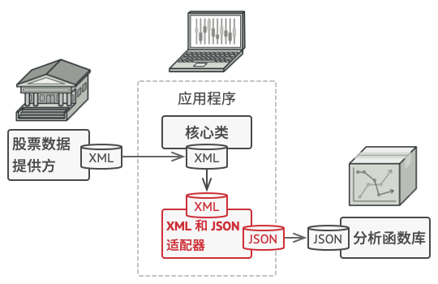

# 设计模式

> C++各类设计模式及实现详解 - linux的文章 - 知乎 https://zhuanlan.zhihu.com/p/431714886
>
> https://lailin.xyz/post/go-design-pattern.html
>
> https://refactoringguru.cn/design-patterns/

总原则：开闭原则（Open Close Principle）

开闭原则就是说对扩展开放，对修改关闭。在程序需要进行拓展的时候，不能去修改原有的代码，而是要扩展原有代码，实现一个热插拔的效果。

## 零散的相关概念

以 JAVA 为例：

abstract 类不能创建实例对象，含有 abstract 方法的类必须定义为 abstract class。

abstract class 类中的方法不必全是抽象的，接口（interface）可以说成是抽象类的一种特例，接口中的所有方法都必须是抽象的。

+ 抽象类可以有构造方法，接口中不能有构造方法，抽象类中可以有普通成员变量，接口中没有普通成员变量
+ 抽象类中可以包含非抽象的普通方法，接口中的所有方法必须都是抽象的，不能有非抽象的普通方法
+ 抽象类中可以包含静态方法，接口中不能包含静态方法

**在应用上：接口更多的是在系统架构设计方法发挥作用，主要用于定义模块之间的通信契约。而抽象类在代码实现方面发挥作用，可以实现代码的重用**

## 设计模式分类

总体来说设计模式分为三大类

创建型模式，共五种：工厂方法模式、抽象工厂模式、单例模式、生成器模式、原型模式。

结构型模式，共七种：适配器模式、装饰器模式、代理模式、外观模式、桥接模式、组合模式、享元模式。

行为型模式，共十一种：策略模式、模板方法模式、观察者模式、迭代子模式、责任链模式、命令模式、备忘录模式、状态模式、访问者模式、中介者模式、解释器模式。

其实还有两类：并发型模式和线程池模式。

## 设计模式的原则及其含义

S.O.L.I.D + 迪米特法则

### S - The Single Responsibility Principle 单一职责原则

**让一个类只负责一件事**，当这个类需要做过多事情的时候，就需要分解这个类。

如果一个类承担的职责过多，就等于把这些职责耦合在了一起，一个职责的变化可能会削弱这个类完成其它职责的能
力。

### O - The Open Closed Principle 开放封闭原则

类应该**对扩展开放，对修改关闭**。

该原则要求在添加新功能时不需要修改代码。

### L - The Liskov Substitution Principle 里氏替换原则

**子类对象**必须能够**替换掉所有父类对象**。

**继承是一种 IS-A 关系**，子类需要能够当成父类来使用，并且需要比父类更特殊。如果不满足这个原则，那么各个子类的行为上就会有很大差异，增加继承体系的复杂度。

### I - The Interface Segregation Principle 接口分离原则

+ 客户端不应该依赖它不需要的接口（客户端需要什么功能，就提供什么接口，对于客户端不需要的接口不应该强行要求其依赖，把不需要的接口剔除掉）
+ 类间的依赖关系应该建立在最小的接口之上

例如，订单是一个接口，包括订单的社情、审核、结束、排产、冻结、导出等等操作。而某个具体的实现，如订单生产类，很多接口都不需要实现。

### D - The Dependency Inversion Principle 依赖倒置原则

+ 高层模块不应该依赖于低层模块，二者都应该依赖于抽象；

  + 比如高层需要 save 一个文档，底层是具体存储方式比如存在 OSS 上。高层不知道底层具体怎么存，也不应当为存在 OSS 上做适配。他们之间应该通过接口来交互。

  + 例如：

    ```c++
    #include <iostream>
    class Car{
    public:
        //车具有运行的功能
        void Run(){
            std::cout << "I am running in the road" << std::endl;
        }
    };
    class Person{
    public:
        //完成开车的功能
        void Drive(Car _car) {
            _car.Run();
        }
    };
    int main(int argc,char *argv[])
    {
        Person p;
        p.Drive(Car());
        return 0;
    }
    ```

    ```c++
    作者：SenLin
    链接：https://zhuanlan.zhihu.com/p/275785681
    来源：知乎
    著作权归作者所有。商业转载请联系作者获得授权，非商业转载请注明出处。
    
    #include <iostream>
    class Car{
    public:
        Car(){}
        virtual ~Car(){}
        //车具有运行的功能
        virtual void Run()  {
            std::cout << "No car run" << std::endl;
        }
    };
    class Maserati : public  Car{
    public:
        void Run() override {
            std::cout << "I am Maserati ,I am running in a fast speed" << std::endl;
        }
    };
    class Lamborghini : public Car{
    public:
        void Run() override {
            std::cout << "I am Lamborghini ,I am running in a fast speed" << std::endl;
        }
    };
    class Person{
    public:
        //完成开车的功能
        void Drive(Car& _car) {
            _car.Run();
        }
    
    };
    int main(int argc,char *argv[])
    {
        Person p;
        Lamborghini lam;
        Maserati mas;
        p.Drive(lam);
        p.Drive(mas);
        return 0;
    }
    ```

+ 抽象不应该依赖于细节，细节应该依赖于抽象。

### 迪米特法则

一个对象应该对其他对象保持最少的了解，又叫最少知道原则（Least Knowledge Principle，LKP），尽量降低类与类之间的耦合度。这个原则认为，任何一个对象或者方法，它应该只能调用下列对象：

- 该对象本身
- 作为参数传进来的对象（也可以是该对象的字段）
- 在方法内创建的对象

具体的：

- 有依赖关系的类之间，尽量只依赖必要的接口（“有限知识”）

- 不该有直接依赖关系的类之间，不要有依赖

  - 例如，搜索引擎的底层网络通信模块、Html downloader、网页文档渲染模块是三个模块。

    底层网络模块要求的入参是 HtmlRequest 是不合适的，它可能还会被用来下载别的东西。它违背了迪米特法则，依赖了不应该依赖的 HtmlRequest 类。

    

    

    

  

## 创建型模式

### 单例模式（Singleton）

#### Intent

确保一个类只有一个实例，并提供该实例的全局访问点。

##### Class Diagram

使用**一个私有构造函数、一个私有静态变量以及一个公有静态函数**来实现。

私有构造函数保证了不能通过构造函数来创建对象实例，只能通过公有静态函数返回唯一的私有静态变量。

#### Implementation

```c++
struct Database {
 protected:
  Database() { 
      /* do what you need to do */
  }

 public:
  static Database& get() {
    // thread-safe in C++11
    static Database database;
    return database;
  }
  Database(Database const&) = delete;
  Database(Database&&) = delete;
  Database& operator=(Database const&) = delete;
  Database& operator=(Database&&) = delete;
};
```

#### 看一眼 Go 的实现

+ 饿汉式

  ```go
  package singleton
  
  // Singleton 饿汉式单例
  type Singleton struct{}
  
  var singleton *Singleton
  
  func init() {
  	singleton = &Singleton{}
  }
  
  // GetInstance 获取实例
  func GetInstance() *Singleton {
  	return singleton
  }
  ```

+ 懒汉式

  ```go
  package singleton
  
  import "sync"
  
  var (
  	lazySingleton *Singleton
  	once          = &sync.Once{}
  )
  
  // GetLazyInstance 懒汉式
  func GetLazyInstance() *Singleton {
  	if lazySingleton == nil {
  		once.Do(func() {
  			lazySingleton = &Singleton{}
  		})
  	}
  	return lazySingleton
  }
  ```

#### 看一眼隔壁 JAVA 的实现

+ 懒汉式-线程不安全

以下实现中，私有静态变量 uniqueInstance 被延迟实例化，这样做的好处是，如果没有用到该类，那么就不会实例化 uniqueInstance，从而节约资源。

这个实现在多线程环境下是不安全的，可能导致实例化多次 uniqueInstance。

```java
public class Singleton {

    private static Singleton uniqueInstance;

    private Singleton() {
    }

    public static Singleton getUniqueInstance() {
        if (uniqueInstance == null) {
            uniqueInstance = new Singleton();
        }
        return uniqueInstance;
    }
}
```

+ 饿汉式-线程安全

线程不安全问题主要是由于 uniqueInstance 被实例化多次，采取直接实例化 uniqueInstance 的方式就不会产生线程不安全问题。

但是直接实例化的方式也丢失了延迟实例化带来的节约资源的好处。

```java
private static Singleton uniqueInstance = new Singleton();
```

+ 懒汉式-线程安全

只需要对 getUniqueInstance() 方法加锁，那么在一个时间点只能有一个线程能够进入该方法，从而避免了实例化多次 uniqueInstance。

但是当一个线程进入该方法之后，其它试图进入该方法的线程都必须等待，即使 uniqueInstance 已经被实例化了。这会让线程阻塞时间过长，因此该方法有性能问题，不推荐使用。

```java
public static synchronized Singleton getUniqueInstance() {
    if (uniqueInstance == null) {
        uniqueInstance = new Singleton();
    }
    return uniqueInstance;
}
```

+ 双重校验锁-线程安全

uniqueInstance 只需要被实例化一次，之后就可以直接使用了。加锁操作只需要对实例化那部分的代码进行，只有当 uniqueInstance 没有被实例化时，才需要进行加锁。双重校验锁先判断 uniqueInstance 是否已经被实例化，如果没有被实例化，那么才对实例化语句进行加锁。

```java
public class Singleton {

    private volatile static Singleton uniqueInstance;

    private Singleton() {
    }

    public static Singleton getUniqueInstance() {
        if (uniqueInstance == null) {
            synchronized (Singleton.class) {
                if (uniqueInstance == null) {
                    uniqueInstance = new Singleton();
                }
            }
        }
        return uniqueInstance;
    }
}
```

### 工厂模式

#### 简单工厂

##### Intent

在创建一个对象时不向客户暴露内部细节，并提供一个创建对象的通用接口。

##### Class Diagram

简单工厂把实例化的操作单独放到一个类中，这个类就成为简单工厂类，**让简单工厂类来决定应该用哪个具体子类来实例化**。

这样做能把客户类和具体子类的实现解耦，客户类不再需要知道有哪些子类以及应当实例化哪个子类。客户类往往有多个，**如果不使用简单工厂，那么所有的客户类都要知道所有子类的细节。而且一旦子类发生改变，例如增加子类，那么所有的客户类都要进行修改**。


基本做到了**对扩展开放，**但是没有做到**对修改关闭（新增类的时候，需要修改简单工厂的代码）**

##### Implementation

```c++
class SimpleFactory
{
public:
    enum TYPE{
        APPLE,
        BANANA,
        PEAR
    };

    static ProductionLine *CreateProLine(TYPE type) {
        ProductionLine* proLine;
        switch (type) {
        case APPLE:
            proLine = new AppleLine();
            break;
        case BANANA:
            proLine = new BananaLine();
            break;
        case PEAR:
            proLine = new Pear();
            break;
        }
        return proLine;
    }
};
```

##### 看一眼隔壁 Go 的实现

由于 Go 本身是没有构造函数的，一般而言我们采用 `NewName` 的方式创建对象/接口，当它返回的是接口的时候，其实就是简单工厂模式

```go
package factory

// IRuleConfigParser IRuleConfigParser
type IRuleConfigParser interface {
	Parse(data []byte)
}

// jsonRuleConfigParser jsonRuleConfigParser
type jsonRuleConfigParser struct {
}
func (J jsonRuleConfigParser) Parse(data []byte) {
	panic("implement me")
}

// yamlRuleConfigParser yamlRuleConfigParser
type yamlRuleConfigParser struct {
}
func (Y yamlRuleConfigParser) Parse(data []byte) {
	panic("implement me")
}

// NewIRuleConfigParser NewIRuleConfigParser
func NewIRuleConfigParser(t string) IRuleConfigParser {
	switch t {
	case "json":
		return jsonRuleConfigParser{}
	case "yaml":
		return yamlRuleConfigParser{}
	}
	return nil
}
```

##### 看一眼隔壁 JAVA 的实现

```java
public interface Product {
}
public class ConcreteProduct implements Product {
}
public class ConcreteProduct1 implements Product {
}
public class ConcreteProduct2 implements Product {
}

public class SimpleFactory {

    public Product createProduct(int type) {
        if (type == 1) {
            return new ConcreteProduct1();
        } else if (type == 2) {
            return new ConcreteProduct2();
        }
        return new ConcreteProduct();
    }
}

public class Client {

    public static void main(String[] args) {
        SimpleFactory simpleFactory = new SimpleFactory();
        Product product = simpleFactory.createProduct(1);
        // do something with the product
    }
}
```

#### 工厂方法

##### Intent

定义一个创建对象的接口，**让其子类自己决定实例化哪一个工厂类**，工厂模式使其创建过程延迟到子类进行。

当对象的创建逻辑比较复杂，不只是简单的 new 一下就可以，而是要组合其他类对象，做各种初始化操作的时候，推荐使用工厂方法模式，**将复杂的创建逻辑拆分到多个工厂类中，让每个工厂类都不至于过于复杂**。

##### Class Diagram

在简单工厂中，创建对象的是另一个类，而在工厂方法中，是由子类来创建对象。

下图中，Factory 有一个 doSomething() 方法，这个方法需要用到一个产品对象，这个产品对象由 factoryMethod() 方法创建。该方法是抽象的，需要由子类去实现。


##### Implementation

```c++
struct Point
{
    float x, y;
    friend class PointFactory;
    private:
        Point(float x, float y):
            x(x), y(y) {};
};

struct PointFactory
{
    static Point NewCartesian(float x, float y)
    {
        return Point{x, y};
    }
    static Point NewPolar(float r, float theta)
    {
        return Point{ r*cos(theta), r*sin(theta); };
    }
};
```

##### 看一眼隔壁 Go 的实现

```go
// IRuleConfigParserFactory 工厂方法接口
type IRuleConfigParserFactory interface {
	CreateParser() IRuleConfigParser
}

// yamlRuleConfigParserFactory yamlRuleConfigParser 的工厂类
type yamlRuleConfigParserFactory struct {
}
func (y yamlRuleConfigParserFactory) CreateParser() IRuleConfigParser {
	return yamlRuleConfigParser{}
}

// jsonRuleConfigParserFactory jsonRuleConfigParser 的工厂类
type jsonRuleConfigParserFactory struct {
}
func (j jsonRuleConfigParserFactory) CreateParser() IRuleConfigParser {
	return jsonRuleConfigParser{}
}

// NewIRuleConfigParserFactory 用一个简单工厂封装工厂方法
func NewIRuleConfigParserFactory(t string) IRuleConfigParserFactory {
	switch t {
	case "json":
		return jsonRuleConfigParserFactory{}
	case "yaml":
		return yamlRuleConfigParserFactory{}
	}
	return nil
}
```

##### 看一眼隔壁 JAVA 的实现

```java
public abstract class Factory {
    abstract public Product factoryMethod();
    public void doSomething() {
        Product product = factoryMethod();
        // do something with the product
    }
}
public class ConcreteFactory1 extends Factory {
    public Product factoryMethod() {
        return new ConcreteProduct1();
    }
}
public class ConcreteFactory2 extends Factory {
    public Product factoryMethod() {
        return new ConcreteProduct2();
    }
}
```

#### 抽象工厂

目前为止，我们一直在研究单个对象的构造。有时，你可能会涉及到一系列对象的构造。在实际中这种情况是非常少见的，同工厂方法和简单陈旧的工厂模式相比，抽象工厂模式只会出现在复杂的系统中。

Client 要通过 AbstractFactory 同时调用两个方法来创建出两个对象


##### 看一眼隔壁 Go 的实现

```go
package factory

// IRuleConfigParser IRuleConfigParser
type IRuleConfigParser interface {
	Parse(data []byte)
}

// jsonRuleConfigParser jsonRuleConfigParser
type jsonRuleConfigParser struct{}
func (j jsonRuleConfigParser) Parse(data []byte) {
	panic("implement me")
}

// ISystemConfigParser ISystemConfigParser
type ISystemConfigParser interface {
	ParseSystem(data []byte)
}

// jsonSystemConfigParser jsonSystemConfigParser
type jsonSystemConfigParser struct{}
func (j jsonSystemConfigParser) ParseSystem(data []byte) {
	panic("implement me")
}

// IConfigParserFactory 工厂方法接口
type IConfigParserFactory interface {
	CreateRuleParser() IRuleConfigParser
	CreateSystemParser() ISystemConfigParser
}

type jsonConfigParserFactory struct{}

func (j jsonConfigParserFactory) CreateRuleParser() IRuleConfigParser {
	return jsonRuleConfigParser{}
}

func (j jsonConfigParserFactory) CreateSystemParser() ISystemConfigParser {
	return jsonSystemConfigParser{}
}
```

##### 看一眼隔壁 JAVA 的实现

```java
public class AbstractProductA {
}
public class ProductA1 extends AbstractProductA {
}
public class ProductA2 extends AbstractProductA {
}
public class AbstractProductB {
}
public class ProductB1 extends AbstractProductB {
}
public class ProductB2 extends AbstractProductB {
}

public abstract class AbstractFactory {
    abstract AbstractProductA createProductA();
    abstract AbstractProductB createProductB();
}
public class ConcreteFactory1 extends AbstractFactory {
    AbstractProductA createProductA() {
        return new ProductA1();
    }

    AbstractProductB createProductB() {
        return new ProductB1();
    }
}
public class ConcreteFactory2 extends AbstractFactory {
    AbstractProductA createProductA() {
        return new ProductA2();
    }

    AbstractProductB createProductB() {
        return new ProductB2();
    }
}

public class Client {
    public static void main(String[] args) {
        AbstractFactory abstractFactory = new ConcreteFactory1();
        AbstractProductA productA = abstractFactory.createProductA();
        AbstractProductB productB = abstractFactory.createProductB();
        // do something with productA and productB
    }
}
```

### 原型模式

**原型模式**是一种创建型设计模式， 使你能够**复制已有对象**， 而又无需使代码依赖它们所属的类。

如果你有一个对象， 并希望生成与其完全相同的一个复制品，你必须新建一个属于相同类的对象。 然后， 你必须遍历原始对象的所有成员变量， 并将成员变量值复制到新对象中。**但并非所有对象都能通过这种方式进行复制**， 因为有些对象可能拥有私有成员变量， 它们在对象本身以外是不可见的。而且，你**必须知道对象所属的类**才能创建复制品， 所以代码必须依赖该类。 即使你可以接受额外的依赖性， 那还有另外一个问题： **有时你只知道对象所实现的接口， 而不知道其所属的具体类**， 比如可向方法的某个参数传入实现了某个接口的任何对象。

原型模式**将克隆过程委派给被克隆的实际对象**。 模式为所有支持克隆的对象声明了一个**通用接口**， 该接口让你能够克隆对象， 同时又无需将代码和对象所属类耦合。 通常情况下， 这样的接口中仅包含一个 `clone()`方法。

```java
// 基础原型。
abstract class Shape is
    field X: int
    field Y: int
    field color: string

    // 常规构造函数。
    constructor Shape() is
        // ...

    // 原型构造函数。使用已有对象的数值来初始化一个新对象。
    constructor Shape(source: Shape) is
        this()
        this.X = source.X
        this.Y = source.Y
        this.color = source.color

    // clone（克隆）操作会返回一个形状子类。
    abstract method clone():Shape


// 具体原型。克隆方法会创建一个新对象并将其传递给构造函数。直到构造函数运
// 行完成前，它都拥有指向新克隆对象的引用。因此，任何人都无法访问未完全生
// 成的克隆对象。这可以保持克隆结果的一致。
class Rectangle extends Shape is
    field width: int
    field height: int

    constructor Rectangle(source: Rectangle) is
        // 需要调用父构造函数来复制父类中定义的私有成员变量。
        super(source)
        this.width = source.width
        this.height = source.height

    method clone():Shape is
        return new Rectangle(this)


class Circle extends Shape is
    field radius: int

    constructor Circle(source: Circle) is
        super(source)
        this.radius = source.radius

    method clone():Shape is
        return new Circle(this)
```

### 生成器模式

**生成器模式**是一种创建型设计模式， 使你能够**分步骤创建复杂对象**。 该模式允许你使用相同的创建代码生成不同类型和形式的对象。

#### Problem

假设有这样一个复杂对象， 在对其进行构造时需要对**诸多成员变量和嵌套对象**进行繁复的初始化工作。 这些初始化代码通常深藏于一个包含**众多参数**且让人基本看不懂的构造函数中。

例如，建造一个房子，要么为每一种配置生成一个子类来构造；要么搞一个超级大的构造函数，但是通常情况下， 绝大部分的参数都没有使用， 这使得对于构造函数的调用十分不简洁。

#### How To Handle

将对象构造代码从产品类中抽取出来， 并将其放在一个名为**生成器**的独立对象中。

该模式会将对象构造过程划分为一组步骤， 比如  `build­Walls` 创建墙壁和  `build­Door` 创建房门创建房门等。 每次创建对象时， 你都需要通过生成器对象执行一系列步骤。 **重点在于你无需调用所有步骤， 而只需调用创建特定对象配置所需的那些步骤即可**。

当你需要创建不同形式的产品时， 其中的一些构造步骤可能需要不同的实现。 例如， 木屋的房门可能需要使用木头制造， 而城堡的房门则必须使用石头制造。在这种情况下， 你可以创建多个不同的生成器（木屋生成器、城堡生成器），**用不同方式实现一组相同的创建步骤**。 然后你就可以在创建过程中使用这些生成器 （例如按顺序调用多个构造步骤） 来生成不同类型的对象。

进一步的，可以将用于创建产品的一系列生成器步骤调用抽取成为单独的主管类。 主管类可定义创建步骤的执行顺序， 而生成器则提供这些步骤的实现。（不过并不一定需要，直接让客户端代码自己调用就好了，倒是可以为一些流行的常用的例程搞一个主管类）

```java
// 只有当产品较为复杂且需要详细配置时，使用生成器模式才有意义。下面的两个
// 产品尽管没有同样的接口，但却相互关联。
class Car is
    // 一辆汽车可能配备有 GPS 设备、行车电脑和几个座位。不同型号的汽车（
    // 运动型轿车、SUV 和敞篷车）可能会安装或启用不同的功能。

class Manual is
    // 用户使用手册应该根据汽车配置进行编制，并介绍汽车的所有功能。


// 生成器接口声明了创建产品对象不同部件的方法。
interface Builder is
    method reset()
    method setSeats(...)
    method setEngine(...)
    method setTripComputer(...)
    method setGPS(...)

// 具体生成器类将遵循生成器接口并提供生成步骤的具体实现。你的程序中可能会
// 有多个以不同方式实现的生成器变体。
class CarBuilder implements Builder is
    private field car:Car

    // 一个新的生成器实例必须包含一个在后续组装过程中使用的空产品对象。
    constructor CarBuilder() is
        this.reset()

    // reset（重置）方法可清除正在生成的对象。
    method reset() is
        this.car = new Car()

    // 所有生成步骤都会与同一个产品实例进行交互。
    method setSeats(...) is
        // 设置汽车座位的数量。

    method setEngine(...) is
        // 安装指定的引擎。

    method setTripComputer(...) is
        // 安装行车电脑。

    method setGPS(...) is
        // 安装全球定位系统。

    // 具体生成器需要自行提供获取结果的方法。这是因为不同类型的生成器可能
    // 会创建不遵循相同接口的、完全不同的产品。所以也就无法在生成器接口中
    // 声明这些方法（至少在静态类型的编程语言中是这样的）。
    //
    // 通常在生成器实例将结果返回给客户端后，它们应该做好生成另一个产品的
    // 准备。因此生成器实例通常会在 `getProduct（获取产品）`方法主体末尾
    // 调用重置方法。但是该行为并不是必需的，你也可让生成器等待客户端明确
    // 调用重置方法后再去处理之前的结果。
    method getProduct():Car is
        product = this.car
        this.reset()
        return product

// 生成器与其他创建型模式的不同之处在于：它让你能创建不遵循相同接口的产品。
class CarManualBuilder implements Builder is
    private field manual:Manual

    constructor CarManualBuilder() is
        this.reset()

    method reset() is
        this.manual = new Manual()

    method setSeats(...) is
        // 添加关于汽车座椅功能的文档。

    method setEngine(...) is
        // 添加关于引擎的介绍。

    method setTripComputer(...) is
        // 添加关于行车电脑的介绍。

    method setGPS(...) is
        // 添加关于 GPS 的介绍。

    method getProduct():Manual is
        // 返回使用手册并重置生成器。


// 主管只负责按照特定顺序执行生成步骤。其在根据特定步骤或配置来生成产品时
// 会很有帮助。由于客户端可以直接控制生成器，所以严格意义上来说，主管类并
// 不是必需的。
class Director is
    private field builder:Builder

    // 主管可同由客户端代码传递给自身的任何生成器实例进行交互。客户端可通
    // 过这种方式改变最新组装完毕的产品的最终类型。
    method setBuilder(builder:Builder)
        this.builder = builder

    // 主管可使用同样的生成步骤创建多个产品变体。
    method constructSportsCar(builder: Builder) is
        builder.reset()
        builder.setSeats(2)
        builder.setEngine(new SportEngine())
        builder.setTripComputer(true)
        builder.setGPS(true)

    method constructSUV(builder: Builder) is
        // ...


// 客户端代码会创建生成器对象并将其传递给主管，然后执行构造过程。最终结果
// 将需要从生成器对象中获取。
class Application is

    method makeCar() is
        director = new Director()

        CarBuilder builder = new CarBuilder()
        director.constructSportsCar(builder)
        Car car = builder.getProduct()

        CarManualBuilder builder = new CarManualBuilder()
        director.constructSportsCar(builder)

        // 最终产品通常需要从生成器对象中获取，因为主管不知晓具体生成器和
        // 产品的存在，也不会对其产生依赖。
        Manual manual = builder.getProduct()
```

## 结构型模式

### 适配器

#### Intent

**适配器模式**是一种结构型设计模式， 它能使接口不兼容的对象能够相互合作。

假如你正在开发一款股票市场监测程序， 它会从不同来源下载 XML 格式的股票数据， 然后向用户呈现出美观的图表。在开发过程中， 你决定在程序中整合一个第三方智能分析函数库。 但是遇到了一个问题， 那就是分析函数库只兼容 JSON 格式的数据。你可以修改程序库来支持 XML。 但是， 这可能需要修改部分依赖该程序库的现有代码。 甚至还有更糟糕的情况， 你可能根本没有程序库的源代码， 从而无法对其进行修改。

#### How To Handle

可以创建一个*适配器*。 这是一个特殊的对象， 能够转换对象接口， 使其能与其他对象进行交互。

适配器不仅可以转换不同格式的数据， 其还有助于采用不同接口的对象之间的合作。 它的运作方式如下：

1. 适配器实现与其中一个现有对象兼容的接口。
2. 现有对象可以使用该接口安全地调用适配器方法。
3. 适配器方法被调用后将以另一个对象兼容的格式和顺序将请求传递给该对象。



#### 在 CPP 中

在 CPP 中，stack 和 queue 就是适配器，默认配置是用 deque

## 行为模式

### 观察者

**观察者模式**是一种行为设计模式， 允许你定义一种**订阅机制**， 可在**对象事件发生时通知多个 “观察” 该对象的其他对象**。

#### Intent

假如你有两种类型的对象：  `顾客`和 `商店` 。 顾客对某个特定品牌的产品非常感兴趣 （例如最新型号的 iPhone 手机）， 而该产品很快将会在商店里出售。

顾客可以每天来商店看看产品是否到货。 但如果商品尚未到货时， 绝大多数来到商店的顾客都会空手而归。另一方面， 每次新产品到货时， 商店可以向所有顾客发送邮件 （可能会被视为垃圾邮件）。 这样， 部分顾客就无需反复前往商店了， 但也可能会惹恼对新产品没有兴趣的其他顾客。

我们似乎遇到了一个矛盾： 要么让顾客浪费时间检查产品是否到货， 要么让商店浪费资源去通知没有需求的顾客。

#### How To Do

拥有一些值得关注的状态的对象通常被称为**目标**， 由于它要将自身的状态改变通知给其他对象， 我们也将其称为**发布者**（publisher）。 所有希望关注发布者状态变化的其他对象被称为**订阅者** （subscribers）。

观察者模式建议你为发布者类添加订阅机制， 让每个对象都能订阅或取消订阅发布者事件流。 实际上， 该机制包括 

+ 一个用于存储订阅者对象引用的列表成员变量
+ 几个用于添加或删除该列表中订阅者的公有方法。

现在， 无论何时发生了重要的发布者事件， 它都要遍历订阅者并调用其对象的特定通知方法。所有订阅者都必须实现同样的接口， 发布者仅通过该接口与订阅者交互。 接口中必须声明通知方法及其参数， 这样发布者在发出通知时还能传递一些上下文数据。


#### 一个例子：文本编辑器对象将自身状态的改变通知其他服务对象


**订阅者列表是动态生成的**： 对象可在运行时根据程序需要开始或停止监听通知。

在本实现中， 编辑器类自身并不维护订阅列表。 **它将工作委派给专门从事此工作的一个特殊帮手对象**。 

只要发布者通过同样的接口与所有订阅者进行交互， 那么在程序中新增订阅者时就无需修改已有发布者类的代码。

```java
// 发布者基类包含订阅管理代码和通知方法。
class EventManager is
    private field listeners: hash map of event types and listeners

    method subscribe(eventType, listener) is
        listeners.add(eventType, listener)

    method unsubscribe(eventType, listener) is
        listeners.remove(eventType, listener)

    method notify(eventType, data) is
        foreach (listener in listeners.of(eventType)) do
            listener.update(data)

// 具体发布者包含一些订阅者感兴趣的实际业务逻辑。我们可以从发布者基类中扩
// 展出该类，但在实际情况下并不总能做到，因为具体发布者可能已经是子类了。
// 在这种情况下，你可用组合来修补订阅逻辑，就像我们在这里做的一样。
class Editor is
    public field events: EventManager
    private field file: File

    constructor Editor() is
        events = new EventManager()

    // 业务逻辑的方法可将变化通知给订阅者。
    method openFile(path) is
        this.file = new File(path)
        events.notify("open", file.name)

    method saveFile() is
        file.write()
        events.notify("save", file.name)

    // ...


// 这里是订阅者接口。如果你的编程语言支持函数类型，则可用一组函数来代替整
// 个订阅者的层次结构。
interface EventListener is
    method update(filename)

// 具体订阅者会对其注册的发布者所发出的更新消息做出响应。
class LoggingListener implements EventListener is
    private field log: File
    private field message: string

    constructor LoggingListener(log_filename, message) is
        this.log = new File(log_filename)
        this.message = message

    method update(filename) is
        log.write(replace('%s',filename,message))

class EmailAlertsListener implements EventListener is
    private field email: string
    private field message: string

    constructor EmailAlertsListener(email, message) is
        this.email = email
        this.message = message

    method update(filename) is
        system.email(email, replace('%s',filename,message))


// 应用程序可在运行时配置发布者和订阅者。
class Application is
    method config() is
        editor = new Editor()

        logger = new LoggingListener(
            "/path/to/log.txt",
            "有人打开了文件：%s");
        editor.events.subscribe("open", logger)

        emailAlerts = new EmailAlertsListener(
            "admin@example.com",
            "有人更改了文件：%s")
        editor.events.subscribe("save", emailAlerts)
```

### 责任链

**责任链模式**是一种行为设计模式， 允许你将请求沿着处理者链进行发送。 收到请求后， 每个处理者均可对请求进行处理， 或将其传递给链上的下个处理者。

#### Intent

假如你正在开发一个在线订购系统。 你希望对系统访问进行限制:

+ 只允许认证用户创建订单。 
+ 拥有管理权限的用户也拥有所有订单的完全访问权限。
+ 一位同事认为直接将原始数据传递给订购系统存在安全隐患。 因此你新增了额外的验证步骤来清理请求中的数据。
+ 有人注意到系统无法抵御暴力密码破解方式的攻击。 为了防范这种情况， 你立刻添加了一个检查步骤来过滤来自同一 IP 地址的重复错误请求。
+ 又有人提议你可以对包含同样数据的重复请求返回缓存中的结果， 从而提高系统响应速度。 因此， 你新增了一个检查步骤， 确保只有没有满足条件的缓存结果时请求才能通过并被发送给系统。
+ XXXXXXX

**检查代码本来就已经混乱不堪， 而每次新增功能都会使其更加臃肿。** 修改某个检查步骤有时会影响其他的检查步骤。 最糟糕的是， **当你希望复用这些检查步骤来保护其他系统组件时， 你只能复制部分代码， 因为这些组件只需部分而非全部的检查步骤。**

#### How To Handle

**责任链**会将特定行为转换为被称作*处理者*的独立对象。 在上述示例中， **每个检查步骤都可被抽取为仅有单个方法的类**， 并执行检查操作。 请求及其数据则会被作为参数传递给该方法。

模式建议你将这些处理者连成一条链。 链上的每个处理者都有一个成员变量来保存对于下一处理者的引用。 除了处理请求外， 处理者还负责沿着链传递请求。 请求会在链上移动， 直至所有处理者都有机会对其进行处理。

**最重要的是： 处理者可以决定不再沿着链传递请求， 这可高效地取消所有后续处理步骤。**


